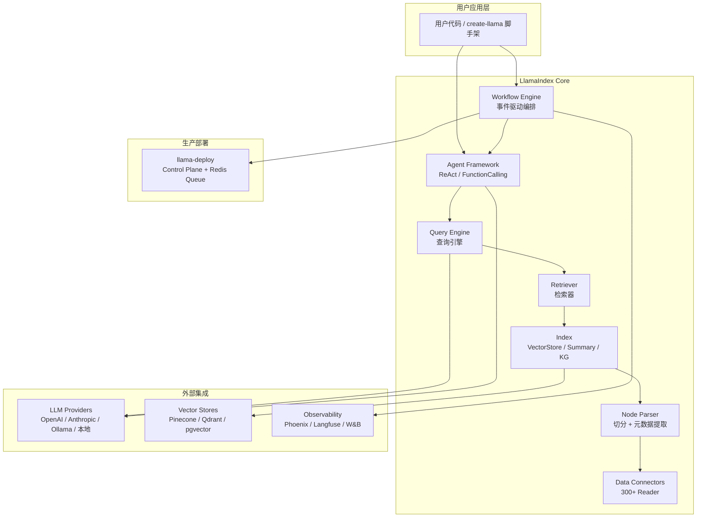
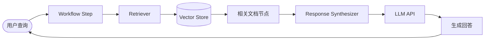
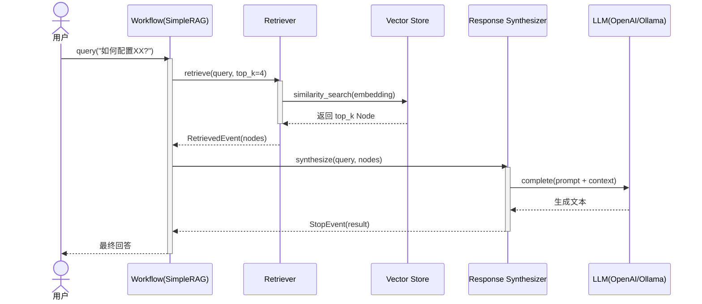
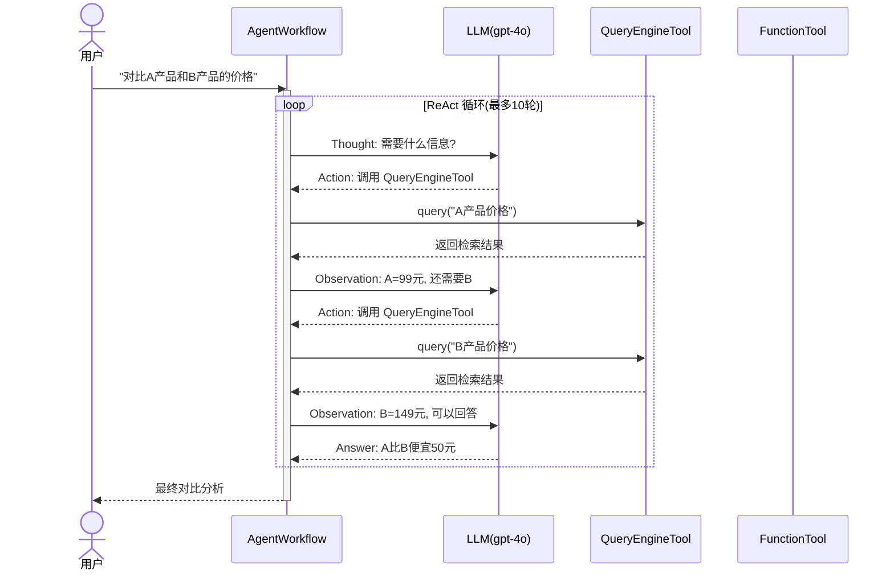
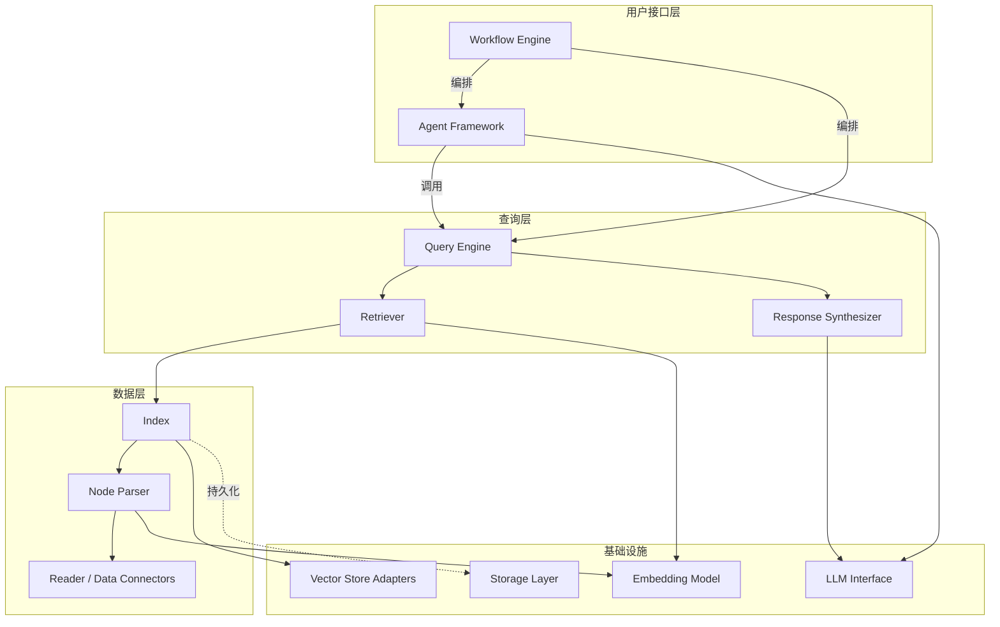

# 50k Star 背后的 LlamaIndex：从 RAG 索引库到事件驱动 AI Agent 框架的进化

> 你搭建的 RAG 管道跑通了 demo，但进到生产环境就碎了一地——文档解析丢格式、检索召回率上不去、Agent 多步调用链断在中间。这不是你代码写得差，是底层框架没给你「在正确的地方犯错和恢复」的能力。LlamaIndex 从 2022 年一个轻量索引小工具，长成了今天覆盖数据摄入、向量索引、查询引擎、Agent 编排、生产部署的全链路框架——50k Star 不是偶然堆出来的。

## 1. 项目速览

| 项目 | 内容 |
|---|---|
| 项目名称 | LlamaIndex |
| 一句话定位 | LLM 数据连接 + Agent 工作流编排框架 |
| GitHub 地址 | [run-llama/llama_index](https://github.com/run-llama/llama_index) |
| 官方网站 | https://www.llamaindex.ai |
| 主要语言 | Python |
| 技术栈 | Pydantic + asyncio + OpenTelemetry + Redis（部署） |
| 开源协议 | MIT |
| Star 数 | ⭐ 50.7k（2025-07） |
| 最新版本 | 持续滚动发布（llama-index-core 每周迭代） |
| 维护状态 | 活跃（日均 3-5 commit，周均 2+ Release） |
| 适合人群 | RAG 应用开发者、AI Agent 构建者、需要私有数据接入 LLM 的企业团队 |

## 2. 它解决了什么问题

LLM 的预训练知识是公共的、静态的、有截止日期的。你的业务数据在 PDF、SQL、API、Confluence 里——LLM 看不到。

- **数据断层**：把 PDF 扔给 ChatGPT 的 context window 撑不了几个文件，也处理不了表格嵌套和分页连续性
- **检索质量黑盒**：简单的 embedding + top-k 在长文档和多跳问答上召回率掉到 40% 以下，但你不知道问题出在切分、embedding 还是 rerank 环节
- **Agent 调度脆弱**：多步 Agent 执行到第三步失败了，重跑整条链路浪费 token；没有事件驱动的 step 隔离，一个工具调用超时拖垮整个流程

LlamaIndex 的拆解方式：把"数据 → LLM"这条链拆成可插拔的阶段——Reader（摄入）→ Node Parser（切分）→ Index（索引）→ Retriever（检索）→ Response Synthesizer（生成）→ Workflow（编排）。每一段都能独立替换、独立测试、独立观测。

## 3. 核心功能特性

### 3.1 核心能力

- **300+ 数据连接器**：通过 LlamaHub 接入 PDF、Notion、Slack、SQL、S3、Google Drive 等数据源。不是简单的文件读取——LlamaParse 对嵌套表格、图表、多栏 PDF 的解析准确率在业界评测中排第一梯队
- **多种索引结构**：VectorStoreIndex（标准向量检索）、SummaryIndex（摘要树）、KnowledgeGraphIndex（知识图谱），按场景选型。向量索引支持 30+ 后端（Pinecone / Qdrant / pgvector / Milvus / Chroma）
- **Workflow 工作流引擎**：2024-2025 年的核心演进。事件驱动 + async step + typed event，替代了早期的 Query Engine 链式组合。本质是个 pub-sub 步骤编排器，比 LangGraph 的有向图更灵活
- **Agent 体系**：ReAct Agent、FunctionCalling Agent、基于 Workflow 的 Multi-Agent 编排。工具注册走 `QueryEngineTool` / `FunctionTool`，和索引系统天然打通

### 3.2 特色设计

- **Workflow 的 pub-sub 模型**：每个 step 是一个 async 函数，通过 Python 类型标注订阅特定 Event。框架自动路由——你发一个 `RetrievedEvent`，订阅它的 step 自动触发。这比手写 if-else 调度清晰得多，也比 DAG 图灵活（允许循环和条件分支）
- **llama-deploy 生产运行时**：同一份 Workflow 代码本地调试时单进程跑，部署时通过 control plane + Redis 消息队列分布式执行。不需要为了上生产重写代码，这一点实际体验下来确实省事
- **OpenTelemetry 原生观测**：每个 step、每次 LLM 调用、每次检索都是一个 span。配合 Arize Phoenix 或 Langfuse 可以看到完整的 trace 树和 token 消耗

### 3.3 功能边界

- ✅ 适合：需要精细控制检索质量的 RAG 应用、文档密集型 AI 助手、需要多数据源联合查询的企业场景
- ❌ 不适合：只需要调一次 OpenAI API 返回结果的简单场景（用 SDK 直接调更省事）；需要复杂人工介入断点的状态机（LangGraph 的 checkpoint + human-in-the-loop 做得更成熟）
- ⚠️ 使用前确认：核心框架 MIT 协议无限制，但 LlamaParse（文档解析服务）是付费产品（免费 10k credits/月）

<!-- IMAGE_PROMPT: gpt-image2
生成一张「LlamaIndex 功能结构全景图」技术架构信息图。

布局：
- 顶部标题：LlamaIndex 功能结构全景图，副标题「LLM 数据连接 + Agent 工作流编排框架」，右上角 ⭐ 50.7k 徽章
- 左侧输入层：PDF、SQL、API、Notion、S3、Web Pages 六个输入源图标
- 中间核心层：用 5 个模块方块展示 → Data Connectors（数据连接）、Node Parsers（切分引擎）、Index & Retrieval（索引检索）、Workflow Engine（工作流引擎）、Agent Framework（Agent 框架）
- 底部支撑层：Vector Stores（向量库 30+）、LLM Providers（模型供应商）、Observability（OpenTelemetry）
- 右侧输出层：RAG 问答、文档 Agent、结构化抽取、Multi-Agent 协作

视觉风格：
- 现代技术架构图，干净克制，16:9 画幅
- 主色 #3366CC，辅色 #5B8FF9，浅色背景 #F8FAFC
- 模块间清晰箭头连接，体现从输入到输出的数据流
- 中文文字清晰可读，PingFang SC 字体
-->

## 4. 架构设计

### 4.1 整体架构



### 4.2 数据流



### 4.3 核心流程时序图

RAG 查询的完整调用链——从用户提问到拿回答案，跨越 Workflow → Retriever → VectorStore → LLM 四层：



Agent 工具调用流程——ReAct 循环中 Agent 如何决策调用哪个工具：



### 4.4 核心设计思想

- **抽象层次**：Document → Node → Index → Retriever → QueryEngine → Workflow，每一层都是可替换的接口。你可以用 VectorStoreIndex 也可以用 KnowledgeGraphIndex，上层代码不用改
- **事件驱动流程**：Workflow 中每个 step 消费特定类型的 Event 并产出新的 Event。框架根据类型注解自动路由，开发者不需要手写调度逻辑
- **Settings 全局配置**：`Settings.llm`、`Settings.embed_model` 全局设置，避免每个组件重复传参。简单场景设一次就行，复杂场景可以 per-index 覆盖

## 5. 源码深度分析

> 聚焦 `llama-index-core/llama_index/core/` 下的核心模块。这是一个大型 monorepo，300+ integration 包拆在 `llama-index-integrations/` 下，这里只分析框架骨架。

### 5.1 模块全景

| 模块 | 目录 | 核心职责 | 分析级别 |
|---|---|---|---|
| Workflow | `core/workflow/` | 事件驱动步骤编排引擎 | P0（深度） |
| Agent | `core/agent/` | ReAct/FunctionCalling Agent 实现 | P0（深度） |
| Indices | `core/indices/` | 索引构建与管理 | P0（深度） |
| Retrievers | `core/retrievers/` | 检索抽象与实现 | P1（关键流程） |
| Query Engine | `core/query_engine/` | 查询引擎组合模式 | P1（关键流程） |
| Node Parser | `core/node_parser/` | 文档切分策略 | P1（关键流程） |
| LLMs | `core/llms/` | LLM 抽象接口定义 | P1（关键流程） |
| Storage | `core/storage/` | 持久化层（docstore/indexstore/vectorstore） | P2（说明） |
| Embeddings | `core/embeddings/` | Embedding 模型抽象 | P2（说明） |
| Evaluation | `core/evaluation/` | RAG 评估指标 | P2（说明） |
| Ingestion | `core/ingestion/` | 数据摄入管道 | P2（说明） |

### 5.2 Workflow 引擎（P0）

Workflow 是 2024 年引入的核心编排原语，设计目标是取代早期的"链式 QueryEngine 组合"。

**核心抽象**：

```python
# core/workflow/workflow.py 核心结构
class Workflow:
    @step
    async def my_step(self, ev: StartEvent) -> CustomEvent:
        # 处理逻辑
        return CustomEvent(data=result)
```

- `Event`：Pydantic BaseModel，是步骤间数据传递的载体。`StartEvent` 和 `StopEvent` 标记工作流边界
- `@step` 装饰器：标记一个 async 函数为工作流步骤。框架通过检查函数参数的类型标注来确定它订阅哪种 Event
- **路由机制**：当某个 step 返回一个 Event 实例，框架扫描所有已注册 step 的参数类型，找到匹配的 step 自动触发

这个设计的 trade-off：
- 优势：比 DAG 灵活（支持循环），比手写 if-else 清晰（声明式），天然支持并行（多个 step 订阅同一 Event 则并发执行）
- 代价：调试时不如显式图直观——你得看类型标注才知道事件流向哪里。大型 Workflow 的事件图需要靠 `workflow.visualize()` 辅助理解

### 5.3 Agent 框架（P0）

Agent 现在构建在 Workflow 之上，本质上是一个预定义好 step 序列的 Workflow。

**ReAct Agent 核心循环**：

```python
# 简化的 ReAct step 逻辑
@step
async def react_step(self, ev: ActionEvent) -> ActionEvent | StopEvent:
    # 1. 组装 prompt（历史 + 工具描述 + 当前 observation）
    # 2. 调用 LLM 获取 thought + action
    # 3. 如果 action == "finish" → 返回 StopEvent
    # 4. 否则执行 tool，把结果作为 observation，返回新的 ActionEvent（触发下一轮）
```

- `FunctionTool`：把任意 Python 函数包装为 Agent 可调用的工具，自动从 docstring 提取描述
- `QueryEngineTool`：把一个 QueryEngine（背后是整条 RAG 管道）包装为工具。Agent 调用时等于跑了一次完整检索+生成
- `AgentWorkflow`：多 Agent 协作的编排层，一个"调度员" Agent 把子任务分给专家 Agent

### 5.4 Index 体系（P0）

Index 是 LlamaIndex 的命名由来，也是和 LangChain 最大的差异化点。

**VectorStoreIndex 构建流程**：

```python
# 核心创建路径
documents = SimpleDirectoryReader("data").load_data()  # Reader 返回 Document 列表
index = VectorStoreIndex.from_documents(documents)
# 内部：Document → NodeParser 切分为 Node → 计算 Embedding → 存入 VectorStore
```

**索引类型选型**：

| 索引类型 | 适用场景 | 底层实现 |
|---|---|---|
| VectorStoreIndex | 通用语义检索 | embedding + top-k ANN |
| SummaryIndex | 长文档逐段摘要 | 遍历所有 Node 逐个让 LLM 总结 |
| KnowledgeGraphIndex | 关系型问答 | 三元组抽取 + 图遍历 |
| TreeIndex | 层级结构文档 | 自底向上构建摘要树 |

设计上的关键决策：Index 持有的不是原始文档而是 Node（带元数据的文档碎片）。这样切分策略和索引策略解耦——你可以先用 SentenceSplitter 切好 Node，然后同时放进 VectorStoreIndex 和 KnowledgeGraphIndex 做混合检索。

### 5.5 Retriever 与 QueryEngine（P1）

- **Retriever** 只做一件事：给定 query，返回相关 Node 列表。`VectorIndexRetriever` 走 ANN，`KGTableRetriever` 走图查询
- **QueryEngine** = Retriever + ResponseSynthesizer。Retriever 拿到 Node 后，ResponseSynthesizer 把 Node 内容拼进 prompt 让 LLM 生成最终回答
- **RouterQueryEngine**：接多个 QueryEngine，根据 query 意图自动路由到合适的引擎。适合多数据源场景

### 5.6 模块关系全景



## 6. 竞品对比

| 维度 | LlamaIndex | LangChain / LangGraph | Haystack |
|---|---|---|---|
| 核心定位 | 数据连接 + RAG + Agent 编排 | 通用 LLM 应用框架 + 状态机 Agent | Pipeline 式 RAG 框架 |
| 编排模型 | 事件驱动 pub-sub（Workflow） | 有向图 + 状态 + 条件边（LangGraph） | Component Pipeline（DAG） |
| RAG 深度 | 原生多种索引类型 + 专用 Node 体系 | 依赖集成（需要组合多个组件） | 不错，但索引类型少于 LlamaIndex |
| 数据连接器 | 300+ via LlamaHub | 数量相当但侧重 Tool 而非 Reader | 较少，约 50+ |
| Agent 人工介入 | 支持但不如 LangGraph 成熟 | **LangGraph 的 checkpoint + human-in-the-loop 更成熟** | 有限支持 |
| 生产部署 | llama-deploy（内置 control plane） | 自己搭 FastAPI 或用 LangServe | Hayhooks |
| 观测性 | OTel 原生 + 三方集成 | LangSmith（自家 SaaS） | 支持但生态较小 |
| 学习曲线 | 中等（概念多但文档好） | 较陡（抽象层次多，API 变动快） | 相对简单 |
| GitHub Stars | 50.7k | 115k | 19k |

说实话，如果你的核心需求是"文档数据灌进去 → 高质量检索 → 生成回答"这条链路，LlamaIndex 的 Index + Retriever + NodeParser 体系确实比 LangChain 原生的文档处理更系统化。但如果你需要复杂的状态机 Agent（带断点、回退、人工审批），LangGraph 现阶段做得更好——LlamaIndex 的 Workflow 理论上能实现，但缺少成熟的 checkpoint/resume 机制。

## 7. 快速上手

```bash
# 方式一：starter 包（含常用集成）
pip install llama-index

# 方式二：最小核心 + 按需集成
pip install llama-index-core
pip install llama-index-llms-openai
pip install llama-index-embeddings-openai
```

```python
import os
os.environ["OPENAI_API_KEY"] = "sk-..."

from llama_index.core import VectorStoreIndex, SimpleDirectoryReader

documents = SimpleDirectoryReader("./data").load_data()
index = VectorStoreIndex.from_documents(documents)
query_engine = index.as_query_engine()
print(query_engine.query("这份文档的核心结论是什么？"))
```

5 行代码跑通基础 RAG。`./data` 放几个 PDF 或 txt 文件就行。

## 8. 社区热点与生态

### 8.1 关键议题

| 话题 | 讨论要点 |
|---|---|
| Workflow vs 旧 Query Engine | 社区普遍认可 Workflow 方向，但迁移成本让部分老用户犹豫。官方表态 Query Engine 继续维护但不再是推荐模式 |
| LlamaParse 定价 | 免费额度 10k credits/月覆盖个人开发者，团队用量超后按量计费。有用户认为开源框架绑定商业服务有利益冲突 |
| Monorepo 包管理 | 300+ 子包的版本协调是个痛点。用户反馈升级 core 后某些 integration 包版本不兼容的情况时有发生 |
| TypeScript 版本 | LlamaIndex.TS 独立维护，功能和 Python 版有差距。JS 生态用户选择有限 |

### 8.2 社区健康度

- **维护响应**：Issue 通常 24-48h 内有 maintainer 回复（活跃）
- **Release 节奏**：llama-index-core 几乎每周发布，integration 包按需更新
- **文档质量**：官方文档近期重写过，结构清晰，示例丰富。比 2023 年时期改善很多
- **生态广度**：LlamaHub 300+ 连接器 + create-llama 脚手架 + llama-deploy 部署方案 + LlamaCloud 托管服务

## 9. 深度总结

LlamaIndex 在 2024-2025 年完成了从"RAG 索引库"到"Agent Workflow 框架"的关键转型。Workflow 引擎是这个转型的核心产物——它用事件驱动 + 类型路由的方式解决了早期 Query Engine 组合的僵硬问题，同时通过 llama-deploy 给出了从本地开发到分布式部署的完整路径。

我的判断是：

- **选 LlamaIndex 的场景**：你的应用核心价值在"数据质量"——文档解析准确率、检索召回率、多源数据联合查询。LlamaIndex 的 Index 体系 + Node 抽象 + 300+ 连接器在这条链路上积累最深
- **不选的场景**：你只需要一个轻量的 LLM wrapper 调 API（直接用 openai SDK）；你的 Agent 需要复杂状态持久化和人工审批流（目前 LangGraph 更成熟）
- **值得关注的风险**：框架演进快，API 会变。2024 年的教程代码放到 2025 年可能需要迁移。monorepo 下 300+ 包的版本依赖管理偶尔会踩坑

作为 RAG + Agent 框架赛道上关注度最高的项目之一（50.7k Star），LlamaIndex 的方向判断没问题——从数据连接起步积累用户，用 Workflow 承接 Agent 趋势，用 LlamaCloud/LlamaParse 变现。对开发者来说，如果你做的是文档密集型 AI 应用，这是目前 Python 生态里 ROI 最高的框架选择。

<!-- IMAGE_PROMPT: gpt-image2
生成一张 LlamaIndex 封面图。

画面描述：
- 中心意象：一只穿着图书管理员服装的赛博朋克风格羊驼（Llama），站在一座由数据流构成的圆形图书馆中央
- 羊驼手持发光的索引卡片，周围环绕着 PDF、数据库、API 接口等数据源图标以光束形式汇聚过来
- 图书馆的书架上不是书，而是向量数据库的几何晶体结构
- 左上角有一个 ⭐ 50.7k 星标徽章
- 底部有淡色文字 "LlamaIndex — The Data Framework for LLM Applications"

视觉风格：
- 16:9 画幅
- 科技蓝紫配色（#3366CC 主色 + #8B5CF6 辅色）
- 微光粒子效果，有深度和层次感
- 兼具技术感和趣味性
-->
