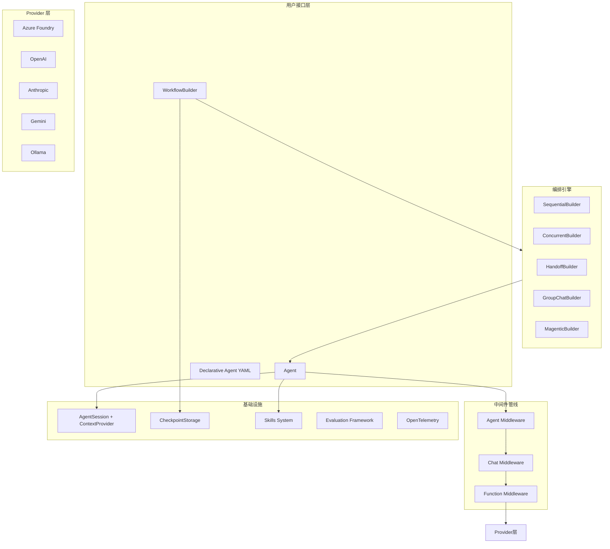
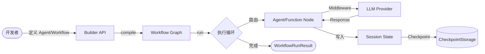
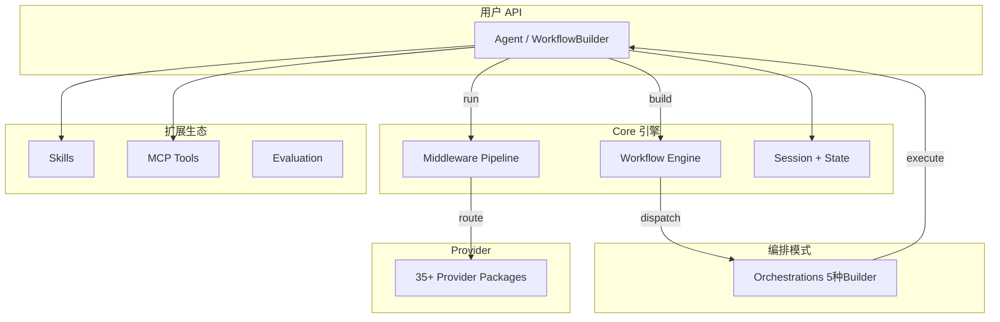
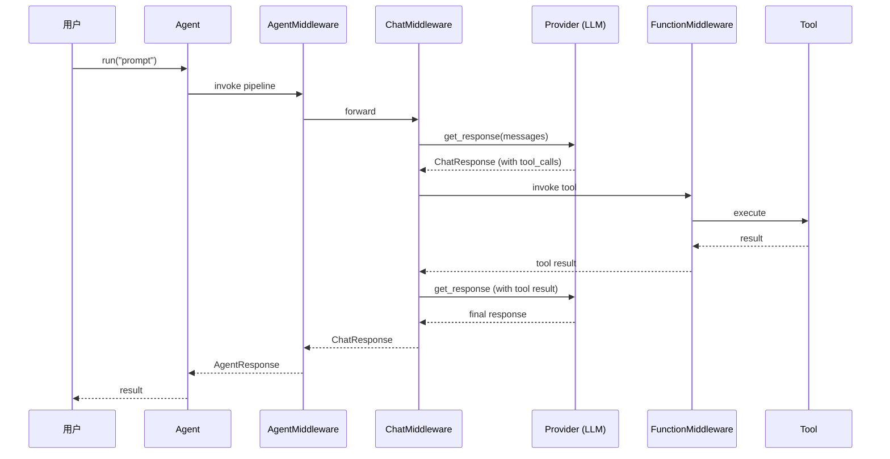

# 深度剖析 Microsoft Agent Framework：微软把 AutoGen 和 Semantic Kernel 合二为一了

> 你的团队一边用 Semantic Kernel 做企业级 Agent，一边用 AutoGen 跑多 Agent 实验。两套 API、两种思维模型、两份维护成本。微软的解法是：把两者合并成一个框架，同时补上图工作流、持久化、多语言支持——这就是 Microsoft Agent Framework（MAF）。

## 1. 项目速览

| 项目 | 内容 |
|---|---|
| 项目名称 | Microsoft Agent Framework (MAF) |
| 一句话定位 | Python + .NET 双语言、生产级 AI Agent 与多 Agent 工作流框架 |
| GitHub 地址 | [microsoft/agent-framework](https://github.com/microsoft/agent-framework) |
| 官方网站 | https://learn.microsoft.com/en-us/agent-framework/ |
| 主要语言 | Python + C#/.NET |
| 技术栈 | Azure Foundry / OpenAI / Anthropic / Ollama + Graph Workflow + OpenTelemetry |
| 开源协议 | MIT |
| Star 数 | ⭐ 11.9k（2025-07） |
| 最新版本 | 持续发布（pip install agent-framework） |
| 维护状态 | 活跃开发（AutoGen + Semantic Kernel 的直接继任者） |
| 适合人群 | 需要多语言（Python/.NET）、多 Provider、生产级编排的企业 Agent 开发团队 |

## 2. 它解决了什么问题

微软在 Agent 领域之前有两个独立项目，各自解决一半问题：

- **Semantic Kernel**：企业级特性齐全（类型安全、中间件、遥测、Session 管理），但多 Agent 编排能力薄弱
- **AutoGen**：多 Agent 协作模式丰富（GroupChat、Handoff），但缺乏生产级基础设施（持久化、中间件、状态管理）

开发团队被迫二选一，或者两个都用然后自己搭桥。MAF 的定位很明确：**把 AutoGen 的 Agent 抽象 + Semantic Kernel 的企业特性 + 全新的图工作流引擎合成一个框架**。

另外一个实际痛点：Python 团队和 .NET 团队各写各的 Agent，API 完全不同，协作困难。MAF 在两种语言上提供一致的 API 设计。

## 3. 核心功能特性

### 3.1 核心功能

- **Agent 抽象**：`Agent` 类封装 LLM 调用 + 工具 + 指令，`agent.run("prompt")` 一行代码得到结果。支持流式 `ResponseStream`
- **Graph-based Workflow**：`WorkflowBuilder` 构建带类型安全路由的图工作流，支持 FanIn/FanOut/SwitchCase 边类型、检查点、Human-in-the-Loop
- **5 种编排模式**：Sequential（串行链）、Concurrent（扇出并行）、Handoff（去中心化路由）、GroupChat（orchestrator 主导）、Magentic（Magentic One 复杂协作）
- **三层中间件**：Agent 层（拦截 agent.run 前后）→ Chat 层（拦截 LLM 调用）→ Function 层（拦截工具执行），每层独立配置

### 3.2 特色能力

- **35+ Python 子包**：core、foundry、openai、anthropic、claude、gemini、ollama、bedrock、mistral……每个 Provider 独立包，按需安装。`pip install agent-framework` 一把全装
- **Declarative Agent（YAML 声明式）**：用 YAML 文件定义 Agent 的 instructions、tools、provider，版本化管理无需改代码
- **内置评估框架**：`evaluate_agent()` / `evaluate_workflow()` 原生支持 rubric 评分、工具调用检查、关键词匹配
- **Agent Skills 系统**：从文件、代码、Class、MCP Server 多种来源组合知识库，Agent 动态发现和使用
- **Durable Extension**：集成 Azure Durable Functions，Agent 会话和 Workflow 步骤可持久化执行

### 3.3 功能边界

- ✅ 适合：企业级多 Agent 生产系统、需要 Python/.NET 双语言一致性、需要 Azure 生态深度集成
- ❌ 不适合：只需简单 prompt → response 的脚本（框架太重）；纯研究性实验且不需要生产特性
- ⚠️ 使用前确认：与 Azure Foundry 集成最顺滑，非 Azure 环境需自行配 Provider；框架较新，社区生态还在建设中

<!-- IMAGE_PROMPT: gpt-image2
生成一张「Microsoft Agent Framework 功能结构全景图」信息图。

布局：
- 顶部标题：Microsoft Agent Framework (MAF) 功能全景 + 副标题「AutoGen + Semantic Kernel → 统一框架」+ ⭐ 11.9k 徽章
- 左侧输入层：Agent 定义（Code / YAML / Skills）、用户请求
- 中间核心层 6 模块：Agent Core（LLM + Tools） → Middleware 三层管线 → Workflow Engine（Graph Builder） → Orchestrations（5种编排模式） → Session & Checkpoint → Evaluation
- 底部支撑层：Provider 生态（Azure/OpenAI/Anthropic/Gemini/Ollama/Bedrock/Mistral）、Durable Task、OpenTelemetry、A2A Protocol
- 右侧输出层：流式响应 / 工作流结果 / 评估报告 / DevUI 调试

视觉风格：
- 现代技术架构图，干净克制，16:9 画幅
- 主色 #3366CC，辅色 #5B8FF9，浅色背景
- 模块间清晰箭头连接
- 中文文字清晰可读，PingFang SC 字体
-->

## 4. 架构设计

### 4.1 整体架构



### 4.2 数据流



### 4.3 核心设计思想

- **Protocol 而非继承**：`SupportsChatGetResponse`、`SupportsAgentRun` 等 Protocol 定义能力契约，Provider 只需实现接口，不强制继承基类。这让第三方 Provider 接入成本极低
- **三层中间件分离关注点**：Agent 层管审批/限流、Chat 层管 prompt 注入/缓存、Function 层管工具调用拦截——三层独立配置互不干扰
- **图 + Builder = 声明式编排**：WorkflowBuilder 声明节点和边，编译时做连通性验证（`validate_workflow_graph`），运行时通过 Executor 调度。比命令式编排更容易推理正确性

## 5. 社区热点（Issues 分析）

### 5.1 精选 Issue

| # | 标题 | 讨论要点 | 状态 |
|---|---|---|---|
| [#4842](https://github.com/microsoft/agent-framework/issues/4842) | Agent Identity and Trust for Multi-Agent Workflows | 多 Agent 场景下的身份认证和信任机制设计 | Open |
| [#2084](https://github.com/microsoft/agent-framework/issues/2084) | DevUI limitation should be documented | DevUI 功能限制需要明确文档化 | Open |
| [#2694](https://github.com/microsoft/agent-framework/issues/2694) | MAF Feature: Automatic ContextId Propagation for A2A | A2A 协议中自动传播 ContextId | Closed |
| [#1305](https://github.com/microsoft/agent-framework/issues/1305) | .NET: Latest release changes WorkflowBuilder API | WorkflowBuilder API 在新版本中 breaking change | Closed |
| [#726](https://github.com/microsoft/agent-framework/issues/726) | .NET Improve Tool Assignment | 工具分配给 Agent 的方式需要优化 | Closed |

### 5.2 社区健康度

- **维护响应**：微软内部团队维护，Issue 标签体系完善（.NET/Python/agents/workflows/observability），大多数 Issue 一周内有回应
- **Release 节奏**：频繁更新，Python 包通过 PyPI 持续发布
- **社区参与**：Discord 社区 + 每周 Office Hours，对外贡献开放
- **文档完整度**：官方 learn.microsoft.com 文档完整，包含迁移指南（从 Semantic Kernel 和 AutoGen）

## 6. 竞品对比

| 维度 | Microsoft Agent Framework | LangGraph | CrewAI |
|---|---|---|---|
| 核心定位 | 企业级多语言 Agent 框架 | 底层图编排引擎 | 高层多角色协作框架 |
| 语言支持 | Python + .NET（一致 API） | Python + TS | Python |
| Provider 数量 | 10+（Azure/OpenAI/Anthropic/Gemini/Ollama/Bedrock/Mistral/Claude） | 通过 LangChain 集成 | 通过 LiteLLM |
| 编排模式 | 5 种 Builder（Sequential/Concurrent/Handoff/GroupChat/Magentic） | 自定义 Graph（BSP 模型） | Role/Task/Crew |
| 中间件 | 三层分离（Agent/Chat/Function） | 无原生中间件 | 无 |
| 持久化 | Checkpoint + Durable Task | Checkpoint | 无 |
| 评估 | 内置 evaluate_agent/evaluate_workflow | 无内置 | 无内置 |
| 学习曲线 | 中等（概念清晰但包多） | 高（Graph/Channel/Pregel） | 低 |
| 企业就绪度 | 高（微软维护 + Azure 集成） | 中（LangChain 生态） | 低（更适合 Demo） |

MAF 相比 LangGraph 的优势在**企业特性齐全**和**多语言一致性**；LangGraph 在底层控制粒度（BSP 隔离、Channel 类型系统）上更精细。如果你的团队有 .NET 开发者，或者需要 Azure 原生集成，MAF 是更自然的选择。如果你只写 Python 且需要极致的执行模型控制，LangGraph 更合适。

## 7. 快速上手

```bash
pip install agent-framework
```

```python
import asyncio
from agent_framework import Agent
from agent_framework.foundry import FoundryChatClient
from azure.identity import AzureCliCredential

async def main():
    agent = Agent(
        client=FoundryChatClient(credential=AzureCliCredential()),
        name="MyAgent",
        instructions="You are a helpful assistant.",
    )
    result = await agent.run("What is 2+2?")
    print(result)

asyncio.run(main())
```

非 Azure 用户可以用 OpenAI 或 Ollama Provider：

```python
from agent_framework.openai import OpenAIChatClient
client = OpenAIChatClient(api_key="sk-...")
```

## 8. 源码深度分析

> 本次聚焦 Python 端 core 包。核心 `__init__.py` 导出 649 行符号，涵盖 11 个子模块。我重点分析了 Agent 抽象、Workflow 引擎、Middleware 管线三个核心模块。

### 8.1 模块全景

| 模块 | 目录 | 核心职责 | 分析级别 |
|---|---|---|---|
| Agent 抽象 | `core/_agents/` | Agent/BaseAgent/RawAgent 生命周期 | P0 深度 |
| Workflow 引擎 | `core/_workflows/` | WorkflowBuilder + Graph 编排 + Checkpoint | P0 深度 |
| Middleware | `core/_middleware/` | 三层拦截管线 | P0 深度 |
| Sessions | `core/_sessions/` | 状态管理 + ContextProvider | P1 关键流程 |
| Skills | `core/_skills/` | 多源知识库组装 | P1 关键流程 |
| Tools | `core/_tools/` | FunctionTool + 调用配置 | P1 关键流程 |
| MCP | `core/_mcp/` | Stdio/HTTP/WebSocket 三种 MCP 连接 | P2 说明 |
| Evaluation | `core/_evaluation/` | Agent/Workflow 自动化评测 | P2 说明 |
| Compaction | `core/_compaction/` | 上下文窗口压缩策略 | P2 说明 |
| Orchestrations | `orchestrations/` | 5 种编排 Builder 模式 | P0 深度 |
| Provider 层 | `packages/{provider}/` | 35+ 独立 Provider 包 | P2 说明 |



### 8.2 核心模块剖析：Agent 抽象

**定位**：用户最常接触的入口。一个 Agent = 一个 LLM Client + instructions + tools + middleware。调用 `agent.run(prompt)` 触发完整管线。

**核心类与接口**：

| 类/接口 | 核心方法 | 设计说明 |
|---|---|---|
| `Agent` | `run()`, `stream()` | 高层 Agent，内置 session 管理和中间件 |
| `BaseAgent` | — | 抽象基类，定义 Agent 生命周期 |
| `RawAgent` | — | 无 session/middleware 的轻量版本 |
| `SupportsAgentRun` | `run()` | Protocol，定义 Agent 能力契约 |
| `BaseChatClient` | `get_response()` | LLM 调用抽象，每个 Provider 实现此接口 |

**关键设计**：

```python
# Agent 的核心签名 — 极简的用户 API
agent = Agent(
    client=SomeChatClient(...),    # 任意 Provider
    name="MyAgent",
    instructions="...",
    tools=[my_tool],               # FunctionTool 列表
    middleware=[my_middleware],     # 可选中间件
)
result = await agent.run("user input")  # 触发完整管线
```

设计选择：`Agent` 不继承 `BaseChatClient`，而是**组合**一个 client。这样换 Provider 只换一行构造参数，Agent 逻辑不变。

### 8.3 核心模块剖析：Workflow 引擎

**定位**：图编排的核心。`WorkflowBuilder` 声明节点/边 → 编译时验证 → 运行时由 Executor 调度。

**Edge 类型系统**：

| 类型 | 用途 | 场景 |
|---|---|---|
| `SingleEdgeGroup` | A → B 一对一 | 顺序执行 |
| `FanOutEdgeGroup` | A → [B, C, D] 扇出 | 并行执行 |
| `FanInEdgeGroup` | [B, C, D] → E 汇聚 | 等待所有完成后继续 |
| `SwitchCaseEdgeGroup` | 条件路由 | 根据状态走不同分支 |

**关键代码解读**：

```python
# 文件：core/_workflows/_workflow_builder.py
# WorkflowBuilder 声明式构图 + 编译时验证

from agent_framework import WorkflowBuilder, FunctionExecutor, executor

builder = WorkflowBuilder()
builder.add_node("classify", classify_executor)
builder.add_node("handle_a", handle_a_executor)
builder.add_node("handle_b", handle_b_executor)

# SwitchCase 条件路由
builder.add_edge("classify", cases=[
    Case(condition=lambda ctx: ctx.state["type"] == "a", target="handle_a"),
    Case(condition=lambda ctx: ctx.state["type"] == "b", target="handle_b"),
])

workflow = builder.build()  # 编译时调用 validate_workflow_graph()
result = await workflow.run(initial_state)
```

**`validate_workflow_graph()` 编译时验证**：检测 `EdgeDuplicationError`（重复边）、`GraphConnectivityError`（孤立节点）、`TypeCompatibilityError`（类型不匹配）。比运行时报错省很多调试时间。

### 8.4 核心模块剖析：三层中间件

**设计理念**：请求从 Agent 层进入 → Chat 层 → Function 层，每层可独立拦截、修改、终止。

```python
# 三层中间件各司其职的例子：
from agent_framework import agent_middleware, chat_middleware, function_middleware

@agent_middleware
async def approval_gate(context, next):
    """Agent 层：人工审批卡点"""
    if needs_approval(context.input):
        await wait_for_human_approval()
    return await next(context)

@chat_middleware
async def prompt_injection_guard(context, next):
    """Chat 层：拦截 prompt 注入攻击"""
    if detect_injection(context.messages):
        raise MiddlewareTermination("Blocked")
    return await next(context)

@function_middleware
async def tool_cost_limiter(context, next):
    """Function 层：工具调用花费限制"""
    if context.estimated_cost > budget:
        return fallback_response()
    return await next(context)
```

这个分层设计的 trade-off：灵活但多了认知负担——开发者需要理解"我的逻辑应该放哪一层"。不过比单层拦截（如 LangGraph 的 interrupt）表达力强得多。

### 8.5 核心流程追踪

#### 流程 1：单 Agent 执行 `agent.run("prompt")`

```text
用户 await agent.run("prompt")
  → AgentMiddleware pipeline         // Agent 层中间件链
    → ChatMiddleware pipeline         // Chat 层中间件链
      → BaseChatClient.get_response() // 调用 LLM Provider
        → [如有 tool_calls]
          → FunctionMiddleware pipeline  // Function 层中间件
            → FunctionTool.invoke()      // 执行工具
          → 重新调用 LLM（带工具结果）
    ← ChatResponse
  ← AgentResponse (包含 messages + usage)
```



#### 流程 2：Workflow 多 Agent 编排

```text
用户 workflow.run(initial_state)
  → WorkflowBuilder.build() 已验证图结构
  → Executor 按图路由
    → Node 1 (AgentExecutor): agent_1.run(state)
    → Edge (SwitchCase): 根据 state 条件选择下一节点
    → Node 2 (FunctionExecutor): pure function
    → Edge (FanOut): 并行发给 Node 3a, 3b
    → FanIn: 等待汇聚
    → CheckpointStorage.save(state)  // 每步持久化
  ← WorkflowRunResult
```

### 8.6 设计模式与技术亮点

| 设计模式 | 使用位置 | 解决的问题 |
|---|---|---|
| Protocol（结构化子类型） | `_clients/`, `_agents/` | Provider 解耦，无需继承 |
| Builder + 编译验证 | `_workflows/_workflow_builder.py` | 声明式构图 + 早期错误发现 |
| 三层 Pipeline | `_middleware/` | 关注点分离，各层独立配置 |
| 策略模式 | `_compaction/` | 6 种上下文压缩策略可组合 |
| Lazy Import | `__init__.py __getattr__` | 35+ 子包按需加载，减少启动时间 |

### 8.7 代码质量观察

- **类型安全**：全面使用 `Protocol`、`Generic`、`TypeVar`，`__all__` 导出 280+ 符号但组织清晰
- **错误处理**：自定义异常体系（WorkflowCheckpointException / WorkflowConvergenceException / MiddlewareException）
- **测试覆盖**：每个 sample 目录有独立 README + 可运行示例
- **文档化**：core 包顶层 docstring 清晰说明架构分层和 lazy-load 机制
- **依赖管理**：35+ 子包独立发布，核心包零外部依赖（可选包通过 extras 安装）

## 9. 安装与集成

### 环境要求

| 项目 | 要求 |
|---|---|
| Python | ≥ 3.10 |
| .NET | ≥ .NET 8 |
| 认证 | Azure CLI (`az login`) 或 API Key |

### 多种安装方式

```bash
# 全量安装
pip install agent-framework

# 仅核心 + OpenAI
pip install agent-framework-core agent-framework-openai

# .NET
dotnet add package Microsoft.Agents.AI
```

## 10. 社区声量

### 英文社区

- Microsoft 官方 YouTube 有 30 分钟完整介绍视频 + 每周的 Deep Dive 系列
- Udemy 上已有 "Microsoft Agent Framework Fundamentals" 付费课程
- Reddit r/AutoGenAI 讨论活跃，社区在适应从 AutoGen 迁移的过程中
- 主要评价：概念清晰、Provider 丰富、但生态还比不上 LangChain

### 中文社区

- 知乎专栏有教程（"Microsoft Agent Framework 使用教程"）
- 腾讯云开发者社区："微软开源 Microsoft Agent Framework = Semantic Kernel + AutoGen"
- 博客园有 Agent Skills 集成实战分享
- 整体关注度在上升，但中文原创深度分析仍较少

## 11. 深度总结

### 项目定位与价值判断

MAF 做了一件正确的事：把分裂的 Agent 生态（Semantic Kernel vs AutoGen）统一起来。从源码看，三层中间件设计有明确的企业级思维，Protocol-based Provider 接口让第三方接入成本很低，图工作流的编译时验证体现了工程质量意识。

但这个框架有个潜在风险：它同时是 AutoGen 和 Semantic Kernel 两个社区的继任者，需要同时满足两拨用户的期望。从 Issue 看，API 变动频率较高（#1305 WorkflowBuilder API 改动），生态还在快速演进中。

### 技术架构评价

| 维度 | 评价 | 依据 |
|---|---|---|
| 架构合理性 | 优秀 | Protocol 解耦 + 三层中间件 + Builder 验证，层次清晰 |
| 代码质量 | 高 | 全面类型注解、自定义异常体系、280+ 符号但模块化清晰 |
| 可扩展性 | 优秀 | 35+ 独立 Provider 包 + Skill 系统 + MCP 集成 |
| 维护友好度 | 中上 | 子包独立发布好，但 API 变动较频繁（框架仍在收敛期） |
| 性能意识 | 好 | Lazy import、流式响应、上下文压缩 6 种策略 |

### 适用场景与边界

- ✅ **最适合**：企业团队同时有 Python + .NET 开发者，需要统一 Agent 框架
- ✅ **也适合**：需要 Azure 深度集成的生产 Agent 系统（Foundry、Durable Functions）
- ⚠️ **勉强可用**：纯 Python 且不用 Azure 的小团队——框架能跑但不如 LangGraph/CrewAI 轻便
- ❌ **不适合**：简单的一问一答脚本、不需要编排的批量推理

### 与同类项目的本质差异

MAF 的独特价值在于**微软背书 + 双语言 + 企业特性全家桶**。它不像 LangGraph 那样追求底层执行模型的学术优雅（BSP），也不像 CrewAI 那样追求极简的角色声明。MAF 追求的是：**让企业 Agent 团队能在统一框架下，从原型一路走到生产**。

### 我的建议

- **对于 Azure 用户**：MAF 是首选。Foundry 集成只需 2 行代码额外配置，Durable Extension 解决持久化，OpenTelemetry 解决可观测性
- **对于纯 Python 开发者**：如果你不用 .NET 也不用 Azure，LangGraph 或 CrewAI 可能更轻量。但如果你需要三层中间件和内置评估框架，MAF 有独到优势
- **对于从 AutoGen/Semantic Kernel 迁移的团队**：官方有迁移指南，建议尽早迁移——两个老项目都进入了维护模式
- **源码学习价值**：三层中间件的设计模式、Protocol-based Provider 接入、WorkflowBuilder 编译时验证——这三块对设计可扩展框架很有参考

---

> 📌 项目地址：https://github.com/microsoft/agent-framework
> 👤 作者：Microsoft ｜ 💻 语言：Python + C#/.NET ｜ 📜 License：MIT

<!-- IMAGE_PROMPT: gpt-image2
生成一张「Microsoft Agent Framework 封面图」。

画面主体：一个精密的多层齿轮系统，从左到右有三组齿轮联动——代表 Agent Layer → Middleware Pipeline → Workflow Engine。齿轮之间有光线流动连接。最上方有一把钥匙正在插入（代表 Provider 接入的简洁性）。

左上角：⭐ 11.9k Stars 徽章
右下角：Microsoft Agent Framework 文字，白色 Segoe UI 字体
底部标语：「AutoGen + Semantic Kernel → One Framework」

画面传达：精密的工程设计 + 多层联动 + 开放接入
宽高比：16:9
色调：微软蓝 (#0078D4) 为主色，深灰 (#1e293b) 背景，齿轮用金属银色质感，光线流动用浅蓝色
-->
