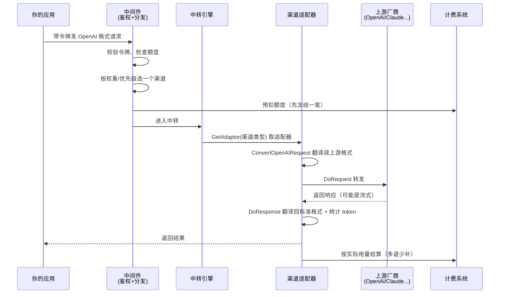
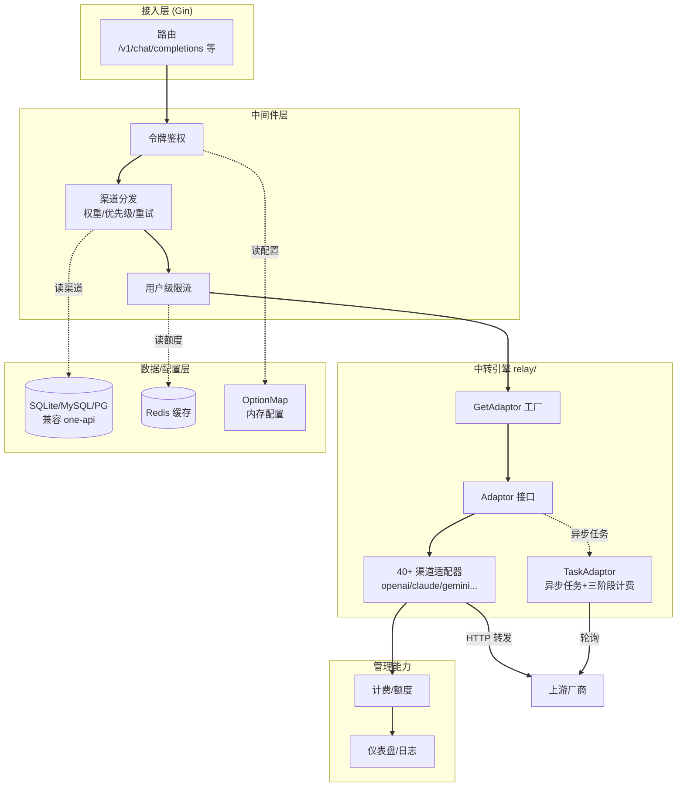

# New API 源码解剖：一个入口接住 40 多家大模型，它是怎么做到的？

> 一句话概括：New API 是个"大模型总机"——你的程序只会说 OpenAI 那一套 API，它在中间帮你翻译、转发到 OpenAI/Claude/Gemini/DeepSeek 等 40 多家上游，还顺手管好了令牌、限流、计费和账单。

## 先看一眼这个项目

| 项目 | 信息 |
|---|---|
| 仓库 | [QuantumNous/new-api](https://github.com/QuantumNous/new-api) |
| Star | 约 42.5k，Fork 约 9.9k（相当热门） |
| 出品 | QuantumNous，基于 songquanpeng/one-api 二次开发 |
| 语言 | Go（后端 Gin）+ React（前端） |
| 协议 | AGPL-3.0（比较严格，改了要开源 + 保留署名） |
| 部署 | Docker / Docker Compose，SQLite / MySQL / PostgreSQL |
| 文档 | [docs.newapi.pro](https://docs.newapi.pro)（多语言，还接了 DeepWiki） |

先说清楚一个背景：New API 不是从零写的，它是在老牌项目 **one-api**（34k+ star）基础上二次开发的增强版，数据库完全兼容 one-api。所以你会看到它俩长得很像，New API 主要多了现代化 UI、更多上游、更细的计费和更多授权登录方式。这点它 README 里写得很坦诚，没藏着。

## 它到底解决什么问题？

假设你在做一个 AI 产品，接了 OpenAI。用着用着你发现几个头疼事：

- **想加个 Claude 做备用**——但 Claude 的 API 格式和 OpenAI 不一样，你得改代码、加一套 SDK。
- **想让国产便宜模型跑简单任务、贵模型跑难任务**——又得在业务代码里写一堆路由判断。
- **OpenAI 这个 key 额度快用完了，想自动切到另一个 key**——还得自己写重试和切换逻辑。
- **团队十几个人共用，想知道谁花了多少钱、给每人限个额**——你几乎要自己做一套计费系统。

这些事跟你的核心业务毫无关系，但每一件都很烦。New API 的思路是：**把这些脏活累活全接管了，对你只暴露一个统一的 OpenAI 格式入口。**

你的代码里 `base_url` 从 `api.openai.com` 换成你自己部署的 New API 地址，其它一行不改。然后：

- 想接哪家上游，在后台配个"渠道"就行，代码无感知。
- 格式不一样？New API 自动把你的 OpenAI 请求翻译成 Claude/Gemini 的格式，再把响应翻译回来。
- key 挂了？自动重试、按权重切到别的渠道。
- 计费、限额、账单、仪表盘？后台点点鼠标就配好了。

说白了，它是横在你的应用和一堆大模型厂商之间的**中转层 + 管理后台**。

## 核心设计：中转（Relay）+ 适配器（Adaptor）

理解 New API，抓住一条主线：**一个请求进来，怎么被翻译并转发出去。** 这条线的核心在 `relay/`（中转引擎）目录里，两个关键角色：

- **Adaptor（适配器）**：每一家上游厂商，都有一个自己的适配器，负责"怎么跟这家厂商打交道"。
- **GetAdaptor（适配器工厂）**：根据当前渠道类型，挑出对应的那个适配器。

这就是经典的**适配器模式 + 工厂模式**组合。下面拆源码看它怎么落地。

## 源码深挖之一：适配器接口，一张"所有厂商都得遵守的合同"

先看这张"合同"——`relay/channel/adapter.go` 里的 `Adaptor` 接口（精简后）：

```go
type Adaptor interface {
    Init(info *relaycommon.RelayInfo)
    GetRequestURL(info *relaycommon.RelayInfo) (string, error)      // 这家厂商的请求地址长啥样
    SetupRequestHeader(c, req, info) error                          // 请求头怎么设（鉴权等）
    ConvertOpenAIRequest(c, info, request) (any, error)             // 把 OpenAI 格式翻译成这家的格式
    ConvertClaudeRequest(c, info, request) (any, error)             // Claude 格式入口也能翻
    ConvertGeminiRequest(c, info, request) (any, error)             // Gemini 格式入口也能翻
    DoRequest(c, info, requestBody) (any, error)                    // 真正发出去
    DoResponse(c, resp, info) (usage any, err *types.NewAPIError)   // 把响应翻译回标准格式 + 算用量
    GetModelList() []string                                         // 这家支持哪些模型
    GetChannelName() string
}
```

这个接口把"跟一家大模型厂商打交道"这件事，拆成了几个标准动作：**拼地址 → 设请求头 → 翻译请求 → 发送 → 翻译响应**。任何厂商想接进来，就得实现这几个方法。

这就像**万能插座转换头**：世界各国插座形状五花八门（各家 API 格式不同），但只要每个国家配一个转换头（Adaptor），你的插头（OpenAI 格式的请求）就能插进任何插座。而这个接口，就是"转换头必须长成什么样"的规范。

好处很直接：**新加一家厂商，不用动任何主流程代码，只要新写一个实现了 Adaptor 接口的目录就行。** 目前 `relay/channel/` 下已经有 openai、claude、gemini、ali、baidu、deepseek、zhipu、xai、moonshot……30 多个厂商目录，每个都是一个独立适配器。

## 源码深挖之二：适配器工厂，前台按需"叫翻译"

有了这么多适配器，运行时怎么挑对的那个？看 `relay/relay_adaptor.go` 的 `GetAdaptor` 函数（节选）：

```go
func GetAdaptor(apiType int) channel.Adaptor {
    switch apiType {
    case constant.APITypeAli:
        return &ali.Adaptor{}
    case constant.APITypeAnthropic:
        return &claude.Adaptor{}
    case constant.APITypeGemini:
        return &gemini.Adaptor{}
    case constant.APITypeOpenAI:
        return &openai.Adaptor{}
    case constant.APITypeDeepSeek:
        return &deepseek.Adaptor{}
    // ... 40 多个 case ...
    }
    return nil
}
```

一个 `switch` 搞定：传入渠道类型，返回对应的适配器实例。这就是**工厂模式**——调用方（中转主流程）只管说"我要一个能处理 apiType 的适配器"，不关心具体是哪个类。

有个细节很有意思：`APITypeOpenRouter`、`APITypeXinference` 这几个都返回 `&openai.Adaptor{}`。因为这些厂商本身就兼容 OpenAI 格式，直接复用 OpenAI 适配器就行，不用重复造轮子。`moonshot` 甚至注释写着"用 Claude API"——能复用就复用，这是很务实的工程取舍。

## 源码深挖之三：一个适配器内部有多少"脏活"

接口和工厂都很干净，但真正的复杂度藏在每个适配器的实现里。看 OpenAI 适配器的 `GetRequestURL`（`relay/channel/openai/adaptor.go`），光是"拼一个请求地址"就有一堆分支：

```go
func (a *Adaptor) GetRequestURL(info *relaycommon.RelayInfo) (string, error) {
    // 实时对话（Realtime）要把 https 换成 wss（WebSocket）
    if info.RelayMode == relayconstant.RelayModeRealtime { ... "wss://" ... }

    switch info.ChannelType {
    case constant.ChannelTypeAzure:
        // Azure 的地址完全不同：要拼 api-version、要处理 responses API、
        // 2025年5月10日前创建的渠道还要把模型名里的点去掉……
        apiVersion := info.ApiVersion
        requestURL = fmt.Sprintf("%s?api-version=%s", requestURL, apiVersion)
        // ...一堆 Azure 特有的兼容处理...
    }
}
```

再看 `DoResponse`——处理响应时，它得按"这次是什么类型的请求"分发到不同处理器：

```go
func (a *Adaptor) DoResponse(c, resp, info) (usage any, err *types.NewAPIError) {
    switch info.RelayMode {
    case relayconstant.RelayModeAudioSpeech:      // 语音合成
        usage = OpenaiTTSHandler(c, resp, info)
    case relayconstant.RelayModeImagesGenerations: // 画图
        usage, err = OpenaiImageHandler(c, info, resp)
    case relayconstant.RelayModeRerank:            // 重排
        usage, err = common_handler.RerankHandler(c, info, resp)
    default:
        if info.IsStream {                          // 流式（打字机效果）
            usage, err = OaiStreamHandler(c, info, resp)
        } else {
            usage, err = OpenaiHandler(c, info, resp)  // 普通对话
        }
    }
}
```

**这段代码说明了一个道理：适配器模式的价值，就是把这些"每家都不一样、每种请求都不一样"的脏活，全部关进各自的盒子里。** 主流程永远只调 `adaptor.GetRequestURL()`、`adaptor.DoResponse()` 这几个统一方法，至于 Azure 的 api-version 有多恶心、流式和非流式怎么区别处理，都是适配器自己的事，不会污染上层。这就是为什么它能接住 40 多家还不乱。

## 一次对话请求的完整流转

把上面几块串起来，看一次 `POST /v1/chat/completions` 是怎么走完全程的：



**关键决策点**：
- **选渠道**：支持按权重随机 + 优先级，一个渠道挂了自动重试下一个（README 里的"Channel weighted random / Automatic retry on failure"）。
- **预扣再结算**：先冻结一笔预估额度，请求完成后按真实 token 用量多退少补——避免了"先用后付、用户欠费跑路"的问题。

## 源码深挖之四：异步任务的三阶段计费

对话请求是同步的（等着拿结果），但画图、视频、音乐这类任务是**异步**的——提交后要轮询等半天。这类上游走的是另一套 `TaskAdaptor` 接口，它的计费设计很讲究，分三阶段（源码注释写得很清楚）：

```go
type TaskAdaptor interface {
    // ① 预估：根据用户请求（时长、分辨率）先预扣一笔
    EstimateBilling(c, info) map[string]float64
    // ② 提交后调整：上游返回的实际参数可能和预估不同，据实调整
    AdjustBillingOnSubmit(info, taskData) map[string]float64
    // ③ 完成时结算：任务跑完（成功/失败）时算出真实费用，多退少补
    AdjustBillingOnComplete(task, taskResult) int
    // ... BuildRequestURL / DoRequest / FetchTask / ParseTaskResult 等 ...
}
```

这像什么？像**打车**：上车前 App 给你一个预估价（EstimateBilling），行程中路线变了会调整（AdjustBillingOnSubmit），到站了按实际里程结算、多退少补（AdjustBillingOnComplete）。对生成一个视频动辄几毛几块的场景，这种精细结算能避免算错钱。Suno（音乐）、Kling / Sora（视频）、Midjourney（画图）都走这套。

## 模块关系全景



实线是主请求链路，虚线是读配置/数据。请求从 Gin 路由进来，经中间件鉴权、选渠道、限流，进中转引擎用工厂取适配器完成翻译转发，最后走计费和日志。数据层用了 Redis 缓存 + 内存 OptionMap 来扛高并发下的配置读取。

## 和几个相关项目比一比

| 对比对象 | 定位差异 |
|---|---|
| **one-api（它的上游）** | New API 的基础版，34k+ star。New API 在它之上加了新 UI、更多上游、更细计费、更多登录方式；数据库互相兼容 |
| **LiteLLM** | Python 生态的模型网关，代码集成更灵活、开发者向；New API 是开箱即用的自托管服务，管理后台更完整 |
| **各厂商官方 SDK** | 直连一家、零中间层、延迟最低；但多厂商、计费、限流全得自己写 |
| **云厂商 API 网关** | 通用网关，什么协议都能转；但没有大模型专属的 token 计费、格式转换、模型路由这些开箱能力 |

选型建议：**Python 项目、想在代码里灵活控制** → LiteLLM 更顺手；**只用一家、追求极致低延迟** → 官方 SDK 直连；**要给团队/企业搭一个统一的大模型入口，带账单、限额、后台管理** → New API 这类自托管网关正对口，尤其是需要中文界面和国产模型支持时。

## 快速上手

用 Docker 跑起来（SQLite 版，最简单）：

```bash
docker run --name new-api -d --restart always \
  -p 3000:3000 \
  -e TZ=Asia/Shanghai \
  -v ./data:/data \
  calciumion/new-api:latest
```

访问 `http://localhost:3000`，然后三步走：

```
# 1. 在「渠道」页加一个上游（比如填你的 OpenAI key）
# 2. 在「令牌」页新建一个访问令牌（可设额度、可选模型）
# 3. 你的应用把 base_url 指向 http://localhost:3000/v1，用这个令牌即可
```

之后想加 Claude、DeepSeek，只需回到「渠道」页再加一个，应用代码一行不用改。多机部署记得设 `SESSION_SECRET`，用共享 Redis 还要设 `CRYPTO_SECRET`（否则数据解不开）。

## 深度总结：它做对了什么

拆完源码，New API 有几点判断值得记下来：

1. **适配器模式用得彻底**。`Adaptor` 接口把"跟一家厂商打交道"标准化，`GetAdaptor` 工厂负责选型，新增厂商零侵入主流程——这是它能接住 40+ 上游还保持代码整洁的根本。
2. **把厂商差异关进盒子**。Azure 的 api-version、Realtime 的 wss、流式/非流式的区别处理，全塞进各自适配器，上层永远只调统一方法。
3. **计费设计务实**。同步请求"预扣+结算"、异步任务"预估→调整→结算"三阶段，把大模型按量付费这件事的边界情况考虑到位了。
4. **站在巨人肩上不重复造轮子**。基于 one-api 二次开发、数据库兼容、能复用 OpenAI 适配器的厂商就复用——工程上很克制。

短板也得实话实说：**AGPL-3.0 协议比较硬**——你要是想改了它自己用还不开源、或者去掉界面署名，License 是不允许的（介意的话得联系作者商谈）。另外它**功能非常多，配置项也多**（光环境变量就一长串），对纯新手有一定上手门槛；而且作为一个"中转倒卖"容易被滥用的项目，README 里反复强调**只能用于合法授权场景**——这块的合规责任完全在部署者自己。

但如果你要给团队或企业搭一个统一的大模型入口，New API 42.5k star 的热度、活跃的迭代、完整的中文文档和后台，确实是自托管方案里第一梯队的选择。

---

<!-- IMAGE_PROMPT: gpt-image2
A clean 16:9 technical architecture infographic for "New API", primary color #3366CC on white background. Top center: bold title "New API" with subtitle "One entry, 40+ LLM providers" and a star badge "⭐ 42.5k". Left side: input — a single app icon with a label "OpenAI-format request (base_url -> New API)". Center: three stacked module blocks — "Middleware: token auth + channel routing + rate limit", "Relay Engine: GetAdaptor factory picks the right adaptor", "Adaptor interface -> 40+ provider adaptors (OpenAI/Claude/Gemini/DeepSeek/Ali...)" drawn as a row of small labeled plug-adapter icons. Bottom: infrastructure row with icons labeled "SQLite / MySQL / PostgreSQL", "Redis cache", "Billing & Quota", "Dashboard". Right side: output — arrows fanning out to multiple cloud provider logos (generic labeled boxes: OpenAI, Claude, Gemini, DeepSeek). Modern flat design, thin lines, generous whitespace, professional developer-tool aesthetic, English labels.
-->

<!-- IMAGE_PROMPT: gpt-image2
A 16:9 conceptual cover image symbolizing New API as a universal power-adapter hub for AI. Central metaphor: a single sleek cable (labeled "OpenAI format") plugging into a central hub device, and out the other side many different-shaped plugs connect to glowing boxes representing different AI providers (each a different color and shape, like different countries' power sockets). The hub has a small dashboard screen showing usage/billing bars. Color palette dominated by #3366CC blue with multicolor accent plugs. A small badge "⭐ 42.5k" in a corner. Clean, modern tech-illustration style, minimal text, sense of "one plug fits all".
-->
