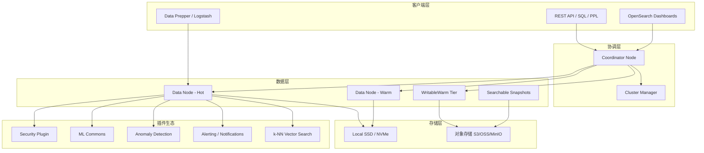
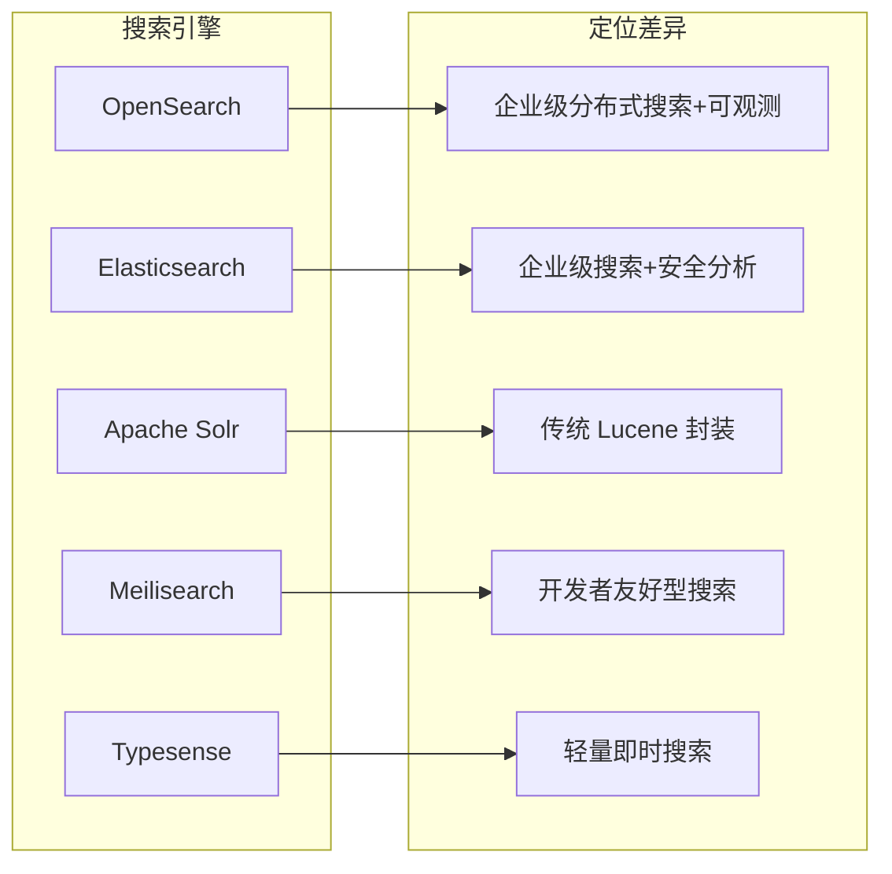

# 13.3k Star 的 OpenSearch：Elasticsearch 开源替代方案的逆袭之路

> 当 Elastic 把 Elasticsearch 转为 SSPL 许可证，AWS 选择 fork 并开源。3 年过去，OpenSearch 已从"备胎"成长为独当一面的企业级搜索与可观测平台。

## 一、项目速览

| 指标 | 数值 |
|---|---|
| GitHub Stars | 13.3k |
| Forks | 2.7k |
| 主语言 | Java（核心引擎）+ Kotlin/Rust（新模块） |
| 许可证 | Apache 2.0 |
| 最新稳定版 | 3.7.0（2026-06-09） |
| LTS 维护版 | 2.19.5 |
| 贡献者 | 400+ |
| 管理组织 | Linux Foundation (LF Projects) |

OpenSearch 定位：**开源的分布式搜索与可观测套件**，覆盖全文检索、日志分析、安全分析、向量搜索（ANN）和可视化，直接替代 Elasticsearch + Kibana 组合。

---

## 二、为什么存在——许可证之战

2021 年 1 月，Elastic 将 Elasticsearch 从 Apache 2.0 切换为 SSPL + Elastic License，限制云厂商直接托管。AWS 随即宣布 fork Elasticsearch 7.10.2，创建 OpenSearch 项目。

关键时间线：
- **2021-04**：AWS 宣布 OpenSearch 项目诞生
- **2021-07**：1.0 GA 发布，完整兼容 ES 7.10 API
- **2022-05**：2.0 发布，引入 Segment Replication、ML Framework
- **2024-09**：捐赠给 Linux Foundation，脱离 AWS 单一治理
- **2025-10**：3.0 发布，Java 21 + Lucene 10 + 模块化架构
- **2026-06**：3.7.0 发布，WritableWarm + Analytics Engine + 可插拔数据格式

捐赠给 LF 是转折点——OpenSearch 从"AWS 的项目"变为真正社区驱动的开源搜索引擎。

---

## 三、核心架构



### 架构亮点

1. **分层存储（Tiered Storage）**：3.x 引入 WritableWarm，数据可直接写入对象存储（成本降低 60%+）
2. **Segment Replication**：替代 Document Replication，减少 CPU 消耗 40%
3. **模块化插件系统**：安全、ML、告警、向量搜索均为独立插件
4. **Cluster Manager（原 Master）**：负责集群元数据、分片分配、索引生命周期
5. **多查询语言**：支持 DSL、SQL、PPL（Piped Processing Language）

---

## 四、与 Elasticsearch 的关键差异（2026）

| 维度 | OpenSearch 3.7 | Elasticsearch 9.x |
|---|---|---|
| 许可证 | Apache 2.0（真开源） | AGPL（2024 回归） |
| 内置安全 | 默认启用（Security Plugin） | 需商业订阅 |
| 向量搜索 | k-NN + FAISS/Lucene/Nmslib | HNSW（内置） |
| ML 推理 | ML Commons（本地部署模型） | ELSER/Inference API |
| 分层存储 | WritableWarm（3.x） | Searchable Snapshots |
| SQL 支持 | 原生 SQL + PPL | ES|QL（新语法） |
| 治理模式 | Linux Foundation 社区 | Elastic NV 公司 |
| 客户端兼容 | 兼容 ES 7.10 API | 持续变更 API |

**2024 年 Elastic 回归 AGPL** 后，许可证差异缩小，但 OpenSearch 在以下场景仍有明确优势：
- 需要在任何云上自由托管
- 需要内置安全（免费版即含 RBAC、加密、审计）
- 需要 AWS 生态深度集成（Amazon OpenSearch Service）

---

## 五、3.x 版本重磅能力

### 5.1 WritableWarm 分层存储

传统方式：热节点 → 冷数据搬迁到低配节点。
WritableWarm 方式：数据写入时直接路由到对象存储层，结合本地缓存实现低延迟查询。

```yaml
# 创建使用 WritableWarm 的索引
PUT /logs-2026
{
  "settings": {
    "index.tiering.enabled": true,
    "index.tiering.target": "warm",
    "index.number_of_shards": 3
  }
}
```

### 5.2 Analytics Engine（DataFusion 集成）

3.7 引入分布式分析引擎，基于 Apache Arrow + DataFusion：
- Coordinator 侧流式 Reduce
- 支持分布式 Join
- PPL append 命令支持 Union 操作
- 显著提升复杂聚合性能

### 5.3 可插拔数据格式

新增 `DataFormatAwareEngine` 抽象层，支持：
- 默认 Lucene 格式
- Parquet 格式（通过 k-way merge sort 支持合并）
- 未来可扩展更多列式存储格式

### 5.4 Virtual Shards（RFC 已合并）

解决索引分片数只能在创建时设定的历史难题：
- 运行时动态拆分/合并分片
- 无需 Reindex
- 弹性应对流量波动

---

## 六、快速上手

### Docker 单节点（开发环境）

```bash
docker run -d -p 9200:9200 -p 9600:9600 \
  -e "discovery.type=single-node" \
  -e "OPENSEARCH_INITIAL_ADMIN_PASSWORD=MyStr0ng!Pass" \
  opensearchproject/opensearch:3.7.0
```

### 验证集群状态

```bash
curl -ku admin:MyStr0ng!Pass https://localhost:9200/_cluster/health?pretty
```

### Docker Compose（完整栈）

```bash
git clone https://github.com/opensearch-project/docker-compose.git
cd docker-compose/opensearch
docker compose up -d
```

### Helm Chart（Kubernetes）

```bash
helm repo add opensearch https://opensearch-project.github.io/helm-charts/
helm install opensearch opensearch/opensearch
helm install dashboards opensearch/opensearch-dashboards
```

---

## 七、社区热点 Issues 精选

| # | 标题 | 标签 | 状态 |
|---|---|---|---|
| #1687 | [RFC] Replace Java Security Manager (JSM) | Security, v3.0 | ✅ 已完成 |
| #9422 | ZStd 压缩从 GA 降级为实验性 | Performance, Critical | ✅ 已修复 |
| #18809 | RFC: Virtual Shards 弹性索引扩展 | Enhancement | ✅ 3.x 合并 |
| #12457 | [RFC] Parallel & Batch Ingestion | Performance, Roadmap | ✅ v2.15 完成 |
| #13274 | [RFC] Cloud Native SQL Plugin | Modular Architecture | ❌ 未规划 |
| #11676 | Searchable Snapshots 导致搜索节点磁盘满 | Bug, Critical | ✅ 已修复 |
| #19120 | _cat/nodes API CPU 统计出现负值 | Bug, v3.8 | ✅ 已修复 |

**洞察**：
- 3.x 时代的 RFC 密集度极高，团队在积极重构底层架构
- JSM 移除是 Java 21 升级的前置条件，影响面覆盖所有插件
- Virtual Shards 和 WritableWarm 代表存储层的彻底革新

---

## 八、社区声量

### 社区讨论

| 来源 | 话题 | 关键观点 |
|---|---|---|
| Reddit r/elasticsearch | "ES, I'm done. Anyone try OpenSearch?" | 用户对 ES 许可证不满，但指出 OpenSearch Dashboards 维护力度不如 Kibana |
| Reddit r/aws | "OpenSearch insanely expensive?" | AWS 托管版价格引发讨论，社区建议自托管降本 |
| Reddit r/Database | "OpenSearch Alternatives" | 用户认为自托管 + 合理 mapping 可大幅降低成本 |
| HN | "RAG on a Budget: Replaced $360/Month OpenSearch" | 小规模场景可用 pgvector 替代，OpenSearch 更适合企业级 |

### 权威评测

| 来源 | 结论 |
|---|---|
| BigData Boutique (2026) | 功能基本对等，ES 在 ESQL 和 Serverless 领先；OpenSearch 在安全开箱即用和成本上占优 |
| Tech Insider (2026) | 性能基准测试差异 <15%，选择更多取决于生态绑定 |
| Netdata (2025) | 两者 API 兼容度逐渐分化，迁移窗口正在关闭 |

---

## 九、适用场景与局限

### 最佳适用

- **日志/可观测**：配合 Data Prepper 替代 ELK Stack
- **企业搜索**：需要免费安全特性（RBAC/加密/审计）
- **AWS 原生架构**：Amazon OpenSearch Service 全托管
- **向量搜索 + RAG**：k-NN 插件 + ML Commons 本地推理
- **多租户 SaaS**：利用 Security Plugin 做租户隔离

### 已知局限

- Dashboards 功能迭代速度慢于 Kibana
- 部分 ES 8.x+ 新特性（如 ESQL、Serverless）无对应实现
- 社区规模和第三方教程仍少于 Elasticsearch
- 升级 2.x → 3.x 需要完整重建索引（Lucene 版本不兼容）

---

## 十、竞品对比



| 维度 | OpenSearch | Elasticsearch | Solr | Meilisearch |
|---|---|---|---|---|
| 分布式 | 原生 | 原生 | 需配置 | 实验性 |
| 许可证 | Apache 2.0 | AGPL | Apache 2.0 | MIT |
| 向量搜索 | FAISS/Lucene | HNSW | 有限 | 基础 |
| 学习曲线 | 中高 | 中高 | 高 | 低 |
| 运维复杂度 | 高 | 高 | 高 | 低 |
| 适合规模 | TB-PB | TB-PB | GB-TB | MB-GB |

---

## 十一、总结与行动建议

OpenSearch 在 3.x 时代完成了三个关键转变：
1. **治理独立**：从 AWS 项目变为 LF 社区项目
2. **存储革新**：WritableWarm + 可插拔格式，打破传统 Lucene-only 范式
3. **分析升级**：DataFusion 集成，从搜索引擎迈向搜索+分析平台

**行动建议**：
- 已在 ES 7.x 且不满许可证 → 评估迁移到 OpenSearch 3.x（API 基本兼容）
- 新项目选型 → 若需免费安全 + AWS 集成，OpenSearch 是首选
- 小规模场景（<10GB） → 考虑 Meilisearch/Typesense，OpenSearch 杀鸡用牛刀
- 已在 ES 8.x+ → 迁移成本较高（API 已分化），建议留在 ES 除非有强诉求

**项目地址**：https://github.com/opensearch-project/OpenSearch
**官方文档**：https://opensearch.org/docs/latest/
**Docker Hub**：`opensearchproject/opensearch:3.7.0`
