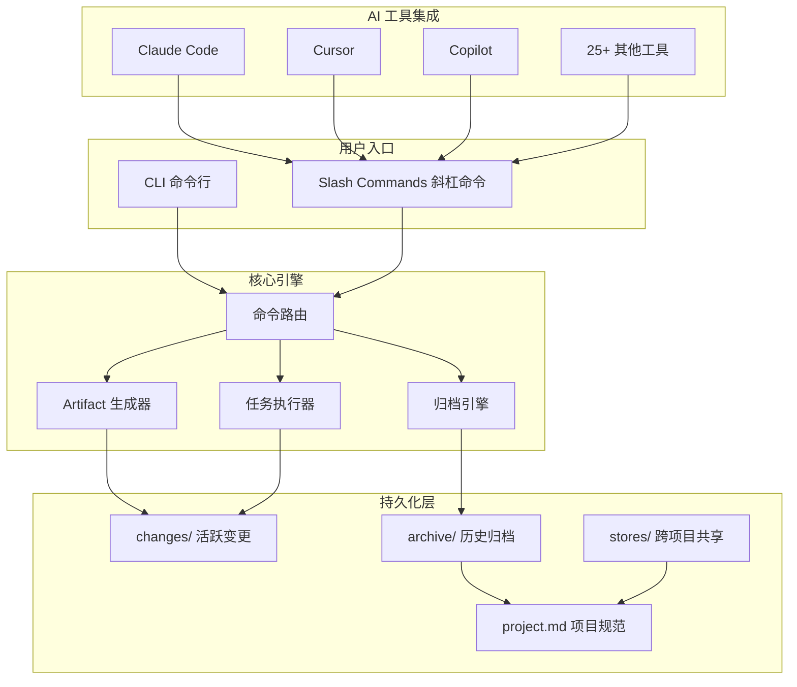
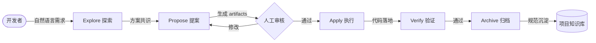

# 58.5k Star 的「需求对齐神器」：OpenSpec 如何终结 AI 编码的"自说自话"

> 你花 30 秒把需求描述给 AI 助手，它花 3 分钟写完代码——然后你发现方向完全跑偏。删掉重来，再描述一遍，再跑偏。对话越长，AI 忘的越多。这不是模型笨，是缺一个「先对齐、再动手」的机制。

## 1. 项目速览

| 项目 | 内容 |
|---|---|
| 项目名称 | OpenSpec |
| 一句话定位 | 面向 AI 编码助手的规范驱动开发（SDD）框架 |
| GitHub 地址 | [Fission-AI/OpenSpec](https://github.com/Fission-AI/OpenSpec) |
| 官方网站 | 无独立官网（文档内嵌仓库） |
| 主要语言 | TypeScript |
| 技术栈 | Node.js + pnpm + CLI (Commander/yargs) |
| 开源协议 | MIT |
| Star 数 | ⭐ 58.5k（2026-07-03） |
| 最新版本 | v1.5.0（Stores Beta） |
| 维护状态 | 活跃（周级 Release，高频 PR 合并） |
| 适合人群 | 使用 AI 编码工具（Claude Code / Cursor / Copilot 等）的中高级开发者 |

## 2. 它解决了什么问题

每个用过 AI 编码工具的人都踩过同一个坑：

- **上下文串台**：长对话中不同任务相互干扰，AI 把上一个功能的逻辑带进新任务
- **需求蒸发**：超出上下文窗口后，AI 遗忘关键约束，写出的代码和最初约定南辕北辙
- **不可复用**：项目约定散落在聊天记录里，换工具、换模型、换同事都得从头来
- **Vibe Coding 的代价**：随口说一句需求就让 AI 动手，结果 80% 的时间花在"纠偏"而非"推进"

OpenSpec 的核心思路：**在 AI 写任何一行代码之前，先用结构化文档对齐"做什么、为什么做、怎么做"**。每次变更生成一组 proposal → specs → design → tasks 文件，人类审核通过后再执行。完成后归档，项目规范持续沉淀。

## 3. 核心功能特性

### 3.1 核心功能

- **Explore 模式** (`/opsx:explore`)：无风险的思考伙伴。AI 阅读你的代码，帮你权衡方案，先想清楚再动手
- **Propose 模式** (`/opsx:propose`)：一键生成完整提案——proposal.md（为什么做）、specs/（需求场景）、design.md（技术方案）、tasks.md（实施清单）
- **Apply 实施** (`/opsx:apply`)：按 tasks.md 逐项执行，每步可审可断
- **Archive 归档** (`/opsx:archive`)：完成后归档到 `openspec/changes/archive/`，规范自动累积成项目知识库

### 3.2 特色能力

- **Delta Spec（增量规范）**：只记录变化的部分，不重写全量。归档后自动合并到 source-of-truth 文档
- **25+ 工具支持**：Claude Code、Cursor、Copilot、Codex、Windsurf、Kimi CLI、Mistral Vibe 等一网打尽
- **Profiles 工作流配置**：默认精简（explore + propose + apply + archive），扩展模式增加 ff / verify / bulk-archive / onboard
- **Stores (Beta)**：跨项目、跨团队共享规范，替代 workspace/initiative 模型
- **Community Schemas**：第三方工作流扩展生态，类似插件市场

### 3.3 功能边界

- ✅ 适合：使用 AI 编码工具的中大型项目、团队协作、需要变更可追溯性的场景
- ✅ 适合：Brownfield（存量项目）改造，不仅限于从零开始
- ❌ 不适合：5 分钟就能写完的小脚本（overhead > 收益）
- ⚠️ 使用前确认：需要 Node.js ≥ 20.19.0；推荐使用高推理能力模型（Codex 5.5 / Opus 4.7）

<!-- IMAGE_PROMPT: gpt-image2
生成一张「OpenSpec 功能结构全景图」信息图。

布局：
- 顶部标题：OpenSpec 功能结构全景图 + 副标题「面向 AI 编码助手的规范驱动开发框架」+ ⭐ 58.5k 徽章
- 左侧输入层：自然语言需求描述、已有代码仓库、项目约定
- 中间核心层：Explore（思考探索）→ Propose（提案生成）→ Apply（任务执行）→ Archive（归档沉淀）
- 底部支撑层：CLI 引擎、Profile 系统、Community Schemas、Stores（跨项目共享）
- 右侧输出层：proposal.md、specs/、design.md、tasks.md、归档知识库

视觉风格：
- 现代技术架构图，干净克制，16:9 画幅
- 主色 #3366CC，辅色 #5B8FF9，浅色背景
- 模块间清晰箭头连接，体现从输入到输出的流水线
- 中文文字清晰可读，PingFang SC 字体
-->

## 4. 架构设计

### 4.1 整体架构



### 4.2 工作流数据流



### 4.3 核心设计思想

- **抽象**：每次变更（Change）是一等公民，拥有独立文件夹、完整生命周期（draft → active → archived）
- **流程**：非瀑布式——任何 artifact 随时可修改，不存在"锁定后不可变"的阶段门
- **扩展**：Profile 机制实现工作流的增减；Community Schema 允许注入自定义模板和规则

## 5. 社区热点（Issues 分析）

### 5.1 精选 Issue

| # | 标题 | 讨论要点 | 状态 |
|---|---|---|---|
| [#357](https://github.com/Fission-AI/OpenSpec/issues/357) | 中文支持 | 已有社区汉化版 OpenSpec-cn | Open |
| [#557](https://github.com/Fission-AI/OpenSpec/issues/557) | Architecture Decision Records 支持 | 社区希望 OpenSpec 内建 ADR 追踪 | Open |
| [#662](https://github.com/Fission-AI/OpenSpec/issues/662) | 分层规范结构 | 支持 spec 的层级组织 | Open |
| [#783](https://github.com/Fission-AI/OpenSpec/issues/783) | 跨 artifact 质量审查 | propose/ff 到 apply 之间增加自动质检 | Open |
| [#780](https://github.com/Fission-AI/OpenSpec/issues/780) | 以 Superpowers Skill Pack 分发 | 与 obra/superpowers 生态集成 | Open |
| [#508](https://github.com/Fission-AI/OpenSpec/issues/508) | BDD 工具集成（CucumberJs） | 社区期望 spec → Gherkin 自动转换 | Open |
| [#649](https://github.com/Fission-AI/OpenSpec/issues/649) | Codex prompts 缺少 $ARGUMENTS | 已修复，v1.3+ | Closed |

### 5.2 社区健康度

- **维护响应**：maintainer 通常 24-48h 内回复，高优 Bug 当天修复
- **Issue 处理**：Issue 数已超 1000+，活跃度极高
- **Release 节奏**：平均 2-3 周一个 minor/patch，v1.0 → v1.5 历时约 9 个月
- **贡献者**：每版 Release 都有新 contributor 加入

## 6. 竞品对比

| 维度 | OpenSpec | GitHub Spec Kit | AWS Kiro | BMAD |
|---|---|---|---|---|
| 核心定位 | 轻量 SDD 框架 | 全量规范管理 | IDE 内建 SDD | 全生命周期 SDLC |
| 上手成本 | 低（npm install + init） | 中高（Python + 多文件） | 低（但锁定 IDE） | 高（复杂工作流） |
| 工具兼容 | 25+ AI 工具 | 仅 Claude Code | 仅 Kiro IDE | 4-5 种 |
| 阶段灵活度 | 无刚性阶段门 | 刚性 phase gates | 中等灵活 | 刚性流程 |
| 评测得分 | 4.00/5（综合最高） | 2.77/5 | N/A | 3.65-3.74/5 |
| 适合场景 | 团队+个人，存量项目 | 大型企业标准化 | AWS 生态内项目 | 强流程管控需求 |

> 评测数据来源：[ranthebuilder.cloud 对比评测](https://ranthebuilder.cloud/blog/i-tested-three-spec-driven-ai-tools-here-s-my-honest-take/)（2026 年 2 月，同一功能、同一代码库实测 13 维度打分）

## 7. 快速上手

```bash
# 安装（需 Node.js >= 20.19.0）
npm install -g @fission-ai/openspec@latest

# 进入项目并初始化
cd your-project
openspec init
```

```bash
# 开始使用（在 AI 编码工具中）
/opsx:explore           # 探索思路
/opsx:propose add-auth  # 生成「添加认证」提案
/opsx:apply             # 执行任务
/opsx:archive           # 归档完成的变更
```

运行成功后应看到：`openspec/` 目录下生成 `project.md`、`specs/`、`changes/` 等结构。

## 8. 项目结构

```text
your-project/
├── openspec/
│   ├── project.md           # 项目规范（技术栈、约定、架构决策）
│   ├── specs/               # 累积的需求规范（source of truth）
│   ├── changes/
│   │   ├── active-change/   # 当前活跃变更
│   │   │   ├── proposal.md  # 提案（Why + What + Impact）
│   │   │   ├── specs/       # 本次变更的增量规范
│   │   │   ├── design.md    # 技术方案
│   │   │   └── tasks.md     # 实施清单
│   │   └── archive/         # 历史变更归档
│   └── AGENTS.md            # AI 工具的指令入口
└── ... (项目源码)
```

### 代码阅读路线

1. 先看 `openspec/project.md` 理解项目级规范如何定义
2. 再看 `openspec/changes/` 下的 proposal.md 理解提案结构
3. 接着看 CLI 源码 `src/commands/` 理解命令路由
4. 扩展开发看 Community Schema 的文档

## 9. 安装部署

### 环境要求

| 项目 | 要求 |
|---|---|
| 运行时 | Node.js ≥ 20.19.0 |
| 包管理 | npm / pnpm / yarn / bun / nix |
| AI 工具 | Claude Code / Cursor / Copilot / Codex 等 25+ |

### 完整安装流程

```bash
# 安装
npm install -g @fission-ai/openspec@latest

# 初始化
cd your-project && openspec init

# 选择 Profile（可选）
openspec config profile    # 选择 default 或 expanded
openspec update            # 刷新 AI 指令文件

# 更新
npm install -g @fission-ai/openspec@latest
openspec update            # 刷新项目内的 AI 指令

# 卸载
npm uninstall -g @fission-ai/openspec
```

### 遥测说明

OpenSpec 收集匿名使用统计（仅命令名和版本号），不收集路径、内容或个人信息。CI 环境自动禁用。

关闭遥测：`export OPENSPEC_TELEMETRY=0` 或 `export DO_NOT_TRACK=1`

## 10. 社区声量

### 英文社区

- [ranthebuilder.cloud 深度评测](https://ranthebuilder.cloud/blog/i-tested-three-spec-driven-ai-tools-here-s-my-honest-take/)：对比 BMAD、Spec-Kit、OpenSpec 三款工具，13 维度打分 OpenSpec 综合最高（4.00/5）
- [YouTube: "GitHub Just Launched Spec Kit — But Fission AI's OpenSpec Fights Back"](https://www.youtube.com/watch?v=7UMiGPeC0qc)：讨论 SDD 赛道格局
- [dev.to 专栏](https://dev.to/gara501/the-end-of-vibe-coding-why-spec-driven-development-is-the-future-3hpa)："The End of Vibe Coding"，将 OpenSpec 定位为 Vibe Coding 的终结者
- Reddit r/ChatGPTCoding：有争议性讨论——部分开发者认为 SDD 是"过度工程化"，但多数反馈认为中大型项目收益明显

### 中文社区

- [4Ark: OpenSpec 使用心得](https://4ark.me/posts/2025-11-04-openspec/)：完整使用案例演示，从初始化到归档的全流程
- [知乎: Claude Code + Cursor + OpenSpec 铁三角](https://zhuanlan.zhihu.com/p/1978793644497580719)：将 OpenSpec 作为 AI 编程工作流的核心枢纽
- [Jimmy Song: OpenSpec 与 SpecKit 新实践](https://jimmysong.io/zh/book/ai-handbook/sdd/openspec/)：系统介绍 SDD 概念
- [CSDN: 规范驱动 AI 协作](https://blog.csdn.net/yangshangwei/article/details/154361472)：入门指南
- [博客园: 让 AI 准确理解你的需求](https://www.cnblogs.com/oddmeta/p/19827237)：侧重实践建议

## 11. 总结与建议

### 优缺点速览

| 维度 | 评价 |
|---|---|
| 上手成本 | 低——两条命令即可使用，学习曲线平缓 |
| 功能完整度 | 高——覆盖探索→提案→执行→归档全周期 |
| 文档质量 | 优秀——结构清晰、有交互示例、多语言支持 |
| 维护活跃度 | 极高——58.5k Star，周级发版，贡献者持续增长 |
| 扩展能力 | 强——Profile + Community Schema + Stores 三层扩展 |
| 工具生态 | 25+ AI 编码工具集成，不锁定任何 IDE |

### 我的判断

OpenSpec 是当前 SDD 赛道最平衡的选择：足够轻量不增加认知负担，又足够结构化让 AI 不跑偏。它的核心价值不在于"限制 AI"，而在于**让人和 AI 用同一份文档对齐目标**——这在团队协作和长期维护项目中几乎是刚需。

**适合投入时间的信号**：你用 AI 写代码时频繁"返工纠偏"，或者团队多人用不同 AI 工具协作同一个项目。

**建议用法**：从一个中型功能开始试 `/opsx:propose`，体会"先对齐再动手"带来的效率差异。不要一上来就强推全团队——让一两个成功案例自己说话。

---

> 📌 项目地址：https://github.com/Fission-AI/OpenSpec
> 👤 作者：Fission-AI ｜ 💻 语言：TypeScript ｜ 📜 License：MIT
