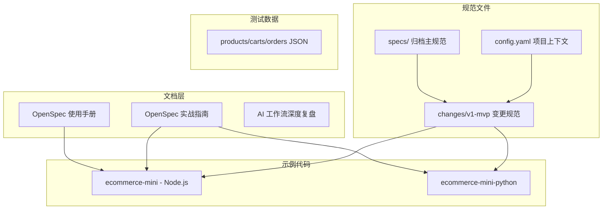

# 489 Star 的 OpenSpec-practise：用规范驱动 AI 编程的最佳实践教科书

> 你让 AI 写代码时，是直接丢需求还是先写 Spec？这个仓库用一套电商 MVP 告诉你——先定义规范、再让 AI 编码，产出质量完全不同。
> 一页纸：https://github.com/Shonee/html-tools/blob/master/pages/paper/openSpec-practise.html

## 一、项目速览

| 指标 | 数值 |
|---|---|
| GitHub Stars | 489 |
| Forks | 68 |
| 主语言 | JavaScript (Node.js) + Python |
| 所属社区 | AI 原力注入（ForceInjection） |
| 关联框架 | OpenSpec（Fission-AI/OpenSpec） |
| 内容形态 | 文档教程 + 多语言示例代码 + 完整规范文件 |

**一句话定位**：OpenSpec（规范驱动开发框架）的官方实践仓库，通过电商 MVP 完整演示"意图 → Spec → AI → 代码 & 验证"的新范式。

---

## 二、OpenSpec 是什么？为什么需要它？

传统 AI 编程工作流：
```
需求（模糊）→ 人描述 → AI 生成代码 → 人检查 → 反复修改
```

OpenSpec 主张的新范式：
```
意图 → Spec（结构化规范）→ AI 编码 → 自动验证 → 归档
```

OpenSpec 是一个轻量级开源 SDD（Spec-Driven Development）框架，专为 AI 编程助手设计。核心理念：**在写代码之前先定义规范，确保人与 AI 对需求达成一致**。

2026 年 SDD 赛道已有 6 款工具同台竞技：
- **OpenSpec**（Fission-AI）— 轻量、语言无关、支持 20+ AI 工具
- **GitHub Spec Kit** — GitHub 官方出品
- **Kiro** — AWS 出品，Spec-Driven Agent
- **Augment Cosmos** — 企业级
- **BMAD-METHOD** — 社区方案
- **Cursor Rules** — IDE 内嵌

OpenSpec 的独特优势：**工具无关**（不绑定特定 IDE）、**多语言**（Node.js/Python/Go 均可）、**社区驱动**。

---

## 三、仓库内容结构



### 四个核心模块

| 模块 | 路径 | 内容 |
|---|---|---|
| 📚 文档 | `docs/` | 使用手册 + 实战指南 + AI 工作流复盘 + 配套 PPT |
| 💻 示例代码 | `examples/ecommerce-mini*` | Node.js + Python 双语言电商 MVP |
| 📋 规范文件 | `examples/openspec/` | 完整 SDD 工作流（proposal → design → specs → tasks） |
| 🧪 测试数据 | `examples/ecommerce-mini/data/` | 商品/购物车/订单 JSON |

---

## 四、学习路径（推荐顺序）

1. **入门** → 阅读 `docs/openspec-user-manual.md`，了解 OpenSpec 基本概念
2. **实践** → 阅读 `docs/openspec-practical-guide.md`，理解如何落地
3. **深入** → 阅读 `docs/openspec-ai-workflow-analysis.md`，掌握 AI 协作最佳实践
4. **动手** → 运行 `examples/ecommerce-mini`，体验规范驱动开发
5. **研究** → 查看 `examples/openspec/changes/v1-mvp/` 下的规范文件

---

## 五、电商 MVP 示例解析

### 5.1 Node.js 版架构（DDD 分层）

```
ecommerce-mini/
├── src/
│   ├── domain/       # 核心业务逻辑（纯净领域层）
│   ├── services/     # 业务服务层
│   ├── http/         # API 接口
│   ├── repo/         # 内存数据存储
│   └── persist/      # 文件持久化
└── __tests__/        # 单元 + 集成 + 性能测试
```

### 5.2 Python 版架构

```
ecommerce-mini-python/
├── src/
│   ├── domain/       # Pydantic 领域模型
│   ├── services/     # 业务服务
│   ├── api/          # FastAPI 接口
│   └── repo/         # 内存存储
└── tests/            # Pytest 测试套件
```

### 5.3 规范文件结构（核心卖点）

```
openspec/
├── config.yaml                    # 项目上下文（技术栈、约定）
├── changes/v1-mvp/
│   ├── proposal.md               # 为什么要做 + 做什么
│   ├── design.md                 # 系统架构设计
│   ├── tasks.md                  # 实施任务清单
│   └── specs/
│       ├── domain-model/spec.md  # 领域模型
│       ├── catalog-management/   # 商品管理
│       ├── cart-management/      # 购物车
│       ├── order-management/     # 订单
│       ├── payment/              # 支付
│       └── error-handling/       # 错误处理
└── specs/                         # 归档后的主规范
```

---

## 六、核心特性

| 特性 | 说明 |
|---|---|
| 规范驱动开发 | 先定义 Spec，再编写代码，AI 与人对需求达成一致 |
| 多语言实现 | 同一套规范驱动 Node.js 和 Python 两套实现 |
| 完整测试覆盖 | 单元测试 + 集成测试 + 性能测试 |
| 生产级扩展 | 持久化存储、鉴权、幂等性、可观测性 |
| AI 深度协作 | `/opsx:propose`、`/opsx:apply` 等斜杠命令，支持 20+ AI 助手 |
| DDD 映射 | 限界上下文 → specs 目录，聚合行为 → Given/When/Then |

---

## 七、DDD 到 OpenSpec 的映射体系

这是本项目最有价值的独创内容——将 DDD 战略/战术设计与 OpenSpec 结构化规范对接：

| OpenSpec 结构 | DDD 对应物 | 说明 |
|---|---|---|
| 领域目录 | 限界上下文 | 一个 specs 子目录 = 一个 BC |
| 需求（Requirement） | 领域服务/命令 | 描述核心业务操作 |
| 场景（Scenario） | 聚合行为 | Given/When/Then 格式 |
| 技术设计（Design） | 应用服务 | 协调多个领域服务 |
| 实施任务（Tasks） | 战术设计待办 | 实体、值对象、仓储接口 |

工作流对应：
- `Propose` → 沉淀领域建模结论
- `Apply` → AI 依据 Spec 实现代码 + 自动验证
- `Archive` → 增量规范合并至主规范，保持单一事实来源

---

## 八、快速上手

### Node.js 版

```bash
cd examples/ecommerce-mini
npm install
npm test          # 运行测试
npm start         # 开发模式（内存存储，端口 3000）
npm run start:prod  # 生产模式（文件持久化，端口 3002）
```

### Python 版

```bash
cd examples/ecommerce-mini-python
pip install -r requirements.txt
pytest            # 运行测试
python -m uvicorn src.api.server:app --reload  # 端口 8000
```

---

## 九、社区热点 Issues

| # | 标题 | 状态 | 洞察 |
|---|---|---|---|
| #9 | spec 产物如何生成 | 🟡 Open | 用户关心 Spec 自动生成的具体路径 |
| #7 | spec 编写问题 | ✅ Closed | 规范编写的常见困惑 |
| #6 | schemas 的 template 模板问题 | ✅ Closed | 模板链接和使用方式 |
| #4 | PPT 是怎么制作的？ | ✅ Closed | 配套演示材料制作工具咨询 |
| #3 | 使用手册的模板文件链接 404 | ✅ Closed | 早期文档链接修复 |
| #1 | 有记录完整的 prompt 吗 | ✅ Closed | 用户想获取 AI 交互的完整提示词 |

**洞察**：社区最关心的是"如何从零开始用 OpenSpec 生成规范"和"完整的 AI 协作 prompt"——说明教程价值远大于代码本身。

---

## 十、社区声量与生态位

| 来源 | 关键信息 |
|---|---|
| GitHub 官方博客 | "Spec-driven development with AI: Get started with a new open source toolkit" 专题推荐 OpenSpec |
| Augment Code | 将 OpenSpec 列入"6 Best Spec-Driven Development Tools for AI Coding in 2026" |
| YouTube | "Getting Started with OpenSpec" 教学视频 |
| LinkedIn | 行业讨论热度持续上升 |
| npm | `@fission-ai/openspec` 已发布，可全局安装 |

**生态位判断**：OpenSpec-practise 是 OpenSpec 官方推荐的实践入门资源，填补了"框架文档到实际项目"之间的鸿沟。

---

## 十一、适用人群与行动建议

### 适合谁

- 正在使用 AI 编程助手（Cursor/Claude Code/Copilot）但觉得产出质量不稳定的开发者
- 想在团队中推行"规范先行"文化的技术 Leader
- 对 DDD + AI 编程融合感兴趣的架构师
- 想学习 SDD 方法论但找不到完整案例的工程师

### 行动建议

1. **立即体验** → `npm install -g @fission-ai/openspec && openspec init`
2. **学习路径** → 按第四章推荐顺序通读文档
3. **动手实践** → Fork 本仓库，用自己的项目场景替换电商 MVP
4. **团队推广** → 使用配套 PPT（`docs/openspec-user-manual-v2.pptx`）做内部分享

**项目地址**：https://github.com/ForceInjection/OpenSpec-practise  
**OpenSpec 官方**：https://openspec.pro  
**npm 安装**：`npm install -g @fission-ai/openspec`
