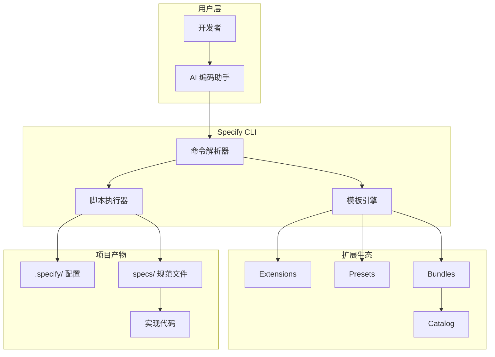

# 118k Star：GitHub 官方 Spec Kit，终结 Vibe Coding 的 SDD 工具包

## 一句话定位

当你用 AI 写代码发现产出"碰运气"时，GitHub 官方给了一个答案：**先写规范（Spec），再让 AI 按规范编码**。Spec Kit 就是这套流程的一站式 CLI 工具包——从需求定义、技术规划、任务拆解到自动实现，全程 7 条斜杠命令。

## 项目速览

| 维度 | 数据 |
|------|------|
| 仓库 | [github/spec-kit](https://github.com/github/spec-kit) |
| Star / Fork | 118k / 10.4k |
| 语言 | Python（CLI） |
| 许可证 | MIT |
| 贡献者 | 200+ |
| 支持 AI 工具 | 30+（Copilot、Claude Code、Gemini CLI、Codex CLI 等） |
| CLI 命令 | `specify`（基于 uv 安装） |
| 核心理念 | Spec-Driven Development (SDD) — 规范即源码 |
| 创始人 | John Lam（GitHub / Microsoft） |

---

## 为什么需要 Spec-Driven Development

传统开发：`需求 → 人写代码 → 规范被遗忘`

AI 时代 Vibe Coding：`模糊 prompt → AI 随机产出 → 反复调整`

SDD 新范式：`意图 → 结构化规范 → AI 按规范编码 + 验证 → 规范持续演进`

Spec Kit 的核心洞察：**规范不是脚手架，规范就是可执行的设计意图**。代码是规范的一种"编译产物"。

---

## 核心工作流：7 条命令走完全流程


### 命令详解

| 阶段 | 命令 | 作用 |
|------|------|------|
| 1 | `/speckit.constitution` | 建立项目"宪法"——编码规范、测试标准、UX 一致性要求 |
| 2 | `/speckit.specify` | 用自然语言描述**做什么和为什么**，不涉及技术栈 |
| 3 | `/speckit.clarify` | 结构化追问，补全规范中的模糊地带 |
| 4 | `/speckit.plan` | 指定技术栈，生成实现计划（含研究、契约、数据模型） |
| 5 | `/speckit.tasks` | 从计划生成有序任务列表，标记并行/依赖/TDD |
| 6 | `/speckit.implement` | AI 按任务顺序编码，遵循规范 |
| 7 | `/speckit.converge` | 评估代码与规范一致性，追加未完成任务 |

**附加命令**：`/speckit.analyze`（一致性分析）、`/speckit.checklist`（质量清单）、`/speckit.taskstoissues`（任务转 GitHub Issues）。

---

## 三层扩展体系：Extensions / Presets / Bundles

Spec Kit 的杀手锏不只是核心流程，还有一套完整的扩展生态：

| 层级 | 定位 | 示例 |
|------|------|------|
| **Extension（扩展）** | 添加新命令和能力 | Jira 集成、代码审查、V-Model 测试追溯 |
| **Preset（预设）** | 定制已有流程的格式/术语 | 合规规范模板、DDD 术语、海盗话风格（demo） |
| **Bundle（包）** | 按角色一键配置 | 产品经理包、安全研究员包、开发者包 |

模板解析优先级（从高到低）：
1. 项目本地覆盖 `.specify/templates/overrides/`
2. Preset 自定义
3. Extension 扩展
4. Spec Kit 核心默认

```bash
# 安装扩展
specify extension add <name>

# 安装预设
specify preset add <name>

# 一键安装角色包
specify bundle install <bundle-id>
```

---

## 30+ AI 编码助手集成

运行 `specify integration list` 查看完整列表。已适配：

- **GitHub Copilot** — 默认集成
- **Claude Code** — 社区热度最高
- **Gemini CLI** / **Codex CLI** / **Qwen Code** / **Qoder CLI**
- **Kiro CLI** / **Pi Coding Agent** / **Tabnine CLI**
- **Goose** / **Forge** / **Mistral Vibe** / **ZCode**

Skills 模式支持：`specify init . --integration codex --integration-options="--skills"`

---

## 竞品横向对比

| 工具 | 规范结构 | 迭代速度 | 适用阶段 | 背书 |
|------|----------|----------|----------|------|
| **Spec Kit** | 多文件（每 feature 独立） | 中等（4 阶段） | Greenfield 新项目 | GitHub 官方 |
| **OpenSpec** | 单一源文件（Delta 变更） | 快（Propose/Apply/Archive） | Brownfield 存量项目 | 社区 |
| **Kiro** | 内置 IDE 原生 | 快（IDE 集成） | AWS 生态 | Amazon |
| **BMAD-METHOD** | 角色驱动 | 中等 | 多角色协作 | 社区 |
| **Tessl** | 多人实时 | 快 | 团队协作 | 独立厂商 |
| **Augment Cosmos** | 方案生成 | 快 | 增量增强 | Augment |

> 数据来源：Martin Fowler 文章 "Understanding SDD: Kiro, spec-kit, and Tessl"、intent-driven.dev 对比、Augment 排行榜

---

## 快速上手

### 安装

```bash
# 安装 uv（如尚未安装）
curl -LsSf https://astral.sh/uv/install.sh | sh

# 安装 Spec Kit CLI（替换 vX.Y.Z 为最新 tag）
uv tool install specify-cli --from git+https://github.com/github/spec-kit.git@vX.Y.Z

# 验证
specify --version
```

### 初始化项目

```bash
specify init my-project --integration copilot
cd my-project
```

### 升级

```bash
specify self check          # 检查新版本
specify self upgrade        # 升级到最新稳定版
specify self upgrade --tag v2.0.0  # 指定版本
```

### 完整 SDD 流程（5 分钟体验）

```
/speckit.constitution Create principles for code quality and testing
/speckit.specify Build a photo album app with drag-and-drop...
/speckit.plan Use Vite + vanilla JS, local SQLite
/speckit.tasks
/speckit.implement
```

---

## Issues 社区热点精选

| # | 标题 | 状态 | 要点 |
|---|------|------|------|
| #2475 | `specify self upgrade` 实现 | ✅ Merged | CLI 自升级命令，支持 tag 锁定 |
| #2133 | Preset 组合策略（prepend/append/wrap） | ✅ Merged | 模板自定义粒度大幅提升 |
| #2158 | Workflow 引擎 + Catalog 系统 | ✅ Merged | 工作流可编排、可分发 |
| #3070 | `specify bundle` 命令 | ✅ Merged | 角色包一键安装 |
| #2563 | 从 catalog 自动生成集成参考文档 | 🔵 Open | 文档自动化 |
| #2442 | 安全审计自动化 workflow | 🔵 Open | CI/CD 安全加固 |

**维护响应**：GitHub 官方团队 + Copilot 自动贡献 PR，Issue 响应速度 < 24h，高活跃度项目。

---

## 社区声量

### Reddit

- **r/GithubCopilot**：「Spec-Kit is Just Too Complex」—— 部分用户反馈学习曲线陡峭，阶段太多
- **r/ClaudeCode**：「Anyone tried GitHub's Spec-Kit with Claude Code?」—— 与 Claude Code 搭配评价积极
- **r/vibecoding**：「Just tried GitHub's Spec Kit with Claude Code and Copilot, this is wild」—— 惊叹于规范→代码的自动化程度

### 权威评测

- **Martin Fowler**：["Understanding SDD: Kiro, spec-kit, and Tessl"](https://martinfowler.com/articles/exploring-gen-ai/sdd-3-tools.html) — 认为 SDD 工具各有 opinionated workflow，尚无银弹
- **Augment**：["6 Best SDD Tools for AI Coding in 2026"](https://www.augmentcode.com/tools/best-spec-driven-development-tools) — Spec Kit 位列第三
- **ranthebuilder.cloud**：["I Tested Three Spec-Driven AI Tools"](https://ranthebuilder.cloud/blog/i-tested-three-spec-driven-ai-tools-here-s-my-honest-take/) — 13 维度实测对比 BMAD/Spec-Kit/OpenSpec
- **YouTube**：["The ONLY guide you'll need for GitHub Spec Kit"](https://www.youtube.com/watch?v=a9eR1xsfvHg)

---

## 适用场景

**最佳场景**：
- Greenfield（从零构建）新项目
- 需要多人协作且强调规范一致性
- 企业级约束（合规、安全审计、设计系统）
- 需要跨技术栈验证的团队

**不适合**：
- 已有大量存量代码的 Brownfield 项目（建议看 OpenSpec）
- 只需快速原型验证
- 单人小项目（overkill）

---

## 架构设计



---

## 优势与局限

| 优势 | 局限 |
|------|------|
| GitHub 官方维护，长期可信赖 | 学习曲线陡——4+ 阶段、多种概念 |
| 118k Star，社区活跃 | Brownfield 项目适配不如 OpenSpec |
| 30+ AI 工具集成，不锁定 | 依赖 Python 3.11+ 和 uv |
| Extension/Preset/Bundle 三层扩展 | 团队需统一训练 SDD 意识 |
| MIT 开源，企业友好 | 规范碎片化——需组装多文件理解全貌 |

---

## 总结与行动建议

如果你正在用 AI 编程助手做正经项目（而不是写一次性 demo），Spec Kit 值得一试。

1. **5 分钟体验**：`uv tool install specify-cli --from git+https://github.com/github/spec-kit.git@latest` → `specify init . --integration copilot`
2. **看视频**：YouTube 上的 "The ONLY guide you'll need" 能省 1 小时阅读
3. **选集成**：Claude Code 用户评价最高，Copilot 为默认适配
4. **评估复杂度**：小项目直接 `/speckit.specify` + `/speckit.implement` 两步走；复杂项目走全流程

> 仓库地址：https://github.com/github/spec-kit
> 官方文档：https://github.github.com/spec-kit/
> 官方博客：https://github.blog/ai-and-ml/generative-ai/spec-driven-development-with-ai-get-started-with-a-new-open-source-toolkit/
