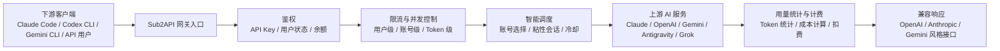
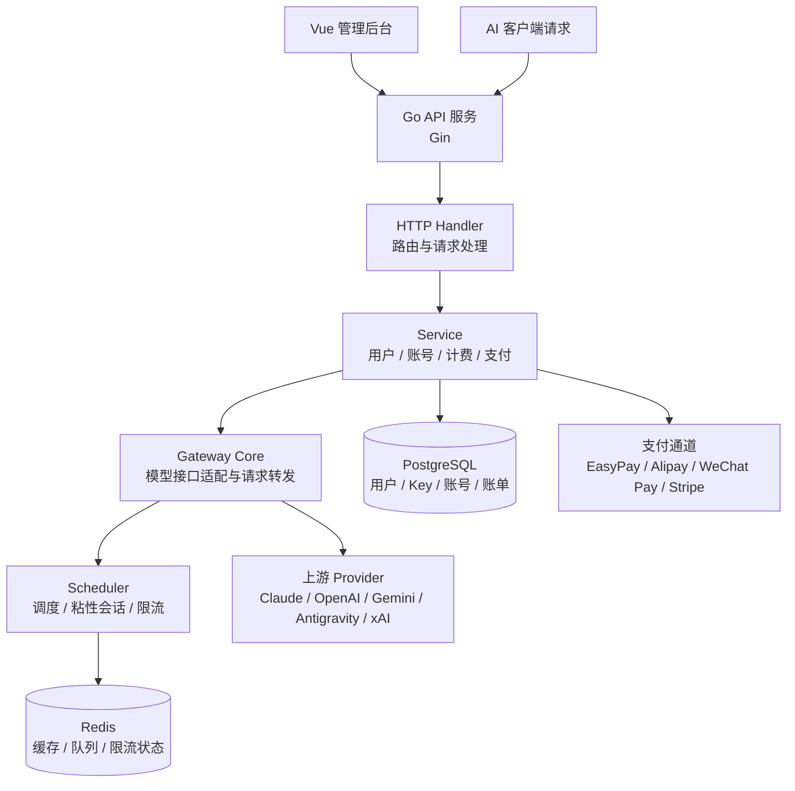

# 深度剖析 Sub2API：把多种 AI 订阅配额统一成一个可分发、可计费、可调度的 API 网关

> 资料采集时间：2026-07-01  
> 项目地址：<https://github.com/Wei-Shaw/sub2api>  
> 说明：本文基于项目 README、README_CN、部署文档、仓库目录和 GitHub 页面公开信息整理。Sub2API 涉及上游 AI 服务账号、订阅配额和 API 转发，使用前必须先确认当地法律法规、上游服务条款和自身合规边界。

## 1. 项目介绍

Sub2API 是一个面向 AI 订阅配额分发的开源 API 网关平台。它的核心目标不是再做一个大模型聚合客户端，而是把 Claude、OpenAI、Gemini、Antigravity、Grok / xAI 等上游订阅或账号能力，包装成平台侧统一生成、统一管理、统一计费的 API Key。

从使用者角度看，Sub2API 解决的是“多个 AI 账号和订阅如何集中管理、分发、限流、计费、监控”的问题。上游可以是 OAuth 账号，也可以是 API Key；下游用户只需要拿到平台生成的 API Key，再通过兼容接口调用。

它更接近一个面向 AI 订阅资源的“内部 API 网关 + 配额分销系统 + 管理后台”。这类项目适合研究 AI 网关、账号池调度、成本分摊、团队内部分发和接口兼容的人群，但不适合在没有合规评估的情况下直接对外提供商业化服务。

项目官方 README 已经提供中文版本，因此本文不再额外做英文文档中文化翻译，而是在官方中文说明基础上做结构化拆解和实践补充。

## 2. 项目速览

| 项目 | 内容 |
|---|---|
| 项目名称 | Sub2API |
| GitHub 地址 | <https://github.com/Wei-Shaw/sub2api> |
| 项目定位 | AI API 网关平台，面向订阅配额分发和统一管理 |
| 官方文档 | README、README_CN、docs、deploy 目录 |
| 主要语言 | Go、Vue、TypeScript |
| 后端技术栈 | Go 1.25.7、Gin、Ent |
| 前端技术栈 | Vue 3.4+、Vite 5+、TailwindCSS |
| 数据库 | PostgreSQL 15+ |
| 缓存 / 队列 | Redis 7+ |
| 部署方式 | 一键脚本、Docker Compose、源码编译 |
| 默认访问端口 | 8080 |
| 开源协议 | GNU LGPL v3.0 or later |
| 最新版本 | 0.1.142，GitHub 页面显示发布于 2026-07-01 |
| GitHub 热度 | 约 29.8k Star、6.1k Fork、4,135 commits，采集于 2026-07-01 |
| 文档语言 | 英文、中文、日文 |
| 推荐体验方式 | Docker Compose 本地目录版，便于备份和迁移 |

## 3. 这个项目解决了什么问题

很多团队使用 AI 编程工具或大模型 API 时，会遇到一个非常现实的问题：账号和订阅资源不是天然适合团队共享的。

个人订阅、企业账号、不同模型平台、不同 CLI 工具，往往各自有认证方式、限额规则、风控策略和兼容接口。团队如果只是把账号或 Token 手工分发出去，很快会遇到几个麻烦：

- 谁用了多少额度，很难按用户或 API Key 精确统计。
- 多个上游账号如何调度，容易变成手工切换。
- 并发、速率和粘性会话缺少统一控制。
- 如果要让用户自助充值或按量计费，需要额外搭支付和账单系统。
- Claude Code、Codex CLI、Gemini CLI 等工具各有接口习惯，统一接入成本高。

Sub2API 的思路是把上游 AI 账号池集中接入，然后由平台生成下游 API Key。请求进入平台后，平台完成鉴权、计费、调度、限流、并发控制和请求转发。这样，团队可以把“账号如何管理”和“用户如何调用”拆成两层：上游账号由管理员维护，下游使用者只面对统一 API。

这也是 Sub2API 的核心价值：它把 AI 订阅资源从“账号级使用”抽象成“网关级分发”。

## 4. 项目功能特点

### 4.1 核心功能

**多账号管理**

Sub2API 支持多种上游账号类型，包括 OAuth 和 API Key。管理员可以把多个上游账号放进平台，由系统在请求时做调度。

**API Key 分发**

平台可以为用户生成和管理 API Key。下游用户不需要知道上游账号细节，只需要使用平台发放的 Key 调用接口。

**Token 级计费**

项目强调 Token 级用量追踪和成本计算，这对团队内部成本分摊、API 中转服务、测试环境额度管理都很关键。

**智能调度和粘性会话**

Sub2API 支持智能账号选择，并提到 sticky sessions。对 Claude Code、Codex CLI 这类长会话工具来说，请求保持在相同或合适的账号上下文里，会比单纯随机轮询更稳。

**并发控制和速率限制**

平台支持用户级和账号级并发限制，也支持请求和 Token 维度的速率限制。这个能力能避免某个用户或某个任务把上游账号额度瞬间打满。

**内置支付系统**

项目已经内置支付能力，支持 EasyPay、支付宝、微信支付和 Stripe。也就是说，如果要做用户自助充值，不再必须额外部署独立支付项目。

**管理后台**

Sub2API 提供 Web 管理界面，用于用户、账号、监控、配置等操作。前端使用 Vue 3，后端使用 Go 提供 API 和静态资源服务。

**外部系统集成**

项目支持通过 iframe 嵌入外部系统，例如工单系统，用来扩展管理后台。

### 4.2 特色能力

**兼容 AI 编程工具生态**

项目介绍明确提到面向 Claude、OpenAI、Gemini、Antigravity 等订阅统一端点，并且围绕 Claude Code、Codex CLI、Gemini CLI 等工具做了不少兼容说明。

**账号池调度比普通反代更复杂**

普通 API 反向代理只负责转发，Sub2API 还要处理用户、余额、限流、并发、账号状态、重试和调度。它的复杂度更接近“AI API 网关业务系统”。

**部署方式比较完整**

项目提供脚本安装、Docker Compose 和源码编译三种路径。Docker Compose 还区分本地目录版和命名卷版，官方更推荐本地目录版，方便备份和迁移。

**Simple Mode 适合内部团队**

Simple Mode 面向个人开发者或内部团队，可以隐藏 SaaS 相关功能并跳过计费流程。生产环境启用 Simple Mode 时还需要设置确认环境变量，避免误开。

### 4.3 功能边界

Sub2API 能做账号池、网关、分发和计费，但它不能替你规避上游平台服务条款。官方 README 明确提醒：使用该项目可能违反 Anthropic 等上游服务商的条款，相关风险由使用者自行承担。

比较适合的场景：

- 团队内部研究 AI API 网关和账号池调度。
- 自建实验环境，学习 Go + Vue + PostgreSQL + Redis 的完整 Web 系统。
- 内部共享有限 AI 订阅资源，并做用量统计和限流。
- 研究 Claude Code、Codex CLI、Gemini CLI 等工具的兼容代理层。

需要谨慎的场景：

- 对外商业化中转服务。
- 处理敏感业务数据或客户数据。
- 绕过上游平台限制、风控或授权规则。
- 生产环境直接暴露公网但没有 HTTPS、访问控制、出站域名限制和日志审计。

### 4.4 项目功能结构全景图 gpt-image2 提示词

```text
请生成一张专业、清晰、适合技术文章使用的「Sub2API 功能结构全景图」。

画面主题：Sub2API 是一个 AI API 网关平台，用于把 Claude、OpenAI、Gemini、Antigravity、Grok/xAI 等上游 AI 订阅或账号能力，统一转换成可分发、可计费、可调度的 API 服务。

图中需要包含以下层次：
1. 顶部标题区：显示「Sub2API 功能结构全景图」和副标题「统一账号池、API Key 分发、Token 计费与智能调度」。
2. 左侧输入层：展示下游请求来源，包括 Claude Code、Codex CLI、Gemini CLI、OpenAI-compatible Client、内部应用、API 用户。
3. 中间核心能力层：用 6 个模块展示主要功能：
   - 用户与 API Key 管理：生成 Key、用户权限、余额和状态。
   - 账号池管理：OAuth 账号、API Key 账号、订阅账号、账号状态。
   - 智能调度：账号选择、粘性会话、失败冷却、负载均衡。
   - 计费与支付：Token 统计、余额扣费、EasyPay、支付宝、微信支付、Stripe。
   - 限流与并发控制：用户级限制、账号级限制、请求速率、Token 速率。
   - 管理后台：监控看板、配置管理、外部系统 iframe 集成。
4. 底部支撑层：展示 Go + Gin + Ent 后端、Vue 3 + Vite 前端、PostgreSQL、Redis、Docker Compose、systemd、Nginx。
5. 右侧输出层：展示统一 API Endpoint、OpenAI-compatible 响应、Claude Messages 响应、Gemini 接口、管理报表、账单和日志。
6. 右下角加入风险提醒小区域：合规使用、上游服务条款、HTTPS、密钥保护。

视觉风格：
- 现代技术架构图风格，浅色背景，信息密度适中。
- 使用蓝色和绿色作为主色，少量红色用于风险提醒。
- 模块之间用清晰箭头连接，体现从客户端请求到网关调度再到上游账号的流程。
- 中文文字清晰可读，避免小字堆叠。
- 不使用真实公司 Logo，用抽象图标表示 CLI、API、数据库、缓存和支付。
- 画幅比例 16:9，适合公众号、博客和技术演示。
```

## 5. 适用场景

**团队内部 AI 资源管理**

如果团队里有多种 AI 订阅或账号，需要按成员、项目或 Key 分配额度，Sub2API 可以作为统一入口。

**AI API 网关技术学习**

它包含后端服务、前端后台、数据库、Redis、Docker 部署、支付、限流、调度等模块，适合用来学习一个完整网关业务系统的组织方式。

**CLI 工具兼容代理**

Claude Code、Codex CLI、Gemini CLI 等工具在请求头、端点、会话行为上有差异。Sub2API 的价值之一，是把这些工具接入到统一账号池。

**账号池和成本分摊实验**

对想研究“多账号如何调度、如何做用量统计、如何限制并发、如何扣费”的开发者，Sub2API 比普通反向代理更接近真实业务。

不建议的场景：

- 没有合规评估的公网商业服务。
- 需要强监管审计、强数据隔离的企业核心系统。
- 对上游模型输出真实性、服务稳定性、账号安全没有兜底策略的生产业务。

## 6. 项目原理

### 6.1 核心工作流程

Sub2API 的核心链路可以概括为：下游客户端携带平台 API Key 请求统一端点，后端先做鉴权和用户状态检查，再根据模型、账号组、余额、并发、速率、会话等信息选择上游账号，随后把请求转换或转发给上游服务，最后记录用量并返回兼容格式响应。



### 6.2 关键模块关系



### 6.3 关键设计点

**统一下游身份**

平台侧 API Key 是下游用户的身份边界。它让用户和上游账号解耦，方便做余额、权限、限流和账单。

**上游账号池**

上游账号不是简单配置一个 base URL，而是被系统管理成可调度资源。账号状态、授权方式、模型支持范围、失败状态都会影响调度结果。

**请求兼容层**

项目支持多个上游平台，也提供多种公开端点，例如 OpenAI-compatible、Claude Messages、Gemini beta、Antigravity 专用路径等。这里需要处理的不只是转发，还有协议、路径和响应格式兼容。

**状态与计费**

PostgreSQL 负责持久化用户、账号、账单、配置等业务数据；Redis 负责缓存、队列或限流状态。Token 级计费要求系统在响应完成后能可靠地统计用量，并在失败场景下避免错扣或漏扣。

**安全配置**

README 提到 CORS allowlist、URL allowlist、响应头过滤、CSP、billing circuit breaker、trusted proxies、Turnstile 等安全相关配置。对 API 网关来说，这些配置不是锦上添花，而是公网部署时的基本防线。

## 7. 项目结构

项目目录是典型的前后端分离加部署配置结构：

```text
sub2api/
├── backend/                  # Go 后端服务
│   ├── cmd/server/           # 应用入口
│   ├── internal/             # 内部模块
│   │   ├── config/           # 配置
│   │   ├── model/            # 数据模型
│   │   ├── service/          # 业务逻辑
│   │   ├── handler/          # HTTP 处理器
│   │   └── gateway/          # API 网关核心
│   └── resources/            # 静态资源
├── frontend/                 # Vue 3 前端
│   └── src/
│       ├── api/              # 前端 API 调用
│       ├── stores/           # 状态管理
│       ├── views/            # 页面组件
│       └── components/       # 通用组件
├── deploy/                   # 部署配置
│   ├── docker-compose.yml
│   ├── .env.example
│   ├── config.example.yaml
│   └── install.sh
├── docs/                     # 配置和功能文档
├── tools/                    # 辅助工具
├── Dockerfile
├── Makefile
├── README.md
├── README_CN.md
├── README_JA.md
└── LICENSE
```

几个值得重点阅读的目录：

- `backend/cmd/server/`：后端启动入口，适合理解服务如何加载配置、初始化依赖和注册路由。
- `backend/internal/handler/`：HTTP API 的外层入口，适合查管理后台和公开接口对应的处理逻辑。
- `backend/internal/service/`：业务逻辑集中地，用户、账号、计费、支付、调度相关逻辑大概率会在这里串起来。
- `backend/internal/gateway/`：项目最有价值的模块之一，负责多模型、多供应商、多协议之间的网关转换。
- `frontend/src/views/`：管理后台页面入口，适合理解产品功能如何组织。
- `deploy/`：生产部署最该看的目录，包含 Docker Compose、示例配置和安装脚本。

## 8. 项目代码信息

### 8.1 技术栈

| 类别 | 技术 |
|---|---|
| 后端语言 | Go |
| 后端框架 | Gin |
| ORM / 数据建模 | Ent |
| 前端框架 | Vue 3 |
| 前端构建 | Vite |
| 前端样式 | TailwindCSS |
| 数据库 | PostgreSQL 15+ |
| 缓存 / 队列 | Redis 7+ |
| 部署 | Docker Compose、systemd、源码编译 |
| 反向代理 | Nginx 可选，但要注意下划线请求头 |

### 8.2 仓库状态

| 指标 | 内容 |
|---|---|
| Star | 约 29.8k |
| Fork | 约 6.1k |
| Commits | 4,135 |
| 最新 Release | Sub2API 0.1.142，2026-07-01 |
| 开源协议 | LGPL-3.0 or later |
| 语言占比 | Go 70.8%、Vue 19.1%、TypeScript 9.6%、Shell 0.2%、JavaScript 0.1%、PLpgSQL 0.1% |
| 文档 | README、README_CN、README_JA、docs、deploy |

Star 和 Fork 说明项目关注度很高，但这类网关项目不能只看热度。真正决定能否长期使用的，是上游接口变化后的维护速度、账号风控变化后的适配能力、支付和计费逻辑的可靠性，以及部署者自己的合规和安全措施。

### 8.3 代码阅读路线

如果只是部署使用，建议从 `README_CN.md` 和 `deploy/` 开始，不必一上来读源码。

如果想研究原理，可以按这个路线看：

1. 先读 `README_CN.md`，明确功能边界和部署方式。
2. 再看 `deploy/config.example.yaml`，理解系统有哪些配置面。
3. 进入 `backend/cmd/server/`，看服务启动流程。
4. 阅读 `backend/internal/handler/`，对应 API 路由和请求入口。
5. 阅读 `backend/internal/service/`，理解用户、账号、计费、支付等业务逻辑。
6. 重点看 `backend/internal/gateway/`，这是请求转发、模型兼容、上游适配的核心。
7. 前端部分从 `frontend/src/views/` 入手，结合后台页面理解管理功能。

## 9. 项目使用方法

### 9.1 管理员使用流程

1. 部署 Sub2API 服务，并确保 PostgreSQL 和 Redis 可用。
2. 首次打开 `http://服务器IP:8080`，进入设置向导。
3. 按向导配置数据库、Redis 和管理员账号。
4. 在管理后台添加上游账号或订阅。
5. 配置用户、API Key、余额、并发和速率限制。
6. 下游用户使用平台生成的 API Key 调用兼容接口。
7. 管理员通过后台查看用量、账号状态、用户余额和请求情况。

### 9.2 下游用户使用方式

下游用户一般不需要接触上游账号，只需要拿到管理员分发的 API Key，然后把客户端的 base URL 和 token 指向 Sub2API。

以 Antigravity Claude Code 场景为例，README 给出的配置类似：

```bash
export ANTHROPIC_BASE_URL="http://localhost:8080/antigravity"
export ANTHROPIC_AUTH_TOKEN="sk-xxx"
```

实际生产环境应使用 HTTPS 域名，而不是直接暴露 HTTP。

### 9.3 Nginx 反向代理注意事项

如果通过 Nginx 反向代理 Sub2API，并且要搭配 Codex CLI，官方 README 特别提醒需要在 Nginx 的 `http` 块中开启：

```nginx
underscores_in_headers on;
```

原因是 Nginx 默认会丢弃带下划线的请求头，例如 `session_id`。这会影响多账号环境里的粘性会话路由。

### 9.4 Simple Mode

Simple Mode 面向个人开发者或内部团队：

```bash
RUN_MODE=simple
```

它会隐藏 SaaS 相关功能并跳过计费流程。生产环境如果要启用，还需要设置：

```bash
SIMPLE_MODE_CONFIRM=true
```

这个确认变量的存在很合理：Simple Mode 降低了系统复杂度，但也意味着你放弃了一部分商业化和账单流程。

## 10. 项目安装和部署

Sub2API 是可以实际部署的服务，官方提供三种方式：脚本安装、Docker Compose、源码编译。长期运行更推荐 Docker Compose 本地目录版，因为备份和迁移直观。

### 10.1 环境要求

| 项目 | 要求 |
|---|---|
| 操作系统 | Linux 服务器，脚本安装支持 amd64 / arm64 |
| Docker 部署 | Docker 20.10+、Docker Compose v2+ |
| 脚本安装 | PostgreSQL 15+、Redis 7+、root 权限 |
| 源码编译 | Go 1.21+、Node.js 18+、PostgreSQL 15+、Redis 7+ |
| 默认端口 | 8080 |
| 生产建议 | HTTPS、反向代理、数据备份、密钥管理、出站 allowlist |

### 10.2 脚本安装

一键脚本会从 GitHub Releases 下载预编译二进制，并安装到 `/opt/sub2api`，同时创建 systemd 服务。

```bash
curl -sSL https://raw.githubusercontent.com/Wei-Shaw/sub2api/main/deploy/install.sh | sudo bash
```

安装后启动服务：

```bash
sudo systemctl start sub2api
sudo systemctl enable sub2api
```

然后访问：

```text
http://你的服务器IP:8080
```

设置向导会引导完成数据库、Redis 和管理员账号创建。

常用命令：

```bash
sudo systemctl status sub2api
sudo journalctl -u sub2api -f
sudo systemctl restart sub2api
```

### 10.3 Docker Compose 快速部署

官方提供自动化脚本来准备 Compose 文件、`.env` 和本地数据目录：

```bash
mkdir -p sub2api-deploy
cd sub2api-deploy
curl -sSL https://raw.githubusercontent.com/Wei-Shaw/sub2api/main/deploy/docker-deploy.sh | bash
docker compose up -d
docker compose logs -f sub2api
```

这个脚本会做几件事：

- 下载 `docker-compose.local.yml` 并保存为 `docker-compose.yml`。
- 下载 `.env.example`。
- 自动生成 `JWT_SECRET`、`TOTP_ENCRYPTION_KEY`、`POSTGRES_PASSWORD`。
- 创建本地数据目录，方便备份和迁移。
- 输出生成的凭证，部署者需要妥善保存。

### 10.4 Docker Compose 手动部署

如果想手动配置：

```bash
git clone https://github.com/Wei-Shaw/sub2api.git
cd sub2api/deploy
cp .env.example .env
nano .env
```

`.env` 里重点配置：

```env
POSTGRES_PASSWORD=your_secure_password_here
JWT_SECRET=your_jwt_secret_here
TOTP_ENCRYPTION_KEY=your_totp_key_here
ADMIN_EMAIL=admin@example.com
ADMIN_PASSWORD=your_admin_password
SERVER_PORT=8080
```

生成安全密钥：

```bash
openssl rand -hex 32
```

本地目录版启动：

```bash
mkdir -p data postgres_data redis_data
docker compose -f docker-compose.local.yml up -d
docker compose -f docker-compose.local.yml ps
docker compose -f docker-compose.local.yml logs -f sub2api
```

命名卷版启动：

```bash
docker compose up -d
```

官方更推荐 `docker-compose.local.yml`，因为数据直接落在本地目录，迁移时可以打包整个部署目录。

### 10.5 源码编译

源码编译适合开发者定制。

```bash
git clone https://github.com/Wei-Shaw/sub2api.git
cd sub2api
```

构建前端：

```bash
cd frontend
pnpm install
pnpm run build
```

构建后端并嵌入前端：

```bash
cd ../backend
VERSION="$(./scripts/resolve-version.sh)"
go build -tags embed -ldflags="-X main.Version=${VERSION}" -o sub2api ./cmd/server
```

`-tags embed` 很关键，它会把前端产物嵌入后端二进制。没有这个参数，后端二进制不会直接提供前端 UI。

开发模式：

```bash
cd backend
go run ./cmd/server
```

```bash
cd frontend
pnpm run dev
```

如果修改了 `backend/ent/schema`，需要重新生成 Ent 和 Wire：

```bash
cd backend
go generate ./ent
go generate ./cmd/server
```

## 11. 更新、升级、迁移和卸载

### 11.1 在线升级

脚本安装方式支持在管理后台左上角点击“检测更新”进行升级。官方说明该流程支持自动检测新版本、一键下载应用和回滚。

### 11.2 Docker Compose 升级

```bash
cd sub2api-deploy
docker compose -f docker-compose.local.yml pull
docker compose -f docker-compose.local.yml up -d
docker compose -f docker-compose.local.yml logs -f sub2api
```

升级前建议先备份：

```bash
docker compose -f docker-compose.local.yml down
cd ..
tar czf sub2api-backup-$(date +%F).tar.gz sub2api-deploy/
```

### 11.3 迁移服务器

本地目录版迁移比较简单：

```bash
# 源服务器
docker compose -f docker-compose.local.yml down
cd ..
tar czf sub2api-complete.tar.gz sub2api-deploy/

# 传输到新服务器
scp sub2api-complete.tar.gz user@new-server:/path/

# 新服务器
tar xzf sub2api-complete.tar.gz
cd sub2api-deploy/
docker compose -f docker-compose.local.yml up -d
```

### 11.4 卸载

脚本安装方式：

```bash
curl -sSL https://raw.githubusercontent.com/Wei-Shaw/sub2api/main/deploy/install.sh | sudo bash -s -- uninstall -y
```

Docker Compose 停止服务：

```bash
docker compose -f docker-compose.local.yml down
```

删除所有数据：

```bash
docker compose -f docker-compose.local.yml down
rm -rf data/ postgres_data/ redis_data/
```

注意：删除 `data/`、`postgres_data/` 和 `redis_data/` 后，用户、账号、账单、配置和缓存数据通常无法恢复。

## 12. 常见问题

### 12.1 首次登录提示 invalid email or password

源码编译方式里有一个容易踩的坑：初始管理员账号只通过设置向导创建。如果你提前复制了 `config.example.yaml` 为 `config.yaml`，服务会认为配置已经存在，从而跳过设置向导，但数据库里又没有管理员用户。

推荐做法是首次启动时不要提前创建 `config.yaml`，让设置向导生成配置并创建管理员账号。

如果已经创建了配置文件，可以临时移走：

```bash
mv config.yaml config.yaml.bak
./sub2api
```

等向导跑完后再恢复原配置并重新启动。

### 12.2 Codex CLI 粘性会话失效

检查 Nginx 是否开启：

```nginx
underscores_in_headers on;
```

如果没有开启，带下划线的请求头可能被 Nginx 丢弃，进而影响 sticky session。

### 12.3 Sora 相关功能能否生产使用

README 明确说明 Sora 相关功能由于上游集成和媒体交付技术问题暂时不可用，不建议生产依赖。已有 `gateway.sora_*` 配置键保留，但可能不会生效。

### 12.4 是否可以用 HTTP 上游地址

生产环境不建议。README 对 HTTP URL 做了安全提醒：除本地开发、内网测试等有限场景外，应坚持使用 HTTPS。允许 HTTP 意味着 API Key 和数据可能明文传输，存在中间人攻击风险。

### 12.5 是否适合直接对外运营

不建议把“能部署”理解成“可以无风险运营”。Sub2API 官方已经提示上游服务条款风险，部署者需要自己承担账号封禁、服务中断、数据丢失和合规问题。

## 13. 适合二次开发的方向

**新增上游 Provider**

如果要接入新的模型平台，核心工作会落在网关适配、认证方式、响应格式、错误处理和用量统计上。

**完善企业内部权限**

可以围绕部门、项目、成本中心、审批流、审计日志做增强，让它更像企业内部 AI 资源平台。

**接入自有支付或财务系统**

已有支付系统覆盖常见渠道，但企业内部可能更需要充值审批、发票、成本归集、月结和对账。

**增强观测能力**

可以补充 Prometheus 指标、Grafana Dashboard、请求链路追踪、上游错误率统计、账号健康度评分。

**扩展管理后台**

前端使用 Vue，后台页面相对容易扩展。比如增加账号质量评分、用量趋势、模型成本对比、异常请求分析等页面。

## 14. 项目优缺点总结

| 维度 | 评价 |
|---|---|
| 上手成本 | 中等。Docker Compose 可以快速启动，但账号、支付、合规、安全配置需要理解清楚 |
| 功能完整度 | 高。账号池、Key 分发、计费、限流、支付、后台、部署都有覆盖 |
| 文档质量 | 较完整。提供英文、中文、日文 README，并有部署和支付相关文档 |
| 代码结构 | 清晰。后端、前端、部署目录分离，核心网关逻辑集中在 backend/internal |
| 维护活跃度 | 高。GitHub 页面显示 4,135 commits 和 2026-07-01 最新 release |
| 扩展能力 | 较强。适合继续扩展 Provider、支付、后台和企业权限 |
| 部署难度 | 中等。Docker Compose 简化了部署，但生产仍需 HTTPS、备份、密钥、出站安全策略 |
| 风险边界 | 高。涉及上游订阅、账号池和 API 转发，必须重视服务条款、合规和账号风险 |

## 15. 总结

Sub2API 的核心价值，是把多个 AI 上游账号和订阅资源抽象成一个可管理、可分发、可计费、可调度的 API 网关。它不是简单的反向代理，而是带有用户体系、账号池、Token 计费、支付、限流、后台和部署体系的一整套 AI 网关业务系统。

如果你的目标是学习 AI API 网关如何设计，或者在合规前提下做团队内部 AI 资源管理，Sub2API 很值得拆开研究。它的目录结构清楚，部署路径完整，技术栈也比较主流。

但如果你想把它直接变成公网中转服务，需要先停下来做合规、安全和运营风险评估。这个项目处理的是账号、订阅、API Key、支付和模型请求，任何一个环节处理不好，都会从技术问题变成安全或合规问题。

## 资料来源

- GitHub 仓库主页：<https://github.com/Wei-Shaw/sub2api>
- 官方中文 README：<https://github.com/Wei-Shaw/sub2api/blob/main/README_CN.md>
- 官方英文 README：<https://github.com/Wei-Shaw/sub2api/blob/main/README.md>
- 部署目录：<https://github.com/Wei-Shaw/sub2api/tree/main/deploy>
- License：<https://github.com/Wei-Shaw/sub2api/blob/main/LICENSE>
