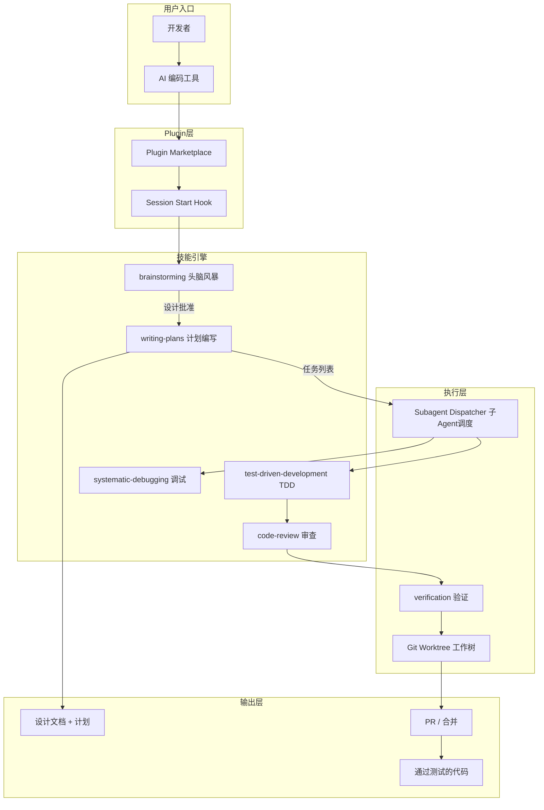
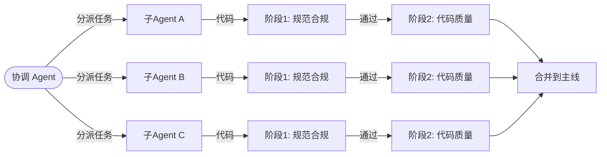

# 245k Star，AI 编码界的「军规手册」：Superpowers 如何把你的 Agent 从实习生变成高级工程师

> 你让 Claude 帮你加个功能，它二话不说就开始写代码——没问你想要什么、没写测试、没做设计。3 分钟后代码交出来了，能跑，但方向偏了一半。这不是模型不聪明，是没人告诉它「写代码前先问清楚需求」。Superpowers 做的事情很简单：给你的 AI 编码助手一套工程纪律。

## 1. 项目速览

| 项目 | 内容 |
|---|---|
| 项目名称 | Superpowers |
| 一句话定位 | 面向 AI 编码 Agent 的可组合技能框架 + 完整软件开发方法论 |
| GitHub 地址 | [obra/superpowers](https://github.com/obra/superpowers) |
| 官方网站 | 无独立官网（Discord 社区为主） |
| 主要语言 | Markdown + Shell（Skills 以 .md 文件定义） |
| 技术栈 | SKILL.md 规范 + Plugin 系统 + Subagent 调度 |
| 开源协议 | MIT |
| Star 数 | ⭐ 245k（2026-07-03） |
| 最新版本 | v6.1.1（2026-07-02） |
| 维护状态 | 极度活跃（日级发版，Issues 持续高响应） |
| 适合人群 | 使用 AI 编码工具做正式项目的开发者，尤其是追求工程质量的团队 |

## 2. 它解决了什么问题

大语言模型被训练得「乐于助人」，实际表现就是——**急于输出**：

- **不问需求就动手**：你说「加个 dark mode」，它直接开始写 CSS，不问你现有样式方案是什么
- **跳过测试**：写完功能就宣布完成，不验证边界情况
- **症状修复而非根因**：遇到 bug 尝试随机 fix，第一次「看起来好了」就收工
- **上下文污染**：长对话中累积的上下文让 Agent 判断力逐渐降低

Superpowers 的解决思路：**不造新模型，不换新工具——给现有 Agent 一套强制执行的工程纪律**。14+ 个可组合的 Skill，每个都有「铁律」（Iron Law）和「硬门」（Hard Gate），AI 不满足前置条件就不允许继续。

本质上，它把你的 AI Agent 当作「能力强但纪律差的初级工程师」，用流程约束把 Junior 变成 Senior。

## 3. 核心功能特性

### 3.1 核心技能（14+）

| 类别 | 技能 | 核心规则 |
|---|---|---|
| **协作** | brainstorming（头脑风暴） | 不批准设计前禁止写代码 |
| **协作** | writing-plans（编写计划） | 每个任务 2-5 分钟，零上下文可执行 |
| **协作** | executing-plans（执行计划） | 批量执行，人工检查点 |
| **协作** | subagent-driven-development（子 Agent 开发） | 每任务独立 Agent + 两阶段审查 |
| **测试** | test-driven-development（TDD） | 铁律：没有失败测试就不写生产代码 |
| **调试** | systematic-debugging（系统化调试） | 铁律：没有根因分析就不修复 |
| **审查** | requesting-code-review（请求评审） | 独立 Agent 审查，不继承实现者上下文 |
| **审查** | receiving-code-review（接收评审） | 不辩解、不顺带改无关代码 |
| **Git** | using-git-worktrees（Git 工作树） | 每个变更独立分支 + 工作树 |
| **Git** | finishing-a-development-branch（完成分支） | 验证→合并/PR/保留/丢弃 |
| **元** | writing-skills（编写技能） | 用 TDD 方法论写流程文档 |
| **元** | using-superpowers（使用 Superpowers） | 技能系统自我介绍 |

### 3.2 特色能力

- **铁律机制**（Iron Law）：关键环节用命令式禁止语句约束 Agent，如「写了测试前的代码？删掉。从头来。没有例外」
- **子 Agent 架构**：每个任务分配独立 Agent，避免上下文污染，支持小时级自主工作
- **10+ 工具适配**：Claude Code、Codex、Cursor、Copilot CLI、Kimi Code、OpenCode、Pi、Antigravity、Factory Droid 全覆盖
- **Visual Brainstorming**（v5+）：设计阶段生成浏览器可交互的 HTML 原型，替代 ASCII 图
- **Plugin Marketplace**：Claude Code / Codex 官方插件市场直接安装

### 3.3 功能边界

- ✅ 适合：正式项目、需要工程质量保障、团队协作、长期维护的代码库
- ✅ 适合：已有 AI 编码工具但输出不可控的开发者
- ❌ 不适合：快速原型/一次性脚本（流程 overhead 超过收益）
- ❌ 不适合：不使用 TDD 且不打算接受 TDD 的团队（核心技能会强制 TDD）
- ⚠️ 注意：部分用户反馈响应变慢（#743），复杂项目中 brainstorming 阶段可能过于冗长

<!-- IMAGE_PROMPT: gpt-image2
生成一张「Superpowers 功能结构全景图」信息图。

布局：
- 顶部标题：Superpowers 功能结构全景图 + 副标题「面向 AI 编码 Agent 的工程纪律框架」+ ⭐ 245k 徽章
- 左侧输入层：自然语言需求描述、代码仓库上下文、Bug 报告
- 中间核心层（流水线）：Brainstorming（探索设计）→ Writing Plans（任务拆解）→ TDD + Subagent（并行实施）→ Code Review（独立审查）→ Finish Branch（合并交付）
- 底部支撑层：Plugin System | 10+ Tool Adapters | Iron Law Engine | Subagent Dispatcher
- 右侧输出层：通过测试的代码、设计文档、实施计划、审查报告

视觉风格：
- 现代技术架构图，16:9 画幅
- 主色 #3366CC，辅色 #5B8FF9，浅灰背景
- 每个 Skill 节点带小图标
- 中文文字清晰可读，PingFang SC 字体
- 不使用真实公司 Logo
-->

## 4. 架构设计

### 4.1 整体架构



### 4.2 子 Agent 驱动开发流程



### 4.3 核心设计思想

- **抽象**：每个 Skill 是一份 SKILL.md 文件，包含触发条件、执行步骤、铁律约束、退出条件
- **流程**：技能按 brainstorm → plan → implement → review → finish 的生命周期自动激活
- **扩展**：writing-skills 技能教 Agent 创建新技能；社区可贡献到 superpowers-skills 仓库
- **隔离**：子 Agent 只接收任务描述 + 相关上下文，不继承完整对话历史，防止上下文污染

## 5. 社区热点（Issues 分析）

### 5.1 精选 Issue

| # | 标题 | 讨论要点 | 状态 |
|---|---|---|---|
| [#429](https://github.com/obra/superpowers/issues/429) | Claude Code Agent Teams 支持 | 社区希望 Superpowers 适配 Claude 的 TeammateTool | Open |
| [#743](https://github.com/obra/superpowers/issues/743) | 使用后响应变慢 | 多 Skill 加载增加 prompt 长度，影响速度 | Open |
| [#895](https://github.com/obra/superpowers/issues/895) | 计划过度指定实现细节 | writing-plans 应留给执行者更多判断空间 | Open |
| [#512](https://github.com/obra/superpowers/issues/512) | Brainstorming 效率 | 简单任务也触发完整头脑风暴流程 | Open |
| [#217](https://github.com/obra/superpowers/issues/217) | GitHub Copilot 支持 | 已支持 Copilot CLI | Closed |
| [#58](https://github.com/obra/superpowers/issues/58) | Skills 无法找到 | 早期安装路径问题，已修复 | Closed |

### 5.2 社区健康度

- **维护响应**：创始人 Jesse Vincent 日级活跃，Release 几乎每周
- **Issue 处理**：Issue 数量大（分类标签齐全），重复/无效问题快速关闭
- **Release 节奏**：v5 → v6 约 3 个月迭代；v6.1.1 于 2026-07-02 发布
- **贡献者生态**：不接受随意新增 Skill 的 PR（质量优先），但接受修复和改进
- **衍生生态**：已有中文增强版（superpowers-zh）、Pi 适配、OpenCode 适配

## 6. 竞品对比

| 维度 | Superpowers | OpenSpec | GSD | gstack |
|---|---|---|---|---|
| 核心定位 | 工程方法论（技能框架） | 规范驱动开发（SDD） | 快速完成任务 | 上下文管理 |
| 解决的问题 | Agent 缺乏工程纪律 | 人机需求对齐 | 减少交互轮次 | 防止上下文丢失 |
| TDD 支持 | 强制（铁律） | 不强制 | 无 | 无 |
| 子 Agent | 内建调度器 | 无 | 无 | 无 |
| 工具兼容 | 10+ 工具 | 25+ 工具 | Claude Code 为主 | Claude Code 为主 |
| 上手成本 | 低（一条命令安装） | 低 | 极低 | 中 |
| Stars | 245k | 58.5k | ~30k | ~15k |
| 哲学 | 「像管理初级工程师一样管理 Agent」 | 「先对齐再动手」 | 「Just Ship It」 | 「上下文是一切」 |

## 7. 快速上手

```bash
# Claude Code（官方插件市场，最简方式）
/plugin install superpowers@claude-plugins-official

# Codex App - 在 Plugins 侧栏点击 Superpowers 的 + 按钮

# Codex CLI
/plugins  # 搜索 superpowers → 安装

# Cursor
/add-plugin superpowers
```

```bash
# 安装后无需额外操作
# 打开你的项目，正常和 AI 对话
# Superpowers 自动在 Session 启动时激活
# 当你说「加个功能」时，它会先问你需求细节
```

安装成功的标志：Agent 开始主动问你需求细节，而不是直接写代码。

## 8. 项目结构

```text
superpowers/
├── skills/                      # 核心技能库
│   ├── brainstorming/           # 头脑风暴技能
│   ├── writing-plans/           # 计划编写技能
│   ├── test-driven-development/ # TDD 技能
│   ├── systematic-debugging/    # 系统化调试
│   ├── subagent-driven-development/ # 子 Agent 开发
│   ├── requesting-code-review/  # 请求评审
│   ├── receiving-code-review/   # 接收评审
│   ├── using-git-worktrees/     # Git 工作树
│   ├── finishing-a-development-branch/ # 完成分支
│   ├── verification-before-completion/ # 完成前验证
│   ├── dispatching-parallel-agents/    # 并行调度
│   ├── executing-plans/         # 计划执行
│   ├── writing-skills/          # 元技能：写技能
│   └── using-superpowers/       # 系统自我介绍
├── plugins/                     # 各工具适配插件
├── docs/                        # 各工具安装说明
├── evals/                       # 技能行为测试
├── tests/                       # 插件基础设施测试
└── LICENSE                      # MIT
```

### 代码阅读路线

1. 先看 `skills/using-superpowers/SKILL.md` 理解技能系统全貌
2. 再看 `skills/brainstorming/SKILL.md` 理解"硬门"机制
3. 接着看 `skills/test-driven-development/SKILL.md` 理解"铁律"设计
4. 扩展开发看 `skills/writing-skills/SKILL.md` 学习如何创建新技能

## 9. 安装部署

### 环境要求

| 项目 | 要求 |
|---|---|
| AI 编码工具 | Claude Code / Codex / Cursor / Copilot CLI / Kimi Code / OpenCode / Pi 等 |
| 额外依赖 | 无（Skills 为纯 Markdown，由 AI 工具解析执行） |
| 操作系统 | 跨平台（Skills 与 OS 无关） |

### 各工具安装命令

| 工具 | 安装命令 |
|---|---|
| Claude Code | `/plugin install superpowers@claude-plugins-official` |
| Codex App | Plugins 侧栏 → Superpowers → 安装 |
| Codex CLI | `/plugins` → 搜索 → 安装 |
| Cursor | `/add-plugin superpowers` |
| Antigravity | `agy plugin install https://github.com/obra/superpowers` |
| Copilot CLI | marketplace add + install |
| Kimi Code | `/plugins install https://github.com/obra/superpowers` |
| OpenCode | 按 `.opencode/INSTALL.md` 指引 |
| Pi | `pi install git:github.com/obra/superpowers` |

### 更新与卸载

大多数工具的 Superpowers 更新自动完成。手动更新：重新执行安装命令即覆盖。

### 遥测说明

brainstorming 的 Visual Companion 加载 Prime Radiant logo 时会发送版本号（无项目内容/prompt/操作数据）。关闭：`export SUPERPOWERS_DISABLE_TELEMETRY=1`

## 10. 社区声量

### 英文社区

- [Hacker News 讨论](https://news.ycombinator.com/item?id=45547344)：Simon Willison 等知名开发者关注；评价为「使用 AI 工具最有野心的方式」
- [Termdock 深度分析](https://www.termdock.com/en/blog/superpowers-framework-agent-skills)：完整拆解 14 个 Skill 的设计哲学
- [Verdent.ai Guide](https://www.verdent.ai/guides/what-is-superpowers-ai-coding-framework)：What Is Superpowers?
- [Medium 对比](https://medium.com/@tentenco/superpowers-gsd-and-gstack-what-each-claude-code-framework-actually-constrains-12a1560960ad)：Superpowers vs GSD vs gstack 三者对比
- chardet 7.0.0 实战案例：使用 Superpowers 开发，41x 性能提升，96.8% 准确率，2161 文件测试覆盖

### 中文社区

- [superpowers-zh 中文增强版](https://github.com/jnMetaCode/superpowers-zh)：完整翻译 + 面向中国开发者的特色 Skills
- [知乎：Claude Code + GLM-5 + Superpowers 保姆级入门](https://zhuanlan.zhihu.com/p/1994894438053470382)
- [DataWhale：Superpowers 工程级开发教程](https://datawhalechina.github.io/easy-vibe/zh-cn/stage-3/core-skills/superpowers/)
- [aivi.fyi：Claude Code 最强外挂保姆级教程](https://www.aivi.fyi/llms/introduce-Superpowers)
- [博客园：浅析 Superpowers 开发方法论](https://www.cnblogs.com/goloving/p/19605466)
- [CSDN：3 步解锁 AI 编程超能力](https://aicoding.csdn.net/696da84b7c1d88441d8de283.html)

## 11. 总结与建议

### 优缺点速览

| 维度 | 评价 |
|---|---|
| 上手成本 | 极低——一条命令安装，自动激活，零配置 |
| 功能完整度 | 高——覆盖设计→实施→测试→审查→交付全周期 |
| 文档质量 | 优秀——每个 Skill 自解释，哲学透明 |
| 维护活跃度 | 最高级别——245k Star，日级发版 |
| 扩展能力 | 中——可自定义 Skill，但官方仓库贡献门槛高 |
| 工具生态 | 10+ AI 编码工具，官方市场直接安装 |

### 我的判断

Superpowers 是当前 AI 编码方法论领域的绝对标杆（245k Star 不是白来的）。它的独特价值在于：**不改变工具，只改变 Agent 的行为模式**——通过「铁律」和「硬门」把 AI 从「急于表现的实习生」训练成「按流程办事的高级工程师」。

**最适合的人**：用 Claude Code / Codex / Cursor 做正式项目，频繁感到 AI 产出需要大量人工纠偏的开发者。

**最佳使用姿势**：直接安装，不需要做任何配置。下一次让 AI 帮你写功能时，注意它是否开始问你需求细节——那就是 Superpowers 在工作。如果你觉得 brainstorming 对简单任务太冗长，可以说"跳过设计，直接写"（Superpowers 允许覆盖）。

**一句话**：如果 OpenSpec 是「先对齐再动手」，那 Superpowers 就是「不仅对齐，还要全程按规矩办事」。

---

> 📌 项目地址：https://github.com/obra/superpowers
> 👤 作者：Jesse Vincent (obra) / Prime Radiant ｜ 💻 语言：Markdown + Shell ｜ 📜 License：MIT
