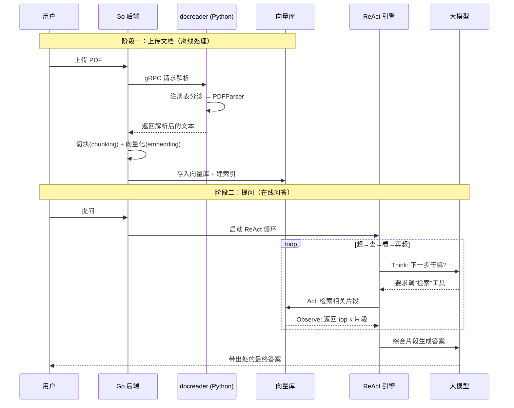
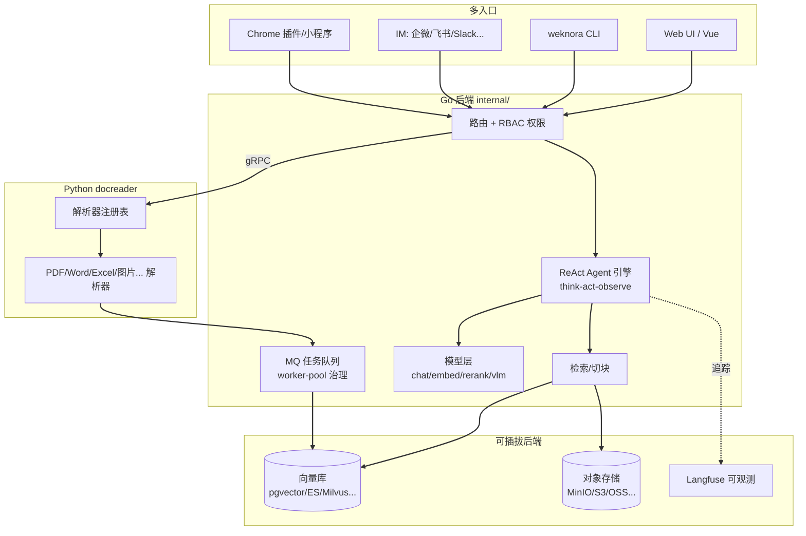

# WeKnora 源码解剖：腾讯这套 RAG 框架，是怎么让 AI「边查资料边思考」的？

> 一句话概括：WeKnora 是腾讯开源的知识库问答框架——你把一堆乱七八糟的文档（PDF、Word、Excel、图片）丢给它，它能解析、切块、建索引，然后让 AI 像侦探破案一样「查一点、想一点、再查一点」，最后给你带出处的答案。它也是微信对话开放平台背后的核心技术。

## 先看一眼这个项目

| 项目 | 信息 |
|---|---|
| 仓库 | [Tencent/WeKnora](https://github.com/Tencent/WeKnora) |
| Star | 约 18.5k（18483，脚本实测） |
| 出品 | 腾讯（Tencent），微信对话开放平台的核心框架 |
| 语言 | Go（后端主体）+ Python（文档解析）+ Vue（前端） |
| 协议 | MIT（很宽松，随便商用） |
| 当前版本 | v0.7.0（2026-07-17 发布，迭代非常快） |
| 部署 | Docker Compose / Kubernetes（Helm），可离线私有化 |
| 官网 | [weknora.weixin.qq.com](https://weknora.weixin.qq.com) |

先说一个能建立信任的点：WeKnora 不是个玩具项目，它是**微信对话开放平台的核心技术框架**。也就是说，你在微信生态里见到的一些"上传文档就能问答"的服务，底层跑的就是它。加上腾讯背书 + MIT 协议 + 半个月一个版本的迭代速度，它在国产 RAG 框架里属于第一梯队。

## 它到底解决什么问题？

假设你手上有几百份公司文档：产品手册、技术方案、会议纪要、Excel 报表、还有一堆扫描件 PDF。老板说："搞个能回答这些文档内容的 AI 助手。"

你很快会撞到一堆墙：

- **文档格式五花八门**——PDF 有的是文字有的是扫描图，Word 有新版 docx 也有老版 doc，还有 Excel、PPT、EPUB、网页……每种都得单独处理。
- **AI 不能一次读几百份文档**——大模型有上下文长度限制，你不可能把所有文档塞进去。得先"检索"出相关片段，再让 AI 看。这就是 RAG（检索增强生成）。
- **简单问答还不够**——有些问题得"多步推理"：先查 A 文档、根据结果再查 B、可能还要上网搜一下，才能回答。这需要 Agent。
- **答案得可信**——AI 说的话要能追溯到原文哪一段，不然没人敢用。

WeKnora 把这些全包了。它的三个核心玩法：

1. **RAG 快速问答**：日常查东西，检索相关片段 + AI 生成答案，带出处。
2. **ReAct Agent**：复杂多步任务，AI 自己编排"检索、调工具、上网搜"，一步步推理。
3. **Wiki 模式**：更狠——让 Agent 把一堆原始文档自动整理成一本带目录、带内部链接、带知识图谱的"活百科"。

下面挑两个最核心的模块拆源码：**AI 怎么思考（ReAct 引擎）** 和 **文档怎么被啃下来（解析器）**。

## 架构总览：Go 管调度，Python 管啃文档

WeKnora 是个多语言项目，分工很清晰：

- **Go 后端**（`internal/`）：主力。负责 Agent 推理、检索、会话、权限（RBAC）、任务队列、各种存储/模型的对接。
- **Python 服务 docreader**（`docreader/`）：专职啃文档。PDF、Word、Excel、图片 OCR 这些脏活累活交给 Python 生态（它库多），通过 gRPC 跟 Go 通信。
- **Vue 前端**（`frontend/`）：Web 界面。此外还有 CLI、Chrome 插件、微信小程序等多个入口。

为什么这么分？因为**文档解析这件事，Python 生态的库最全**（PyMuPDF、python-docx、markitdown、PaddleOCR…），而**高并发的调度和业务逻辑，Go 更合适**。各用所长，用 gRPC 缝起来。

## 源码深挖之一：ReAct 引擎，像侦探破案一样思考

先讲最有意思的——AI 怎么"边查边想"。核心在 `internal/agent/engine.go`。

所谓 **ReAct**，是 Reasoning（推理）+ Acting（行动）的缩写。它不是让 AI 一口气答完，而是让 AI 像**侦探破案**一样循环：**想想现在该干嘛 → 采取行动查证据 → 看看查到了什么 → 再想下一步**，直到破案（得出最终答案）。

看 `runReActIteration` 函数的注释和结构，一次迭代被清清楚楚分成四步：

```go
// runReActIteration executes one ReAct step: think → analyze → act → observe.

// 1. Think: 调用 LLM（带函数调用能力），让它决定下一步
resp, err := e.callLLMWithRetry(ctx, *messagesPtr, tools, state, ...)

// 2. Analyze: 判断是否该停了（LLM 不再要求调工具，说明它想直接回答了）
verdict := e.analyzeResponse(ctx, response, step, ...)
if verdict.isDone {
    state.FinalAnswer = verdict.finalAnswer
    state.IsComplete = true
    return iterOutcomeBreak, nil   // 破案，退出循环
}

// 3. Act: LLM 要求调哪些工具，就去执行（检索知识库/上网搜/MCP 工具）
e.executeToolCalls(ctx, response, &step, ...)

// 4. Observe: 把工具返回的结果塞回对话，进入下一轮
*messagesPtr = e.appendToolResults(*messagesPtr, step)
```

这四步套在一个 `for` 循环里（`executeLoop`），最多转 `MaxIterations` 圈。翻译成侦探故事就是：

> 侦探（LLM）看了案情 → 说"我要去查监控"（要求调工具）→ 助手调出监控给他看（执行 + 观察）→ 侦探再想"还得问问目击者"→ …… → 直到他说"凶手就是他！"（不再要求查证据，直接给结论），案子结。

**真正体现工程功力的，是这个循环里防各种意外的细节**——这些才是"能上生产"和"demo 玩具"的区别：

**① 防止 AI 卡在死循环里空转。** 如果 LLM 连续几轮都返回一模一样的内容又不调工具，说明它"鬼打墙"了，直接掐断：

```go
if response.Content == *lastResponseContent {
    *consecutiveSameContent++
}
if *consecutiveSameContent >= maxRepeatedResponseRounds {
    // 检测到卡死循环，同样内容重复了 N 次，停止
    state.IsComplete = true
    return iterOutcomeBreak, nil
}
```

**② 用户按了"停止"要能优雅收尾。** 如果用户中途取消，它不会直接丢弃，而是尝试用已经查到的工具结果拼一个答案出来：

```go
case <-ctx.Done():
    // 尝试抢救已有结果
    if totalTC := countTotalToolCalls(state.RoundSteps); totalTC > 0 {
        _ = e.streamFinalAnswerToEventBus(ctx, query, state, sessionID)
        state.IsComplete = true
    }
    return state, ctx.Err()
```

**③ AI 答了个空回复怎么办？** 不接受空答案，而是"推它一把"让它重答：

```go
if verdict.emptyContent {
    *messagesPtr = append(*messagesPtr, chat.Message{
        Role: "user", Content: "Please provide your complete answer now as plain text.",
    })
    return iterOutcomeContinue, nil   // 不算一轮，重来
}
```

**④ 上下文太长会自动裁剪。** 每轮都估算当前 token 数，超了就 `manageContextWindow` 裁掉旧消息——避免撞上大模型的上下文上限。

**⑤ 全程 Langfuse 可观测。** 每一轮都开一个 `agent.round.N` 的追踪 span，你能在 Langfuse 里看到 AI 每一步想了什么、调了什么工具、花了多少 token。对调试 Agent 这种"黑盒"太重要了。

这段代码给我的感受是：**ReAct 的原理谁都会讲，但把"AI 会抽风、会空转、会超长、用户会中途取消"这些边界情况全考虑到，才是它敢跑在微信生态里的底气。**

## 源码深挖之二：文档解析器，一个"分诊台"式的注册表

再看 Python 那边怎么啃文档。核心是 `docreader/parser/registry.py` 的 `ParserEngineRegistry`。

文档格式那么多，怎么管理"哪种格式用哪个解析器"？WeKnora 用了**注册表模式（Registry Pattern）**。你可以把它想成医院的**分诊台**：病人（文件）来了，按类型分给对应的专科医生（解析器），没有专科就转给全科（builtin 兜底）。

看它怎么注册"内置引擎"，本质就是一张"文件后缀 → 解析器类"的映射表：

```python
reg.register(
    BUILTIN_ENGINE,
    {
        "docx": Docx2Parser,      # 新版 Word
        "doc":  DocParser,        # 老版 Word（格式完全不同，单独一个）
        "pdf":  PDFParser,
        "md":   MarkdownParser,
        "xlsx": ExcelParser,
        "epub": EPUBParser,
        "mhtml": MHTMLParser,
        **_image_types,           # jpg/png/gif... 都走 ImageParser（OCR）
    },
    description="内置解析引擎",
)
```

分诊的逻辑在 `get_parser_class` 里，最妙的是**兜底 fallback**：

```python
def get_parser_class(self, engine: str, file_type: str):
    # 先看你指定的引擎支不支持这个格式
    if engine and engine in self._engines:
        cls = self._engines[engine].get(ft)
        if cls:
            return cls
        # 不支持？自动回退到 builtin 引擎
        logger.info("Engine '%s' does not support '%s', falling back to builtin", ...)
    # 用内置引擎兜底
    cls = self._engines.get(BUILTIN_ENGINE, {}).get(ft)
    if cls:
        return cls
    raise ValueError(f"Unsupported file type: {file_type}")
```

这个设计的好处很实在：

- **想加新格式/新解析引擎，不用改核心代码**，注册一条映射就行。目前除了内置引擎，还挂了微软的 `markitdown`、专门做 PDF 版面分析的 `opendataloader`。
- **多引擎共存 + 智能回退**。比如你配了个高级引擎但它不认某个格式，系统自动降级到内置引擎，不会直接报错崩掉。
- **引擎可用性检查**。像 `opendataloader` 需要 Java 11+，注册时带了 `check_available` 函数，环境不满足会告诉你"请安装 Java 11+"，而不是运行时莫名其妙失败。

有个源码注释还透露了架构演进的细节——引擎列表管理其实已经挪到 Go 那边了（`docparser.ListAllEngines`），Python 这个 `list_engines` 保留只是为了 gRPC 接口向后兼容，MinerU 这类引擎 Go 原生处理了。**这种"注释里写清楚为什么保留一段看似冗余的代码"，是维护得好的项目的标志。**

## 一次文档问答的完整流转

把两块串起来，看你上传一份 PDF、然后提问，系统怎么跑：



**关键点**：文档处理是**离线**的（上传时就解析好存进向量库），问答是**在线**的（实时检索 + 推理）。这样问答时不用现啃文档，响应快。而检索出来的片段会带着来源信息，所以最终答案能标出"这句话出自哪份文档哪一段"。

## 模块关系全景



实线是主链路。多入口统一进 Go 路由（先过 RBAC 权限），Agent 引擎驱动检索和模型调用，文档解析走 gRPC 交给 Python，向量库/对象存储/可观测都是可插拔的。

## 社区热点：一个有意思的现象

翻它的 Issues，能看到几个真实信号：

- **部署是头号痛点**。1 号 Issue"部署不起来"有 43 条评论，docker-compose 版本问题、环境依赖是新手常见坑。好在官方给了 Docker Compose profiles 分档启动，缓解了一些。
- **重解析想复用缓存**（#1679，42 评论）：目前重建知识库是"全删重算"，OCR、向量、Wiki 全部重跑，社区希望能复用没变的部分——这是规模化用起来后的真实痛点。
- **想要 MySQL**（#1418）：它默认用 PostgreSQL（pgvector），不少人希望支持更常见的 MySQL。
- **一个很特别的点**：大量 Feature Issue 打着"腾讯犀牛鸟开源专属"标签，是腾讯的开源人才培养活动，把功能需求做成给学生认领的任务。**这意味着它的社区不只是用户反馈，还有组织化的贡献者培养机制**——这在开源项目里不多见，对项目的持续性是加分项。

## 快速上手

用 Docker Compose 跑起来：

```bash
git clone https://github.com/Tencent/WeKnora.git
cd WeKnora
cp .env.example .env    # 按注释改配置
docker compose up -d    # 启动核心服务
```

访问 `http://localhost` 即可。想要额外功能，用 profile 分档开启：

```bash
# 知识图谱(Neo4j) + 对象存储(MinIO) + 追踪(Langfuse) 按需组合
docker compose --profile neo4j --profile minio --profile langfuse up -d
```

如果你要频繁改代码，用它的快速开发模式（前端热重载、后端 Air 热重载），不用每次重建镜像：

```bash
make dev-start      # 起基础设施
make dev-app        # 起后端（另开终端）
make dev-frontend   # 起前端（另开终端）
```

## 和几个相关项目比一比

| 对比对象 | 定位差异 |
|---|---|
| **Dify** | 更偏"LLM 应用编排平台"，可视化工作流强；WeKnora 更聚焦"文档理解 + RAG + Agent"，文档解析和 Wiki 模式是特色 |
| **RAGFlow** | 同样主打深度文档理解 + RAG，也很能打；WeKnora 多了 ReAct Agent、Wiki 模式、微信生态集成和更全的 IM 渠道 |
| **FastGPT** | 可视化工作流编排见长；WeKnora 的 Agent 是代码化的 ReAct 循环，文档格式支持更广（10+ 种） |
| **自己拼 LangChain** | 最灵活，什么都能改；但要自己搞定解析、检索、权限、可观测、部署，工作量巨大 |

选型建议：**要可视化拖拉拽编排** → Dify/FastGPT 更顺手；**纯粹追求文档解析质量** → RAGFlow 和 WeKnora 都值得试；**要在微信生态里落地、或想要 ReAct Agent + Wiki 模式 + 企业级权限一整套** → WeKnora 的组合拳很难被替代，尤其是腾讯背书带来的稳定性和迭代速度。

## 深度总结：它做对了什么

拆完源码，WeKnora 有几点判断值得记下来：

1. **ReAct 引擎工程化到位**。think→analyze→act→observe 的循环之外，卡死检测、空回复重试、上下文裁剪、优雅取消、Langfuse 追踪一个不落——这是它能跑生产的根本。
2. **注册表模式让扩展变简单**。解析引擎、向量库、存储后端、LLM 提供商全是可插拔的，加一个新的基本不用动核心代码。
3. **多语言分工务实**。Go 管调度、Python 管啃文档、gRPC 缝合，各用所长。
4. **不只是代码，还有生态**。微信对话开放平台背书、犀牛鸟贡献者培养、半月一版的迭代——项目的"活性"很强。

短板也得实话实说：**它很重**——功能极其多（光 README 就列了 IM 渠道、向量库、存储、Web 搜索各一大串），配置项和依赖服务也多，对只想要个简单知识库问答的个人用户，上手门槛不低，部署踩坑的人不少（1 号 Issue 43 条评论为证）。另外它**默认绑 PostgreSQL**，想用 MySQL 目前还不行。还有个安全提醒：官方明确建议**部署在内网**，别直接暴露到公网。

但如果你要给企业搭一套认真的知识库系统，需要文档理解、多步推理、权限管理、可观测一整套能力，WeKnora 18.5k star 的热度、腾讯的背书、飞快的迭代，确实是国产开源 RAG 框架里第一梯队的选择。

---

<!-- IMAGE_PROMPT: gpt-image2
A clean 16:9 technical architecture infographic for "WeKnora", primary color #3366CC on white background. Top center: bold title "WeKnora" with subtitle "Turn documents into living knowledge — RAG + Agent + Wiki" and a star badge "⭐ 18.5k · by Tencent". Left side: input — a stack of mixed document icons labeled "PDF / Word / Excel / Image / EPUB". Center: three horizontal module blocks — "docreader (Python): parser registry routes by file type", "Go Backend: chunk + embed + retrieve", "ReAct Agent Engine: think -> act -> observe loop". Bottom: infrastructure row with icons labeled "Vector DB: pgvector / ES / Milvus", "Object Storage: MinIO / S3", "Langfuse observability". Right side: output — a chat bubble with a cited answer, plus a small knowledge-graph node cluster labeled "Wiki Mode". Modern flat design, thin lines, generous whitespace, professional developer-tool aesthetic, English labels.
-->

<!-- IMAGE_PROMPT: gpt-image2
A 16:9 conceptual cover image symbolizing WeKnora as an AI detective that reads documents and reasons step by step. Central metaphor: a friendly robot detective with a magnifying glass standing in front of a wall of pinned documents connected by red strings (like a detective's evidence board), each string leading to a glowing knowledge-graph node. The robot has a thought bubble showing a small loop icon labeled "think -> act -> observe". Piles of different document types (PDF, spreadsheet, image) flow into the robot from the left, and a clean cited answer card flows out to the right. Color palette dominated by #3366CC blue with warm accent highlights. A small badge "⭐ 18.5k" in a corner. Clean, modern, slightly playful tech-illustration style, minimal text.
-->
