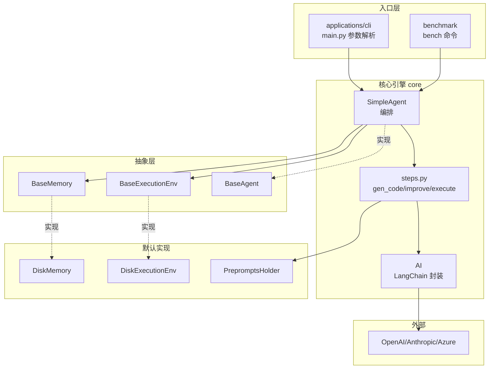
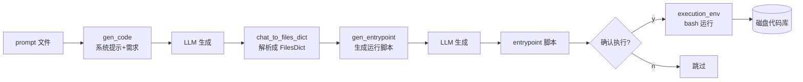
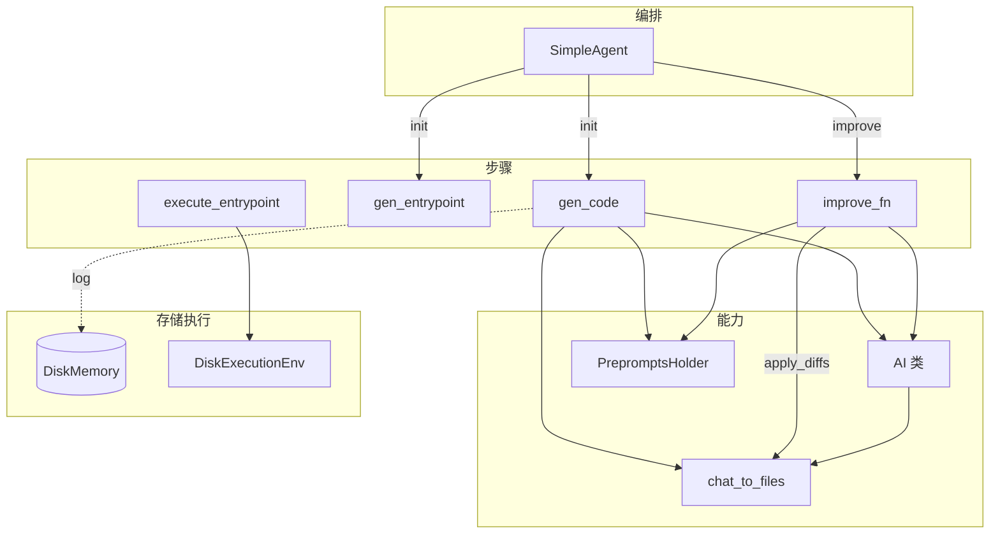

# gpt-engineer 源码拆解：55k Star 的"AI 写代码"鼻祖，核心其实只有 3-6 次 API 调用

> 2023 年那个夏天，一个 Python 脚本让整个技术圈震动：你写一句话描述想要什么软件，它就生成整个代码库还能自己跑起来。它就是 gpt-engineer——如今 lovable.dev 的前身。两年过去，热度退潮，但它的代码值得每个想做 coding agent 的人读一遍：因为它把"AI 写代码"这件事，拆解成了极其干净的几步。

## 1. 项目速览

| 项目 | 内容 |
|---|---|
| 项目名称 | gpt-engineer |
| 一句话定位 | 用自然语言生成整个代码库的 CLI 实验平台 |
| GitHub 地址 | [gpt-engineer-org/gpt-engineer](https://github.com/gpt-engineer-org/gpt-engineer)（原 AntonOsika 仓库已迁移） |
| 官方文档 | https://gpt-engineer.readthedocs.io |
| 主要语言 | Python（3.10 - 3.12） |
| 技术栈 | LangChain + OpenAI/Anthropic/Azure + Poetry |
| 开源协议 | MIT |
| Star 数 | ⭐ 约 55.2k |
| 商业演化 | lovable.dev（原 gptengineer.app，Anton Osika 的商业化产品） |
| 维护状态 | 社区董事会治理（board of contributors），非单人维护 |
| 适合人群 | 想研究 coding agent 实现、做 codegen 实验、跑 benchmark 的开发者 |

## 2. 它解决了什么问题

2023 年之前，让 LLM 写代码的姿势是：打开 ChatGPT，一段段贴需求，一段段复制回答，自己拼成文件，自己建目录，自己跑。繁琐且不可复现。

gpt-engineer 把这条链路自动化成一条命令：

- 你在一个文件夹里写个 `prompt` 文件，描述想要什么
- 跑 `gpte <文件夹>`，它调用 LLM 生成**整个代码库**（多个文件），写到磁盘
- 再生成一个 entrypoint 脚本（装依赖 + 跑起来），问你一句"要执行吗？"，你点 y 它就跑

它的野心不止"生成一次"。用 `gpte <文件夹> -i`（improve 模式），它能读现有代码，按你的新需求生成 **diff** 并打回去——这就是"让 AI 迭代改进代码"。

要说清楚的是：作者自己在 README 里就很诚实——**如果你要的是日常好用的可 hack CLI，去看 aider**；gpt-engineer 定位是"实验平台"（experimentation platform）。社区里也有尖锐的评价（[Discussion #351](https://github.com/AntonOsika/gpt-engineer/discussions/351)）："就是 3-6 次 API 调用，没有推理、不自主，本质是一次性代码生成器。"这话不算错，但恰恰是它的价值——**简单到你能完整读懂一个 coding agent 的骨架**。

## 3. 核心功能特性

### 3.1 核心功能

- **从零生成（默认模式）**：`gpte <dir>` 读 `prompt` 文件 → 生成整个代码库 → 生成 entrypoint → 确认后执行
- **改进现有代码（-i 模式）**：`gpte <dir> -i` 读现有文件 → 生成 diff → 校验并打回，带自纠错重试
- **Benchmark 工具**：额外装一个 `bench` 命令，可以拿自己的 agent 实现去跑 APPS、MBPP 公开数据集

### 3.2 特色能力

- **Preprompts（AI 的"人格"）**：agent 的系统提示词全部外置成 `preprompts/` 文件夹里的文本（roadmap / generate / philosophy / file_format），用 `--use-custom-preprompts` 就能改写 agent 行为，不用碰代码
- **Vision 输入**：给 vision 模型喂 UX 图或架构图当额外上下文，`--image_directory` 指定图片目录
- **多模型**：默认 OpenAI，也支持 Azure、Anthropic Claude，配置一下能跑 WizardCoder 等开源本地模型
- **ClipboardAI**：一个有意思的 hack——没有 API key 也能用，它把对话序列化到剪贴板，你手动粘到网页版 ChatGPT，再把回答粘回来

### 3.3 功能边界

- ✅ 适合：快速把一个想法变成可跑的原型；研究 coding agent 的最小实现；benchmark 自己的 agent
- ❌ 不适合：在大型现有代码库上做日常开发（它一次性生成的模式不擅长增量维护）——这种场景 aider / Cursor 更合适
- ⚠️ 注意：生成质量高度依赖模型和 prompt，复杂项目常需多轮 improve；执行生成的代码前一定看清楚那个 entrypoint 脚本

<!-- IMAGE_PROMPT: gpt-image2
生成一张「gpt-engineer 功能结构全景图」信息图。

布局：
- 顶部标题：gpt-engineer 用自然语言生成整个代码库 + 副标题「The OG codegen platform」+ ⭐ 55k 徽章
- 左侧输入层：prompt 文件（自然语言需求）、可选图片输入（Vision）、preprompts（AI 人格）
- 中间核心层 4 模块：AI（LangChain 封装）→ gen_code（生成代码）→ gen_entrypoint（生成运行脚本）→ execute（确认后执行）；下方并列一条 improve（diff 自纠错循环）
- 底部支撑层：Memory（DiskMemory）、Execution Env（Disk/Docker）、Model Providers（OpenAI/Anthropic/Azure/本地）
- 右侧输出层：完整代码库（多文件）+ entrypoint 脚本 + token 用量日志

视觉风格：
- 现代技术架构图，干净克制，16:9 画幅
- 主色 #3366CC，辅色 #5B8FF9，浅色背景
- 模块间清晰箭头连接
- 中文文字清晰可读，PingFang SC 字体
-->

## 4. 架构设计

### 4.1 整体架构

gpt-engineer 的代码结构分三大块：`core`（核心引擎）、`applications/cli`（命令行入口）、`benchmark`（评测）。



### 4.2 数据流

一次"从零生成"，数据是这样走的：



### 4.3 核心设计思想

- **Step 函数即管线**：`gen_code`、`gen_entrypoint`、`execute_entrypoint`、`improve_fn` 都是独立的纯函数，签名统一（吃 AI + memory + preprompts）。Agent 只负责按顺序调它们。想改流程，换函数就行
- **一切皆抽象接口**：`BaseAgent` / `BaseMemory` / `BaseExecutionEnv` 三个基类。磁盘存储可以换成别的，本地执行可以换成 Docker 沙箱。这是"可 hack"的地基
- **Prompt 工程外置**：系统提示词不写死在代码里，而是拼装 `preprompts/` 里的几个文本文件。改 agent 行为 = 改文本，不用改代码

## 5. 源码深度分析

> 本次聚焦 `gpt_engineer/core` 包。我重点读了三个文件：`ai.py`（LLM 封装，438 行）、`default/steps.py`（步骤函数，398 行）、`default/simple_agent.py`（编排，约 110 行）。这三个文件基本就是 gpt-engineer 的全部核心逻辑——是的，一个能生成整个代码库的工具，核心就这么点代码。

### 5.1 模块全景

| 模块 | 目录 | 核心职责 | 分析级别 |
|---|---|---|---|
| Step 函数 | `core/default/steps.py` | gen_code / improve / execute 全流程 | P0 深度 |
| AI 封装 | `core/ai.py` | LangChain 对话管理 + 重试 + 序列化 | P0 深度 |
| Agent 编排 | `core/default/simple_agent.py` | 依赖注入 + init/improve | P0 深度 |
| 代码解析 | `core/chat_to_files.py` | LLM 输出 → FilesDict / diff 解析应用 | P1 关键流程 |
| 数据结构 | `core/files_dict.py` | FilesDict：代码库的字典表示 | P1 关键流程 |
| CLI 入口 | `applications/cli/main.py` | 参数解析 + 组装 agent | P1 关键流程 |
| 抽象基类 | `core/base_*.py` | Agent/Memory/ExecutionEnv 接口 | P2 说明 |
| Benchmark | `benchmark/` | APPS/MBPP 评测框架 | P2 说明 |

### 5.2 AI 封装：干净的 LangChain 门面

`ai.py` 里的 `AI` 类把 LangChain 的复杂度挡在了外面，只暴露两个核心方法：`start`（开新对话）和 `next`（推进对话）。

```python
def start(self, system: str, user: Any, *, step_name: str) -> List[Message]:
    messages: List[Message] = [
        SystemMessage(content=system),
        HumanMessage(content=user),
    ]
    return self.next(messages, step_name=step_name)

@backoff.on_exception(backoff.expo, openai.RateLimitError, max_tries=7, max_time=45)
def backoff_inference(self, messages):
    return self.llm.invoke(messages)
```

几个值得学的细节：

- **限流退避内建**：`backoff_inference` 用装饰器做指数退避，遇到 OpenAI 限流自动重试 7 次 / 45 秒内。做 LLM 应用这几乎是必备，但很多项目会漏
- **模型选择靠字符串嗅探**：`_create_chat_model` 里，`"claude" in model_name` 就走 `ChatAnthropic`，`azure_endpoint` 存在就走 `AzureChatOpenAI`。土但有效——不用复杂的 provider 注册表
- **消息可序列化**：`serialize_messages` / `deserialize_messages` 让对话历史能存盘再恢复，这是断点续跑的基础

最巧妙的是 `ClipboardAI` 子类：它重写 `next`，把消息序列化后拷进剪贴板、写进 `clipboard.txt`，然后等你手动输入模型的回答。**没有 API key 也能玩 gpt-engineer**——把提示词粘到网页版 ChatGPT，再把结果粘回来。这种"降级可用"的设计透着一股实验平台的务实。

### 5.3 核心流程：gen_code 与 improve 的自纠错循环

`steps.py` 是心脏。`gen_code` 出奇地短：

```python
def gen_code(ai, prompt, memory, preprompts_holder) -> FilesDict:
    preprompts = preprompts_holder.get_preprompts()
    messages = ai.start(
        setup_sys_prompt(preprompts), prompt.to_langchain_content(), step_name=curr_fn()
    )
    chat = messages[-1].content.strip()
    memory.log(CODE_GEN_LOG_FILE, "\n\n".join(x.pretty_repr() for x in messages))
    files_dict = chat_to_files_dict(chat)   # 从 LLM 的文本回答里抠出多个文件
    return files_dict
```

真正见功力的是 improve 模式的**自纠错循环** `_improve_loop`。LLM 生成的 diff 经常格式不对、或者要改的代码块在原文件里找不到。gpt-engineer 的处理是：校验 diff → 把出错信息喂回给 LLM → 让它只重写有问题的 diff → 最多重试 `MAX_EDIT_REFINEMENT_STEPS` 次。

```python
def _improve_loop(ai, files_dict, memory, messages, diff_timeout=3) -> FilesDict:
    messages = ai.next(messages, step_name=curr_fn())
    files_dict, errors = salvage_correct_hunks(messages, files_dict, memory, diff_timeout)
    retries = 0
    while errors and retries < MAX_EDIT_REFINEMENT_STEPS:
        messages.append(HumanMessage(content=
            "Some previously produced diffs were not on the requested format... "
            + "\n".join(errors)
            + "\n Only rewrite the problematic diffs..."))
        messages = ai.next(messages, step_name=curr_fn())
        files_dict, errors = salvage_correct_hunks(messages, files_dict, memory, diff_timeout)
        retries += 1
    return files_dict
```

这段是整个项目最有价值的设计：**把 LLM 当成一个不可靠的函数，用校验 + 反馈重试把它"驯服"成可靠输出**。这个模式今天所有 coding agent 都在用，gpt-engineer 是最早把它写清楚的之一。代价也真实：每次重试都是一轮完整 API 调用，慢且烧 token，所以设了 `MAX_EDIT_REFINEMENT_STEPS` 上限止损。

还有个安全细节：`execute_entrypoint` 在跑生成的代码前，会红字打印脚本内容并问 `Do you want to execute this code? (Y/n)`。LLM 生成的 bash 脚本直接在你机器上跑是有风险的，这个 human-in-the-loop 确认是必要的刹车。

### 5.4 Agent 编排：依赖注入撑起"可 hack"

`SimpleAgent` 把前面所有东西粘起来，代码短得惊人：

```python
class SimpleAgent(BaseAgent):
    def __init__(self, memory, execution_env, ai=None, preprompts_holder=None):
        self.memory = memory
        self.execution_env = execution_env
        self.ai = ai or AI()
        self.preprompts_holder = preprompts_holder or PrepromptsHolder(PREPROMPTS_PATH)

    def init(self, prompt: Prompt) -> FilesDict:        # 从零生成
        files_dict = gen_code(self.ai, prompt, self.memory, self.preprompts_holder)
        entrypoint = gen_entrypoint(self.ai, prompt, files_dict, self.memory, self.preprompts_holder)
        return FilesDict({**files_dict, **entrypoint})

    def improve(self, files_dict, prompt, execution_command=None) -> FilesDict:
        return improve_fn(self.ai, prompt, files_dict, self.memory, self.preprompts_holder)
```

`memory`、`execution_env`、`ai`、`preprompts` 全是构造函数注入的抽象。想把磁盘执行换成 Docker 沙箱？传个 `DockerExecutionEnv` 进去，`init`/`improve` 一行都不用改。这就是 README 反复强调的"easy to adapt, extend"的落地方式——**用依赖注入 + 抽象接口，把可变点全部外置**。

### 5.5 模块关系全景



## 6. 社区热点与维护现状

gpt-engineer 的社区故事本身就值得说：它 2023 年由 Anton Osika 个人开源，几周冲到几万 star，然后作者把商业版做成了 gptengineer.app，后来演化为 lovable.dev（现在很火的 AI 建站产品）。开源仓库则交给了 **gpt-engineer-org 组织 + 董事会治理**，几位长期贡献者（@ATheorell、@TheoMcCabe 等）在维护。

从 Issues 和讨论看，几个反复出现的主题：

- **生成质量波动**：同一个 prompt，换模型或换一次结果差很多，这是 LLM codegen 的通病，不是 bug
- **diff 应用失败**：improve 模式下 LLM 产出的 diff 格式不对导致打不上——这正是 5.3 里那个自纠错循环要解决的问题，也说明它没被彻底解决
- **"这东西到底有没有用"的争论**：有人觉得革命性，有人（如 Discussion #351）觉得就是个包了壳的 prompt。两种声音都真实

社区健康度：**成熟但热度回落**。它完成了历史使命（证明了"自然语言→代码库"可行，并孵化出商业产品），现在更像一个稳定的教学/实验基座，而不是高速迭代的日常工具。

## 7. 竞品对比

| 维度 | gpt-engineer | aider | Cursor | Cline |
|---|---|---|---|---|
| 形态 | CLI 实验平台 | CLI 结对编程 | IDE（VSCode fork） | VSCode 插件 |
| 核心场景 | 从零生成整个项目 | 增量改现有代码库 | 全场景 IDE 内编码 | IDE 内自主 agent |
| 与 git 集成 | 弱 | 强（自动 commit） | 中 | 中 |
| 上手成本 | 低（一条命令） | 低 | 低 | 中 |
| 日常可用性 | 一般（偏实验） | 高 | 高 | 高 |
| 可 hack / 可研究 | 很高（代码极简） | 高 | 低（闭源） | 中 |

说句实在话：**今天要真正干活，gpt-engineer 不是最佳选择**——README 自己都让你去用 aider。aider 在增量改代码、git 集成上成熟得多；Cursor/Cline 有 IDE 加持体验更顺。gpt-engineer 的不可替代性在别处：**它是理解 coding agent 的最佳教材**。想知道"AI 怎么写代码"的底层是怎么回事，读它三个核心文件，比读十篇博客都清楚。它也确实是这一波的开创者——lovable.dev 的血脉从这里来。

## 8. 快速上手

```bash
# 安装
python -m pip install gpt-engineer

# 配置 key
export OPENAI_API_KEY=[your api key]

# 从零生成：先在文件夹里写 prompt 文件
mkdir -p projects/my-app
echo "做一个命令行贪吃蛇游戏，用 Python" > projects/my-app/prompt
gpte projects/my-app

# 改进现有代码
gpte projects/my-app -i
```

跑起来后它会生成代码、生成 entrypoint 脚本，然后停下来问你要不要执行。看清楚脚本内容再按 y。

## 9. 深度总结

gpt-engineer 的历史地位 > 它今天的实用性，这点得诚实承认。作为日常工具，它已经被 aider、Cursor 这些后来者在体验上超越了。

但它的**代码**依然是宝藏。它用不到一千行核心代码，把"AI 写代码"这件玄乎的事拆成了四个能看懂的步骤：封装 LLM（ai.py）、生成代码并解析成文件（gen_code + chat_to_files）、生成并确认执行运行脚本（gen_entrypoint + execute）、用 diff + 自纠错循环迭代改进（improve）。再用依赖注入把 memory、执行环境、模型全做成可替换的抽象。

如果你正在做任何形式的 coding agent，这套骨架值得抄：**step 函数拆分、preprompts 外置、diff 自纠错重试、执行前人工确认**——这四招至今没过时。

一句话：**别把 gpt-engineer 当日常工具用，把它当一本"如何实现 coding agent"的开源教科书读。** 55k star 里，有很大一部分是给这份启发投的。

<!-- IMAGE_PROMPT: gpt-image2
生成一张 gpt-engineer 的文章封面图。

核心隐喻：一句自然语言的"咒语"从左侧输入，穿过一台造型简洁的"代码生成机器"（象征极简的核心引擎），右侧涌出一整个由多个文件方块搭建起来的建筑/代码库，其中一个方块是发光的"运行脚本"。整体传达"一句话 → 整个软件"的魔力，但机器本身是透明的、能看清内部齿轮的（呼应"代码极简、可读懂"）。

画面元素：
- 左侧：一个对话气泡/文本文件，写着 "prompt"
- 中央：一台半透明的机器，内部可见简单的齿轮/流程（gen → parse → execute），机器不复杂反而通透
- 右侧：多个代码文件方块堆叠成一座小建筑，顶部一个发光方块标注 "run"
- 顶部：⭐ 55k Stars 徽章
- 底部标语：「The OG codegen platform · 自然语言 → 整个代码库」

视觉风格：
- 科技感但克制，浅色到蓝色渐变背景
- 主色 #3366CC，机器用通透的玻璃质感表现"可读懂"
- 16:9 宽高比
- 中文标语清晰，整体干净不堆砌
-->
