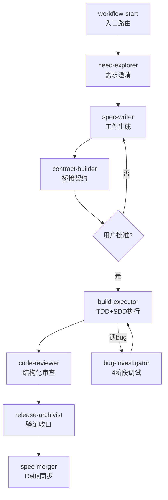

# spec-superflow 源码级融合实战

## 一句话定位

AI 编程两大流派——「规划派」OpenSpec 只管写文档不管执行，「纪律派」Superpowers 只管执行不管需求是否明确。spec-superflow 把两者的核心引擎拆开重组，用一层「执行契约」把规划和实现焊死，9 个 Skill + 8 状态机 + CLI 工具链，自包含交付。

## 项目速览

| 维度 | 数据 |
|------|------|
| 仓库 | [MageByte-Zero/spec-superflow](https://github.com/MageByte-Zero/spec-superflow) |
| Star / Fork | 195 / 13 |
| 语言 | TypeScript（引擎） + JavaScript（CLI/脚本） |
| 版本 | v0.8.4（快速迭代中） |
| 支持平台 | Claude Code / Cursor / Codex CLI / Copilot CLI / Gemini CLI / OpenCode / Trae / Qoder |
| 上游来源 | OpenSpec (Fission-AI/OpenSpec) + Superpowers (obra/superpowers) |
| 核心理念 | Spec First + 契约驱动 + TDD 铁律 + SDD 子代理 |
| 作者 | MageByte-Zero（码哥跳动） |

---

## 为什么需要它——两个失控点

用 AI 写代码最常碰到：

1. **还没想清楚就开始写**：你说「加个权限控制」，AI 改了几十个文件。改到一半才发现——要 RBAC 还是 ABAC？
2. **规划写完但执行跑偏**：proposal 写了、design 画了，但实现过程没人卡测试、没人做 review，等合并才发现行为不对。

spec-superflow 在两个失控点之间建起一道**硬墙**：

```
need-explorer（问清楚）
→ spec-writer（沉淀规范 + Schema 验证）
→ contract-builder（压缩为执行契约）
→ 用户批准（唯一人工介入点）
→ build-executor（TDD + SDD + Review Gate 强制执行）
→ release-archivist（验证后收口）
→ spec-merger（同步 delta spec 防规范腐烂）
```

---

## 核心架构：9 Skill + 8 状态机



### 9 个 Skill 职责表

| # | Skill | 阶段 | 来源 |
|---|-------|------|------|
| 1 | workflow-start | 入口路由（8 状态 + 内容级检测） | 独创 |
| 2 | need-explorer | 一次一问 + 方案对比 + 推荐 | 融合增强 |
| 3 | spec-writer | 产出 proposal/specs/design/tasks + Schema 验证 | 融合增强 |
| 4 | contract-builder | 解析 4 工件 → execution-contract.md | 独创 |
| 5 | build-executor | TDD 铁律 + SDD 子代理 + Review Gate | 融合增强 |
| 6 | bug-investigator | 4 阶段根因分析，3+ 失败升给用户 | ← Superpowers |
| 7 | code-reviewer | 三级问题分级，禁止表演性同意 | ← Superpowers |
| 8 | release-archivist | 验证前完成铁律 + 归档 + 风险总结 | 融合增强 |
| 9 | spec-merger | Delta Spec → 主规范智能合并 | ← OpenSpec |

### 8 状态机

`exploring` → `specifying` → `bridging` → `approved-for-build` → `executing` ⇄ `debugging` → `closing` → `abandoned`（终态）

---

## 独创：execution-contract.md 桥接层

这是 spec-superflow 最核心的独创概念——**执行契约**：

```markdown
# execution-contract.md
- Intent Lock（从 proposal 自动提取）
- Approved Behavior（从 specs 自动提取）
- Design Constraints（从 design 自动提取）
- Task Batches（从 tasks 自动提取）
- Test Obligations & Review Gates
```

**硬约束**：
- 没有 execution-contract.md 或未被用户批准 → 不允许进入实现
- 实现中违反契约 → 拦截并回退
- 需求变更 → 强制回退到 specifying 或 bridging
- 遇到 bug → 强制走 debugging 状态

---

## 源码级融合 vs 简单并排

| | OpenSpec 独有 → 吸收 | Superpowers 独有 → 吸收 | spec-superflow 独创 |
|---|---|---|---|
| 规划 | Schema 引擎、Delta Spec、三维度验证 | — | 桥接层 execution-contract.md |
| 执行 | — | TDD 铁律、SDD 子代理、系统化调试 | 内容级状态检测 |
| 审查 | — | 结构化代码审查、三级分级 | 8 状态机 + 9 Skill 协同 |
| 同步 | Spec 同步、并行调度 | — | 解析引擎自动提取 |

关键区别：**不是两边都装再手工拼接，而是把核心引擎吸收进一个自包含插件**。

---

## 快速上手

### 安装（选择你的平台）

```bash
# Claude Code（推荐）
/plugin marketplace add MageByte-Zero/spec-superflow
/plugin install spec-superflow@spec-superflow

# Cursor
curl -fsSL https://raw.githubusercontent.com/MageByte-Zero/spec-superflow/main/scripts/install-cursor.mjs | node -

# Codex CLI
codex plugin marketplace add MageByte-Zero/spec-superflow
codex plugin add spec-superflow@spec-superflow

# Gemini CLI
gemini extensions install https://github.com/MageByte-Zero/spec-superflow

# CLI 工具链（全局）
npm install -g spec-superflow
```

### 使用

```
用 workflow-start 开始
```

一句话触发，自动检测当前工件状态，路由到正确的下一步。

### 升级与卸载

```bash
# Claude Code 升级
/plugin update spec-superflow@spec-superflow

# Claude Code 卸载
/plugin uninstall spec-superflow@spec-superflow

# Cursor 卸载
rm -rf .cursor/skills/ .cursor/rules/phase-guard.mdc
```

### CLI 工具链

```bash
ssf list              # 列出所有 changes 及状态
ssf validate <dir>    # 验证工件完整性
ssf doctor            # 健康检查
ssf sync <dir>        # delta spec → main spec 合并
ssf audit <dir>       # 决策点审计报告
ssf state check <dir> # 状态一致性检查
```

---

## 快速路径：小变更不被流程拖慢

v0.7.0 起，workflow-start 自动推断变更规模：

| 模式 | 条件 | 流程 |
|------|------|------|
| **hotfix** | ≤2 文件、无新模块 | 跳过 explorer + 完整 spec，走最小契约 |
| **tweak** | ≤4 文件、纯配置/文档 | 跳过 explorer + spec + contract，直接编辑 |
| **full** | 其他 | 完整 7 阶段流程 |

经验法则：如果你会在团队周会花 5 分钟以上解释这个改动，用 full 模式。

---

## Issues 社区热点

| # | 标题 | 状态 | 要点 |
|---|------|------|------|
| #5 | SessionStart hook 注入占用太多 context window | ✅ 已修复 | v0.8.2 token 优化 100→40 |
| #2 | 支持更多 IDE | ✅ 已修复 | v0.7.0 支持 7 平台 |
| #3 | Codex 中如何安装 | ✅ 已修复 | 补充完整安装文档 |
| #8 | 跨 session 制定方案与断点续传 | 🔵 Open | 社区需求热点 |
| #9 | Cursor 如何安装 | 🔵 Open | 新用户入门问题 |

**维护响应**：作者响应迅速（< 24h），v0.8.x 连续 4 个补丁版本修复社区反馈，高度活跃。

---

## 社区声量

- **腾讯云开发者社区**：「我把 4 年踩坑经验蒸馏成 Claude Code Skill 开源了」— 作者分享文章
- **51CTO**：「有人把 5.7 万星 OpenSpec 和 24 万星 Superpowers 融合成一个工作流」— 技术媒体报道
- **51CTO**：「别再纠结 24 万星 Superpowers 还是 5.8 万星 OpenSpec」— 融合方案解读
- **GitHub**：被建议列入 awesome-codex-plugins（Issue #7）

---

## 竞品对比

| 工具 | 定位 | 规划能力 | 执行纪律 | 自包含 |
|------|------|----------|----------|--------|
| **spec-superflow** | 融合工作流插件 | ✅ Schema 验证 + 4 工件 | ✅ TDD + SDD + Review Gate | ✅ |
| **OpenSpec** | 规划框架 | ✅ Delta Spec + Archive | ❌ 执行阶段裸奔 | ✅ |
| **Superpowers** | 执行纪律 | ❌ 无正式规划层 | ✅ TDD + 系统化调试 | ✅ |
| **Spec Kit** | SDD 官方工具包 | ✅ 4 阶段 + Extension | △ 有 implement 但无 Review Gate | ✅ |

---

## 适用场景

**推荐使用**：
- 大型功能开发（需要明确规划、审查、测试门禁）
- 多人协作项目（execution-contract 提供协作合约）
- 长期维护项目（spec-merger 防规范腐烂）
- 棕地项目（need-explorer 先检查现有代码再规划变更）

**不推荐**：
- 一次性脚本 / 纯问答 → 直接用 AI 助手默认行为

---

## 优势与局限

| 优势 | 局限 |
|------|------|
| 源码级融合，不是简单拼装 | 新项目，Star 较少，生态待验证 |
| 9 Skill + 8 状态机，流程严谨 | 学习概念多（契约、状态机、决策点） |
| 7 平台支持，自包含不依赖上游运行时 | 中文为主，国际化覆盖待完善 |
| CLI 工具链（ssf）独立可用 | 完整流程对小项目有 overhead |
| 快速路径（hotfix/tweak）缓解流程重 | v0.x 阶段，API 可能变化 |
| 作者响应快，迭代密集 | 单人维护，bus factor = 1 |

---

## 总结与行动建议

如果你同时欣赏 OpenSpec 的规划严谨性和 Superpowers 的执行纪律，但苦于两者无法协同——spec-superflow 就是那个「焊接点」。

1. **快速体验**：Claude Code 用户执行 `/plugin marketplace add MageByte-Zero/spec-superflow`，然后说「用 workflow-start 开始」
2. **看示例**：仓库 `docs/examples/` 有完整的暗色模式（greenfield）和认证重构（brownfield）两个案例
3. **CLI 探索**：`npm install -g spec-superflow` → `ssf doctor` 检查环境健康度
4. **评估适配**：5 分钟以上能说清楚的改动 → full 模式；小修小补 → hotfix/tweak 自动识别

> 仓库地址：https://github.com/MageByte-Zero/spec-superflow
> 作者公众号：码哥跳动
