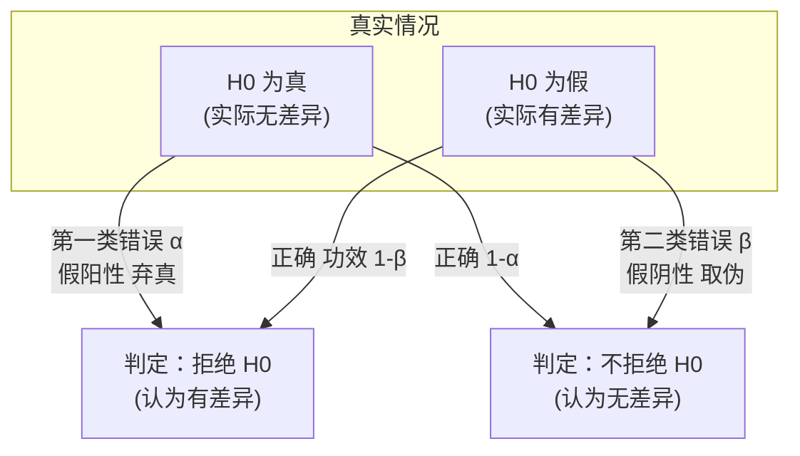
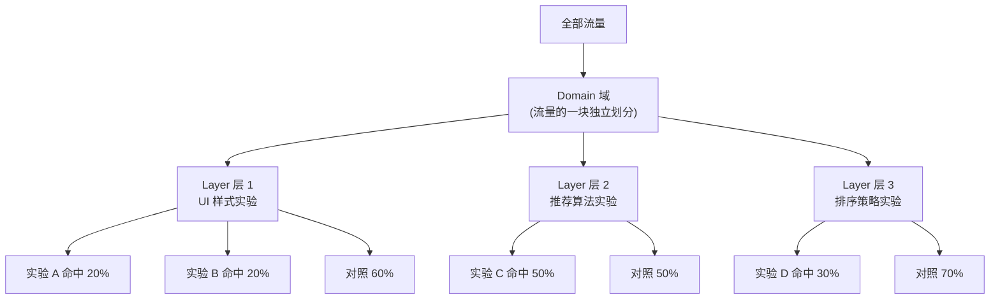
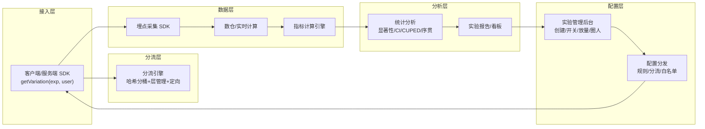
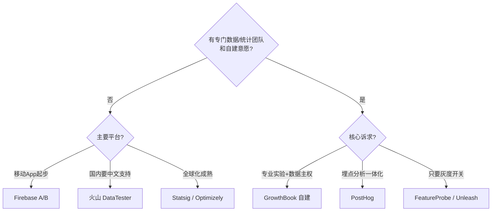
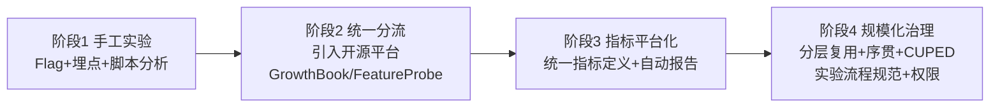
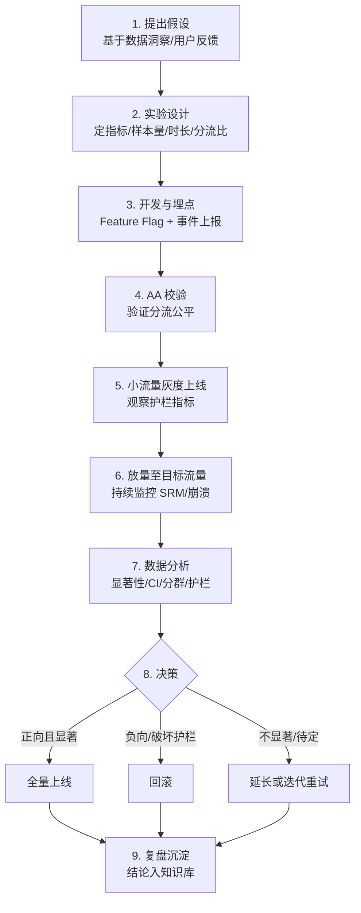

# AB 实验完全指南：原理 · 框架选型 · 落地实战 · 面试通关

> 一份面向工程师 / 数据分析 / 产品的系统化手册。从"AB 实验是什么"讲到"如何在现有项目里最快搭起来"，覆盖统计原理、平台架构、开源选型、落地流程、踩坑清单与面试题库。目标是读完能独立完成一次可信的实验，并能主导团队从 0 到 1 引入实验能力。

---

## 一、AB 实验是什么，本质与价值

### 1.1 一句话定义

AB 实验（A/B Test，也叫对照实验、随机对照试验 RCT 在互联网的工程化落地）是一种**在线受控实验**：把用户随机分成统计上同质的两组（或多组），对照组（A / Control）保持现状，实验组（B / Treatment）施加一个改动，在**同一时间段、相同外部环境**下对比两组的关键指标差异，从而判断这个改动"是否真的、以多大幅度"带来了因果影响。

它的核心不是"哪个版本数字高"，而是**因果推断**：通过随机分流让两组用户在除"改动"之外的所有维度上（人群结构、时间、季节、外部事件）都保持一致，于是两组指标的差异就可以被归因到这个改动本身，而不是运气或其它变量。

### 1.2 为什么随机分流能得到因果

观察数据（比如"用了新功能的人留存更高"）永远有选择偏差——愿意用新功能的人本身可能就更活跃。随机化把用户"抛硬币"分配到两组，让潜在的混杂变量（年龄、活跃度、地域……）在两组间**期望相等**，于是组间差异的唯一系统性来源就是实验干预。这就是 AB 实验相对于事后数据分析（相关性）最本质的优势：**它建立的是因果，而不是相关**。

### 1.3 相比"拍脑袋"决策的核心价值

| 维度 | 不用 AB 实验 | 使用 AB 实验 |
|------|------------|------------|
| 决策依据 | 经验、直觉、HiPPO（最高薪者意见） | 数据、统计显著、可复现 |
| 风险 | 全量上线，翻车影响所有用户 | 小流量灰度，翻车只影响实验组 |
| 收益度量 | "感觉变好了" | 量化到"转化率 +2.3%，置信区间 [1.1%, 3.5%]" |
| 迭代方式 | 大改大赌 | 小步快跑，持续优化闭环 |
| 团队协作 | 争论谁对谁错 | 用实验裁决分歧 |
| 长期沉淀 | 无 | 实验结论沉淀为组织知识资产 |

一个被业界反复引用的经验事实：**大多数被认为"一定有用"的产品改动，真正做了实验后只有约 1/3 是正向的，1/3 无差异，1/3 甚至是负向的。** 这正是实验的价值——它拦住了那些看起来很美但实际有害的想法。

---

## 二、核心概念与统计基础

要把实验做对，必须理解下面这套概念。它是整篇文章的地基，也是面试的重灾区。

### 2.1 实验设计要素

- **实验单元（Randomization Unit）**：随机分流的最小粒度。常见有 user_id（登录用户）、device_id（设备）、cookie/uuid（未登录）、session（会话）、请求（request）。**分流单元要和分析单元、指标口径一致**，否则会引入偏差。C 端最常用 user_id 或 device_id。
- **对照组 / 实验组（Control / Treatment）**：A 是基线，B 是新策略。可以有多个实验组（A/B/C 多臂）。
- **流量分配（Split）**：如 50%/50%，或 90% 对照 + 10% 实验（灰度）。
- **实验假设（Hypothesis）**：事前明确"我认为改动 X 会让指标 Y 提升 Z"，并预设显著性水平和实验时长。**先有假设，再看数据**，而不是反过来。

### 2.2 指标体系（Metrics）

好的实验一定有分层的指标体系，只看一个数字必翻车：

- **核心指标 / 北极星指标（North Star）**：实验最想影响的目标，如转化率、人均时长、GMV、留存。
- **驱动指标（Driver / Proxy）**：核心指标的先行、可快速观测的代理，如点击率、加购率。
- **护栏指标（Guardrail Metrics）**：**绝不能被破坏的底线**，如崩溃率、页面加载时延、退订率、客诉率。很多改动能提升点击却拉低性能，护栏指标就是拦这类"偷鸡"。
- **反向 / 反例指标（Counter Metrics）**：警惕"按下葫芦浮起瓢"，如push点击率升了但卸载率也升了。

### 2.3 假设检验（Hypothesis Testing）

这是判断"差异是真的还是噪声"的数学框架：

- **原假设 H₀**：实验组与对照组无差异（改动无效）。
- **备择假设 H₁**：两组有差异。
- **p 值（p-value）**：在"H₀ 为真"的前提下，观测到当前或更极端结果的概率。p 越小，越有理由拒绝 H₀。
- **显著性水平 α**：拒绝 H₀ 的阈值，通常取 0.05。p < α 即"统计显著"。α 就是**第一类错误（弃真 / 假阳性）**的概率——本没差异却误判为有差异。
- **第二类错误 β（取伪 / 假阴性）**：本有差异却没检出。
- **统计功效（Power = 1 − β）**：真有差异时能检出的概率，通常要求 ≥ 0.8。
- **置信区间（CI）**：效应量的区间估计，比单一 p 值信息更丰富。95% CI 不含 0 等价于 p < 0.05，且能直接读出"提升幅度的可能范围"。

> 一图记牢四象限：



### 2.4 样本量与最小可检测效应（MDE）

实验开跑前必须估算**需要多少样本、跑多久**，否则要么白跑（功效不足），要么浪费流量。

- **MDE（Minimum Detectable Effect，最小可检测效应）**：你希望能检出的最小提升幅度。MDE 越小，需要的样本越多。经验关系：**MDE 与 1/√n 成正比**，即样本量翻 4 倍，可检测的最小效应才缩小一半。
- 样本量的四个决定因素：显著性水平 α、功效 1−β、指标基线方差、MDE。方差越大、MDE 越小、要求功效越高，所需样本越大。
- 二项指标近似样本量公式（每组）：

$$n \approx \frac{(z_{1-\alpha/2} + z_{1-\beta})^2 \cdot 2\,p(1-p)}{(\text{MDE})^2}$$

- **实验时长**：样本量 ÷ 日均可分流量，且**至少覆盖一个完整业务周期（通常 ≥ 1~2 周）**，以吸收工作日/周末、节假日等周期性波动。不要因为"提前显著了"就停——这就是下面要讲的 peeking 问题。

### 2.5 AA 实验与 SRM

- **AA 实验**：两组都用同一策略（都是 A）。用于**校验分流系统是否公平**——如果 AA 都跑出了显著差异，说明分流有偏、埋点有 bug 或指标口径有问题，此时 AB 结论不可信。是上线新实验平台的标准体检。
- **SRM（Sample Ratio Mismatch，样本比例失衡）**：设计是 50:50，实际却是 52:48，用卡方检验一测就显著偏离。SRM 是**实验可信度的头号警报**——一旦触发，实验结论几乎一定不可信，必须排查（分流 bug、重定向丢失、爬虫、埋点丢数、灰度未对齐等），而不是无视。

---

## 三、AB 实验平台的工程架构

小规模可以用简单分流跑起来，但规模化必须有平台。业界平台架构高度趋同，核心是 Google 提出的**多层重叠实验框架**。

### 3.1 为什么需要"分层"：流量复用的矛盾

朴素做法是"一个实验独占一批流量"。但一个大公司同时有成百上千个实验在跑，流量根本不够分。**分层（Layer）** 的核心思想：让互不影响的实验**复用同一批流量**（正交），而互相影响的实验**互斥**（不能命中同一用户）。

- **正交（Orthogonal）**：不同层的实验流量独立，一个用户可以同时命中 UI 层实验和推荐算法层实验，两层的分流互不相关。用于彼此无干扰的实验并行。
- **互斥（Mutually Exclusive）**：同一层内的多个实验瓜分流量，一个用户只会进入其中一个。用于会互相干扰的实验（比如两个都改首页按钮颜色）。

### 3.2 Google 多层重叠实验框架：Domain / Layer / Experiment



- **Domain（域）**：流量的顶层切分，一个域内部可再嵌套层与域，用于隔离"需要独占"的大型实验和"可复用流量"的常规实验。
- **Layer（层）**：域内的一次流量划分。**层与层之间正交**（一个用户在每层都会被独立分流），**同一层内的实验互斥**。层通常按系统模块划分（UI 层、算法层、投放层……）。
- **Experiment（实验）**：层内的具体实验，瓜分本层流量。

这套三级模型让 Google/微软/字节等能同时运行数万个实验（字节 DataTester 官方称：截至 2023 年 6 月累计做过 240 万余次实验，日新增 4000+，同时运行 5 万+）。

### 3.3 分流哈希机制

分流必须满足：**同一用户每次进来结果稳定、不同实验之间分组随机不相关、组间人群同质**。工程上用哈希实现：

```
bucket = hash(experiment_salt + unit_id) % 10000
```

- 每个实验（或每层）用**独立的 salt**，保证不同实验的分桶互不相关（正交的关键）。
- 用 user_id/device_id 做哈希输入，保证同一用户结果稳定（幂等）。
- 火山引擎 DataTester 采用"**两次哈希**"来同时保证分流随机性与分组用户同质性。GrowthBook 用 FNV32a、Statsig 用 SHA256+salt，都是同一思路的不同实现，关键是**跨端一致、可复现、透明可验证**。

### 3.4 平台典型分层架构



---

## 四、主流 AB 实验框架与平台对比

按"自研 vs 商业 SaaS vs 开源自建"三条路线来看。绝大多数团队不该从零自研——**难点不在代码，在统计正确性**，从零造轮子成本极高且容易埋下方法论错误。

### 4.1 商业 / 云平台

| 平台 | 定位 | 优势 | 不足 | 适用 |
|------|------|------|------|------|
| **字节 火山引擎 DataTester** | 国内一线一站式实验平台 | 承接字节内部海量实验经验；分层分流、序贯检验、Feature Flag、指标体系完善；中文生态与支持好 | 商业收费；与火山云生态耦合 | 国内中大型团队、需要成熟方法论 |
| **微软 ExP / Optimizely** | 实验平台鼻祖 | 统计能力顶尖（Kohavi 团队）；序贯检验、CUPED 原生 | Optimizely 偏商业化、贵 | 成熟规模化、有预算 |
| **Google Firebase A/B Testing** | 移动端托管轻量方案 | 接入成本极低、全托管、移动 SDK 稳定、试错成本低、免费 | Web 端识别弱、数据非实时、最多 24 个实验、不支持互斥/分层、被 Google 绑定 | 移动 App 起步阶段 |
| **Statsig** | 商业化一站式（现代） | 统计能力顶级（CUPED、序贯检验、多臂老虎机）；产品分析一体化；不按席位收费 | 部分配置启动后不可改；企业版年费高；国内需代理 | 成熟规模化、全球化产品 |
| **腾讯 / 阿里 PAI-ABTest / TPP** | 大厂内部平台 | 与自家云/推荐链路深度集成 | 主要面向自家云用户 | 已在对应云生态 |

### 4.2 开源框架（可自建，数据主权）

| 框架 | 协议 | 定位 | SDK / 技术栈 | 分流 | 内置指标分析 | 优势 | 不足 |
|------|------|------|-------------|------|------------|------|------|
| **GrowthBook** | MIT | 开源专业级实验平台 | 多语言 SDK（JS/Node/Python/Go/Ruby/PHP/Java/Kotlin/Swift/Flutter…） | FNV32a 哈希、Namespace 实现互斥/分层 | ✅ 支持贝叶斯 + 频率派、CUPED | 数据主权强、统计引擎经社区验证、可对接自有数仓、成本可控 | 需自维护服务与数据管道、配置略复杂 |
| **PostHog** | MIT（部分企业版） | 产品分析 + Feature Flag + 实验一体 | JS/Python/多端 | 内置 | ✅ | 一体化（分析+埋点+实验）、开箱即用 | 实验统计深度弱于专业平台 |
| **Unleash** | Apache-2.0 | Feature Flag 为主 | 多语言 | 灵活策略 | ⚠️ 实验分析较弱 | 特性开关能力强、企业级权限 | AB 统计分析非强项 |
| **Flagsmith** | BSD-3 | Feature Flag / 远程配置 | 多语言 | 分段/百分比 | ⚠️ 需外接 | 部署简单、多环境管理 | 实验分析需外接 |
| **滴滴 FeatureProbe** | Apache-2.0 | 可视化特性管理（灰度+AB+配置） | 服务端 Java/Rust/Go/Python/Node；客户端 JS/Android/iOS/小程序/React；高性能规则判定引擎 | user 上下文规则判定 | ✅ 支持流量监测+指标分析 | 中文、大厂实践、灰度能力强 | 主仓库已归档只读，需到 FeatureProbe 组织找完整代码 |
| **FeatBit** | MIT/商业双 | 现代化 Feature Flag | .NET/多语言 | 内置 | ⚠️ | 轻量、可自建 | 生态较新 |
| **Wasabi（Intuit）** | Apache-2.0 | 早期开源实验平台 | Java + REST API | 桶分配 | 基础 | 经典参考实现 | 已不活跃维护 |
| **Sixpack（SeatGeek）** | BSD | 轻量语言无关 AB | Redis + 多语言客户端 | 简单分桶 | 基础 | 极轻量、快速起步 | 功能简单、无分层 |

### 4.3 选型一句话结论

- **移动 App、快速验证、零预算** → Firebase A/B Testing 起步。
- **要数据主权、有一定工程能力、想长期沉淀** → GrowthBook 自建（业界公认性价比之王，比从零自研省 75%~80% 成本）。
- **已经有埋点分析诉求、想一体化** → PostHog。
- **国内、要中文支持和成熟方法论、预算充足** → 火山引擎 DataTester。
- **只需要灰度开关 + 轻量实验** → FeatureProbe / Unleash / Flagsmith。
- **全球化、成熟规模、追求统计前沿（序贯/老虎机）** → Statsig / Optimizely。



---

## 五、如何在现有项目中引入 AB 实验

### 5.1 从 0 到 1 的最小可用方案（MVP）

不要一上来就搭平台。先用最小成本跑通一次可信实验，验证团队认知：

1. **分流**：用现成 Feature Flag（GrowthBook / FeatureProbe / 甚至一段哈希代码 `hash(salt+user_id)%100 < 50`）实现稳定分组。
2. **埋点**：确保关键指标事件（曝光、点击、转化）带上 `experiment_id` 和 `variation`，这是后续能分析的前提。
3. **分析**：先用 Excel / Python（scipy.stats）算 t 检验和置信区间，不必上分析平台。
4. **决策**：预设显著性阈值和实验时长，到点看结果做决策，复盘沉淀。

### 5.2 从 1 到 N 的平台化演进

跑通几次后，痛点会自然浮现（实验冲突、指标口径不一、分析重复劳动），此时再平台化：



- **阶段 1**：手工，重在建立"先假设后实验、看护栏指标、算显著性"的文化。
- **阶段 2**：统一分流引擎，解决幂等和跨端一致，引入分层避免实验互相污染。
- **阶段 3**：统一指标定义（避免"我的转化率和你的不一样"），自动生成实验报告。
- **阶段 4**：分层流量复用支撑高并发实验；引入 CUPED 降方差、序贯检验支持提前停止；建立实验准入/复盘/权限规范。

### 5.3 落地治理最佳实践

- **实验契约（事前锁规则）**：开跑前锁定假设、指标、样本量、时长、决策规则，避免事后 P-hacking。
- **AA 测试常态化**：新平台/新指标上线先跑 AA 体检。
- **防呆模板 + 分级权限**：降低误配置，核心实验需审批。
- **SRM 自动告警**：每个实验自动监控样本比，异常即报警。

---

## 六、AB 实验完整流程



**每一步的关键动作与注意点：**

1. **假设**：来自数据分析、用户调研、竞品观察。写成"因为……所以我预期改动 X 使指标 Y 提升约 Z"。
2. **设计**：确定随机单元、核心/护栏/反向指标、用 MDE 反推样本量与时长、选定分流比（高风险改动先小流量）。
3. **开发埋点**：改动挂在 Feature Flag 后面（可秒级回滚）；埋点必须带 experiment_id/variation，且经过校验。
4. **AA 校验**：确认无 SRM、AA 无显著差异。
5. **灰度上线**：先 1%~5% 放量，重点盯护栏指标（崩溃、时延、错误率），确认无事故再放量。
6. **放量**：逐步到目标比例，持续监控 SRM。
7. **分析**：看核心指标显著性和置信区间、分群（新老用户/机型/地域）、护栏和反向指标、结合 CUPED 提升灵敏度。
8. **决策**：正向且显著且不破坏护栏 → 上线；破坏护栏或负向 → 回滚；不显著 → 判断是真无效还是灵敏度不足，决定延长/迭代/放弃。
9. **复盘**：无论成败都要沉淀结论，尤其是"意外的负向结果"，是组织最宝贵的知识。

---

## 七、结果分析：如何发挥最大价值

### 7.1 不能只看核心指标涨没涨

一次合格的分析至少包含四层：**核心指标显著性 → 护栏指标是否被破坏 → 分群下钻是否有异质效应 → 反向指标是否恶化**。只看核心指标就下线，是新手最常见的翻车姿势。

### 7.2 提升灵敏度：CUPED 与方差缩减

当实验不显著时，先别急着说"改动无效"，很可能是**灵敏度不够**。提升灵敏度的手段（不靠加流量）：

- **CUPED（利用实验前数据）**：微软 2013 年提出，用实验前的同一指标作为协变量修正，方差可降低约 `1 − Corr(X,Y)²`。协变量与目标相关性越高，方差缩减越大。Bing 的经典效果：原本两周才偶尔显著的实验，用 CUPED 后**第一天就显著**。前提是协变量不受实验影响（对"改变用户结构"的实验如拉活低活用户不适用）。
- **分层 / 后分层（Stratification / Post-strat）**：消除层间方差。
- **方差加权估计（Facebook/Lyft）**：给实验前方差低的用户更高权重。
- **CUPAC / MLRATE**：用 ML 预测值当协变量，是 CUPED 的机器学习扩展（Doordash / Facebook）。
- **换更低方差的指标**：如把"人均购买金额"换成"是否购买（0-1）"，方差更小更灵敏。
- **Delta Method**：处理比率类指标（分子分母来自不同粒度）时正确估计方差。

### 7.3 进阶分析方法

- **频率派 t/z 检验**：大样本用 z 检验（中心极限定理），小样本 t 检验，非正态用 Mann-Whitney U / Bootstrap。
- **序贯检验（Sequential Testing / mSPRT / Always Valid Inference）**：允许**边跑边看、随时停止**而不膨胀假阳性，解决 peeking 问题（Optimizely / Statsig 采用）。
- **贝叶斯 AB**：直接给出"B 优于 A 的概率"和预期收益分布，业务更好理解（VWO / GrowthBook 支持）。
- **多臂老虎机（MAB）**：在探索与利用间动态调整流量，适合短周期、追求累计收益最大化的场景（不追求严格无偏因果）。
- **DID（双重差分）**：无法随机分流时（如按城市推全）的观察性因果推断补充手段。

---

## 八、AB 实验能解决哪些问题 & 引入后的收益

**能解决的典型问题：**

- 产品改版/UI/文案哪个更好——用数据裁决，而非争论。
- 推荐/搜索/排序算法迭代——线上真实收益验证，避免离线指标涨线上跌。
- 定价/补贴/营销策略——量化 ROI，避免烧钱无效。
- 功能价值验证——新功能是真有用还是自嗨。
- 性能/技术改造——重构是否影响体验，护栏指标兜底。
- 风险控制——小流量先行，翻车只影响少数用户，可秒级回滚。

**引入后的组织收益：**

- 决策从"谁声音大"转向"数据说话"，减少内耗。
- 每个上线的改动都有量化收益，可归因、可复盘、可复现。
- 拦截负向改动（业界经验约 1/3 的想法实际有害）。
- 沉淀实验知识库，形成持续优化的复利。

---

## 九、引入过程中的真实问题与解决方案

| 问题 | 现象 | 根因 | 解决方案 |
|------|------|------|---------|
| **SRM 样本比失衡** | 设计 50:50，实际偏离且卡方显著 | 分流 bug、重定向丢失、爬虫、埋点丢数 | 自动 SRM 监控告警；触发即停止分析、排查根因，切勿无视 |
| **辛普森悖论** | 整体看 B 赢，分群看每群 A 都赢 | 分群样本比例不均 + 混杂 | 分群分析；保证各分层分流比例一致；用分层估计 |
| **窥探问题（Peeking）** | 反复看报告、一显著就停 | 多次检验膨胀假阳性 | 事前锁定样本量与时长；或改用序贯检验 |
| **多重比较** | 同时测很多指标/多个实验组，总有"显著" | 假阳性随比较次数累积 | Bonferroni / BH-FDR 校正；区分核心与探索指标 |
| **新奇效应 / 首因效应** | 新功能初期数据虚高后回落 | 用户对"新"本身好奇 | 拉长观察期；只看稳定期；老用户单独分析 |
| **网络 / 溢出效应** | 社交、双边市场里对照组被实验组影响 | 用户间不独立 | 聚类随机（按社群/城市分流）；时间片轮转实验；结束后统计推断修正 |
| **实验相互污染** | 多个实验改同一模块，效应纠缠 | 未做互斥 | 同层内互斥、跨层正交；父子实验管理血缘 |
| **埋点脏数据** | 指标口径对不上、丢数、重复上报 | 埋点未校验、SDK 版本不一 | 埋点前置校验、AA 体检、指标统一定义 |
| **效果衰减** | 上线后收益逐渐消失 | 新奇效应/竞争响应/季节 | 反转实验（Holdback）长期监测真实增量 |
| **样本不足 / 不显著** | 跑很久都不显著 | 流量小 / MDE 太小 / 方差大 | CUPED 降方差、换低方差指标、聚焦高流量入口、合理设定 MDE |
| **季节性 / 外部事件** | 大促、节假日污染 | 时间窗未覆盖完整周期 | 覆盖 ≥1 完整业务周期；避开大促或大促单独实验 |

---

## 十、面试题库与解答思路

> 覆盖概念、统计、工程、业务、排障五类。答题思路：**先给定义/结论，再讲原理，最后结合场景举例**。

**1. 什么是 AB 实验？它凭什么能得到因果结论？**
随机受控实验，把用户随机分组做对照。随机化让潜在混杂变量在两组间期望相等，于是组间差异可归因到干预本身——这是它区别于观察性数据（只能得相关）的根本。

**2. p 值到底是什么？p=0.03 意味着什么？**
p 值是"H₀ 为真时，观测到当前或更极端结果的概率"。p=0.03 意味着若改动其实无效，出现这么大差异的概率只有 3%，小于 0.05 阈值，故拒绝 H₀。注意 p 值**不是**"改动有效的概率"，也不是"H₀ 为真的概率"。

**3. 第一类错误和第二类错误、显著性水平和功效？**
第一类错误 α=弃真（假阳性），第二类错误 β=取伪（假阴性）。显著性水平就是 α（常 0.05），功效=1−β（常要 ≥0.8）。二者此消彼长，增大样本可同时改善。

**4. 如何确定样本量和实验时长？**
由 α、功效、指标方差、MDE 四者决定，MDE 与 1/√n 成正比。时长 = 样本量/日均流量，且至少覆盖一个完整业务周期（≥1~2 周）以吸收周期性波动。

**5. 什么是 MDE？为什么重要？**
最小可检测效应，即你希望能识别出的最小提升。它决定样本量：想检测越小的提升，需要越多样本。设太小会导致实验遥遥无期，设太大会漏掉真实的小收益。

**6. 实验结果不显著怎么办？**
先分清两类原因：(a) 策略真无效；(b) 灵敏度不足。针对 (b)：加样本量、用 CUPED 降方差、换低方差指标、聚焦高流量入口。若确认是 (a) 则如实结论为无效，本身也是有价值的结论。

**7. 什么是 AA 实验，为什么要做？**
两组用同一策略。用于校验分流系统是否公平：若 AA 跑出显著差异或 SRM，说明分流/埋点/指标有问题，此时任何 AB 结论都不可信。上线新平台的必备体检。

**8. 什么是 SRM？发现 SRM 怎么办？**
样本比例失衡——实际分流比显著偏离设计值（卡方检验）。它是实验可信度的头号警报。发现后**必须停止解读结论、排查根因**（分流 bug、重定向、爬虫、埋点丢数），修复后重跑，绝不能无视。

**9. 解释辛普森悖论并给出应对。**
整体趋势与分群趋势相反，常因各分群样本比例不均加混杂变量。应对：分群分析、保证分层分流比例一致、用分层加权估计。

**10. 什么是 peeking（窥探）问题？**
固定样本量的检验只在到达预定样本时才有效。反复偷看、一显著就停会大幅膨胀假阳性。解法：事前锁定样本量与时长，或采用序贯检验（always-valid p 值）允许合法地随时停。

**11. 多重比较问题及校正？**
同时检验多个指标或多个实验组时，"至少一个假阳性"的概率随比较数上升。用 Bonferroni（保守）或 BH-FDR（控制错误发现率）校正，并事前区分核心指标与探索性指标。

**12. CUPED 是什么，为什么能提升灵敏度？**
用实验前数据（协变量 X）修正指标 Y，在无偏前提下降低方差（约降 1−Corr²）。方差小则 p 值更易显著，等于不加流量就提升灵敏度。前提：X 不受实验影响、与 Y 高相关。

**13. 护栏指标是什么？举例。**
不能被破坏的底线指标：崩溃率、页面时延、错误率、退订率、客诉率。防止"核心指标涨了但体验崩了"的偷鸡式优化。

**14. 分层实验框架里的正交和互斥？**
正交=不同层流量独立，一个用户可同时命中多层实验（用于互不干扰的实验并行，靠独立 salt 哈希实现）；互斥=同层内实验瓜分流量，一个用户只进一个（用于会互相干扰的实验）。这是流量复用与实验隔离的平衡。

**15. 分流为什么用哈希？如何保证同一用户稳定分组？**
`bucket = hash(salt + user_id) % N`。哈希保证均匀随机，用 user_id 做输入保证幂等（同人同组），每个实验用独立 salt 保证实验间正交。

**16. 双边市场 / 社交网络里的实验有什么坑？**
用户间不独立（网络/溢出效应），对照组会被实验组间接影响，破坏 SUTVA 假设。解法：聚类随机（按城市/社群整体分流）、时间片轮转实验、供需两端分别实验、事后统计推断修正。

**17. 上线后效果衰减怎么监测？**
新奇效应或竞争响应会让收益消退。用反转实验（Holdback）：全量后保留一小撮对照组长期不上新策略，持续测量真实长期增量。

**18. 什么时候不适合用 AB 实验？**
流量极小（功效不足）、强网络效应且无法聚类、涉及重大不可逆决策、伦理不允许、需要长期才显现的效应。此时可考虑 DID、合成控制、灰度+观察等替代。

**19. 频率派 vs 贝叶斯 AB 的区别？**
频率派给 p 值和置信区间，需预设样本量；贝叶斯直接给"B 优于 A 的概率"和收益分布，业务更易懂、可较自然地持续观测。各有适用，很多平台两者都提供。

**20. 从 0 到 1 如何给团队引入 AB 实验？**
先 MVP（Flag 分流 + 埋点带实验标识 + 脚本算显著性）跑通一次可信实验，建立"先假设、看护栏、算显著"的文化；痛点出现后再平台化（统一分流→指标平台→分层复用+序贯/CUPED+治理规范）。选型上优先成熟方案（GrowthBook 自建 / Firebase / DataTester），不从零造统计轮子。

---

## 十一、快速选型与引入行动清单

**选型（30 秒决策）：**

- 移动 App 起步、零预算 → **Firebase A/B Testing**
- 要数据主权、有工程能力、长期投入 → **GrowthBook（自建）**
- 想埋点分析一体化 → **PostHog**
- 国内、要中文与成熟方法论、有预算 → **火山引擎 DataTester**
- 只要灰度开关 + 轻实验 → **FeatureProbe / Unleash**
- 全球化、追求统计前沿 → **Statsig / Optimizely**

**引入行动清单（可直接照做）：**

1. 选一个高流量、低风险的场景做首个实验（如某按钮文案/颜色）。
2. 接入一个 Feature Flag（GrowthBook/FeatureProbe），实现稳定哈希分流。
3. 埋点补齐 experiment_id + variation，并做 AA 体检确认无 SRM。
4. 事前写好实验契约：假设、核心/护栏指标、MDE、样本量、时长、决策规则。
5. 小流量灰度 → 盯护栏 → 放量 → 到期分析（显著性+CI+护栏+分群）。
6. 复盘沉淀，把结论和踩坑写进团队知识库。
7. 跑通 3~5 个实验后，评估痛点决定是否平台化，逐层引入分层复用、CUPED、序贯检验与治理规范。

**参考自查问题（每次实验前过一遍）：**

- 我的假设写清楚了吗？核心指标和护栏指标都定了吗？
- 样本量和时长够吗？覆盖完整业务周期了吗？
- 分流单元、埋点口径、分析口径一致吗？做 AA 体检了吗？
- 有没有实验冲突（同层互斥、跨层正交）？
- 分析时看了护栏和反向指标吗？分群下钻了吗？有没有 SRM？
- 结论可复现吗？沉淀到知识库了吗？

---

## 参考资料

- [Google 多层重叠实验框架设计理念与应用（知乎）](https://zhuanlan.zhihu.com/p/716293432)
- [随时弃坑的论文推荐系列第1期 Overlapping Experiment Infrastructure](https://gaocegege.com/Blog/kubernetes/cloudab)
- [Google 重叠实验框架：更多，更好（CSDN）](https://blog.csdn.net/huchao_lingo/article/details/109922908)
- [火山引擎 DataTester：AB 测试技术揭秘及应用分享](https://developer.volcengine.com/articles/7291560091340242963)
- [从应用看火山引擎 AB 测试（DataTester）的最佳实践](https://www.cnblogs.com/bytedata/p/17346129.html)
- [了解 A/B 测试产品：DataTester（火山引擎文档）](https://www.volcengine.com/docs/56651/783738)
- [A/B 实验平台选型指南：Firebase vs GrowthBook vs Statsig（掘金）](https://juejin.cn/post/7638677860153688100)
- [PostHog and GrowthBook compared（Statsig）](https://www.statsig.com/perspectives/posthog-and-growthbook-compared)
- [didi/FeatureProbe：开源可视化功能管理平台（GitHub）](https://github.com/didi/FeatureProbe)
- [AB 实验的高端玩法系列2 - 更敏感的 AB 实验，CUPED！（博客园）](https://www.cnblogs.com/gogoSandy/p/11749262.html)
- [用于 AB 测试的减少方差方法总结和对比（CSDN）](https://blog.csdn.net/deephub/article/details/120281398)
- [数据分析/数据科学 AB test 常考题及答案（知乎）](https://zhuanlan.zhihu.com/p/565539453)
- [【数据分析求职】AB 实验框架+高频考点汇总（牛客）](https://www.nowcoder.com/discuss/353159077775745024)
- [七千字带你了解一小部分 AB 实验面试题（知乎）](https://zhuanlan.zhihu.com/p/653883950)
- [Firebase A/B Testing 官方文档](https://firebase.google.com/docs/ab-testing?hl=zh-cn)
- [阿里云 PAI A/B 实验（ABTest）文档](https://help.aliyun.com/zh/pai/a-b-experiment/)
