# DDD 领域驱动设计完全指南：从概念到落地、踩坑与面试

> 本文是一份面向 Java/Spring Boot 后端工程师的 DDD 全景指南，覆盖概念、战略/战术设计、落地架构、渐进式引入、常见踩坑与解决方案、面试知识点、以及团队能力建设方案。文中的代码示例以 Java 17 + Spring Boot 3.x 为基准。

## 一、DDD 是什么

### 1.1 起源与定义

**领域驱动设计（Domain-Driven Design, DDD）** 由 Eric Evans 在 2003 年出版的《Domain-Driven Design: Tackling Complexity in the Heart of Software》（中文译名《领域驱动设计：软件核心复杂性应对之道》，业界俗称"蓝书"）中系统提出。2013 年 Vaughn Vernon 出版《Implementing Domain-Driven Design》（业界俗称"红书"/IDDD），把 DDD 与微服务、事件驱动、CQRS 等实践进一步结合。

一句话概括：**DDD 是一套用于治理复杂业务的软件设计方法论，它主张以"领域模型"为核心，让代码结构直接反映业务语言与业务规则，通过战略设计划定边界、通过战术设计承载知识。**

它并不是框架、不是工具，也不绑定任何语言，而是一种**思维方式 + 一套模式语言**。

### 1.2 DDD 试图解决什么问题

传统"事务脚本 + 贫血模型"在业务复杂到一定规模后普遍会出现下列症状：

- 业务规则散落在各个 Service 中，同一条规则被复制多份；
- Service 越写越大，动辄几千行，一个"下单"跨十几张表；
- 数据库表结构主导领域，改一次业务规则要动 DAO、Service、Controller 全链路；
- 产品、业务、开发用不同语言讨论同一件事，沟通成本高；
- 微服务拆分靠"感觉"，导致边界漂移、循环依赖、分布式事务泛滥。

DDD 从"以模型为中心"的角度提供了一整套方法：**统一语言 → 划分限界上下文 → 建立领域模型 → 用分层架构承载 → 用事件驱动跨上下文协同**。

### 1.3 DDD 与微服务的关系

Eric Evans 提出 DDD 是在 2003 年，但真正大规模流行是 2014 年 Martin Fowler 提出微服务之后。原因很直接：**微服务需要一个"如何拆"的方法论，而 DDD 的限界上下文（Bounded Context）恰好是微服务边界的天然候选**。业界主流观点是"**一个限界上下文可以对应一个微服务，但不必然一一对应**"，两者是互相成就的关系。

## 二、DDD 的宏观全景

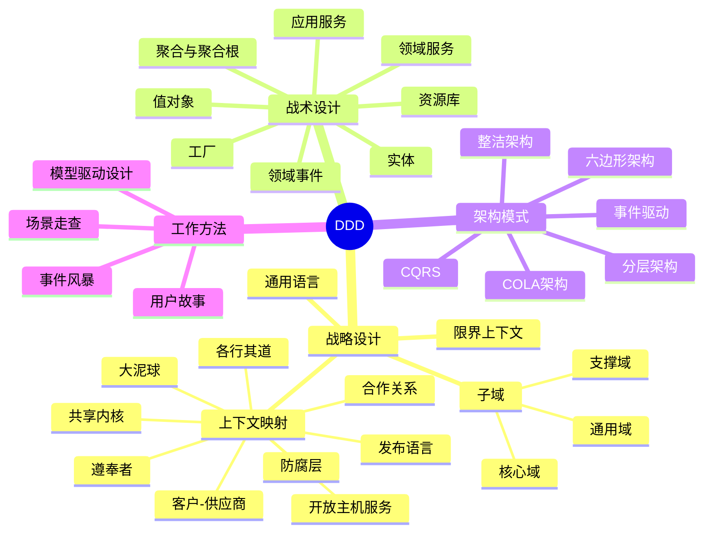

## 三、战略设计：先划边界，再谈模型

战略设计解决的是"**在哪儿建模、建多少个模型**"的问题，是宏观视角。

### 3.1 通用语言（Ubiquitous Language）

通用语言是**领域专家、产品、开发、测试在讨论同一业务时使用的同一套词汇**，并且这套词汇必须与代码中的类名、方法名严格一致。

落地要点：

- 建立一份"术语字典"（Excel/在线文档/Confluence 页），列出术语、定义、同义词、参与人。
- 需求评审、技术评审、代码评审都用同一套词。
- 严格禁止"订单"在产品文档里叫"订单"、在代码里叫 `TradeMainRecord`、在数据库里叫 `t_trade_biz_main`。
- 术语字典由业务专家背书，而不是由 DBA 或架构师"发明"。

美团技术团队强调：**在遗留系统迁移 DDD 时，第一步就是从通用语言开始**——这是成本最低、见效最快的一步。

### 3.2 子域划分：核心 / 支撑 / 通用

在一个完整的业务体系中，不是所有模块都值得投入相同的资源。DDD 将问题空间划分为三类子域：

| 子域类型 | 特征 | 投入策略 | 电商示例 |
|---|---|---|---|
| **核心域 Core Domain** | 决定公司竞争力、变化频繁、需要业务专家深度参与 | 自研 + 顶尖工程师 + DDD 战术精雕 | 交易、营销、推荐 |
| **支撑域 Supporting Subdomain** | 业务必需但不是竞争壁垒 | 自研或采购，中等投入 | 会员、履约、售后 |
| **通用域 Generic Subdomain** | 通用能力，无差异化 | 优先采购/开源/云服务 | 认证、通知、发票、财务对账 |

**原则**：把最强的人力和最精细的建模留给核心域，通用域直接用现成方案。

### 3.3 限界上下文（Bounded Context）

限界上下文是 DDD 最核心、也最容易被误解的概念。可以这样理解：

> **一个限界上下文是一个模型的适用边界**。同一个术语（例如"商品"），在"商品中心"和"营销中心"里含义可能完全不同——在商品中心是 SKU 属性集合，在营销中心是可用于打折的一个凭据。限界上下文的作用就是把这种"同名异义"隔开，让每个上下文内的模型保持内聚和一致。

判断限界上下文边界的常用信号：

- 语言变化：同一名词的属性/行为在不同场景下明显不同。
- 团队边界：不同团队维护、不同的发布节奏。
- 一致性要求：内部强一致，跨上下文可最终一致。
- 部署边界：可独立部署、独立扩容。

### 3.4 上下文映射（Context Map）：九种关系模式

限界上下文之间不是孤岛，它们通过九种模式协作：

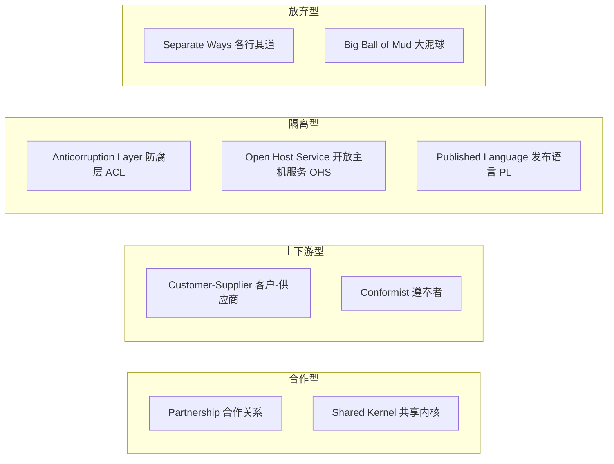

九种模式使用场景：

- **Partnership**：两个上下文一荣俱荣、一损俱损，需要共同规划发布节奏。适用于强绑定的核心子域之间。
- **Shared Kernel**：共享一小部分代码/数据模型（如公共 DTO、错误码）。改动需要双方共同评审。
- **Customer-Supplier**：下游是"客户"，可对上游"供应商"提出需求。适用于有明确协同关系的团队。
- **Conformist**：下游完全遵从上游模型，不做转换。适用于上游强势、下游没有议价能力时。
- **Anticorruption Layer（ACL，防腐层）**：**最常用**。下游在自己一侧建立翻译层，把上游模型翻译成自己领域的语言，避免"上游一动，下游全烂"。
- **Open Host Service**：上游主动提供一套标准协议（如 REST/gRPC），任意下游都可接入。
- **Published Language**：跨上下文的公共"发布语言"，例如 JSON Schema、AsyncAPI 定义的事件契约。
- **Separate Ways**：干脆各建各的，不集成，用户在两个系统间手工同步。
- **Big Ball of Mud**：现实中最常见的"大泥球"——上下文根本没边界，你可以选择识别它、隔离它，但不要试图彻底重构它。

**工程建议**：新对接一个外部系统或遗留系统时，**优先在自己一侧加防腐层**，永远不要让外部模型直接污染你的领域层。

## 四、战术设计：把领域知识刻进代码

战术设计解决的是"**在一个限界上下文内部，如何组织对象**"的问题，是微观视角。

### 4.1 六大核心构件对比

| 构件 | 是否有 ID | 是否可变 | 生命周期 | 关键职责 |
|---|---|---|---|---|
| **实体 Entity** | 有（本地或全局唯一） | 可变 | 独立 | 承载有身份、可变更的业务对象 |
| **值对象 Value Object** | 无 | **不可变** | 依附实体 | 描述"是什么"，如金额、地址、时间段 |
| **聚合根 Aggregate Root** | 全局唯一 | 可变 | 独立 | 聚合的入口，负责保护聚合不变式 |
| **领域服务 Domain Service** | - | 无状态 | - | 承载跨聚合、跨实体的领域行为 |
| **领域事件 Domain Event** | 事件 ID | 不可变 | 一次性 | "已经发生的事实"，跨聚合/上下文协同 |
| **资源库 Repository** | - | 无状态 | - | 聚合的持久化抽象，接口在领域层、实现在基础设施层 |

### 4.2 实体 vs 值对象

**判断口诀**：区分实体和值对象最简单的问题是——"如果两个对象所有属性都相同，它们是不是同一个东西？"，是则值对象，否则实体。

**Java 实现要点**：

```java
// 值对象：不可变、equals/hashCode 基于全部属性、优先 record
public record Money(BigDecimal amount, Currency currency) {
    public Money {
        Objects.requireNonNull(amount);
        Objects.requireNonNull(currency);
        if (amount.scale() > currency.getDefaultFractionDigits()) {
            throw new IllegalArgumentException("金额精度超出币种规范");
        }
    }
    public Money add(Money other) {
        if (!this.currency.equals(other.currency)) {
            throw new IllegalStateException("币种不一致不能相加");
        }
        return new Money(this.amount.add(other.amount), this.currency);
    }
}

// 实体：有唯一标识，equals/hashCode 只基于 ID
public class Order {
    private final OrderId id;
    private OrderStatus status;
    private Money totalAmount;
    // ...
    @Override
    public boolean equals(Object o) {
        return o instanceof Order other && this.id.equals(other.id);
    }
    @Override
    public int hashCode() { return id.hashCode(); }
}
```

值对象的价值常被低估。它是把"表达业务概念"落到代码里的最直接手段：`Money`、`Address`、`PhoneNumber`、`DateRange`、`Percentage` 都应该是值对象，而不是散落在实体里的一堆 `BigDecimal + String`。

### 4.3 聚合与聚合根：一致性的边界

**聚合（Aggregate）** 是一组高内聚的实体与值对象的集合，它们共享同一个一致性边界。**聚合根（Aggregate Root）** 是聚合对外的唯一入口。

Vernon 在 IDDD 中给出的**聚合设计四原则**，是所有 DDD 落地项目都必须遵循的：

1. **在一致性边界之内建模真正的不变式**：只把"必须原子变更"的东西放进同一个聚合。
2. **设计小聚合**：优先"根实体 + 少量值对象"，避免大而全的聚合。
3. **通过唯一标识引用其他聚合**：聚合内部不要持有其他聚合根的对象引用，只持有 ID。
4. **在聚合之外使用最终一致性**：一个事务只修改一个聚合根，跨聚合通过领域事件达成最终一致。

一段经典的错误示范：**把订单、订单项、库存、优惠券、支付流水都塞进同一个 `Order` 聚合**。看似方便，实际带来的代价：

- 一次订单更新加载几十条关联数据，性能崩塌；
- 高并发下乐观锁频繁冲突，接口成功率骤降；
- 各种无关的业务变更都要动 `Order`，代码耦合严重。

正确做法：`Order` 聚合只包含订单本身 + 订单项 + 收货地址；库存是独立聚合、优惠券是独立聚合、支付单是独立聚合，它们之间通过 ID 引用、通过领域事件协作。

### 4.4 领域服务、应用服务、基础设施服务

三种"服务"最容易被搞混，正确区分至关重要：

| 服务类型 | 定位 | 是否属于领域层 | 典型职责 |
|---|---|---|---|
| **应用服务 Application Service** | 用例编排 | 否，属于应用层 | 事务边界、权限、日志、编排领域对象、发布事件 |
| **领域服务 Domain Service** | 无法归属到单个实体的领域行为 | **是** | 跨聚合的领域规则，如"资金转账"跨两个账户 |
| **基础设施服务 Infrastructure Service** | 技术能力 | 否，属于基础设施层 | 发短信、发邮件、写日志、调用第三方 API |

美团团队的经验：**"领域服务和聚合根的核心职责都是封装以复用"，边界模糊时按实际取舍**。可以按下面这个决策树判断：

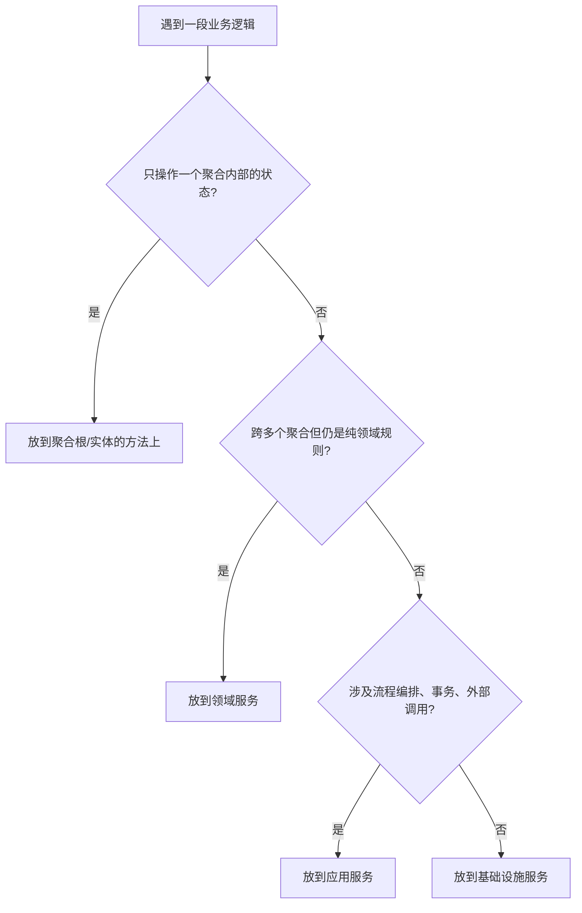

### 4.5 领域事件：跨聚合协同的桥梁

领域事件是"**已经发生的重要业务事实**"，具有三个关键特征：

- **不可变**：一旦发布就是既定事实，属性不能修改。
- **时态命名**：过去时，如 `OrderCreated`、`InventoryDeducted`、`PaymentSucceeded`。
- **携带最小必要信息**：事件里只放下游必须的字段，不要图省事直接塞整个聚合。

**双写一致性痛点**：在一个方法里"先更新数据库、再发 MQ"存在两难：

- 先更库、发 MQ 失败 → 下游收不到通知，数据不一致；
- 先发 MQ、库回滚 → 下游收到"幻觉事件"，产生脏数据。

**解决方案：本地消息表（Outbox 模式）**——在同一个本地事务里同时写业务表和事件表，再由独立线程扫表投递到 MQ。这是目前工业界最稳的方案。

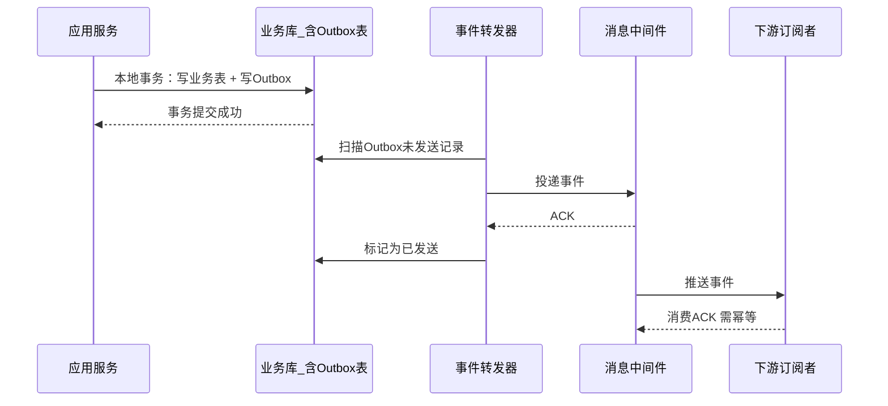

### 4.6 资源库（Repository）与工厂（Factory）

**Repository 的关键约定**：

- 接口定义在**领域层**，实现放在**基础设施层**——这是依赖倒置原则的直接体现。
- Repository 面向**聚合根**，一个聚合根一个 Repository；不要为每张表都建一个 Repository。
- Repository 的方法名要用**领域语言**（`findActiveOrdersByCustomer`），不要用数据库语言（`selectByCustomerIdAndStatus`）。
- Repository 返回的是完整的聚合，负责在内部把 PO 装配成 DO。

**Factory 的作用**：当聚合的构造过程本身包含业务规则、涉及多个协作对象时，把构造过程封装为工厂。简单场景直接用构造函数即可，不必强上工厂。

## 五、DDD 分层架构：四种主流风格

### 5.1 传统四层架构

Evans 蓝书的原始分层：

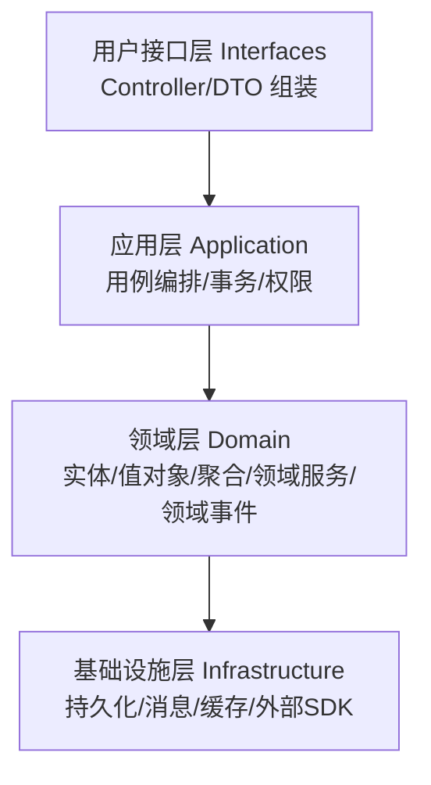

问题：领域层依赖基础设施层，仍是"上层依赖下层"，改数据库会波及领域模型。

### 5.2 依赖倒置后的四层架构

改进：**领域层只依赖抽象，具体实现由基础设施层"倒插"进来**。

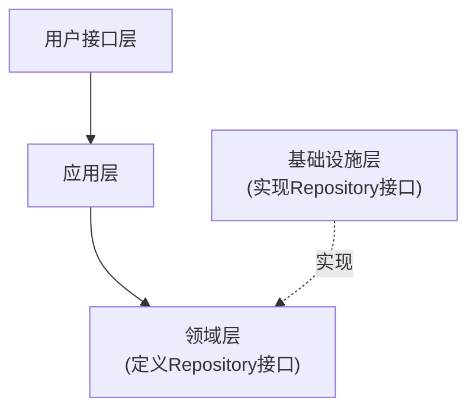

这一步是 DDD 落地的关键分水岭：领域模型不再被 ORM、消息中间件绑架。

### 5.3 六边形架构（Ports & Adapters）

Alistair Cockburn 提出，核心是"**核心不依赖外部世界，一切 IO 通过端口**"。

- **入站端口**：领域对外提供的能力接口（`PayUseCase`）。
- **入站适配器**：把 HTTP/RPC/定时任务/CLI 转换成对入站端口的调用。
- **出站端口**：领域对外部依赖的抽象（`OrderRepository`、`NotificationSender`）。
- **出站适配器**：具体实现，如 MyBatis/JPA/Kafka/短信 SDK。

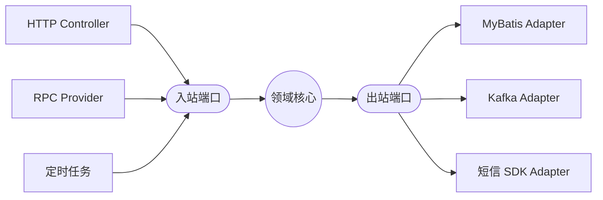

优势：适配器可插拔，UI/DB/MQ 换掉不影响核心；测试时可用内存 Adapter 替换真实实现。

### 5.4 整洁架构（Clean Architecture）

Bob 大叔（Robert C. Martin）提出的圈层模型，从内到外：**Entities → Use Cases → Interface Adapters → Frameworks & Drivers**。核心约束是"**依赖只能向内**"。它与六边形架构同宗同源，只是表达方式不同。

### 5.5 COLA 架构：国内工程化的最佳实践

**COLA（Clean Object-Oriented and Layered Architecture）** 是阿里张建飞开源的应用架构，落地到 Maven 模块层面，是国内 DDD 工程化的事实标杆。

COLA 4.0 的五个模块：

| 模块 | 职责 | 典型内容 |
|---|---|---|
| **adapter** | 入站适配器 | Controller / RPC Provider / MQ Consumer / Job |
| **app** | 应用层 | CommandExecutor / QueryExecutor / EventHandler / 事件发布 |
| **domain** | 领域层 | Entity / ValueObject / DomainService / DomainEvent / Gateway 接口 |
| **infrastructure** | 基础设施层 | GatewayImpl / Mapper / DO / 缓存 / 外部 SDK |
| **client** | 二方库 | 对外暴露的 DTO / API 接口 |

依赖方向：`adapter → app → domain ← infrastructure`，`client` 独立发布供外部调用方引入。

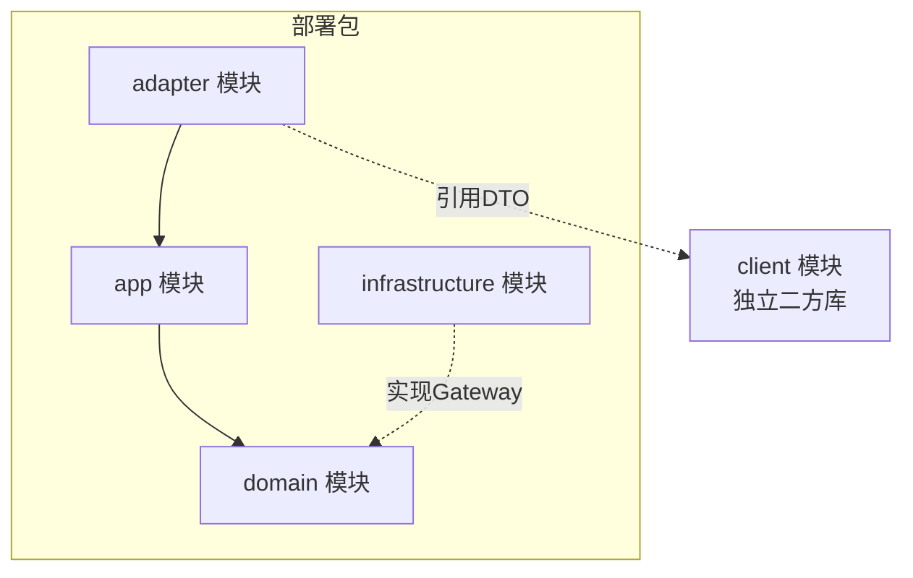

COLA 还提供了**扩展点机制（Extension Point）**：通过 `@Extension` 注解 + `BizScenario`，可以在同一份主流程代码里为不同业务场景（如"淘宝 vs 天猫"、"C 端 vs B 端"）注入不同扩展实现，天然支持"一套骨架，多个业务变体"。

### 5.6 四种架构如何选

| 场景 | 推荐架构 |
|---|---|
| 三方集成多、IO 变化频繁 | 六边形优先 |
| 强调依赖方向、同心圆演进 | 整洁架构 |
| 大团队需要统一规约、脚手架 | COLA 优先 |
| 纯 CRUD 后台系统 | 轻量分层（Controller + Service + Mapper）即可，别硬上 DDD |

## 六、Java/Spring Boot 落地实战

### 6.1 推荐的包结构（COLA 风格 + DDD 命名）

```
com.example.order
├── order-adapter          // adapter 模块
│   ├── controller
│   ├── consumer
│   └── scheduler
├── order-app              // app 模块
│   ├── command
│   │   ├── CreateOrderCmd
│   │   └── CreateOrderCmdExe
│   ├── query
│   ├── event
│   └── convertor
├── order-domain           // domain 模块
│   ├── order              // 订单聚合
│   │   ├── Order.java              // 聚合根
│   │   ├── OrderItem.java          // 实体
│   │   ├── OrderStatus.java        // 枚举
│   │   ├── Address.java            // 值对象
│   │   ├── OrderCreatedEvent.java  // 领域事件
│   │   ├── OrderGateway.java       // 资源库接口（DDD 中的 Repository）
│   │   └── OrderDomainService.java // 领域服务
│   └── shared             // 共享内核
│       └── Money.java
├── order-infrastructure   // infrastructure 模块
│   ├── gatewayimpl
│   │   ├── OrderGatewayImpl.java
│   │   └── database
│   │       ├── OrderMapper.java
│   │       └── OrderDO.java
│   ├── convertor
│   └── config
└── order-client           // 二方库
    ├── api
    └── dto
```

命名细节：COLA 把 Repository 称为 Gateway，语义上更宽泛（既能是 DB、也能是 RPC、也能是消息），是很实用的改进。

### 6.2 完整的下单示例代码

**领域层：聚合根**

```java
// order-domain/order/Order.java
package com.example.order.domain.order;

public class Order {
    private final OrderId id;
    private final CustomerId customerId;
    private final List<OrderItem> items;
    private Address shippingAddress;
    private OrderStatus status;
    private Money totalAmount;
    private final List<DomainEvent> events = new ArrayList<>();

    // 通过工厂方法创建，禁止 public 构造
    public static Order create(CustomerId customerId,
                               List<OrderItem> items,
                               Address address) {
        if (items == null || items.isEmpty()) {
            throw new DomainException("订单必须包含至少一个商品");
        }
        Order order = new Order(OrderId.next(), customerId, items, address);
        order.status = OrderStatus.CREATED;
        order.totalAmount = order.calculateTotal();
        order.events.add(new OrderCreatedEvent(order.id, customerId,
                                               order.totalAmount, Instant.now()));
        return order;
    }

    // 业务方法：状态变更受聚合根守护
    public void pay(Money paidAmount) {
        if (this.status != OrderStatus.CREATED) {
            throw new DomainException("只有待支付订单可以支付");
        }
        if (!paidAmount.equals(this.totalAmount)) {
            throw new DomainException("支付金额与订单金额不一致");
        }
        this.status = OrderStatus.PAID;
        this.events.add(new OrderPaidEvent(this.id, paidAmount, Instant.now()));
    }

    public void cancel(String reason) {
        if (this.status == OrderStatus.PAID || this.status == OrderStatus.SHIPPED) {
            throw new DomainException("已支付/已发货订单不可直接取消，请走退款流程");
        }
        this.status = OrderStatus.CANCELED;
        this.events.add(new OrderCanceledEvent(this.id, reason, Instant.now()));
    }

    private Money calculateTotal() {
        return items.stream().map(OrderItem::subtotal)
                    .reduce(Money.ZERO_CNY, Money::add);
    }

    public List<DomainEvent> pullEvents() {
        List<DomainEvent> snapshot = List.copyOf(events);
        events.clear();
        return snapshot;
    }
    // getters ...
}
```

**领域层：资源库接口**

```java
// order-domain/order/OrderGateway.java
public interface OrderGateway {
    Order findById(OrderId id);
    void save(Order order);
    List<Order> findRecentByCustomer(CustomerId customerId, int limit);
}
```

**基础设施层：资源库实现**

```java
// order-infrastructure/gatewayimpl/OrderGatewayImpl.java
@Component
public class OrderGatewayImpl implements OrderGateway {
    private final OrderMapper mapper;
    private final OrderConvertor convertor;
    private final ApplicationEventPublisher publisher;

    @Override
    @Transactional
    public void save(Order order) {
        OrderDO orderDO = convertor.toDO(order);
        if (orderDO.getId() == null) {
            mapper.insert(orderDO);
        } else {
            int affected = mapper.updateByVersion(orderDO); // 乐观锁
            if (affected == 0) {
                throw new ConcurrentModificationException("订单已被并发修改");
            }
        }
        // 事件落 Outbox 表（同事务）
        order.pullEvents().forEach(evt -> mapper.insertOutbox(convertor.toOutbox(evt)));
    }
    // ...
}
```

**应用层：Command 执行器**

```java
// order-app/command/CreateOrderCmdExe.java
@Component
public class CreateOrderCmdExe {
    private final OrderGateway orderGateway;
    private final InventoryFacade inventoryFacade; // 防腐层
    private final PricingDomainService pricingService;

    @Transactional
    public OrderDTO execute(CreateOrderCmd cmd) {
        // 1. 通过 ACL 调用库存上下文，避免上游模型污染
        inventoryFacade.reserve(cmd.getItems());
        // 2. 定价（领域服务：跨商品、优惠券聚合）
        List<OrderItem> items = pricingService.price(cmd.getItems(), cmd.getCouponId());
        // 3. 聚合根工厂
        Order order = Order.create(cmd.getCustomerId(), items, cmd.getAddress());
        // 4. 持久化 + 事件落 Outbox
        orderGateway.save(order);
        return OrderConvertor.toDTO(order);
    }
}
```

**基础设施层：防腐层**

```java
// order-infrastructure/acl/InventoryFacadeImpl.java
@Component
public class InventoryFacadeImpl implements InventoryFacade {
    private final InventoryRpcClient inventoryRpc; // 外部 RPC

    @Override
    public void reserve(List<OrderItemVO> items) {
        // 把订单上下文的模型翻译成库存上下文的协议
        List<InventoryLockDTO> locks = items.stream()
            .map(i -> new InventoryLockDTO(i.getSkuId().value(), i.getQty()))
            .toList();
        InventoryLockResult result = inventoryRpc.batchLock(locks);
        if (!result.isSuccess()) {
            throw new DomainException("库存不足：" + result.getFailedSkus());
        }
    }
}
```

**Outbox 事件转发器**

```java
@Component
public class OutboxRelay {
    @Scheduled(fixedDelay = 500)
    public void relay() {
        List<OutboxEvent> events = outboxMapper.selectPending(100);
        for (OutboxEvent evt : events) {
            try {
                mqProducer.send(evt.getTopic(), evt.getPayload());
                outboxMapper.markSent(evt.getId());
            } catch (Exception e) {
                outboxMapper.incRetry(evt.getId());
            }
        }
    }
}
```

### 6.3 充血 vs 贫血模型的现实取舍

美团技术团队坦承：**在 Spring 单例 + JPA/MyBatis 的现实环境下，构建完美充血模型有理解成本、学习曲线陡峭**。他们的落地策略是"**通过 DDD 抽象合理的领域模型；代码上仍采用相对简单的贫血模型 + 领域服务承载行为**"。

现实中的三种梯度：

1. **纯贫血**：领域对象只有 getter/setter，所有逻辑在 Service 里。**不推荐**。
2. **半充血 + 领域服务**：领域对象承载不需要外部依赖的规则（校验、状态迁移、纯计算），需要外部依赖的逻辑放领域服务。**大多数团队的最佳落点**。
3. **完全充血**：领域对象内部通过"领域资源注册中心"（无状态 Spring Bean 单例）拿到依赖服务，业务规则完全内聚在实体上。**适合核心域深度建模**。

### 6.4 PO / DO / DTO / VO 该如何区分

不必被概念绑架，关键是搞清各层的"传输货币"：

| 类型 | 所在层 | 特征 |
|---|---|---|
| **DO（Domain Object）** | 领域层 | 有行为的领域对象，聚合根 |
| **PO（Persistent Object）** | 基础设施层 | 纯数据，与 ORM 字段一一对应 |
| **DTO（Data Transfer Object）** | 应用层出参/入参 | 无行为，跨层传输 |
| **VO（View Object）** | 用户接口层 | 面向前端展示定制 |

**转换规则**：Controller ↔ VO/DTO ↔ App Service ↔ DO ↔ Gateway ↔ PO ↔ DB。转换繁琐是 DDD 的必然代价，用 MapStruct 生成 Convertor 可显著降本。

### 6.5 CQRS：读写分离

**CQRS（Command Query Responsibility Segregation）** 主张写模型和读模型分离：

- 写侧：走完整 DDD 聚合，保证一致性。
- 读侧：直接查询宽表/ES/Redis，为界面定制返回结构，跳过聚合。

在 COLA 里就是 `CommandExecutor` vs `QueryExecutor` 的天然分工。**没有必要每个查询都走聚合**——列表页、报表、导出等场景，读模型直连 DB 是最合理的。

## 七、DDD 使用场景与优劣

### 7.1 什么时候用 DDD

| 场景 | 是否推荐 DDD |
|---|---|
| 业务规则复杂、状态多、长期演进 | **强烈推荐** |
| 多团队协作、需要清晰上下文边界 | **强烈推荐** |
| 微服务拆分、事件驱动架构 | **推荐** |
| 中大型系统重构 | **推荐**（渐进式） |
| CRUD 后台系统、简单管理系统 | 不推荐 |
| 一次性的报表/ETL/数据同步 | 不推荐 |
| 生命周期短的 MVP 原型 | 不推荐 |

美团团队总结的经验：**"有一定复杂度的业务才沉淀领域模型；对于简单场景（后端日志、简单配置），省略领域层未尝不可"**。

### 7.2 DDD 的价值

- **业务复杂度治理**：通过模型把散落的规则收拢到聚合根上，"改一处业务只改一处代码"。
- **微服务边界清晰**：限界上下文替代了"拍脑袋拆服务"。
- **业务与技术对齐**：通用语言降低产品-开发-测试的沟通成本。
- **测试友好**：领域层不依赖框架，可以用纯 JUnit 断言业务规则。
- **知识沉淀**：模型是活的文档，新人可通过读代码理解业务。

### 7.3 DDD 的代价与不足

- **学习曲线陡峭**：概念多、模式多，团队需要持续投入学习。
- **建模成本高**：事件风暴、模型迭代都需要时间和业务专家投入。
- **过度设计风险**：把简单业务复杂化，"为了 DDD 而 DDD"。
- **DTO/DO/PO 转换繁琐**：需要工具（MapStruct）配合。
- **与传统 ORM 存在张力**：聚合的加载/保存不如直接 SQL 顺手。
- **团队认知不统一**：一部分人写充血、一部分人写贫血，反而更混乱。

**核心建议**：**方法论要为业务复杂度服务**。一个后台管理系统硬套 DDD 只会把简单事情做复杂。

## 八、在新项目 vs 现有项目中如何引入 DDD

### 8.1 新项目引入路径（推荐 7 步法）

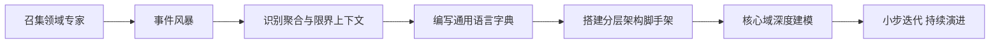

关键动作：

1. **事件风暴**：拉领域专家、产品、开发、测试到一间房，用便利贴梳理"业务事件→命令→聚合→读模型→用户"。
2. **限界上下文识别**：在事件风暴白板上圈出"语言不同/负责人不同/一致性要求不同"的区域，就是候选上下文。
3. **通用语言字典**：把术语落到共享文档，代码提交时强制评审是否与字典一致。
4. **架构脚手架**：直接基于 COLA archetype 生成骨架，团队统一起手式。
5. **核心域优先**：只在核心域深度使用充血模型、领域事件、CQRS，通用域用轻量方案。
6. **持续演进**：模型不是一次定型，随着业务变化重构。

### 8.2 现有项目渐进式引入路径

**核心策略：绞杀者模式（Strangler Fig Pattern）**——不推倒重来，而是在老系统外围包一层新代码，随着新代码逐步"绞杀"老代码，最终替换。

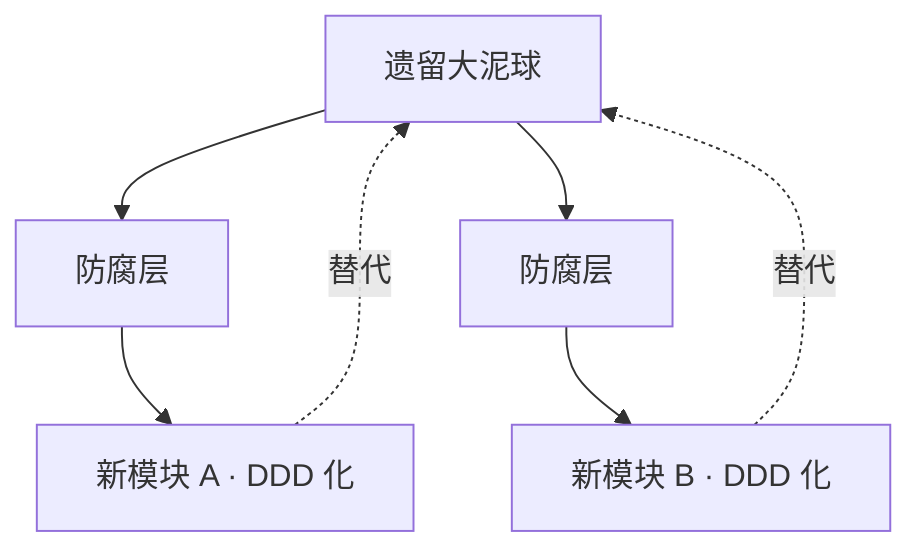

具体步骤：

1. **从统一语言开始**：即便代码不动，也把术语先统一。
2. **选一个变化频繁的新需求作为试点**：单独建一个新模块，DDD 化实现。
3. **在新模块和老系统之间加防腐层**：所有与老系统的交互都走 ACL，避免老模型污染新模型。
4. **老系统的接口不动，内部逐步替换**：先把某个 Service 的实现迁移到新模块，通过 Facade 转发。
5. **积累 3-5 个成功试点后，团队形成模式**：再规划更大范围的重构。
6. **老代码不必强求全部重写**：偏 CRUD 的部分可以永远保持原样。

## 九、DDD 落地八大踩坑与解决方案

### 9.1 坑一：概念驱动，不是问题驱动

**症状**：开会时张口"聚合根、限界上下文、事件风暴"，产品经理一脸茫然。美团团队自己承认："对内协作时高频抛概念不仅没帮助工作，反而增加了聊天的难度"。

**解法**：**永远从业务问题出发**。DDD 术语是团队内部的技术黑话，对外说人话——概念、行为、状态、关键属性。

### 9.2 坑二：限界上下文划得太粗或太细

**症状**：太粗——一个上下文里塞了 10 个业务模块，模型互相纠缠；太细——每个表都建一个上下文，微服务爆炸。

**解法**：以"**语言、团队、一致性、发布节奏**"四个维度做多因素判断。上下文划分不是一次定终身，随组织和业务演进要持续重划。

### 9.3 坑三：聚合过大导致性能与并发问题

**症状**：`Order` 聚合里塞了订单项、库存、支付、日志，每次保存加载几十条数据、乐观锁频繁冲突。

**解法**：**严格遵循"小聚合 + ID 引用 + 事务只改一个聚合"三原则**。发现聚合体积膨胀时立刻拆分，通过领域事件保证最终一致。

### 9.4 坑四：领域层依赖了基础设施/框架

**症状**：领域实体上有 `@Entity @Table @Autowired`，领域模型和 JPA 强绑定；换个 ORM 或想做纯粹的单元测试就一片崩溃。

**解法**：

- 领域层只依赖 JDK 与领域自身，禁止引入 Spring/JPA 注解。
- 使用独立的 PO 承载持久化字段，通过 Convertor 转换。
- 若确实想省事用 JPA 注解在领域对象上，接受"注解是元数据、不是行为绑定"的权衡，但仍要禁止在领域层写 `@Autowired`。

### 9.5 坑五：贫血模型回潮

**症状**：一开始约定充血，几个月后发现"业务逻辑又漏到 Service 层了"，聚合根变成一堆 getter/setter。

**解法**：

- 代码评审卡点：Service 里出现 `if (order.getStatus() == ...)` 这种"外部窥探状态"的写法立刻打回，要求改为 `order.canPay()`、`order.pay(...)` 这类领域方法。
- 静态检查工具（ArchUnit）约束：领域包内的类不允许暴露状态转换 setter。
- 定期做"贫血指数"体检：领域类的公开方法中，业务方法与 getter/setter 的比例。

### 9.6 坑六：领域事件的一致性问题

**症状**：先更库再发 MQ，MQ 挂了，下游收不到；或者先发 MQ 再更库，事务回滚导致"幻觉事件"。

**解法**：**Outbox 模式**——业务表和事件表同事务写入，独立线程扫表投递到 MQ。京东团队实践："使用本地事务表，先主动发送一次，失败则定时扫描重发"。下游消费必须**幂等**。

### 9.7 坑七：跨聚合分布式事务

**症状**：下单要扣库存、扣余额、生成物流单，试图用 XA/Seata AT 强一致，导致锁范围大、性能差、可用性下降。

**解法**：**用 SAGA 替代 2PC**。每个本地事务独立提交，失败时按逆序执行补偿动作（`Ci`）。补偿动作必须幂等。复杂长事务优先用**命令编排式 SAGA**（如状态机），简单事务用**事件协同式 SAGA**。

### 9.8 坑八：DTO/DO/PO 转换繁琐

**症状**：一个功能改动，要动 5 个对象、写 3 个 Convertor，感觉自己在"搬砖"。

**解法**：

- 用 **MapStruct** 自动生成 Convertor，编译期生成、零反射、快。
- 边界稳定的场景可以让某几层共用同一个对象（例如 DTO = VO），不必强求"每层一套"。
- 简单查询走 CQRS 读侧，直接从 SQL 到 DTO，跳过 DO。

## 十、DDD 面试题精选与答题思路（15 题）

### Q1：一句话说说 DDD 是什么？为什么用它？

**答题要点**：DDD 是以业务领域为中心的软件设计方法论，通过**统一语言**打通业务与代码，通过**限界上下文**划分模型边界，通过**聚合**保证一致性，通过**领域事件**协同跨上下文。**它解决的核心问题是"业务复杂度失控"和"微服务边界不清"**。

**加分项**：区分 DDD 和微服务是"方法论 vs 架构风格"、"互相成就"关系；指出 DDD 的核心价值是"业务建模"，不是"代码结构"。

### Q2：实体和值对象的区别？如何判断一个概念是实体还是值对象？

**答题要点**：实体有**唯一标识 + 生命周期 + 可变**；值对象**无标识 + 不可变 + 属性相同即相等**。判断口诀：**属性完全相同的两个对象，是同一个东西吗？** 是 → 值对象，否 → 实体。

**加分项**：举例说明——`Money`、`Address` 是值对象，`Order`、`Customer` 是实体；Java 中值对象优先用 `record`；同一个概念在不同上下文下类型可能不同（"商品"在商品中心是聚合根，在营销中心可能是值对象）。

### Q3：聚合根的设计原则有哪些？

**答题要点**：Vernon 四原则——**（1）** 在一致性边界内建模真正的不变式；**（2）** 设计小聚合；**（3）** 通过 ID 引用其他聚合；**（4）** 聚合之外用最终一致性。

**加分项**：解释"一个事务只改一个聚合根"背后的原因——避免高并发下多聚合乐观锁冲突；举反例说明"大聚合的代价"（性能、并发、耦合）。

### Q4：限界上下文和微服务是什么关系？

**答题要点**：**一个限界上下文可以对应一个微服务，但不必然一一对应**。多个上下文可以合并到一个服务（部署粒度小），一个上下文也可以拆成多个服务（读写分离、SLA 差异）。核心是"限界上下文是模型边界，微服务是部署边界"。

**加分项**：讲清 DDD 从 2003 年提出到 2014 年后才火，是因为微服务时代需要"如何拆"的方法论；上下文映射的九种模式对微服务集成的指导价值。

### Q5：充血模型和贫血模型的区别？在 Spring 里怎么落地充血？

**答题要点**：贫血——领域对象只有数据；充血——领域对象拥有行为，业务规则内聚在对象上。Spring 单例下让 Entity 注入 Service 困难，业界三种落地：**（1）** 半充血 + 领域服务；**（2）** 领域资源注册中心（静态持有无状态 Bean）；**（3）** 依赖以参数形式传入领域方法。

**加分项**：坦诚讲清"完全充血在 Spring 里有理解成本"，美团这种大厂也主要用"半充血 + 领域服务"；不要为了充血而充血，简单业务贫血就够了。

### Q6：Repository 应该返回 DTO 还是聚合根？

**答题要点**：Repository 是**领域层的持久化抽象**，只处理**聚合根**，返回完整的聚合。DTO 是应用层向外传输的对象。写模型走 Repository，读模型（CQRS 查询侧）可以跳过 Repository 直接从 SQL 到 DTO。

**加分项**：强调 Repository 接口在领域层、实现在基础设施层（依赖倒置）；方法名用领域语言（`findActiveOrdersByCustomer`），不用 SQL 语言。

### Q7：领域事件如何保证与业务操作的一致性？

**答题要点**：本地消息表（Outbox）模式——业务表和事件表**同一本地事务**写入；独立线程（Message Relayer）扫表投递到 MQ；下游消费必须**幂等**。避免"先发 MQ 再更库"的双写不一致。

**加分项**：讲清 Spring 的 `@TransactionalEventListener(phase = AFTER_COMMIT)` 用于事务提交后发布；引出 SAGA 与最终一致性；提及事件版本化、事件契约（Published Language）。

### Q8：什么是防腐层？什么场景下需要？

**答题要点**：防腐层（Anticorruption Layer, ACL）是限界上下文之间的**翻译层**，把外部模型翻译成自己领域的语言。**核心场景**：接入外部系统、遗留系统、上游强势且模型不受控时。

**加分项**：说清 ACL 通常放在**基础设施层**、由领域层通过接口调用；对比 Conformist 模式（不做转换）和 ACL（做转换）的取舍。

### Q9：CQRS 是什么？和 DDD 是什么关系？

**答题要点**：CQRS 主张**命令和查询职责分离**——写走完整聚合保证一致性，读直连宽表/ES 提供灵活查询。它和 DDD 不是绑定关系，但天然契合：DDD 的聚合适合写模型，读模型不需要聚合就能优化。

**加分项**：提出"不是所有场景都需要 CQRS"，简单场景写读同一份模型没问题；讲清 CQRS 与 Event Sourcing 的区别——CQRS 只是读写分离，ES 才是"以事件为唯一真相"。

### Q10：如何在遗留系统里落地 DDD？

**答题要点**：**（1）** 从统一语言开始，成本最低；**（2）** 选一个变化频繁的新需求作为试点；**（3）** 用绞杀者模式，新模块 + 防腐层，逐步替换老代码；**（4）** 老 CRUD 部分不必强重构。

**加分项**：强调"DDD 是方法论，可以不改代码只改思考方式"；引用美团观点"没有额外成本，任何时候都可以开始"。

### Q11：什么是事件风暴？流程是怎样的？

**答题要点**：事件风暴（Event Storming）由 Alberto Brandolini 提出，2013 年发布。**流程**：领域专家 + 产品 + 开发在墙上贴便利贴 → 先梳理**领域事件**（橙色，过去时命名）→ 再补齐**命令**（蓝色）→ 引出**聚合**（黄色）→ 圈出**限界上下文** → 识别**读模型**、**外部系统**。

**加分项**：说清事件风暴的价值不在产出图，而在**跨角色对齐认知**；一次风暴 4-8 小时，人不宜多（8-12 人）；产出用于后续架构设计和微服务拆分。

### Q12：一个订单聚合里应该放哪些东西？为什么？

**答题要点**：**放**：订单基本信息（订单号、状态、金额）、订单项（实体或值对象）、收货地址（值对象）、订单相关的领域事件。**不放**：库存、优惠券、支付流水、物流单——这些各自是独立聚合，用 ID 关联。

**加分项**：强调"一致性边界"的判断——什么是必须同事务改的？收货地址改了要改订单金额（有关联），所以在同一聚合；库存扣减要不要跟订单同步？可以最终一致，所以拆开。

### Q13：DDD 落地最难的是什么？

**答题要点**：**（1）** 团队认知统一——一部分人写充血、一部分人写贫血更混乱；**（2）** 不被概念绑架——美团教训"用高级词汇反而增加沟通难度"；**（3）** 与 ORM 的张力；**（4）** DTO/DO/PO 转换成本；**（5）** 领域事件的一致性；**（6）** 现有代码的渐进重构。

**加分项**：**"最难的不是技术，而是让团队愿意持续投入建模"**——业务方参与、代码评审、通用语言字典维护，这些"软"动作决定 DDD 能不能真正落地。

### Q14：六边形架构和 DDD 是什么关系？

**答题要点**：六边形是**架构模式**，DDD 是**设计方法**。六边形提供了"核心不依赖外部世界"的结构，天然承载 DDD 的领域模型——领域层放在核心（六边形内部），Repository/外部服务作为出站端口，Controller/MQ 消费者作为入站适配器。**它们互补而非替代**。

**加分项**：类比整洁架构、洋葱架构、COLA 都是"把领域模型和外部依赖解耦"的不同表达；选型看团队和场景。

### Q15：如果让你从零搭一个 DDD 项目，你会怎么组织包结构？

**答题要点**：直接给出 COLA 五模块结构：adapter / app / domain / infrastructure / client。domain 子包按**聚合**划分（`domain/order`、`domain/customer`），而不是按类型（`domain/entity`、`domain/service`）——这样一个业务能力的所有东西在一起，改代码时不用满仓库找。

**加分项**：说清模块间依赖方向（adapter → app → domain ← infrastructure，client 独立）；提到 Gateway 命名比 Repository 更通用（覆盖 DB/RPC/MQ）；引入 ArchUnit 做架构约束单测。

## 十一、如何快速建设团队的 DDD 能力

要让一个团队从"知道 DDD"到"能落地 DDD"，通常需要 **3-6 个月**的持续投入。下面是一个可复制的能力建设路线。

### 11.1 完整方案：五个阶段 + 五类抓手

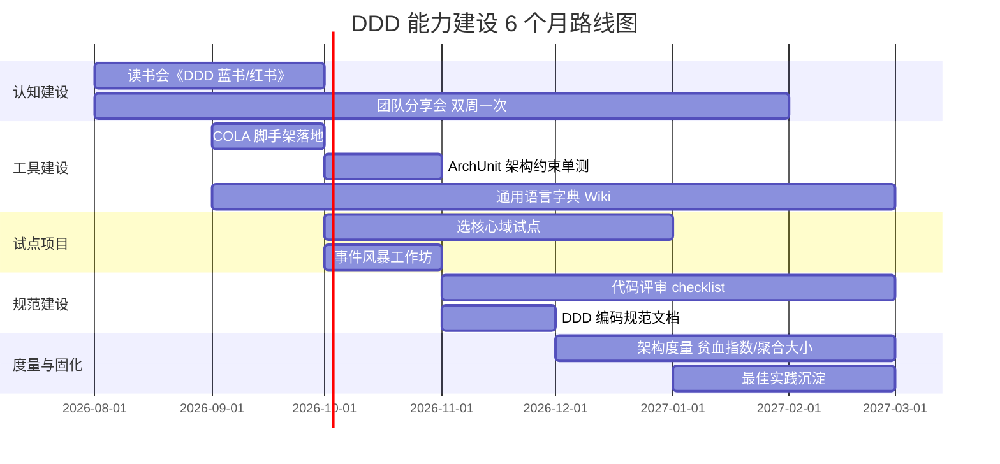

**五个阶段**：

1. **认知建设（0-2 月）**：读书会 + 分享会。核心书目：Evans《领域驱动设计》、Vernon《实现领域驱动设计》、张建飞《代码精进之路》/COLA 系列文章。
2. **工具建设（1-3 月）**：基于 COLA 或自研 archetype 生成脚手架，写好 ArchUnit 架构约束，搭建通用语言字典 Wiki。
3. **试点项目（3-6 月）**：选一个中等复杂度的核心域业务作为试点，从事件风暴开始，跑完一个完整迭代。
4. **规范建设（4-6 月）**：沉淀代码评审 checklist、编码规范、常见反模式清单。
5. **度量与固化（5-6 月+）**：引入度量指标（聚合平均大小、Service 与领域方法比例、跨聚合事务次数），把 DDD 内化为团队肌肉记忆。

**五类抓手**：

- **人**：找 1-2 个技术负责人做"DDD 布道师"，参加事件风暴工作坊、写内部教程。
- **书**：读书会 + 内部读后感。
- **码**：脚手架 + 参考实现 + demo 项目。
- **审**：代码评审 checklist + 架构约束单测（防止倒退）。
- **量**：架构度量指标，定期公示。

### 11.2 试点项目选型建议

| 项目类型 | 是否推荐做试点 | 原因 |
|---|---|---|
| 中等复杂度的核心业务 | **强烈推荐** | 有价值、有反馈、能学到东西 |
| 全新业务、无历史包袱 | **推荐** | 阻力小、可完整实践 |
| 涉及 3-5 个团队协作 | 谨慎 | 沟通成本高，做好会很出彩 |
| 需求极不稳定、每周变 | 不推荐 | 建模没有意义 |
| 纯 CRUD 后台 | 不推荐 | 用 DDD 反而复杂化 |
| 老系统重写 | 不推荐先做 | 先在小场景练熟再动老系统 |

### 11.3 代码评审 Checklist（可直接落地）

领域层：

- 领域包内是否引入了 Spring/JPA/MyBatis 注解？（除接口层特殊约定外，禁止）
- 聚合根是否暴露了不必要的 setter？状态变更是否都通过领域方法？
- 值对象是否不可变？是否实现了正确的 equals/hashCode？
- 聚合内是否持有了其他聚合根的引用？（应改为 ID）
- 领域事件命名是否用了"聚合名 + 动词过去分词"？

应用层：

- 事务边界是否只在应用服务？
- 应用服务是否只做编排，业务规则是否漏在这里？
- 是否有跨聚合的强一致事务？（应改为事件 + 最终一致）

基础设施层：

- Repository 实现是否只做 PO/DO 转换和 SQL？
- 外部系统集成是否走了防腐层？

架构：

- 是否违反了依赖方向？（adapter → app → domain ← infrastructure）
- 是否直接跨层调用？（例如 Controller 直接调 Mapper）

### 11.4 常用工具与开源资源

- **COLA**：<https://github.com/alibaba/COLA>，阿里开源，直接生成脚手架。
- **ArchUnit**：架构约束单元测试库，用 Java 代码断言"领域层不能依赖基础设施层"。
- **MapStruct**：编译期生成 Convertor，替代手写 BeanCopier。
- **Axon Framework**：Java 生态里最完整的 DDD + CQRS + Event Sourcing 框架，重量级。
- **Spring Modulith**：Spring 官方推的模块化框架，对限界上下文的模块隔离有帮助。
- **jMolecules**：DDD 概念的注解库，`@AggregateRoot @ValueObject`，可配合 ArchUnit 校验。

## 十二、参考问题清单（自测）

读完本文，建议用下面这份清单自测理解：

1. 你能用一句话向产品经理解释什么是"限界上下文"吗？
2. 你的项目里有几个聚合？聚合根有哪些？每个聚合的一致性边界是什么？
3. 举一个你项目里的值对象例子。为什么它是值对象？
4. 你的项目里有跨聚合的分布式事务吗？如果有，能否用领域事件 + 最终一致替代？
5. 你的领域层是否引入了 Spring/JPA 注解？如果引入了，代价是什么？
6. 你能画出你项目的上下文映射图吗？各上下文之间是什么协作模式？
7. 你的团队有通用语言字典吗？代码里的类名和字典是一致的吗？
8. 遇到一段业务逻辑，你如何决定放到"聚合方法 / 领域服务 / 应用服务"？
9. 你的 Repository 返回的是 DTO 还是聚合？为什么？
10. 如果让你从零搭一个 DDD 项目，你会用哪种分层架构？为什么？

## 参考来源

- 阿里云开发者社区.《DDD 领域驱动设计落地实践系列：战略设计和战术设计》 <https://developer.aliyun.com/article/1234407>
- 腾讯云开发者社区.《DDD 领域驱动设计落地实践系列：战略设计和战术设计》 <https://cloud.tencent.com/developer/article/2242532>
- 阿里云开发者社区.《DDD - 来自听众的 16 个 DDD 问题，美团技术团队是这样回答的》 <https://developer.aliyun.com/article/1436384>
- 京东云社区（TesterHome 转载）.《DDD 技术方案落地实践｜京东云技术团队》 <https://testerhome.com/topics/38110>
- wiki.hiwepy.com.《DDD、六边形架构、整洁架构、菱形（COLA）架构的深度解析》 <https://wiki.hiwepy.com/docs/ddd/ddd-1gv5v3g3t8bh4>
- 京东云开发者社区.《从混乱到优雅：基于 DDD 的六边形架构的代码翻新指南》 <https://developer.jdcloud.com/article/3411>
- 极客时间.《总结（二）：分布式架构关键设计 10 问 - DDD 实战课》 <https://time.geekbang.org/column/article/172300>
- 博客园.《阿里一面：谈一下你对 DDD 的理解？2W 字，帮你实现 DDD 自由》 <https://www.cnblogs.com/crazymakercircle/p/17130939.html>
- InBai.《解密 DDD 领域事件（Domain Events）与最终一致性设计》 <https://www.inbai.net/article/2072401539170332696.html>
- bugstack.《DDD 工程模型》 <https://bugstack.cn/md/road-map/ddd-guide-03.html>
- CSDN.《DDD 面试反杀手册》 <https://blog.csdn.net/Anthony1453/article/details/149439742>
- 阿里巴巴 COLA 开源项目 <https://github.com/alibaba/COLA>
- Eric Evans.《Domain-Driven Design: Tackling Complexity in the Heart of Software》.
- Vaughn Vernon.《Implementing Domain-Driven Design》.
- Martin Fowler on Bounded Context <https://martinfowler.com/bliki/BoundedContext.html>
