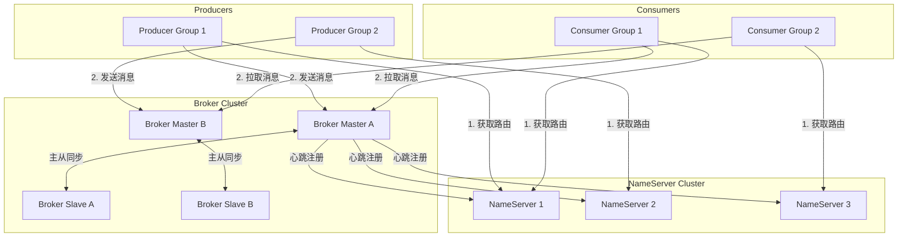
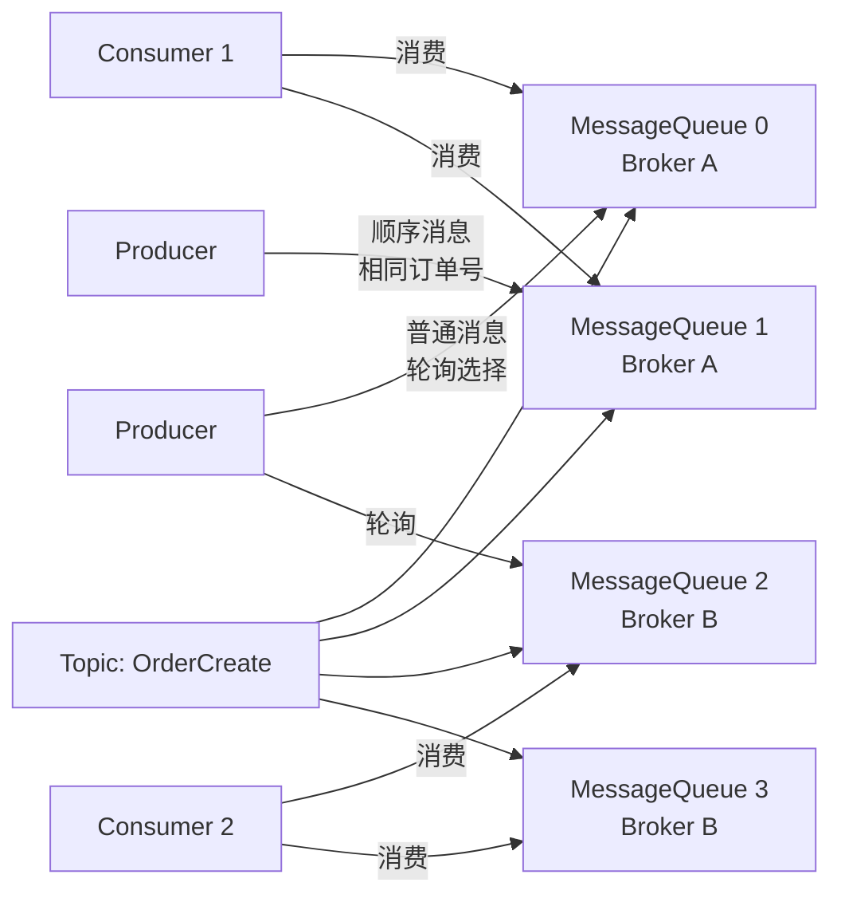
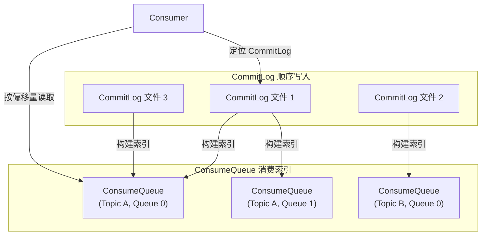
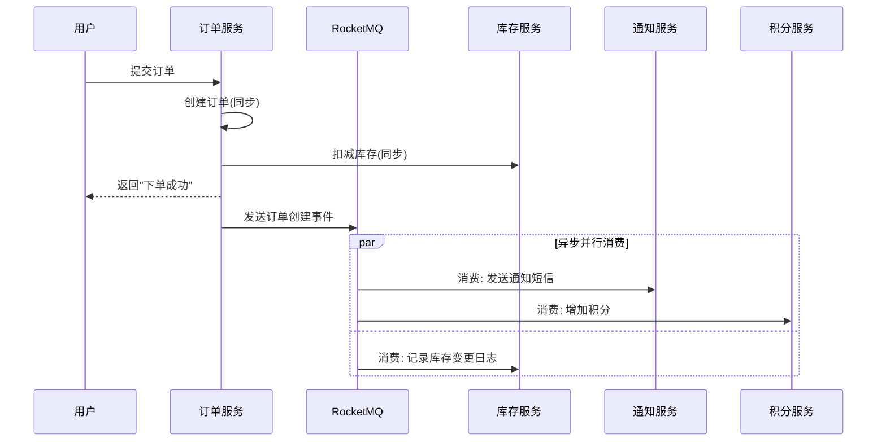
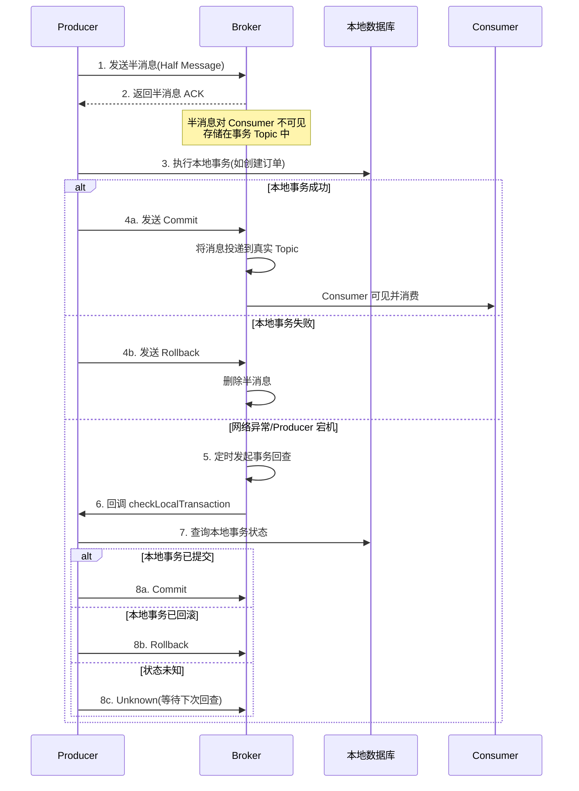
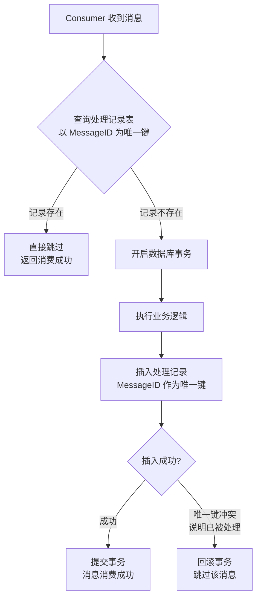
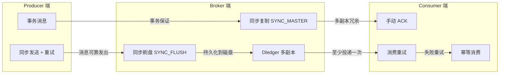
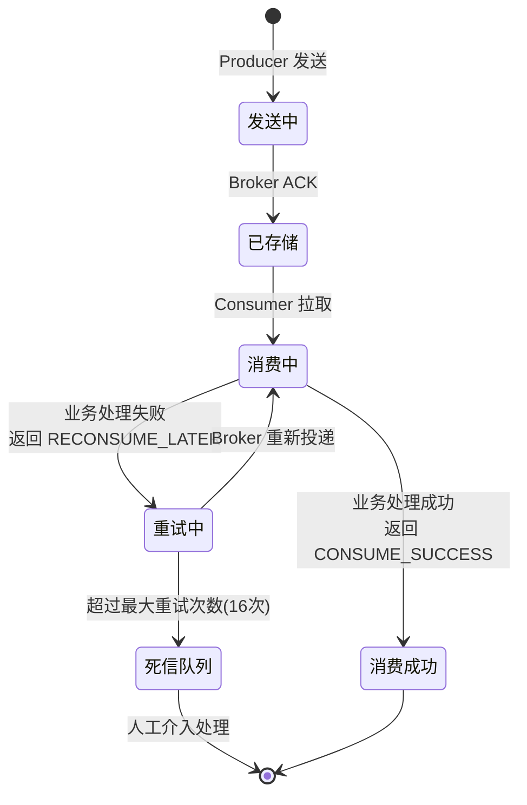

## RocketMQ 原理详解与消息队列最佳实践

### 什么是 RocketMQ

RocketMQ 是阿里巴巴开源的分布式消息中间件，现为 Apache 顶级项目。它以高吞吐、低延迟、高可靠著称，在阿里巴巴双 11 大促中承载了万亿级消息的流转。与 Kafka 偏向日志流处理不同，RocketMQ 更专注于业务消息场景，提供了事务消息、延迟消息、消息回溯、死信队列等丰富的业务特性。

### RocketMQ 核心架构

RocketMQ 采用发布/订阅（Pub/Sub）模型，由四个核心组件构成。



**NameServer** 是轻量级的路由注册中心，负责管理 Broker 的元数据和 Topic 的路由信息。NameServer 节点之间互不通信，每个节点都保存完整的路由信息。Broker 启动时向所有 NameServer 注册并定时发送心跳（默认 30 秒），NameServer 在 120 秒未收到心跳时将剔除该 Broker。这种设计的优势在于 NameServer 是无状态的，任意节点宕机不影响整体服务，客户端可以连接任意一个 NameServer 获取路由。

**Broker** 是消息存储和转发的核心节点，采用 Master-Slave 架构。BrokerId 为 0 表示 Master，非 0 表示 Slave。Master 负责消息的写入和读取，Slave 负责从 Master 同步数据并分担读取压力。Producer 只向 Master 写入消息，Consumer 可以从 Master 或 Slave 读取（当 Master 与 Slave 的偏移量差值超过阈值时，自动切换到 Slave 读取）。

**Producer** 是消息的发送方，完全无状态。它从 NameServer 获取 Topic 的路由信息（缓存在本地，定时更新），然后根据负载均衡策略选择一个 MessageQueue 将消息发送到对应的 Broker Master。发送方式支持同步发送（等待确认）、异步发送（回调通知）和单向发送（不等待确认，适合日志采集）。

**Consumer** 是消息的消费方，支持两种消费模式。集群模式（Clustering）下，同一个 ConsumerGroup 的多个实例共同分担消息，每条消息只被一个实例消费；广播模式（Broadcasting）下，每个实例都接收全部消息，适合配置同步、缓存刷新等场景。消费方式支持 Push（Broker 主动推送，实际上是长轮询的封装）和 Pull（客户端主动拉取）。

### Topic 与 MessageQueue 设计

Topic 是消息的一级分类（如"订单创建"、"支付成功"）。为了支持水平扩展，RocketMQ 对 Topic 进行了分区——每个 Topic 包含多个 MessageQueue（默认 4 个），分布在不同的 Broker 上。



Producer 发送消息时可以选择队列。普通消息通过轮询或随机策略分发，保证负载均衡；顺序消息通过业务键（如订单号）哈希到同一个队列，保证同一业务的消息按顺序消费。Consumer 在集群模式下，每个实例分配一部分队列消费；当实例数变化时，触发 Rebalance 重新分配队列。

### 消息存储机制

RocketMQ 的存储设计是其高吞吐的关键。所有 Topic 的消息都顺序写入同一个 CommitLog 文件（类似 Kafka 的日志分段），而非按 Topic 分开存储。这样将随机写转化为顺序写，磁盘 I/O 性能可以提升数个数量级。



Consumer 消费时通过 ConsumeQueue（消费队列）定位消息在 CommitLog 中的位置。ConsumeQueue 是逻辑队列，每个 MessageQueue 对应一个 ConsumeQueue，存储消息在 CommitLog 中的偏移量、大小和 Tag HashCode。这种"统一存储 + 消费索引"的设计既保证了写入性能，又支持多 Topic 多队列的灵活消费。

### 消息队列的应用场景

消息队列在分布式系统中有三大核心能力：异步处理、服务解耦和削峰填谷。以下是电商系统中的典型应用场景。



**异步处理**：用户下单后，发送通知、增加积分、记录日志等操作不需要用户等待。通过消息队列异步执行，将同步路径的 RT 从数百毫秒压缩到几十毫秒。

**服务解耦**：订单服务只需发布"订单创建"事件，无需知道下游有哪些服务需要处理。新增一个消费方（如风控服务）时，订单服务无需任何改动。生产者和消费者完全不知道对方的存在。

**削峰填谷**：大促期间瞬时订单流量可能达到每秒数万笔，而数据库只能承受每秒数千次写入。消息队列充当缓冲区，消费者按自身能力平稳消费，避免被流量洪峰击穿。

**数据分发**：商品数据变更后，通过消息队列同步到 Elasticsearch（搜索索引）、Redis（缓存）、数仓（数据分析），实现一份数据多端消费。

**分布式事务**：通过事务消息实现跨服务的最终一致性（详见下文）。

### 消息队列如何处理分布式事务

在微服务架构中，一个业务操作往往涉及多个服务的数据变更。传统的单机事务无法跨越服务边界，而 XA 两阶段提交性能太低。RocketMQ 的事务消息提供了一种基于最终一致性的分布式事务解决方案。



**半消息（Half Message）**：Producer 发送的初始消息，Broker 收到后持久化到专门的事务 Topic（`RMQ_SYS_TRANS_HALF_TOPIC`），此时消息对 Consumer 完全不可见。这一步相当于"预写日志"——消息已经安全存储，但还不能被投递。

**本地事务执行**：Producer 收到半消息 ACK 后，执行本地数据库操作（如创建订单记录）。

**二次确认**：根据本地事务的执行结果，Producer 向 Broker 发送 Commit（将消息从半消息 Topic 转移到真实 Topic，对 Consumer 可见）或 Rollback（删除半消息）。

**事务回查**：如果 Broker 未收到二次确认（网络中断或 Producer 宕机），Broker 会定时（默认 60 秒）向 Producer 集群发起回查。Producer 通过事务检查器（TransactionListener）查询本地数据库的实际状态（如检查订单记录是否存在），据此返回 Commit/Rollback/Unknown。

这种设计的本质是将"分布式事务"转化为"本地事务 + 可靠消息投递"的组合：半消息保证了消息的可靠存储（即使 Producer 宕机也能通过回查恢复），本地事务保证了业务数据的一致性，两者结合实现了跨服务的最终一致性。

### 消息队列如何保证幂等

消息队列通常提供 at-least-once 投递保证，这意味着同一条消息可能被消费多次。消费端的幂等性设计是保证业务正确性的关键。



**方案一：消息 ID + 处理记录表**。维护一张 `processed_messages` 表，以消息 ID（MessageID 或 Keys）作为唯一键。消费前先尝试插入记录，如果插入成功则执行业务逻辑并提交事务；如果唯一键冲突说明消息已被处理过，直接跳过。关键是处理记录的插入和业务数据的变更必须在同一个数据库事务中。

**方案二：业务唯一键 + 数据库约束**。利用业务本身的唯一标识（如订单号）作为去重依据。例如消费"扣减库存"消息时，以订单号作为库存流水表的唯一索引，重复消费时数据库层直接拦截。

**方案三：状态机 + 条件更新**。在执行业务操作前先检查当前状态，只有满足前置条件时才执行。例如只有状态为"待支付"的订单才能被标记为"已支付"，重复的支付消息到达时状态已变更，操作被自然忽略。

```java
// 方案一：消息 ID + 处理记录表
@Transactional
public void consumeMessage(Message message) {
    String messageId = message.getMsgId();

    // 插入处理记录（同一事务内）
    try {
        processedMessageRepository.insert(new ProcessedMessage(messageId));
    } catch (DuplicateKeyException e) {
        // 消息已被处理过，直接跳过
        return;
    }

    // 执行业务逻辑（同一事务内）
    businessService.process(message.getBody());
}
```

### 消息队列如何保证消息不丢失与高可用

消息的可靠性需要从 Producer、Broker、Consumer 三个环节共同保障。



#### Producer 端：确保消息可靠发出

同步发送（`send`）模式下，Producer 会等待 Broker 的 ACK 确认。如果未收到确认或发生异常，自动重试（默认重试 2 次，共发送 3 次）。重试时会切换到不同的 Broker 节点，避免单点故障。

对于关键业务消息，可以使用事务消息（保证本地事务和消息投递的原子性）或本地消息表（将消息和业务数据在同一个数据库事务中写入，由后台任务定时扫描重试）。

#### Broker 端：确保消息可靠存储

**刷盘策略** 控制消息何时从内存写入磁盘。同步刷盘（SYNC_FLUSH）在消息写入磁盘后才返回 ACK，保证单节点数据不丢失；异步刷盘（ASYNC_FLUSH）先返回 ACK 再异步写盘，性能更高但极端情况下可能丢失少量消息。

**复制策略** 控制消息如何从 Master 同步到 Slave。同步复制（SYNC_MASTER）在消息同步到 Slave 后才返回 ACK，保证 Master 宕机时 Slave 有完整数据；异步复制（ASYNC_MASTER）先返回 ACK 再异步同步，性能更高但可能丢失未同步的消息。

生产环境推荐"同步复制 + 异步刷盘"的组合——同步复制保证多副本一致性，异步刷盘保证写入性能。对于金融级场景（如支付），可以升级为"同步复制 + 同步刷盘"。

**Dledger 模式**（RocketMQ 4.5.0+）基于 Raft 协议实现自动主从切换。当 Master 宕机时，集群自动选举新的 Master，无需人工干预。Dledger 模式下消息必须写入多数派副本（如 3 节点集群中写入 2 个）才算成功，保证强一致性。

#### Consumer 端：确保消息可靠消费

RocketMQ 的消费采用"先消费后 ACK"的模式：Consumer 拉取消息 → 执行业务逻辑 → 返回消费成功（CONSUME_SUCCESS）或重试（RECONSUME_LATER）。如果返回重试，Broker 会将消息重新投递（默认最多重试 16 次，间隔递增）。超过重试次数的消息进入死信队列（DLQ），需要人工介入处理。

关键要求：关闭自动 ACK，改为手动确认。业务逻辑执行成功后才返回 CONSUME_SUCCESS，任何异常都返回 RECONSUME_LATER 让 Broker 重新投递。



### 面试高频问题与回答思路

#### Q1：RocketMQ 的架构是怎样的？各组件的职责是什么？

**回答思路**：四大核心组件——NameServer（路由注册中心，轻量无状态，节点间不通信）、Broker（消息存储与转发，Master-Slave 架构）、Producer（消息发送方，无状态，从 NameServer 获取路由）、Consumer（消息消费方，集群模式/广播模式）。然后描述一条消息的完整生命周期：Producer 查 NameServer 获取路由 → 选择 MessageQueue → 发送到 Broker Master → Broker 持久化到 CommitLog → 构建 ConsumeQueue 索引 → Consumer 从 ConsumeQueue 获取偏移量 → 从 CommitLog 读取消息。

#### Q2：RocketMQ 为什么用 CommitLog 统一存储而不是按 Topic 分开存储？

**回答思路**：这是 RocketMQ 高吞吐的关键设计。如果按 Topic 分开存储，每个 Topic 的写入都是随机 I/O（因为一个 Broker 上可能有数百个 Topic），磁盘性能会急剧下降。统一写入 CommitLog 将随机写转化为顺序写，磁盘顺序写的速度接近内存随机写（约 600MB/s vs 100KB/s）。代价是消费时需要通过 ConsumeQueue 索引定位消息，但这只是顺序读取，开销很小。面试官可能追问"CommitLog 文件有多大"——默认 1GB，写满后自动创建新文件，文件名是起始偏移量。

#### Q3：RocketMQ 的事务消息是如何实现分布式事务的？

**回答思路**：按半消息 → 本地事务 → 二次确认 → 事务回查四步回答。半消息存储在事务 Topic 中对 Consumer 不可见，相当于"预写日志"；本地事务执行后根据结果 Commit 或 Rollback；如果网络异常未收到确认，Broker 定时回查 Producer，Producer 通过事务检查器查询本地数据库状态。本质是将"分布式事务"转化为"本地事务 + 可靠消息投递"的组合。面试官可能追问"半消息存储在哪里"——存在 `RMQ_SYS_TRANS_HALF_TOPIC`，Commit 时才转移到真实 Topic；"回查次数有限制吗"——默认最多回查 15 次，超过后自动 Rollback。

#### Q4：RocketMQ 如何保证消息不丢失？

**回答思路**：从三个环节回答。Producer 端：同步发送 + 重试（默认 3 次），关键业务使用事务消息或本地消息表。Broker 端：同步复制（SYNC_MASTER）保证多副本一致性 + 同步刷盘（SYNC_FLUSH）保证磁盘持久化 + Dledger 多副本自动主从切换。Consumer 端：手动 ACK（业务成功后才返回 CONSUME_SUCCESS）+ 消费重试（失败返回 RECONSUME_LATER，最多 16 次）+ 幂等消费（防止重复处理）。面试官可能追问"同步复制 + 同步刷盘的性能损失有多大"——同步复制增加约 1-2ms RTT，同步刷盘增加约 5-10ms 磁盘写入延迟，金融级场景可接受，普通业务推荐"同步复制 + 异步刷盘"。

#### Q5：RocketMQ 如何保证顺序消费？

**回答思路**：顺序消费分为全局顺序和分区顺序。全局顺序要求 Topic 只有一个 MessageQueue，所有消息串行处理，性能极低，几乎不用。分区顺序（更常用）要求同一业务键（如订单号）的消息发送到同一个 MessageQueue（通过 hash 取模），消费时同一个 MessageQueue 只被一个 Consumer 实例消费（集群模式下通过分布式锁保证）。

面试官可能追问"Consumer 实例数变化时怎么办"——触发 Rebalance 重新分配队列，重新分配期间通过分布式锁（如 Redis）保证同一队列不会被两个实例同时消费。

#### Q6：RocketMQ 和 Kafka 有什么区别？如何选择？

**回答思路**：定位不同。Kafka 偏向高吞吐的日志流处理（日志采集、埋点、大数据管道），依赖分区、副本、零拷贝和顺序写盘，吞吐量极高但业务特性较少。RocketMQ 偏向业务消息（交易、订单、支付），提供事务消息、延迟消息、消息回溯、死信队列、消息过滤等丰富的业务特性。

选择建议：日志/大数据场景选 Kafka；交易/金融/需要事务消息的场景选 RocketMQ；中小型系统、需要灵活路由的场景选 RabbitMQ。面试官可能追问"RocketMQ 的吞吐量是多少"——单机约 10 万 TPS（异步发送），Kafka 单机可达百万级，但 RocketMQ 的业务特性是 Kafka 不具备的。

#### Q7：消息积压了怎么办？

**回答思路**：先定位原因（Consumer 处理慢？Consumer 实例数不够？依赖的下游服务故障？），再采取对策。

临时扩容：增加 Consumer 实例数（不能超过 MessageQueue 数量，否则有实例分配不到队列）；如果队列数不够，临时创建新 Topic 并分配更多队列，将原 Topic 的消息转发过去。

优化消费逻辑：将耗时操作异步化（如发通知、写日志从消费逻辑中剥离）、批量处理代替逐条处理、优化数据库查询。

降级处理：如果积压严重且非关键消息，可以临时跳过（记录到日志后续补偿）；如果是关键消息，优先保证核心逻辑执行，非核心操作异步化。

预防措施：监控 Consumer 的积压量（Lag）和消费 RT，设置告警阈值；Consumer 做好限流和降级，防止被下游故障拖垮。

#### Q8：RocketMQ 的 Rebalance 机制是什么？

**回答思路**：Rebalance 是 Consumer 集群中队列重新分配的过程。当 Consumer 实例数变化（新增或下线）、MessageQueue 数量变化、或定时触发（默认 20 秒一次）时，ConsumerGroup 中的所有实例会对队列进行重新分配。

分配策略有四种：平均分配（默认，按顺序均分）、一致性哈希（按 Consumer 实例 ID 哈希，减少变更时的迁移量）、按机房分配、按配置分配。

面试官可能追问"Rebalance 期间会不会丢消息"——不会，因为 Rebalance 只是重新分配队列的归属，Consumer 会保存每个队列的消费进度（Offset），重新分配后从上次进度继续消费。但 Rebalance 期间可能会有短暂的消息重复消费（两个实例短暂消费同一个队列），因此消费端必须保证幂等。

#### Q9：RocketMQ 的延迟消息和定时消息是怎么实现的？

**回答思路**：RocketMQ 支持 18 个固定延迟级别（1s/5s/10s/30s/1m/.../2h），不支持任意时间延迟。实现原理是：Producer 发送延迟消息时，Broker 将消息存入 `SCHEDULE_TOPIC_XXXX` 而非目标 Topic，内部有定时线程扫描到期的消息，到期后转移到目标 Topic 供 Consumer 消费。

面试官可能追问"如何实现任意时间延迟"——可以使用时间轮算法或外部定时任务（如 XXL-JOB）在指定时间发送普通消息。阿里云版 RocketMQ 5.0 已支持任意时间延迟消息。

#### Q10：如何保证消息的可靠性投递（端到端不丢失）？

**回答思路**：端到端可靠性需要 Producer、Broker、Consumer 三层配合。

Producer 端：同步发送 + 失败重试 + 关键消息使用事务消息或本地消息表。本地消息表的实现方式是：在同一个数据库事务中写入业务数据和本地消息记录，由后台任务定时扫描未发送的消息并重试，确保"本地事务成功 → 消息一定发出"。

Broker 端：同步复制 + 同步刷盘（金融级）或同步复制 + 异步刷盘（普通业务）+ Dledger 多副本自动主从切换。

Consumer 端：手动 ACK + 消费重试 + 幂等消费 + 死信队列兜底（超过重试次数的消息进入 DLQ，人工介入）。

面试官可能追问"本地消息表的事务消息有什么区别"——本地消息表需要业务库支持事务且侵入业务代码，适合中小系统；事务消息由 Broker 保证半消息的可靠性，对业务代码侵入较小，适合微服务架构。

### 总结

RocketMQ 作为阿里巴巴开源的分布式消息中间件，通过 CommitLog 统一存储实现了高吞吐写入，通过 Master-Slave 架构和 Dledger 多副本实现了高可用，通过事务消息实现了分布式事务的最终一致性。

在工程实践中，消息队列的价值不仅在于异步和解耦，更在于它提供了一种"可靠的异步通信契约"——Producer 保证消息发出，Broker 保证消息存储和投递，Consumer 保证幂等消费。理解这三层的职责边界和配合方式，才能设计出既高性能又可靠的分布式消息系统。

---

**参考资料**

- [RocketMQ 官方文档: 初识 RocketMQ](https://rocketmq.apache.org/zh/docs/4.x/introduction/02whatis/)
- [RocketMQ 官方文档: 事务消息](https://rocketmq.apache.org/zh/docs/featureBehavior/04transactionmessage/)
- [腾讯云: RocketMQ 高可用架构详细说明](https://cloud.tencent.com/developer/article/2602949)
- [得物技术: RocketMQ 高性能揭秘——承载万亿级流量的架构奥秘](https://tech.dewu.com/article?id=198)
- [阿里云: RocketMQ 分布式事务最终一致性消息](https://help.aliyun.com/zh/apsaramq-for-rocketmq/cloud-message-queue-rocketmq-4-x-series/developer-reference/transactional-messages)
- [极客时间: 如何利用事务消息实现分布式事务](https://time.geekbang.org/column/article/111269)
- [博客园: 基于 RocketMQ 实现分布式事务（半消息事务）](https://www.cnblogs.com/dennyzhangdd/p/14572024.html)
- [阿里云: RocketMQ 主从切换过程中如何保证数据不丢失](https://developer.aliyun.com/ask/551296)
