# 商品模型完整分析

## 一、概述

高德商品平台是支撑高德本地生活业务的核心基础设施，承载了美食、生活服务、酒店、门票、房产、租车等多行业的商品供给与管理。经过多年演进，商品模型从最初的单一"1品1店"结构发展为支持"1品多店"的主子商品模型体系，同时围绕商品构建了完整的类目、属性、标签、价格、库存、缓存、监控等能力。

本文基于15篇内部文档（7篇钉钉文档 + 8篇ATA文章）的深度分析，系统性地梳理高德商品模型的全貌，涵盖领域划分、数据结构、状态流转、平台架构、智能应用等维度，并以Mermaid UML图进行可视化呈现。

---

## 二、商品领域划分

高德商品域按职责分为以下核心子域：

- **商品基础域**：SPU/SKU定义、主子关系管理、影子物料
- **类目属性域**：后台类目树、CPV体系（Category-Property-Value）、前台导购类目
- **价格域**：单一价格、多维度价格、价格规则（周期/确定日期）
- **库存域**：现货库存、锁定库存、售卖库存、可用库存、库位划拨
- **标签域**：类目标签打标、开放标签、商品标签
- **供给域**：CP接入、商品挂接、GBF平台化框架
- **缓存域**：多层缓存架构（Tair → LocalCache/Redis）
- **监控域**：实时指标监控预警（TDDL+TT+Blink+Hologres+Sunfire）

---

## 三、商品模型核心结构

### 3.1 三种共存的商品模型

高德商品平台当前存在三种模型并存的格局：

| 模型类型 | 结构描述 | 适用场景 | ID特征 |
|---------|---------|---------|--------|
| 普通模型 | 1品1店：Item = SPU + 多个SKU | 口碑预定等简单场景 | spuId无下划线 |
| 主子模型（总部门店模型） | 1品多店 + 门店特化：ROOT_SPU → SHOP_SKU | 美食/生服/KA（门店可定制SKU） | 子spuId含下划线，下划线后=spuPid |
| 主主模型 | 1品多店 + 无门店特化：ROOT_SPU → ROOT_SKU（子随主变） | 黑卡等无需门店差异化的场景 | 主skuId=sku_pid |

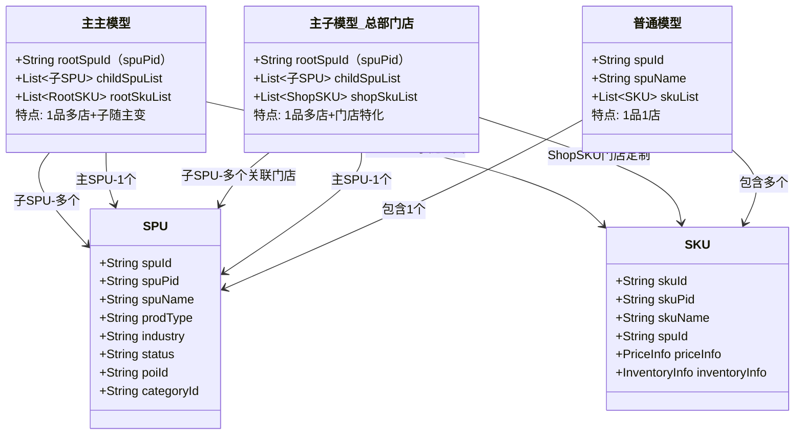

### 3.2 ID编码规范

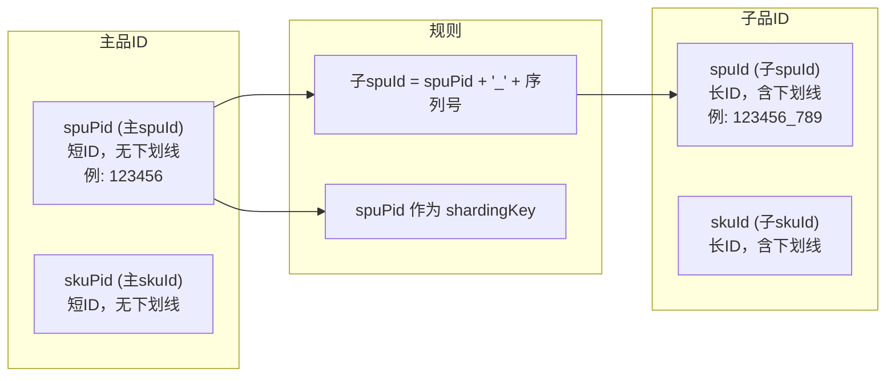

### 3.3 分库分表策略

SPU/SKU/Price/Inventory等核心表均以 `spuPid` 作为 shardingKey 进行分库分表，确保同一主品下的所有子品数据在同一分片中，便于聚合查询。

---

## 四、SPU/SKU 完整字段结构

### 4.1 SPU核心字段（44字段）

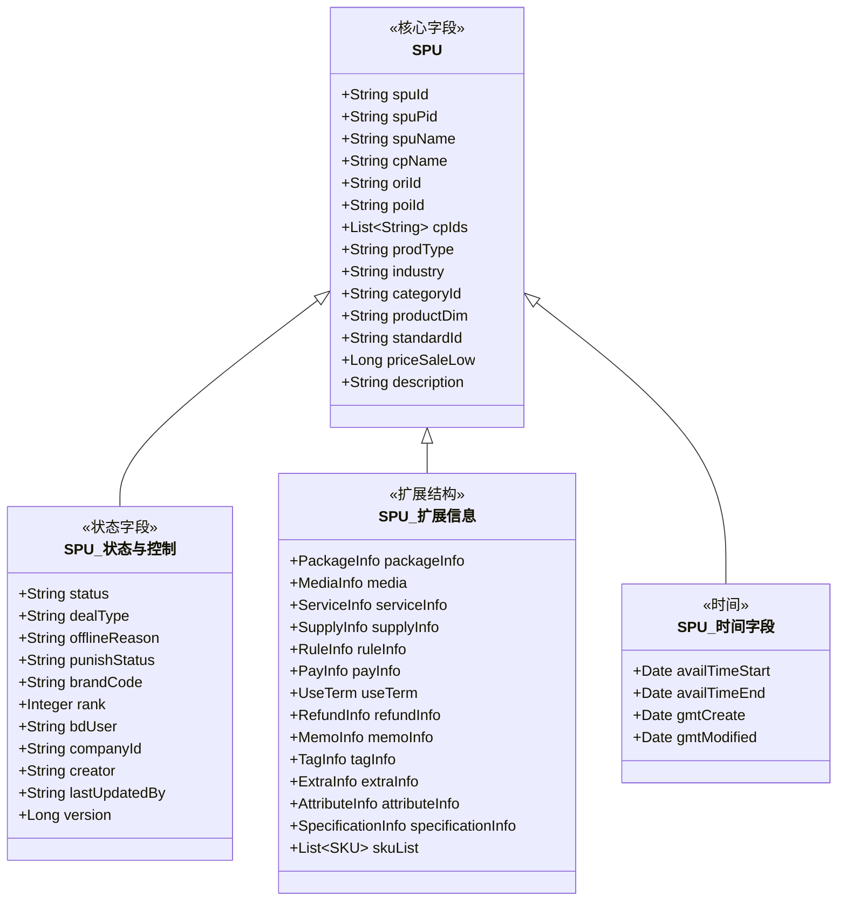

### 4.2 prodType 商品类型枚举

| 枚举值 | 含义 |
|--------|------|
| groupBuy | 团购 |
| voucher | 代金券 |
| voucherPackage | 代金券包 |
| booking | 预定 |
| normal | 普通商品 |
| shoppingmallCard | 商场卡 |
| exchangeVoucher | 兑换券 |
| ticket | 门票 |
| secondHouse | 二手房 |
| newHouse | 新房 |
| rentHouse | 租房 |
| rentOffice | 租写字楼 |
| saleOffice | 售写字楼 |
| auction | 拍卖 |
| virtualHouse | 虚拟房 |
| virtualGood | 虚拟商品 |

### 4.3 industry 行业枚举

| 枚举值 | 含义 |
|--------|------|
| dining | 美食 |
| life | 生活服务 |
| auto | 汽车 |
| hospital | 医疗 |
| SECRET_ROOM | 密室 |
| KTV | KTV |
| MASSAGE | 按摩 |
| LIVE_LARP | 实景剧本杀 |
| TABLE_LARP | 桌游剧本杀 |
| BLACK_CARD | 黑卡 |
| KA | KA |
| hotel | 酒店 |
| familyTrip | 亲子游 |
| flight | 机票 |
| INSURANCE | 保险 |
| VIRTUAL_RECHARGE | 虚拟充值 |
| scenic | 景区门票 |
| other | 其他 |

---

## 五、商品状态生命周期

### 5.1 商品状态机

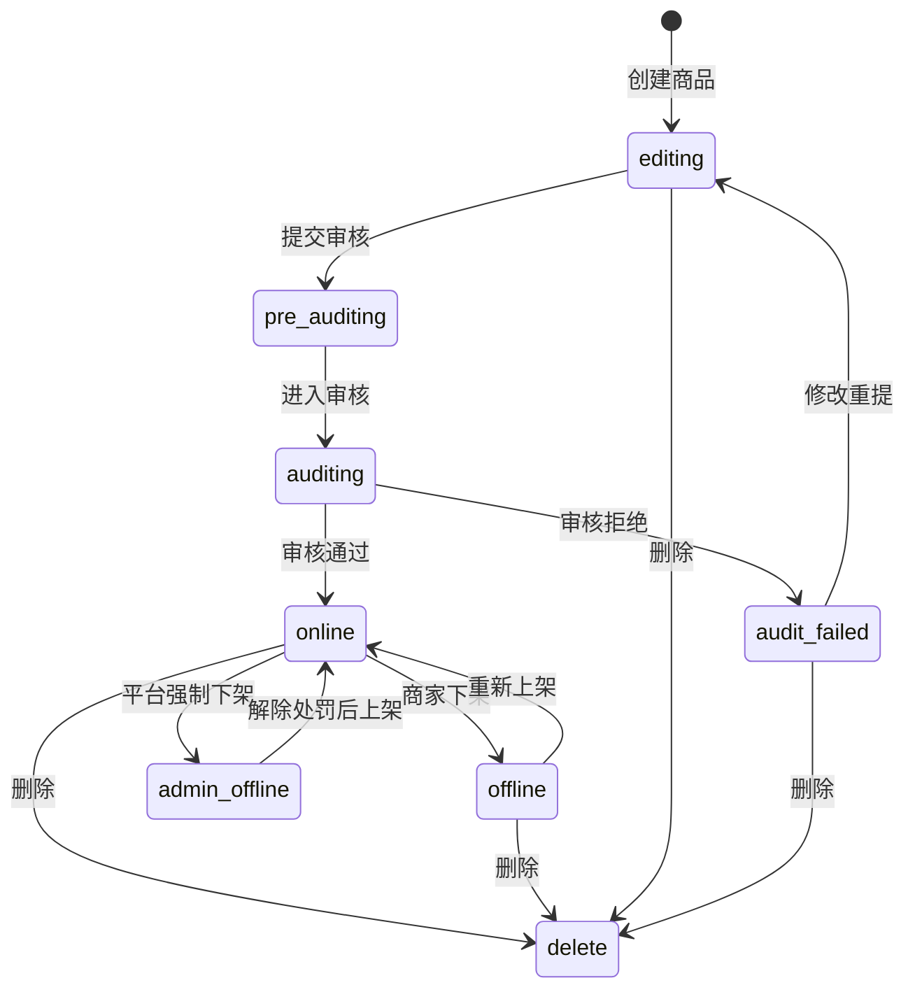

### 5.2 影子物料（Shadow Material）机制

影子物料是B端/C端数据隔离的核心机制：B端编辑不直接影响C端展示，修改在审核通过后才同步到C端。

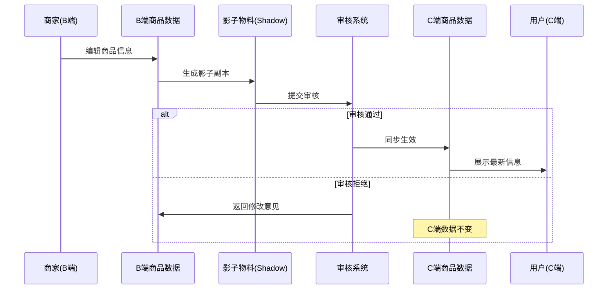

---

## 六、ER关系模型

### 6.1 核心实体关系

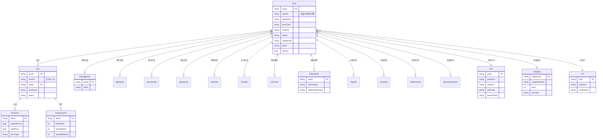

### 6.2 主子商品关系

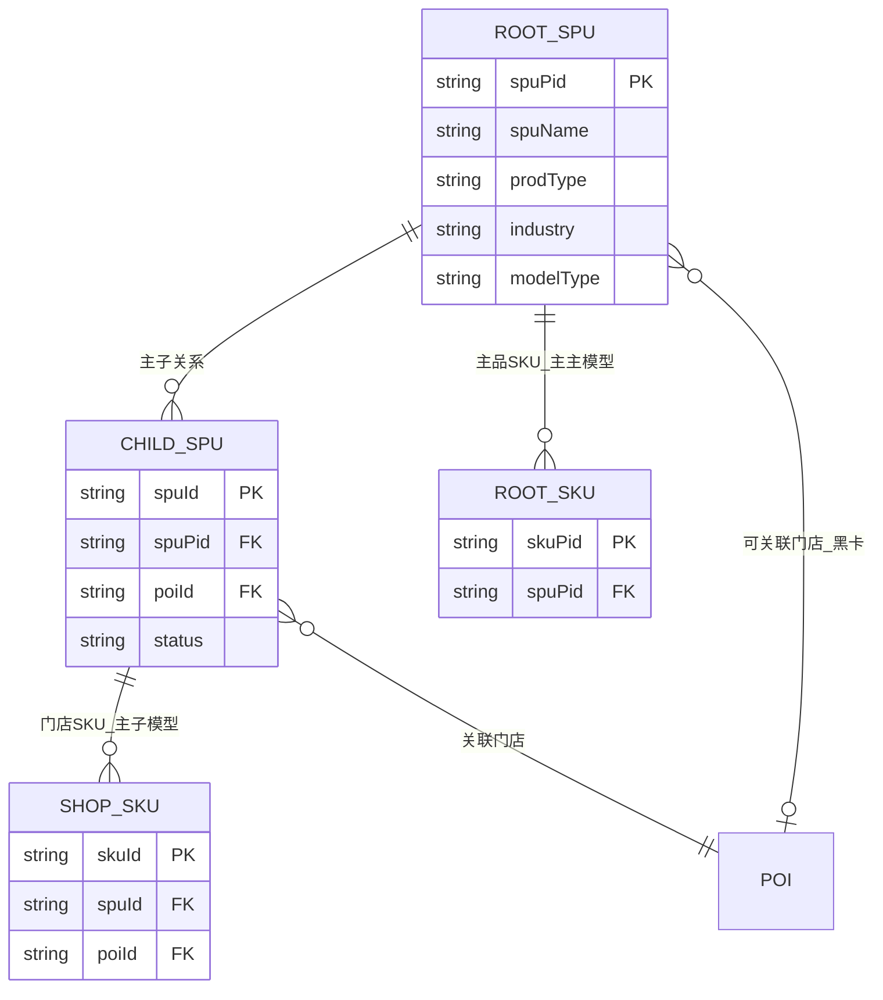

---

## 七、各行业商品模型差异

### 7.1 行业模型适配

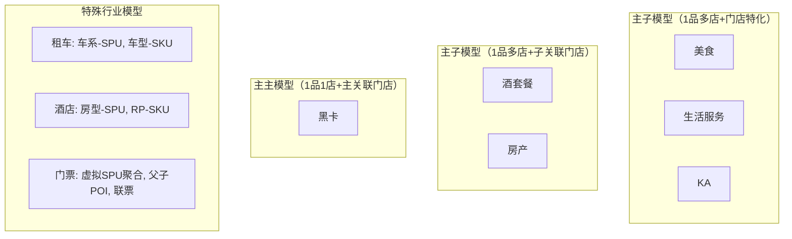

### 7.2 酒店商品模型映射

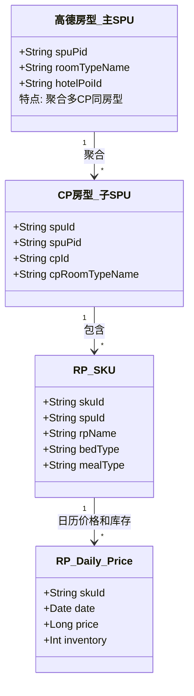

### 7.3 门票商品模型

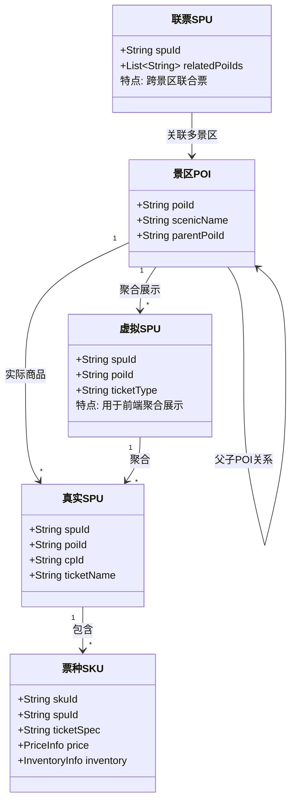

---

## 八、价格模型

### 8.1 价格体系结构

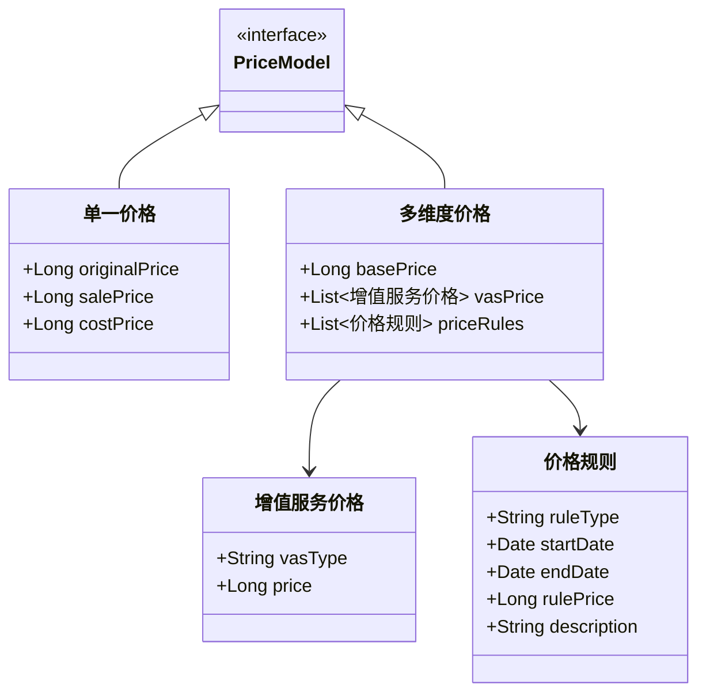

### 8.2 价格规则类型

- **周期规则（PERIOD）**：按日期范围生效的价格，如节假日价格、旺季价格
- **确定日期规则（FIXED_DATE）**：特定日期的价格，如特价日

---

## 九、库存模型

### 9.1 库存概念体系

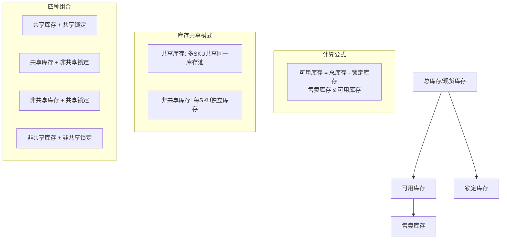

### 9.2 库位划拨

库位划拨用于将库存从一个逻辑位置调配到另一个逻辑位置，支持跨门店、跨渠道的库存流转管理。

---

## 十、类目与属性体系（CPV）

### 10.1 CPV体系结构

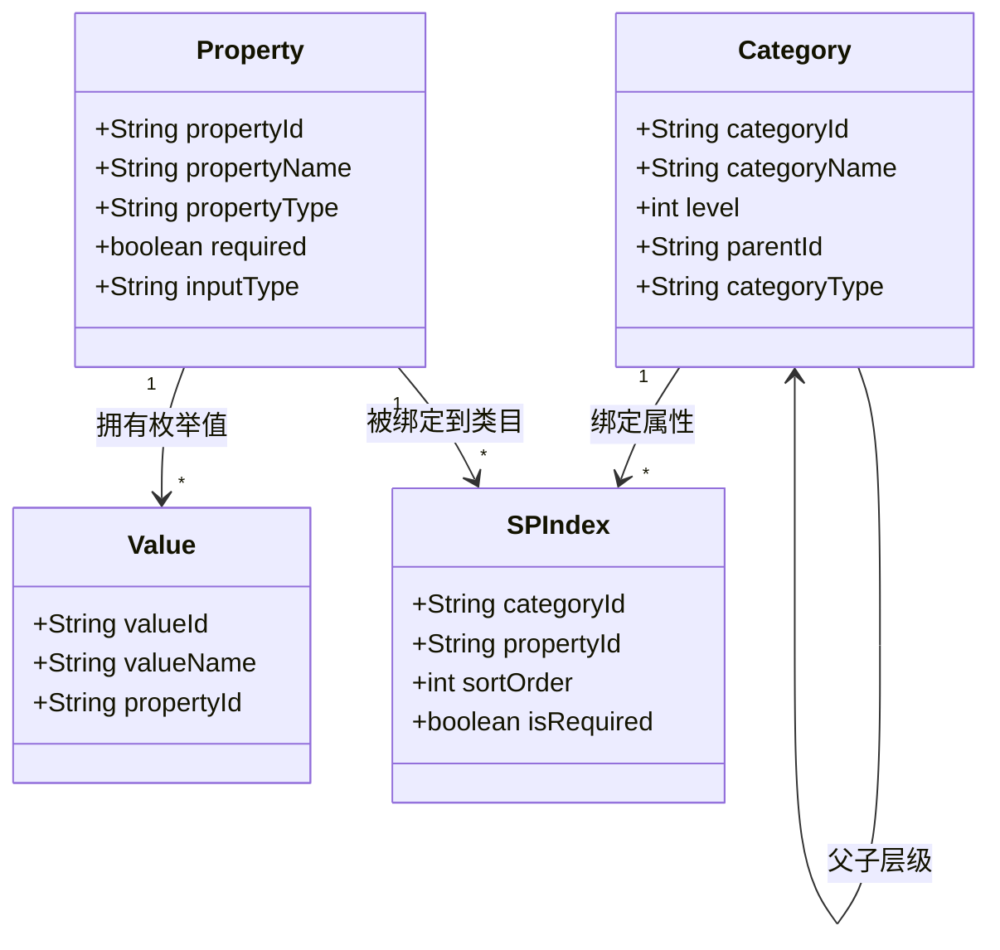

### 10.2 类目层级（1812个标签）

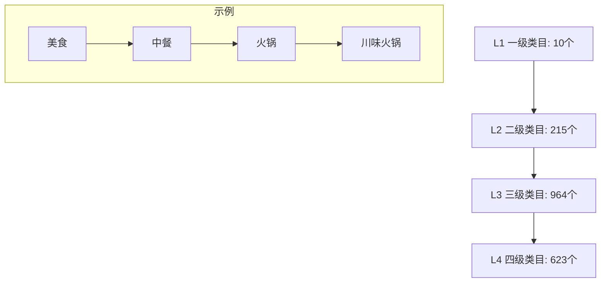

### 10.3 后台类目 vs 前台类目

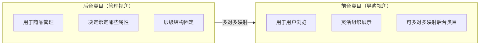

### 10.4 类目打标模型

基于Albert模型的类目自动打标，准确率93.75%：

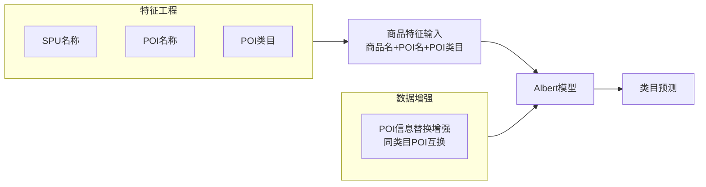

---

## 十一、开放标签体系

### 11.1 九维度标签

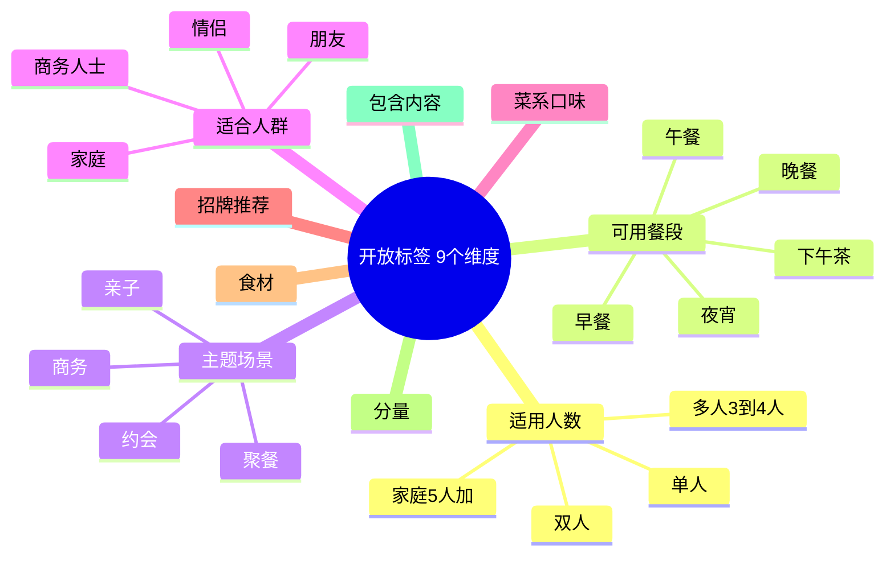

### 11.2 标签来源（4种）

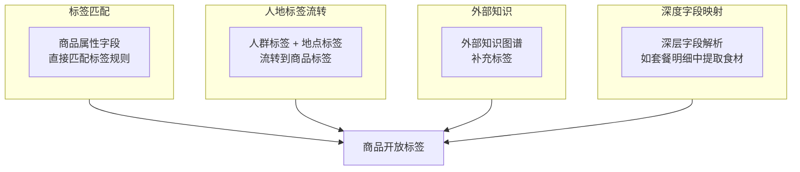

---

## 十二、商品挂接流程

商品挂接是将CP供给的原始商品数据结构化并落地到高德商品库的过程。

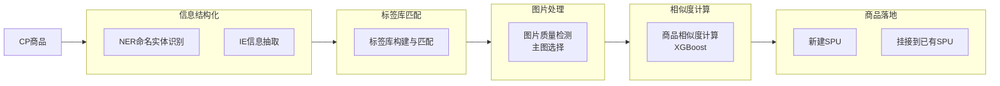

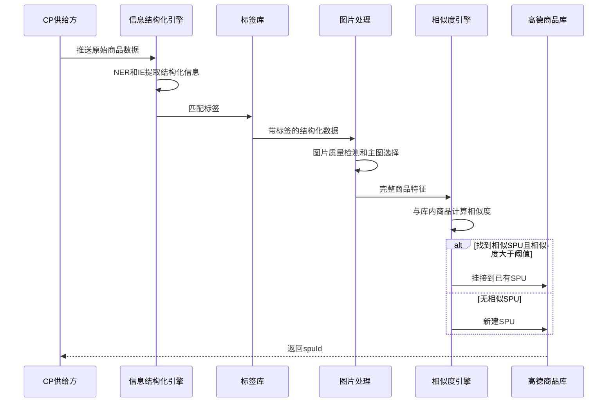

挂接准确率：酒店98%，门票99%。

---

## 十三、GBF平台化架构

### 13.1 GBF框架概览

GBF（Gaode Business Framework）基于TMF思想，解耦平台标准逻辑与行业特有扩展。

```mermaid
flowchart TB
    subgraph 业务身份层["业务身份（Business Identity）"]
        bi[行业 + CP = 业务身份]
        dining_cp1[dining + 美团]
        dining_cp2[dining + 饿了么]
        hotel_cp1[hotel + 携程]
        scenic_cp1[scenic + 飞猪]
    end
    
    subgraph 平台标准能力层["平台标准能力"]
        process[流程 Process]
        node[节点 Node]
        domain_service[领域服务 DomainService]
        ability[能力 Ability]
    end
    
    subgraph 扩展层["扩展实现"]
        default_action[DefaultAction 默认实现]
        extend_action[ExtendAction 行业扩展]
    end
    
    业务身份层 --> 平台标准能力层
    平台标准能力层 --> 扩展层
```

### 13.2 GBF能力调用链

```mermaid
sequenceDiagram
    participant 请求 as 业务请求
    participant 身份识别 as 业务身份识别
    participant 流程引擎 as Process流程引擎
    participant 节点 as Node节点
    participant 领域服务 as DomainService
    participant 能力 as Ability
    participant 实现 as Action实现

    请求->>身份识别: 识别 industry + cpId
    身份识别->>流程引擎: 路由到对应流程
    流程引擎->>节点: 执行节点链
    节点->>领域服务: 调用领域服务
    领域服务->>能力: 触发能力点
    能力->>实现: 查找扩展实现
    alt 存在ExtendAction
        实现->>实现: 执行行业扩展
    else 无扩展
        实现->>实现: 执行DefaultAction
    end
    实现-->>请求: 返回结果
```

当前GBF已接入60+CP供给方。

---

## 十四、缓存架构

### 14.1 多层缓存模型

```mermaid
flowchart TB
    subgraph 数据源层["数据源"]
        db[(TDDL分库分表)]
    end
    
    subgraph 一级缓存["L1: Tair分布式缓存"]
        tair_spu["Tair SPU缓存<br/>key: blue_whale_product_spu_info_spuId<br/>主子分开存储"]
        tair_sku["Tair SKU缓存"]
        tair_price["Tair Price缓存"]
    end
    
    subgraph 二级缓存["L2: LocalCache和Redis 合并缓存"]
        local["LocalCache JVM内存<br/>合并后的商品完整数据"]
        redis["Redis<br/>热点数据二级缓存"]
    end
    
    subgraph 消费端["消费端"]
        c_end[C端展示服务]
        search[搜索引擎]
    end
    
    db --> 一级缓存
    一级缓存 --> 二级缓存
    二级缓存 --> 消费端
```

### 14.2 缓存读写流程

```mermaid
sequenceDiagram
    participant Client as 调用方
    participant L2 as L2 LocalCache和Redis
    participant L1 as L1 Tair
    participant DB as TDDL数据库
    participant MQ as 消息队列

    Note over Client, DB: 读流程
    Client->>L2: 查询合并缓存
    alt L2命中
        L2-->>Client: 返回合并数据
    else L2未命中
        L2->>L1: 查询Tair主子分别查
        alt L1命中
            L1-->>L2: 返回原始数据
            L2->>L2: 合并主子数据
            L2-->>Client: 返回合并数据
        else L1未命中
            L1->>DB: 回源查询
            DB-->>L1: 写入L1缓存
            L1-->>L2: 返回数据
            L2->>L2: 合并并写入L2
            L2-->>Client: 返回合并数据
        end
    end

    Note over Client, DB: 写流程即数据变更
    Client->>DB: 更新数据
    DB->>MQ: 发送变更消息
    MQ->>L1: 更新或失效Tair
    MQ->>L2: 更新或失效LocalCache
```

### 14.3 主子缓存合并策略

- **Tair层（L1）**：主SPU和子SPU分开存储，各自独立缓存
- **LocalCache/Redis层（L2）**：将主品信息与子品信息合并为完整的商品展示数据
- **合并规则**：子品继承主品的公共属性（如类目、品牌），叠加自身的特有属性（如门店价格、库存）

---

## 十五、实时监控预警体系

### 15.1 数据流架构

```mermaid
flowchart LR
    subgraph 数据源
        tddl[(TDDL)]
    end
    
    subgraph 实时链路
        tt[TT Binlog]
        blink[Blink流计算]
    end
    
    subgraph 离线链路
        odps[(ODPS离线)]
    end
    
    subgraph 存储层
        holo[(Hologres实时OLAP)]
        holo_ext[Hologres外表<br/>同期对比数据]
    end
    
    subgraph 展示与预警
        datav[DataV大屏]
        fbi[FBI报表]
        sunfire[Sunfire监控预警]
    end
    
    subgraph 预警辅助
        schedulex[ScheduleX定时]
        dw_api[DataWorks数据服务API]
        sls[SLS日志]
    end
    
    tddl -->|增量Binlog| tt
    tt --> blink
    blink -->|延时小于1s| holo
    tddl -->|全量同步| odps
    odps --> holo
    odps --> holo_ext
    
    holo --> datav
    holo --> fbi
    holo --> dw_api
    dw_api --> schedulex
    schedulex --> sls
    sls --> sunfire
```

### 15.2 监控维度

- **供给数量监控**：实时在线商品数量及增长趋势
- **同比/环比**：与昨日/上周同期对比，发现异常波动
- **分钟级预警**：通过Sunfire实现分钟级/秒级指标预警

---

## 十六、大模型应用实践

### 16.1 三大应用场景

```mermaid
flowchart TB
    subgraph 场景1["限购规则结构化"]
        rule_input[非结构化限购描述] --> llm1[大模型理解] --> rule_output[结构化限购规则JSON]
    end
    
    subgraph 场景2["同品识别与比价"]
        products[多CP同品商品] --> llm2[大模型语义匹配] --> match_result[同品识别结果加比价]
    end
    
    subgraph 场景3["门票商品结构化"]
        ticket_raw[原始门票信息] --> llm3[大模型信息提取] --> ticket_struct[结构化门票数据]
    end
```

### 16.2 工程+模型结合方法论

```mermaid
flowchart LR
    subgraph 工程侧
        data_clean[数据清洗]
        feature[特征工程]
        rule[规则预处理]
        post[后处理校验]
    end
    
    subgraph 模型侧
        prompt[Prompt工程]
        few_shot[Few-shot示例]
        cot[Chain-of-Thought]
        eval[效果评估]
    end
    
    工程侧 -->|输入准备| 模型侧
    模型侧 -->|输出校验| 工程侧
```

---

## 十七、平台演进历程

```mermaid
flowchart TB
    subgraph V1["V1: 单一模型期"]
        v1_desc[1品1店<br/>Item等于SPU加SKU<br/>支持美食团购]
    end
    
    subgraph V2["V2: 多行业扩展期"]
        v2_desc[引入prodType和industry<br/>支持酒店和门票和生服<br/>各行业独立模型]
    end
    
    subgraph V3["V3: 主子模型期"]
        v3_desc[1品多店<br/>主子商品关系<br/>影子物料B和C隔离]
    end
    
    subgraph V4["V4: 平台化期(当前)"]
        v4_desc[GBF框架<br/>60加CP接入<br/>三种模型共存<br/>CPV标准化]
    end
    
    V1 --> V2 --> V3 --> V4
```

---

## 十八、RefundInfo 退款模型

```mermaid
classDiagram
    class RefundInfo {
        +String refundType
        +String relativeDateType
        +List~RefundRule~ rules
    }
    class RefundRule {
        +int daysBeforeUse
        +int refundPercent
        +String description
    }
    
    RefundInfo --> RefundRule
    
    class RefundType {
        <<enumeration>>
        NO_REFUND
        CAN_REFUND
        FREE_REFUND
    }
    class RelativeDateType {
        <<enumeration>>
        ORDER
        CHECK_IN
        ABSOLUTE
        TIMEOUT
    }
    
    RefundInfo --> RefundType
    RefundInfo --> RelativeDateType
```

---

## 十九、商品供给全链路总视图

```mermaid
flowchart TB
    subgraph CP供给["CP供给方60加"]
        cp1[美团]
        cp2[饿了么]
        cp3[携程]
        cp4[飞猪]
        cp5[其他]
    end
    
    subgraph GBF["GBF平台化框架"]
        identity[业务身份识别<br/>industry加cpId]
        process[标准流程编排]
        extend[行业扩展点]
    end
    
    subgraph 商品处理["商品处理"]
        mount[商品挂接<br/>结构化加相似度加落地]
        shadow[影子物料<br/>B和C隔离]
        audit[审核系统]
    end
    
    subgraph 商品存储["商品存储"]
        tddl[(TDDL分库分表<br/>shardingKey等于spuPid)]
        cache[多层缓存体系]
    end
    
    subgraph 商品服务["商品服务"]
        cpv[CPV类目属性]
        tag[标签体系]
        price[价格管理]
        inventory[库存管理]
    end
    
    subgraph 消费端["消费端"]
        c_display[C端展示]
        search_engine[搜索推荐]
        monitor[监控预警]
    end
    
    CP供给 --> GBF
    GBF --> 商品处理
    商品处理 --> 商品存储
    商品存储 --> 商品服务
    商品服务 --> 消费端
    商品存储 --> cache
    cache --> 消费端
```

---

## 二十、关键设计决策总结

| 设计决策 | 方案 | 原因 |
|---------|------|------|
| 分片策略 | spuPid作shardingKey | 保证主子品同分片，便于聚合查询 |
| B/C隔离 | 影子物料机制 | B端编辑不影响C端，审核通过后才生效 |
| 多行业支持 | GBF框架+业务身份 | 平台标准化+行业可扩展，避免if-else |
| 缓存策略 | 两级分离存储+合并 | L1原始分片存储减少写放大，L2合并减少读时聚合 |
| 模型共存 | 三种模型并存 | 不同行业特性决定不同模型最优 |
| 商品归一 | 挂接+SPU聚合 | 多CP供给同品自动聚合，提升C端体验 |
| 实时监控 | Binlog到Blink到Hologres到Sunfire | 秒级感知供给变化，分钟级预警 |

---

## 附录：关键术语表

| 术语 | 全称/含义 |
|------|----------|
| SPU | Standard Product Unit - 标准产品单元 |
| SKU | Stock Keeping Unit - 库存量单位 |
| CP | Content Provider - 内容/商品供给方 |
| POI | Point of Interest - 兴趣点/门店 |
| CPV | Category-Property-Value - 类目属性值 |
| GBF | Gaode Business Framework - 高德业务框架 |
| TMF | Taobao Management Framework |
| RP | Room Plan/Rate Plan - 酒店产品(房型+价格政策) |
| TT | TimeTunnel - 阿里消息中间件 |
| TDDL | Taobao Distributed Data Layer - 分布式数据层 |
| Blink | 阿里实时计算引擎(基于Flink) |
| Hologres | 阿里实时OLAP数据库 |
| Tair | 阿里分布式缓存 |
| FBI | 阿里BI报表工具 |
| Sunfire | 阿里监控预警平台 |
