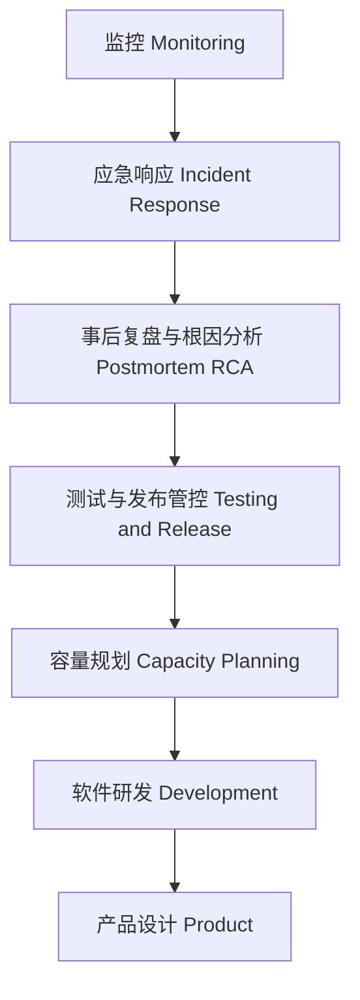
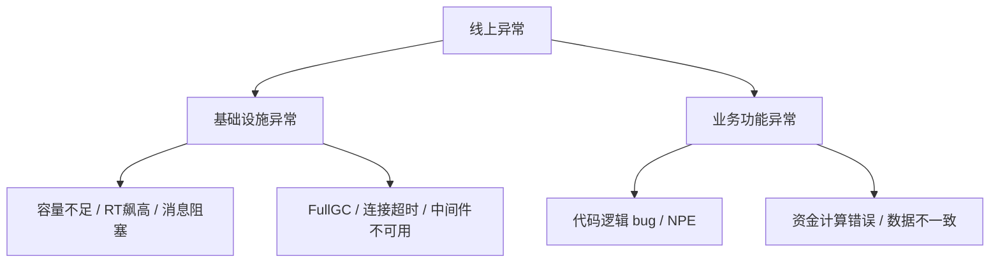
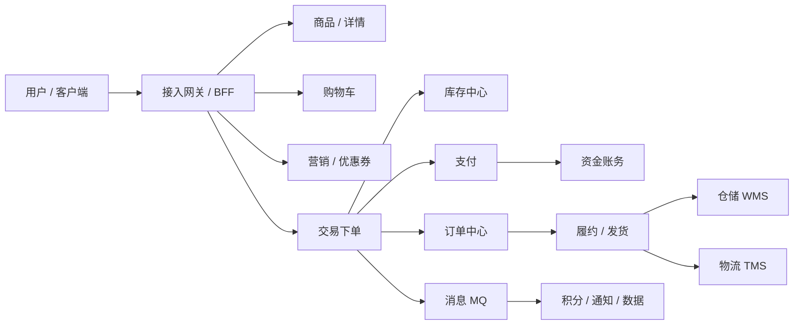
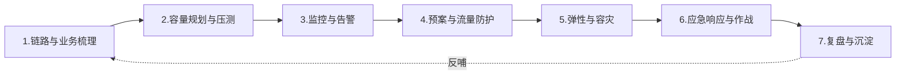
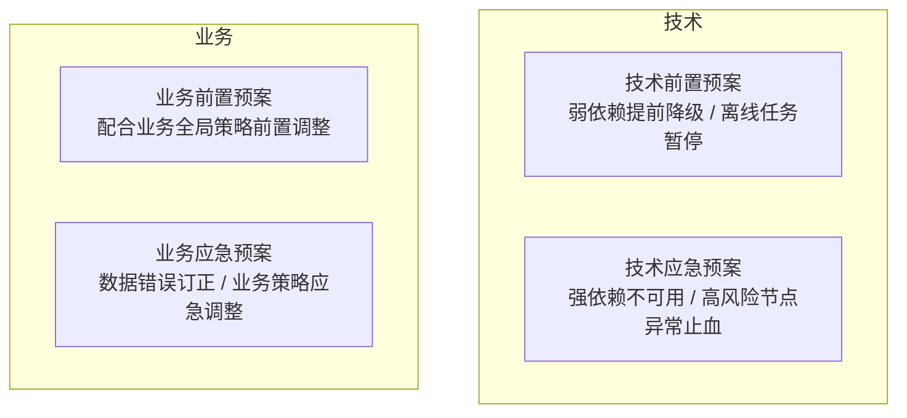
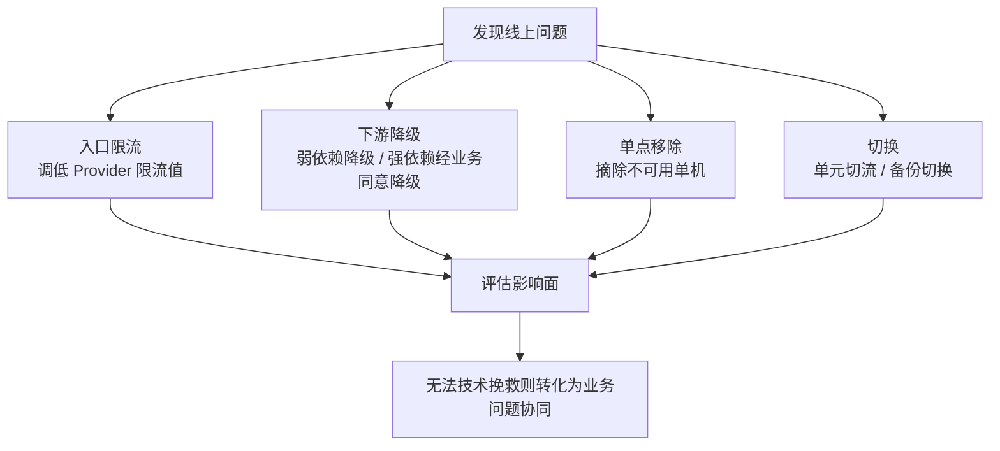
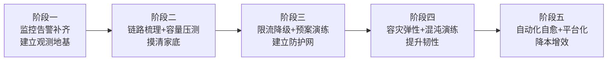
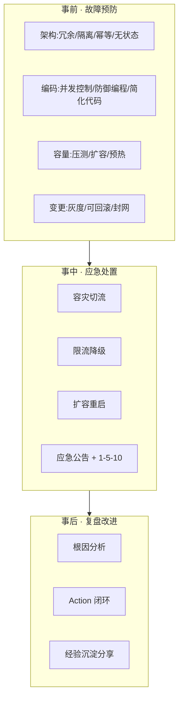

## 写在前面

"年年有大促，大家对于大促稳定性保障这个词都不陌生。业务场景尽管各不相同，'套路'往往殊途同归——全链路压测、容量评估、限流、紧急预案，来来去去总少不了那么几板斧。" 但真正把稳定性做好的团队，都能跳出套路回答一个更本质的问题：**我们为什么要这么做？它背后的理论依据是什么？**

这篇文档以**电商交易履约业务**（下单、支付、库存、履约、物流全链路）为背景，做三件事：

第一，把大促稳定性保障的**方法论**讲透——它不是零散经验的堆砌，而是一套可以体系化推导的工程框架；第二，给出**基于现有项目从 0 到 1 落地稳定性建设**的实操路线、常见坑与解法；第三，沉淀一套**稳定性面试通关题库**，把每个知识点的"是什么、为什么、怎么答"讲清楚。

全文的核心信念只有一句：**大促备战的方法论，就是把不确定性变成确定性。**

---

## 第一部分 认识稳定性：概念与理论基石

### 1.1 什么是稳定性

稳定性保障，就是"保障系统的稳定，在各种不可预知的情况发生时，仍然能够持续稳定地运行和提供服务"。它很像修渠引水灌溉的过程：在应用系统中，"水"可以是用户流量，也可以是资金流，稳定性工作就是保障这些水按照预定的渠道流淌，不渗水、不漏水、不垮塌，即便出现问题也能及时修复、把损失降到最低。

从质量模型看，《GB/T 25000.10—2016》国家标准把软件质量划分为八大特性：功能性、性能效率、兼容性、易用性、可靠性、信息安全性、维护性和可移植性。稳定性主要落在"可靠性"上，但又不局限于此。

一个更朴素但极其有用的理解是把可用性拆成一个循环周期：

> 一个完整周期 = 无故障时间 + 故障恢复时间

尽可能**延长无故障时间（MTBF）**、尽可能**缩短故障恢复时间（MTTR）**，整体可用性就会大大提高。这就把"稳定"这个虚的词，变成了两个可优化的工程目标。

### 1.2 度量：几个 9、SLI/SLO/SLA

稳定性必须可度量，否则无从谈起优化。业界的核心度量语言是"几个 9"：

| 可用性 | 每年不可用时长 | 每月不可用时长 | 典型定位 |
| --- | --- | --- | --- |
| 99%（两个 9） | ~3.65 天 | ~7.2 小时 | 内部工具 |
| 99.9%（三个 9） | ~8.76 小时 | ~43 分钟 | 一般业务 |
| 99.95% | ~4.38 小时 | ~21.6 分钟 | 重要业务 |
| 99.99%（四个 9） | ~52.6 分钟 | ~4.3 分钟 | 核心交易 |
| 99.999%（五个 9） | ~5.26 分钟 | ~26 秒 | 金融支付 |

几个关键概念要分清：

- **SLI（Service Level Indicator）**：服务质量的量化指标，如请求成功率、P99 响应时间、错误率。
- **SLO（Service Level Objective）**：内部设定的目标，如"下单接口成功率 ≥ 99.99%，P99 ≤ 200ms"。
- **SLA（Service Level Agreement）**：对外承诺，通常带违约赔偿，一般比 SLO 更宽松。
- **Error Budget（错误预算）**：`1 - SLO`。有了错误预算才能理性权衡"上新功能"与"保稳定"，预算烧光就该停止变更、专注稳定性。

### 1.3 Google SRE 稳定性金字塔

要回答"怎样的系统才算稳定、稳定性工作到底该做哪些事"，最经典的框架是 Google SRE 的 **Dickerson 可靠性层级模型**（稳定性金字塔）。它由下到上把稳定性需求分层：

金字塔的**底座是监控**——缺少监控的系统如同蒙眼狂奔的野马，无从谈可控性；往上是**应急响应**，决定了从发现问题到解决问题的耗时；再往上是**复盘与根因分析**，是避免重复踩坑的最有效手段；**测试与发布管控**保证每次变更都处于可控区间；**容量规划**应对流量与业务规模变化；塔尖是**产品与研发设计**，即通过优秀架构从根上提升可靠性。

这个模型的价值在于：它告诉我们稳定性建设**有优先级、有地基**。没有监控就谈自愈，等于空中楼阁。

### 1.4 稳定性的本质与分类

稳定性的本质，可以浓缩成两句话：

1. **发现问题，并解决问题。** 识别系统中不稳定的因素、扫平它。历史推进中系统会不断引入风险（代码、模型、流程、业务变更……），所以稳定性工作永远做不完——除非系统停止更新、业务停止变化。
2. **把不确定性变成确定性。** 大促的流量、用户行为都是不确定的，方法论就是通过容量评估、压测、限流、预案，把这些不确定风险变成相对确定的条件。

按场景，稳定性工作通常分三类：

- **日常稳定性**：伴随每次业务需求开发同步进行（监控告警配置、开关预留），主要防的是**业务功能异常**（代码 bug、产品缺陷、资金计算错误）。
- **大促稳定性**：大促前集中完成的针对性建设，主要防的是**基础设施异常**（容量不足、中间件被打挂），因为大促会带来数十倍甚至数千倍流量。
- **稳定性专项**：在做日常和大促过程中发现的"不合理或可以更好"的点，单独立项攻坚（如异地多活、全链路压测平台化）。

一个很实用的**异常二分法**：

基础设施异常"如何才能不发生"——靠事前修炼内功（压测、扩容、预热）；业务功能异常"万一发生了怎么办"——靠提前准备锦囊（开关、预案、订正工具）。两种思路，两套打法。

---

## 第二部分 电商交易履约业务的稳定性特性

### 2.1 交易履约链路全景

电商交易履约是一条典型的长链路、强一致、涉资金的核心业务。一次下单背后往往牵动十几个系统：

这条链路的稳定性诉求与一般读服务不同，它同时要求**高并发、强一致、资金零差错、履约时效**，任何一环抖动都可能引发资损或客诉。

### 2.2 大促的五大不确定性

大促之所以难，本质在于"不确定"。可以归纳为五类：

| 不确定性 | 表现 | 对应的确定化手段 |
| --- | --- | --- |
| 流量不确定 | 峰值可能是日常几十倍，且瞬时脉冲 | 容量评估 + 限流，把流量变成确定条件 |
| 用户行为不确定 | 抢购、预售、满减玩法带来非线性行为 | 全链路压测 + 多场景仿真演练 |
| 安全攻击不确定 | 黑产刷单、DDoS、薅羊毛 | 网关 WAF、热点参数流控、风控 |
| 变更风险不确定 | 大促前后代码/配置变更引入故障 | 变更管控、封网封板 |
| 故障影响不确定 | 一个点故障可能雪崩全链路 | 故障演练、隔离降级、爆炸半径控制 |

### 2.3 交易履约的三条底线

相比一般业务，交易履约有三条不可逾越的底线，也是它区别于普通稳定性建设的地方：

- **资金安全**：一分钱都不能错。需要专门的资金核对体系（后文详述）。
- **数据一致性**：订单、库存、账务必须最终一致，超卖、少发、错发都是事故。
- **幂等**：网络重试、消息重投在大促下极高频，接口必须幂等，否则重复下单、重复扣款。

---

## 第三部分 大促稳定性保障方法论（全链路视角）

方法论的执行顺序，正好对应金字塔从下到上的需求，可以拆成六个阶段加一条贯穿始终的应急能力：

下面逐一展开。

### 3.1 系统链路与业务梳理（System & Biz Profiling）

链路梳理是所有保障工作的**地基**，如同给系统做一次全面体检。时间有限（大促备战通常只有 2 个月左右），不能盲目撒网，必须从关键点、薄弱点下手。

**入口梳理**：一个系统往往有十几个甚至更多入口（HTTP / RPC / 消息）。若无法覆盖全部，优先梳理三类：

- **核心重保入口**：用户承诺 SLI 高、对数据准确性/响应时间有明确要求（如下单、支付）。
- **资损相关入口**：关联公司或客户资金收入（如账务、退款）。
- **大流量入口**：TPS/QPS TOP 5~10，虽不一定高 SLI，但对整体负载影响大。

**节点分层与强弱依赖判断**：从入口这个"线头"出发，沿流量轨迹对链路上所有外部依赖（RPC、DB、缓存、消息、搜索等）做分层。判断强弱依赖的准则：

- 节点不可用 → 业务逻辑中断或高级别有损 → **业务强依赖**；无感可降级或有替换方案 → **弱依赖**。
- 节点不可用 → 执行逻辑中断（return error）或系统性能受影响 → **系统强依赖**。
- 额外标注**低可用节点**（日常超时严重、资源不足）和**高风险节点**（大版本改造、新上线未经历大促、曾出高级别故障、故障后有资损风险）。

**业务策略同步**：大促保障是面向特定活动的针对性建设，必须拿到业务数据——业务时长、体量预估（日常 X 倍）、峰值日期、场景流量分配、特殊玩法、应急打法。

**产出：全链路作战地图。** 完成梳理后应产出一张"作战地图"，包含链路分支流量模型、强弱依赖、资损评估点、对应预案。大促期间可凭它快速从全局视角评估任何应急事件的影响面。

### 3.2 容量规划与全链路压测（Capacity Planning）

容量规划的本质是**追求计算风险最小化与计算成本最小化之间的平衡**——只追求任意一端都不合理。

**第一步：流量模型评估。** 峰值入口流量 = 常规业务流量 + 非常规增量。常规流量有两种算法：

- **历史流量算法**：假设当年增幅符合历史模型，用"同比增量 + 环比增量"拟合。无需业务输入，适合备战初期。
- **业务量-流量转化算法**：以 GMV / DAU / 订单量为输入，用历史"业务量→流量"转化模型（如漏斗模型）换算。强依赖业务总量预估，适合中后期。

非常规增量指容灾预案或营销策略变化带来的流量（如 A 机房故障，流量 100% 切到 B 机房）。计算时通常用发生概率 λ 作为权重，避免全量叠加造成浪费。

**第二步：节点流量分支模型。** 入口流量按链路分支比例向下游转化，原则：同一入口不同链路独立计算；同一节点多次调用需按倍数放大（DB、缓存尤甚）；**DB 写流量重点关注，可能出现热点导致 DB HANG 死**。

**第三步：容量转化。** 不同资源（应用容器、缓存、DB、HBase）流量-容量转化比不同，但都服从 Little's Law 衍生法则，并遵循 **N + X 冗余原则**：在满足目标的最小容量基础上，冗余 X 单位（一般应用集群可取 X = 0.2N）。最终精准容量必须靠**周期性压测**得出，而非纯理论推算。

关于**水位红线**：一般应用保持 60% 以内水位并开启弹性；**网关这类入口应用水位要更低**——建议 CPU 30%、最高不超过 60%，因为网关经常有瞬时突发流量和攻击，一旦被打满就是全局故障（阿里内部网关 CPU 常控制在 10% 以下），因此**网关的秒级监控**尤为必要（分钟级平均会掩盖瞬时脉冲）。

**全链路压测**是容量规划的验收手段，也是最接近真实的仿真：

- **脚本与资产准备**：编写压测脚本、构造压测数据（如价保压测需构造有效期内订单）。写脚本的人必须懂业务链路上的技术风险。
- **压测数据隔离**：通过**影子表 / 影子库**、压测标（染色）让压测流量与真实数据隔离，避免污染线上。
- **单压 → 全链路**：先各业务单独压测达到水位，再做全链路压测。全链路压测极易引发故障，**压测平台必须有一键熔断机制**，发现线上问题第一时间关闭压测。
- **压测仿真度**：把演练 trace 清洗聚合得到"预期链路"，把压测 trace 得到"压测链路"，两者比对得出仿真度，找出压测流量占比低于预期的节点（少压风险）。支付宝五福通过压测仿真等手段把全链路压测达标时间从第 21 天缩短到第 7 天，提效 66%。

### 3.3 监控与告警（Monitoring）

监控是金字塔的地基。业界有两类：**黑盒监控**面向现象（监控正在发生的故障），**白盒监控**面向内部指标与原因（可提前预警、可定位根因）。大促稳定性以**白盒监控**为主。

从上到下把系统分三层，每层套用**四大黄金指标**（延时 Latency、流量 Traffic、错误 Errors、饱和度 Saturation）：

| 层次 | Latency | Traffic | Errors | Saturation |
| --- | --- | --- | --- | --- |
| 业务层 Biz | 核心入口响应时间 | 核心入口 TPS/QPS | 业务成功率、数据正确率 | 业务水位 |
| 应用层 App | 读写 RT、HSF/RPC RT | 中间件 TPS/QPS、线程数 | HSF 超时率、OOM、TOP 错误 | 连接池在用数、线程池空余、堆内外内存 |
| 系统层 System | I/O wait | TCP 流量、线程数 | 主进程消失、TCP retry | Load、CPU、内存使用率 |

> 补充：Google 四黄金指标之外，还有两套常用心法——**RED**（Rate 请求率 / Errors 错误 / Duration 耗时，适合请求驱动的服务）与 **USE**（Utilization 利用率 / Saturation 饱和度 / Errors，适合资源）。面试时能对比这三套会加分。

**告警不是越多越好。** 建议优先设 Biz 层告警（最贴近用户体感），App/System 层主要用于定位。每条告警关注三要素：

- **级别**：是否关联 GOC/故障、是否产生严重业务影响、是否资损。
- **阈值**：不可过于迟钝（漏报），也不可过于敏感（告警风暴导致响应疲劳）；需符合业务波动曲线，分时段设置。
- **通知人与方式**：业务指标异常 → 电话通知处理人 + 业务方；应用/系统告警 → 钉钉/短信通知排查人即可。

一个好监控的评判标准是**正确性、覆盖率、直观性**；一个好告警的标准是**及时性、有效性、责任制（每条告警都要有人认领）**。

**资金安全核对**（交易履约的命门）单独拎出来讲。资金关键要素有三个生命周期节点：生产、传递、消费，对应三类错误：生产错误、漏传错传、消费错误。三大核对方法：

- **基线核对**：拿历史数据做预期对比，投入少、时效低，发现大问题。
- **两两核对**：拿上游做预期对比，精度高、时效高、成本高，难全覆盖。
- **业务逻辑核对**：拿业务专家经验做预期，精度高但依赖人力。

资损防控策略：**保存量、盘增量、控高危、盯特有**——对存量布控持续保鲜；对新增变更做资损评估、发布卡点；对易资损场景专项重保；对大促特有逻辑特别关注。工程上通常"**实时核对（监听异步消息）+ 错误日志告警 + 小时级离线核对兜底**"三层保障，大促高峰安排专人盯资损大盘。

### 3.4 预案与流量防护

**要想在大促现场快速而正确地响应问题，值班同学做的应该是选择题（Which），而不是陈述题（What）。** 而选项，就是预先准备好的预案。

**预案四象限**（按执行时机 × 问题属性）：

预案的本质是一个 switch 开关、配置或工具，提前配置在预案平台后可跳过繁琐审批、快速执行。**预案设置越多越好，但执行须谨慎**：配置时全面评估执行影响，执行时按流程 double check。所有预案都必须**演练保鲜**——存量预案随业务变更可能失效，新预案可能配置错误，不演练就直接在生产执行风险极高。支付宝五福已实现"预案无人值守 / 自动演练 + 自动校验结果 + 一键封板"。

**流量防护四板斧**：限流、降级、熔断、隔离。

- **限流**：当接口 QPS 超过上限就拒绝多余请求，防止系统被打垮。
  - **单机限流**：按单机维度设阈值，简单但流量不均时会误限（阈值不要低于 10）。
  - **集群限流**：精确控制某接口在整个集群的实时调用总量，解决单机流控因流量不均、机器数频繁变动导致效果不佳的问题。两个典型场景：精确控制对下游（DB/缓存）的调用总量；在网关入口做请求总量控制。实践中"**集群流控 + 单机流控兜底**"效果最佳。
  - **热点参数流控**：把热点用户、热点商品（"黑马"商品、黑产刷单）的流量控制在业务模型预估范围内，保护正常用户。
  - **系统自适应保护**：根据 Load、CPU 等系统指标动态调节入口流量（如 mosn 自适应限流兜底）。
- **降级**：牺牲非核心保核心。弱依赖自动降级；强依赖但可异步的降级后异步重试；强依赖又不能异步的，把降级能力**产品化**（作为产品设计的一部分）。可分层分场景、分用户粒度（付费商家优先）、分资源占用（对热点大户禁读禁写）。
- **熔断**：当一段时间内慢调用比例或错误比例达到阈值，自动熔断，后续调用直接返回 Mock 结果，既保护调用端不被拖垮，又给下游"喘息"时间，避免雪崩。注意它是**带状态机**（关闭→打开→半开探测）的，不是"一失败就切断"。
- **隔离**：线程池隔离、信号量隔离、集群/单元隔离——古代木船的"水密隔舱"思想，把风险点单独隔离降级，避免一处进水全船沉没。（真实案例：ES 集群一台物理机故障导致上层应用线程池被耗尽、服务不可用，根因就是隔离没做好。）

**预热**——大促态的"热身"。流量模型决定了大促是"短跑"，必须热身，否则起步就抽筋：

- **数据预热**：把量大、与用户强相关的数据（购物车、红包、卡券）提前加载到缓存/内存，避免缓存击穿直接打挂 DB。
- **应用预热**：**小流量预热**——新启动/新扩容的实例按启动时间计算权重，让流量随时间逐渐爬升到正常水平，避免冷实例被大流量瞬间压垮；**并行类加载**（`registerAsParallelCapable`）降低类加载锁竞争。
- **连接预热**：提前建立 Redis / DB 连接池连接（如 `GenericObjectPool#preparePool`），避免流量进来时大量业务线程等待建连。

### 3.5 弹性与容灾架构

这是金字塔塔尖"产品与研发设计"的体现，也是 S 级大促技术难度最深的领域。

**面向失败设计**是核心方针，具体手段：

- **冗余避免单点**：像飞机的多套引擎。异地多活 / 中美容灾是最核心的冗余手段。
- **服务分治避免雪崩**：模块化 + 隔离 + 可降级。
- **服务幂等保证一致**：多次调用与一次调用结果一致。
- **服务无状态可漂移**：无状态才能弹性伸缩。

**弹性伸缩**的几种形态与取舍：

| 方案 | 依据 | 特点 |
| --- | --- | --- |
| VPA | CPU/内存垂直弹性 | 调 CPU 核数与内存，有上限 |
| HPA | CPU/内存水平弹性 | 加副本，但要经历启动过程，应对瞬时波峰不够快 |
| KPA | 流量/响应水平弹性 | 更快，适合突发流量 |
| 分时调度 | 时间错峰 | 多个 Pod 复用同一份物理资源，跨集群/多峰值互备，大幅省成本 |

**弹性架构**（如蚂蚁 LDC 单元化 + 弹性机房）在大促短时容量需求下把业务弹到临时机房、大促后快速回收，但弹出/弹回过程涉及应用、网络、网关、中间件、消息、DB 存储多个深水区，一不小心就引发故障，必须充分验证（预发弹出 → 同城 1% → 2% → 20% → 48% 灰度放量）。

**容灾切流**是故障快恢的首选（时效性最高）：Web 型应用用 vipserver 拉黑异常单元实现串流；服务型应用用多地注册的代理服务切流。**切流前要先准备保护性限流**，否则回切可能因容量不足引发二次雪崩。

### 3.6 应急响应与作战（Incident Response）

**作战手册**贯穿大促全生命周期，分事前、事中、事后：

- **事前 checklist**（每项含执行人/方案/结果）：集群重启或手动 FGC、影子表数据清理、上下游机器权限检查、限流值检查、开关一致性检查、DB 配置检查、中间件容量检查、监控有效性检查。
- **事中**：紧急预案（含触发/恢复条件、通知决策人）、应急工具脚本、告警大盘、日志数据源明细、上下游机器分组、值班注意事项、核心播报指标、通讯录与排班、值班问题记录。
- **事后**：系统恢复 checklist（限流恢复、缩容）、复盘记录。

**黄金响应准则 1-5-10**：**1 分钟发现、5 分钟止血、10 分钟定位**。发现问题先上报拉群（你不是一个人在战斗），再执行止血（一般是应急预案），审批同意后快速止血，最后才定位根因。**大促期间不可随意变更。**

**止血策略优先级**（先恢复再定位，同时保护现场）：

**SRE 应急角色分工**（嵌套式职责分离，各司其职避免一窝蜂）：事故总控（PM/TL，掌握全局、兜底协调）、事务处理团队（真正处理人，可分多小组）、发言人（对内对外周期同步、维护事故文档）、规划负责人（长故障多轮排班时的职责交接）。

**沙盘推演**是应急能力的最后一道保障：拿历史真实故障 CASE 作为输入模拟大促紧急状况，检验值班同学的止血策略、分工安排、问题定位能力。

### 3.7 测试、变更管控与复盘（Testing & Postmortem）

**大部分线上问题都是变更引入的。** 变更三原则："**可灰度、可监控、可回滚**"。

- **灰度**：功能灰度 + 发布灰度（小流量灰度环境、分单元/分区域部署，为容灾切流创造条件）。
- **回滚**：**切记做回滚验证，不要一股脑回滚完**（曾有"越回滚问题越严重"的案例：远程缓存异常导致数据异常，回滚重启反而放大了本地缓存失效的影响面）。
- **测试回归**：单元测试（代码的照妖镜，难跑起来的往往是设计不合理）、巡检/流量回放（覆盖人肉无法覆盖的海量分支场景，如商品 5000+ 叶子类目）、上线前压测。

**故障演练 / 混沌工程**：验证稳定性措施是否真的有效、锻炼团队应急能力。常态化、突袭式演练，注入 CPU 高、网络延迟、依赖不可用、机房故障等，主动暴露问题。工具如 ChaosBlade。核心是**控制爆炸半径**、可观测、可一键停止。

**复盘改进**：出问题不可怕，重要的是分析过程中的流程机制漏洞，举一反三。归纳总结是利己，经验分享是利他。复盘要产出可落地的 Action，并跟踪闭环。

---

## 第四部分 基于现有项目落地稳定性建设（实操路线图）

前面是"应该做什么"，这一部分回答"**在一个已经跑着的项目上，从哪里开始、怎么一步步做起来**"。

### 4.1 先评估现状与成熟度

不要一上来就上大招。先给现有系统做一次"体检打分"：

| 维度 | 自检问题 | 常见现状 |
| --- | --- | --- |
| 监控 | 核心链路是否有业务成功率大盘？告警是否有人认领？ | 只有系统监控，缺业务监控 |
| 容量 | 是否知道每个核心接口的单机容量水位？ | 拍脑袋估，没压过 |
| 依赖 | 强弱依赖是否梳理清楚？弱依赖能否降级？ | 一堆隐性强依赖 |
| 预案 | 是否有开关能快速止血？演练过吗？ | 有开关但没演练、可能失效 |
| 变更 | 是否可灰度可回滚？回滚验证过吗？ | 全量发布、无灰度 |
| 应急 | 有作战手册吗？1-5-10 能达标吗？ | 出事全靠临场发挥 |

### 4.2 分阶段推进（建议顺序，与金字塔一致）

- **阶段一（地基）**：给核心链路补齐业务成功率、核心接口 RT/QPS、资金核对三类监控与告警；每条告警落实到人。这是投入产出比最高的一步。
- **阶段二（摸底）**：画出全链路作战地图，标注强弱依赖与资损点；对核心接口做单链路压测摸出单机容量水位；接入全链路压测（影子库）。
- **阶段三（防护）**：核心接口 95%+ 限流覆盖；给弱依赖加降级开关、给高风险逻辑加多维度开关（业务身份/类目/商家维度）；把开关录入预案平台并演练保鲜。
- **阶段四（韧性）**：做单元化/多机房容灾切流；引入弹性扩缩容；常态化故障演练。
- **阶段五（自愈）**：把重复的人工操作标准化、自动化（自动扩容、自动执行快恢预案），最终追求"最好的处理是不需要处理"的风险自愈能力。

### 4.3 事前/事中/事后落地清单

> 扁鹊三兄弟的隐喻很贴切：**事前预防（大哥，治未病）> 事中止血（二哥，治小恙）> 事后复盘（扁鹊，治重症）**。预防永远是最重要、最基础的。

### 4.4 组织与流程保障

稳定性不是一个人的事。需要：稳定性小组牵头 + 各业务域 owner 认领；军规与日清机制（压测/演练问题当天清）；封网期变更管控；值班排班与通讯录；容量/预案/限流/监控统一收口到平台（避免多文档来回切、遗漏、无法追溯）。

---

## 第五部分 常见问题与解决方案（高频踩坑）

下面是交易履约大促场景里反复出现的坑，按"现象 → 根因 → 解法"整理，也是面试里问"你踩过什么坑"的素材库。

**1. 单机限流误限**
现象：总量没到阈值，部分机器却频繁触发限流，SLA 未达标。根因：负载均衡不均、机器数频繁变动导致单机均摊阈值不准。解法：改用集群流控精确控制总量 + 单机兜底；单机阈值不低于 10。

**2. 缓存击穿 / 穿透 / 雪崩**
现象：缓存失效瞬间 DB 被打挂。根因：热点 key 集中失效（击穿）、查询不存在的数据（穿透）、大量 key 同时过期（雪崩）。解法：击穿用互斥锁/逻辑过期 + 热点数据预热；穿透用布隆过滤器 + 空值缓存；雪崩用过期时间加随机抖动 + 多级缓存 + 限流兜底。

**3. 线程池耗尽引发级联故障**
现象：一个下游抖动，整个应用线程池被占满，正常业务也无法处理。根因：`并发线程数 = QPS × RT`，下游 RT 升高时线程数飙升堆积；隔离没做好。解法：线程池/信号量隔离、并发隔离策略、对不稳定下游熔断、设置合理超时。

**4. 慢调用导致全链路 RT 飙高**
现象：下游支付服务网络抖动出现大量慢调用，整条链路 RT 飙高濒临崩溃。根因：无超时/无熔断，慢调用堆积。解法：实时监控 + 链路分析快速定位慢调用，配并发控制与熔断，"给系统做心脏复苏"。

**5. 预案失效 / 配置错误**
现象：真要用预案时执行失败或 target 不准。根因：存量预案随业务变更失效、新预案未验证。解法：预案自动演练 + 自动校验结果 + 一键封板保鲜。

**6. 压测引发线上故障**
现象：全链路压测把线上打挂。根因：压测流量挤占线上、影子隔离不彻底。解法：压测标染色 + 影子库隔离；压测平台一键熔断；发现问题第一时间停压。

**7. 回滚放大故障**
现象：越回滚问题越严重。根因：回滚重启触发本地缓存失效等次生问题，且一次性回滚完。解法：分批回滚 + 回滚验证，不暂停不继续。

**8. 容量评估不准导致浪费或不足**
现象：Tab3 带宽预留 1T，实际业务量只有预期 1/7，浪费约 140 万。根因：业务指标预估偏差、资源需求无版本管控。解法：业务量-流量转化算法 + 压测校准 + 活动中控平台统一收口、版本化管理需求。

**9. 弹性扩容不够快**
现象：突发波峰时 HPA 扩容赶不上（要走启动过程）。根因：冷启动慢、资源初始化慢。解法：提前预热 + 小流量预热 + 分时调度预留 + 探索 KPA/镜像快速拉起。

**10. 热点数据 / 黑产流量**
现象："黑马"商品或刷单流量拖垮系统。根因：热点集中、超出业务模型。解法：热点参数流控 + 风控识别 + 网关 WAF。

**11. 资损**
现象：营销、发奖、算奖链路资金出错。根因：生产/传递/消费任一环节异常。解法：实时核对 + 离线核对兜底 + 资损大盘专人盯盘 + 高危预置熔断预案。

**12. 告警风暴 / 告警疲劳**
现象：报警太多，真异常被淹没。根因：阈值过敏感、无分层。解法：报警分层（核心群电话、辅助群钉钉）、召回优先再收敛误报、多指标关联。

---

## 第六部分 稳定性面试通关题库

这一部分把上面的知识重新组织成"面试问答"形态。每题给**考点 + 答题骨架**，建议结合自己真实项目讲，切忌背诵。

### Q1. 谈谈你对稳定性/高可用的整体理解？

**考点**：是否有体系化认知，而非零散名词。
**答题骨架**：先给定义（不可预知情况下持续提供服务）→ 引出可用性公式（延长 MTBF、缩短 MTTR）→ 用 SRE 金字塔说明有层级有地基（监控→应急→复盘→变更管控→容量→架构）→ 点出本质是"发现并解决问题、把不确定性变确定性"→ 落到实践三段论"事前预防、事中止血、事后复盘"。

### Q2. 限流有哪些算法？各自优缺点？单机限流和集群限流怎么选？

**考点**：算法细节 + 工程权衡。
**答题骨架**：
- **固定窗口/计数器**：实现简单，但有**临界突刺**（窗口末尾+下窗口开头可能放行 2 倍）。
- **滑动窗口**：细化时间粒度，缓解突刺。
- **漏桶**：匀速处理、平滑输出，但不允许突发。
- **令牌桶**：允许一定突发（桶里攒了令牌），**更适合应对突发流量**，最常用。
- **单机 vs 集群**：单机简单但流量不均会误限、机器数变动阈值不准；集群限流精确控制总量、适合控制对下游/DB 的调用总量和网关入口。实践用"集群流控 + 单机兜底"。工具可讲 Sentinel（还有系统自适应保护、热点参数流控）。

### Q3. 熔断、降级、限流有什么区别？

**考点**：三个高频混淆概念。
**答题骨架**：
- **限流**：控制**入口流量**，超过阈值拒绝，保护自己不被打垮（对外）。
- **降级**：主动**牺牲非核心**功能/返回兜底，保核心（对内策略）。
- **熔断**：针对**不稳定的依赖**，错误率/慢调用比例超阈值时自动切断一段时间，返回 Mock，避免级联雪崩，带"关闭→打开→半开探测"状态机。
一句话总结：限流防"请求太多"，降级防"自己扛不住主动弃车保帅"，熔断防"下游拖死我"。

### Q4. 超时、重试、幂等为什么要一起设计？

**考点**：组合陷阱。
**答题骨架**：重试必须和超时、限流、幂等一起设计——**无幂等的重试会导致重复下单/扣款；无退避的重试会打挂下游（重试风暴）**。读操作重试相对安全，写操作必须配幂等。重试次数一般 ≤ 3，用**指数退避 + 随机抖动**。幂等方案：唯一请求 ID + 去重表、数据库唯一约束、状态机控制、乐观锁（version）。

### Q5. 什么是全链路压测？怎么保证不污染线上数据？

**考点**：压测工程化。
**答题骨架**：全链路压测是从用户真实入口发起、覆盖链路上所有系统的压测，比单链路更真实。数据隔离靠**压测标染色 + 影子库/影子表**（压测流量写到影子表）。流程：脚本与数据准备 → 单压达标 → 全链路压测 → 观测水位。风险控制：压测平台一键熔断，发现问题立刻停压。进阶可讲**压测仿真度**（压测链路与预期链路比对找少压节点）。

### Q6. 容量评估怎么做？怎么推导机器数？

**考点**：定量能力。
**答题骨架**：
- 峰值流量 = 常规流量（历史流量算法 或 业务量-流量转化算法）+ 非常规增量（按发生概率加权）。
- 节点流量按链路分支比例转化，多次调用要放大。
- 机器数 ≈ 目标 TPS / 单机 TPS，遵循 **N+X 冗余**（应用可取 X=0.2N），保持 **60% 水位**开弹性。
- 网关等入口水位要更低（30%，不超 60%），需秒级监控。
- 理论只用于初估，**最终容量靠压测校准**。

### Q7. 缓存击穿、穿透、雪崩的区别与解法？

**答题骨架**：
- **击穿**：单个热点 key 失效瞬间大量请求打 DB。解法：互斥锁重建、逻辑过期、热点预热永不过期。
- **穿透**：查询根本不存在的数据（恶意）。解法：布隆过滤器、缓存空值。
- **雪崩**：大量 key 同时过期或缓存整体宕机。解法：过期时间加随机、多级缓存、限流降级兜底、缓存高可用。

### Q8. 系统之间如何做隔离？

**答题骨架**：**线程池隔离**（不同依赖用不同线程池，一个打满不影响其他）、**信号量隔离**（轻量、无线程切换）、**集群/单元隔离**（核心与非核心分集群、单元化）、**资源隔离**（DB/缓存分库分资源）。核心思想是"水密隔舱"——控制爆炸半径。

### Q9. 监控体系怎么设计？黄金指标是什么？

**答题骨架**：分黑盒（面向现象）与白盒（面向根因），大促以白盒为主。系统分业务/应用/系统三层，每层套**四黄金指标**（延时、流量、错误、饱和度）；也可提 **RED**（Rate/Errors/Duration）和 **USE**（Utilization/Saturation/Errors）。告警关注级别、阈值、责任人，做报警分层避免告警疲劳，优先业务层告警。

### Q10. 线上出故障了，你的处理流程是什么？

**考点**：应急素养。
**答题骨架**：遵循 **1-5-10（1 分钟发现、5 分钟止血、10 分钟定位）**；**先恢复再定位，同时保护现场**；先上报拉群、明确分工（总控/处理/发言人）；止血优先级：入口限流 → 下游降级 → 单点移除 → 切换容灾；无法技术挽救就转成业务问题协同（评估影响、是否资损）；事后必须复盘并闭环 Action。

### Q11. 什么是异地多活/单元化？

**答题骨架**：单元化是把用户按维度（如 UID）切分到多个自包含单元，每个单元有完整的应用+数据，单元内闭环调用，减少跨单元/跨城调用。异地多活是多地部署可同时提供服务并能互相容灾。好处：容量水平扩展、机房级容灾、就近访问。难点：数据同步与一致性、路由规则、弹性弹出弹回（涉及应用/网络/中间件/消息/DB 多个深水区，需灰度放量验证）。

### Q12. 预案是什么？怎么保证预案有效？

**答题骨架**：预案 = 预先准备的开关/配置/工具，让应急时做"选择题而非陈述题"。分技术/业务 × 前置/应急四类。保证有效性靠：录入预案平台跳过审批、**定期自动演练保鲜 + 自动校验结果**、大促前一键封板。资金相关预案要能一键熔断止血。

### Q13. 如何做资金安全保障（资损防控）？

**答题骨架**：资金要素生命周期（生产/传递/消费）对应三类错误。三大核对：基线核对、两两核对、业务逻辑核对。防控策略"**保存量、盘增量、控高危、盯特有**"。工程实现"实时核对 + 错误日志告警 + 离线核对兜底"三层，大促专人盯资损大盘 + 高危预置熔断。

### Q14. 变更管理三原则是什么？为什么大部分故障来自变更？

**答题骨架**："**可灰度、可监控、可回滚**"。大部分线上问题由变更引入，所以要灰度放量、小流量环境提前暴露、发布前评审、**回滚要做回滚验证**（避免越回滚越严重）。大促期间封网、变更管控。

### Q15. 让你给一个现有系统从 0 搭稳定性体系，你会怎么做？

**考点**：落地规划（用 STAR/分阶段回答）。
**答题骨架**：先评估成熟度找短板 → 阶段一补监控告警地基（业务成功率+核心 RT+资金核对，告警到人）→ 阶段二画作战地图、梳理强弱依赖、压测摸容量 → 阶段三限流覆盖+降级开关+预案演练 → 阶段四容灾弹性+混沌演练 → 阶段五自动化自愈平台化。强调投入产出比：先地基后大招，先止血能力后自愈能力。

---

## 结语

稳定性工作永远做不完，除非系统停止更新、业务停止变化。它的价值在平时默默无闻——"商品发布链路超过 95% 的容灾降级点从来没被使用过，但真正用到时都是关键时刻"。做好稳定性，最重要的不是记住多少套路，而是三样东西：

- **风险意识**：对生产保持敬畏，引入一个新依赖就本能地想"它挂了我怎么办、能不能降级"。
- **体系方法**：用金字塔和"事前预防、事中止血、事后复盘"的框架去覆盖，而不是打地鼠。
- **长期主义**：把每次大促、每次故障都当作锤炼系统、沉淀经验的机会，让下一次不必从头再来。

把不确定性变成确定性，让永远在线成为可能——这就是稳定性建设的全部意义。

---

## 参考文档

**公开资料**

7. JavaGuide《高可用系统设计面试题总结：限流、熔断、重试、幂等、容灾》— https://javaguide.cn/high-availability/high-availability-interview-questions.html
8. 阿里云开发者社区《全链路压测实施指南》— https://developer.aliyun.com/article/1702483
9. 腾讯云《全链路压测：核心链路四问》— https://cloud.tencent.com/developer/article/1971103
10. 京东云开发者社区《万字长文浅谈系统稳定性建设》— https://developer.jdcloud.com/article/3894
11. 京东云《架构师日记-从技术角度揭露电商大促备战的奥秘》— https://developer.jdcloud.com/article/2987
12. Google SRE《Site Reliability Engineering》/《The Site Reliability Workbook》— https://sre.google/books/

> 说明：ATA 内容属阿里集团内部资料，本文仅作个人学习整理，请勿对外传播或用于外部 AI 训练。
