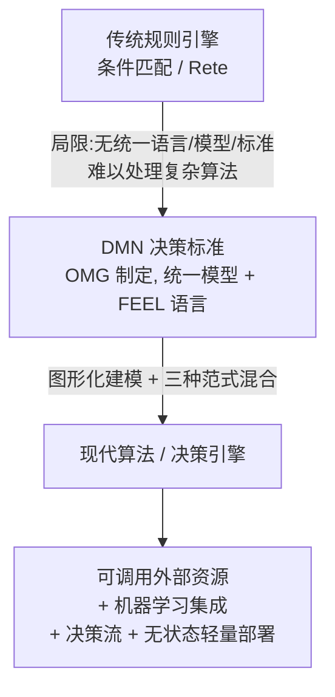
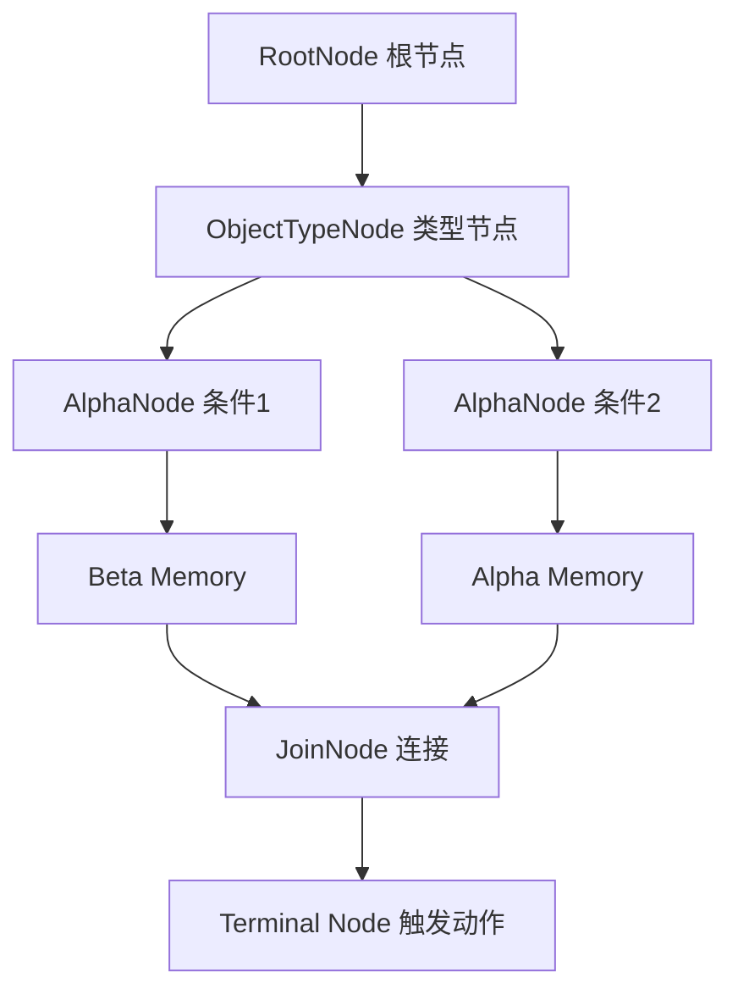
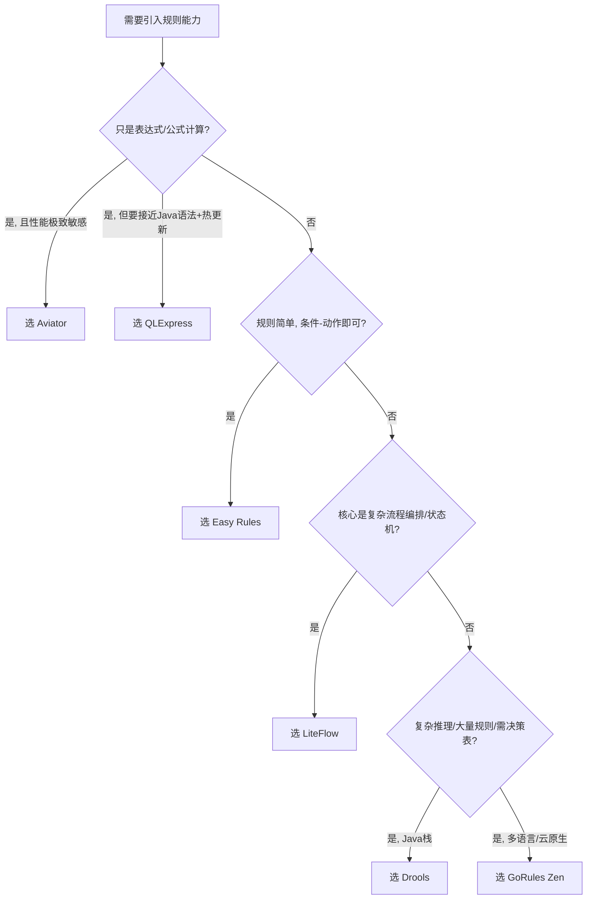
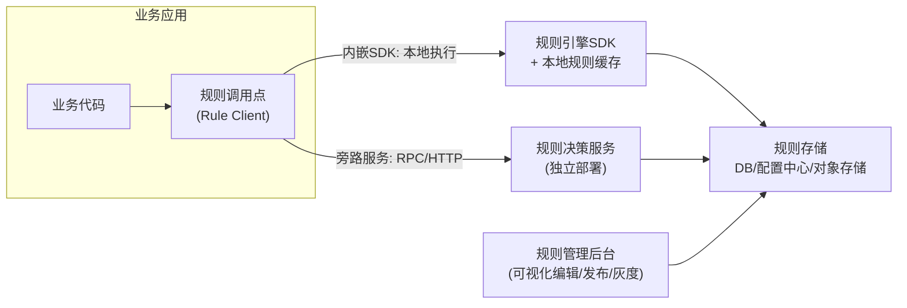
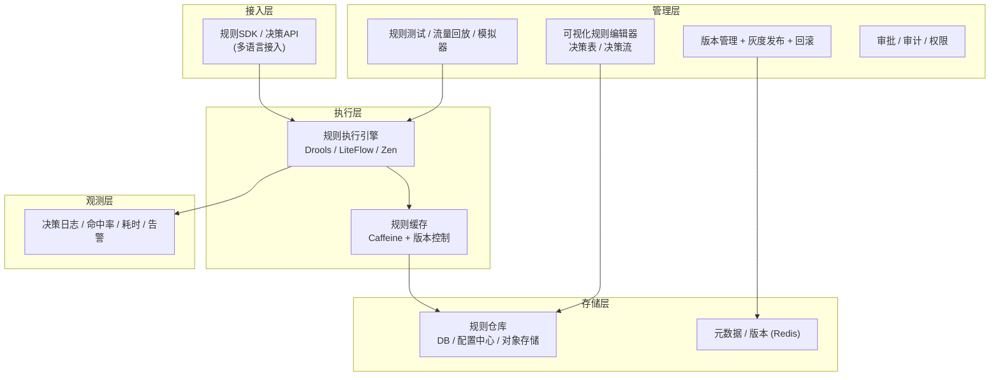

## 摘要

规则引擎的本质，是把"频繁变化的业务决策逻辑"从"相对稳定的应用代码"中剥离出来，让业务规则可配置、可热更新、可被非技术人员理解和维护。本文从概念与原理讲起，系统梳理 Rete 算法与 DMN 决策标准，横向对比 Drools、Easy Rules、LiteFlow、QLExpress、Aviator、GoRules Zen 六款主流引擎的优势与不足，给出一套可操作的选型方法论与渐进式引入路径，深入剖析落地过程中的性能、内存、规则治理、热更新、安全沙箱等真实问题及其解法，并给出规则引擎平台的能力建设方案。文末汇总了面试高频知识点、答题思路与参考问题清单。

> 说明：本文素材来自公开互联网技术文章（腾讯云、阿里云开发者社区、掘金、CSDN、GitHub 等）的检索与综合。原计划检索的 ATA 内网文章因需要 SSO 登录、且当前会话浏览器代理不可用而未能获取，已用公开源（含阿里系开源引擎 QLExpress/Aviator 及 DMN 标准资料）加以补充，特此说明。

---

## 一、什么是规则引擎

### 1.1 定义

规则引擎（Rule Engine）通常作为一个组件嵌入在应用程序中，它实现了**将业务决策从应用程序代码中分离出来**：使用预定义的语义模块编写业务规则，接受数据输入，解释业务规则，并根据规则做出业务决策。

用一句话概括它的价值：**规则引擎解决"易变逻辑"与"业务耦合"的问题，用规则来驱动逻辑**。以前写死在代码里的 `if-else` 判断，可以被提取成外部规则，随时热更新，而不必重新编译、发布应用。

一条规则的最小结构可以抽象为：

```
规则 = 条件（Condition / LHS 左手元） + 动作（Action / RHS 右手元）
```

以 IF-THEN 的产生式（Production Rule）形式表达，例如汽车贷款审批：

```
规则1：IF 月薪 > 7万 AND 信用评分 > 900  THEN 批准贷款，额度为申请金额的 60%
规则2：IF 月薪 > 3.5万 AND 信用评分 > 700 THEN 批准贷款，额度为申请金额的 90%
```

### 1.2 三个容易混淆的概念：规则引擎 / 流程引擎 / 算法(决策)引擎

| 类型 | 解决的核心问题 | 典型代表 |
| --- | --- | --- |
| 规则引擎 | 易变逻辑与业务解耦，**规则驱动逻辑** | Drools、Easy Rules |
| 流程引擎 | 业务在不同角色间的**流转**（请假、审批等），**规则驱动角色流转** | Activiti、Flowable、Camunda |
| 算法/决策引擎 | 在规则匹配之上，进一步支持**图形化决策建模、复杂算法、机器学习集成** | 基于 DMN 的现代 BRMS、GoRules Zen |

三者并非互斥，现代平台往往融合：规则引擎负责决策，流程引擎负责编排流转，决策引擎（DMN）则代表了规则引擎向"算法建模"演进的方向。

### 1.3 一个直观的演化脉络



---

## 二、为什么需要规则引擎（不用它有什么痛点）

在没有规则引擎的项目里，业务决策往往以大量嵌套的 `if-else`、`switch`、策略类的形式散落在代码各处。随着业务增长，会出现一系列典型痛点：

第一是**变更成本高**。促销规则、风控阈值、审批条件经常变动，每次变更都要改代码、走测试、重新发布，响应速度跟不上业务节奏。

第二是**逻辑与代码强耦合**。核心判断逻辑被埋在服务代码深处，牵一发而动全身，容易改出回归缺陷。

第三是**可读性与可维护性差**。几百上千行的条件分支，几个月后连作者自己都难以看懂，更别说交接。

第四是**业务方无法参与**。产品、运营、风控人员最懂业务规则，却只能通过"提需求—排期—开发—上线"的漫长链路间接表达，沟通损耗巨大。

引入规则引擎后，这些痛点转化为对应的优势：

- **业务与逻辑解耦**：规则独立存储于文件、数据库或规则中心，与应用代码分离。
- **热更新、准实时生效**：改规则不改代码、不重启服务，分钟级甚至秒级生效。
- **规则集中治理**：统一管理、版本化、可回溯、可灰度、可审计。
- **降低业务响应时间与成本**：通过标准化的通用规则语言，让懂业务的人（甚至非技术人员）也能参与规则维护。
- **提升可测试性**：规则可独立测试与回放，降低核心链路的回归风险。

> 一句话判断是否该用：**如果一段逻辑"变化频繁、由业务驱动、且希望非开发同学也能维护"，它就是规则引擎的candidate；如果逻辑稳定、性能极致敏感、且只在一处使用，直接写代码反而更好。**

---

## 三、核心原理：推理机、Rete 算法与 DMN

### 3.1 规则引擎的基本工作机制

规则引擎一般由三部分组成：**规则库（Knowledge Base）**、**工作内存（Working Memory，存放事实 Fact）**、**推理机（Inference Engine）**。推理机负责将工作内存中的事实与规则库中的规则进行**模式匹配（Pattern Matching）**，选择可激活的规则（冲突消解），并执行其动作。这个循环被称为 **match–select–act cycle（匹配—选择—执行）**。

推理方式分两类：

- **正向推理（Forward Chaining）**：数据驱动，从已知事实出发不断触发规则、推导新事实，直到没有可激活的规则。Drools 等主流引擎默认采用。
- **反向推理（Backward Chaining）**：目标驱动，从要证明的结论倒推需要满足的条件，类似 Prolog。

### 3.2 Rete 算法——规则引擎的"心脏"

Rete 算法由卡内基梅隆大学的 Charles L. Forgy 于 1974 年提出，是产生式系统正向推理的高效模式匹配算法。其核心思想是"**用空间换时间**"：把规则条件编译成一张可共享的匹配网络，缓存中间匹配状态，避免每次事实变化都重新全量匹配。

Rete 网络的主要节点：

| 节点 | 作用 |
| --- | --- |
| RootNode | 根节点，所有对象由此进入网络 |
| ObjectTypeNode | 对象类型节点，保证对象只进入自己类型所在的子网络 |
| AlphaNode | 代表条件中的**单模式**（对单个事实的约束），配 Alpha Memory |
| JoinNode（BetaNode） | 执行**连接**操作（类似数据库表连接），带记忆功能；左输入为 Beta Memory，右输入为 Alpha Memory |
| NotNode / Terminal Node | 否定连接 / 规则终止（动作）节点 |



Rete 的**优点**：多条规则可以共享 BetaNode 与 Beta Memory，若某个节点被 N 条规则共享，其匹配效率相当于提升 N 倍；由于缓存了匹配状态，事实变动不大时可避免重复计算，因此"**匹配速度与规则数目基本无关**"。

Rete 的**缺点**：以空间换时间，Beta 存储区会随规则和事实数量近似指数级增长，规模过大时可能耗尽内存；事实删除（retract）开销较高，需要额外查找。

**优化建议**：把易变规则、弱约束条件放到网络后面，把强约束、区分度高的模式放到前面优先过滤；内存中只存指针并建立 hash 索引；JoinNode 可扩展为 And/Or 连接。

> 演进：Drools 后续版本用 **PHREAK** 算法替代了纯 Rete。PHREAK 在 Rete 基础上引入了"惰性求值（lazy evaluation）"和面向集合的批处理，减少了不必要的中间计算，在大规模规则下更省内存、更快。

### 3.3 DMN 与 FEEL：规则引擎的标准化演进

**DMN（Decision Model and Notation，决策模型与符号）** 是由 OMG（对象管理组织）维护的、独立于厂商的国际业务决策建模标准，解决了传统规则引擎"没有统一语言、没有统一模型、没有统一标准"的问题。

DMN 的核心功能形态包括**决策表（Decision Table）**，以及作为其变种的评分卡、决策树、决策流。**FEEL（Friendly Enough Expression Language）** 是 DMN 定义的规则表达式语言，语法简洁但功能强大，内置大量函数与运算符，能直接在表达式中操作列表和表，而无需退回到 SQL 或 Java。

DMN 让规则引擎从"孤立的条件匹配"升级为"图形化、结构化、可调用外部资源、可集成机器学习"的决策建模平台，代表了规则引擎向"算法/决策引擎"演化的行业方向。

---

## 四、主流规则引擎框架全景对比

下面选取六款有代表性的引擎：老牌重量级 Drools、轻量注解式 Easy Rules、编排式 LiteFlow、阿里系脚本引擎 QLExpress、高性能表达式引擎 Aviator，以及云原生跨语言的 GoRules Zen。

### 4.1 Drools —— 企业级、功能最全的老牌引擎

Drools 是十几年历史的老牌 Java 规则引擎（现已到 8.x），基于 Charles Forgy 的 Rete 算法（后演进为 PHREAK），拥有专属的 `.drl` 规则文件与 `when...then` 语法，广泛应用于支付路由、金融风控、保险理赔等复杂核心场景。

```java
// discount.drl
rule "VIP用户满100减20"
when
    $user: User(level == "VIP")
    $order: Order(amount > 100)
then
    $order.addDiscount(20);
end
```

- **优势**：完整的 Rete/PHREAK 实现，支持复杂规则网络与冲突消解；生态成熟，有 KIE Workbench 管理控制台、DMN 支持、决策表（Excel）等；功能覆盖面最广。
- **不足**：学习曲线陡峭（DRL 语法、KieContainer/KieBase/KieSession 一套对象体系）；内存消耗大；SpringBoot 集成需写较多配置；对轻量场景偏"重"。

### 4.2 Easy Rules —— 五分钟上手的轻量引擎

Easy Rules 是 POJO + 注解式（`@Rule`、`@Condition`、`@Action`）的轻量引擎，零第三方依赖。

- **优势**：极简、上手快、无依赖，支持规则组合，适合参数校验、简单风控、审批判断等轻量场景。
- **不足**：不支持复杂规则链与推理网络，无可视化界面，能力上限较低。

### 4.3 LiteFlow —— 组件编排式规则引擎

LiteFlow（Dromara 社区，2020 年开源）主打**组件编排**：用 EL 表达式串联组件的流转，覆盖整个业务流程而非单个规则片段，支持同步/异步/条件/循环/嵌套。

| 关键字 | 含义 |
| --- | --- |
| THEN | 同步顺序 |
| WHEN | 异步并行 |
| SWITCH | 选择 |
| IF | 条件 |
| FOR / WHILE | 次数循环 / 条件循环 |

- **优势**：可视化流程编排、支持异步并行、规则热更新；提供 SpringBoot Starter 自动装配，API 简单（一个 `LiteFlowExecutor`）；组件支持 Java 与脚本（Groovy、QLExpress）混编，可通过 `@ScriptBean` 直接调用 Spring Bean、RPC、DAO；上下文 `context` 贯穿整个链路。
- **不足**：文档相对较少，社区生态仍在完善；更偏"流程编排"，对纯复杂条件推理不如 Drools 专业。

### 4.4 QLExpress —— 阿里系动态脚本引擎

QLExpress 是阿里巴巴开源、在电商业务大规模使用的脚本引擎，语法接近 Java，支持函数扩展、宏定义、完善的沙箱安全。

- **优势**：脚本热更新，语法接近 Java，安全沙箱完善，适合营销规则、财务公式、动态配置计算等灵活变更场景。
- **不足**：调试相对困难，复杂规则的可读性较差。

### 4.5 Aviator —— 高性能表达式引擎

Aviator 专注表达式求值，直接编译成字节码，性能极高（官方对比：执行 10 万次约 220ms，而 Groovy 约 1850ms），轻量无依赖。

- **优势**：性能出众、字节码生成、轻量，适合实时定价、风控指标计算、大数据字段加工。
- **不足**：只支持表达式，不支持流程控制，能力聚焦但边界明确。

### 4.6 GoRules Zen —— 云原生跨语言决策引擎

Zen 由 Rust 编写，提供 NodeJS、Python、Go 原生绑定，是云原生、跨语言场景的代表。它基于 **JDM（JSON Decision Model）**，把决策逻辑建模为存储在 JSON 中的相互连接的图；节点类型包括决策表、Switch、Function（内置 QuickJS，50ms 超时，内置 dayjs/big.js）、Expression、Decision（复用其他决策模型）。配套开源 React 可视化编辑器（JDM Editor）与自托管/云端 BRMS。MIT 许可，支持多平台架构。

- **优势**：跨语言、可嵌入、云原生友好，JSON 决策模型天然适合配置化与可视化，适合多语言微服务与 Serverless 场景。
- **不足**：相对较新，中文资料与生态不如 Drools 丰富；Function 节点脚本有超时约束，不适合重计算。

### 4.7 横向对比总览

| 引擎 | 类型 | 语言/生态 | 学习成本 | 性能 | 可视化 | 热更新 | 典型场景 |
| --- | --- | --- | --- | --- | --- | --- | --- |
| Drools | 推理型(Rete/PHREAK) | Java | 高 | 中(功能全) | 有(KIE) | 支持 | 金融风控、保险理赔、复杂规则网络 |
| Easy Rules | 轻量条件-动作 | Java | 极低 | 高(轻量) | 无 | 弱 | 参数校验、简单风控、审批 |
| LiteFlow | 组件编排 | Java | 中 | 中 | 有 | 支持 | 复杂业务流程、订单状态机、审核流 |
| QLExpress | 脚本 | Java | 低 | 中 | 无 | 支持 | 营销规则、财务公式、动态计算 |
| Aviator | 表达式 | Java | 低 | 极高 | 无 | 支持 | 实时定价、风控指标、字段加工 |
| GoRules Zen | JDM 决策模型 | Rust + Node/Py/Go | 中 | 高 | 有(JDM Editor) | 支持 | 云原生、多语言微服务、可配置决策 |

**性能压测参考**（网络公开数据，单机 1 万次，仅供量级参考，不同版本/场景差异大）：

| 引擎 | 耗时 | 内存 | 特点 |
| --- | --- | --- | --- |
| Aviator | ~28ms | 极低 | 高性能表达式 |
| Easy Rules | ~38ms | 低 | 轻量易用 |
| QLExpress | ~65ms | 中 | 阿里系脚本 |
| LiteFlow | ~120ms | 中 | 流程编排 |
| Drools | ~420ms | 高 | 功能全面 |

> 注意：以上数字来自单篇公开压测文章，仅反映"量级差异"而非权威基准。Drools 的耗时主要来自其完整推理网络的构建，在规则数量巨大、需复杂推理时它的价值才充分体现；对简单条件求值，轻量引擎反而更合适。

---

## 五、如何选型：一套可操作的方法论

### 5.1 选型的核心评判维度

综合公开资料，判断一款规则引擎是否合格，可从这几个维度打分：

1. 规则表达式是否足够灵活（条件、循环、嵌套、集合操作）。
2. 规则与宿主语言（Java 等）的联动是否方便（引类、取 Bean、调 RPC/DAO）。
3. API 与各类系统的集成是否顺畅（是否有 Starter、SDK）。
4. 侵入性与耦合度是否低。
5. 学习成本是否可接受、是否易上手。
6. 是否支持脚本语言插件。
7. 规则能否与业务松耦合、独立存储（文件/DB/规则中心）。
8. 规则变更能否实时改变逻辑（热更新）。
9. 是否有可视化界面支持非技术人员维护。
10. 性能表现是否满足业务 SLA。

### 5.2 按业务场景选型（决策树）



场景化建议（经验值）：

- 简单场景：Easy Rules + Aviator 组合。
- 金融风控、复杂规则网络：Drools。
- 电商营销、动态规则灵活变更：QLExpress。
- 复杂业务流程/工作流驱动：LiteFlow。
- 多语言微服务、Serverless、需要可视化配置：GoRules Zen / 基于 DMN 的方案。

### 5.3 结合团队与技术栈的现实考量

选型不只是技术比较，还要看：团队语言栈（纯 Java 还是多语言）、团队对规则 DSL 的接受度、是否有非技术同学要参与规则维护（决定是否需要可视化）、规则规模与变更频率、性能 SLA、是否需要与现有流程引擎/低代码平台集成、社区活跃度与长期可维护性。

**一个务实的原则**：不要为了"用规则引擎"而用。先评估规则的**变化频率 × 复杂度 × 参与角色**，从最轻量能满足需求的方案开始，预留演进空间。

---

## 六、如何在现有项目中引入规则引擎

### 6.1 引入的架构模式

规则引擎通常以"旁路决策服务"或"内嵌 SDK"两种形态引入：



- **内嵌 SDK 模式**：规则在业务进程内执行，延迟低、无网络开销；适合高并发核心链路。规则文件从 DB/配置中心/对象存储动态加载。
- **旁路决策服务模式**：规则引擎独立部署为决策服务，业务通过 RPC/HTTP 调用；便于统一治理、独立扩缩容、多语言复用，代价是网络开销与可用性依赖。

### 6.2 渐进式引入路径（推荐）

不要一上来就大改。建议分四步走：

第一步，**选一个"痛点明确、变化频繁"的小场景试点**（如某个营销满减规则、某个准入校验），把这段 `if-else` 抽成规则，验证引擎选型与工程链路。

第二步，**沉淀规则抽象层**。定义统一的规则输入（Fact/Context）、输出（决策结果），把规则调用封装成内部 SDK，屏蔽底层引擎细节（便于日后替换引擎）。

第三步，**接入规则存储与热更新**。规则从代码里的硬编码，迁移到数据库/配置中心/对象存储，打通动态加载与缓存刷新。

第四步，**建设规则管理能力**（编辑、版本、灰度、监控），逐步把更多场景迁移进来，形成规则中心。

### 6.3 Drools 集成示例（内嵌 + 动态加载）

```java
// 1. 从存储动态加载 .drl 内容，写入 KieFileSystem
KieServices ks = KieServices.Factory.get();
KieFileSystem kfs = ks.newKieFileSystem();
kfs.write("src/main/resources/rules/discount.drl", drlContentFromDb);

// 2. 编译构建，检查错误
KieBuilder kieBuilder = ks.newKieBuilder(kfs).buildAll();
Results results = kieBuilder.getResults();
if (results.hasMessages(Message.Level.ERROR)) {
    throw new IllegalStateException("规则编译失败: " + results.getMessages());
}

// 3. 复用 KieContainer / KieBase（务必缓存，避免每次重建）
KieContainer kc = ks.newKieContainer(ks.getRepository().getDefaultReleaseId());

// 4. 执行
KieSession session = kc.newKieSession();
session.insert(new Order(120, "VIP"));
session.fireAllRules();
session.dispose();
```

关键点：**KieBase/KieContainer 的构建很重，必须缓存复用**；规则内容从数据库/对象存储动态加载而非硬编码；编译要做容错与耗时监控。

---

## 七、规则引擎能解决哪些问题（场景清单）

规则引擎适合"业务规则频繁变化、需要解耦与热更新"的场景，典型包括：

金融与风控领域的信贷审批、反欺诈、交易风控、授信额度计算；营销与电商的满减/折扣/优惠券叠加、会员权益、活动准入、智能推荐的规则过滤；保险的核保、理赔规则计算；支付的路由选择、渠道决策；风控/合规的黑白名单、准入校验、参数合法性校验；供应链与物流的调度分单、计费规则；以及各类审批流的条件判断、状态机流转。

它们的共同特征是：规则条目多、变化快、由业务驱动、且希望规则集中治理并可被非开发人员理解。

---

## 八、落地中的真实问题与解决方案

引入规则引擎不是"银弹"，落地过程中往往会踩到下面这些坑。

### 8.1 性能与冷启动

**问题**：Drools 等"编译-执行"型引擎，规则编译（解析、语义校验、构建 KieBase）是 CPU 与内存密集操作，首次执行有明显冷启动延迟；频繁重建 KieBase 会拖垮性能。

**解决**：
- **缓存 KieBase**：用 Caffeine 本地缓存（`maximumSize` + `expireAfterAccess` 实现 LRU+TTL）替代无过期的 `ConcurrentHashMap`，避免重复编译又防止内存无界增长。
- **并发控制**：按 `ruleSetId` 维度加锁（`ConcurrentHashMap<String, ReentrantLock>`），保证同一规则集只编译一次，其余线程等待复用。
- **启动预热**：应用启动时预构建高频规则的 KieContainer/KieBase，把冷启动成本前置。
- **表达式引擎替代**：对纯表达式/公式类计算，用 Aviator（字节码）等轻量高性能引擎，别用重型推理引擎。

### 8.2 内存与 OOM

**问题**：Rete 网络以空间换时间，规则/事实规模大时 Beta Memory 指数级膨胀，缓存不当会 OOM。

**解决**：给规则缓存设最大容量与 TTL；用 Redis 过期键触发清理；及时 `session.dispose()` 释放会话；控制单次插入工作内存的事实规模；必要时用 PHREAK（惰性求值）或拆分规则集。

### 8.3 规则版本、一致性与灰度

**问题**：多实例/多服务环境下，如何保证所有节点用同一版本规则？如何灰度发布、快速回滚？

**解决**：
- **版本号 + 缓存键**：用 Redis 保存规则集版本号（key 如 `kie_base_key:{ruleSetId}`），本地缓存键设计为 `{ruleSetId}_{version}`，版本变更即自然失效旧缓存，实现跨服务一致性。
- **CAS 初始化**：用 `Redis SETNX`（`setIfAbsent`）保证只有第一个线程写入版本号，避免写冲突与重复编译。
- **灰度**：规则发布支持按流量比例/白名单/机房维度灰度，先小流量验证再全量；保留历史版本以便一键回滚。

### 8.4 规则热更新的时效与安全

**问题**：热更新如何做到准实时且不出错误规则？

**解决**：规则存储于 DB/配置中心/对象存储（如 MinIO），通过监听配置变更或版本轮询触发本地缓存刷新；**发布前做编译校验与规则测试（回放历史流量）**，避免坏规则上线；提供"影子模式/试运行"先验证再切换。

### 8.5 规则冲突与优先级

**问题**：多条规则同时满足时，执行顺序不确定，可能产生冲突（如多个折扣叠加）。

**解决**：使用引擎的冲突消解机制（Drools 的 `salience` 优先级、`agenda-group`、`no-loop`、`ruleflow-group`；DMN 决策表的 HitPolicy 如 first/collect/priority）；对规则做互斥/优先级设计，并在测试中覆盖多规则命中场景。

### 8.6 脚本安全与沙箱

**问题**：允许业务写脚本（Groovy/QLExpress/JS）意味着潜在的安全风险（死循环、恶意代码、资源耗尽）。

**解决**：使用带沙箱的引擎（QLExpress 沙箱、Zen 的 QuickJS 50ms 超时）；限制可调用的类与方法白名单；设置执行超时与资源上限；对脚本做审核与权限管控。

### 8.7 可调试性与可观测性

**问题**：规则以 DSL/脚本形式存在，出错时难以像普通代码一样断点调试；线上决策结果难追溯。

**解决**：记录每次决策的输入事实、命中规则、输出结果（决策日志/决策追踪）；提供规则模拟器与单元测试框架；对关键规则做埋点与监控（命中率、耗时、异常率）。

### 8.8 组织与协同

**问题**：规则由业务方维护后，谁来保证规则质量？开发与业务如何协作？

**解决**：建立规则评审与发布审批流程；提供可视化编辑 + 校验 + 测试的管理后台，降低业务方门槛；明确规则 owner 与变更审计；沉淀规则文档与命名规范。

---

## 九、规则引擎平台/能力建设方案

当规则场景从"一个点"扩展到"全公司多业务线"时，就需要建设**规则中心/决策平台**。一个较完整的分层架构如下：



各层要点：接入层提供统一 SDK/决策 API 并屏蔽底层引擎；执行层负责高性能求值与缓存复用；管理层是平台的价值所在——可视化编辑（决策表/决策流）、版本与灰度、测试与回放、审批审计；存储层做规则与元数据的持久化与版本化；观测层保障可追溯与告警。参考网易考拉等公开的规则平台实践，"规则可视化编排 + 版本灰度 + 决策追踪 + 性能监控"是平台成熟度的核心标志。

---

## 十、快速选型并落地的能力建设路线图

把前面内容压缩成一条可执行的路线：

第一阶段（1-2 周，试点）：明确一个高变更场景，完成引擎选型（用第五章决策树），把该场景规则化，打通"规则存储—加载—执行"闭环，产出内部规则 SDK 雏形。

第二阶段（1 个月，标准化）：抽象统一的 Fact/Context 输入与决策输出模型；接入配置中心/DB 动态加载与版本化；补齐编译校验、缓存复用、决策日志。

第三阶段（1-2 个季度，平台化）：建设可视化规则管理后台（编辑、版本、灰度、回滚、测试回放），接入监控告警，逐步把更多业务线规则迁入规则中心，形成统一决策能力。

第四阶段（持续演进）：引入 DMN/决策流提升建模能力，探索与低代码/流程引擎/机器学习模型的融合，向"决策智能平台"演进。

衡量能力建设成熟度的关键指标：规则变更平均上线时长（从"天级"降到"分钟级"）、业务方自助维护规则占比、决策可追溯率、核心链路规则执行 P99 延迟、坏规则拦截率（发布前校验）。

---

## 十一、面试高频知识点与答题思路

**Q1：什么是规则引擎？它解决什么问题？**
思路：先给定义（把易变的业务决策从代码中解耦、可配置可热更新），再讲痛点（if-else 泛滥、变更成本高、业务无法参与），最后点价值（解耦、热更新、集中治理、降本提效）。切忌只背定义，要能举一个业务例子。

**Q2：规则引擎、流程引擎、决策引擎有什么区别？**
思路：规则引擎=规则驱动逻辑；流程引擎=规则驱动角色/任务流转（如审批）；决策引擎(DMN)=在规则之上做图形化决策建模与算法集成。三者可组合。

**Q3：讲一下 Rete 算法的原理和优缺点。**
思路：核心是"空间换时间"，把规则条件编译成可共享的匹配网络（Root/ObjectType/Alpha/Beta 节点），缓存中间匹配状态，避免重复计算，使匹配速度与规则数量基本无关。优点是共享节点提效、增量匹配；缺点是内存随规模指数增长、事实删除开销大。可延伸讲 Drools 用 PHREAK（惰性求值）改进了 Rete。

**Q4：正向推理和反向推理的区别？**
思路：正向=数据驱动，从事实推结论（Drools 默认）；反向=目标驱动，从结论倒推条件（类似 Prolog）。

**Q5：如何做规则引擎选型？**
思路：给维度（表达能力、集成成本、学习曲线、热更新、可视化、性能、社区），再给场景映射（简单校验→Easy Rules；表达式→Aviator；脚本→QLExpress；流程编排→LiteFlow；复杂推理→Drools；多语言云原生→Zen），最后强调"从最轻量满足需求的方案起步"。

**Q6：Drools 性能如何优化？**
思路：缓存 KieBase 复用（Caffeine LRU+TTL）、按规则集加锁避免重复编译、启动预热、动态加载 .drl、及时 dispose 会话、必要时拆分规则集或用 PHREAK。

**Q7：规则如何做热更新与版本一致性？**
思路：规则外置到 DB/配置中心/对象存储；用 Redis 版本号 + 本地缓存键 `{ruleSetId}_{version}` 保证跨服务一致；SETNX 做 CAS 初始化避免重复编译；发布前编译校验 + 流量回放，支持灰度与回滚。

**Q8：多条规则同时命中冲突怎么解决？**
思路：用冲突消解机制——Drools 的 salience/agenda-group/no-loop；DMN 决策表的 HitPolicy（first/collect/priority）；从设计上做规则互斥与优先级，测试覆盖多命中场景。

**Q9：规则引擎的缺点/引入代价是什么？**
思路：诚实回答——学习成本、调试困难、可能的性能与内存开销、规则治理复杂度、误用会让逻辑更难维护。强调"规则引擎适合易变复杂逻辑，不适合稳定简单或性能极致场景"。

**Q10：Rete 为什么匹配速度与规则数量无关？内存代价是什么？**
思路：因为共享节点 + 缓存匹配状态实现增量匹配；代价是 Beta Memory 随规则/事实数指数增长，可能 OOM，需靠缓存策略与规则拆分控制。

---

## 十二、参考问题清单（面试 / 方案评审可直接复用）

概念层：规则引擎的定义与核心价值？与流程引擎/策略模式的区别？什么时候不该用规则引擎？

原理层：Rete 网络的节点组成？Alpha 与 Beta Memory 的作用？PHREAK 相比 Rete 改进了什么？正向/反向推理各自适用场景？DMN 和 FEEL 是什么？

框架层：Drools 的 KieContainer/KieBase/KieSession 关系？LiteFlow 的 EL 编排关键字？Aviator 为什么快？QLExpress 的沙箱如何保证安全？Zen 的 JDM 决策模型由哪些节点构成？

工程层：如何设计规则的输入输出抽象以便替换引擎？规则热更新的完整链路？如何保证多实例规则版本一致？如何做灰度与回滚？如何做决策追踪与可观测？脚本类规则如何做安全管控？

平台层：规则中心的分层架构？如何让非技术人员安全地维护规则？如何度量规则平台的成熟度？

---

## 十三、总结

规则引擎的核心价值是"解耦易变逻辑、赋能业务快速迭代"。技术上，它以推理机 + Rete/PHREAK 匹配算法为内核，正在通过 DMN/FEEL 向标准化的"决策/算法引擎"演进。选型上没有银弹：表达式选 Aviator、轻量校验选 Easy Rules、脚本动态选 QLExpress、流程编排选 LiteFlow、复杂推理选 Drools、多语言云原生选 GoRules Zen——关键是评估"变化频率 × 复杂度 × 参与角色"，从最轻量能满足需求的方案起步。落地上，真正的难点不在"跑通一条规则"，而在性能与内存治理、版本一致性与灰度、热更新安全、可观测与协同——这些也正是从"用规则引擎"走向"建规则平台"的分水岭。

---

## 参考资料

- [规则引擎深度对比，LiteFlow vs Drools！（阿里云开发者社区）](https://developer.aliyun.com/article/1204255)
- [这5种规则引擎，真香！（腾讯云开发者社区，苏三说技术）](https://cloud.tencent.com/developer/article/2533524)
- [规则引擎-03-RETE 算法（houbb Echo Blog）](https://houbb.github.io/2020/05/26/rule-engine-03-rete)
- [基于 Drools 的规则引擎性能调优实践：架构、缓存与编译优化（掘金）](https://juejin.cn/post/7532991991140352046)
- [规则引擎开发现在已经演化成算法引擎了（阿里云开发者社区）](https://developer.aliyun.com/article/1680390)
- [gorules/zen: 开源商业规则引擎（GitHub）](https://github.com/gorules/zen)
- [GoRules 官网](https://gorules.io/)
- [规则引擎深度对比，LiteFlow vs Drools！（腾讯云）](https://cloud.tencent.com/developer/article/2277247)
- [常见的规则引擎（Drools、RuleBook、Easy Rules 等）对比（CSDN）](https://blog.csdn.net/justlpf/article/details/126429764)
- [规则引擎常用算法（RETE、PHREAK）简介（CSDN）](https://blog.csdn.net/justlpf/article/details/126464058)
- [DMN 决策模型与符号（腾讯云开发者社区）](https://cloud.tencent.com/developer/article/2539584)
- [规则引擎的核心作用与典型场景应用解析 | TRAE - The Real AI Engineer](https://www.trae.cn/article/3133478146) 
