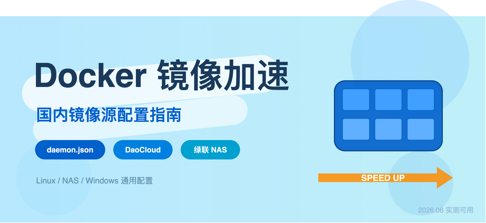
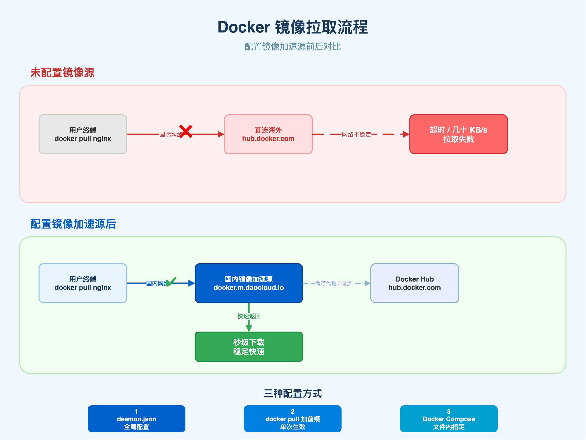
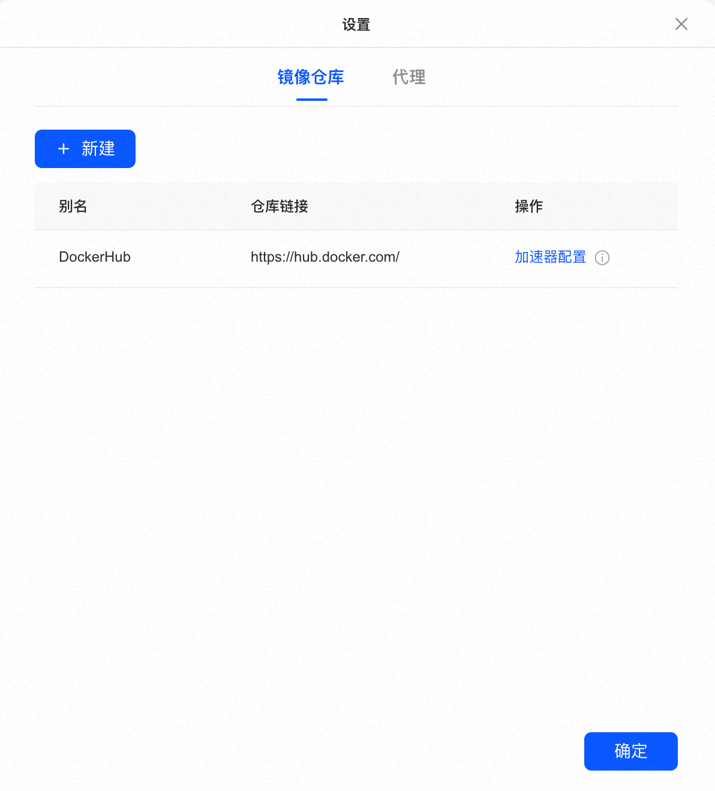
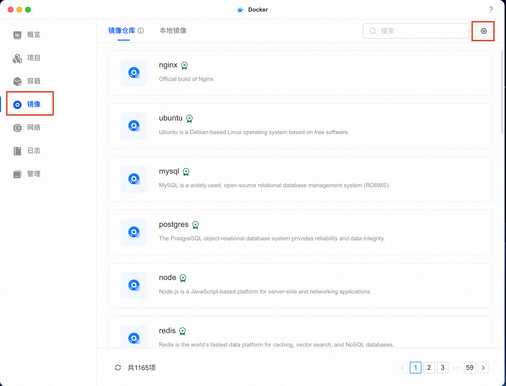
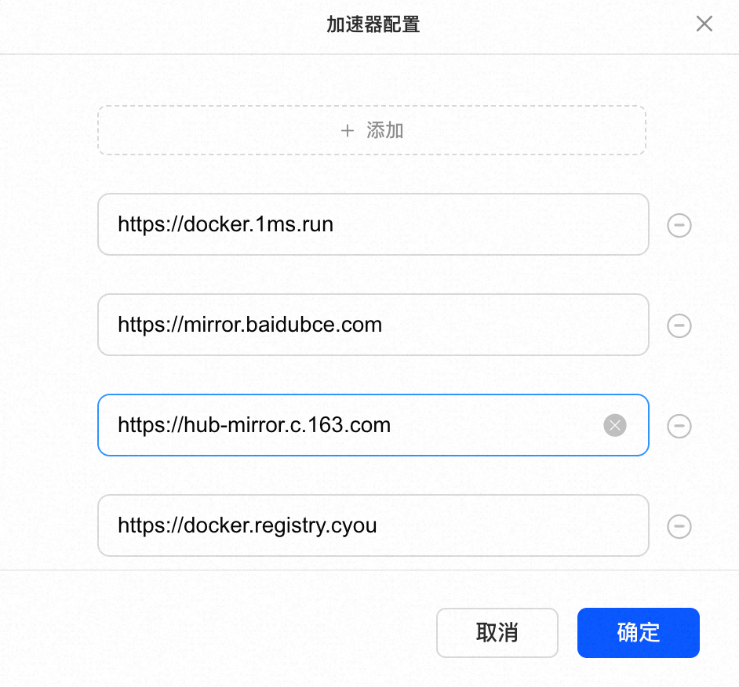

# 镜像拉了两小时？教你在 Docker 中配置国内镜像



Docker 拉镜像拉不动，十有八九是镜像源的问题。

Docker 默认从海外的 Docker Hub 拉镜像，国内直连要么慢到几十 KB/s，要么根本连不上。
最近几年开始，阿里云、网易、中科大等公共加速服务陆续关停或收窄，到现在情况仍然比较紧张。换成国内还能用的加速地址就好了。

### Docker 和镜像源

Docker 是一个容器工具，支持开发者把软件连同运行环境一起打包成「镜像」，拉下来就能运行，不用折腾依赖和配置。

Docker 中的这些镜像默认存在 Docker Hub（`hub.docker.com`），服务器在海外，国内访问不稳定，所以需要一个国内的「中转站」来中转下载，也就是镜像加速源。

无论是 Linux、Windows 或者 NAS 上的 Docker，都得先配好镜像源，如 NAS 装 Jellyfin、Alist、Home Assistant 等产品，都是拉 Docker 镜像实现部署。



### 目前可用的镜像源

镜像源变化快，去年能用的今年可能就关了，以下地址在 2026 年 6 月实测仍可用：

| 镜像源 | 加速地址 | 说明 |
|-------|---------|------|
| DaoCloud | `https://docker.m.daocloud.io` | 运营时间最长，支持 Docker Hub / GCR / GHCR / Quay 等多个仓库 |
| 1Panel 镜像站 | `https://docker.1panel.live` | 1Panel 面板团队维护 |
| Hub Proxy | `https://hub.rat.dev` | 速度不错，但稳定性看维护者心情 |
| 渡渡鸟同步站 | `https://docker.aityp.com` | 带镜像搜索功能，找特定版本方便 |


除了上述表格中的镜像地址，如果条件允许有海外 VPS 或 Cloudflare 账号的话，可以用 `CF-Workers-docker.io` 这个开源项目搭自己的代理，稳定性可以保障，但需要一定的动手能力。

如果不想折腾就默认使用 DaoCloud，覆盖的仓库最全，实际配置时可以填多个镜像地址做冗余，万一挂了一个 Docker 会自动尝试使用下一个。

### 配置方法一：改 daemon.json（全局生效，改一次就行）

这是 Docker 镜像配置的标准做法，配置完成之后所有 `docker pull` 命令都会走加速源。

打开本地命令行，或使用 SSH 登录到 NAS 或服务器的命令终端，执行：

```bash
sudo mkdir -p /etc/docker

sudo tee /etc/docker/daemon.json <<-'EOF'
{
  "registry-mirrors": [
    "https://docker.m.daocloud.io",
    "https://docker.1panel.live"
  ]
}
EOF

sudo systemctl daemon-reload
sudo systemctl restart docker
```
需要注意的点：
JSON 格式要求严格，少一个逗号或多一个逗号，Docker 服务会起不来。如果改完 Docker 挂了，先检查 `daemon.json` 的 JSON 语法

```bash
# 验证一下，执行完成能看到配置的地址就说明生效了。
docker info | grep -A 5 "Registry Mirrors"
```

## 配置方法二：拉取时加前缀（单次生效，每次使用时配置）

如果不想修改全局的配置文件，可以在每次拉取时在镜像名前面拼上加速源的域名：

```bash
# 默认拉取名命令
docker pull nginx:latest

# Docker Hub 官方镜像（注意要补 library/）
docker pull docker.m.daocloud.io/library/nginx:latest

# Docker Hub 第三方镜像
docker pull docker.m.daocloud.io/portainer/portainer-ce:latest

# GitHub Container Registry 的镜像
docker pull m.daocloud.io/ghcr.io/home-assistant/home-assistant:latest
```

注意点：
1. Docker Hub 的官方镜像（nginx、redis、mysql 这些），实际路径是 `library/nginx`，用加前缀方式时，`library/` 不能省，否则会报找不到。
2. 如果用的是方法一（daemon.json 全局配置），Docker 会自动补 `library/`。

### 配置方法三：Docker Compose 文件中指定镜像地址

有时候从网上看到一个好的 Docker 项目，拿到一个 `docker-compose.yml` 文件就想直接部署，却发现根本用不了，这个时候就可能是镜像地址访问不通，这时候把里面 `image:` 字段的镜像名换成带前缀的镜像源即可：

```yaml
services:
  jellyfin:
    # 原来写的: jellyfin/jellyfin:latest
    # 换成加速地址:
    image: docker.m.daocloud.io/jellyfin/jellyfin:latest
    container_name: jellyfin
    ports:
      - "8096:8096"
    volumes:
      - ./config:/config
      - /mnt/media:/media
    restart: unless-stopped
```

如果已经配置了 daemon.json 的话，Compose 文件使用时就不用改了，直接写原始镜像名，两者不冲突。

### 三种方法使用顺序
daemon.json 配置 > Docker Compose = docker pull

- daemon.json 配置后全局生效，一劳永逸，再也不怕镜像拉取不到了；
- Docker Compose 可以保留参数和配置，镜像迁移和分享可以直接复制执行；
- docker pull，使用最方便，快速部署镜像时推荐使用；


### 绿联 NAS 中 Docker 配置国内镜像源

绿联 UGOS 系统内置了 Docker 管理界面，不用命令行也能配，下面介绍一下在绿联 NAS 配置 Docker 镜像的方法。

#### UGOS 界面直接配（推荐）

1. 登录绿联 NAS 管理页面
2. 打开「Docker」应用（UGOS Pro 在应用中心找）

3. 进入「设置」，找到「镜像加速」或「Registry Mirror」

4. 填入加速地址，一行一个：

```
https://docker.m.daocloud.io
https://docker.1panel.live
```

5. 最后保存配置，Docker 服务会自动重启，重启后生效

配完之后回到「镜像」页面，搜索 `nginx` 试着拉取一下。正常情况几秒钟就开始下载，一两分钟拉完。

**踩坑提醒**：
1. 部分 UGOS 版本的 Docker 设置页面存在一个问题——填了加速地址保存后，Docker 服务没有真正重启，地址没生效。
2. 如果拉镜像还是卡住，可以手动重启一下 Docker 服务：进入「Docker」应用 → 右上角设置 → 「重启 Docker 服务」。

### SSH 改配置文件

如果对命令行操作更熟悉，也可以基于 SSH 连接完成配置，先在 UGOS 的「系统设置 → 终端管理」里开启 SSH，然后：

链接 NAS 终端：
```bash
ssh root@你的NAS-IP

vi /etc/docker/daemon.json
```

写入 Docker 镜像源配置：

```json
{
  "registry-mirrors": [
    "https://docker.m.daocloud.io",
    "https://docker.1panel.live"
  ]
}
```

保存退出，重启 Docker：

```bash
systemctl restart docker
```


### 拉镜像时直接用加速地址

如果嫌配置麻烦，绿联 NAS 也支持直接使用镜像地址拉取镜像，在绿联 Docker 应用的「拉取镜像」输入框中，直接填带前缀的完整地址：

- 想装 Jellyfin → 填 `docker.m.daocloud.io/jellyfin/jellyfin:latest`
- 想装 Alist → 填 `docker.m.daocloud.io/xhofe/alist:latest`
- 想装 Home Assistant → 填 `m.daocloud.io/ghcr.io/home-assistant/home-assistant:latest`


### 常见问题

1. **镜像加速地址格式**：`https://` 前缀不能漏，地址末尾不要加斜杠 `/`
2. **DNS 设置**：绿联 NAS 默认的运营商 DNS 有时候解析加速源域名会出问题，可以在网络设置里，把 DNS 改成 `223.5.5.5`（阿里公共 DNS）或 `119.29.29.29`（腾讯公共 DNS）
3. **daemon.json 语法**：如果使用 SSH 手动改过配置文件，需要检查 JSON 格式是否正确，否则多余的逗号等问题就会导致 Docker 服务起不来。可以用 `docker info` 命令验证——如果报错，大概率是配置文件格式问题
4. **加速源突然不能用了**：公共加速源没有服务保障，说关就关。daemon.json 里多填两个地址就行，挂了一个还有后备。DaoCloud 的 GitHub 仓库（`DaoCloud/public-image-mirror`）有服务状态公告，关注一下。
5. **拉到的镜像版本不是最新的**：加速源是缓存代理，DaoCloud 的 Manifest 缓存周期 1 小时，刚发布的 tag 可能还没同步过来，等一会儿或者临时直连 Docker Hub 拉。这种情况不常见，大多数人碰不到。
6. **安全性问题**：DaoCloud 的镜像 hash（sha256）与源仓库保持一致，没有篡改，来路不明的个人加速源没有这种保证，自己掂量。

### 最后

整体来讲，Docker 中镜像源地址的配置流程总共就三步：

1. **选 DaoCloud**（`docker.m.daocloud.io`），覆盖仓库最全，有公司在维护
2. **改 daemon.json 或 UGOS 界面填地址**，或者选择任意合适的方法进行使用
3. **拉个 nginx 验证**，几秒开始下载就算成功

本文镜像源地址最后验证时间：2026 年 6 月。
