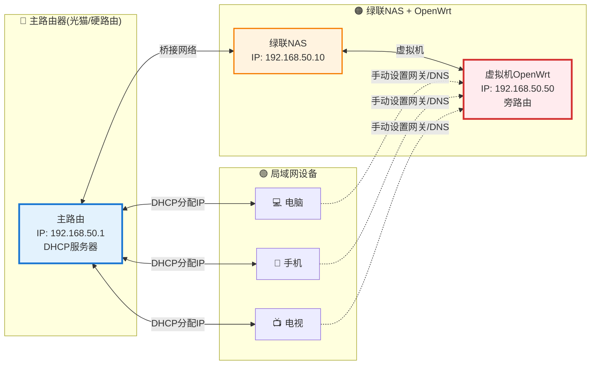
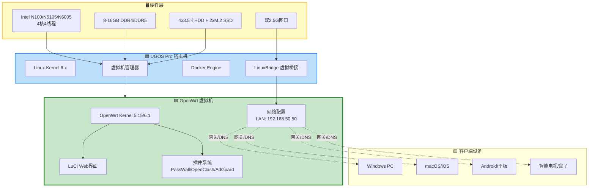
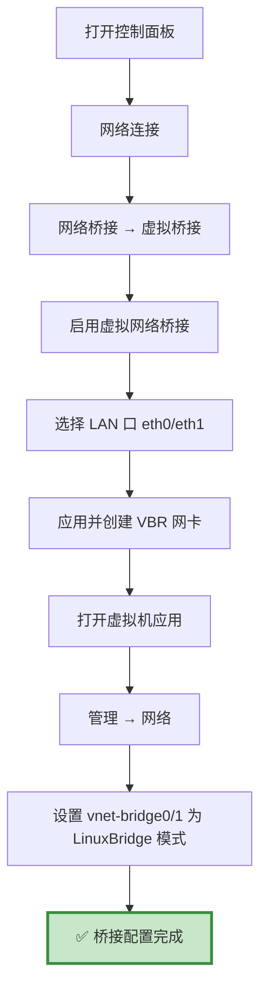
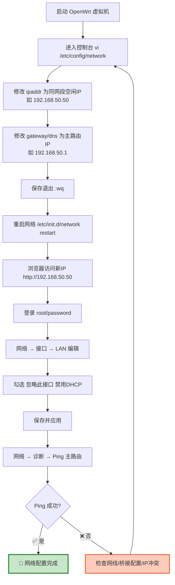

# 绿联NAS虚拟机安装OpenWrt完整指南

> **核心目标**:将绿联NAS从单纯的存储中心升级为家庭网络中枢,通过虚拟机部署OpenWrt实现旁路由功能,为全屋设备提供广告过滤、DNS优化等高级网络管理能力。

---

## 目录

- [1. OpenWrt 介绍](#1-openwrt-介绍)
- [2. OpenWrt 功能特性](#2-openwrt-功能特性)
- [3. 系统架构与网络拓扑](#3-系统架构与网络拓扑)
- [4. 前期准备](#4-前期准备)
- [5. OpenWrt 固件下载](#5-openwrt-固件下载)
- [6. 绿联 NAS 虚拟机配置](#6-绿联-nas-虚拟机配置)
- [7. 网络配置详解](#7-网络配置详解)
- [8. 镜像源优化与中文化](#8-镜像源优化与中文化)
- [9. OpenWrt 插件安装与配置](#9-openwrt-插件安装与配置)
- [10. 客户端设备配置](#10-客户端设备配置)
- [11. 网络验证与故障排查](#11-网络验证与故障排查)
- [12. 进阶玩法](#12-进阶玩法)
- [13. 常见问题 FAQ](#13-常见问题-faq)
- [14. 总结与建议](#14-总结与建议)
- [参考文档](#参考文档)

---

## 1. OpenWrt 介绍

### 1.1 什么是 OpenWrt?

**OpenWrt** 是一款高度模块化、可定制的开源路由器操作系统,最初专为嵌入式设备设计,现已广泛支持 x86_64 架构。它不仅仅是一个路由器固件,更是一个完整的 Linux 发行版,拥有强大的软件包管理系统和丰富的插件生态。

### 1.2 为什么选择 OpenWrt?

| 维度 | 传统路由器 | OpenWrt |
|------|-----------|---------|
| **可扩展性** | 固定功能,无法扩展 | 数百个插件可选,按需安装 |
| **自定义程度** | 厂商限定,封闭系统 | 完全开源,深度定制 |
| **社区支持** | 依赖厂商更新 | 活跃社区,持续迭代 |
| **硬件兼容性** | 仅支持特定型号 | 支持 x86/ARM/多种架构 |
| **学习曲线** | 简单易用 | 需要一定技术基础 |

### 1.3 OpenWrt vs iStoreOS

**iStoreOS** 是基于 OpenWrt 二次开发的易用型系统,主要区别如下:

| 特性 | OpenWrt (官方/第三方编译) | iStoreOS |
|------|--------------------------|----------|
| **界面风格** | 原生 LuCI,简洁专业 | 三套UI可选(极客/小白/NAS风格) |
| **插件生态** | 需手动安装,灵活度高 | 内置应用商店,一键安装 |
| **上手难度** | 中等,需命令行操作 | 低,图形化引导完善 |
| **Docker支持** | 需自行配置 | 开箱即用 |
| **适用人群** | 技术爱好者,追求纯净 | 新手用户,追求便捷 |

**推荐策略**:初学者建议从 iStoreOS 入手,熟悉后再迁移到纯 OpenWrt;进阶玩家可直接使用 Lean/OpenWrt.cc 等第三方编译固件。

---

## 2. OpenWrt 功能特性

### 2.1 核心功能

- **科学上网**:支持 PassWall、OpenClash、SSR Plus+ 等多种代理插件
- **广告过滤**:AdGuard Home、Adbyby Plus+ 拦截全网广告和跟踪程序
- **DNS优化**:SmartDNS、MosDNS 实现智能 DNS 解析,加速国内访问
- **流量控制**:QoS 智能限速,保障关键业务带宽
- **内网穿透**:Frp、ZeroTier、Tailscale 实现远程访问
- **智能家居**:Home Assistant 集成,统一管理 IoT 设备
- **文件共享**:Samba、WebDAV、FTP 多协议支持
- **VPN服务**:WireGuard、OpenVPN 搭建私人虚拟网络

### 2.2 旁路由模式优势

**旁路由(Side Router)** 是指 OpenWrt 不作为主网关,而是作为局域网内的一个普通设备存在,其他设备通过手动指定网关和 DNS 来使用其提供的服务。



**优势对比**:

| 部署方式 | 优点 | 缺点 |
|---------|------|------|
| **旁路由** | 不影响现有网络,可随时停用,风险低 | 需逐台设备手动配置网关 |
| **主路由** | 全屋自动生效,无需逐个配置 | 一旦故障全网断网,风险高 |
| **双WAN聚合** | 负载均衡,带宽叠加 | 需要多宽带接入,成本高 |

**结论**:对于家庭用户,**旁路由是最稳妥的选择**,既能享受 OpenWrt 的强大功能,又不会破坏现有网络稳定性。

---

## 3. 系统架构与网络拓扑

### 3.1 整体架构图



### 3.2 网络数据流向

当客户端设备访问互联网时,数据流向如下:

```
客户端(192.168.50.100) 
  → OpenWrt旁路由(192.168.50.50) [广告过滤/DNS优化/代理] 
  → 主路由器(192.168.50.1) [NAT转换] 
  → 光猫/ISP 
  → 互联网
```

**关键点**:
- OpenWrt **不接管 DHCP**,由主路由器继续分配 IP
- 客户端**手动指定**网关和 DNS 为 OpenWrt 的 IP
- OpenWrt 的网关和 DNS **指向主路由器**

---

## 4. 前期准备

### 4.1 硬件要求

| 组件 | 最低配置 | 推荐配置 | 说明 |
|------|---------|---------|------|
| **CPU** | Intel J4125/N4020 | Intel N100/N5105/N6005 | N100 四核性能足够运行多个虚拟机 |
| **内存** | 4GB | 8-16GB | OpenWrt 仅需 512MB,但需预留给其他服务 |
| **存储** | 10GB 可用空间 | M.2 SSD 50GB+ | 建议将虚拟机存放在 SSD 提升性能 |
| **网口** | 单千兆网口 | 双2.5G网口 | DXP 系列标配双2.5G,老款 DX 系列需确认 |

**适用机型**:
- ✅ **DXP 系列**:DXP2800、DXP4800、DXP4800 Plus、DXP6800 Pro(完美支持)
- ✅ **DX Plus 系列**:DX4600 Pro、DX4600(需升级到 UGOS Pro)
- ❌ **DH Plus 系列**:不支持虚拟机功能

### 4.2 软件准备

1. **UGOS Pro 系统**:确保已升级到最新版本(1.0.0.1281+)
2. **虚拟机应用**:在绿联云 APP 中安装"虚拟机"应用
3. **SSH 客户端**:FinalShell、PuTTY 或 macOS Terminal
4. **固件烧录工具**(可选):Rufus(用于制作U盘启动盘测试)

### 4.3 网络环境确认

在开始之前,请确认以下信息:

```bash
# 登录绿联NAS SSH,查看当前网络配置
ssh admin@192.168.50.10  # 替换为你的NAS IP

# 查看网卡名称和状态
ip link show

# 查看当前网段和网关
ip route show default

# 示例输出:
# default via 192.168.50.1 dev eth0  ← 主路由器网关
# 192.168.50.0/24 dev eth0 proto kernel scope link src 192.168.50.10
```

**记录以下信息**(后续配置会用到):
- 主路由器网关 IP:`192.168.50.1`
- NAS 所在网段:`192.168.50.0/24`
- NAS 使用的网卡:`eth0` 或 `eth1`
- 可用的空闲 IP 范围:`192.168.50.50-254`

---

## 5. OpenWrt 固件下载

### 5.1 固件来源对比

| 来源 | 特点 | 推荐指数 | 下载地址 |
|------|------|---------|---------|
| **OpenWrt 官方** | 纯净稳定,无预装插件 | ⭐⭐⭐ | [openwrt.org](https://downloads.openwrt.org/releases/) |
| **ImmortalWrt** | 针对中国优化,集成常用插件 | ⭐⭐⭐⭐ | [immortalwrt.org](https://github.com/immortalwrt/immortalwrt) |
| **Lean OpenWrt** | 国内最流行,插件丰富 | ⭐⭐⭐⭐⭐ | [coolsnowwolf/lede](https://github.com/coolsnowwolf/lede) |
| **iStoreOS** | 图形化友好,应用商店 | ⭐⭐⭐⭐⭐ | [fw.koolcenter.com](https://fw.koolcenter.com/iStoreOS/x86_64/) |
| **SuLingGG** | 精简稳定,适合旁路由 | ⭐⭐⭐⭐ | [openwrt.cc](https://openwrt.cc/releases/targets/x86/64/) |

### 5.2 推荐固件选择

#### 方案 A:iStoreOS(新手首选)

**优点**:
- 内置应用商店,插件一键安装
- 三套 UI 可选,界面友好
- Docker 开箱即用
- 中文支持完善

**下载步骤**:
1. 访问 [iStoreOS x86_64 固件下载页](https://fw.koolcenter.com/iStoreOS/x86_64_efi/?C=M&O=D)
2. 选择最新日期的 `istoreos-*-x86-64-squashfs-combined-efi.img.gz` 文件
3. 下载到本地后解压,得到 `.img` 文件

**默认信息**:
- 管理地址:`http://192.168.100.1`
- 用户名:`root`
- 密码:`password`

#### 方案 B:Lean OpenWrt(进阶玩家)

**优点**:
- 插件最全,社区支持好
- 性能优化到位,资源占用低
- 适合深度定制

**下载步骤**:
1. 访问 [OpenWrt.cc x86_64 发布页](https://openwrt.cc/releases/targets/x86/64/)
2. 选择 `combined-efi` 版本的 `.img.gz` 文件
3. 解压得到 `.img` 文件

**默认信息**:
- 管理地址:`http://192.168.1.1`
- 用户名:`root`
- 密码:`password`

#### 方案 C:官方纯净版(极简主义)

**优点**:
- 绝对纯净,无后门风险
- 体积最小(~10MB)
- 适合从零开始构建

**缺点**:
- 需手动安装所有插件
- 学习曲线陡峭

**下载步骤**:
1. 访问 [OpenWrt 官方下载页](https://downloads.openwrt.org/releases/)
2. 选择最新稳定版本 → `targets/x86/64/`
3. 下载 `openwrt-x86-64-generic-ext4-combined-efi.img.gz`

### 5.3 固件上传到 NAS

1. 打开绿联云 APP → **文件管理**
2. 新建共享文件夹,命名为 `OpenWrt_Firmware`
3. 点击 **上传** → 选择解压后的 `.img` 文件
4. 等待上传完成(通常 100-200MB,耗时 1-3 分钟)

---

## 6. 绿联 NAS 虚拟机配置

### 6.1 启用虚拟网络桥接

**这是最关键的一步**,必须正确配置才能让虚拟机获得独立 IP。

#### 步骤 1:进入网络桥接设置

1. 打开绿联云 APP → **控制面板** → **网络连接**
2. 点击 **网络桥接** → **虚拟桥接**
3. 勾选 **启用虚拟网络桥接**
4. 选择当前正在使用的 LAN 口(通常是 `eth0`)
5. 点击 **应用** → **继续** 创建虚拟桥接网卡

完成后,你会看到一个以 `VBR` 开头的虚拟桥接网卡。

#### 步骤 2:配置虚拟机网络子网

1. 打开 **虚拟机** 应用
2. 点击 **管理** → **网络**
3. 找到虚拟子网 `vnet-bridge0` 和 `vnet-bridge1`
4. 将模式改为 **桥接模式-LinuxBridge**
5. 点击 **保存**



### 6.2 创建 OpenWrt 虚拟机

#### 方法一:从磁盘镜像导入(推荐)

1. 打开 **虚拟机** 应用 → 点击 **新建**
2. 选择 **从磁盘镜像导入**
3. 点击 **手动上传** 或直接选择已上传的 `.img` 文件
4. 指定存储位置(建议选择 M.2 SSD 分区)
5. 系统会自动识别为 Linux 系统

**虚拟机参数配置**:

| 参数 | 推荐值 | 说明 |
|------|--------|------|
| **虚拟机名称** | OpenWrt_PassWall | 便于识别 |
| **CPU 核心数** | 2 核 | 旁路由 2 核足够,留余量给其他服务 |
| **内存** | 2GB (2048MB) | OpenWrt 实际只需 512MB,2GB 保证流畅 |
| **磁盘容量** | 自动(根据镜像) | 通常 500MB-2GB |
| **网络适配器** | Virtio | 性能最佳,兼容性好 |
| **网络连接** | vnet-bridge0 | 选择刚才配置的 LinuxBridge |
| **引导类型** | **BIOS** | ⚠️ 必须选 BIOS,UEFI 可能无法启动 |
| **自动开机** | ✅ 开启 | NAS 重启后自动启动 OpenWrt |
| **键盘语言** | 英文(默认) | 保持默认即可 |

6. 点击 **完成**,系统开始创建虚拟机实例
7. 等待格式转换完成(约 1-2 分钟)

#### 方法二:从 OVA 文件导入(适用于备份恢复)

如果你已有配置好的 OpenWrt OVA 备份:
1. 选择 **从 OVA 文件导入**
2. 选择 `.ova` 文件
3. 系统自动解析配置,无需手动设置参数

### 6.3 启动虚拟机

1. 在虚拟机列表中找到刚创建的 `OpenWrt_PassWall`
2. 点击 **电源控制** → **开机**
3. 等待 30-60 秒,状态变为 **运行中**
4. 点击 **···** → **从新页面连接** 打开控制台

**首次启动看到的内容**:
```
Press Enter to activate this console.

BusyBox v1.36.1 () built-in shell (ash)

 _______                     ________        __
 |       |.-----.-----.-----.|  |  |  |.----.|  |_
 |   -   ||  _  |  -__|     ||  |  |  ||   _||   _|
 |_______||   __|_____|__|__||________||__|  |____|
          |__| W I R E L E S S   F R E E D O M
 -----------------------------------------------------
 OpenWrt 23.05.3, r23809-2315f2a4d8
 -----------------------------------------------------
```

按 **Enter** 键激活控制台,看到 `root@OpenWrt:/#` 提示符即表示启动成功。

---

## 7. 网络配置详解

### 7.1 修改 OpenWrt LAN IP

OpenWrt 默认 IP 通常为 `192.168.1.1`,需要改为与主路由同网段的空闲 IP。

#### 步骤 1:通过控制台修改

在虚拟机控制台中输入:

```bash
# 编辑网络配置文件
vi /etc/config/network
```

**vi 编辑器基本操作**:
- 按 `i` 进入插入模式
- 移动光标到需要修改的位置
- 修改完成后按 `Esc` 退出插入模式
- 输入 `:wq` 保存并退出
- 输入 `:q!` 不保存退出

**找到以下内容并修改**:

```bash
config interface 'lan'
    option device 'br-lan'
    option proto 'static'
    option ipaddr '192.168.1.1'      # ← 改为你想要的 IP,如 192.168.50.50
    option netmask '255.255.255.0'
    option gateway '192.168.1.1'     # ← 改为主路由器网关,如 192.168.50.1
    option dns '192.168.1.1'         # ← 改为主路由器网关,如 192.168.50.1
```

**修改后示例**(假设你的网段是 `192.168.50.x`):

```bash
config interface 'lan'
    option device 'br-lan'
    option proto 'static'
    option ipaddr '192.168.50.50'    # OpenWrt 的新 IP
    option netmask '255.255.255.0'
    option gateway '192.168.50.1'    # 主路由器网关
    option dns '192.168.50.1'        # 主路由器 DNS
```

#### 步骤 2:重启网络服务

```bash
# 重启网络使配置生效
/etc/init.d/network restart

# 或者直接重启虚拟机
reboot
```

等待 30 秒后,在浏览器访问新 IP:`http://192.168.50.50`

**默认登录信息**:
- 用户名:`root`
- 密码:`password`

### 7.2 Web 界面配置

登录成功后,进行以下配置:

#### 步骤 1:禁用 DHCP 服务器

1. 进入 **网络** → **接口**
2. 找到 **LAN** 接口,点击 **编辑**
3. 向下滚动到 **DHCP 服务器** 标签
4. 勾选 **忽略此接口** (Disable DHCP for this interface)
5. 点击 **保存并应用**

**原因**:旁路由模式下,DHCP 应由主路由器负责,避免 IP 冲突。

#### 步骤 2:验证网络连通性

在 OpenWrt Web 界面:
1. 进入 **网络** → **诊断**
2. 点击 **Ping**
3. 输入主路由器 IP:`192.168.50.1`
4. 点击 **开始**

如果返回类似以下内容,说明网络正常:
```
PING 192.168.50.1 (192.168.50.1): 56 data bytes
64 bytes from 192.168.50.1: seq=0 ttl=64 time=1.234 ms
64 bytes from 192.168.50.1: seq=1 ttl=64 time=0.987 ms
```

再 Ping 一个外网地址测试:
```
PING 223.5.5.5 (223.5.5.5): 56 data bytes
64 bytes from 223.5.5.5: seq=0 ttl=118 time=12.345 ms
```

### 7.3 网络配置流程图



---

## 8. 镜像源优化与中文化

### 8.1 更换国内镜像源

由于国内网络环境,OpenWrt 默认的软件源(`downloads.openwrt.org`)访问缓慢甚至无法连接,需要更换为国内镜像。

#### 步骤 1:进入软件包配置

1. 登录 OpenWrt Web 界面
2. 进入 **系统** → **软件包**
3. 点击 **配置 opkg**

#### 步骤 2:修改镜像源地址

找到以下行:
```
src/gz openwrt_core https://downloads.openwrt.org/releases/23.05.3/targets/x86/64/packages
src/gz openwrt_base https://downloads.openwrt.org/releases/23.05.3/packages/x86_64/base
src/gz openwrt_luci https://downloads.openwrt.org/releases/23.05.3/packages/x86_64/luci
src/gz openwrt_packages https://downloads.openwrt.org/releases/23.05.3/packages/x86_64/packages
src/gz openwrt_routing https://downloads.openwrt.org/releases/23.05.3/packages/x86_64/routing
src/gz openwrt_telephony https://downloads.openwrt.org/releases/23.05.3/packages/x86_64/telephony
```

**替换为中科大镜像**(推荐):
```
src/gz openwrt_core https://mirrors.ustc.edu.cn/openwrt/releases/23.05.3/targets/x86/64/packages
src/gz openwrt_base https://mirrors.ustc.edu.cn/openwrt/releases/23.05.3/packages/x86_64/base
src/gz openwrt_luci https://mirrors.ustc.edu.cn/openwrt/releases/23.05.3/packages/x86_64/luci
src/gz openwrt_packages https://mirrors.ustc.edu.cn/openwrt/releases/23.05.3/packages/x86_64/packages
src/gz openwrt_routing https://mirrors.ustc.edu.cn/openwrt/releases/23.05.3/packages/x86_64/routing
src/gz openwrt_telephony https://mirrors.ustc.edu.cn/openwrt/releases/23.05.3/packages/x86_64/telephony
```

**其他可选镜像**:
- 清华大学:`https://mirrors.tuna.tsinghua.edu.cn/openwrt/`
- 阿里云:`https://mirrors.aliyun.com/openwrt/`
- 腾讯云:`https://mirrors.cloud.tencent.com/openwrt/`

#### 步骤 3:更新软件包列表

1. 点击 **保存**
2. 返回 **软件包** 主页
3. 点击 **更新列表**
4. 等待加载完成,看到软件包列表即表示成功

### 8.2 安装中文语言包

1. 在 **软件包** 搜索框输入:`luci-i18n-base-zh-cn`
2. 找到后点击 **安装**
3. 等待安装完成
4. 刷新浏览器页面,界面自动切换为中文

**可选中文插件**:
- `luci-i18n-firewall-zh-cn`:防火墙中文
- `luci-i18n-opkg-zh-cn`:软件包管理中文
- `luci-i18n-passwall-zh-cn`:PassWall 插件中文(如已安装)

### 8.3 常用优化设置

#### 关闭 IPv6(避免兼容性问题)

1. 进入 **网络** → **接口**
2. 点击 **全局网络选项**
3. 取消勾选 **启用 IPv6**
4. 删除 **IPv6 ULA 前缀**
5. 点击 **保存并应用**

**原因**:家庭网络多数未启用 IPv6,开启后可能导致 DNS 解析异常。

#### 设置时区

1. 进入 **系统** → **系统**
2. **时区** 选择:`Asia/Shanghai (UTC+08:00)`
3. **NTP 服务器** 添加:`cn.pool.ntp.org`
4. 点击 **保存并应用**

---

## 9. OpenWrt 插件安装与配置

### 9.1 PassWall(科学上网)

**PassWall** 是目前最流行的代理插件,支持多种协议(SS/SSR/V2Ray/Trojan/Hysteria2)。

#### 安装步骤

1. 进入 **系统** → **软件包**
2. 搜索 `luci-app-passwall`
3. 点击 **安装**(会自动安装依赖包)
4. 安装完成后,菜单中出现 **服务** → **PassWall**

#### 配置节点

1. 进入 **服务** → **PassWall** → **节点管理**
2. 点击 **添加**
3. 根据你的订阅类型选择协议类型:
   - **Shadowsocks**:填写服务器 IP、端口、密码、加密方式
   - **V2Ray**:填写 UUID、AlterID、传输协议(ws/tcp/kcp)
   - **Trojan**:填写密码、SNI
4. 点击 **保存**

#### 订阅管理(推荐)

如果有订阅链接:
1. 进入 **节点管理** → **订阅管理**
2. 点击 **添加订阅**
3. 填写订阅名称和 URL
4. 勾选 **自动更新**(建议每天更新)
5. 点击 **保存**
6. 返回节点列表,点击 **更新订阅**

#### 基本设置

1. 进入 **基本设置**
2. **TCP 节点**:选择延时最低的节点
3. **UDP 节点**:选择支持游戏的节点(如不玩游戏可不选)
4. **TCP 默认代理模式**:大陆白名单(推荐)
5. **UDP 默认代理模式**:游戏模式大陆白名单
6. **总开关**:开启
7. 点击 **保存并应用**

#### 测试连通性

1. 进入 **运行状态**
2. 点击 **Google 链接测试**
3. 显示 **可以访问** 即表示配置成功

### 9.2 AdGuard Home(广告过滤)

**AdGuard Home** 是一款强大的全网广告拦截 DNS 服务器。

#### 安装步骤

**方法一:通过软件包安装**(推荐)
1. 进入 **系统** → **软件包**
2. 搜索 `luci-app-adguardhome`
3. 点击 **安装**

**方法二:手动安装**(如软件包中没有)
1. 访问 [AdGuard Home GitHub](https://github.com/AdguardTeam/AdGuardHome)
2. 下载 `AdGuardHome_linux_amd64.tar.gz`
3. 通过 SCP 上传到 OpenWrt `/tmp` 目录
4. SSH 登录执行:
```bash
cd /tmp
tar -xzf AdGuardHome_linux_amd64.tar.gz
mv AdGuardHome /usr/bin/
chmod +x /usr/bin/AdGuardHome
```

#### 初始配置

1. 进入 **服务** → **AdGuard Home**
2. 点击 **启动**
3. 浏览器访问:`http://192.168.50.50:3000`
4. 按照向导设置:
   - **管理界面监听地址**:`0.0.0.0:3000`
   - **DNS 监听地址**:`0.0.0.0:53`
   - 设置管理员账号密码
5. 完成安装

#### 配置上游 DNS

1. 登录 AdGuard Home Web 界面
2. 进入 **设置** → **DNS 设置**
3. **上游 DNS 服务器** 填写:
   ```
   223.5.5.5        # 阿里 DNS
   119.29.29.29     # 腾讯 DNS
   114.114.114.114  # 114 DNS
   tls://dns.alidns.com  # 阿里 DoT
   ```
4. **Bootstrap DNS** 填写:`223.5.5.5`
5. 点击 **应用**

#### 配置过滤规则

1. 进入 **过滤器** → **DNS 封锁清单**
2. 点击 **添加封锁清单**
3. 添加以下规则源:
   - **AdGuard DNS filter**:`https://adguardteam.github.io/AdGuardSDNSFilter/Filters/filter.txt`
   - **EasyList China**:`https://easylist-downloads.adblockplus.org/easylistchina.txt`
   - **CJX's Annoyance List**:`https://raw.githubusercontent.com/cjx82630/cjx-list/master/cjx-annoyance.txt`
4. 点击 **应用**

#### 客户端使用

将设备的 DNS 设置为 OpenWrt IP:`192.168.50.50`,即可享受广告拦截。

### 9.3 SmartDNS(DNS 优化)

**SmartDNS** 通过并发查询多个 DNS 服务器,返回最快响应,显著提升国内网站访问速度。

#### 安装步骤

1. 进入 **系统** → **软件包**
2. 搜索 `luci-app-smartdns`
3. 点击 **安装**

#### 基础配置

1. 进入 **服务** → **SmartDNS**
2. **启用**:勾选
3. **监听端口**:`6053`(避免与 AdGuard Home 的 53 冲突)
4. **上游 DNS 组** 添加:
   - **国内组**:
     ```
     server 223.5.5.5
     server 119.29.29.29
     server 114.114.114.114
     ```
   - **国外组**:
     ```
     server 8.8.8.8
     server 1.1.1.1
     server 9.9.9.9
     ```
5. **域名分流规则**:
   - 国内域名走国内组
   - 国外域名走国外组
6. 点击 **保存并应用**

#### 配合 AdGuard Home 使用

在 AdGuard Home 中设置上游 DNS 为 SmartDNS:`127.0.0.1#6053`,实现:
- AdGuard Home 负责广告过滤
- SmartDNS 负责 DNS 加速

---

## 10. 客户端设备配置

要让设备使用 OpenWrt 的服务,需要手动修改网关和 DNS。以下是各平台的配置方法:

### 10.1 Windows

#### 方法一:图形界面设置

1. 打开 **设置** → **网络和 Internet** → **以太网/Wi-Fi**
2. 点击当前连接的网络 → **编辑**
3. **IP 分配** 改为 **手动**
4. 填写:
   - **IP 地址**:`192.168.50.100`(任意未占用 IP)
   - **子网掩码**:`255.255.255.0`
   - **网关**:`192.168.50.50`(OpenWrt IP)
   - **首选 DNS**:`192.168.50.50`
   - **备用 DNS**:`223.5.5.5`
5. 点击 **保存**

#### 方法二:命令行设置

以管理员身份运行 CMD:
```cmd
# 查看网络适配器名称
netsh interface ipv4 show interfaces

# 设置静态 IP(替换 "以太网" 为你的适配器名称)
netsh interface ipv4 set address name="以太网" static 192.168.50.100 255.255.255.0 192.168.50.50

# 设置 DNS
netsh interface ipv4 set dns name="以太网" static 192.168.50.50
```

#### 恢复 DHCP

如需恢复自动获取 IP:
```cmd
netsh interface ipv4 set address name="以太网" dhcp
netsh interface ipv4 set dns name="以太网" dhcp
```

### 10.2 macOS

1. 打开 **系统偏好设置** → **网络**
2. 选择当前连接的网络(Wi-Fi/以太网)
3. 点击 **高级** → **TCP/IP**
4. **配置 IPv4** 改为 **手动**
5. 填写:
   - **IP 地址**:`192.168.50.100`
   - **子网掩码**:`255.255.255.0`
   - **路由器**:`192.168.50.50`
6. 切换到 **DNS** 标签
7. 点击 **+** 添加:`192.168.50.50`
8. 点击 **好** → **应用**

### 10.3 iOS (iPhone/iPad)

1. 打开 **设置** → **无线局域网**
2. 点击当前 Wi-Fi 右侧的 **ⓘ**
3. 向下滚动找到 **配置 IP**
4. 改为 **手动**
5. 填写:
   - **IP 地址**:`192.168.50.100`
   - **子网掩码**:`255.255.255.0`
   - **路由器**:`192.168.50.50`
6. 向下滚动到 **配置 DNS**
7. 改为 **手动**
8. 删除现有 DNS,添加:`192.168.50.50`
9. 点击右上角 **存储**

### 10.4 Android

不同品牌手机路径略有差异,以下为通用步骤:

1. 打开 **设置** → **WLAN**
2. 长按当前连接的 Wi-Fi → **修改网络**
3. 展开 **高级选项**
4. **IP 设置** 改为 **静态**
5. 填写:
   - **IP 地址**:`192.168.50.100`
   - **网关**:`192.168.50.50`
   - **网络前缀长度**:`24`
   - **DNS 1**:`192.168.50.50`
   - **DNS 2**:`223.5.5.5`
6. 点击 **保存**

### 10.5 智能电视/电视盒子

以小米电视为例:

1. 打开 **设置** → **网络与安全** → **网络**
2. 选择当前 Wi-Fi → **修改网络**
3. **IP 设置** 改为 **静态**
4. 填写 IP、网关、DNS(同上)
5. 保存后重启电视

**注意**:部分电视不支持手动设置网关,可通过路由器 DHCP 静态绑定或修改路由器 DNS 为 OpenWrt IP 来间接实现。

### 10.6 批量配置技巧

如果家中设备较多,逐个配置太麻烦,可采用以下方案:

#### 方案 A:路由器 DHCP 推送(需主路由支持)

在主路由器中设置:
1. 进入 DHCP 服务器设置
2. 将 **默认网关** 和 **DNS 服务器** 改为 OpenWrt IP:`192.168.50.50`
3. 保存后,所有新接入设备自动使用 OpenWrt

**优点**:全屋自动生效
**缺点**:一旦 OpenWrt 故障,全屋断网

#### 方案 B:仅关键设备配置

只给以下设备手动配置:
- 主力电脑
- 手机
- 电视

其他设备保持 DHCP 自动获取,平衡便利性与稳定性。

---

## 11. 网络验证与故障排查

### 11.1 基础连通性测试

#### Ping 测试

在已配置网关的设备上:

```bash
# Windows
ping 192.168.50.50    # 测试能否到达 OpenWrt
ping 192.168.50.1     # 测试能否到达主路由
ping 223.5.5.5        # 测试外网连通性
ping www.baidu.com    # 测试 DNS 解析

# macOS/Linux
ping -c 4 192.168.50.50
ping -c 4 www.baidu.com
```

**预期结果**:
- Ping OpenWrt 和主路由:延迟 < 5ms,无丢包
- Ping 外网 IP:延迟 10-50ms,无丢包
- Ping 域名:能解析出 IP,说明 DNS 正常

#### DNS 解析测试

```bash
# Windows
nslookup www.baidu.com 192.168.50.50

# macOS/Linux
dig @192.168.50.50 www.baidu.com
```

应返回百度服务器的 IP 地址。

### 11.2 常见问题排查

#### 问题 1:无法访问 OpenWrt Web 界面

**可能原因**:
- IP 地址错误
- 防火墙阻止
- 虚拟机未启动

**解决方法**:
```bash
# 在 NAS SSH 中检查虚拟机状态
virsh list

# 检查 OpenWrt 是否在线
ping 192.168.50.50

# 检查防火墙规则
iptables -L -n | grep 80
```

#### 问题 2:Ping 不通主路由器

**可能原因**:
- 桥接配置错误
- 网卡混杂模式未开启
- IP 不在同一网段

**解决方法**:
1. 确认虚拟子网模式为 **LinuxBridge**
2. SSH 登录 NAS,执行:
   ```bash
   sudo ip link set eth0 promisc on
   ```
3. 检查 OpenWrt 和主路由是否在同一网段

#### 问题 3:能 Ping 通但无法上网

**可能原因**:
- OpenWrt 网关/DNS 配置错误
- PassWall 等插件未正确配置
- 防火墙阻止转发

**解决方法**:
1. 检查 OpenWrt 的网关是否指向主路由
2. 暂时关闭 PassWall,测试是否能正常上网
3. 检查 **网络** → **防火墙** → **转发** 是否为 **接受**

#### 问题 4:DNS 解析失败

**可能原因**:
- DNS 服务器不可达
- AdGuard Home 配置错误
- SmartDNS 端口冲突

**解决方法**:
1. 临时将客户端 DNS 改为 `223.5.5.5` 测试
2. 检查 AdGuard Home 上游 DNS 是否可达
3. 确认 SmartDNS 监听端口未被占用

#### 问题 5:虚拟机开机自启失败

**可能原因**:
- 自动开机未勾选
- 存储位置权限不足

**解决方法**:
1. 编辑虚拟机,勾选 **自动开机**
2. 确认虚拟机存储在可访问的分区

### 11.3 性能监控

#### CPU/内存占用

在 OpenWrt Web 界面:
1. 进入 **状态** → **概览**
2. 查看 CPU 和内存使用情况

**正常范围**:
- CPU:< 30%(空闲时)
- 内存:< 50%

如占用过高,检查是否有异常进程:
```bash
top
```

#### 网络流量监控

1. 进入 **状态** → **实时信息** → **接口**
2. 查看 LAN/WAN 口的实时流量

如发现异常流量,可能是:
- 后台下载任务
- 被入侵挖矿
- 插件配置错误

---

## 12. 进阶玩法

### 12.1 Home Assistant 集成

将 OpenWrt 作为智能家居中枢:

1. 安装 Docker(如使用 iStoreOS 已内置)
2. 拉取 Home Assistant 镜像:
   ```bash
   docker pull homeassistant/home-assistant:latest
   ```
3. 运行容器:
   ```bash
   docker run -d \
     --name homeassistant \
     --restart unless-stopped \
     --network host \
     homeassistant/home-assistant:latest
   ```
4. 访问:`http://192.168.50.50:8123`

### 12.2 内网穿透(Frp)

实现远程访问 NAS 和 OpenWrt:

1. 准备一台有公网 IP 的 VPS
2. 在 VPS 上部署 Frp 服务端
3. 在 OpenWrt 上安装 `luci-app-frpc`
4. 配置 Frpc 客户端,映射 SSH(22)、Web(80/443) 等端口
5. 通过域名远程访问

### 12.3 ZeroTier/Tailscale 组网

无需公网 IP 的异地组网方案:

1. 注册 [ZeroTier](https://www.zerotier.com/) 或 [Tailscale](https://tailscale.com/)
2. 在 OpenWrt 安装对应插件
3. 加入网络,获取虚拟 IP
4. 在其他设备也安装客户端并加入同一网络
5. 通过虚拟 IP 直接访问,如同局域网

### 12.4 定时备份配置

防止配置丢失:

1. 进入 **系统** → **备份/升级**
2. 点击 **生成备份**
3. 下载 `backup-*.tar.gz` 文件
4. 保存到 NAS 共享文件夹
5. 设置 cron 定时任务自动备份:
   ```bash
   # 每天凌晨 3 点备份
   0 3 * * * sysupgrade -b /mnt/sda1/backups/openwrt-backup-$(date +%Y%m%d).tar.gz
   ```

---

## 13. 常见问题 FAQ

### Q1:哪些绿联 NAS 型号支持虚拟机?

**A**: 
- ✅ DXP 系列:DXP2800、DXP4800、DXP4800 Plus、DXP6800 Pro
- ✅ DX Plus 系列:DX4600 Pro、DX4600(需升级到 UGOS Pro)
- ❌ DH Plus 系列:不支持

### Q2:OpenWrt 和 iStoreOS 选哪个?

**A**:
- **新手**:选 iStoreOS,有应用商店,界面友好
- **进阶**:选 Lean/OpenWrt.cc,插件全,性能优
- **极简**:选官方纯净版,自己从零搭建

### Q3:如何开启网卡混杂模式?

**A**:
SSH 登录 NAS,执行:
```bash
sudo ip link set eth0 promisc on  # eth0 替换为实际使用的网口
```

### Q4:虚拟机无法启动怎么办?

**A**:
1. 检查引导类型是否为 **BIOS**(非 UEFI)
2. 检查镜像文件是否损坏
3. 查看虚拟机日志排查错误

### Q5:虚拟机有网络但无法上网?

**A**:
1. 检查 OpenWrt 网关是否指向主路由
2. 检查防火墙转发规则
3. 暂时关闭代理插件测试

### Q6:如何备份和还原 OpenWrt 配置?

**A**:
- **备份**:系统 → 备份/升级 → 生成备份
- **还原**:上传备份文件 → 恢复配置

### Q7:OpenWrt 占用多少资源?

**A**:
- CPU:空闲时 < 5%,满载时 < 30%
- 内存:512MB 足够,2GB 更流畅
- 存储:1-2GB

### Q8:能否同时运行多个虚拟机?

**A**:
可以,但需注意:
- N100 处理器建议不超过 3-4 个虚拟机
- 每个虚拟机预留 2GB 内存
- 优先将常用虚拟机放在 SSD

### Q9:如何优化 OpenWrt 性能?

**A**:
1. 关闭不必要的插件
2. 禁用 IPv6
3. 使用 Virtio 网卡驱动
4. 定期清理日志
5. 更换轻量级主题

### Q10:旁路由模式下,不开启代理的设备能否正常上网?

**A**:
可以。旁路由模式下,DHCP 仍由主路由器负责,未手动修改网关的设备会直接使用主路由上网,不受 OpenWrt 影响。

---

## 14. 总结与建议

### 14.1 核心要点回顾

1. **旁路由是最稳妥的方案**,不影响现有网络稳定性
2. **LinuxBridge 桥接**是 UGOS Pro 新版推荐的网络配置方式
3. **iStoreOS 适合新手**,Lean/OpenWrt.cc 适合进阶玩家
4. **禁用 DHCP** 是旁路由模式的关键配置
5. **更换国内镜像源** 能大幅提升插件安装速度

### 14.2 最佳实践建议

#### 对于新手用户

1. 从 iStoreOS 开始,熟悉基本操作
2. 先配置好网络连通性,再逐步安装插件
3. 每次重大变更前备份配置
4. 遇到问题先查日志,再搜索社区

#### 对于进阶玩家

1. 尝试自行编译固件,定制专属功能
2. 结合 Docker 部署更多服务(Home Assistant、Jellyfin 等)
3. 研究 QoS 流量控制,优化家庭网络体验
4. 参与开源社区,贡献代码或文档

### 14.3 未来展望

随着绿联 UGOS Pro 系统的持续迭代,虚拟机功能将更加完善:
- 更好的硬件直通支持
- 更丰富的虚拟机模板
- 更智能的资源调度
- 更便捷的备份恢复机制

OpenWrt 作为软路由领域的标杆,也将持续演进:
- 更强的性能优化
- 更丰富的插件生态
- 更好的多核支持
- 更友好的用户体验

**All in One** 不仅是技术的堆砌,更是对生活品质的追求。希望本指南能帮助你充分发挥绿联 NAS 的潜力,打造属于自己的智能家庭网络中枢。

---

## 参考文档

### 官方文档

1. [OpenWrt 官方网站](https://openwrt.org/)
2. [OpenWrt 固件下载](https://downloads.openwrt.org/releases/)
3. [iStoreOS 固件下载](https://fw.koolcenter.com/iStoreOS/x86_64/)
4. [绿联 UGOS Pro 官方教程](https://www.ugnas.com/tutorial-detail/id-59.html)

### 社区教程

5. [绿联NAS安装OpenWRT并设置为旁路网关 - 什么值得买](https://post.smzdm.com/p/a50qx698/)
6. [彻底解锁新世界,绿联NAS搭建OpenWRT旁路由 - 什么值得买](https://post.smzdm.com/p/an9qoep0/)
7. [绿联NAS一机实现影音+NAS+OpenWRT+虚拟机!UGOS Pro更新后更好用了 - 知乎](https://zhuanlan.zhihu.com/p/719325898)
8. [UGOS-Pro虚拟机和宿主机网络直通 - impressionyang的个人博客](https://blog.impressionyang.top/archives/ugos_pro_virtualnet_direct_link_with_host)
9. [NAS通过docker部署openwrt旁路由并实现和宿主机通信 - 知乎](https://zhuanlan.zhihu.com/p/721914679)

### 固件编译源码

10. [Lean OpenWrt 源码](https://github.com/coolsnowwolf/lede)
11. [ImmortalWrt 源码](https://github.com/immortalwrt/immortalwrt)
12. [SuLingGG OpenWrt 发布页](https://openwrt.cc/releases/targets/x86/64/)

### 插件项目

13. [PassWall GitHub](https://github.com/xiaorou2/openwrt-passwall)
14. [AdGuard Home GitHub](https://github.com/AdguardTeam/AdGuardHome)
15. [SmartDNS GitHub](https://github.com/pymumu/smartdns)

### 相关工具

16. [FinalShell SSH 客户端](https://www.hostbuf.com/)
17. [Rufus U盘启动盘制作工具](https://rufus.ie/)
18. [StarWind V2V 镜像转换工具](https://www.starwindsoftware.com/starwind-v2v-converter/)
