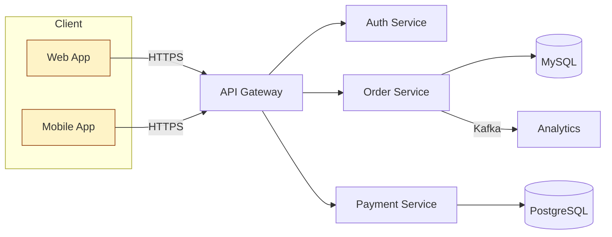

## 一、Excalidraw 介绍

**Excalidraw 是一款开源的虚拟手绘风格白板**，由 [@vjeux](https://github.com/vjeux)、[@dwelle](https://github.com/dwelle) 等人于 2019 年创立，定位非常清晰：

> An open source virtual hand-drawn style whiteboard. Collaborative and end-to-end encrypted.

它最大的辨识度来自那种"故意画得歪歪扭扭"的草图风格——线条像用马克笔在白纸上手画出来的，刻意保留 1～2 像素的随机抖动。这种设计语言并不是为了好看，而是为了传递一种心理暗示：**"这只是草稿，欢迎讨论、随时修改"**，因此特别适合 RFC、技术博客、教学板书、产品早期评审等场景。

到 2026 年，Excalidraw 已经积累了 **126k+ GitHub Star、14.1k Fork、126 个发布版本**，被 Google Cloud、Meta、CodeSandbox、Notion、Replit、HackerRank、Obsidian 等头部产品深度集成，是目前社区生态最完整的开源白板工具之一。它的商业化产品 [Excalidraw+](https://plus.excalidraw.com/) 提供团队协作、企业 SSO、AI 转图等增值能力，但所有核心绘图能力 100% 在 MIT 协议下开源。

简单概括它的几个关键基因：

- **手绘风格 + Roughjs 引擎**：底层借助 [rough.js](https://github.com/rough-stuff/rough) 渲染粗糙线条，是其美学根本。
- **本地优先**：浏览器打开 https://excalidraw.com 即可使用，画布默认存在浏览器 IndexedDB 里，无需登录。
- **端到端加密协作**：协作链接里的房间密钥保存在 URL hash 中，服务端只转发密文，连开发者也看不到内容。
- **开放文件格式**：`.excalidraw` 就是一份人类可读的 JSON，可以无损迁移，也可以脚本批量生成。
- **可嵌入、可二次开发**：发布了 `@excalidraw/excalidraw` React 组件包，任何 Web 应用都能用几十行代码集成一个完整白板。

---

## 二、Excalidraw 功能特性

Excalidraw 的功能可以拆成"编辑器内核"和"excalidraw.com 应用层"两部分。前者是开源 npm 包提供的纯绘图能力，后者是官方网站在内核之上额外封装的协作和持久化层。

### 2.1 编辑器内核（@excalidraw/excalidraw 提供）

| 维度 | 能力 |
|---|---|
| 画布 | 无限缩放（10%–3000%），无限平移，支持网格、捕捉、Zen 模式 |
| 工具 | 选择 / 矩形 / 菱形 / 圆形 / 箭头 / 直线 / 自由画笔 / 文字 / 图片 / 框（Frame）/ 橡皮 / 激光笔 / 嵌入网页 |
| 样式 | 描边色、填充色、填充样式（实心/斜线/十字）、笔触粗细、笔触风格（直/虚线/点划）、圆角、不透明度、字体、字号、文本对齐 |
| 元素操作 | 多选、组（Ctrl+G）、对齐分布、置顶置底、锁定、克隆样式、批量调整、链接到笔记 |
| 文本 | 框内自适应换行、绑定到形状（变成"带文字的图形"）、Markdown 风格快速排版、富文本字体（Virgil / Cascadia / Helvetica） |
| 箭头 | 端点绑定（拖动元素时箭头跟着走）、带标签箭头、支持折线/曲线、自动避让 |
| 撤销/重做 | 完整历史栈，跨 Tab 保留 |
| 主题 | 浅色 / 深色，导出可独立配置 |
| 国际化 | 80+ 语言，包括简体中文、繁体中文 |
| 导入导出 | PNG / SVG / Clipboard / `.excalidraw` JSON，支持把场景嵌入 PNG 元数据，方便二次编辑 |
| 元素库 | Library 系统 + 官方共享站 https://libraries.excalidraw.com/ |
| 嵌入 | 支持 YouTube、Excalidraw、Figma 等可信源 iframe 元素 |
| 数学 | LaTeX 文本（通过 mermaid 流程图扩展或自定义脚本） |

### 2.2 excalidraw.com 应用层

- **PWA 离线可用**：第一次打开后断网仍可绘图。
- **本地存储**：自动写 IndexedDB，刷新不丢。
- **实时协作**：基于 WebSocket，最多支持几十人同时画，光标和选区实时同步。
- **端到端加密**：URL 中 `#room=xxxx,secretKey` 把房间密钥放在 hash 段，永不发到服务器；后端只转发加密二进制。
- **只读分享链接**：一键生成"可看不可改"的快照链接。
- **Mermaid 转 Excalidraw**：内置入口，把 mermaid 文本直接转成手绘流程图。
- **AI 助手（Excalidraw+ 提供，需登录）**：自然语言转图、图转代码。
- **形状识别**：手画一个圈或方块自动吸附为圆形或矩形（实验性 Pen Mode）。

> **为什么这些特性组合起来很重要**：它把"白板的简单 / 草图的随性 / 工程师的可控"三者合并到一个 80KB 级别的浏览器应用里，既能离线自用，也能多人协作，还能塞进自己的产品。这是 Figma、Miro 这类闭源 SaaS 难以平替的一点。

---

## 三、Excalidraw 应用场景

实际把 Excalidraw 用顺手以后，会发现它远不止"画流程图"这么简单。下面列出几个高频且效果好的场景。

**1. 系统架构与流程示意（最高频场景）**
画微服务、Kafka pipeline、CI/CD 流水线、网络拓扑这种"非定稿"图最合适。手绘风格在 RFC、Design Doc、博客中能瞬间传达"我们在讨论方案，不是给你看交付件"的语义。

**2. 教学板书与录屏讲解**
freeCodeCamp、CS50 等大量教学频道用 Excalidraw 当电子白板：左手写代码、右手 Excalidraw 画结构。不需要切到 PPT，激光笔模式可以直接做远程演讲指引。

**3. 头脑风暴与读书笔记**
配合 Obsidian Excalidraw 插件，可以在画布上嵌入 Markdown 笔记块，写完笔记直接画概念图，做"图文一体"的第二大脑。这是本仓库的主流玩法。

**4. 产品 Wireframe / 用户旅程图**
作为低保真原型工具，比 Figma 更轻、比 Whimsical 更灵活，适合 PRD 早期或在客户面前现场演示流程。

**5. 思维导图 / 知识地图**
有了 mermaid `mindmap` + mermaid-to-excalidraw 之后，可以快速从文字大纲生成可手动调整的导图，避免一上来就陷入"调整对齐"的细节。

**6. PDF 标注与论文阅读**
在 Obsidian Excalidraw 里 `Import PDF` → `Annotate PDF`，可以把论文每页插进画布做圈点、批注、连线，最终导出注解版。

**7. 写技术博客插图**
我自己最常用的场景：博客一图胜千言，手绘风格不会让读者纠结于"这个 UI 是不是真的会这样"。

**8. 工程师的便签 / Scratch**
临时算个时序、推个公式、画个数据结构都可以。打开 https://excalidraw.com 就开画，关掉浏览器内容仍在。

> 一个实践建议：**把 Excalidraw 当 Obsidian 的二级工具，而不是独立工具**。当一份草图本身就是 Markdown 笔记的一部分时，它的价值才能最大化。

---

## 四、Excalidraw Web 功能使用介绍

下面以官网 https://excalidraw.com 为蓝本，按"绘制 → 保存 → 导入 → 共享 → 协作"五个动作来过一遍核心操作。

### 4.1 绘制

打开网址即进入空白画布，UI 由四块组成：

```
┌─────────────────────────────────────────────────────────┐
│ 顶部菜单（汉堡菜单）   |   工具栏（中央） |   分享 / 形状库 │
├──┬──────────────────────────────────────────────────────┤
│ 属│                                                       │
│ 性│                  无限画布                             │
│ 面│                                                       │
│ 板│                                                       │
└──┴───────────────────────────────────────┬─────────┬─────┘
                                            │ 缩放    │ ?   │
                                            └─────────┴─────┘
```

常用流程是「按 V 切到选择 → R 画矩形 → A 拉箭头连接 → T 加文字 → 双击空白处直接进入文本输入」。这里给出最高频的快捷键速查（macOS 把 Ctrl 换成 Cmd）：

| 操作 | 快捷键 |
|---|---|
| 选择工具 | `V` 或 `1` |
| 矩形 / 菱形 / 椭圆 / 箭头 / 直线 / 文本 / 橡皮 / 自由画笔 | `R / D / O / A / L / T / E / X` |
| 撤销 / 重做 | `Ctrl+Z` / `Ctrl+Shift+Z` |
| 复制样式 / 粘贴样式 | `Alt+Ctrl+C` / `Alt+Ctrl+V` |
| 群组 / 解组 | `Ctrl+G` / `Ctrl+Shift+G` |
| 上移 / 下移 / 置顶 / 置底 | `Ctrl+]` `Ctrl+[` `Ctrl+Shift+]` `Ctrl+Shift+[` |
| 锁定 / 解锁 | `Ctrl+Shift+L` |
| 全选 | `Ctrl+A` |
| 缩放 | `Ctrl++` / `Ctrl+-` / `Ctrl+0` |
| 显示网格 | `Ctrl+'` |
| 命令面板（搜索功能） | `Ctrl+/` |
| 帮助 / 全部快捷键 | `?` |

几个容易被忽略但极其提效的小技巧：

1. **按住 Shift 拖拽** = 等比例缩放或水平/垂直方向移动，画对称图形必备。
2. **按住 Alt 拖拽** = 复制元素，比 `Ctrl+C/V` 快十倍。
3. **双击线段中点**可以新增锚点，把直线变成折线/曲线。
4. **箭头头/尾拖到形状上时**会出现高亮蓝框，松手即"绑定"。绑定后移动形状，箭头自动跟随。这是 Excalidraw 区别于其它工具的核心体验之一。
5. **复制图片或粘贴 SVG** 直接进画布，不用走文件对话框。
6. **粘贴一段 Markdown 表格**会被自动识别成表格元素。
7. **手写公式**：在文本里写 `$$E=mc^2$$` 暂未原生支持 LaTeX，可通过脚本扩展或用 mermaid 数学块。

### 4.2 保存

Excalidraw 默认采用 **本地优先（local-first）** 策略：

- 一边画一边自动写入浏览器 IndexedDB，关掉标签页再打开仍在。
- 主菜单 → `Save to...` 可手动导出 `.excalidraw` 文件到本地。
- 主菜单 → `Save as image` 可导出 PNG / SVG，并可勾选"Embed scene"——这是一个非常巧妙的设计：导出的 PNG 图片本身就是带场景元数据的，下次再把这张 PNG 拖回 Excalidraw，可以**继续编辑**。
- 通过浏览器 `File System Access API`（仅 Chromium 系），可以一次绑定本地文件，之后保存就直接落到磁盘。

### 4.3 导入

Excalidraw 支持的导入方式比想象中多：

1. **拖拽 / 粘贴 `.excalidraw` JSON** → 替换或合并当前场景
2. **拖拽 PNG / JPG / SVG / GIF / WebP** → 作为图片元素
3. **拖拽带 scene 的 PNG/SVG** → 等价于继续编辑该场景
4. **拖拽 Mermaid 文本片段**（或菜单中 `Mermaid to Excalidraw`） → 转成可编辑的手绘流程图
5. **粘贴 URL** → 自动识别 YouTube / Figma / Excalidraw 等可信源，转为 iframe 元素
6. **粘贴一段 Markdown 表格** → 自动转换为表格

### 4.4 共享

「Share」按钮提供两类分享：

- **Live collaboration**：开启实时协作房间，生成形如 `https://excalidraw.com/#room=AAAA,SECRET` 的链接。AAAA 是房间号，SECRET 是端到端加密密钥，**永远不发送到服务器**，因此服务器无法看到画布内容。
- **Shareable read-only link**：把当前场景上传到官方临时存储桶，生成只读快照链接，链接里同样带加密密钥。

如果你担心「再开放公司内部画布到 excalidraw.com 服务器」的合规问题，请直接看 §8 自部署。

### 4.5 协作

启动协作后，画布右上角会显示当前在线成员头像，每个人的鼠标光标 + 选中元素都会实时同步，并带上自己的名字。协作的几个关键体验：

- **CRDT-like 合并**：两个人同时画不会互相覆盖，最坏情况是出现两个相邻元素。
- **跟随模式（Follow mode）**：点击成员头像可以"跟随"对方的视角，远程演示时尤其好用。
- **Stay focused**：协作中按 `Z` 进入 Zen 模式，把所有 UI 隐藏只剩画布，干净到可以直接录课。
- **激光笔 `K`**：演讲时光标短暂留下激光轨迹，30 秒后自动消失。
- **会话结束自动清理**：所有人都离开房间后，服务器侧密文也会过期清掉。

> 协作是 Excalidraw 区别于 drawio 等工具最重要的一点。但要注意：**官方 excalidraw.com 的协作走的是官方 WebSocket 服务器**，自托管时需要额外部署 `excalidraw-room`（见 §8.4）。

---

## 五、Excalidraw 文件格式和结构

`.excalidraw` 文件本质就是一份 JSON，结构非常简洁，这是它能被脚本生成、被 Mermaid 转换、被各种笔记软件预览的根本原因。

### 5.1 顶层结构

```json
{
  "type": "excalidraw",
  "version": 2,
  "source": "https://excalidraw.com",
  "elements": [ /* 元素数组 */ ],
  "appState": { /* 编辑器状态 */ },
  "files": { /* 图片二进制等附件 */ }
}
```

| 字段 | 含义 |
|---|---|
| `type` | 固定为 `"excalidraw"`；剪贴板格式为 `"excalidraw/clipboard"` |
| `version` | schema 版本号（当前为 2） |
| `source` | 生成应用 URL，可通过 `window.EXCALIDRAW_EXPORT_SOURCE` 覆盖（自部署时常改成自己的域名） |
| `elements` | 画布上每一个图形元素 |
| `appState` | 视图状态：背景色、网格大小、是否暗黑、滚动偏移等，加载时不强制还原全部字段 |
| `files` | `image` 元素引用的二进制数据，结构为 `{ [fileId]: fileData }`，通常是 base64 dataURL |

### 5.2 元素（Element）通用字段

所有元素都继承一组通用属性，例如：

```json
{
  "id": "pologsyG-tAraPgiN9xP9b",
  "type": "rectangle",
  "x": 928, "y": 319,
  "width": 134, "height": 90,
  "angle": 0,
  "strokeColor": "#1e1e1e",
  "backgroundColor": "transparent",
  "fillStyle": "solid",
  "strokeWidth": 2,
  "strokeStyle": "solid",
  "roughness": 1,
  "opacity": 100,
  "groupIds": [],
  "frameId": null,
  "roundness": { "type": 3 },
  "seed": 1234567,
  "version": 12,
  "versionNonce": 0,
  "isDeleted": false,
  "boundElements": null,
  "updated": 1700000000,
  "link": null,
  "locked": false
}
```

`type` 字段决定子类型，常见取值：

`rectangle / diamond / ellipse / arrow / line / freedraw / text / image / frame / iframe / embeddable / magicframe`

不同子类型有自己的特殊字段，例如：

- `text`：`text / fontSize / fontFamily / textAlign / verticalAlign / containerId / originalText`
- `arrow / line`：`points / startBinding / endBinding / startArrowhead / endArrowhead`
- `freedraw`：`points / pressures / simulatePressure / lastCommittedPoint`
- `image`：`fileId / scale / status`

### 5.3 文件（files）结构

`image` 元素只在 `elements` 里写一个 `fileId`，真正的二进制放在顶层 `files` 字段：

```json
"files": {
  "3cebd7720911620a3938ce77243696149da03861": {
    "id": "3cebd7720911620a3938ce77243696149da03861",
    "mimeType": "image/png",
    "dataURL": "data:image/png;base64,iVBORw0KGgoAAAANSUhEUgA=...",
    "created": 1690295874454,
    "lastRetrieved": 1690295874454
  }
}
```

这样设计的好处：去重（同一图片被多次插入只存一份）、可单独缓存、外部脚本可以直接生成 dataURL 注入。

### 5.4 剪贴板格式

复制时写到剪贴板的 JSON 是简化版，仅保留：

```json
{
  "type": "excalidraw/clipboard",
  "elements": [...],
  "files": { ... }
}
```

去掉了 `version / source / appState`，目的是和当前画布无缝合并。

### 5.5 Obsidian / Markdown 兼容存储

Obsidian Excalidraw 插件默认把草图存成 `.excalidraw.md` 文件，内部其实是这样的结构（节选）：

```
---
excalidraw-plugin: parsed
tags: [excalidraw]
---

==⚠ Switch to EXCALIDRAW VIEW... ⚠==

# Text Elements
节点 A ^abc123
节点 B ^def456

# Embedded files
abc123: [[image.png]]

# Drawing
//```compressed-json
{ "type": "excalidraw", "version": 2, ... }
//```
%%
```

这样既能让 Obsidian 把它视作普通 Markdown（参与图谱、链接、tag），又能把完整 JSON 压缩存进 fenced block，被插件识别后渲染成画布。

---

## 六、Excalidraw 文件预览方法

`.excalidraw` 既是单一格式，又因为本质是 JSON，在不同工具里的预览方式各有不同。

### 6.1 网页端预览

最直接的方式：把 `.excalidraw` 拖进 https://excalidraw.com 即可。这种方式适合临时打开别人发来的文件，不留痕迹（关闭后浏览器仍会缓存到 IndexedDB，注意手动清除）。

### 6.2 VSCode 预览与编辑

社区扩展 **[Excalidraw / VSCode-Excalidraw](https://marketplace.visualstudio.com/items?itemName=pomdtr.excalidraw-editor)** 直接把 `.excalidraw / .excalidraw.svg / .excalidraw.png` 注册为自定义编辑器，双击文件就进入完整编辑模式。

实际工作流推荐：**把架构图作为 `.excalidraw.svg` 提交到 Git 仓库**。这是个有趣的格式：它本身是合法 SVG（可以在 GitHub 上直接渲染、贴到 README），同时把 Excalidraw 场景元数据嵌进 SVG 注释里，VSCode 扩展打开时能恢复成可编辑场景。**所见即所得，又能在 PR diff 里看预览**，是开源仓库维护架构图的最佳实践。

### 6.3 Obsidian 预览与编辑

安装 [obsidian-excalidraw-plugin](https://github.com/zsviczian/obsidian-excalidraw-plugin) 后：

- 文件管理器里每个 `.excalidraw.md` 文件都用画布图标标记
- 单击打开就是完整 Excalidraw 编辑器
- 在普通 Markdown 笔记中用 `![[xxx.excalidraw]]` 嵌入草图，Obsidian 阅读模式下渲染为图像
- 嵌入语法支持参数：`![[draw.excalidraw|600]]`、`![[draw.excalidraw|300x200|right]]`、`![[draw.excalidraw|left-wrap]]`
- 通过反向引用语法精细引用画布元素：`[[draw#^elementID]]`、`[[draw#^group=id]]`、`[[draw#area=Heading]]`

这一节非常重要的一点：**Obsidian 插件不仅仅是预览，更把 Excalidraw 升级成了"双向链接的可视化层"**。详见 §7 与 §9。

### 6.4 GitHub 预览

GitHub 本身不渲染 `.excalidraw` JSON，但有几种通行方案：

1. **`.excalidraw.svg` 格式**：上文 6.2 提到的双格式 SVG，README 里 `` 直接渲染。
2. **`.excalidraw.png`**：同样是双格式 PNG，浏览器直接显示，VSCode 扩展可重新编辑。
3. **GitHub Action 自动转换**：把 `.excalidraw` 文件在 CI 里转成 SVG 提交回仓库。社区已有现成 Action（比如 `excalidraw-action`）。

### 6.5 其它平台

| 平台 | 预览方式 |
|---|---|
| Notion | 嵌入 `https://excalidraw.com/...` 共享链接（点击进入可编辑） |
| Logseq | 原生 Excalidraw 块，输入 `/draw` 即可 |
| Confluence / Jira | 第三方插件或导出 SVG 上传 |
| HackMD / GitBook | 导出 SVG 嵌入，或用 iframe |
| 飞书 / 钉钉文档 | 导出 PNG / SVG 上传 |
| 微信公众号 | 导出 PNG，SVG 不被支持 |

---

## 七、Excalidraw 开源项目介绍

### 7.1 项目元信息

- **仓库**：https://github.com/excalidraw/excalidraw
- **协议**：MIT
- **Star / Fork**：126k / 14.1k（截至 2026-06）
- **主语言**：TypeScript 94.2%，SCSS 2.7%，MDX 1.8%
- **最新发布**：v0.18.x 系列
- **构建链**：Yarn (Berry) + Vitest + ESLint + Prettier + Husky + Crowdin（多语言）

### 7.2 目录结构（Monorepo）

```
excalidraw/
├── excalidraw-app/        # 即 excalidraw.com 这一个网站的源码（应用层）
├── packages/              # npm 包源码（核心库）
│   ├── excalidraw/        # @excalidraw/excalidraw 主包
│   ├── element/           # 元素抽象 / 命中测试 / 渲染
│   ├── math/              # 几何与向量计算
│   ├── common/            # 常量、工具函数、共享类型
│   ├── fractional-indexing/  # 元素排序的 fractional index 算法
│   └── utils/             # 通用工具
├── examples/              # 集成示例（CRA、Next.js、纯浏览器 script）
│   ├── with-nextjs/
│   └── with-script-in-browser/
├── dev-docs/              # docs.excalidraw.com 站点源码（Docusaurus）
├── firebase-project/      # 官方默认协作所用 Firebase 配置
├── public/                # 静态资源
├── scripts/               # 发布、本地化覆盖率统计等脚本
├── Dockerfile             # 多阶段构建：node 24 → nginx:stable-alpine-slim
├── docker-compose.yml     # 开发模式 compose
├── package.json           # 顶层 yarn 脚本（详见 §8.2）
├── vitest.config.mts
├── crowdin.yml            # 翻译配置
├── LICENSE                # MIT
└── README.md
```

### 7.3 顶层 scripts 一览

```json
{
  "start": "yarn --cwd ./excalidraw-app start",
  "build": "yarn --cwd ./excalidraw-app build",
  "build:app:docker": "yarn --cwd ./excalidraw-app build:app:docker",
  "build:packages": "yarn build:common && yarn build:fractional-indexing && yarn build:math && yarn build:element && yarn build:excalidraw",
  "test": "yarn test:app",
  "test:all": "yarn test:typecheck && yarn test:code && yarn test:other && yarn test:app --watch=false",
  "fix": "yarn fix:other && yarn fix:code",
  "release": "node scripts/release.js"
}
```

> Monorepo 统一入口都是 `yarn --cwd <pkg> ...`，做二次开发时记得对应改子包目录。

### 7.4 核心 npm 包：@excalidraw/excalidraw

任何 React 应用都可以用几行代码集成完整的 Excalidraw 编辑器：

```bash
npm install react react-dom @excalidraw/excalidraw
# 或
yarn add react react-dom @excalidraw/excalidraw
```

最小化使用示例：

```jsx
import { Excalidraw } from "@excalidraw/excalidraw";
import "@excalidraw/excalidraw/index.css";

export default function App() {
  return (
    <div style={{ height: "500px" }}>
      <Excalidraw />
    </div>
  );
}
```

**Next.js（含 App Router）必须客户端渲染**，Wrapper 写法：

```tsx
// components/ExcalidrawWrapper.tsx
"use client";
import { Excalidraw, convertToExcalidrawElements } from "@excalidraw/excalidraw";
import "@excalidraw/excalidraw/index.css";

export default function ExcalidrawWrapper() {
  return (
    <div style={{ height: "100vh", width: "100%" }}>
      <Excalidraw
        initialData={{
          elements: convertToExcalidrawElements([
            { type: "rectangle", x: 100, y: 100, width: 160, height: 80 },
          ]),
          appState: { viewBackgroundColor: "#fafafa" },
          scrollToContent: true,
        }}
        onChange={(elements, state) =>
          console.debug("scene changed", elements.length)
        }
      />
    </div>
  );
}
```

```tsx
// app/page.tsx
import dynamic from "next/dynamic";
const ExcalidrawWrapper = dynamic(
  () => import("@/components/ExcalidrawWrapper"),
  { ssr: false },
);
export default function Page() {
  return <ExcalidrawWrapper />;
}
```

#### 关键 Props（节选）

| Prop | 说明 |
|---|---|
| `initialData` | 初始场景数据（`{ elements, appState, files, scrollToContent }`），支持 Promise |
| `excalidrawAPI` | 渲染完成回调，拿到 API 实例（`updateScene`、`addFiles`、`getSceneElements` 等） |
| `onChange(elements, state, files)` | 场景变更回调 |
| `onPointerUpdate / onPointerDown / onScrollChange / onPaste` | 各类事件钩子 |
| `viewModeEnabled / zenModeEnabled / gridModeEnabled` | 受控的视图模式 |
| `theme: "light" \| "dark"` | 主题 |
| `langCode` | UI 语言，例如 `"zh-CN"` |
| `UIOptions.canvasActions` | 隐藏/显示菜单项 |
| `validateEmbeddable` | iframe 元素 URL 校验，必须显式开放白名单 |
| `renderEmbeddable / renderTopRightUI` | 自定义渲染插槽 |
| `generateLinkForSelection` | 元素链接策略 |
| `handleKeyboardGlobally` | 是否在 document 级监听快捷键 |

#### 导出与场景工具

```js
import {
  exportToCanvas,
  exportToBlob,
  exportToSvg,
  exportToClipboard,
  serializeAsJSON,
  loadFromBlob,
  loadSceneOrLibraryFromBlob,
  getSceneVersion,
  MIME_TYPES,
} from "@excalidraw/excalidraw";

// 1) 导出 canvas 后再加水印
const canvas = await exportToCanvas({
  elements,
  appState: { ...appState, exportWithDarkMode: false },
  files,
  getDimensions: () => ({ width: 1200, height: 800 }),
});
const ctx = canvas.getContext("2d");
ctx.font = "20px Virgil";
ctx.fillText("© 2026 my-team", 24, 32);
const dataURL = canvas.toDataURL();

// 2) 导出 PNG Blob
const blob = await exportToBlob({ elements, appState, files, mimeType: "image/png" });

// 3) 导出 SVG（可设 padding / 嵌入元数据）
const svg = await exportToSvg({ elements, appState, exportPadding: 16, files });

// 4) 序列化为 .excalidraw JSON
const json = serializeAsJSON({ elements, appState });

// 5) 导入 .excalidraw 或 .excalidrawlib
const result = await loadSceneOrLibraryFromBlob(file, null, null);
if (result.type === MIME_TYPES.excalidraw) {
  excalidrawAPI.updateScene(result.data);
} else if (result.type === MIME_TYPES.excalidrawlib) {
  excalidrawAPI.updateLibrary(result.data);
}
```

`appState` 中和导出强相关的字段：

| 字段 | 默认值 | 含义 |
|---|---|---|
| `exportBackground` | `true` | 是否包含背景色 |
| `viewBackgroundColor` | `#fff` | 背景色 |
| `exportWithDarkMode` | `false` | 暗黑模式导出 |
| `exportEmbedScene` | `false` | 在 PNG/SVG 中嵌入 scene 元数据，便于二次编辑（体积变大） |

#### 字体自托管

```html
<script>
  // 把 node_modules/@excalidraw/excalidraw/dist/prod/fonts 复制到 public/
  window.EXCALIDRAW_ASSET_PATH = "/";
</script>
```

或在 Next.js 中：

```jsx
<Script id="ex-asset" strategy="beforeInteractive">
  {`window["EXCALIDRAW_ASSET_PATH"] = "/";`}
</Script>
```

容器要求：**Excalidraw 默认填充父元素 100% × 100%，父元素必须有非零尺寸**，否则会画布塌缩看不见。

### 7.5 配套生态项目

- **`excalidraw-room`**：协作 WebSocket 服务端，自部署多人协作时必装。
- **`mermaid-to-excalidraw`**：mermaid 文本 → Excalidraw 元素的解析器，被官方网站和 Obsidian 插件直接调用。
- **`@excalidraw/utils`**：浏览器/Node 通用的几何工具子集。
- **`excalidraw-libraries`**：官方共享元素库站点，全部 PR 进 GitHub 仓库。
- **`obsidian-excalidraw-plugin`** / **`vscode-excalidraw`**：社区主导的两大集成。

---

## 八、Excalidraw 自部署流程和使用方法

为什么要自部署？常见原因有三类：

1. **合规**：公司不允许把架构图/客户信息上传到 excalidraw.com。
2. **协作**：官方协作服务器在海外，国内访问偶有不稳；自部署 `excalidraw-room` + 内网 WebSocket 体验更稳定。
3. **二次开发**：基于源码做企业内部白板（嵌入 SSO、加水印、固定字体等）。

下面按"轻 → 重"四档给出方案。

### 8.1 方案 A：源码 + Yarn 直接跑（适合二次开发）

```bash
git clone https://github.com/excalidraw/excalidraw.git
cd excalidraw
yarn                    # 安装依赖，~3-5 分钟
yarn start              # 默认 http://localhost:3000
```

要做生产构建：

```bash
yarn build              # 等价 yarn --cwd excalidraw-app build
# 产物在 excalidraw-app/build/，扔进任意静态服务器即可
```

可选用 `pm2` 守护：

```bash
yarn global add pm2
pm2 start -n excalidraw yarn -- start
pm2 save
```

### 8.2 方案 B：Docker 单容器（最快上线，零配置）

```bash
# 拉取官方镜像并启动，把容器 80 映射到主机 3000
docker pull excalidraw/excalidraw
docker run -d --name excalidraw \
  --restart unless-stopped \
  -p 3000:80 \
  excalidraw/excalidraw:latest
```

打开 `http://localhost:3000` 即可使用。**注意：这种方式不带协作功能**（协作需要 §8.4 的 excalidraw-room）。

升级：

```bash
docker pull excalidraw/excalidraw:latest
docker stop excalidraw && docker rm excalidraw
docker run -d --name excalidraw -p 3000:80 excalidraw/excalidraw:latest
docker image prune
```

### 8.3 方案 C：docker-compose（推荐）

仓库根目录自带 `docker-compose.yml`（开发模式，挂载源码热重载）：

```yaml
services:
  excalidraw:
    build:
      context: .
      args:
        - NODE_ENV=development
    container_name: excalidraw
    ports:
      - "3000:80"
    restart: on-failure
    stdin_open: true
    healthcheck:
      disable: true
    environment:
      - NODE_ENV=development
    volumes:
      - ./:/opt/node_app/app:delegated
      - ./package.json:/opt/node_app/package.json
      - ./yarn.lock:/opt/node_app/yarn.lock
      - notused:/opt/node_app/app/node_modules
volumes:
  notused:
```

```bash
docker compose up -d   # 启动
docker compose logs -f # 查看日志
docker compose down    # 停止
```

如果只想跑生产镜像（非开发挂载），可以用更简洁的 compose：

```yaml
services:
  excalidraw:
    image: excalidraw/excalidraw:latest
    container_name: excalidraw
    restart: unless-stopped
    ports:
      - "3000:80"
    environment:
      - TZ=Asia/Shanghai
```

### 8.4 方案 D：协作版 = excalidraw + excalidraw-room

要支持「分享链接 + 多人协作」必须额外起 `excalidraw-room`。一个完整 compose 示例：

```yaml
services:
  excalidraw:
    image: excalidraw/excalidraw:latest
    container_name: excalidraw
    restart: unless-stopped
    ports:
      - "3000:80"
    environment:
      - TZ=Asia/Shanghai
      # 让前端连接到自家协作服务器（构建期变量，需自行重构镜像或用第三方镜像）
      # - VITE_APP_WS_SERVER_URL=https://draw-room.example.com

  excalidraw-room:
    image: excalidraw/excalidraw-room:latest
    container_name: excalidraw-room
    restart: unless-stopped
    ports:
      - "5001:80"
    environment:
      - TZ=Asia/Shanghai
```

> 关键 trick：默认前端 `VITE_APP_WS_SERVER_URL` 指向官方 https://oss-server.excalidraw.com，需要在构建时改成自己的协作域名。最稳的做法是 Fork 仓库 → 改 `excalidraw-app/.env.production` → 自构建镜像；或使用社区已经做好这件事的第三方镜像。详细路径可参考 [Jeffery Wang 的部署文章](https://blog.wangjunfeng.com/post/2024/excalidraw-deploy/)。

### 8.5 Nginx 反向代理

主程序反代（HTTPS + 静态资源缓存）：

```nginx
server {
    listen 80;
    server_name draw.example.com;
    return 301 https://$host$request_uri;
}

server {
    listen 443 ssl http2;
    server_name draw.example.com;
    ssl_certificate     /etc/ssl/draw.example.com.fullchain.pem;
    ssl_certificate_key /etc/ssl/draw.example.com.key;
    ssl_protocols TLSv1.2 TLSv1.3;
    add_header Strict-Transport-Security "max-age=31536000" always;

    location / {
        proxy_pass http://127.0.0.1:3000;
        proxy_set_header Host $host;
        proxy_set_header X-Real-IP $remote_addr;
        proxy_set_header X-Forwarded-For $proxy_add_x_forwarded_for;
        proxy_set_header X-Forwarded-Proto $scheme;
    }

    location ~ .*\.(js|css)$       { expires 7d;  proxy_pass http://127.0.0.1:3000; }
    location ~ .*\.(png|svg|webp)$ { expires 30d; proxy_pass http://127.0.0.1:3000; }
}
```

协作服务器（必须开 WebSocket Upgrade）：

```nginx
server {
    listen 443 ssl http2;
    server_name draw-room.example.com;
    ssl_certificate     /etc/ssl/draw-room.example.com.fullchain.pem;
    ssl_certificate_key /etc/ssl/draw-room.example.com.key;

    location / {
        proxy_http_version 1.1;
        proxy_read_timeout 300s;
        proxy_send_timeout 300s;
        proxy_set_header Host $host;
        proxy_set_header X-Real-IP $remote_addr;
        proxy_set_header X-Forwarded-For $proxy_add_x_forwarded_for;

        # 关键：升级到 WebSocket
        proxy_set_header Upgrade $http_upgrade;
        proxy_set_header Connection "upgrade";

        proxy_pass http://127.0.0.1:5001;
    }
}
```

测试与重载：

```bash
sudo nginx -t
sudo nginx -s reload
```

### 8.6 Vercel / Netlify（纯静态，不带协作）

Fork 仓库 → 在 Vercel 选 `New Project`：

- Framework Preset：`Other`
- Build Command：`yarn build`
- Output Directory：`excalidraw-app/build`

Netlify 用 `netlify.toml`：

```toml
[build]
  command = "yarn && yarn build"
  publish = "excalidraw-app/build"
```

部署后即获得一个完全离线的 Excalidraw 站点，分享链接和协作不会工作（因为指向官方协作服务器在外网）。

### 8.7 自部署常见坑

1. **协作不工作**：99% 是因为 `VITE_APP_WS_SERVER_URL` 没改，前端在尝试连官方协作服务器。
2. **字体加载 403**：自托管时把 `dist/prod/fonts` 复制到 nginx 静态目录，并设置 `EXCALIDRAW_ASSET_PATH`。
3. **WebSocket 502**：Nginx 缺少 `Upgrade / Connection` 头。
4. **Docker 镜像构建慢**：`yarn install` 阶段，提前用 `BuildKit` cache mount，或者在 CI 里固定 `node_modules` 缓存。
5. **画布无显示**：父容器没有显式高度，给个 `height: 100vh` 或者 `height: 500px` 即可。

---

## 九、Excalidraw 使用案例 Demo

下面给出几个真正落地的案例，涵盖"画"和"集成"两个层面。

### 9.1 一键生成的微服务架构图

把以下 mermaid 文本粘贴到画布（`Mermaid to Excalidraw`），就能得到一张可手工微调的服务架构图：



转换完成后所有元素都是普通的 Excalidraw 节点，可以继续拖动、改色、加注释。

### 9.2 用 NPM 包嵌入业务系统

下面是一个最小但完整的 React 嵌入 Demo，包含初始数据、变更回调、PNG 一键导出：

```tsx
"use client";
import { useState, useRef } from "react";
import {
  Excalidraw,
  exportToBlob,
  serializeAsJSON,
} from "@excalidraw/excalidraw";
import "@excalidraw/excalidraw/index.css";
import type { ExcalidrawImperativeAPI } from "@excalidraw/excalidraw/types/types";

export default function MyWhiteboard() {
  const apiRef = useRef<ExcalidrawImperativeAPI | null>(null);
  const [count, setCount] = useState(0);

  const handleExportPNG = async () => {
    if (!apiRef.current) return;
    const blob = await exportToBlob({
      elements: apiRef.current.getSceneElements(),
      appState: apiRef.current.getAppState(),
      files: apiRef.current.getFiles(),
      mimeType: "image/png",
    });
    const url = URL.createObjectURL(blob);
    const a = document.createElement("a");
    a.href = url;
    a.download = `whiteboard-${Date.now()}.png`;
    a.click();
    URL.revokeObjectURL(url);
  };

  const handleSaveJSON = () => {
    if (!apiRef.current) return;
    const json = serializeAsJSON({
      elements: apiRef.current.getSceneElements(),
      appState: apiRef.current.getAppState(),
    });
    localStorage.setItem("my-whiteboard", json);
  };

  return (
    <div style={{ height: "100vh", display: "flex", flexDirection: "column" }}>
      <div style={{ padding: 8, display: "flex", gap: 8 }}>
        <button onClick={handleExportPNG}>导出 PNG</button>
        <button onClick={handleSaveJSON}>保存到 localStorage</button>
        <span>变更次数：{count}</span>
      </div>
      <div style={{ flex: 1 }}>
        <Excalidraw
          excalidrawAPI={(api) => (apiRef.current = api)}
          theme="light"
          langCode="zh-CN"
          onChange={() => setCount((c) => c + 1)}
        />
      </div>
    </div>
  );
}
```

### 9.3 Obsidian 中的"图文一体"知识卡片

工作流：

1. 在画布里拖入一张论文 PDF → `Annotate PDF` → 用箭头/圆圈做笔记
2. 选中关键概念 → 右键 `Set link` → 链接到 Markdown 笔记
3. 在 Markdown 笔记中 `![[研究.excalidraw#area=核心模型]]` 把局部画布作为图片嵌入
4. Dataview 或 Graph view 自动把笔记和草图节点连起来

### 9.4 用 ExcalidrawAutomate 脚本批量生成节点

ExcalidrawAutomate（EA）能让你用 JS 脚本生成大量元素。下面是一个把"周计划"变成网格甘特草图的脚本片段：

```js
// 文件：scripts/weekly-plan.md（Obsidian 脚本）
const items = await utils.inputPrompt("任务清单（用 / 分隔）", "登录 / 订单 / 支付");
const tasks = items.split("/").map(s => s.trim());
const cellW = 160, cellH = 64, gap = 16;

ea.style.strokeColor = "#1e1e1e";
ea.style.backgroundColor = "#dbeafe";
ea.style.fillStyle = "solid";

tasks.forEach((t, i) => {
  const x = 0, y = i * (cellH + gap);
  const id = ea.addRect(x, y, cellW, cellH);
  ea.addText(x + 12, y + 18, t, { width: cellW - 24, height: cellH - 24, fontSize: 20 });
});
await ea.addElementsToView(true, true);
```

EA 还能 `connectObjects()` 自动连接两个元素的最近边、`getMaximumGroups()` 找出选区的组结构，是把 Excalidraw 变成"低代码可视化引擎"的钥匙。

### 9.5 Handraw：中文场景的最佳替身

如果你的画布大量出现中文，会发现原版 Excalidraw 默认字体是 Helvetica/Cascadia，中文渲染成"打印体"，与手绘图形违和。**[Handraw](https://handraw.top/)（开源仓库 [excalidraw-cn](https://github.com/SuperRedSea/excalidraw-cn)）** 把中文换成手写体，并在原版基础上加了多画布管理。如果你不准备自己 Fork 源码改字体，直接用 Handraw 是最省事的方案。

### 9.6 与代码仓共生：架构图作为 Git 资产

推荐的工程实践：

```
my-service/
├── docs/
│   └── architecture.excalidraw.svg   # ← VSCode 双击编辑，浏览器直接看
├── src/
└── README.md                         # 用 
```

PR review 时，架构变化会作为 SVG diff 出现，远比"对照两张 PNG"友好。

---

## 十、与同类工具对比与选型建议（补充章节）

| 维度 | Excalidraw | Figma | drawio | Whimsical | tldraw | Miro | Lucidchart |
|---|---|---|---|---|---|---|---|
| 风格 | 手绘草图 | 高保真矢量 | 工业风规范图 | 卡通柔和 | 极简手绘 | 综合白板 | 商务规范 |
| 主战场 | 草图 / 教学 / 架构示意 | UI 设计 | 流程图 / ER / UML | 流程 + 思维导图 | 白板 + 草图 | 工作坊 / 敏捷 | 流程图 / ER |
| 模板 / 形状库 | 少而精 + 社区 Library | 海量插件 | 行业模板最丰富 | 中等 | 少 | 海量 | 丰富 |
| 协作 | E2EE，光标实时 | 实时 + 评论 | 在线版协作 | 实时 | 实时 | 实时 + 投票 | 实时 |
| 离线 / 自托管 | ✅ 开源 + Docker | ❌ | ✅ 开源 + Desktop | ❌ | ✅ 开源 | ❌ | ❌ |
| 收费 | 免费 + Excalidraw+ 增值 | 免费 + 团队付费 | 完全免费 | Freemium | 免费 + Pro | Freemium | 付费为主 |
| 适合时机 | RFC / 教学 / 博客插图 | 真要交付的 UI 稿 | 标准化技术架构 | 产品白板 | 简洁内嵌白板 | 跨团队工作坊 | 大型企业制图 |
| 短板 | 形状库少 | 重、上手成本 | 风格"工程感" | 闭源、白板数限制 | 生态较新 | 重、需账号 | 价格、私有化困难 |

**选型建议：**

- 想突出"未定稿、欢迎讨论"的工程草图 → Excalidraw
- 要交付真 UI 视觉稿 → Figma
- 标准化网络/部署架构图、需大量行业图标 → drawio
- 产品需求 / 用户旅程，重协作模板 → Whimsical / Miro
- 极简白板 + 内嵌到自家应用 → tldraw
- 私有化、内网、追求开源可控 → Excalidraw / drawio / tldraw

---

## 十一、总结

回顾完整的链路，Excalidraw 真正强的不是"画得好看"，而是它在以下几条线上做到了**同时达标**：

1. **极致克制的产品哲学**：手绘风格本身就是一种"反过度抛光"的态度，让工具不喧宾夺主。
2. **开放可控的技术选择**：MIT 开源、JSON 文件、npm 组件、Docker 镜像、协作服务一应俱全，从个人到企业都能找到合适的部署方式。
3. **本地优先 + 端到端加密**：把"数据归用户"做到位，excalidraw.com 这种 SaaS 在合规上比同类工具更容易过审。
4. **生态而非孤岛**：VSCode、Obsidian、Notion、Logseq、Mermaid、TypeScript 工具链原生支持，让它成为现代知识工作者的"通用图层"。
5. **可被脚本化**：ExcalidrawAutomate、`@excalidraw/excalidraw` API、`mermaid-to-excalidraw` 让自动化、AI 生成图、批量改图变得触手可及。

如果你以前只把 Excalidraw 当 Web 草图工具，建议至少补三件事：

- **把它接进 Obsidian / VSCode**，让画图与笔记/代码同源；
- **架构图存成 `.excalidraw.svg` 提交到 Git**，做版本化和 PR 评审；
- **企业内部场景部署 `excalidraw + excalidraw-room`**，把数据留在内网，把协作体验留下来。

工具不会自己产生洞见，但好的工具能放大你思考的速度。Excalidraw 的目标，从来都是后者。

---

### 参考文档
- excalidraw 官网地址：https://excalidraw.com/
- excalidraw 开发者文档：https://docs.excalidraw.com/
- Github 开源仓库地址：https://github.com/excalidraw/excalidraw
- Excalidraw 元素库：https://libraries.excalidraw.com/
- Mermaid → Excalidraw：https://github.com/excalidraw/mermaid-to-excalidraw
- Obsidian Excalidraw 插件：https://github.com/zsviczian/obsidian-excalidraw-plugin
- [【实用】Obsidian Excalidraw，解锁极简绘图新玩法](https://www.zhihu.com/tardis/zm/art/2041980583660840013?source_id=1003)
- [Excalidraw：一个免费开源的白板绘图工具 - 知乎](https://zhuanlan.zhihu.com/p/1897604595380900242)
- [Excalidraw 使用技巧概述 - 掘金](https://juejin.cn/post/7442712248638275611)
- [Excalidraw 插件：你怎么用它？ - r/ObsidianMD](https://www.reddit.com/r/ObsidianMD/comments/1h8zvmm/excalidraw_plugin_how_do_you_use_it/?tl=zh-hans)
- [Figma 替代品 Excalidraw 安装和使用教程 - 博客园](https://www.cnblogs.com/ryanyangcs/p/18315750)
- [我的画图流：画图工具与技巧分享 - 菠萝油与天光墟](https://ramsayleung.github.io/zh/post/2023/%E6%88%91%E7%9A%84%E7%94%BB%E5%9B%BE%E6%B5%81/)
- [Handraw：支持中文手写效果的 Excalidraw - 少数派](https://sspai.com/post/80459)
- [64.8k star，免费开源的绘图工具 excalidraw - 菜鸟教程](https://www.runoob.com/w3cnote/github-excalidraw.html)
- [Excalidraw 协作版完整部署 - Jeffery Wang](https://blog.wangjunfeng.com/post/2024/excalidraw-deploy/)
