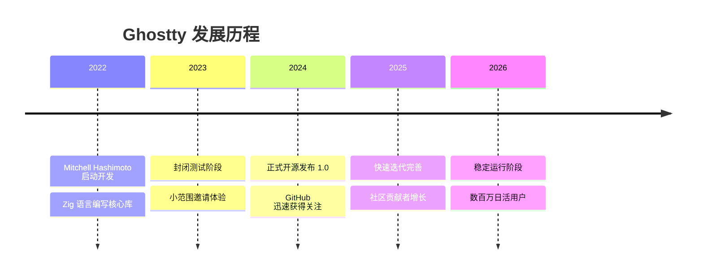
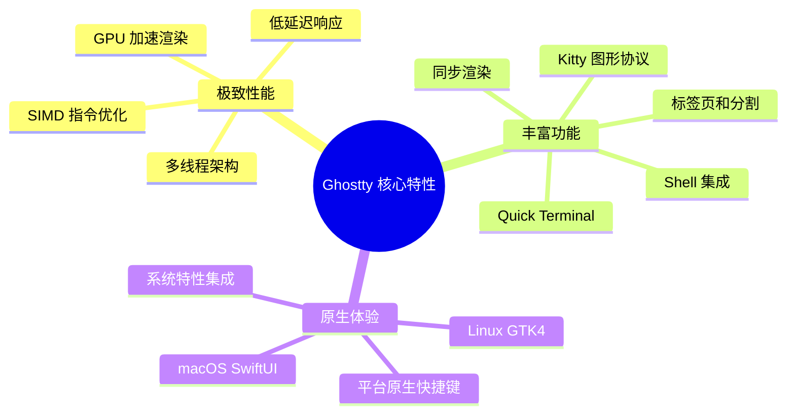
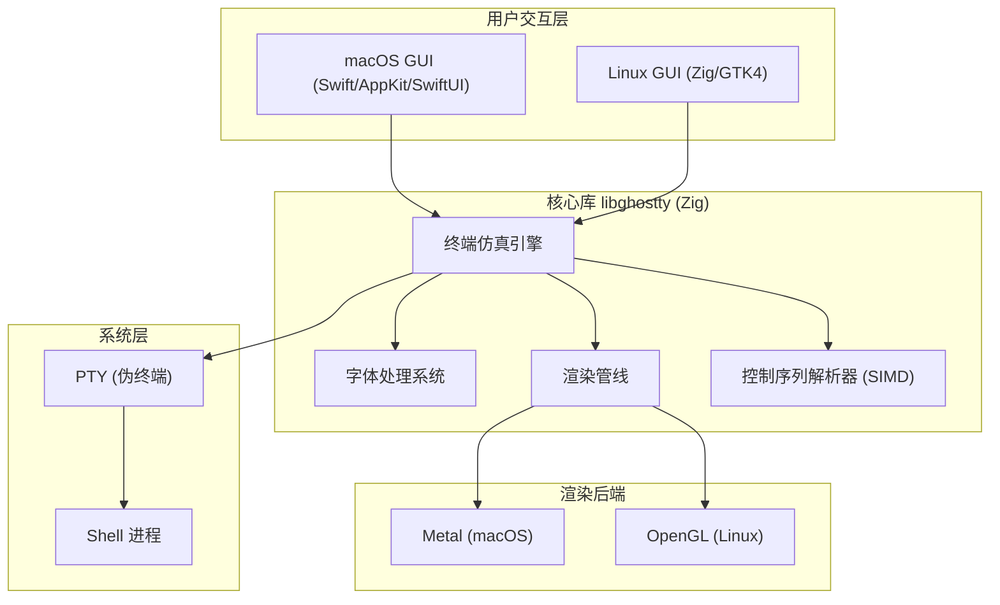
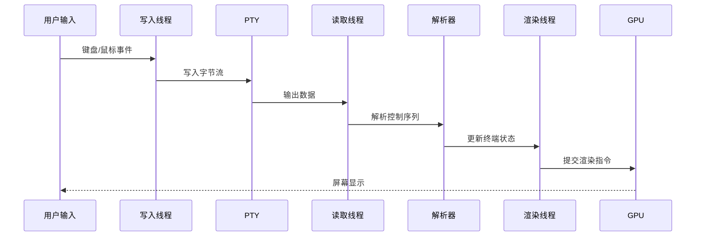
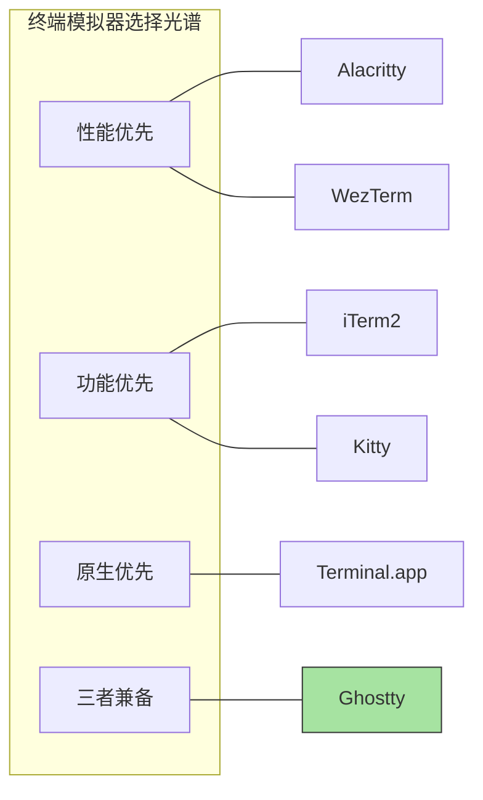
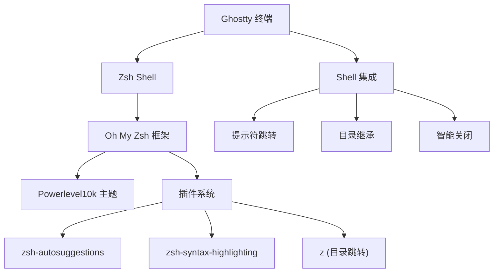
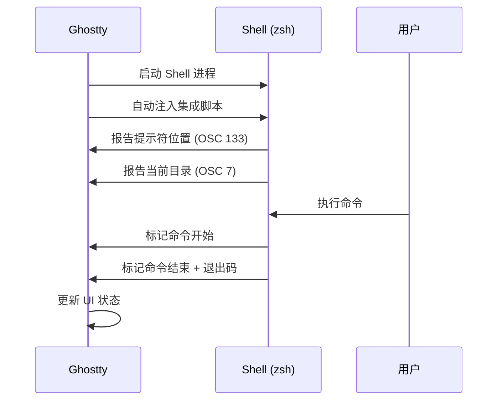
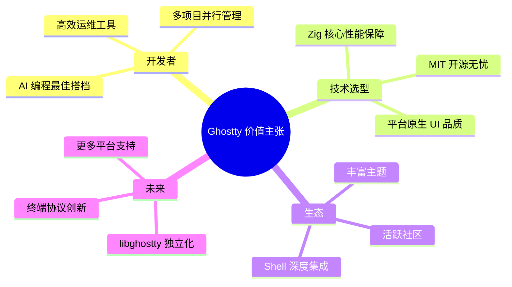

## Ghostty 使用文档

### 一、Ghostty 是什么

Ghostty 是由 Mitchell Hashimoto（HashiCorp 联合创始人）开发的一款现代终端模拟器。它是一个以"快速、功能丰富、原生体验"为核心目标的开源项目，采用 MIT 许可证发布。Ghostty 的核心理念是：用户不应在速度、功能和原生 UI 之间做出妥协，而是应该同时获得这三者。

Ghostty 使用 Zig 语言编写核心库（libghostty），macOS 端使用 Swift/AppKit/SwiftUI 构建原生 GUI，Linux 端使用 GTK4 实现桌面环境集成。目前已在 GitHub 获得超过 57,000 颗 Star，拥有 569 位贡献者和超过 16,000 次提交，是终端模拟器领域最受关注的新兴项目之一。

### 二、Ghostty 出现背景和发展历程

终端模拟器领域长期存在一个困境：性能导向的工具（如 Alacritty）功能精简、缺乏 GUI 特性；功能丰富的工具（如 iTerm2）启动缓慢、资源占用高；而原生体验的工具（如 macOS Terminal.app）则在性能和功能上都落后。Mitchell Hashimoto 在长期使用各类终端后，决定打造一款"三者兼得"的终端模拟器。

Ghostty 的发展历程大致如下：

- 2022 年：Mitchell Hashimoto 开始以个人激情项目的形式开发 Ghostty
- 2023 年：进入封闭测试阶段，小范围邀请用户体验
- 2024 年 12 月：正式开源发布 1.0 版本，迅速引发技术社区关注
- 2025 年：快速迭代，社区贡献者持续增长，功能不断完善
- 2026 年：已进入稳定阶段，每日有数百万用户和机器使用



### 三、Ghostty 核心特性

Ghostty 的核心特性可以分为三个维度：性能、功能和原生体验。

**极致性能**：Ghostty 采用多线程架构，为每个终端实例配置独立的读取、写入和渲染线程。渲染层使用 Metal（macOS）和 OpenGL（Linux）实现 GPU 加速，终端解析器利用 CPU 特定的 SIMD 指令集加速控制序列处理。在实际测试中，Ghostty 的吞吐性能与 Alacritty 处于同一级别，大约比 Terminal.app 和 iTerm2 快 100 倍。

**丰富功能**：在终端协议层面，Ghostty 支持 Kitty 图形协议、剪贴板序列、同步渲染（Neovim 使用此特性防止画面撕裂）、明暗模式通知、超链接识别等现代终端特性。在应用层面，提供原生标签页、窗口分割（Splits）、Quick Terminal（下拉终端）、主题跟随系统明暗模式切换、Shell 集成等功能。

**原生体验**：Ghostty 在每个平台上使用原生 UI 组件而非自定义文本控件。macOS 上集成了 Quick Look、Force Touch、安全输入 API、窗口状态恢复等系统特性；Linux 上通过 GTK4 实现与桌面环境的深度融合，支持 systemd 集成。



### 四、Ghostty 内部结构和架构原理

Ghostty 的架构设计遵循"核心共享、平台原生"的原则。整个项目由三个主要层次组成：

**libghostty（核心库）**：使用 Zig 编写的跨平台、零依赖 C ABI 兼容库，负责终端仿真、字体处理和渲染逻辑。这个库提供了标准化的 API，使得不同平台的 GUI 前端可以共享相同的终端逻辑。libghostty 同时支持 C 和 Zig 调用，未来计划稳定后开放给第三方使用。

**平台 GUI 层**：macOS 端使用 Swift 编写，基于 AppKit 和 SwiftUI 框架，渲染使用 Metal API；Linux 端使用 Zig 直接调用 GTK4 C API（可选 Adwaita 支持），渲染使用 OpenGL。两个平台的 GUI 层都是 libghostty 的消费者。

**多线程模型**：每个终端 surface 拥有独立的读取线程（处理 PTY 输入）、写入线程（处理用户输入）和渲染线程（GPU 绘制），确保各操作互不阻塞。



每个终端 surface 的线程模型如下：



### 五、Ghostty 下载和安装

#### macOS 安装

**官方 DMG（推荐）**：从官网下载 `.dmg` 文件，打开后将 Ghostty 拖入 Applications 文件夹。官方二进制文件经过签名和公证。

```bash
# 或使用 Homebrew 安装
brew install --cask ghostty
```

**Nix（macOS）**：通过 Nixpkgs 中的 `ghostty-bin` 包安装（注意：Nix 目前无法在 macOS 上从源码编译 Ghostty，因为 Nixpkgs 缺少 Swift 6 支持）。

#### Linux 安装

不同发行版的安装方式：

```bash
# Arch Linux
pacman -S ghostty

# Alpine Linux
apk add ghostty

# Gentoo
emerge -av ghostty

# NixOS / Nix on Linux
nix run nixpkgs#ghostty

# Snap
snap install ghostty --classic

# Void Linux
xbps-install ghostty

# Solus
eopkg install ghostty
```

社区维护的包（非官方）：

```bash
# Ubuntu
/bin/bash -c "$(curl -fsSL https://raw.githubusercontent.com/mkasberg/ghostty-ubuntu/HEAD/install.sh)"

# Fedora (COPR)
dnf copr enable scottames/ghostty
dnf install ghostty

# Debian (社区仓库)
# 参考 https://debian.griffo.io/
```

通用方案：AppImage 适用于任何 Linux 发行版（包括基于 musl 的系统），从 ghostty-appimage GitHub releases 下载后赋予执行权限即可运行。

#### 从源码构建

对于未提供预编译包的系统，可参考官方文档从源码构建。这也是比使用第三方社区二进制文件更安全的选择。

#### 更新

macOS 用户可通过 `ghostty +check-update` 命令检查更新；Homebrew 用户使用 `brew upgrade ghostty`。Linux 用户通过各自的包管理器更新。

#### 卸载

macOS 上将 Ghostty.app 从 Applications 移至废纸篓，并删除配置目录 `~/Library/Application Support/com.mitchellh.ghostty/`。Linux 上通过对应包管理器的 remove/uninstall 命令卸载。

### 六、Ghostty 基础配置

Ghostty 的配置文件位于：

- macOS：`~/Library/Application Support/com.mitchellh.ghostty/config`
- Linux：`~/.config/ghostty/config`

配置文件采用简单的 `key = value` 格式，每行一个配置项，`#` 开头为注释。

#### 字体配置

```bash
# 主字体（推荐等宽编程字体）
font-family = "JetBrains Mono"

# 字体大小（单位：pt）
font-size = 14

# 启用连字（ligatures）
font-feature = calt

# 禁用连字
# font-feature = -calt

# macOS 下加粗渲染
font-thicken = true
```

#### 主题与颜色

```bash
# 使用内置主题
theme = catppuccin-mocha

# 支持跟随系统明暗模式
theme = light:catppuccin-latte,dark:catppuccin-mocha

# 自定义前景/背景色
foreground = #cdd6f4
background = #1e1e2e

# 背景透明度（0-1）
background-opacity = 0.95

# 透明时启用背景模糊
background-blur = true
```

#### 窗口配置

```bash
# 窗口内边距
window-padding-x = 10
window-padding-y = 8

# 自动平衡边距
window-padding-balance = true

# 窗口装饰（none/auto/client/server）
window-decoration = auto

# 初始窗口大小（网格单元数）
window-width = 120
window-height = 35

# 窗口状态保存（重启后恢复）
window-save-state = always

# 新窗口继承工作目录
window-inherit-working-directory = true
```

#### 光标配置

```bash
# 光标样式（block/bar/underline/block_hollow）
cursor-style = bar

# 光标闪烁
cursor-style-blink = true

# 光标颜色
cursor-color = #f5e0dc
```

#### Shell 与命令

```bash
# 指定 Shell（默认读取 SHELL 环境变量）
command = /bin/zsh

# 工作目录（home/inherit/绝对路径）
working-directory = inherit

# 设置环境变量
env = EDITOR=nvim
```

#### 剪贴板与鼠标

```bash
# 剪贴板读取权限（ask/allow/deny）
clipboard-read = ask
clipboard-write = allow

# 粘贴保护（防止执行危险命令）
clipboard-paste-protection = true

# 输入时隐藏鼠标
mouse-hide-while-typing = true

# 鼠标滚动倍率
mouse-scroll-multiplier = 3
```

#### 滚动缓冲

```bash
# 滚动缓冲区大小（字节）
scrollback-limit = 10000000

# 滚动条显示（system/never）
scrollbar = system
```

### 七、Ghostty 初始化使用

安装完成后首次启动 Ghostty，它会自动检测系统默认 Shell 并注入 Shell 集成脚本。以下是初始使用的关键步骤：

**1. 创建配置文件**

```bash
# macOS
mkdir -p ~/Library/Application\ Support/com.mitchellh.ghostty
touch ~/Library/Application\ Support/com.mitchellh.ghostty/config

# Linux
mkdir -p ~/.config/ghostty
touch ~/.config/ghostty/config
```

**2. 验证 Shell 集成**

启动 Ghostty 后，检查日志确认 Shell 集成已注入：

```
info(io_exec): shell integration automatically injected shell=termio.shell_integration.Shell.zsh
```

**3. 验证终端信息**

```bash
# 检查 TERM 变量
echo $TERM
# 应输出：xterm-ghostty

# 检查 Ghostty 资源目录
echo $GHOSTTY_RESOURCES_DIR
```

**4. 基本操作验证**

- 打开新标签页：`Cmd+T`（macOS）/ `Ctrl+Shift+T`（Linux）
- 水平分割：`Cmd+D`（macOS）/ `Ctrl+Shift+Enter`（Linux）
- 关闭当前面板：`Cmd+W`（macOS）/ `Ctrl+Shift+W`（Linux）

### 八、Ghostty 命令列表

Ghostty 提供了一系列 CLI 子命令（通过 `ghostty +command` 格式调用）：

| 命令 | 说明 |
|------|------|
| `ghostty +list-themes` | 列出所有可用主题 |
| `ghostty +list-keybinds` | 列出当前生效的所有快捷键绑定 |
| `ghostty +list-fonts` | 列出系统可用字体 |
| `ghostty +list-actions` | 列出所有可绑定的操作 |
| `ghostty +show-config` | 显示当前完整配置 |
| `ghostty +check-update` | 检查是否有可用更新 |
| `ghostty +crash-report` | 管理崩溃报告 |
| `ghostty +ssh` | SSH 连接（自动配置远端 terminfo） |
| `ghostty +validate-config` | 验证配置文件语法 |

这些命令在日常使用中非常实用，尤其是 `+list-themes` 和 `+list-keybinds` 可以帮助快速了解可用选项。

### 九、Ghostty 快捷键使用

Ghostty 的快捷键设计遵循平台原生惯例，macOS 使用 `Cmd` 修饰键，Linux 使用 `Ctrl+Shift` 组合。

#### macOS 默认快捷键

| 操作 | 快捷键 |
|------|--------|
| 新建窗口 | `Cmd+N` |
| 新建标签页 | `Cmd+T` |
| 关闭当前面板 | `Cmd+W` |
| 向右分割 | `Cmd+D` |
| 向下分割 | `Cmd+Shift+D` |
| 切换到上一个标签 | `Cmd+Shift+[` |
| 切换到下一个标签 | `Cmd+Shift+]` |
| 切换到第 N 个标签 | `Cmd+1~9` |
| 在分割间导航 | `Cmd+Option+方向键` |
| 放大当前分割 | `Cmd+Shift+Enter` |
| 增大字体 | `Cmd+=` |
| 缩小字体 | `Cmd+-` |
| 重置字体 | `Cmd+0` |
| 复制 | `Cmd+C` |
| 粘贴 | `Cmd+V` |
| 搜索 | `Cmd+F` |
| 全屏切换 | `Cmd+Ctrl+F` |
| 清屏 | `Cmd+K` |
| 打开配置文件 | `Cmd+,` |
| 重载配置 | `Cmd+Shift+,` |
| Quick Terminal | `全局快捷键（需配置）` |

#### Linux 默认快捷键

| 操作 | 快捷键 |
|------|--------|
| 新建窗口 | `Ctrl+Shift+N` |
| 新建标签页 | `Ctrl+Shift+T` |
| 关闭当前面板 | `Ctrl+Shift+W` |
| 分割 | `Ctrl+Shift+Enter` |
| 在分割间导航 | `Ctrl+Shift+方向键` |
| 复制 | `Ctrl+Shift+C` |
| 粘贴 | `Ctrl+Shift+V` |
| 搜索 | `Ctrl+Shift+F` |
| 增大字体 | `Ctrl+=` |
| 缩小字体 | `Ctrl+-` |

#### 自定义快捷键

```bash
# 基本格式：keybind = 触发键=动作
keybind = cmd+shift+e=new_split:right
keybind = cmd+shift+o=new_split:down

# 全局快捷键（应用外也生效）
keybind = global:cmd+grave_accent=toggle_quick_terminal

# 取消默认绑定
keybind = cmd+t=unbind

# 清除所有默认绑定
keybind = clear

# 发送自定义文本
keybind = ctrl+shift+g=text:git status\n

# 链式动作
keybind = cmd+shift+r=chain:reload_config,text:echo config reloaded\n
```

### 十、Ghostty 高效使用技巧

#### Quick Terminal（下拉终端）

Quick Terminal 是 Ghostty 最受欢迎的特性之一，提供类似 Quake 风格的即时终端访问：

```bash
# 启用全局快捷键
keybind = global:cmd+grave_accent=toggle_quick_terminal

# 设置弹出位置（top/bottom/left/right）
quick-terminal-position = top

# 动画持续时间（秒）
quick-terminal-animation-duration = 0.2

# 指定显示器
quick-terminal-screen = main
```

使用前需要在 macOS 系统设置 > 隐私与安全 > 辅助功能中授权 Ghostty。Quick Terminal 的会话在隐藏后持续运行，适合用于快速命令执行、临时查询等场景。

#### 窗口分割高级技巧

```bash
# 均分所有分割面板
keybind = cmd+shift+e=equalize_splits

# 调整分割大小（方向,步长）
keybind = cmd+ctrl+left=resize_split:left,10
keybind = cmd+ctrl+right=resize_split:right,10
keybind = cmd+ctrl+up=resize_split:up,10
keybind = cmd+ctrl+down=resize_split:down,10

# 聚焦方向切换
keybind = cmd+option+left=goto_split:left
keybind = cmd+option+right=goto_split:right
keybind = cmd+option+up=goto_split:up
keybind = cmd+option+down=goto_split:down
```

#### 主题动态切换

```bash
# 配置明暗主题自动切换
theme = light:github-light,dark:dracula

# 使用 toggle_background_opacity 快速切换透明度
keybind = cmd+shift+b=toggle_background_opacity
```

#### Shell 集成高级功能

启用 Shell 集成后可以使用以下增强功能：

- **跳转提示符**：快速在历史命令提示符之间跳转，方便查看之前命令的输出
- **光标点击定位**：在提示符处 Option+Click（macOS）可将光标移动到点击位置
- **命令输出选择**：三击 + Cmd（macOS）/ Ctrl（Linux）可选中整条命令的输出
- **智能关闭**：当光标在提示符处时，关闭面板不会弹出确认对话框

#### 通知与提醒

在长时间运行的命令完成后获得通知，可以结合 Shell 集成：

```bash
# 在 .zshrc 中配置命令完成通知
# Ghostty 支持 OSC 9 通知序列
notify() {
    printf "\e]9;%s\a" "$1"
}
```

### 十一、Ghostty 为什么这么火

Ghostty 能在终端模拟器这个成熟领域引起广泛关注，主要原因有以下几个方面：

**创始人光环**：Mitchell Hashimoto 作为 HashiCorp（Vagrant、Terraform、Vault 等知名项目的母公司）联合创始人，其技术品味和工程能力得到社区高度认可，项目自带流量。

**技术选型前瞻**：选择 Zig 语言编写核心库，既获得了接近 C 的性能，又避免了 C/C++ 的内存安全问题，同时保持了极低的依赖复杂度。这种选择在系统编程领域具有示范意义。

**解决真实痛点**：终端用户长期面临"速度、功能、原生体验三选二"的困境，Ghostty 是第一个认真尝试同时解决三者的项目。

**开源社区运营**：在封闭测试阶段积累了大量期待，正式开源后立即吸引了大批贡献者。项目文档完善、Issue 响应及时、架构设计便于贡献。

**AI 时代契机**：随着 Claude Code、Codex 等 AI 编程工具的流行，开发者对终端的使用时间大幅增加，对终端性能和功能的要求也随之提高，Ghostty 恰好满足了这一新兴需求。

### 十二、Ghostty 和其他终端工具的对比



| 维度 | Ghostty | iTerm2 | Alacritty | Kitty | WezTerm |
|------|---------|--------|-----------|-------|---------|
| 语言 | Zig + Swift | Objective-C | Rust | C + Python | Rust |
| GPU 渲染 | Metal/OpenGL | Metal | OpenGL/Metal | OpenGL | OpenGL/Metal |
| 性能 | 极高 | 中等 | 极高 | 高 | 高 |
| 内存占用 | 低 | 高 | 极低 | 低 | 中等 |
| 标签页/分割 | 原生支持 | 原生支持 | 不支持 | 支持 | 支持 |
| 图形协议 | Kitty 协议 | 私有协议 | 不支持 | Kitty 协议 | Kitty/Sixel |
| Shell 集成 | 内置自动注入 | 内置 | 无 | 无 | 无 |
| 配置方式 | 文本文件 | GUI + Plist | TOML 文件 | conf 文件 | Lua 脚本 |
| macOS 原生性 | 高（SwiftUI） | 高（Cocoa） | 低 | 低 | 中 |
| Linux 支持 | GTK4 原生 | 不支持 | 支持 | 支持 | 支持 |
| Quick Terminal | 支持 | 支持 | 不支持 | 不支持 | 不支持 |
| 许可证 | MIT | GPLv2 | Apache 2.0 | GPLv3 | MIT |

**选择建议**：如果你主要在 macOS 上工作且希望获得接近 Alacritty 的性能同时拥有 iTerm2 级别的功能，Ghostty 是当前最佳选择。如果你需要高度可编程性（如通过 Lua 脚本扩展），WezTerm 可能更适合。如果你只需要最精简的终端且不需要标签页/分割，Alacritty 依然是极简主义者的首选。

### 十三、Ghostty + Oh My Zsh 配合使用

Ghostty 与 Oh My Zsh 的结合可以打造极致的终端体验。以下是推荐配置方案：

#### 安装 Oh My Zsh

```bash
sh -c "$(curl -fsSL https://raw.githubusercontent.com/ohmyzsh/ohmyzsh/master/tools/install.sh)"
```

#### 推荐插件配置

在 `~/.zshrc` 中配置：

```bash
plugins=(
    git
    zsh-autosuggestions
    zsh-syntax-highlighting
    z
    docker
    kubectl
)
```

#### 主题推荐

推荐使用 Powerlevel10k 主题配合 Nerd Font：

```bash
# 安装 Powerlevel10k
git clone --depth=1 https://github.com/romkatv/powerlevel10k.git \
    ${ZSH_CUSTOM:-$HOME/.oh-my-zsh/custom}/themes/powerlevel10k

# .zshrc 中设置
ZSH_THEME="powerlevel10k/powerlevel10k"
```

#### Ghostty 配套字体配置

```bash
# Ghostty config 中配置 Nerd Font 以支持图标显示
font-family = "MesloLGS NF"
font-size = 14
```

#### Shell 集成共存

Ghostty 的 Shell 集成与 Oh My Zsh 可以和平共存。Ghostty 会在 zsh 初始化早期注入集成脚本，不会与 Oh My Zsh 的插件系统冲突。如果遇到提示符渲染问题，可以在 `.zshrc` 末尾添加：

```bash
# 确保 Ghostty shell 集成在 Oh My Zsh 之后加载
if [ -n "${GHOSTTY_RESOURCES_DIR}" ]; then
    source "${GHOSTTY_RESOURCES_DIR}/shell-integration/zsh/ghostty-integration"
fi
```

#### 推荐整体配色方案

```bash
# Ghostty config — Catppuccin Mocha 配色
theme = catppuccin-mocha
background-opacity = 0.95
background-blur = true
font-family = "MesloLGS NF"
font-size = 14
window-padding-x = 12
window-padding-y = 8
cursor-style = bar
cursor-style-blink = true
```



### 十四、Ghostty 实战使用 Demo Case

#### Case 1：AI 编程工作流（Claude Code / Codex）

Ghostty 的高性能和分割功能使其成为 AI 编程助手的理想搭载平台：

```bash
# 推荐配置：为 AI 编程优化
font-size = 13
window-width = 200
window-height = 50
scrollback-limit = 50000000

# 分割布局：左侧编辑器 + 右侧 AI 终端
keybind = cmd+shift+a=new_split:right
```

工作流程：左侧面板运行代码编辑，右侧面板运行 AI 助手，通过 `Cmd+Option+方向键` 快速切换焦点。Ghostty 的同步渲染特性确保 AI 输出的大量文本不会造成画面撕裂。

#### Case 2：多项目并行开发

利用标签页和分割组合管理多个项目：

```bash
# 标签页颜色标识不同项目（通过 OSC 序列）
printf "\e]6;1;bg;red;brightness;200\a"    # 第一个标签红色
printf "\e]6;1;bg;green;brightness;200\a"  # 第二个标签绿色
```

#### Case 3：服务器运维监控

利用 Quick Terminal 进行快速运维操作：

```bash
# 全局快捷键呼出 Quick Terminal
keybind = global:ctrl+grave_accent=toggle_quick_terminal
quick-terminal-position = top

# 快速 SSH 连接（利用 Ghostty SSH 集成）
ghostty +ssh user@server
```

#### Case 4：日志分析与调试

```bash
# 利用搜索功能快速定位日志
# Cmd+F 打开搜索 → 输入关键词 → Cmd+G/Cmd+Shift+G 前后导航

# 利用 write_scrollback_file 导出完整日志
keybind = cmd+shift+s=write_scrollback_file:paste
```

### 十五、Ghostty 工具的最佳实践方案

#### 配置文件组织

推荐将配置按功能模块注释分组：

```bash
# ============ 字体 ============
font-family = "JetBrains Mono"
font-size = 14
font-thicken = true

# ============ 主题 ============
theme = light:catppuccin-latte,dark:catppuccin-mocha
background-opacity = 0.95
background-blur = true

# ============ 窗口 ============
window-padding-x = 10
window-padding-y = 8
window-save-state = always
window-inherit-working-directory = true

# ============ 光标 ============
cursor-style = bar
cursor-style-blink = true

# ============ 快捷键 ============
keybind = global:cmd+grave_accent=toggle_quick_terminal
keybind = cmd+shift+e=equalize_splits
keybind = cmd+ctrl+left=resize_split:left,10
keybind = cmd+ctrl+right=resize_split:right,10

# ============ Shell ============
shell-integration = zsh
command = /bin/zsh

# ============ 安全 ============
clipboard-paste-protection = true
clipboard-read = ask
```

#### 性能优化建议

- 对于大日志输出场景，适当增加 `scrollback-limit`，但注意内存占用
- 使用 `unfocused-split-opacity` 降低未聚焦面板的渲染压力
- 如不需要背景透明效果，保持 `background-opacity = 1` 以获得最佳渲染性能

#### 安全最佳实践

- 始终保持 `clipboard-paste-protection = true` 防止恶意粘贴攻击
- 使用 `clipboard-read = ask` 确保程序读取剪贴板时需要确认
- 在公共场合使用 `toggle_secure_input`（macOS）防止键盘记录

#### 备份与同步

配置文件可通过 Git 或云同步服务在多台设备间共享：

```bash
# 使用 Git 管理配置
cd ~/Library/Application\ Support/com.mitchellh.ghostty
git init
git add config
git commit -m "initial ghostty config"
```

### 十六、Ghostty Shell 集成详解

Shell 集成是 Ghostty 区别于大多数终端模拟器的重要特性，它通过在 Shell 启动时自动注入脚本来增强终端与 Shell 的协作。



#### 支持的 Shell

| Shell | 自动注入 | 备注 |
|-------|---------|------|
| Zsh | 支持 | 完整功能 |
| Bash | 支持 | macOS 自带的 /bin/bash 需手动配置 |
| Fish | 支持 | Fish 4.0+ 自带部分功能 |
| Elvish | 支持 | 完整功能 |
| Nushell | 部分 | 仅 sudo/ssh 集成 |

#### 禁用 Shell 集成

```bash
# 完全禁用
shell-integration = none

# 强制指定 Shell 类型（当自动检测不准确时）
shell-integration = fish
```

#### SSH 集成

Ghostty 提供了 SSH 环境的自动配置：

```bash
# 启用 SSH terminfo 自动安装
shell-integration-features = sudo,ssh-env,ssh-terminfo

# 或使用 ghostty +ssh 命令
ghostty +ssh user@remote-server
```

### 十七、Ghostty 总结

Ghostty 代表了终端模拟器发展的一个新方向：通过现代系统编程语言（Zig）和平台原生 GUI 框架的结合，在不牺牲任何一个维度的前提下同时实现了高性能、丰富功能和原生体验。

对于日常使用终端的开发者来说，Ghostty 提供了从 iTerm2 或其他终端迁移的最佳路径——你不需要放弃标签页、分割等习惯的功能，同时能获得接近 Alacritty 的性能和更好的平台集成。Quick Terminal、Shell 集成、同步渲染等特性使其特别适合 AI 编程时代的高强度终端使用场景。

作为一个活跃的开源项目，Ghostty 的未来值得期待。其 libghostty 库的稳定化将使其技术成果惠及更广泛的终端生态，而持续增长的社区贡献者也保证了项目的长期健康发展。



---

### 参考文档

- [Ghostty 官方文档 - About](https://ghostty.org/docs/about)
- [Ghostty 官方文档 - Configuration Reference](https://ghostty.org/docs/config/reference)
- [Ghostty 官方文档 - Keybind Actions](https://ghostty.org/docs/config/keybind/reference)
- [Ghostty 官方文档 - Shell Integration](https://ghostty.org/docs/features/shell-integration)
- [Ghostty 官方文档 - Installation](https://ghostty.org/docs/install/binary)
- [Ghostty GitHub 仓库](https://github.com/ghostty-org/ghostty)
- [Ghostty 下载页面](https://ghostty.org/download)
- [Ghostty & macOS Quick Terminal - David Bushell](https://dbushell.com/2025/04/11/ghostty-macos-quick-terminal/)
- [Choosing a Terminal on macOS (2025) - Medium](https://medium.com/codecodecode/choosing-a-terminal-on-macOS-2025-iterm2-vs-ghostty-vs-wezterm-vs-kitty-vs-alacritty-d6a5e42fd8b3)
- [Ghostty Terminal: Never Understood the Hype Until I tried it - It's FOSS](https://itsfoss.com/ghostty-terminal-features/)
- [Ghostty：Claude Code 的最佳搭档，终端生产力核武器 - 知乎](https://zhuanlan.zhihu.com/p/2016625071427428917)
- [终端领域的新玩家，号称超越 kitty 的 ghostty - 掘金](https://juejin.cn/post/7452910596746395663)
- [Ghostty 让你再次爱上终端 - 腾讯云](https://cloud.tencent.com/developer/article/2488938)
- [告别配置烦恼：Ghostty 终端从基础到高级的个性化指南 - CSDN](https://adg.csdn.net/695247ef5b9f5f31781b5914.html)
- [拒绝丑陋终端！Mac 顶级开发环境 Ghostty + Oh My Zsh 终极装修指南 - 博客园](https://www.cnblogs.com/sueyyyy/p/19748613)
- [Ghostty 终端默认快捷键列表 - 掘金](https://juejin.cn/post/7467618287381397567)
