# Shell 理解

> 一篇关于 Shell 的系统性学习笔记。从「人机交互的演进史」入手，串起 Shell 的本质、家族、用法、原理，再延伸到 CLI、云 Shell、AI Agent 与 Shell 的关系，最后给出实战示例与脚本编写指南。

---

## 一、Shell 是什么

**Shell** 是操作系统的"外壳"，它是一个用户与操作系统底层内核（Kernel）进行交互的**命令解释器**。简单来说，Shell 是用户与操作系统内核（Kernel）之间的交互界面。

它的本质职责可以浓缩为两件事：

1. **解释命令**——把人能看懂的命令（`ls -l`、`grep ERROR`）翻译成内核能执行的系统调用。
2. **连接生态**——把成百上千个独立的小程序（`grep`、`awk`、`sed`、`find`……）通过管道、重定向、变量替换等机制组合成强大的工作流。

可以用一张简化的分层视图来理解 Shell 在系统中的位置：

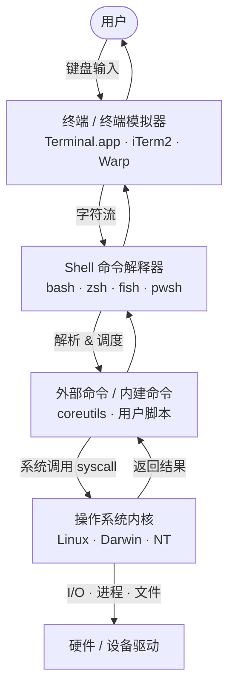

> 一句话：终端负责 I/O，Shell 负责处理逻辑。两者并无固定的对应关系，可以自由组合。

---

## 二、Shell 的发展历史

Shell 不是凭空出现的，它的诞生紧跟着人机交互方式的演进。

### 2.1 人机交互的四个阶段

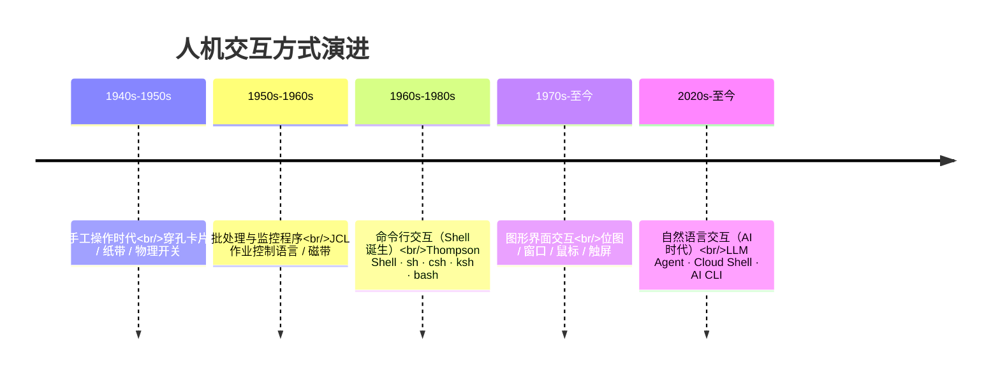

- **手工操作时代**：依赖物理介质，调试一个字节可能要重制整张穿孔卡片，独占机器、效率极低。
- **批处理时代**：通过 JCL（作业控制语言）和监控程序实现自动调度，开启了"从手动到自动"的变迁，但仍是事先提交、事后等待，**无交互性**。
- **命令行时代**：分时系统出现后，用户终端能即时与计算机对话，**Shell 在这个时代正式诞生**，成为人和计算机之间的实时翻译官。
- **图形界面时代**：降低了普通用户的门槛，但并未取代 Shell——开发者、运维、服务器场景始终是命令行的主场。
- **AI 自然语言时代**：LLM 正在变成新的"超级 Shell"，但底层依赖的依然是 sh/bash/zsh 等 30 年前奠基的工具链。

### 2.2 Shell 家族的诞生与分化

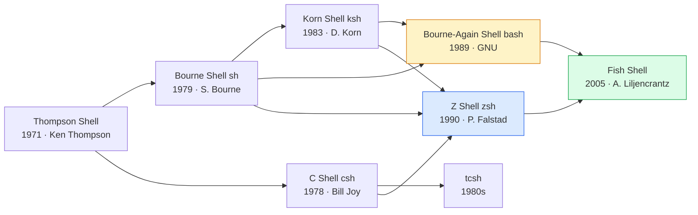

主要分支演进要点：

- **Thompson Shell（1971）**：Unix 第一代 Shell，由 Ken Thompson 用 B 语言实现，功能简陋、无循环、无函数。
- **Bourne Shell（sh，1979）**：Stephen Bourne 在贝尔实验室推出，奠定了 if/for/while、命令替换 `` ` ` ``、位置参数 `$1/$2` 等 Shell 编程标准，成为后续 Shell 的语法模板。
- **C Shell（csh，1978）**：Bill Joy 出品，语法仿 C 语言，引入了命令历史、别名、作业控制（`&` `fg` `bg`），但脚本兼容性差。
- **Korn Shell（ksh，1983）**：融合 sh 的稳定性与 csh 的交互特性，引入了数组、关联数组、协程，曾是商业 Unix（AIX、Solaris）的默认 Shell。
- **Bourne-Again Shell（bash，1989）**：GNU 计划的开源替代品，向后兼容 sh，并吸收了 csh/ksh 的优点（命令补全、历史搜索、进程替换等），成为 Linux 时代事实上的默认 Shell。
- **Z Shell（zsh，1990）**：普林斯顿学生 Paul Falstad 开发（命名来源是助教邵中 Zhong Shao 的登录名），融合 bash/ksh/csh 优点，配合 `oh-my-zsh` 后成为「开发者首选 Shell」。2019 年 macOS Catalina 起替代 bash 成为 macOS 默认 Shell（主要原因是 bash 4.0 切到 GPL v3，与苹果闭源策略冲突）。
- **Fish Shell（2005）**：完全重新设计语法，强调开箱即用的交互体验（实时建议、内联补全、Web 配置），代价是不兼容 POSIX。

### 2.3 当代 Shell 速览

| Shell | 诞生 | 主流平台 | 应用场景 | 一句话特点 |
|---|---|---|---|---|
| **sh (Bourne)** | 1979 | Unix/Linux/容器 | POSIX 脚本基线 | 极简、轻量、最大兼容 |
| **bash** | 1989 | Linux/WSL/Git Bash | 服务器、脚本编程 | 功能全面、生态最大 |
| **zsh** | 1990 | macOS/Linux | 交互式日常使用 | 高度可定制、插件丰富 |
| **fish** | 2005 | 全平台 | 新手、桌面终端 | 友好、智能、非 POSIX |
| **PowerShell** | 2006 | Windows/跨平台 | Windows 运维、.NET | 对象管道、Cmdlet 体系 |
| **dash / ash / busybox sh** | 1990s+ | 容器、嵌入式 | `/bin/sh` 真身、镜像精简 | 轻量、严格 POSIX |
| **nu shell / xonsh** | 2019+ | 实验型 | 数据/Python 友好 | 结构化数据、跨范式 |

---

## 三、Shell 有什么用

Shell 的价值远不止"敲命令"，它是开发者最持久的生产力工具：

- **系统管理**：进程管理、用户管理、磁盘管理、网络配置——所有 Linux/macOS 服务器管理都建立在 Shell 之上。
- **任务自动化**：备份、部署、定时任务、日志清理、CI/CD 流水线，Shell 脚本是连接一切工具的胶水。
- **数据处理**：`awk`、`sed`、`grep`、`jq` 等工具组合起来，处理日志/CSV/JSON 的速度远超手写代码。
- **开发工作流**：从代码编辑、版本管理、构建发布到调试排错，全程不离 Shell。
- **远程操作**：SSH + Shell 是远程管理服务器、容器、嵌入式设备的事实标准。
- **AI Agent 的"双手"**：在 LLM 时代，Shell 成为 Agent 操作计算机的最低成本接口（详见第十章）。

---

## 四、Shell 与 Terminal 的区别

这两个概念经常被混用，但实际上它们各司其职。

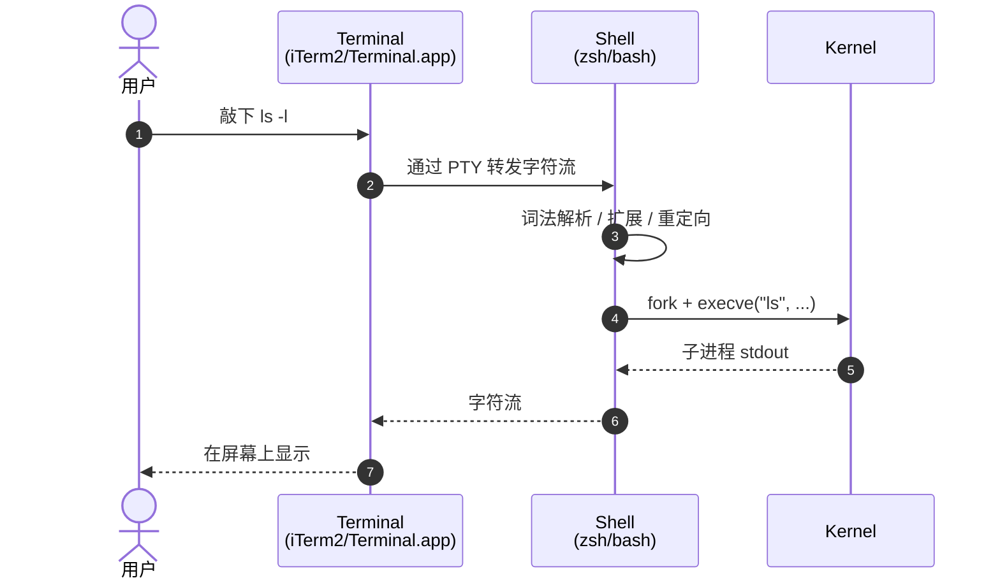

| 维度 | Terminal | Shell |
|---|---|---|
| **本质** | 输入输出设备 / 终端模拟器程序 | 命令解释器程序 |
| **职责** | I/O：捕获键盘、渲染屏幕、处理 ANSI 转义码 | 解析命令、执行程序、管理进程 |
| **典型代表** | Terminal.app、iTerm2、Warp、Windows Terminal | bash、zsh、fish、PowerShell |
| **可不可换** | 可以——任何终端都能跑任何 Shell | 可以——同一终端可切换不同 Shell |

> **TTY** 一词源自 1970s 的电传打字机（Teletype），在 Linux 中它既指终端设备文件（如 `/dev/tty1`、`/dev/pts/0`），也指内核的 TTY 子系统（UART 驱动 + Line discipline + TTY 驱动）。**Console** 在现代语境中基本与 Terminal 同义。

---

## 五、Shell、cmd、sh、bash 到底什么关系

这是新人最容易混淆的一组概念。

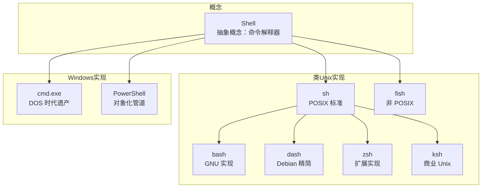

- **Shell**：抽象概念，泛指所有命令解释器。
- **sh**：POSIX 标准定义的最小 Shell 接口，在不同系统上链接到不同实现（Ubuntu 是 dash，CentOS/Red Hat 是 bash 兼容模式）。
- **bash**：GNU 项目对 sh 的扩展实现，目前最流行、最全面的 sh 兼容 Shell。
- **cmd**：Windows 的 Command Prompt，DOS 时代的产物，仅支持简单批处理。
- **PowerShell**：微软现代 Shell，最大特点是**管道传递对象**（而非纯文本），可处理结构化数据。

业界口语中常把 `bash` `sh` `shell` 混用，招聘中常见的"熟悉 Shell 编程"基本等同于"熟悉 bash 脚本"。

---

## 六、Shell 在不同系统中的体现

| 平台 | 默认 Shell | 备注 |
|---|---|---|
| **macOS** | zsh（10.15 Catalina 起，2019） | 此前为 bash 3.2（被 GPL v3 困住，长达 12 年未升级） |
| **Ubuntu/Debian** | bash（交互式），`/bin/sh` 链接到 dash | dash 启动更快，适合脚本 |
| **CentOS/RHEL** | bash | 服务器/企业 Linux 主流 |
| **Alpine Linux / Docker** | busybox sh / ash | 极致轻量，常用于容器基础镜像 |
| **Windows 10/11** | PowerShell + cmd + WSL（bash） | WSL 让 Windows 拥有完整 Linux Shell |
| **嵌入式 / 路由器** | busybox sh、ash | 内存占用极低 |
| **iOS / Android** | （受限）termux/iSH 等用户态终端 | 系统层面不开放 |
| **Web / Cloud** | Cloud Shell（详见第十一章） | 浏览器即终端 |

---

## 七、Shell 与相关工具的家族

Shell 不是孤岛，它和一堆工具协同形成完整的命令行体验。

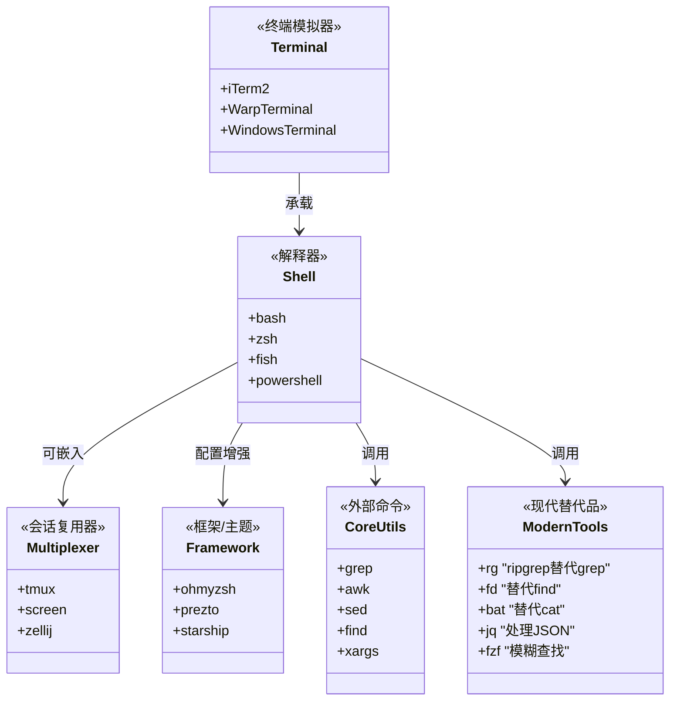

一个完整、现代化的"终端工作台"通常包括：

- **终端模拟器**：Warp / iTerm2 / Alacritty / WezTerm
- **Shell**：zsh + oh-my-zsh / fish + fisher
- **Prompt**：Starship / Powerlevel10k
- **多路复用**：tmux / zellij（持久会话、分屏）
- **现代化工具链**：ripgrep（rg）替代 grep、fd 替代 find、bat 替代 cat、eza 替代 ls、zoxide 替代 cd、fzf 模糊查找

---

## 八、Shell 的安装与管理

### 8.1 查看当前 Shell

```bash
echo $SHELL          # 当前用户的默认 Shell
echo $0              # 当前正在运行的 Shell（登录态返回 -zsh，非登录态返回 zsh）
cat /etc/shells      # 系统已注册的 Shell 列表
which zsh && zsh --version
```

### 8.2 安装与切换

```bash
# macOS（Homebrew）
brew install zsh fish

# Ubuntu/Debian
sudo apt update && sudo apt install zsh fish

# CentOS/RHEL
sudo yum install zsh fish

# 把 Shell 注册到 /etc/shells（如果是 brew 装的）
echo "$(which zsh)" | sudo tee -a /etc/shells

# 切换默认 Shell
chsh -s "$(which zsh)"
```

### 8.3 卸载与回退

```bash
# 回退到 bash
chsh -s /bin/bash

# 卸载 zsh（仍可用 bash）
brew uninstall zsh                # macOS
sudo apt remove zsh               # Debian/Ubuntu
```

### 8.4 升级

```bash
brew upgrade zsh                  # macOS
sudo apt upgrade bash zsh         # Linux
```

---

## 九、环境变量与配置文件

环境变量是 Shell 的"内存"，配置文件是 Shell 的"出厂设置"。理解它们的加载顺序，是排查"为什么在终端能运行、在 VSCode/cron 不能运行"这类问题的关键。

### 9.1 关键环境变量

```bash
PATH         # 可执行文件搜索路径，冒号分隔
HOME         # 用户主目录
USER         # 当前用户名
SHELL        # 当前默认 Shell
PWD          # 当前工作目录
LANG / LC_*  # 语言与本地化
EDITOR       # 默认编辑器（git commit、crontab -e 等用）
PS1 / PROMPT # 提示符格式
```

查看与修改：

```bash
env                              # 列出所有环境变量
printenv PATH                    # 查看单个变量
export NEW_VAR="value"           # 仅在当前进程及子进程生效
echo 'export NEW_VAR="value"' >> ~/.zshrc   # 持久化
```

### 9.2 Bash 配置文件加载顺序

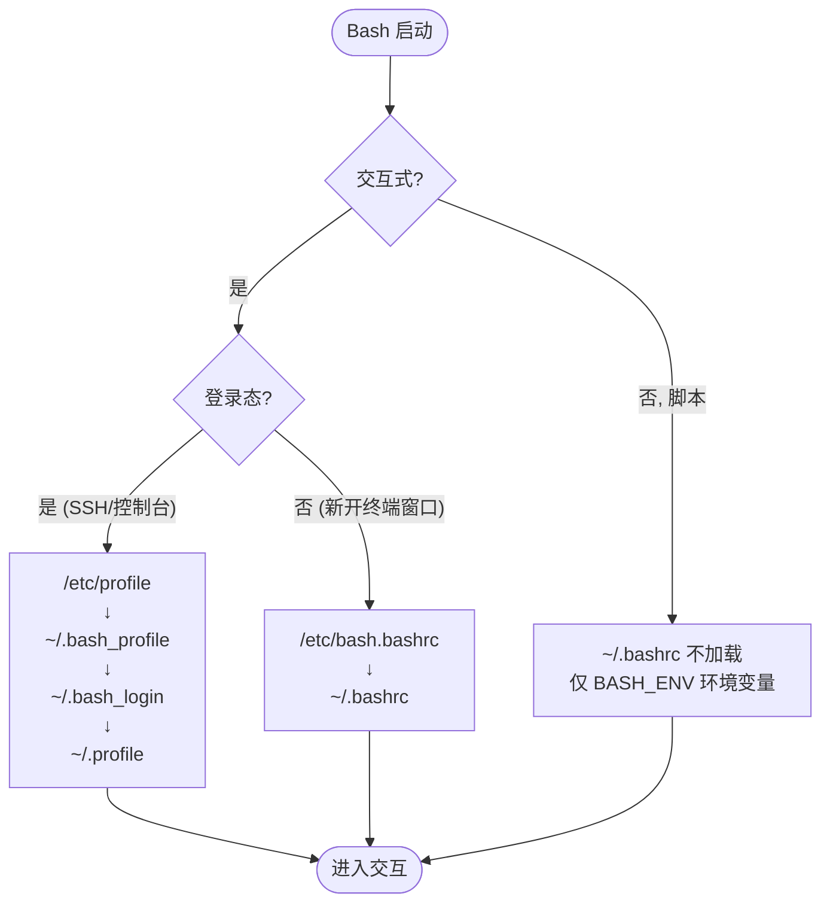

### 9.3 Zsh 配置文件加载顺序

Zsh 的配置文件比 bash 更细分，按 5 个生命周期文件分别处理：

| 文件 | 加载时机 | 用途 |
|---|---|---|
| `/etc/zshenv` · `~/.zshenv` | **所有** Zsh 进程（含脚本） | 必须全局生效的变量（PATH） |
| `/etc/zprofile` · `~/.zprofile` | 登录态会话，加载早于 zshrc | 登录时一次性设置 |
| `/etc/zshrc` · `~/.zshrc` | 所有**交互式**会话 | 别名、函数、插件、提示符 |
| `/etc/zlogin` · `~/.zlogin` | 登录态会话，加载晚于 zshrc | 登录后的"压轴动作" |
| `/etc/zlogout` · `~/.zlogout` | 登出时 | 清理工作 |

不同会话形态加载链路：

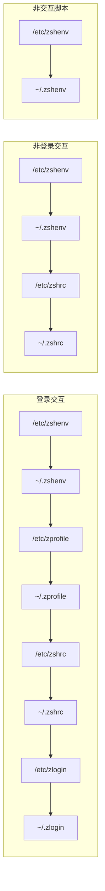

### 9.4 一个常见坑：VSCode 终端 vs 系统终端

- Terminal.app 与 iTerm2 默认是**登录态**，加载 `~/.zprofile` + `~/.zshrc`。
- VSCode 集成终端默认是**非登录态**，只加载 `~/.zshrc`。

如果你把 `PATH` 写在了 `~/.zprofile` 而不是 `~/.zshenv` 或 `~/.zshrc`，就会出现"iTerm2 里能跑、VSCode 里 command not found"的诡异现象。

**推荐方案**：

```bash
# 在 ~/.zshenv 中（所有场景都加载）
export PATH="/opt/homebrew/bin:$PATH"
```

---

## 十、Shell 常用命令与场景

按使用场景而非按字母表来组织（更接近真实工作流）。

### 10.1 文件与目录

```bash
ls -la                      # 列表（含隐藏文件、权限）
cd -                        # 回到上一次工作目录
pwd                         # 显示当前路径
tree -L 2 -a                # 目录树（macOS: brew install tree）
cp -r src/ dst/             # 递归复制
mv old new                  # 移动/重命名
mkdir -p a/b/c              # 创建多级目录
rm -rf path                 # 递归删除（慎用！）
ln -s target link           # 软链接
chmod 755 script.sh         # 权限：rwxr-xr-x
chown user:group file       # 修改属主
stat file                   # 详细元信息
```

### 10.2 文本处理

```bash
cat file                    # 输出
head -n 50 file             # 前 50 行
tail -f log                 # 实时跟踪日志
less file                   # 分页查看（j/k 翻、/ 搜索）
wc -l file                  # 行数统计
sort | uniq -c | sort -rn   # 词频统计经典三连
grep -rn "pattern" src/     # 递归搜索
sed -i.bak 's/foo/bar/g' f  # 替换（GNU 用 -i, BSD 需 -i ''）
awk '{print $1, $NF}' f     # 抽列
cut -d: -f1 /etc/passwd     # 按分隔符切
tr 'a-z' 'A-Z' < f          # 字符转换
diff -u a b                 # 差异对比
```

### 10.3 进程与系统

```bash
ps aux | grep nginx         # 进程列表
top / htop                  # 实时监控
kill -9 PID                 # 强制杀进程
nohup cmd &                 # 后台运行（断 SSH 不退出）
jobs / fg / bg              # 作业控制
df -h / du -sh *            # 磁盘
free -h                     # 内存
uname -a                    # 系统信息
date '+%Y-%m-%d %H:%M:%S'   # 时间戳
uptime                      # 负载
```

### 10.4 网络

```bash
curl -sf -H "Auth: x" URL   # HTTP 请求
wget URL                    # 下载
ssh user@host -p 2222       # 远程登录
scp file user@host:/path/   # 远程拷贝
rsync -avz src/ dst/        # 增量同步
netstat -tlnp / ss -tlnp    # 端口监听
ping / traceroute / dig     # 网络诊断
```

### 10.5 现代化升级

| 经典工具 | 现代替代 | 优势 |
|---|---|---|
| `grep` | `rg` (ripgrep) | 速度快 1~2 个数量级，默认尊重 `.gitignore` |
| `find` | `fd` | 语法直观、默认并行 |
| `cat` | `bat` | 语法高亮、行号、Git 集成 |
| `ls` | `eza` (前 exa) | 颜色、图标、Git 状态 |
| `cd` | `zoxide` (z) | 学习你的高频路径 |
| `top` | `btop` / `bottom` | 视觉更现代 |
| `df` | `duf` | 表格化展示 |

---

## 十一、Shell 脚本编程

### 11.1 第一个脚本

```bash
#!/bin/bash
# 上一行叫 shebang，告诉系统用哪个解释器
set -euo pipefail            # 安全模式：错就退出 / 未定义变量报错 / 管道任意失败即失败

NAME="${1:-World}"           # 默认值
echo "Hello, ${NAME}!"
```

执行方式有三种：

```bash
chmod +x hello.sh && ./hello.sh   # 1. 通过 shebang 解释器执行
bash hello.sh                     # 2. 显式指定解释器（忽略 shebang）
source hello.sh    # 或  . hello.sh  # 3. 在当前 Shell 执行（修改环境变量会生效）
```

### 11.2 变量

```bash
name="Alice"           # 等号两侧不能有空格！
echo "${name}"         # 推荐用 {} 标明边界
readonly PI=3.14       # 只读
unset name             # 删除

# 字符串
str="Hello World"
echo "${#str}"         # 长度
echo "${str:6:5}"      # 子串：World
echo "${str/World/Bash}"  # 替换

# 数组（bash 4+ / zsh）
arr=(a b c)
echo "${arr[0]}"       # 第 0 个元素
echo "${arr[@]}"       # 所有元素
echo "${#arr[@]}"      # 元素个数

# 关联数组（bash 4+ 需 declare -A）
declare -A map
map[key1]="value1"
echo "${map[key1]}"
```

### 11.3 流程控制

```bash
# if
if [[ -f "$file" ]]; then
  echo "file exists"
elif [[ -d "$file" ]]; then
  echo "is dir"
else
  echo "neither"
fi

# case
case "$cmd" in
  start) start_service ;;
  stop)  stop_service ;;
  *)     echo "usage: $0 {start|stop}" ;;
esac

# for
for i in {1..5}; do echo $i; done
for f in *.txt; do wc -l "$f"; done
for ((i=0; i<10; i++)); do echo $i; done

# while
while read -r line; do echo "[$line]"; done < input.txt

# 函数
greet() {
  local name="$1"      # local 限定作用域
  echo "Hello, $name"
  return 0
}
greet "World"
```

`[[ ]]` vs `[ ]` 选用建议：**bash/zsh 中优先用 `[[ ]]`**——支持正则 `=~`、避免分词陷阱、`&&` `||` 直接用。

### 11.4 重定向与管道

```bash
cmd > out.txt           # stdout 写文件（覆盖）
cmd >> out.txt          # 追加
cmd 2> err.txt          # stderr 写文件
cmd > out 2>&1          # 合并 stderr 到 stdout 再写文件
cmd &> all.log          # 同上的简写
cmd < input.txt         # 从文件读 stdin
cmd1 | cmd2             # 管道
cmd1 |& cmd2            # 把 stdout+stderr 一起送入下一级
cmd <<< "hello"         # Here string
cmd <<EOF
multi
line
EOF                     # Here document
```

### 11.5 脚本执行原理

一个 `./hello.sh` 背后究竟发生了什么？

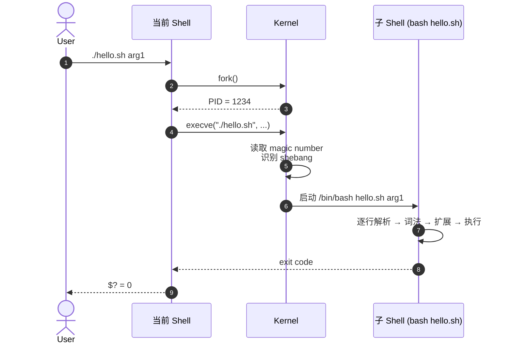

关键要点：

- 脚本本质上是**新启动一个子 Shell 进程**来执行，原 Shell 不受影响（修改的环境变量、cd 都不影响父 Shell）。
- 想在当前 Shell 生效，必须用 `source` 或 `.`，本质是"把脚本内容直接喂给当前进程解析"。
- shebang 行决定了**实际使用的解释器**，而 `bash xx.sh` 这种执行方式会**忽略 shebang**。

### 11.6 安全脚本骨架

```bash
#!/usr/bin/env bash
set -euo pipefail
IFS=$'\n\t'

# 必需变量校验
: "${API_KEY:?need API_KEY}"

# 日志
log() { printf '%s %s\n' "$(date '+%F %T')" "$*" >&2; }

# 错误处理 trap
cleanup() { log "cleaning up"; rm -f /tmp/lockfile; }
trap cleanup EXIT
trap 'log "interrupted"; exit 130' INT

# 主逻辑
main() {
  log "started"
  # do something
  log "done"
}

main "$@"
```

---

## 十二、Shell 与编程语言互调

Shell 脚本经常作为"粘合剂"，需要被各语言调用，或反向调用各语言。

### 12.1 Python

```python
import subprocess

# 推荐：subprocess.run，捕获结果
result = subprocess.run(
    ["ls", "-l", "/tmp"],
    capture_output=True, text=True, check=True
)
print(result.stdout)

# Shell 表达式（带管道、变量等），需要 shell=True，但要警惕命令注入
subprocess.run("ps aux | grep nginx", shell=True, check=True)
```

### 12.2 Node.js

```javascript
const { exec, execFile, spawn } = require('node:child_process');
const { promisify } = require('node:util');

// 一次性命令
const execAsync = promisify(exec);
const { stdout } = await execAsync('git log --oneline -5');

// 长任务、流式输出
const child = spawn('tail', ['-f', '/var/log/app.log']);
child.stdout.on('data', (chunk) => process.stdout.write(chunk));
```

### 12.3 Java

```java
// 现代写法：ProcessBuilder
ProcessBuilder pb = new ProcessBuilder("ls", "-l", "/tmp");
pb.redirectErrorStream(true);
Process p = pb.start();
try (var br = new BufferedReader(new InputStreamReader(p.getInputStream()))) {
    br.lines().forEach(System.out::println);
}
int code = p.waitFor();

// 注意：必须及时消费 stdout/stderr，否则缓冲区满会死锁
```

### 12.4 Go

```go
out, err := exec.Command("ls", "-l").CombinedOutput()
if err != nil { log.Fatal(err) }
fmt.Println(string(out))
```

| 语言 | 主流 API | 关键坑 |
|---|---|---|
| **Python** | `subprocess.run` / `Popen` | `shell=True` 注入风险；长输出建议用流 |
| **Node.js** | `child_process.spawn/exec` | `exec` 有 maxBuffer 上限；推荐 `spawn` 流式 |
| **Java** | `ProcessBuilder` / `Runtime.exec` | 缓冲区死锁，必须主动消费输出 |
| **Go** | `os/exec.Cmd` | 同样需消费输出避免阻塞 |

通用原则：**优先用参数数组形式而非拼接命令字符串**（避免注入），**用完即关闭流**，**长任务用流式 API 而非一次性 capture**。

---

## 十三、AI 场景下的 Shell

LLM 时代，Shell 反而成了被严重低估的能力。原因有三：

1. **零工具描述成本**：模型训练语料里有海量 bash/CLI 案例，无需在 system prompt 里浪费上千 token 描述工具。
2. **生态最丰富**：grep/sed/awk/jq/curl/git 等几十年沉淀的工具，比任何"AI 专用工具"都成熟。
3. **接口最稳定**：POSIX 标准 50 年没大改，是 Agent 跨环境最稳定的"动作空间"。

### 13.1 Claude Code 等 Agent 的工作模式

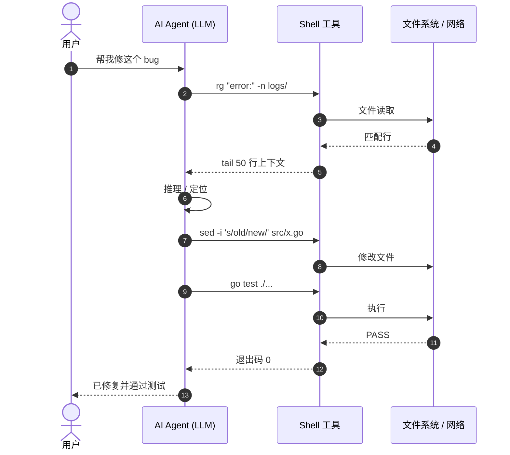

### 13.2 几个典型 AI + Shell 组合

- **Claude Code / Cursor / Aider / OpenCode**：直接通过 shell 工具调用 grep、cat、sed 完成代码搜索、读取、修改、构建。
- **tmux 桥接**：用 60 行 `tmux send-keys` + `capture-pane` 脚本，让 Agent 操作持久会话（如 sudo 后的容器内 shell）——典型场景是"AI 不能 sudo，但人可以先 sudo 进容器，把 Session 让给 Agent 远程驱动"。
- **MCP Shell Server**：把 Shell 包装成 MCP 协议工具暴露给 Agent，提供更结构化的输入/输出 + 权限边界。
- **AI 友好的 CLI**：Warp（AI Terminal）内置 AI 命令建议；GitHub Copilot CLI 提供 `?? "如何用 ffmpeg 转 webm"` 这类自然语言到命令的翻译。

### 13.3 给 Agent 写 Shell 工具的最佳实践

借鉴 ATA 的经验：

- **零依赖**：只依赖 POSIX 工具，不要让 Agent 装一堆 SDK。
- **零侵入**：不改用户已有环境，让人和 Agent 共享同一个工作台。
- **可观察**：每条命令都有清晰的退出码、stdout、stderr，便于 Agent 自检。
- **限流与超时**：避免 Agent 跑死循环，所有命令都设 timeout。
- **审计与回滚**：危险操作（rm/git push -f）需二次确认或写日志。

---

## 十四、Shell 与 CLI 的关系

这两个词常被混用，但有微妙差别：

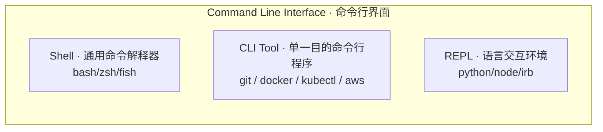

- **CLI（Command Line Interface）**：一种**用户界面形式**——通过键盘输入文本命令来交互。Shell 是其中最通用的一种，但 git、kubectl、aws 这类**单一目的的命令行程序**也是 CLI 工具。
- **Shell**：是**程序**，是 CLI 这种界面形式背后的"解释引擎"。Shell 既可以独立运行（敲 `ls`），也可以**承载其他 CLI 工具**（`git status` 实际是 Shell 调用 git 这个 CLI Tool）。

简言之：**所有 Shell 都是 CLI，但不是所有 CLI 都是 Shell**。

---

## 十五、云 Shell

云 Shell 是云原生时代对 Shell 的"网页化"。

### 15.1 是什么

云 Shell（Cloud Shell）是云厂商提供的**浏览器内置 Linux 终端**，无需本地安装即可管理云资源。代表产品：

- **阿里云 Cloud Shell**：`shell.aliyun.com`，免费。
- **AWS CloudShell**：AWS 控制台内置。
- **Azure Cloud Shell**：Azure Portal 内置。
- **Google Cloud Shell**：GCP Console 内置。

### 15.2 实现原理

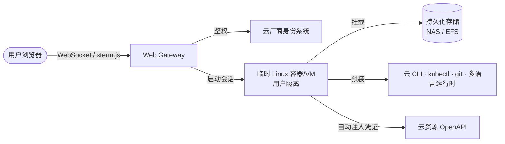

关键设计：

- **用户隔离**：每个用户独立的虚拟机/容器，互相不可见。
- **生命周期短**：通常 20 分钟~1 小时无操作即销毁，下次重启重建。
- **持久存储**：通过挂载用户专属的对象存储/NAS（如阿里云 5GB 免费 NAS）实现 home 目录持久化。
- **预装工具**：阿里云 CLI、Terraform、kubectl、ack-cli、多语言 SDK 等开箱即用。
- **凭证自动注入**：自动用当前登录账号的临时 AK 完成认证，无需 `aliyun configure`。

### 15.3 与本地 Shell 的关系

云 Shell 本质就是一个跑在云端的 bash/zsh + Web 终端协议（多基于 xterm.js + WebSocket），底层依然是同样的 Shell，只是宿主从你的笔记本变成了云上一个临时容器。

适合场景：

- **临时运维**：随时随地通过浏览器管理云资源。
- **快速试用**：试新工具不污染本地环境。
- **培训演示**：分享一个可点链接立刻进入的 Linux 环境。
- **跨设备**：iPad / Chromebook 也能写代码。

不适合场景：

- 长时间运行任务（会话超时会断）。
- 大量本地数据处理（上传下载慢）。
- 严格内网环境（云上无法连接内部服务）。

---

## 十六、Shell 实战 Demo

### 16.1 接手新项目第一步

```bash
#!/bin/bash
set -e
echo "### 项目基本信息"
[ -f README.md ] && head -30 README.md

echo -e "\n### 目录结构"
find . -maxdepth 3 -type d | grep -v '^\./\.' | sort

echo -e "\n### 代码规模"
for ext in py js ts go java; do
  count=$(find . -name "*.${ext}" -not -path "*/node_modules/*" -not -path "*/.git/*" | wc -l)
  [ "$count" -gt 0 ] && echo "  .${ext}: ${count} 个文件"
done

echo -e "\n### 近期提交"
git log --oneline -10 2>/dev/null

echo -e "\n### 待处理事项"
rg "TODO|FIXME|HACK" --type py -l 2>/dev/null | head -10
```

### 16.2 日志高频错误 TopN

```bash
grep "ERROR" app.log \
  | awk -F'ERROR' '{print $2}' \
  | sed 's/^ *//;s/ *$//' \
  | sort | uniq -c | sort -rn \
  | head -20
```

### 16.3 API 健康监控

```bash
#!/bin/bash
ENDPOINT="https://api.example.com/health"
ALERT_LOG="logs/api_alerts.log"
CHECK_INTERVAL=60

while true; do
  http_code=$(curl -sf -o /dev/null -w "%{http_code}" "$ENDPOINT" 2>/dev/null || echo "000")
  latency=$(curl -sf -o /dev/null -w "%{time_total}" "$ENDPOINT" 2>/dev/null || echo "-1")
  if [ "$http_code" != "200" ] || [ "$(echo "$latency > 2.0" | bc -l)" = "1" ]; then
    echo "$(date '+%F %T') | http=${http_code} latency=${latency}s | ALERT" \
      | tee -a "$ALERT_LOG"
  fi
  sleep "$CHECK_INTERVAL"
done
```

### 16.4 批量并行处理 + 结果聚合

```bash
#!/bin/bash
set -euo pipefail
INPUT_DIR="data/raw"
OUTPUT_DIR="data/processed"
FINAL="data/merged_result.json"
mkdir -p "$OUTPUT_DIR"

process_file() {
  local f=$1
  local out="${OUTPUT_DIR}/$(basename "${f%.csv}").json"
  python etl/process.py "$f" > "$out"
}
export -f process_file
export OUTPUT_DIR

find "$INPUT_DIR" -name "*.csv" \
  | xargs -P 8 -I {} bash -c 'process_file "$@"' _ {}

# 合并结果（jq）
cat "${OUTPUT_DIR}"/*.json | jq -s '
  flatten
  | group_by(.category)
  | map({
      category: .[0].category,
      count: length,
      total_amount: (map(.amount) | add),
      avg_amount: (map(.amount) | add / length)
    })
  | sort_by(-.total_amount)
' > "$FINAL"
```

### 16.5 60 行 tmux 桥接，让 AI Agent 进容器

灵感来自 ATA 文章《用 60 行 Shell，让 AI Agent 自己钻进我的开发容器写代码》，核心思想：人完成一次性的 `sudo` 进入容器，把 tmux 会话挂后台；AI Agent 通过 `tmux send-keys / capture-pane` 远程驱动。

```bash
#!/bin/bash
# td.sh —— AI Agent 的 tmux 传声筒
SESSION="${SESSION:-ddev}"

send() {                 # 异步发命令
  tmux send-keys -t "$SESSION" "$1" Enter
}

run() {                  # 同步发命令，等 prompt
  local cmd="$1" timeout="${2:-60}" elapsed=0
  send "$cmd"
  while (( elapsed < timeout )); do
    local last=$(tmux capture-pane -t "$SESSION" -p | tail -n 1)
    [[ "$last" =~ [\$\#\>]\ ?$ ]] && break
    sleep 1; (( elapsed++ ))
  done
}

log() {                  # 读屏幕最近 N 行
  local n="${1:-50}"
  tmux capture-pane -t "$SESSION" -p -S "-${n}"
}

status() {
  tmux has-session -t "$SESSION" 2>/dev/null && echo alive || echo dead
}

case "$1" in
  send) shift; send "$*" ;;
  run)  shift; run "$@" ;;
  log)  shift; log "$@" ;;
  status) status ;;
  *) echo "usage: td.sh {send|run|log|status} ..."; exit 1 ;;
esac
```

价值在于"轻"——零依赖、零配置、零侵入，跨 Agent 复用，让 AI 直接接入你已经在用的开发环境，而不是另起炉灶。

---

## 十七、总结

回到开头那张分层图，Shell 的核心价值始终如一：

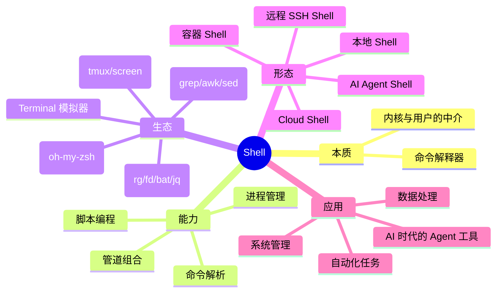

几点写在最后的思考：

- **Shell 没过时，反而越发不可替代**——它是 50 年的 POSIX 标准的活载体，是 AI Agent 跨环境最稳定的"动作空间"。
- **学 Shell 不是学命令，是学"组合"**——单个命令简单，难的是看到一个需求能秒拼出 `find ... | xargs ... | awk ... | sort | uniq -c | sort -rn | head` 这样的流水线。
- **配置文件加载顺序是隐形地雷**——`~/.zshrc` vs `~/.zshenv` vs `~/.zprofile` 的差别，决定了你在 VSCode、cron、SSH 三种场景下能不能找到命令。
- **AI 不需要重新发明 tmux**——很多"AI 工具"试图替代 Linux 几十年沉淀的基础设施，但更聪明的做法是把 AI 接到这些设施上。

---

## 参考文档

### 公开资料

- [Shell 教程 · 菜鸟教程](https://www.runoob.com/linux/linux-shell.html)
- [面向初学者的 Linux Shell——解释 Bash、Zsh 和 Fish · freeCodeCamp](https://www.freecodecamp.org/chinese/news/linux-shells-explained/)
- [一文搞懂 Linux shell 编程 · 知乎](https://zhuanlan.zhihu.com/p/509837290)
- [30min_guides/shell.md · GitHub](https://github.com/qinjx/30min_guides/blob/master/shell.md)
- [什么是 Shell？怎么编写和执行 Shell 脚本？· 腾讯云开发者社区](https://cloud.tencent.com/developer/article/2439739)
- [操作系统 Shell · IBM AIX 文档](https://www.ibm.com/docs/zh/aix/7.3.0?topic=administration-operating-system-shells)
- [Bash Reference Manual · GNU](https://www.gnu.org/software/bash/manual/)
- [CLI、Terminal、Shell、TTY 概念辨析 · Tenloy's Blog](https://tenloy.github.io/2021/04/13/Command-Line.html)
- [云命令行 Cloud Shell 是什么 · 阿里云](https://help.aliyun.com/zh/cloud-shell/what-is-the-cloud-command-line)
- [AWS CloudShell 用户指南](https://docs.aws.amazon.com/zh_cn/cloudshell/latest/userguide/welcome.html)
- [什么是 Azure Cloud Shell · Microsoft Learn](https://learn.microsoft.com/zh-cn/azure/cloud-shell/overview)
- [Node.js child_process 文档](https://nodejs.org/api/child_process.html)

### 进阶阅读

- 《Linux Command Line and Shell Scripting Bible》——Richard Blum
- [Advanced Bash-Scripting Guide](https://tldp.org/LDP/abs/html/)
- [pure-bash-bible](https://github.com/dylanaraps/pure-bash-bible)——只用 bash 内建特性的"纯 bash 圣经"
