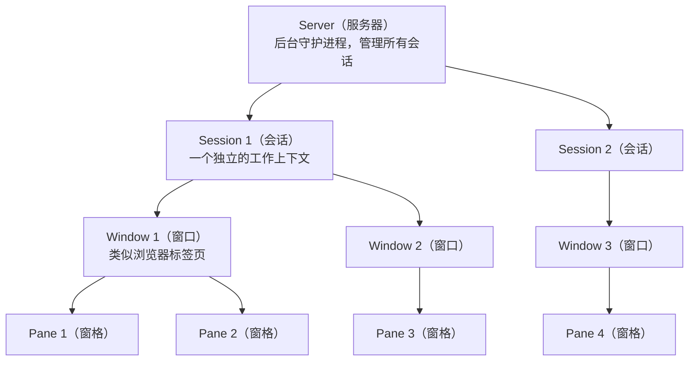
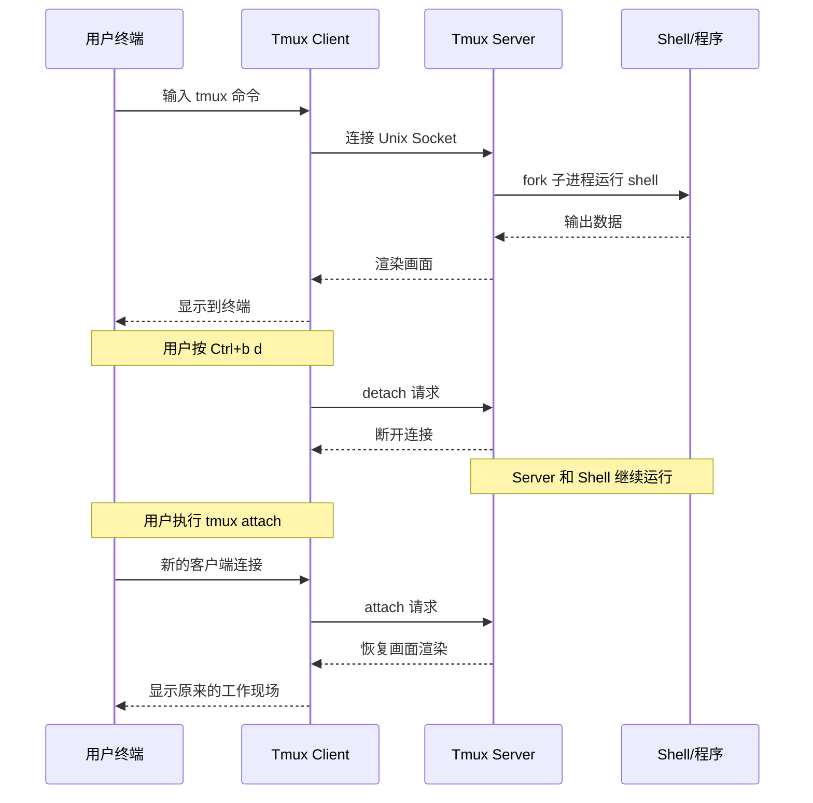
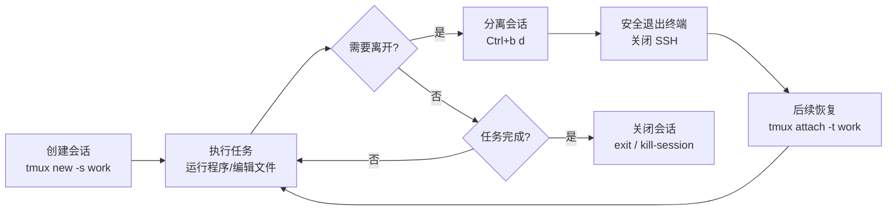
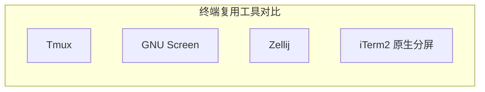
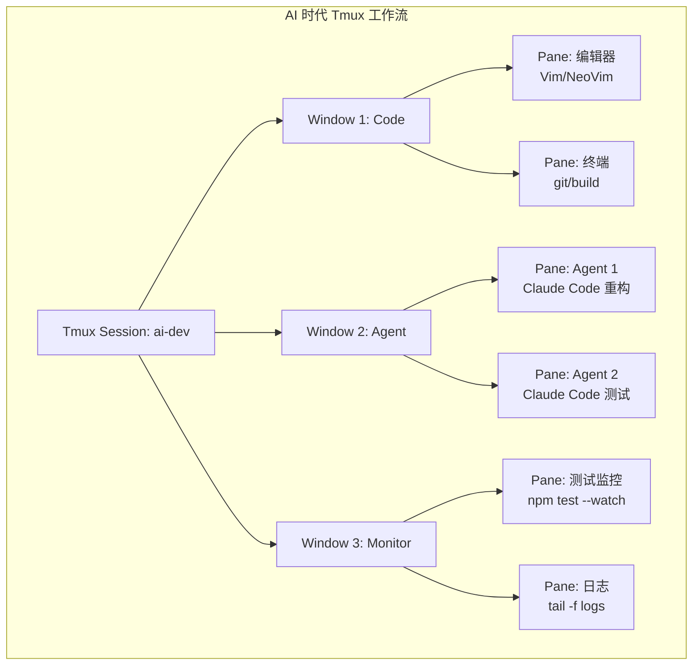

## Tmux 使用教程

### Tmux 是什么

Tmux（Terminal Multiplexer，终端复用器）是一款运行在终端中的工具，允许用户在单个终端窗口内创建、管理和切换多个虚拟终端会话。它最核心的能力是将"会话"与"终端窗口"解绑——即使关闭了终端窗口或断开了网络连接，Tmux 中运行的程序和任务仍然在后台继续执行，用户随时可以重新连接回原来的工作现场。

简单来说，Tmux 解决了以下痛点：SSH 远程登录服务器执行长时间任务时，一旦网络中断或误关终端窗口，所有正在运行的进程就会随之终止。有了 Tmux，你可以放心地将会话"挂起"（detach），之后再从任何地方"恢复"（attach），一切状态都完好如初。

---

### Tmux 产生背景和发展历程

在 Tmux 出现之前，Unix/Linux 世界中最知名的终端复用工具是 GNU Screen（1987 年首次发布）。Screen 功能强大但代码老旧、配置语法复杂、维护更新缓慢，用户社区长期呼唤一个更现代的替代品。

Tmux 由 Nicholas Marriott 于 2007 年开始开发，并以 ISC 许可证（后改为 BSD 许可证）开源发布。它的设计目标是成为 Screen 的现代替代品，具备更清晰的代码架构、更灵活的配置系统和更活跃的社区支持。

发展里程碑：

- **2007 年**：Tmux 首次发布，采用 C/S（客户端-服务器）架构
- **2009 年**：OpenBSD 将 Tmux 纳入基础系统
- **2012 年（v1.7）**：引入选择模式改进，支持更灵活的复制粘贴
- **2013 年（v1.8）**：引入 `zoom` 功能（窗格最大化/恢复）
- **2015 年（v2.1）**：统一鼠标模式，`set -g mouse on` 一行即可启用全部鼠标功能
- **2016 年（v2.3）**：改进条件表达式和 hook 机制
- **2020 年（v3.1）**：引入弹出窗口（popup）功能
- **2022 年（v3.3）**：支持六色/真彩扩展和更多样式选项
- **2024 年（v3.4+）**：持续优化性能、支持更丰富的样式和事件钩子

目前 Tmux 由社区活跃维护，GitHub 仓库地址为 https://github.com/tmux/tmux ，已成为开发者和运维工程师的标配工具。

---

### Tmux 核心功能特性

Tmux 的核心功能可以概括为以下几个方面：

**会话持久化（Session Persistence）**：将终端会话与物理窗口解绑，支持断开后台运行、随时恢复。远程 SSH 场景下网络中断不再丢失工作进度。

**终端复用（Terminal Multiplexing）**：在一个终端窗口中管理多个虚拟终端。支持窗口（Window）切换和窗格（Pane）分屏，实现一屏多用。

**会话共享（Session Sharing）**：多个用户可以同时连接同一个 Tmux 会话，实现实时协作、结对编程或远程教学。

**高度可定制（Customization）**：通过 `~/.tmux.conf` 配置文件可以自定义快捷键、状态栏、颜色主题、行为参数等几乎所有方面。

**插件生态（Plugin Ecosystem）**：通过 TPM（Tmux Plugin Manager）管理丰富的社区插件，扩展会话持久化、自动备份、系统监控等功能。

**脚本化与自动化（Scriptability）**：支持通过命令行和脚本批量创建会话、窗口、窗格，自动化工作环境搭建。

---

### Tmux 下载安装方法

#### 安装

根据操作系统不同，选择对应的安装方式：

```bash
# macOS（通过 Homebrew）
brew install tmux

# Ubuntu / Debian
sudo apt-get install tmux

# CentOS / Fedora / RHEL
sudo yum install tmux
# 或使用 dnf（Fedora 22+）
sudo dnf install tmux

# Arch Linux
sudo pacman -S tmux

# 从源码编译安装（获取最新版本）
git clone https://github.com/tmux/tmux.git
cd tmux
sh autogen.sh
./configure && make
sudo make install
```

安装完成后验证：

```bash
tmux -V
# 输出示例：tmux 3.4
```

#### 更新

```bash
# macOS
brew upgrade tmux

# Ubuntu / Debian
sudo apt-get update && sudo apt-get upgrade tmux

# 源码编译方式则拉取最新代码重新编译即可
```

#### 卸载

```bash
# macOS
brew uninstall tmux

# Ubuntu / Debian
sudo apt-get remove tmux

# CentOS
sudo yum remove tmux
```

---

### Tmux 配置文件和配置方法

Tmux 的配置文件路径为 `~/.tmux.conf`（用户级）或 `/etc/tmux.conf`（系统级）。修改配置后通过以下命令使其生效：

```bash
tmux source-file ~/.tmux.conf
```

或在 Tmux 内按 `Ctrl+b :` 进入命令模式后输入 `source-file ~/.tmux.conf`。

#### 推荐基础配置

```bash
# ===== 基础设置 =====
# 修改前缀键为 Ctrl+a（更顺手）
set -g prefix C-a
unbind C-b
bind C-a send-prefix

# 设置窗口和窗格起始编号为 1（0 太远）
set -g base-index 1
setw -g pane-base-index 1

# 启用 256 色支持
set -g default-terminal "screen-256color"
set -ga terminal-overrides ",xterm-256color:Tc"

# 减少 escape 键延迟（对 Vim 用户重要）
set -sg escape-time 0

# 增加历史记录行数
set -g history-limit 50000

# 启用鼠标支持（v2.1+）
set -g mouse on

# ===== 分屏快捷键优化 =====
# 用 | 和 - 替代 % 和 "，更直观
bind | split-window -h -c "#{pane_current_path}"
bind - split-window -v -c "#{pane_current_path}"
unbind '"'
unbind %

# 新建窗口时保持当前路径
bind c new-window -c "#{pane_current_path}"

# ===== Vim 风格面板切换 =====
bind -r h select-pane -L
bind -r j select-pane -D
bind -r k select-pane -U
bind -r l select-pane -R

# ===== 面板大小调整 =====
bind -r H resize-pane -L 5
bind -r J resize-pane -D 5
bind -r K resize-pane -U 5
bind -r L resize-pane -R 5

# ===== 复制模式使用 Vi 键绑定 =====
setw -g mode-keys vi
bind -T copy-mode-vi v send-keys -X begin-selection
bind -T copy-mode-vi y send-keys -X copy-selection-and-cancel

# ===== 状态栏美化 =====
set -g status-style "bg=colour235,fg=colour136"
set -g status-left "#[fg=green]#S "
set -g status-right "#[fg=yellow]%Y-%m-%d #[fg=green]%H:%M"
set -g status-interval 60

# 关闭窗口自动重命名（避免名称跳动）
setw -g automatic-rename off
set -g allow-rename off

# ===== 插件管理（TPM）=====
set -g @plugin 'tmux-plugins/tpm'
set -g @plugin 'tmux-plugins/tmux-sensible'
set -g @plugin 'tmux-plugins/tmux-resurrect'
set -g @plugin 'tmux-plugins/tmux-continuum'

# 自动恢复会话
set -g @continuum-restore 'on'

# 初始化 TPM（必须放在配置文件最底部）
run '~/.tmux/plugins/tpm/tpm'
```

#### TPM 插件管理器安装

```bash
# 克隆 TPM 仓库
git clone https://github.com/tmux-plugins/tpm ~/.tmux/plugins/tpm

# 重新加载配置
tmux source ~/.tmux.conf

# 在 Tmux 中按 prefix + I（大写）安装插件
```

TPM 快捷操作：

| 快捷键 | 功能 |
|--------|------|
| `prefix + I` | 安装新插件 |
| `prefix + U` | 更新插件 |
| `prefix + alt + u` | 卸载已移除的插件 |

常用插件推荐：

| 插件 | 功能 |
|------|------|
| `tmux-plugins/tmux-sensible` | 合理的默认配置集合 |
| `tmux-plugins/tmux-resurrect` | 会话持久化，保存/恢复窗口布局和程序 |
| `tmux-plugins/tmux-continuum` | 自动定时保存会话（基于 Resurrect） |
| `tmux-plugins/tmux-yank` | 系统剪贴板集成 |
| `tmux-plugins/tmux-pain-control` | 面板控制增强 |
| `tmux-plugins/tmux-cpu` | 状态栏显示 CPU/内存使用率 |

---

### Tmux 核心概念和原理结构

#### 架构模型

Tmux 采用经典的 **客户端-服务器（C/S）** 架构。当你第一次运行 `tmux` 命令时，它会在后台启动一个服务器进程（Server），然后创建一个客户端连接到这个服务器。服务器负责管理所有的会话和窗口状态，客户端只负责显示和输入转发。这就是为什么关闭终端后会话还能存活——服务器进程仍在后台运行。

#### 核心概念层级

Tmux 的对象层级关系如下：



各层级概念详解：

**Server（服务器）**：Tmux 的后台守护进程。每个用户通常只有一个 Server 实例在运行，它通过 Unix socket 与客户端通信，管理旗下所有 Session 的生命周期。

**Session（会话）**：一个逻辑工作环境。每个 Session 拥有独立的窗口组，可以被 detach（分离）和 attach（恢复）。典型用法是为不同项目创建不同的 Session。

**Window（窗口）**：Session 中的一个"标签页"。每个 Window 占据整个终端屏幕，在底部状态栏以编号和名称显示。可以在多个 Window 间快速切换。

**Pane（窗格）**：Window 内的一个分屏区域。一个 Window 可以水平或垂直拆分为多个 Pane，每个 Pane 运行独立的 shell 或程序。

#### C/S 通信机制



---

### Tmux 使用方法和常用命令操作

#### 基本启动与退出

```bash
tmux                          # 启动新会话（默认编号 0, 1, 2...）
tmux new -s work              # 启动并命名为 "work" 的会话
exit                          # 退出当前窗格（窗格全部退出则窗口关闭）
```

#### 前缀键机制

Tmux 所有快捷键都需要先按下**前缀键**（默认 `Ctrl+b`），松开后再按功能键。本文后续用 `prefix` 表示前缀键。

#### 会话管理

| 命令 / 快捷键 | 功能 |
|----------------|------|
| `tmux new -s name` | 创建命名会话 |
| `tmux ls` | 列出所有会话 |
| `tmux attach -t name` | 恢复指定会话 |
| `tmux kill-session -t name` | 关闭指定会话 |
| `tmux switch -t name` | 切换到指定会话 |
| `tmux rename-session -t old new` | 重命名会话 |
| `prefix d` | 分离当前会话（detach） |
| `prefix s` | 列出会话并交互式选择 |
| `prefix $` | 重命名当前会话 |

#### 窗口管理

| 命令 / 快捷键 | 功能 |
|----------------|------|
| `tmux new-window -n name` | 新建命名窗口 |
| `tmux select-window -t num` | 切换到指定编号窗口 |
| `prefix c` | 创建新窗口 |
| `prefix n` | 下一个窗口 |
| `prefix p` | 上一个窗口 |
| `prefix 0-9` | 切换到指定编号窗口 |
| `prefix w` | 窗口列表（交互式选择） |
| `prefix ,` | 重命名当前窗口 |
| `prefix &` | 关闭当前窗口（需确认） |
| `prefix f` | 搜索窗口 |

#### 窗格管理

| 命令 / 快捷键 | 功能 |
|----------------|------|
| `tmux split-window -v` | 上下拆分 |
| `tmux split-window -h` | 左右拆分 |
| `prefix "` | 上下拆分窗格 |
| `prefix %` | 左右拆分窗格 |
| `prefix 方向键` | 切换到对应方向的窗格 |
| `prefix o` | 切换到下一个窗格 |
| `prefix ;` | 切换到上一个窗格 |
| `prefix z` | 当前窗格最大化 / 恢复 |
| `prefix x` | 关闭当前窗格 |
| `prefix !` | 将当前窗格独立为新窗口 |
| `prefix q` | 显示窗格编号 |
| `prefix {` | 与上一个窗格交换位置 |
| `prefix }` | 与下一个窗格交换位置 |
| `prefix space` | 在预设布局间循环切换 |
| `prefix Ctrl+方向键` | 按方向调整窗格大小 |

#### 复制模式

进入复制模式：`prefix [`，退出：`q` 或 `Enter`，粘贴：`prefix ]`

设置 Vi 模式后（`setw -g mode-keys vi`）：

| 按键 | 功能 |
|------|------|
| `space` | 开始选择 |
| `Enter` | 复制选中内容 |
| `v` | 开始选择（需配置） |
| `y` | 复制并退出（需配置） |
| `h/j/k/l` | Vim 风格移动光标 |
| `/` | 向下搜索 |
| `?` | 向上搜索 |
| `n` | 下一个搜索结果 |
| `Ctrl+f` | 向下翻页 |
| `Ctrl+b` | 向上翻页 |

#### 同步窗格

在命令模式（`prefix :`）中输入：

```
setw synchronize-panes on
```

开启后，所有窗格会同步接收键盘输入，非常适合需要在多台服务器上执行相同命令的场景。再次执行 `setw synchronize-panes off` 关闭。

#### 其他实用命令

```bash
tmux list-keys              # 列出所有快捷键绑定
tmux list-commands          # 列出所有 tmux 命令
tmux info                   # 显示当前 tmux 环境信息
tmux source-file ~/.tmux.conf  # 重新加载配置
tmux kill-server            # 关闭 tmux 服务器（终止所有会话）
```

---

### Tmux 应用场景

**远程服务器长时间任务**：通过 SSH 登录远程服务器执行编译、训练模型、数据迁移等耗时任务时，使用 Tmux 可以放心断开连接，任务在后台继续运行。

**多任务并行工作**：开发时同时需要运行前端开发服务器、后端 API、数据库、日志监控等多个进程，通过不同窗格或窗口组织，一目了然。

**结对编程与远程教学**：多人通过 SSH 连接同一个 Tmux 会话，实现实时共享终端画面，非常适合代码审查和技术教学。

**运维批量操作**：利用同步窗格功能，同时向多台服务器发送相同命令，提高批量运维效率。

**工作环境标准化**：通过 Tmux 脚本或 tmuxp/tmuxinator 工具，定义标准化的工作环境布局（会话名、窗口数、窗格排列、自动启动的命令），一键恢复开发环境。

**HPC/超算集群使用**：在高性能计算集群上提交作业、监控运行状态时，Tmux 保证了网络不稳定时的作业安全。

---

### Tmux 实战使用 Demo Case

#### Demo 1：Web 开发工作环境一键搭建

创建一个脚本 `dev-env.sh`，自动搭建包含前端、后端、数据库监控的工作环境：

```bash
#!/bin/bash
SESSION="webdev"

# 创建会话，第一个窗口命名为 editor
tmux new-session -d -s $SESSION -n editor

# 第一个窗口：打开编辑器
tmux send-keys -t $SESSION:editor "vim ." Enter

# 第二个窗口：前端开发服务器
tmux new-window -t $SESSION -n frontend
tmux send-keys -t $SESSION:frontend "cd frontend && npm run dev" Enter

# 第三个窗口：后端服务 + 日志
tmux new-window -t $SESSION -n backend
tmux send-keys -t $SESSION:backend "cd backend && go run main.go" Enter
tmux split-window -v -t $SESSION:backend
tmux send-keys -t $SESSION:backend.1 "tail -f logs/app.log" Enter

# 第四个窗口：Git 操作
tmux new-window -t $SESSION -n git
tmux send-keys -t $SESSION:git "git status" Enter

# 切换到第一个窗口
tmux select-window -t $SESSION:editor

# 连接会话
tmux attach -t $SESSION
```

#### Demo 2：远程服务器模型训练防断线

```bash
# 1. SSH 登录远程 GPU 服务器
ssh user@gpu-server

# 2. 创建训练会话
tmux new -s training

# 3. 启动训练任务
python train.py --epochs 100 --model resnet50

# 4. 按 Ctrl+b d 分离会话，安全退出 SSH
# 网络断线也不影响训练

# 5. 隔天重新连接查看进度
ssh user@gpu-server
tmux attach -t training
```

#### Demo 3：多服务器同步运维

```bash
# 创建会话
tmux new -s ops

# 拆分为 4 个窗格
tmux split-window -h
tmux split-window -v
tmux select-pane -t 0
tmux split-window -v

# 分别连接不同服务器
tmux send-keys -t 0 "ssh server1" Enter
tmux send-keys -t 1 "ssh server2" Enter
tmux send-keys -t 2 "ssh server3" Enter
tmux send-keys -t 3 "ssh server4" Enter

# 开启同步输入
tmux setw synchronize-panes on

# 现在输入的命令会同时发送到所有服务器
```

#### Demo 4：会话工作流示意



---

### Tmux 相比其他工具有什么优势？

Tmux 的主要竞争者包括 GNU Screen、Zellij 和原生终端分屏（如 iTerm2 分屏）。下面从多个维度进行对比：



| 特性 | Tmux | GNU Screen | Zellij | iTerm2 原生 |
|------|------|------------|--------|-------------|
| 首次发布 | 2007 | 1987 | 2021 | N/A |
| 架构 | C/S 模型 | 单进程 | 插件化 C/S | 终端内置 |
| 配置语法 | 简洁直观 | 复杂老旧 | YAML/KDL | GUI |
| 插件生态 | 丰富（TPM） | 几乎没有 | 内建插件系统 | N/A |
| 脚本化能力 | 强大 | 一般 | 发展中 | AppleScript |
| 会话持久化 | 支持 | 支持 | 支持 | 不支持 |
| 远程使用 | 完美支持 | 完美支持 | 完美支持 | 不支持 |
| 学习曲线 | 中等 | 中等 | 低（有默认 UI） | 低 |
| 社区活跃度 | 非常活跃 | 维护模式 | 活跃 | 活跃 |
| 跨平台 | Linux/macOS/WSL | Linux/macOS | Linux/macOS | 仅 macOS |

**Tmux 的核心优势**：

- 相比 Screen：代码更现代、配置更简洁、功能更丰富（垂直分屏 Screen 很晚才支持）、插件生态完善、社区活跃
- 相比 Zellij：更成熟稳定、服务器环境普遍预装、文档和社区资源更丰富
- 相比原生终端分屏：支持会话持久化、可远程使用、跨终端统一体验、可脚本化自动化

---

### AI 时代下 Tmux 有什么好的使用方法？

随着 AI 编程助手（如 Claude Code、Cursor、GitHub Copilot CLI 等）的普及，Tmux 在 AI 工作流中展现出独特价值：

#### 多 Agent 并行管理

使用 Tmux 为每个 AI Agent 分配独立的窗格或窗口，同时运行多个 AI 编程会话：

```bash
# 创建 AI 工作会话
tmux new -s ai-agents

# 窗格 1：Claude Code 处理后端重构
tmux send-keys "claude" Enter

# 新建窗格：另一个 Agent 处理前端
tmux split-window -h
tmux send-keys "claude" Enter

# 再开一个窗格监控测试
tmux split-window -v
tmux send-keys "npm test -- --watch" Enter
```

#### AI Agent 防断线

AI Agent 执行长时间的代码生成、重构或测试任务时，通过 Tmux 会话保护，确保网络波动不会中断 Agent 的工作：

```bash
# 在 Tmux 中启动 AI Agent 长任务
tmux new -s agent-task
claude "请重构整个认证模块并补充单元测试"
# Ctrl+b d 安全分离，Agent 继续工作
```

#### 结合 tmux-ai-bar 插件监控

社区已有专门面向 AI 多 Agent 场景的工具（如 tmux-ai-bar），可以在 Tmux 状态栏实时显示各 Agent 窗格的运行状态、进度和资源消耗。

#### AI 辅助的 Tmux 配置

利用 AI 助手生成和优化 Tmux 配置：

```
请根据我的工作习惯（Python 开发 + 远程 GPU 服务器训练 + 
多项目切换）为我生成一份 tmux.conf 配置文件
```

#### 使用 fzf + tmux 增强 AI 工具体验

结合 fzf 模糊搜索，快速在多个 Tmux 会话间切换，管理不同 AI 项目上下文：

```bash
# 在 .bashrc/.zshrc 中添加
tm() {
  local session
  session=$(tmux list-sessions -F "#{session_name}" 2>/dev/null | \
    fzf --height 40% --reverse --prompt="Switch session: ") && \
    tmux switch-client -t "$session"
}
```

#### 工作流示意



---

### Tmux 快捷键速查表

以下是最常用快捷键的分类速查（前缀键默认为 `Ctrl+b`）：

#### 会话操作

| 快捷键 | 功能 |
|--------|------|
| `prefix d` | 分离当前会话 |
| `prefix s` | 交互式列出所有会话 |
| `prefix $` | 重命名当前会话 |
| `prefix (` | 切换到上一个会话 |
| `prefix )` | 切换到下一个会话 |

#### 窗口操作

| 快捷键 | 功能 |
|--------|------|
| `prefix c` | 新建窗口 |
| `prefix n` | 下一个窗口 |
| `prefix p` | 上一个窗口 |
| `prefix 0-9` | 切换到对应编号窗口 |
| `prefix w` | 窗口列表 |
| `prefix ,` | 重命名窗口 |
| `prefix &` | 关闭窗口 |
| `prefix f` | 搜索窗口 |

#### 窗格操作

| 快捷键 | 功能 |
|--------|------|
| `prefix "` | 上下拆分 |
| `prefix %` | 左右拆分 |
| `prefix 方向键` | 切换窗格 |
| `prefix o` | 下一个窗格 |
| `prefix ;` | 上一个窗格 |
| `prefix z` | 最大化/恢复窗格 |
| `prefix x` | 关闭窗格 |
| `prefix !` | 窗格独立为窗口 |
| `prefix q` | 显示窗格编号 |
| `prefix space` | 切换布局 |
| `prefix {` | 向前移动窗格 |
| `prefix }` | 向后移动窗格 |

#### 其他

| 快捷键 | 功能 |
|--------|------|
| `prefix ?` | 查看所有快捷键 |
| `prefix :` | 进入命令模式 |
| `prefix t` | 显示时钟 |
| `prefix [` | 进入复制模式 |
| `prefix ]` | 粘贴缓冲区内容 |

---

### Tmux 总结

Tmux 作为终端复用器的标杆工具，历经近 20 年的发展，已从一个 GNU Screen 的替代品成长为开发者工具链中不可或缺的一环。它的核心价值在于：

**稳定性与可靠性**：C/S 架构确保会话独立于终端存活，是远程工作和长时间任务的最佳保障。

**灵活性与可扩展性**：从简单的分屏需求到复杂的多项目工作流管理，Tmux 都能通过配置和插件灵活应对。

**与时俱进**：在 AI Agent 大量涌现的今天，Tmux 天然适合作为多 Agent 的管理平面，提供稳定的运行环境和便捷的监控切换能力。

对于任何经常使用终端的开发者和运维工程师而言，花时间学习和配置 Tmux 都是一笔高回报的投资。建议从基础的会话管理和分屏开始，逐步掌握快捷键和配置定制，最终形成属于自己的高效终端工作流。

---

### 参考文档

- [Tmux 使用教程 - 阮一峰的网络日志](https://www.ruanyifeng.com/blog/2019/10/tmux.html)
- [Tmux 使用介绍 - 上海交大超算平台用户手册](https://docs.hpc.sjtu.edu.cn/login/tmux.html)
- [Linux tmux 命令 | 菜鸟教程](https://www.runoob.com/linux/linux-comm-tmux.html)
- [Tmux 快捷键 & 速查表 & 简明教程](https://gist.github.com/ryerh/14b7c24dfd623ef8edc7)
- [tmux 使用教程 - 知乎](https://zhuanlan.zhihu.com/p/98384704)
- [Mac tmux 最佳实践 - 腾讯云开发者社区](https://cloud.tencent.com/developer/article/2503411)
- [Tmux 使用手册 | louis blog](https://louiszhai.github.io/2017/09/30/tmux/)
- [Tmux 使用教程 | 香港科技大学（广州）HPC AI 智算平台](https://docs.hpc.hkust-gz.edu.cn/docs/tools/tmux/)
- [Tmux Plugin Manager (TPM) - GitHub](https://github.com/tmux-plugins/tpm)
- [Tmux 官方仓库 - GitHub](https://github.com/tmux/tmux)
- [Useful TMUX Plugins - Medium](https://medium.com/@dev-in-trenches/useful-tmux-plugins-which-i-frequently-use-at-work-41a9b46f7bcb)
- [A Quick and Easy Guide to tmux - hamvocke.com](https://www.hamvocke.com/blog/a-quick-and-easy-guide-to-tmux/)
