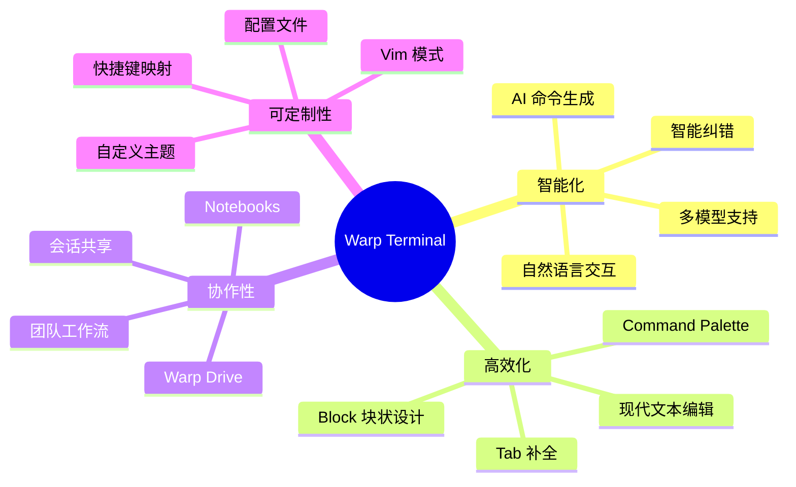
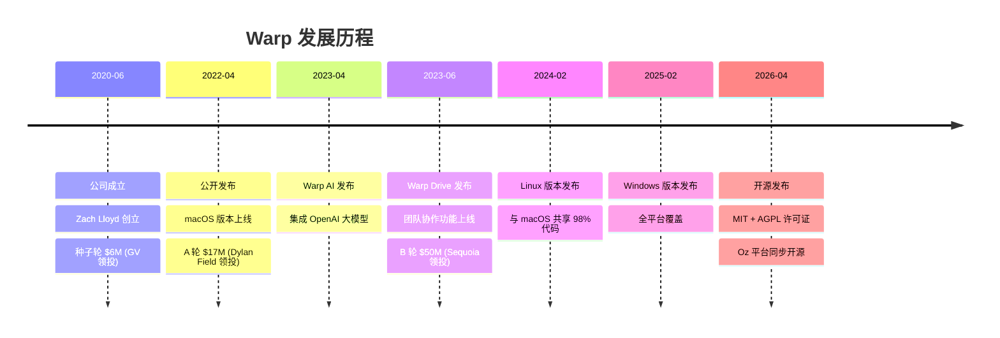
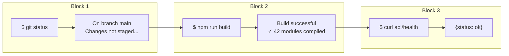
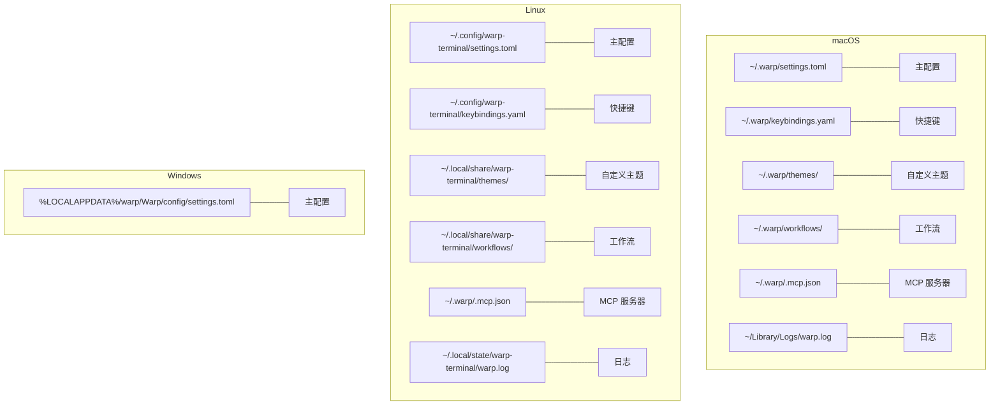
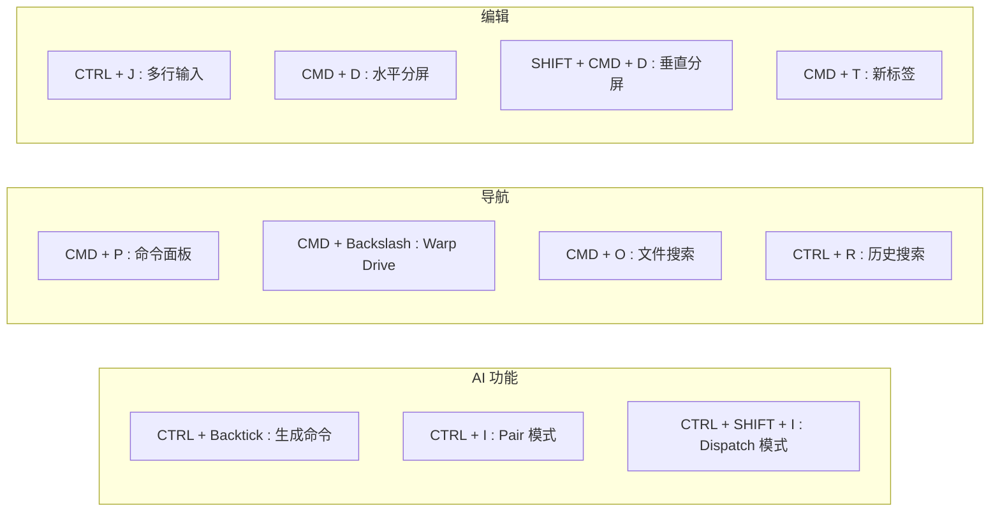
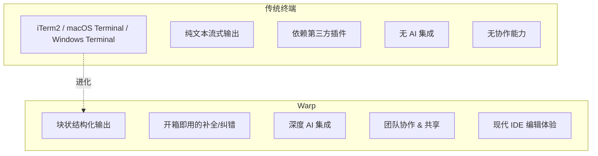
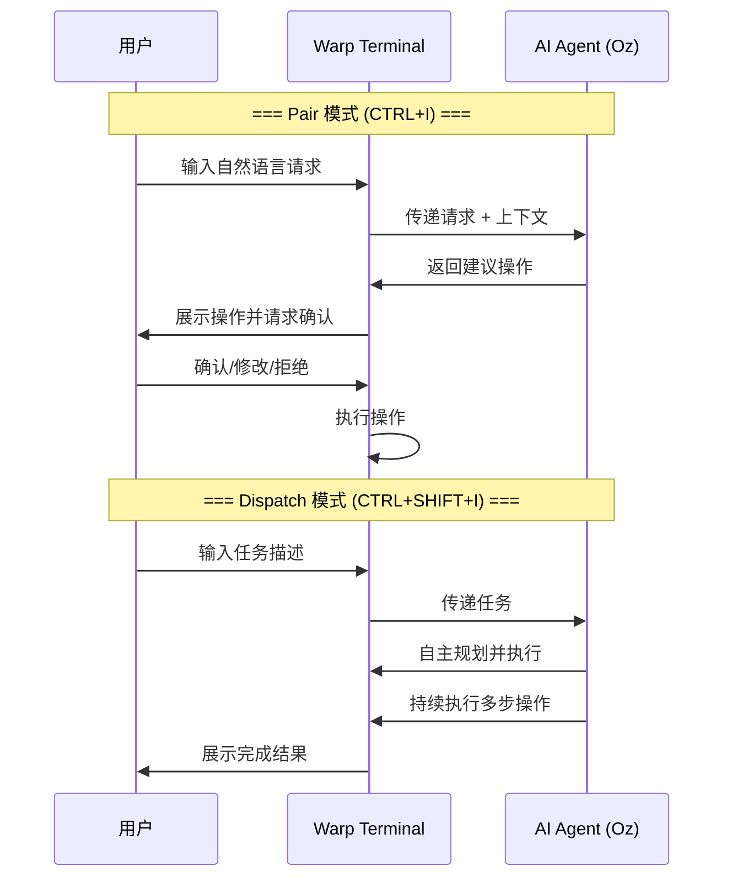
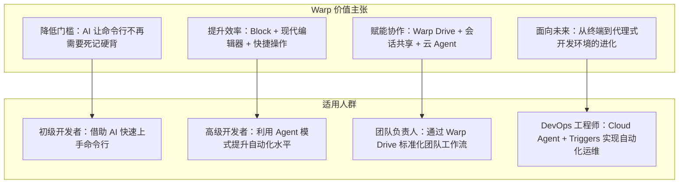

## Warp AI Terminal 使用

### Warp 是什么

Warp 是一款基于 Rust 语言构建的新一代智能终端（Terminal），自称 "The terminal for the 21st century"。它由前 Google 首席工程师 Zach Lloyd 于 2020 年创立，致力于用现代 IDE 的设计思路重新定义命令行体验。Warp 不仅是一个终端模拟器，更是一个集成了 AI 能力、团队协作和现代化编辑体验的 **代理式开发环境（Agentic Development Environment）**。

Warp 的核心理念可以概括为四个方向：智能化（集成 AI，支持自然语言操作）、高效化（用块状结构组织命令与输出）、协作性（通过 Warp Drive 实现团队共享）、可定制性（提供现代编辑器级别的自定义能力）。



目前 Warp 对个人用户完全免费，支持 macOS、Linux 和 Windows 三大平台。2026 年 4 月，Warp 宣布将终端客户端和 Oz 编排平台以 MIT 和 AGPL 许可证开源。

官网地址：https://www.warp.dev/
开源地址：https://github.com/warpdotdev/Warp

---

### Warp 出现背景和发展历程

传统终端工具受历史 TTY（Teletypewriter）模型的限制，长期存在几个核心痛点：键盘优先（忽视鼠标/触摸板输入）、离线操作（缺乏云端协作能力）、纯文本界面（缺少现代 UI 体验）。开发者在日常工作中需要频繁查询命令语法、手动滚动查找历史输出、在不同工具间切换。随着 AI 技术的发展，将大语言模型能力与终端深度融合成为可能，这正是 Warp 诞生的背景。

Warp 选择 Rust 作为开发语言，利用 GPU 加速渲染，从底层重新构建了整个终端体验，而非在现有终端之上做简单的 wrapper。



在投资方面，Warp 获得了包括 Sam Altman、Marc Benioff、Jeff Weiner 在内的知名天使投资人支持，B 轮由 Sequoia Capital 领投，累计融资超过 7300 万美元。

---

### Warp 核心功能

#### Block（块）设计

Block 是 Warp 最具标志性的创新之一。它将 Notion 的"块"概念引入命令行——每条命令及其对应的输出被封装为一个独立的块，块与块之间具有清晰的视觉分隔。

Block 设计的优势在于：可以单独选择、复制、删除或分享某个块的内容；支持在块之间快速跳转导航；可以将某个块的输出生成分享链接（如 `https://app.warp.dev/block/...`）；支持块书签（Bookmark）功能，方便标记重要输出。



常用 Block 操作快捷键（macOS）：

| 快捷键 | 功能 |
|--------|------|
| `CMD-UP` / `CMD-DOWN` | 选择上一个/下一个 Block |
| `SHIFT-CMD-C` | 复制命令 |
| `ALT-SHIFT-CMD-C` | 复制命令输出 |
| `CMD-B` | 书签当前 Block |
| `SHIFT-CMD-S` | 分享选中 Block |
| `CMD-K` | 清除所有 Blocks |

#### 现代文本编辑器

Warp 的输入编辑器提供了类似现代 IDE 的编辑体验：支持鼠标在命令任意位置点击介入、多光标编辑（`CTRL-SHIFT-UP/DOWN` 添加光标）、多行编辑（`CTRL-J` 插入新行）、语法高亮、代码折叠（`ALT-CMD-[/]`）、撤销/重做（`CMD-Z` / `SHIFT-CMD-Z`）。

#### Command Palette

类似 VS Code 的命令面板，通过 `CMD-P`（macOS）或 `CTRL-SHIFT-P`（Windows/Linux）唤起，可快速搜索并执行任何操作。在 Palette 中输入 `#` 可调出 Session 页面，输入 `@` 可快速导航到指定 Session。

#### Warp Drive

Warp Drive 是终端内的协作工作区，用于保存和管理：

- **Notebooks**：交互式笔记本，可组合文本说明和可执行命令
- **Workflows**：可参数化的命令模板，支持团队共享
- **Prompts**：AI 提示词模板
- **环境变量**：集中管理项目环境配置

通过 `CMD-\`（macOS）或 `CTRL-SHIFT-\`（Windows/Linux）打开。

#### 智能补全与纠错

Warp 提供开箱即用的命令补全能力：Tab 键既能补全命令和路径，又能展示智能建议；对于输错的参数和选项，Tab 一键纠正；支持基于历史记录和上下文的智能推荐。这些功能无需额外安装插件，且可在远程 SSH 环境中使用。

#### Session 管理

Session 功能支持保存和恢复完整的终端工作环境，包括多标签页、分屏布局、远程连接等。配置使用 YAML 格式，存放于 `~/.warp/launch_configurations/` 目录。

Session 配置示例：

```yaml
name: Dev-Environment
windows:
  - tabs:
      - title: Frontend
        layout:
          split_direction: vertical
          panes:
            - cwd: ~/projects/frontend
              commands:
                - exec: "npm run dev"
            - cwd: ~/projects/frontend
              commands:
                - exec: "npm run test -- --watch"
      - title: Backend
        layout:
          panes:
            - cwd: ~/projects/backend
              commands:
                - exec: "python manage.py runserver"
```

#### Workflow 工作流

Workflow 将命令行操作流程固化为可复用的模板，使用 YAML 格式定义，存放于 `~/.warp/workflows/` 目录。通过 `CTRL-SHIFT-R` 打开 Workflow 面板。

Workflow 定义示例：

```yaml
name: Docker Cleanup
command: docker system prune -a --volumes --filter "until={{hours}}h"
arguments:
  - name: hours
    description: Remove resources older than this many hours
    default_value: "24"
tags:
  - docker
  - cleanup
description: Clean up unused Docker resources
author: DevTeam
shells: []
```

---

### Warp 下载和安装方法

#### 系统要求

| 平台 | 最低要求 |
|------|----------|
| macOS | Intel 或 Apple Silicon，macOS 10.14 及以上，支持 Metal |
| Windows | Windows 10 版本 1809 (build 17763) 及以上，支持 ConPTY |
| Linux | glibc >= 2.31，支持 OpenGL ES 3.0+ 或 Vulkan |

Linux 兼容发行版包括 Ubuntu 20.04+、Debian 11+、Fedora 32+、Arch Linux 等。

#### 安装方法

**macOS：**

```bash
# 方式一：Homebrew（推荐）
brew install --cask warp

# 方式二：从官网下载 DMG 安装包
# 访问 https://www.warp.dev/download 下载后拖入 Applications 文件夹
```

**Windows：**

```powershell
# 方式一：WinGet
winget install Warp.Warp

# 方式二：从官网下载安装程序运行
```

**Linux（以 Ubuntu/Debian 为例）：**

```bash
# 方式一：下载 .deb 包安装（自动配置 apt 源）
sudo apt install ./warp-terminal_x86_64.deb

# 方式二：手动添加 apt 源
wget -qO- https://releases.warp.dev/linux/keys/warp.asc | gpg --dearmor > /usr/share/keyrings/warp.gpg
echo "deb [signed-by=/usr/share/keyrings/warp.gpg] https://releases.warp.dev/linux/deb stable main" | sudo tee /etc/apt/sources.list.d/warp.list
sudo apt update && sudo apt install warp-terminal

# 方式三：AppImage（免安装）
curl -LO https://app.warp.dev/download?package=appimage
chmod +x Warp-*.AppImage
./Warp-*.AppImage
```

其他 Linux 发行版也有对应的 RPM（Fedora/RHEL）、pacman（Arch）、zypper（OpenSUSE）安装方式。

#### 从源码构建

```bash
git clone https://github.com/warpdotdev/warp.git
cd warp
./script/bootstrap
cargo run
```

需要 Xcode（macOS）、Rust 工具链、protoc 等前置依赖。

#### 更新

Warp 内置自动更新功能，启动时会检测并应用更新。也可以通过 Homebrew 手动更新：`brew upgrade --cask warp`。

#### 卸载

**macOS：**

```bash
# 卸载应用
brew uninstall warp
# 或手动删除：sudo rm -r /Applications/Warp.app

# 清除配置和数据
defaults delete dev.warp.Warp-Stable
rm -r $HOME/.warp
rm -r $HOME/Library/Logs/warp.log
rm -r "$HOME/Library/Group Containers/2BBY89MBSN.dev.warp/Library/Application Support/dev.warp.Warp-Stable"
```

**Linux：**

```bash
# 卸载
sudo apt remove warp-terminal  # Debian/Ubuntu
# sudo dnf remove warp-terminal  # Fedora
# sudo pacman -R warp-terminal   # Arch

# 清除数据
rm -r ${XDG_CONFIG_HOME:-$HOME/.config}/warp-terminal
rm -r ${XDG_STATE_HOME:-$HOME/.local/state}/warp-terminal
rm -r ${XDG_DATA_HOME:-$HOME/.local/share}/warp-terminal
rm -r $HOME/.warp
```

**Windows（PowerShell）：**

```powershell
winget uninstall Warp.Warp
Remove-Item -Path "HKCU:\Software\Warp.dev\Warp" -Recurse -Force
Remove-Item -Path "$env:LOCALAPPDATA\warp\Warp" -Recurse -Force
Remove-Item -Path "$env:APPDATA\warp\Warp" -Recurse -Force
Remove-Item -Path "$env:USERPROFILE\.warp" -Recurse -Force
```

---

### Warp 配置文件和初始化配置

#### 配置文件格式

Warp 使用 **TOML v1.1** 语法作为配置文件格式（`settings.toml`）。配置文件支持热重载——保存文件后 Warp 自动应用变更，无需重启。同时，通过 UI 面板（`CMD-,`）修改的设置也会同步写入该文件，二者保持双向同步。

#### 文件路径



Warp 将文件分为三类管理：可移植用户数据（主题、Workflow、Tab 配置）、不可移植配置（设置、快捷键）、不可移植状态（日志、数据库、索引）。

#### 配置示例

```toml
# === 外观设置 ===
[appearance.themes]
theme = "cyber_wave"

[appearance.text]
font_name = "JetBrains Mono"
font_size = 14.0
ligature_rendering_enabled = true
font_weight = "normal"
line_height = 1.3

[appearance.cursor]
# 可选: "block", "bar", "underline"
cursor_shape = "bar"

# === 通用设置 ===
[general]
restore_windows_and_tabs_on_startup = true
tab_position = "top"

# === 终端行为 ===
[terminal]
scrollback_lines = 10000

[terminal.input]
syntax_highlighting_enabled = true
honor_ps1 = false

# === 文本编辑 ===
[text_editing]
vim_mode_enabled = false

# === Agent/AI 设置 ===
[agents]
# 可在此全局禁用 AI 功能

[agents.profiles]
agent_mode_coding_permissions = "always_allow_reading"
agent_mode_execute_readonly_commands = true
agent_mode_command_execution_allowlist = [
  "cat(\\s.*)?",
  "echo(\\s.*)?",
  "find .*",
  "grep(\\s.*)?",
  "ls(\\s.*)?",
  "which .*",
]
```

#### 初始化配置建议

首次启动 Warp 后，建议进行以下初始化配置：

1. **Shell 设置**：Warp 默认加载系统登录 Shell（支持 bash、zsh、fish、PowerShell），可在 Settings > Features > Session > Startup shell 中更改
2. **主题选择**：通过 `CTRL-CMD-T` 打开主题选择器，或在 `~/.warp/themes/` 中放置自定义主题 YAML 文件
3. **字体配置**：推荐使用支持连字的等宽字体（如 JetBrains Mono、Fira Code）
4. **快捷键**：通过 `CTRL-CMD-K` 打开快捷键编辑器，支持完全自定义映射
5. **登录**：可选步骤，登录后可使用 AI 功能和云协作，但 Warp 也支持完全离线使用（首次启动除外）

配置出错时，Warp 会显示警告横幅并回退到默认值。如需重置所有设置，只需删除或重命名 `settings.toml` 文件，重启后会自动重建。

---

### Warp 使用方法和常用命令

#### 核心快捷键速查



**macOS 完整快捷键表：**

| 分类 | 快捷键 | 功能 |
|------|--------|------|
| AI | `` CTRL-` `` | 自然语言生成命令 |
| AI | `CTRL-I` | Pair 模式（协作式 AI） |
| AI | `CTRL-SHIFT-I` | Dispatch 模式（全自动 AI） |
| 导航 | `CMD-P` | 命令面板 |
| 导航 | `CMD-\` | Warp Drive |
| 导航 | `CMD-O` | 文件搜索 |
| 导航 | `CTRL-R` | 命令历史搜索 |
| 导航 | `CTRL-SHIFT-R` | Workflow 面板 |
| Block | `CMD-UP/DOWN` | 选择上/下一个 Block |
| Block | `CMD-K` | 清除所有 Blocks |
| Block | `CMD-B` | 书签当前 Block |
| 编辑 | `CMD-D` | 水平分屏 |
| 编辑 | `SHIFT-CMD-D` | 垂直分屏 |
| 编辑 | `CTRL-J` | 插入新行（多行编辑） |
| 编辑 | `CTRL-SHIFT-UP/DOWN` | 添加多光标 |
| 标签 | `CMD-T` | 新标签页 |
| 标签 | `CMD-1~9` | 切换到第 N 个标签 |
| 标签 | `SHIFT-CMD-{/}` | 前/后标签切换 |
| 窗口 | `CMD-,` | 打开设置 |
| 窗口 | `SHIFT-CMD-ENTER` | 最大化当前 Pane |
| 搜索 | `CMD-F` | 屏幕内搜索 |
| 搜索 | `CMD-G` | 查找下一个匹配 |

#### 日常使用场景

**场景一：快速查找并执行历史命令**

按 `CTRL-R` 打开命令搜索，输入关键词即可模糊匹配历史命令。选中后按 Enter 直接执行，或按 Tab 将命令填入编辑器供修改后再执行。

**场景二：多行命令编辑**

在输入区按 `CTRL-J` 可插入新行，像编辑器一样编写多行脚本，确认后整体执行。结合多光标编辑（`CTRL-SHIFT-UP/DOWN`），可以同时修改多行内容。

**场景三：分屏工作**

`CMD-D` 水平分屏，`SHIFT-CMD-D` 垂直分屏，通过 `ALT-CMD-方向键` 在各 Pane 之间切换。适合同时监控日志和执行命令的场景。

**场景四：SSH 远程工作**

Warp 原生支持 SSH 连接，且远端也能享受 Block 设计、命令补全等 Warp 特性（通过 Warpify Subshell 功能，快捷键 `CTRL-I`）。

---

### Warp 和其他终端的区别



**详细对比：**

| 维度 | 传统终端（iTerm2 等） | Warp |
|------|----------------------|------|
| 输出管理 | 连续文本流，手动滚动查找 | Block 块状独立管理，可书签/搜索/分享 |
| 文本编辑 | 基础行编辑，readline | 多光标、多行、折叠、语法高亮 |
| 命令补全 | 需安装 oh-my-zsh 等插件 | 开箱即用，支持上下文感知 |
| AI 能力 | 无（需借助外部工具） | 内置三种 AI 模式，支持多模型 |
| 协作 | 不支持 | Warp Drive 共享工作流/笔记本 |
| 性能 | 良好 | GPU 加速渲染，Rust 构建 |
| 配置方式 | dotfiles + 插件系统 | TOML 配置 + UI 面板双向同步 |
| 远程体验 | SSH 后功能降级 | Warpify 保持完整体验 |
| 平台 | macOS/Linux/Windows | macOS/Linux/Windows |
| 成本 | 免费开源 | 个人免费，企业付费 |

Warp 与 iTerm2 最核心的区别在于：iTerm2 是对传统终端的增强（更好的分屏、Profile 管理等），而 Warp 是对终端概念的重新定义——它用 IDE 的思维方式来设计命令行工具。

---

### Warp 在 AI 场景中的适配和应用

Warp 内置了由 Oz 平台驱动的完整 AI 能力体系，提供三种不同自主程度的交互模式：



#### 三种 AI 模式详解

**1. Generate 模式（`` CTRL-` ``）**

最轻量的 AI 交互方式，用于快速将自然语言转换为终端命令。输入描述后，Warp AI 直接在命令输入区生成对应命令，用户确认后执行。适合不记得具体语法时使用。

示例：输入 "find all Python files modified in the last 7 days" → 生成 `find . -name "*.py" -mtime -7`

**2. Pair 模式（`CTRL-I`）**

协作式 AI 模式，AI 作为"结对编程伙伴"与用户交互。AI 会分析项目目录和文件，提出操作建议，但每一步都需要用户确认后才执行。用户始终保持控制权，可以修改、拒绝或引导 AI 的行为。

支持选择不同的 AI 模型（如 O3、Claude 等），适合复杂的开发任务。

**3. Dispatch 模式（`CTRL-SHIFT-I`）**

全自动模式，AI 完全自主运行，无需手动授权即可做出决策和执行更改。适合明确且可预期的自动化任务，如代码重构、依赖更新、测试修复等。支持切换推理模型和 LLM。

#### Agent 模式 vs Terminal 模式

Warp 提供两种主要的工作视图：

- **Terminal 模式**：传统终端视图，AI 以命令建议的形式辅助
- **Agent 模式**：独立的对话视图，支持多轮对话、上下文保持，适合复杂的多步骤任务

#### Cloud Agents（云端代理）

除了本地 Agent，Warp 的 Oz 平台还支持云端代理：

- **Triggers**：响应 Slack、Linear、GitHub 或 Webhook 事件自动执行任务
- **Schedules**：定时任务（如定期依赖更新、安全扫描）
- **Parallelism**：多个 Agent 并行工作，跨仓库协作
- **Observability**：所有执行可追踪、可审计、可分享

#### 第三方 CLI Agent 支持

Warp 原生支持运行 Claude Code、Codex、OpenCode 等第三方 CLI Agent，并提供增强的工具支持（丰富的输入区、代码审查面板、桌面通知等）。

#### MCP（Model Context Protocol）支持

Warp 支持通过 `~/.warp/.mcp.json` 配置 MCP 服务器，为 AI Agent 提供额外的上下文和工具能力。MCP 配置在 Local Agent 和 Cloud Agent 之间共享。

#### 隐私与安全

Warp 通过 SOC 2 合规认证，与所有 LLM 供应商签订了零数据保留协议。所有数据收集不包含命令行的输入和输出内容。AI 功能可以在 Settings > Agents 中全局禁用。

---

### Warp 实战应用 Demo Case

#### Case 1：AI 辅助 Docker 环境搭建

```
用户输入（Generate 模式）：
> set up a docker compose with nginx, postgres and redis

Warp AI 生成：
$ cat > docker-compose.yml << 'EOF'
version: '3.8'
services:
  nginx:
    image: nginx:alpine
    ports:
      - "80:80"
  postgres:
    image: postgres:15
    environment:
      POSTGRES_PASSWORD: secret
    volumes:
      - pgdata:/var/lib/postgresql/data
  redis:
    image: redis:7-alpine
    ports:
      - "6379:6379"
volumes:
  pgdata:
EOF
```

#### Case 2：错误诊断与修复

当命令执行出错时，Warp AI 可以直接分析错误输出并给出修复建议：

```
$ npm run build
Error: Cannot find module '@babel/core'

用户点击 Block 上的 AI 按钮或使用 Pair 模式：
> explain this error and fix it

Warp AI 分析：
缺少 @babel/core 依赖，建议执行：
$ npm install --save-dev @babel/core @babel/preset-env
```

#### Case 3：使用 Workflow 批量操作

定义一个参数化的 Git 仓库初始化 Workflow：

```yaml
# ~/.warp/workflows/git-init-project.yaml
name: Initialize Git Project
command: |
  git init &&
  git add . &&
  git commit -m "{{message}}" &&
  git remote add origin {{remote_url}} &&
  git push -u origin main
arguments:
  - name: message
    description: Initial commit message
    default_value: "Initial commit"
  - name: remote_url
    description: Remote repository URL
tags:
  - git
  - init
description: Initialize a new git project with remote
```

通过 `CTRL-SHIFT-R` 打开 Workflow 面板，选择该 Workflow，填入参数后一键执行。

#### Case 4：Dispatch 模式自动修复测试

```
用户输入（Dispatch 模式）：
> run all tests, fix any failures, and commit the fixes

Warp AI 自主执行流程：
1. 运行 npm test
2. 分析失败的测试用例
3. 阅读相关源代码
4. 修改代码修复问题
5. 重新运行测试确认通过
6. git add && git commit
```

#### Case 5：Session 配置实现一键启动开发环境

```yaml
# ~/.warp/launch_configurations/fullstack-dev.yaml
name: Fullstack Development
windows:
  - tabs:
      - title: Frontend
        layout:
          split_direction: vertical
          panes:
            - cwd: ~/projects/myapp/frontend
              commands:
                - exec: "npm run dev"
            - cwd: ~/projects/myapp/frontend
              commands:
                - exec: "npm run test -- --watch"
      - title: Backend
        layout:
          split_direction: vertical
          panes:
            - cwd: ~/projects/myapp/backend
              commands:
                - exec: "cargo watch -x run"
            - cwd: ~/projects/myapp/backend
              commands:
                - exec: "tail -f logs/app.log"
      - title: Infrastructure
        layout:
          panes:
            - cwd: ~/projects/myapp
              commands:
                - exec: "docker compose up"
```

通过 `CTRL-CMD-L` 打开 Launch Configuration Palette 即可一键启动完整开发环境。

---

### Warp 总结



Warp 代表了终端工具从"文本界面"向"智能开发环境"的演进方向。它的 Block 设计解决了传统终端输出混乱的问题，现代编辑器体验消除了命令行编辑的痛点，而 AI 能力则从根本上改变了人与命令行的交互方式——从"需要知道精确语法"转变为"只需描述意图"。

对于个人开发者而言，Warp 免费且开源，没有迁移成本。如果你还在使用传统终端，不妨尝试一下——Block 设计和 AI 命令生成这两个特性，通常在使用几分钟后就能感受到明显的效率提升。

需要注意的是，Warp 需要注册账号才能使用完整功能（虽然可以跳过），且默认会收集运行指标数据（可在设置中关闭）。对于安全敏感的企业环境，建议评估其隐私政策后再决定是否采用。

---

### 参考文档

- [Warp 官方文档 - Getting Started](https://docs.warp.dev/)
- [Warp 官方文档 - Settings File](https://docs.warp.dev/terminal/settings/)
- [Warp 官方文档 - Keyboard Shortcuts](https://docs.warp.dev/getting-started/keyboard-shortcuts/)
- [Warp 官方文档 - File Locations](https://docs.warp.dev/terminal/settings/file-locations/)
- [Warp 官方文档 - Installation](https://docs.warp.dev/getting-started/quickstart/installation-and-setup/)
- [Warp 官方文档 - Uninstalling](https://docs.warp.dev/support-and-community/troubleshooting-and-support/logging-out-and-uninstalling/)
- [Warp GitHub 仓库](https://github.com/warpdotdev/Warp)
- [Warp Keysets 仓库](https://github.com/warpdotdev/keysets)
- [Warp (terminal) - Wikipedia](https://en.wikipedia.org/wiki/Warp_(terminal))
- [Sequoia Capital - Warp Spotlight](https://sequoiacap.com/article/warp-spotlight/)
- [新一代终端工具 Warp：重新定义命令行体验 | Jimmy Song](https://jimmysong.io/zh/blog/warp-modern-terminal-tool/)
- [Warp：是时候改变你的命令行工具了 - 少数派](https://sspai.com/post/79262)
- [Warp终极指南：让开发者生产力提升10倍的智能终端 - 腾讯云](https://cloud.tencent.com/developer/news/2613880)
- [Warp AI Terminal - Medium | Dean Lin](https://medium.com/dean-lin/warp-ai-terminal-ai-%E6%99%82%E4%BB%A3%E5%B7%A5%E7%A8%8B%E5%B8%AB%E7%9A%84%E5%BF%85%E5%82%99%E5%88%A9%E5%99%A8-%E5%BE%9E%E6%AD%A4%E4%B8%8D%E5%86%8D-google-%E6%89%BE%E6%8C%87%E4%BB%A4-7edcb8c0ce60)
- [下一代AI终端神器Warp - 知乎](https://zhuanlan.zhihu.com/p/1942932248119710645)
