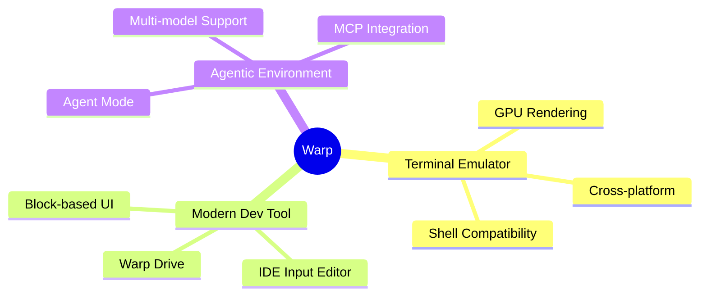
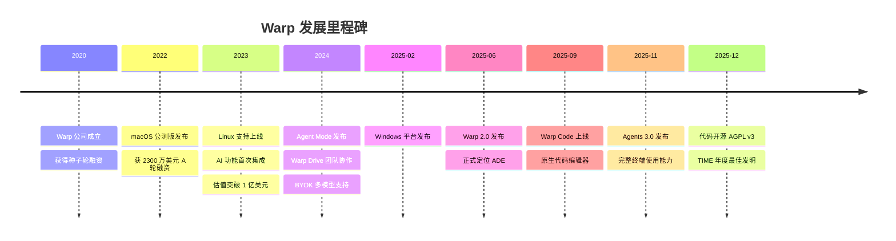
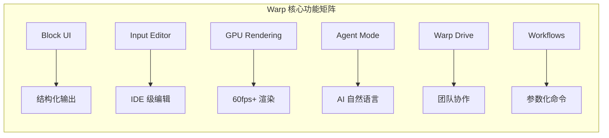
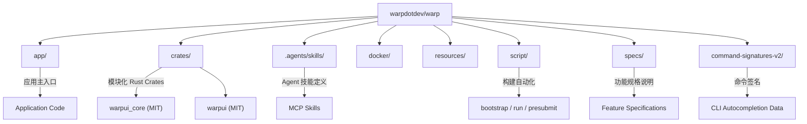
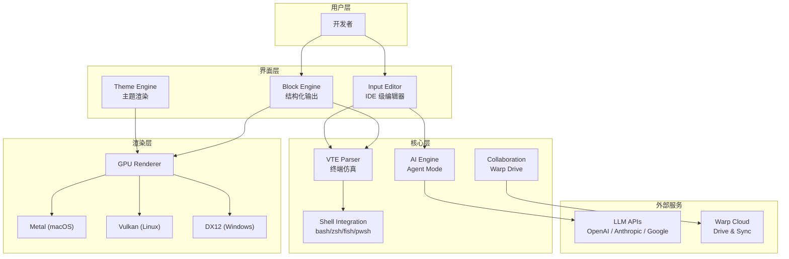
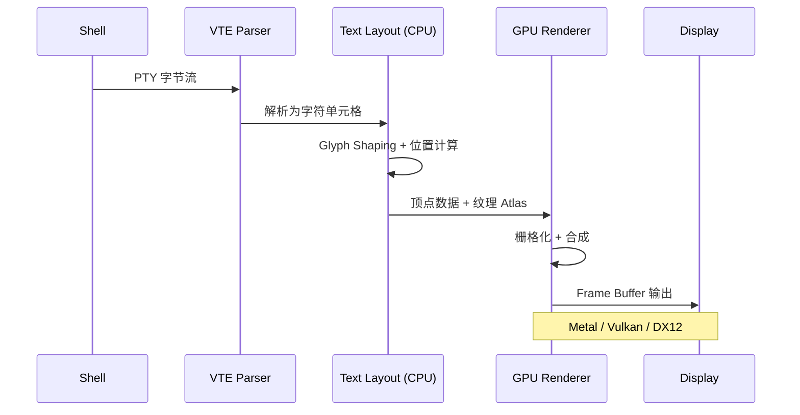
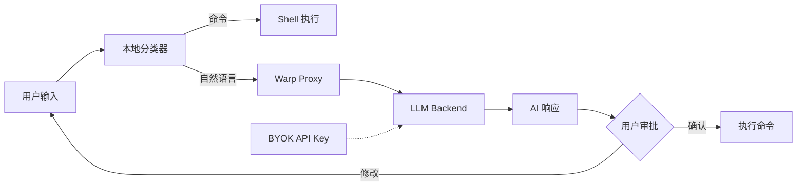
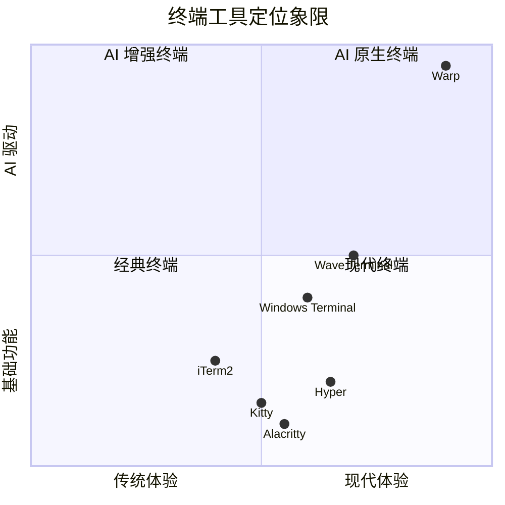
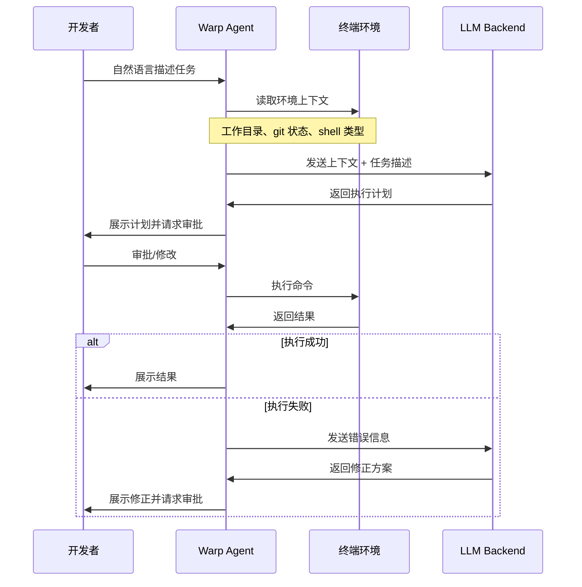
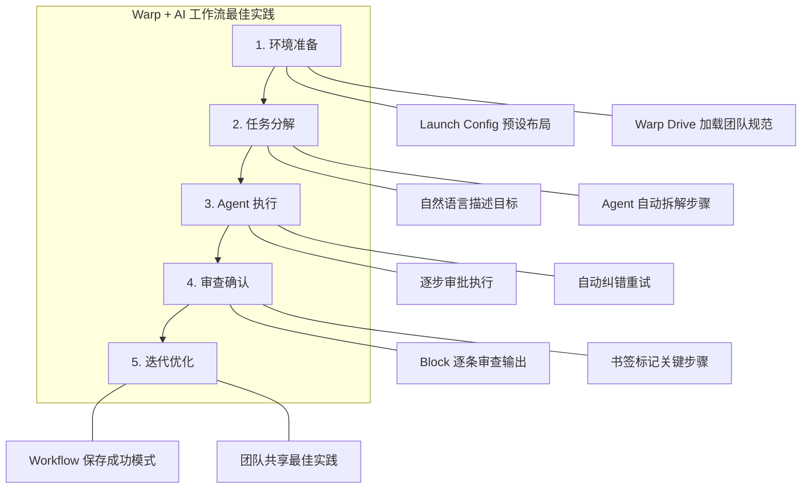

## Warp 是什么

Warp 是一款基于 Rust 构建的现代化终端模拟器，定位为 **Agentic Development Environment**（智能体开发环境）。它跳出了传统终端"字符流"的范式，将终端输出视为结构化文本，引入了 Block（代码块）、IDE 级输入编辑器、GPU 加速渲染、AI Agent 等创新概念，从根本上改变了开发者与命令行的交互方式。

Warp 的核心理念可以归纳为三个层次：首先它是一个极致性能的终端模拟器（60fps+ GPU 渲染），其次它是一个现代化的开发工具（IDE 级编辑体验），最后它是一个 AI 驱动的智能开发环境（Agent Mode 自然语言编程）。



Warp 于 2025 年底正式开源（AGPL v3 协议），GitHub 仓库获得超过 62,000 星标，成为 Rust 生态中最受关注的终端项目之一。


## Warp 出现背景和发展历程

### 背景

传统终端工具（如 Terminal.app、iTerm2、GNOME Terminal）大多基于 1970 年代的 VT100 架构演化而来，存在几个根本性问题：纯字符流输出难以结构化导航、文本编辑能力极其有限、缺乏现代 IDE 的智能提示、无法利用 GPU 进行高性能渲染、以及难以与 AI 能力深度集成。

Warp 的创始人 Zach Lloyd 曾任 Google Docs 工程总监，他观察到终端是开发者使用最频繁却体验最落后的工具，于是在 2020 年创立 Warp，目标是"重新发明终端"。

### 发展历程



### 关键数据（2025 年度）

Warp 在 2025 年取得了显著增长：Agent 编辑超过 32 亿行代码，索引同步超过 12 万个代码仓库，处理了数十万亿 LLM Token，内部合并超过 10,000 个 PR。在基准测试中，Warp 在 Terminal-Bench 上达到 61.2%，在 SWE-bench Verified 上达到 75.6%。Warp 入选了 TIME 2025 年度最佳发明，获得 Newsweek AI Impact Award，并被斯坦福大学纳入"The Modern Software Developer"课程教材。


## Warp 核心功能和特性

### Block（代码块）

Block 是 Warp 最具创新性的概念。每一次命令执行（输入 + 输出）被封装为一个独立的 Block，可以独立选择、复制、分享、书签标记。这打破了传统终端中输出混杂为一个连续字符流的局限。

Block 的核心优势包括：可以像浏览文档一样上下导航各个命令的输出，支持对单个 Block 进行复制、分享、添加书签，长输出可以折叠或展开而不影响其他内容，以及支持 Sticky Header 保持当前命令可见。

### IDE 级输入编辑器

Warp 的输入编辑器（Input Editor）提供了媲美代码编辑器的能力：多光标编辑（Ctrl-Shift-Up/Down）、语法高亮、代码折叠、智能补全、Undo/Redo 支持、以及完整的 Emacs/Vim 快捷键兼容。开发者可以在终端输入区直接编写多行脚本，而无需切换到外部编辑器。

### GPU 加速渲染

Warp 使用 Metal（macOS）、Vulkan/DX12（Windows/Linux）进行 GPU 加速渲染，实现稳定 60fps 以上的刷新率。相比基于 CPU 渲染的传统终端，Warp 在大量日志输出、代码滚动等场景下表现尤为流畅。

### AI Agent Mode

Agent Mode 是 Warp 的 AI 核心能力，支持用户在终端中直接使用自然语言与 AI 交互。它具备环境感知能力（了解当前工作目录、shell 环境、git 状态等），可以执行多步骤任务，遇到错误时自动尝试修正。所有命令执行前需要用户审批，保证安全性。

### Warp Drive

Warp Drive 是团队协作功能，提供云端共享空间，团队成员可以共享参数化命令、环境配置、工作流模板。对于企业团队来说，这大幅降低了新成员的 onboarding 成本。

### Workflows（工作流）

Workflows 是可搜索的参数化命令库，通过 `Ctrl-Shift-R` 唤出。用户可以将常用的复杂命令封装为带参数占位符的 Workflow，在需要时快速检索和填充参数执行。

### Command Palette（命令面板）

类似 VS Code 的命令面板（`CMD-P`），可以快速搜索和执行 Warp 的所有功能，包括主题切换、设置调整、窗口操作等。




## Warp 下载和安装

### 系统要求

| 平台 | 最低要求 |
|------|----------|
| macOS | Intel 或 Apple Silicon，macOS 10.14+，支持 Metal 的 GPU |
| Windows | Windows 10 1809 (build 17763)+，支持 ConPTY |
| Linux | glibc >= 2.31，OpenGL ES 3.0+ 或 Vulkan |

Linux 兼容发行版包括 Ubuntu 20.04+、Debian 11+、Fedora 32+、Arch Linux 等。

### 安装方法

**macOS**

```bash
# Homebrew 安装（推荐）
brew install --cask warp

# 或直接从官网下载 DMG 安装包
# https://www.warp.dev/download
```

**Windows**

```bash
# WinGet 安装（推荐）
winget install Warp.Warp

# 或下载官方安装程序
# https://www.warp.dev/download
```

**Linux**

```bash
# Debian/Ubuntu (.deb)
sudo apt install ./warp-terminal_x64.deb

# Fedora/RHEL (.rpm)
sudo dnf install ./warp-terminal_x64.rpm

# Arch Linux
sudo pacman -U ./warp-terminal_x64.pkg.tar.zst

# AppImage（通用）
chmod +x ./Warp-x86_64.AppImage
./Warp-x86_64.AppImage
```

### 从源码构建

Warp 客户端已于 2025 年底开源（AGPL v3），可以从 GitHub 仓库构建：

```bash
git clone https://github.com/warpdotdev/warp.git
cd warp
./script/bootstrap    # 平台相关依赖安装
./script/run          # 构建并运行
./script/presubmit    # 格式检查、lint、测试
```

自行构建的版本使用独立配置目录，不支持自动更新，且缺少生产环境的代码签名。

### 更新与卸载

Warp 默认支持自动更新。通过包管理器安装的版本可以使用对应的更新命令（如 `brew upgrade --cask warp`）。卸载时，macOS 可直接从 Applications 删除或 `brew uninstall --cask warp`，Linux 使用对应包管理器的 remove 命令。


## Warp 初始化配置

### 账户（可选）

Warp 首次启动时会提示创建账户，但这一步可以跳过。创建账户可通过 Google 或 GitHub 登录，仅获取邮箱地址。首次启动需要网络连接，之后可完全离线使用（AI 和协作功能除外）。

### Shell 配置

Warp 自动检测并加载用户的登录 Shell，支持 bash、zsh、fish 和 PowerShell (pwsh)。macOS 默认使用 zsh，Linux 默认使用 bash。可在 **Settings > Features > Session > Startup shell** 中修改默认 Shell。

Warp 兼容现有的 Shell 配置文件：`.zshrc`、`.bashrc`、`.config/fish/config.fish` 等会被自动加载。对于 Oh-My-Zsh 用户，Warp 可以自动检测并兼容现有的 Zsh 配置。

### 主题配置

通过 `Ctrl-CMD-T`（macOS）或命令面板选择主题。Warp 内置多套主题，也支持自定义主题和从社区导入。

### Vim 模式

在 **Settings > Features > Keys** 中开启 Vim Mode，可以在输入编辑器中使用 Vim 键位。

### Launch Configuration

Warp 支持通过 YAML 文件定义启动配置，可预设标签页布局、分屏方式、启动命令等：

```yaml
# ~/.warp/launch_configurations/dev.yaml
name: Dev Environment
tabs:
  - title: Server
    layout:
      panes:
        - command: cd ~/project && npm run dev
        - command: cd ~/project && npm run test -- --watch
  - title: Git
    command: cd ~/project && git status
```

### SSH 配置

Warp 提供 `warp-ssh` 包装器和 **Warpify Subshell** 功能。`warp-ssh` 在 SSH 连接中保持 Shell 集成功能，而 Warpify Subshell（`Ctrl-I`）可在远程服务器上安装轻量 binary，使远程会话也能使用 Block 界面。


## Warp 基本功能使用

### 快捷键概览

**核心操作（macOS）：**

| 快捷键 | 功能 |
|--------|------|
| `CMD-P` | 命令面板 |
| `CMD-D` | 右侧分屏 |
| `Shift-CMD-D` | 下方分屏 |
| `CMD-T` | 新建标签页 |
| `CMD-K` | 清除所有 Block |
| `CMD-L` | 聚焦终端输入 |
| `Ctrl-R` | 命令搜索 |
| `Ctrl-Shift-R` | Workflows |
| `` Ctrl-` `` | AI 生成 |
| `CMD-\` | Warp Drive |
| `CMD-O` | 文件搜索 |

**Block 操作：**

| 快捷键 | 功能 |
|--------|------|
| `CMD-UP/DOWN` | 选择上/下一个 Block |
| `CMD-B` | 书签当前 Block |
| `Shift-CMD-C` | 复制命令 |
| `Alt-Shift-CMD-C` | 复制命令输出 |
| `Shift-CMD-S` | 分享选中 Block |
| `CMD-I` | 重新输入选中命令 |

**输入编辑器：**

| 快捷键 | 功能 |
|--------|------|
| `Ctrl-Shift-UP/DOWN` | 添加上/下方光标（多光标） |
| `Ctrl-G` | 选中下一个相同内容 |
| `Ctrl-J` | 插入换行 |
| `CMD-Z / Shift-CMD-Z` | 撤销 / 重做 |
| `Alt-CMD-F` | 折叠选中范围 |
| `META-B / META-F` | 按单词左/右移动 |

### Block 导航

在 Warp 中，每次命令执行会产生一个 Block。使用 `CMD-UP` / `CMD-DOWN` 在 Block 之间导航，`Shift-UP` / `Shift-DOWN` 扩展选择范围。选中的 Block 可以进行批量操作（复制、删除、分享）。

### 分屏与标签页

Warp 支持水平分屏（`CMD-D`）和垂直分屏（`Shift-CMD-D`），使用 `Alt-CMD-方向键` 在分屏之间切换。标签页使用 `CMD-T` 创建，`CMD-数字` 快速切换。

### 命令搜索与 Workflows

`Ctrl-R` 唤出命令搜索，可以在历史记录中模糊搜索。`Ctrl-Shift-R` 唤出 Workflows 面板，搜索预定义的参数化命令模板。用户可以自定义 Workflow 并分享给团队。

### 智能补全

Warp 集成了 Fig Completion Specs，提供上下文感知的命令补全。按 `Tab` 触发补全，`Ctrl-F` 接受自动建议。支持对 500+ 常见 CLI 工具的参数提示。


## Warp 项目目录和结构

Warp 于 2025 年底开源，代码库 98.3% 由 Rust 编写。以下是项目的关键目录结构：



### 核心目录说明

| 目录 | 用途 |
|------|------|
| `app/` | 应用主入口代码 |
| `crates/` | 模块化 Rust crate，包含 `warpui_core` 和 `warpui`（MIT 协议）|
| `.agents/skills/` | Agent 技能定义文件 |
| `command-signatures-v2/` | CLI 命令自动补全数据（JavaScript）|
| `docker/` | Docker 构建配置 |
| `resources/` | 应用资源文件（图标、字体等）|
| `script/` | 构建和自动化脚本（bootstrap、run、presubmit）|
| `specs/` | 功能规格设计文档 |
| `.cargo/` | Cargo 构建配置 |
| `.config/` | 项目通用配置 |

### 构建工具链

项目使用 `rust-toolchain.toml` 固定 Rust 版本，`Cargo.toml` / `Cargo.lock` 管理依赖，`flake.nix` / `flake.lock` 提供 Nix 可复现构建环境。代码风格和贡献规范详见仓库中的 `AGENTS.md`。

### 开源协议

Warp 采用双协议策略：整体应用代码使用 AGPL v3 协议，而 UI 框架（`warpui_core` 和 `warpui` crate）使用 MIT 协议，允许社区自由复用 UI 组件。


## Warp 架构分析和解读

### 整体架构



### 关键技术栈

**Rust 生态核心依赖：**

| 库 | 用途 |
|----|------|
| Tokio | 异步运行时 |
| Smol | 轻量异步运行时 |
| Alacritty (fork) | VTE 终端仿真基础 |
| Hyper | HTTP 网络通信 |
| FontKit | 跨平台字体渲染 |
| Core-foundation | macOS 平台集成 |
| NuShell (部分) | Shell 功能扩展 |
| Fig Completion Specs | 命令自动补全 |

### 渲染管线

传统终端使用 CPU 逐字符绘制文本，而 Warp 采用 GPU 加速管线。文本布局（glyph shaping）在 CPU 完成后，栅格化和合成阶段交给 GPU 处理。这使得在大量输出（如 `cat` 大文件、实时日志流）场景下，Warp 保持流畅而不会卡顿。



### AI 架构

Warp 的 AI 系统采用混合架构：本地运行一个语言分类器，判断用户输入是传统命令还是自然语言（数据不出终端）。当识别为自然语言时，请求通过 Warp 代理服务器路由到后端 LLM。用户可以通过 BYOK（Bring Your Own Key）直接连接 OpenAI、Anthropic 或 Google 的 API。




## Warp 和其他终端工具对比

### 对比矩阵



### 详细对比

| 维度 | Warp | iTerm2 | Alacritty | Windows Terminal | Wave |
|------|------|--------|-----------|-----------------|------|
| 语言 | Rust | Objective-C | Rust | C++ | Go + Electron |
| 渲染 | GPU (Metal/Vulkan) | CPU | GPU (OpenGL) | DirectX | GPU |
| AI 集成 | 原生 Agent Mode | 无（需插件） | 无 | Copilot 基础集成 | 内置 AI |
| Block 概念 | 原生支持 | 不支持 | 不支持 | 不支持 | 部分支持 |
| 多光标编辑 | 支持 | 不支持 | 不支持 | 不支持 | 不支持 |
| 团队协作 | Warp Drive | 不支持 | 不支持 | 不支持 | 不支持 |
| 跨平台 | macOS/Linux/Win | 仅 macOS | 全平台 | 仅 Windows | macOS/Linux |
| 开源 | AGPL v3 | GPLv2 | Apache 2.0 | MIT | Apache 2.0 |
| 资源占用 | 中等 | 低 | 极低 | 低 | 较高 |

### Warp 的核心优势

与传统终端相比，Warp 的差异化优势主要体现在三个方面：Block 结构化模型让终端输出变得可导航、可选择、可分享，彻底解决了"翻历史记录找输出"的痛点；IDE 级输入编辑器让多行脚本编写不再需要切换到外部编辑器；深度集成的 AI Agent 让开发者可以用自然语言完成复杂的命令行任务，且具备环境感知和自动纠错能力。


## AI 场景中 Warp 如何更好的发挥作用

### Agent Mode 工作流



### 核心 AI 能力

**自然语言输入：** 在终端中直接用自然语言描述任务，Agent Mode 会自动识别并转化为可执行命令。通过 `#` 前缀或 AI 侧边栏触发。

**环境感知：** 不同于外部 AI 助手，Agent Mode 运行在终端会话内部，可以感知当前工作目录、环境变量、已安装工具、git 状态等信息，提供高度针对性的建议。

**多步骤执行：** Agent Mode 不仅回答问题，还能执行多步骤任务。它能识别何时需要额外信息，主动请求用户运行命令以收集上下文。

**自动纠错：** 当执行的命令产生错误时，Agent Mode 会自动分析错误原因，尝试修正并继续调整直到任务完成。

**通用工具支持：** 只要 CLI 工具有 `--help` 或公开文档，Agent Mode 就能学习该工具并指导用户使用，无需离开终端查阅文档。

### 支持的 AI 模型

Warp 支持 20+ 种模型，包括：

- OpenAI：GPT-4o、GPT-5
- Anthropic：Claude Sonnet、Claude Opus
- Google：Gemini 系列
- BYOK：用户可使用自己的 API Key 接入任意支持的模型

### MCP 集成

Warp 内置 MCP Gallery，支持一键安装 MCP Server，使 Agent 能力扩展到文件系统操作、数据库查询、API 调用等更多场景。项目仓库中的 `.mcp.json` 和 `.agents/skills/` 目录定义了 Agent 可以调用的技能。


## Warp 实战使用 Demo Case

### Case 1：快速搭建项目环境

```bash
# 使用自然语言让 Agent 帮助创建项目
> 帮我创建一个 TypeScript + Express 的 REST API 项目，包含 Docker 支持

# Agent 会生成并执行一系列命令：
mkdir my-api && cd my-api
npm init -y
npm install express typescript @types/express ts-node
npx tsc --init
# ... 创建目录结构、Dockerfile、docker-compose.yaml
```

### Case 2：Git 工作流优化

```bash
# 查看复杂的 git 差异并生成 commit message
> 分析我的 staged changes 并生成一个符合 Conventional Commits 规范的 commit message

# Agent 读取 git diff，分析变更内容，生成描述
git diff --staged
# Agent: 建议使用 "feat(auth): add JWT refresh token rotation with Redis session store"
```

### Case 3：日志分析与故障排查

```bash
# 粘贴错误日志或指向日志文件
> 分析 /var/log/nginx/error.log 最近 100 行，找出 502 错误的根因

# Agent 执行分析并给出建议
tail -100 /var/log/nginx/error.log | grep 502
# Agent: 分析到上游服务在 14:23 开始超时，建议检查 backend 服务状态...
```

### Case 4：多服务器批量操作

```bash
# 使用 Launch Configuration 预设多窗口布局
# dev.yaml 定义三个分屏分别连接不同服务器

# 在所有分屏中同时执行命令（广播模式）
> 帮我检查这三台服务器的磁盘使用率和内存状态
```

### Case 5：学习新 CLI 工具

```bash
# 不需要查阅文档，直接问 Agent
> 我想用 kubectl 查看所有 namespace 中状态为 CrashLoopBackOff 的 pod，并获取它们的日志

# Agent 提供命令并解释每个 flag 的含义
kubectl get pods --all-namespaces --field-selector=status.phase!=Running | grep CrashLoopBackOff
# 然后逐一获取日志...
```


## Warp 配合 AI 工具的最佳实践

### 与 Claude Code 配合

Warp 是运行 Claude Code 的理想终端。Block 架构让 Claude Code 的多步骤输出清晰可辨，每次 Agent 操作形成独立的可导航 Block。推荐配置：

```bash
# 在 Warp 中运行 Claude Code
claude

# 利用 Warp 的分屏能力
# 左侧：Claude Code Agent 会话
# 右侧：项目文件监控或测试输出
```

### 与 Codex / Gemini CLI 配合

Warp 2.0 作为 Agent-agnostic 的 ADE，原生支持编排多种 AI Agent。通过 Oz Agent Platform 可以同时运行 Claude Code、Codex、Gemini CLI，并提供统一的权限控制和上下文管理。

### 最佳实践建议



**具体建议：**

1. **善用 Launch Configuration**：为不同项目创建预设布局，一键启动开发环境
2. **结合 Warp Drive 分享团队规范**：将 AI Prompt 模板、常用 Workflows 通过 Drive 共享
3. **利用 Block 进行 Code Review**：Agent 产出的代码变更形成独立 Block，方便逐条审查
4. **BYOK 选择合适模型**：简单命令补全用快速模型，复杂架构任务用高能力模型
5. **配合 MCP 扩展 Agent 能力**：安装项目相关的 MCP Server，让 Agent 能直接操作数据库、API 等
6. **Warpify 远程服务器**：让远程 SSH 会话也能获得完整的 Block + AI 体验


## Warp 总结

Warp 代表了终端工具的一次范式转移。它不是在传统终端上的渐进改良，而是从底层架构（Rust + GPU）到交互范式（Block + IDE Editor）再到智能层（Agent Mode + MCP）的全面重构。

### 适用人群

- **个人开发者**：免费版已足够日常使用，AI 每日 50 次请求覆盖大部分场景
- **初创团队**：Pro 版的 Warp Drive 大幅降低 onboarding 成本
- **企业团队**：Enterprise 版提供 SOC2 合规、SSO、零数据留存等企业级安全保障

### 当前局限

Warp 也存在一些局限：AI 功能依赖网络连接和账户，对气隔离（air-gapped）环境不友好；输入编辑器的行为与标准 Bash/Zsh 有差异，需要适应期；GPU 加速带来的资源占用高于 Alacritty 等极简终端；部分高级功能仍在快速迭代中，稳定性需要持续关注。

### 发展趋势

Warp 正在从"AI 终端"向"Agentic 开发环境"转型。其 2026 年的核心方向是缩短"Prompt → Production"的循环，通过更好的上下文理解、多 Agent 协作、和团队工具链集成，让 AI 不只是辅助编码，而是深度参与整个软件交付流程。


## 参考文档

- [Warp 官网](https://www.warp.dev/)
- [Warp 使用文档](https://docs.warp.dev/)
- [Warp GitHub 仓库](https://github.com/warpdotdev/warp)
- [Warp 安装指南 - Warp Docs](https://docs.warp.dev/getting-started/quickstart/installation-and-setup/)
- [Warp 快捷键文档 - Warp Docs](https://docs.warp.dev/getting-started/keyboard-shortcuts/)
- [Agent Mode: Natural-Language Coding Agents in Warp](https://www.warp.dev/ai)
- [Warp Wrapped: 2025 in Review](https://www.warp.dev/blog/2025-in-review)
- [Warp Terminal AI Guide 2026](https://aitoolsdevpro.com/ai-tools/warp-guide/)
- [What Warp's Open Source Release Tells Us About the Future of Agentic Software Development](https://medium.com/jonathans-musings/what-warps-open-source-release-tells-us-about-the-future-of-agentic-software-development-5d4409726bf1)
- [下一代 AI 终端神器 Warp - 知乎](https://zhuanlan.zhihu.com/p/1942932248119710645)
- [Warp 终极指南：让开发者生产力提升 10 倍的智能终端 - 腾讯云](https://cloud.tencent.com/developer/news/2613880)
- [Warp：是时候改变你的命令行工具了 - 少数派](https://sspai.com/post/79262)
- [Warp 架构深度解读 - ATA](https://ata.atatech.org/articles/11020626507)
- [一键拉起 Claude Code 4 人开发团队（推荐搭配 Warp 终端）- ATA](https://ata.atatech.org/articles/11020644826)
- [Why I switched from Claude Code to Warp](https://levelup.gitconnected.com/why-i-switched-from-claude-code-to-warp-920ab7fcef8b)
