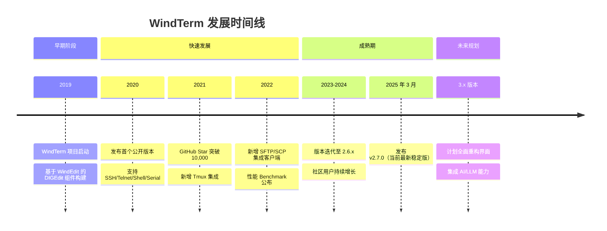
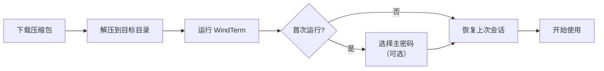
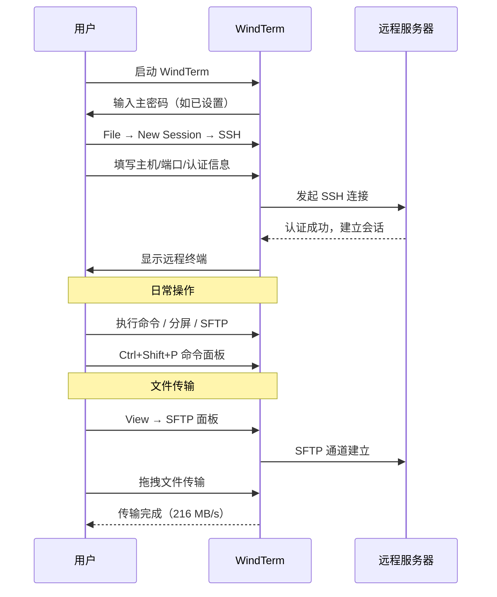
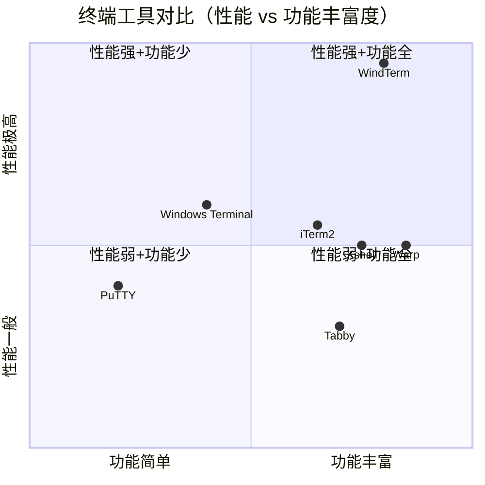
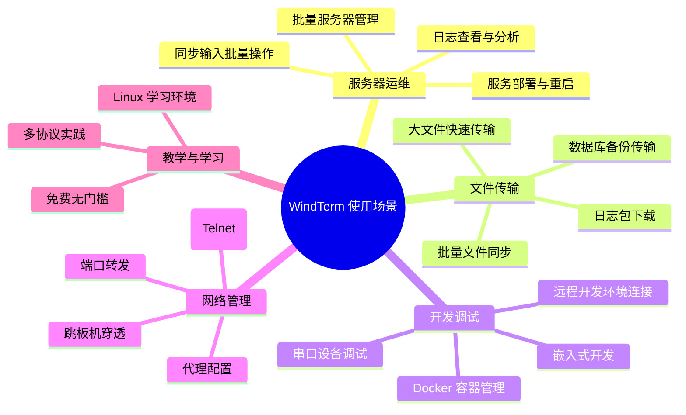
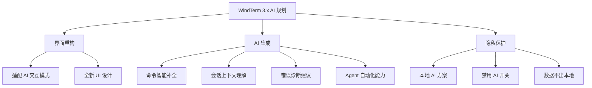
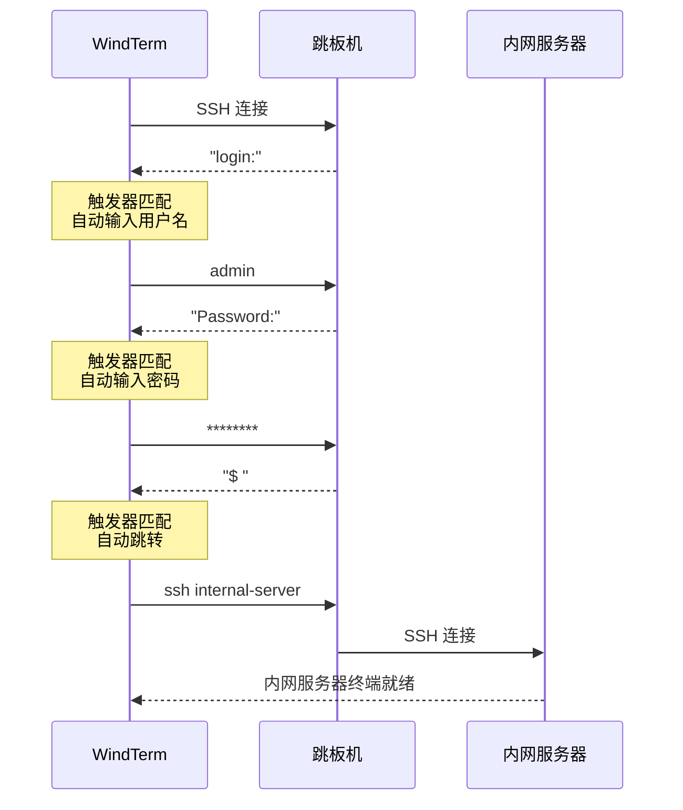
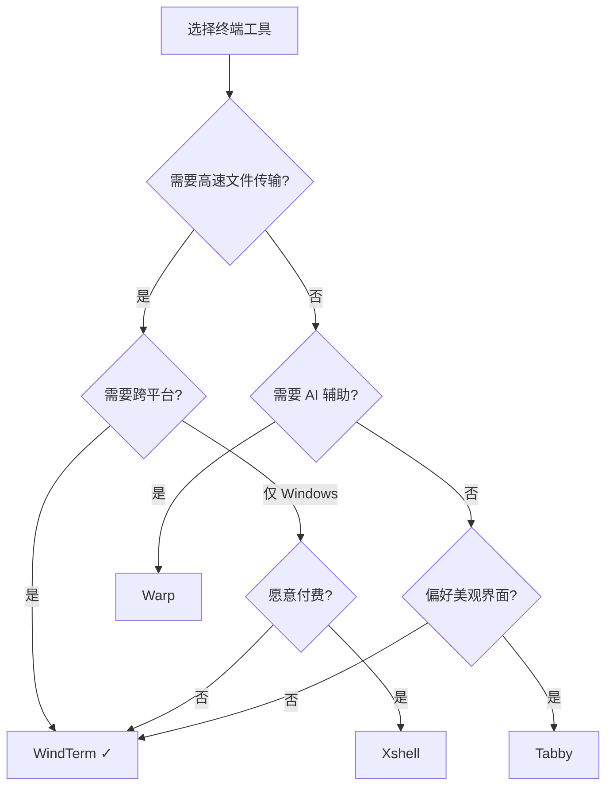

## WindTerm 使用教程

### WindTerm 是什么

WindTerm 是一款面向 DevOps 工程师设计的专业跨平台终端客户端，由开发者 kingToolbox 使用 C 语言从底层编写，追求极致的传输性能和最低的内存占用。它支持 SSH、Telnet、TCP、Shell、串口（Serial）、SFTP/SCP 等多种协议，覆盖了远程运维中几乎所有的连接场景。

WindTerm 完全免费（包括商业用途），部分核心代码以 Apache 2.0 协议开源，项目托管在 GitHub，截至目前已积累超过 31,000 Star。它提供 Windows、macOS、Linux 三平台支持，是目前开源终端工具中性能表现最为突出的产品之一。

项目官方地址：https://github.com/kingToolbox/WindTerm

---

### WindTerm 出现背景与发展历程

终端工具市场长期被几类产品占据：PuTTY（轻量但功能简陋）、Xshell/SecureCRT（功能强大但商业收费）、iTerm2（仅限 macOS）、Tabby（Electron 架构导致资源占用高）。对于需要同时管理大量服务器、频繁传输大文件的 DevOps 工程师而言，这些工具在性能方面都存在瓶颈。

WindTerm 的作者从文本编辑器 WindEdit 的开发中积累了高性能 GUI 渲染的经验（其核心文本组件 DIGEdit 的输入延迟仅 2.9ms，优于 Windows Notepad 的 7.8ms），并将这套技术栈移植到终端领域，用纯 C 语言重新实现了终端仿真、协议栈和文件传输模块。



WindTerm 3.x 版本已明确规划 AI 集成方向，作者在 GitHub Issue 中表示"远不止添加 AI 问答或自动补全"，将对界面进行完全重设计以适配 AI 工作流。

---

### WindTerm 核心功能特性

#### 多协议支持

WindTerm 在协议覆盖上做到了全面：

| 协议类型 | 具体能力 |
|---------|---------|
| SSH v2 | Agent 转发、ProxyCommand/ProxyJump、ControlMaster、X11 转发、本地/远程/动态端口转发 |
| Telnet | 高性能 Telnet 客户端 |
| Shell | Cmd、PowerShell、Bash、Zsh、PowerShell Core |
| 串口 Serial | 设备调试、嵌入式开发 |
| TCP/Raw | 原始 TCP 连接 |
| SFTP/SCP | 集成文件传输客户端 |
| XModem/YModem/ZModem | 传统串口文件传输协议 |

#### 极致性能

官方 Benchmark 数据对比（测试环境一致）：

| 指标 | WindTerm | PuTTY | Xshell | iTerm2 |
|------|----------|-------|--------|--------|
| Telnet 传输速率 | 52.1 MB/s | 4.9 MB/s | 6.4 MB/s | - |
| SFTP 下载（5GB 文件） | 216.3 MB/s | - | ~100 MB/s | - |
| SFTP 上传（5GB 文件） | 247.0 MB/s | - | - | - |
| 输入延迟 | 2.9 ms | 4.1 ms | - | - |
| `seq 1 10000000` 内存 | 133.3 MB | OOM | OOM | 2231.3 MB |

性能秘诀在于"动态内存压缩"技术——根据数据访问频率对滚动缓冲区中的冷数据进行压缩，工作内存负载通常降低 20%-90%。当其他终端在 10 百万行滚动缓冲时直接 OOM 崩溃，WindTerm 仅占用 133 MB。

#### VS Code 风格交互

WindTerm 的界面交互借鉴了 VS Code 的设计哲学：

- **命令面板**：`Ctrl+Shift+P` 快速搜索并执行任何操作
- **自动补全**：命令输入时提供实时建议
- **Free Type Mode**：光标可在终端区域任意定位
- **Focus Mode**：隐藏所有 UI 元素，只保留纯粹的终端区域

#### Tmux 深度集成

WindTerm 对 tmux 做了原生 GUI 映射——tmux 的 session、window、pane 直接以原生界面元素呈现，无需记忆复杂的快捷键前缀。通过在 tmux 命令后附加 `-CC` 参数即可激活集成模式：

```bash
tmux -CC          # 新建集成会话
tmux -CC attach   # 附加到已有会话
```

集成模式下的快捷键映射：

| 快捷键 | 操作 |
|--------|------|
| Alt + B | 打开 Tmux 命令面板 |
| Alt + X | 关闭当前 pane |
| Alt + Z | 缩放当前 pane |
| Alt + 方向键 | 导航 pane |
| Alt + [ / ] | 前/后切换 window |
| Alt + - | 右侧分割 pane |
| Alt + \| | 下方分割 pane |

#### 其他亮点功能

- **同步输入**：选中多个标签页/窗格后，键盘输入同时广播到所有目标
- **会话日志**：支持手动/自动记录会话内容
- **触发器（Trigger）**：基于终端输出文本匹配自动执行动作
- **锁屏保护**：离开时锁定终端，保护敏感信息
- **Powerline 支持**：完美兼容 Oh-My-Zsh、Oh-My-Posh 主题和字体图标
- **重启恢复**：软件重启后自动恢复之前的会话和窗口布局

---

### WindTerm 下载安装方法

WindTerm 采用绿色免安装设计，下载解压即可使用，无需管理员权限，不会污染系统注册表。

#### 下载地址

- GitHub Releases（推荐）：https://github.com/kingToolbox/WindTerm/releases
- SourceForge 镜像：https://sourceforge.net/projects/windterm.mirror/

#### Windows 安装

```bash
# 1. 下载 Portable 版本
# 文件名格式：WindTerm_2.7.0_Windows_Portable_x86_64.zip

# 2. 解压到任意目录（建议路径不含中文和空格）
# 例如：D:\Tools\WindTerm

# 3. 运行 WindTerm.exe 即可
```

建议将 WindTerm.exe 固定到任务栏或创建桌面快捷方式。

#### macOS 安装

```bash
# 方式一：DMG 安装
# 下载 WindTerm_2.7.0_macOS_x86_64.dmg（Intel）
# 或 WindTerm_2.7.0_macOS_arm64.dmg（Apple Silicon）
# 双击 DMG，拖入 Applications 文件夹

# 方式二：tar.gz 解压
tar -xzf WindTerm_2.7.0_macOS_arm64.tar.gz
mv WindTerm.app /Applications/
```

首次运行可能需要在"系统偏好设置 → 安全性与隐私"中允许打开。

#### Linux 安装

```bash
# 1. 下载并解压
tar -xzf WindTerm_2.7.0_Linux_Portable_x86_64.tar.gz

# 2. 进入目录运行
cd WindTerm_2.7.0
./WindTerm

# 3.（可选）创建桌面启动器
cat > ~/.local/share/applications/windterm.desktop << 'EOF'
[Desktop Entry]
Name=WindTerm
Exec=/opt/WindTerm/WindTerm
Icon=/opt/WindTerm/windterm.png
Type=Application
Categories=System;TerminalEmulator;
EOF
```

#### 更新方法

WindTerm 没有内置的自动更新机制。更新时需要手动下载新版本解压覆盖旧版本目录，或解压到新目录后将旧版本的用户配置文件（`profiles` 目录和 `.wind` 目录下的会话数据）迁移过来。

#### 卸载方法

由于是绿色软件，直接删除整个 WindTerm 目录即可完成卸载。用户配置数据通常保存在 WindTerm 程序目录下的 `global` 和 `profiles` 子目录中。



---

### WindTerm 配置方法

#### 全局设置入口

通过菜单 `Session → Preferences` 或快捷键打开全局设置面板，主要配置项包括：

#### 外观与主题

WindTerm 支持 VSCode 风格的配色方案切换：

- 菜单路径：`Settings → Theme`
- 内置多种亮色/暗色主题
- 支持自定义配色（修改 `themes` 目录下的 JSON 文件）
- 支持窗口透明度调节
- 标签页颜色自定义（方便区分不同环境的连接）

#### 字体设置

建议使用支持 Powerline 图标的等宽字体：

- 推荐字体：JetBrains Mono、Fira Code、MesloLGS NF、Cascadia Code
- 设置路径：`Settings → Terminal → Font`
- 可分别设置普通字体和 Powerline 备选字体

#### 连接保活配置

防止 SSH 会话因超时断连：

- 路径：会话属性 → SSH → 连接
- 设置 Keepalive 间隔为 60 秒
- 设置 ServerAlive 最大计数为 3

#### 快捷键自定义

WindTerm 的快捷键系统高度可配置：

- 路径：`Settings → Keyboard`
- 支持 Vim 键绑定模式（通过 Shift+Enter 在本地模式和远程模式间切换）
- 常用默认快捷键：

| 快捷键 | 功能 |
|--------|------|
| Ctrl+Shift+P | 命令面板 |
| Ctrl+Shift+A | 全选 |
| Ctrl+Shift+C | 复制 |
| Ctrl+Shift+V | 粘贴 |
| Ctrl+Shift+F | 搜索 |
| Alt+Shift+H | 水平分屏 |
| Alt+Shift+V | 垂直分屏 |
| Alt+Enter | 全屏切换 |

#### 主密码设置

WindTerm 使用主密码（Master Password）对保存的会话凭据进行加密保护。首次运行时会提示设置，之后每次启动需输入主密码解锁。如果不需要此功能，可以选择"不设置密码"以跳过。

---

### WindTerm 使用流程

下面通过一个完整的工作流演示从创建会话到日常使用的全过程。



#### 第一步：创建 SSH 会话

1. 菜单 `File → New Session`，选择 SSH 协议
2. 填写连接参数：
   - **主机地址**：服务器 IP 或域名
   - **端口**：默认 22
   - **用户名**：登录账号
   - **认证方式**：密码或密钥文件
3. 点击"Connect"建立连接

#### 第二步：配置密钥认证（推荐）

密钥认证比密码更安全，配置步骤：

```bash
# 1. 本地生成密钥对
ssh-keygen -t ed25519 -C "your_email@example.com"

# 2. 上传公钥到服务器
ssh-copy-id -i ~/.ssh/id_ed25519.pub user@server-ip

# 3. 在 WindTerm 中配置
# 会话属性 → SSH → 验证 → 私钥文件 → 选择 id_ed25519
```

配置成功后建议在验证页面只保留"公钥"选项，移除其他认证方式的勾选，可加速连接过程。

#### 第三步：会话分组管理

在左侧会话管理面板中：

- 右键创建文件夹，按项目或环境分类（如 `Production`、`Staging`、`Dev`）
- 拖拽会话到对应文件夹
- 支持右键快速连接、编辑、克隆、删除会话

#### 第四步：分屏与多标签

- **水平分屏**：`Alt+Shift+H` 或菜单 View → Split Horizontally
- **垂直分屏**：`Alt+Shift+V` 或菜单 View → Split Vertically
- **标签页拖拽**：拖拽标签到窗口边缘自动分屏
- **标签分离**：拖拽标签到窗口外部形成独立窗口

#### 第五步：SFTP 文件传输

SSH 连接建立后：

1. 菜单 `View → SFTP` 打开文件传输面板
2. 左侧显示本地文件系统，右侧显示远程文件系统
3. 支持拖拽传输、右键上传/下载
4. 传输队列面板显示进度和速率

#### 第六步：同步输入批量操作

1. 打开多个 SSH 连接（分屏或多标签）
2. 右键标签 → `Add to Sync Input Group`
3. 在任一窗格输入的命令会同步发送到组内所有连接

这在需要同时对多台服务器执行相同操作时极为高效。

---

### WindTerm 相比其他工具的优势与不足

#### 横向对比



#### 详细对比表

| 对比维度 | WindTerm | Tabby | PuTTY | Xshell | Warp |
|---------|----------|-------|-------|--------|------|
| 编写语言 | C | TypeScript(Electron) | C | C++ | Rust |
| 传输性能 | 极高 | 中等 | 中等 | 中等 | 高 |
| 内存占用 | 极低 | 高 | 低 | 中等 | 中等 |
| 跨平台 | Win/Mac/Linux | Win/Mac/Linux | 仅 Windows | 仅 Windows | Mac/Linux |
| 费用 | 完全免费 | 免费 | 免费 | 教育/个人免费 | 基础免费 |
| SFTP 集成 | 内置 | 插件 | 无 | 内置 | 无 |
| 插件系统 | 无 | 丰富 | 无 | 有限 | 有限 |
| AI 集成 | 规划中(3.x) | 无 | 无 | 无 | 内置 |
| 更新频率 | 低 | 中 | 低 | 中 | 高 |
| 文档完善度 | 偏少 | 完善 | 完善 | 完善 | 完善 |

#### 核心优势

1. **传输性能碾压级**：C 语言底层实现 + 动态内存压缩，SFTP 速度是 WinSCP 的 3 倍以上
2. **零成本**：完全免费且无功能限制，商业使用无需付费
3. **绿色便携**：解压即用，不依赖运行时环境，可放在 U 盘随身携带
4. **协议全覆盖**：SSH/Telnet/Serial/Shell/SFTP 一站式解决
5. **内存效率**：处理超大输出（千万行级别）时不崩溃

#### 主要不足

1. **部分开源**：核心代码未完全公开，对安全审计有要求的场景可能受限
2. **无插件系统**：功能全靠内置，无法通过社区扩展
3. **文档匮乏**：官方文档少，很多功能需要在 GitHub Issues 中挖掘
4. **更新缓慢**：版本迭代周期长（数月一个版本），社区对项目维护活跃度有担忧
5. **界面设计感一般**：功能优先的设计思路，视觉美感不如 Tabby/Warp

---

### WindTerm 使用场景



具体场景说明：

1. **大规模服务器集群管理**：利用同步输入功能同时操作数十台服务器，结合会话分组按环境分类管理
2. **大文件传输场景**：日志文件下载、数据库备份传输等需要高带宽的场景，WindTerm 的 SFTP 性能优势最为明显
3. **嵌入式/IoT 设备开发**：串口协议支持让它可以直接连接硬件设备进行调试
4. **跳板机复杂网络环境**：ProxyJump 支持让多层跳转变为一步操作
5. **长时间运行任务监控**：动态内存压缩确保长时间运行的会话不会因为输出过多而崩溃

---

### AI 时代下 WindTerm 的定位与优势

在 AI 驱动的终端工具（如 Warp、GitHub Copilot CLI）快速发展的 2025 年，WindTerm 虽然尚未集成 AI 功能，但在以下方面仍具有独特价值：

#### 当前优势

1. **隐私与安全**：不依赖云端 AI 服务，所有操作完全本地化，适合对数据安全要求高的企业环境
2. **资源效率**：AI 终端通常需要额外的计算资源和网络连接，WindTerm 的轻量特性在资源受限环境中依然适用
3. **稳定可靠**：不依赖外部 API，网络不稳定时照常工作
4. **可与外部 AI 工具配合**：可以将 AI 工具（如 ChatGPT、Claude）生成的命令直接粘贴到 WindTerm 执行，利用其高性能传输优势

#### 3.x 版本 AI 规划

作者已在 GitHub 确认 WindTerm 3.x 将集成 AI 功能，规划要点包括：

- 界面完全重构以适配 AI 交互模式
- 不仅仅是添加 AI 问答或命令补全
- 会提供完全禁用 AI 的开关
- 考虑本地 AI 方案以保护隐私



#### 与 AI 工具协作的最佳实践

在 3.x 发布前，可以采用以下方式让 WindTerm 与 AI 协作：

1. 使用 AI 助手生成复杂命令 → 粘贴到 WindTerm 执行
2. 将 WindTerm 的错误输出复制给 AI 分析
3. 利用 WindTerm 的触发器功能，在特定输出出现时触发通知
4. 结合同步输入功能，将 AI 生成的运维脚本一次性部署到多台服务器

---

### WindTerm 实战应用 Demo Case

#### Case 1：批量服务器日志收集

场景：需要从 10 台 Web 服务器上收集 Nginx 访问日志。

```bash
# 1. 在 WindTerm 中打开 10 个 SSH 连接（可用分屏或多标签）
# 2. 将所有连接加入同步输入组
# 3. 同步执行以下命令：

# 压缩当天的 Nginx 日志
tar -czf /tmp/nginx-access-$(hostname)-$(date +%Y%m%d).tar.gz \
    /var/log/nginx/access.log

# 4. 逐台打开 SFTP 面板下载压缩包
# 利用 WindTerm 的 216 MB/s 下载速率，5GB 日志只需约 23 秒
```

#### Case 2：通过跳板机连接内网数据库

场景：需要通过跳板机 SSH 隧道连接内网 MySQL。

在 WindTerm 中创建会话，配置 ProxyJump：

```
# 会话属性 → SSH → 代理
# Proxy Type: SSH
# Proxy Host: jumpbox.company.com
# Proxy Port: 22
# Proxy User: admin

# 或使用端口转发：
# 本地端口转发配置
# Local Port: 3306
# Remote Host: db-internal.lan
# Remote Port: 3306
```

连接后本地可直接通过 `localhost:3306` 访问内网数据库。

#### Case 3：串口设备调试

场景：调试一块通过 USB 转串口连接的 ESP32 开发板。

```
# 1. File → New Session → Serial
# 2. 配置串口参数：
#    Port: COM3（Windows）或 /dev/ttyUSB0（Linux）
#    Baud Rate: 115200
#    Data Bits: 8
#    Stop Bits: 1
#    Parity: None
# 3. 连接后即可看到设备的串口输出
```

#### Case 4：自动化登录触发器

场景：设置自动登录跳板机后再跳转内网服务器。

```
# 会话属性 → Shell → 登录脚本
# 或使用触发器（Trigger）：
# 
# 触发器规则 1：
#   匹配文本: "login:"
#   动作: 发送文本 "admin\n"
#
# 触发器规则 2：
#   匹配文本: "Password:"
#   动作: 发送文本 "my_password\n"
#
# 触发器规则 3：
#   匹配文本: "$"（命令提示符）
#   动作: 发送文本 "ssh internal-server\n"
```



---

### WindTerm 总结

WindTerm 是一款以性能为核心竞争力的终端客户端。它用 C 语言重写了终端工具的底层，在传输速度、内存效率、输入延迟三个维度全面超越同类产品。完全免费、绿色便携、跨平台的特性降低了使用门槛，而多协议支持、同步输入、Tmux 集成等功能覆盖了 DevOps 工程师的核心需求。

它的短板同样明显：更新节奏慢、无插件生态、文档不足、AI 能力缺失。适合对传输性能有高要求、需要管理大量服务器、偏好轻量工具的用户群体。如果你的工作场景以交互式命令操作为主且对界面美观度有较高要求，Warp 或 Tabby 可能更适合。

对于大多数 DevOps 工程师和系统管理员而言，WindTerm 值得作为主力工具尝试——尤其是当你第一次用它下载一个 5GB 的日志文件，看到 200+ MB/s 的速率时，会理解为什么它有 3 万多 Star。



---

### 参考文档

- [WindTerm 官方网站](https://kingtoolbox.github.io/)
- [WindTerm GitHub 仓库](https://github.com/kingToolbox/WindTerm)
- [WindTerm SourceForge 镜像下载](https://sourceforge.net/projects/windterm.mirror/)
- [开源免费的终端工具 WindTerm 的使用介绍 - DeepinWiki](https://wiki.deepin.org/zh/04_%E5%B8%B8%E8%A7%81%E9%97%AE%E9%A2%98FAQ/%E5%BC%80%E6%BA%90%E5%85%8D%E8%B4%B9%E7%9A%84%E7%BB%88%E7%AB%AF%E5%B7%A5%E5%85%B7WindTerm%E7%9A%84%E4%BD%BF%E7%94%A8%E4%BB%8B%E7%BB%8D)
- [SSH 终端工具推荐 - WindTerm - 博客园](https://www.cnblogs.com/hellxz/p/wind-term.html)
- [WindTerm 下载、安装、使用、配置 - CSDN](https://blog.csdn.net/wkd_007/article/details/130330092)
- [WindTerm 配置全攻略 - CSDN](https://blog.csdn.net/w8x9y0z1/article/details/151608059)
- [远程连接终端 WindTerm 安装使用教程 - 知乎](https://zhuanlan.zhihu.com/p/685465133)
- [WindTerm AI 集成讨论 - GitHub Issue #2730](https://github.com/kingToolbox/WindTerm/issues/2730)
- [WindTerm 开发活跃度讨论 - GitHub Discussion #3090](https://github.com/kingToolbox/WindTerm/discussions/3090)
