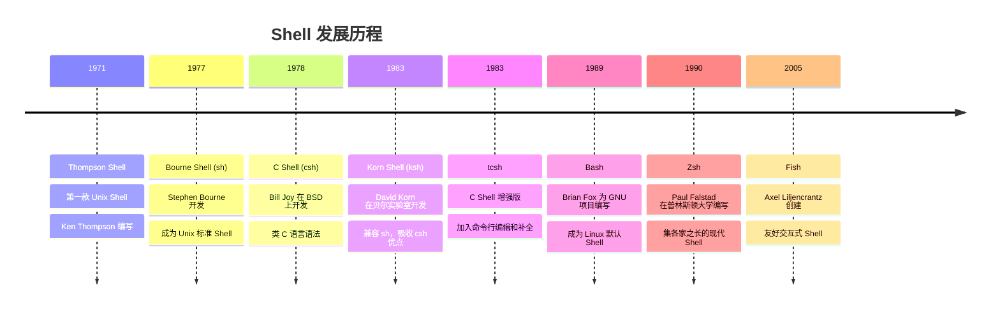
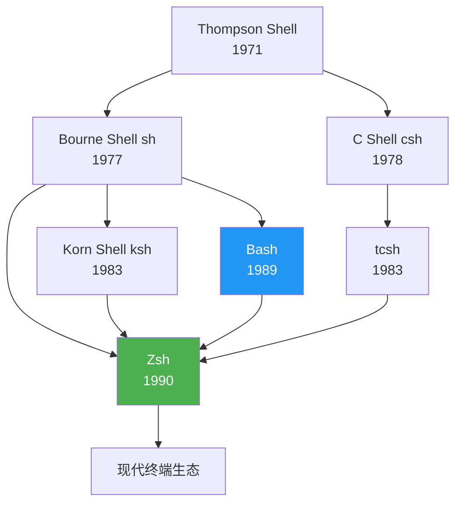
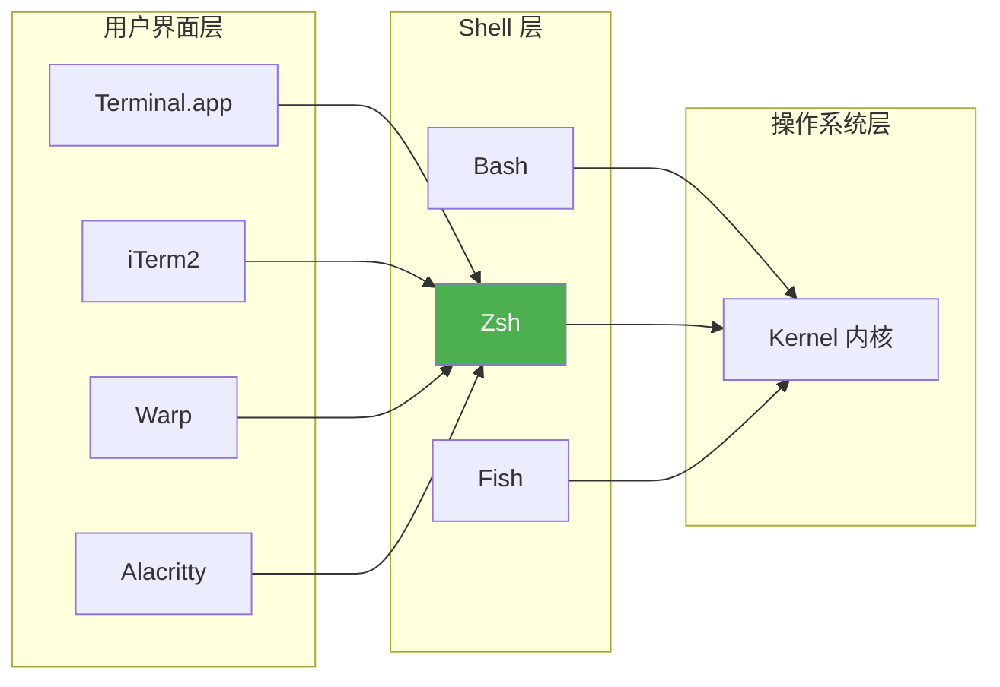
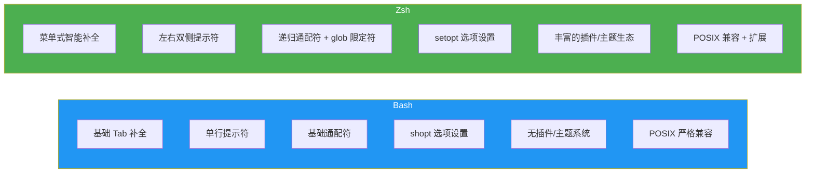
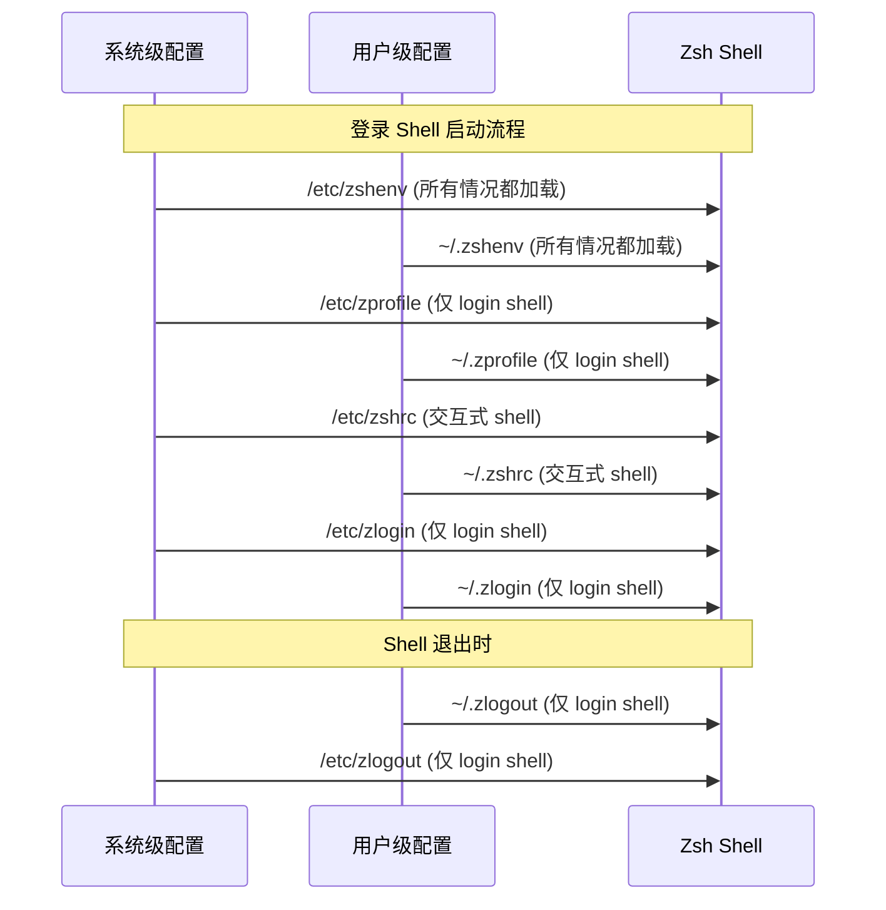
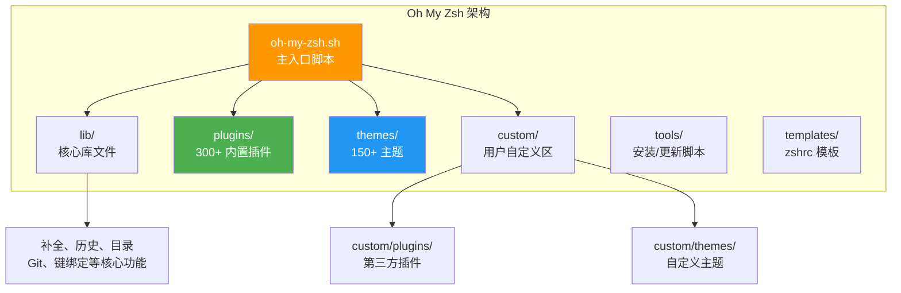
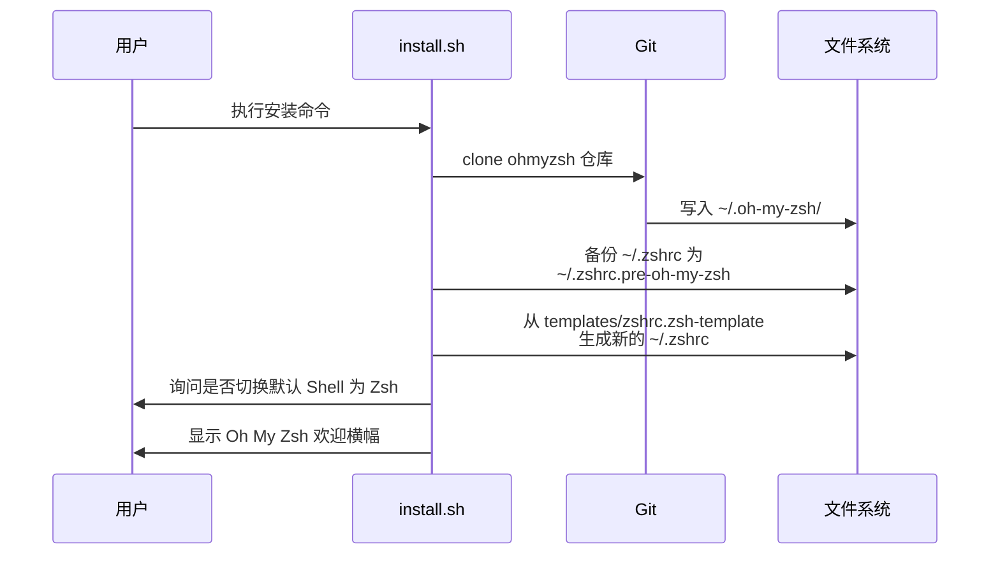
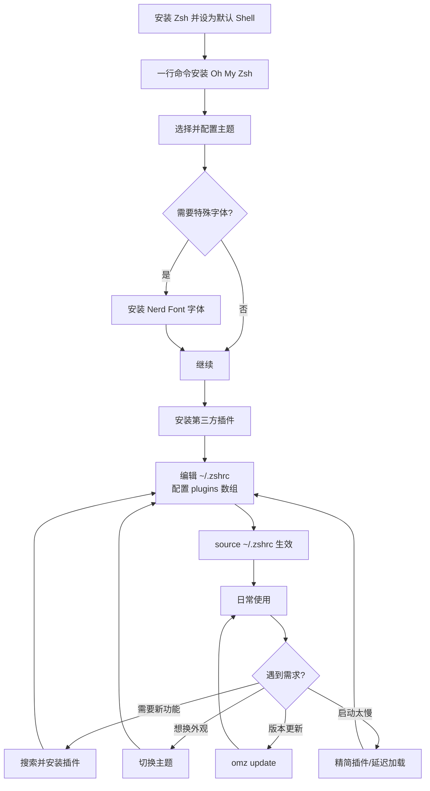
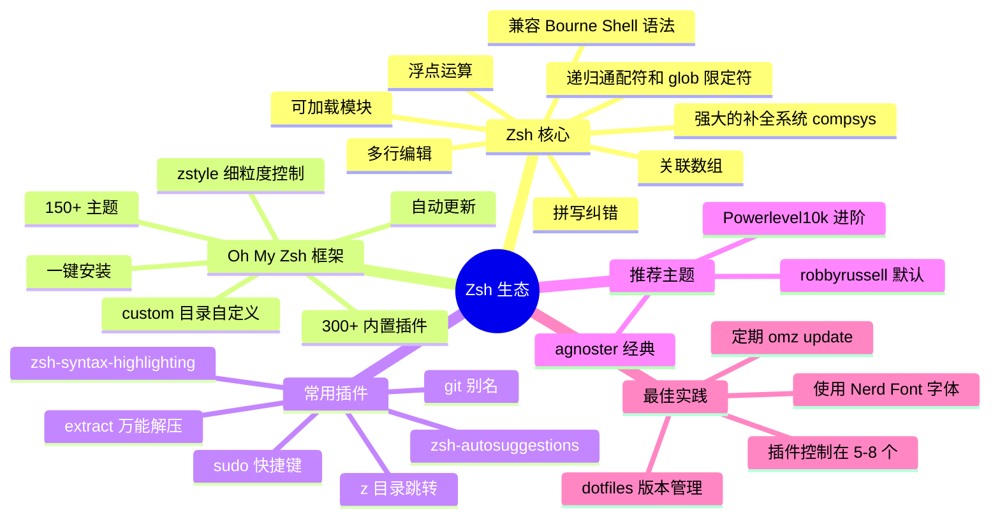

## Shell 介绍和发展历程

### 什么是 Shell

Shell 是操作系统中用户与内核之间的桥梁——一个命令解释器。用户输入命令，Shell 负责解析并传递给操作系统内核执行，再将结果返回。这里需要澄清一个常见误区：终端（Terminal）和 Shell 不是同一个东西。终端是一个软件应用程序（如 macOS 自带的 Terminal.app、iTerm2、Warp、Alacritty、WezTerm 等），它提供了一个窗口来输入和显示文本；而 Shell 才是真正在后台解释和执行命令的程序。

可以用一个类比来理解：终端是你看到的"窗户"，Shell 是窗户后面真正干活的"工人"。

### Shell 家族发展时间线

Unix Shell 的演化经历了数十年，下面这张时间线图展示了主要 Shell 的诞生和继承关系：



### Shell 家族谱系

从继承关系来看，现代主流 Shell 大致分为两个主要分支：



Zsh 的设计理念正是"站在巨人肩膀上"——它兼容 Bourne Shell 语法，同时吸收了 Bash 的易用性、Korn Shell 的高级编程特性、以及 tcsh 的交互式操作优点。

## Zsh 是什么，和 Shell 有什么关系

Zsh，全称 Z Shell，是一款用于交互式登录和脚本编写的命令解释器。它属于 Shell 家族中 Bourne 分支的一员，本质上是 Bourne Shell 的扩展版本，融合了 Bash、Korn Shell 和 tcsh 的部分功能。

Zsh 使用 C 语言编写，采用类似 MIT 的许可证发布，是一个跨平台的开源项目。它可以作为登录 Shell（login shell），也可以作为交互式 Shell 或脚本解释器使用。其目标用一句话概括就是：**做你使用的最后一个 Shell**。

从层级关系来看，Shell 是一个大类（包含 sh、bash、zsh、fish 等各种实现），而 Zsh 是其中一个具体的实现。Zsh 与操作系统、终端软件的关系可以用下图描述：



终端软件负责提供输入输出的界面，Shell（如 Zsh）在终端中运行并解释用户命令，最终由内核执行实际操作。

## Zsh 出现背景和发展历程

### 诞生背景

1990 年，保罗·弗斯塔德（Paul Falstad）还是普林斯顿大学的一名学生。当时主流的 Shell 各有不足：Bourne Shell 功能太基础，Bash 刚发布不久功能还不完善，C Shell 语法与 Bourne 系列不兼容，Korn Shell 则有许可证限制。Paul Falstad 希望创建一个集各家之长的 Shell——既兼容 sh 脚本，又有强大的交互功能和高度可定制性。

### 命名由来

"Zsh" 这个名称源自耶鲁大学教授邵中（Zhong Shao）的登录用户名 "zsh"。Paul Falstad 当时认为邵中的登录名很适合用作 Shell 的名字。邵中后来转至普林斯顿大学任教，成为计算机科学教授。

### 发展里程碑

| 时间 | 事件 |
|------|------|
| 1990 | Paul Falstad 在普林斯顿大学发布 Zsh 初版 |
| 1990s | 社区逐步壮大，Peter Stephenson 成为主要维护者 |
| 2001 | Zsh 4.0 发布，补全系统大幅增强 |
| 2007 | Zsh 4.3 引入 Unicode 支持 |
| 2012 | Zsh 5.0 发布，大版本升级 |
| 2015 | Oh My Zsh 社区爆发增长，推动 Zsh 普及 |
| 2019 | macOS Catalina 将默认 Shell 从 Bash 改为 Zsh |
| 2020 | Kali Linux 也将 Zsh 设为默认 Shell |
| 2022 | Zsh 5.9 发布 |
| 2026 | Zsh 5.9.1 发布（当前最新稳定版） |

macOS 切换默认 Shell 的原因值得一提：macOS 上捆绑的 Bash 版本一直停留在 3.2.57（2007 年的版本），因为 Bash 从 4.0 开始改用 GPLv3 许可证，这是 Apple 公司无法接受的条款。而 Zsh 采用类 MIT 许可证，没有此限制。

## Zsh 功能特性

Zsh 的功能特性可以归为以下几个主要方面：

### 可编程命令行补全

这是 Zsh 最受赞赏的特性之一。Zsh 的补全系统（compsys）内置了对数百条命令的选项和参数补全支持。按 Tab 键时会弹出补全菜单，支持用方向键导航选择，并且可以补全文件名、命令参数、Git 分支名、SSH 主机名等各种上下文相关的内容。即使有拼写错误，模糊匹配也能找到正确选项。

### 强大的通配符和文件匹配

Zsh 支持递归通配符（`**/*.py` 匹配所有子目录中的 `.py` 文件）和内联通配符表达式，无需借助 `find` 等外部命令即可完成复杂的文件匹配操作。

### 共享命令历史

多个 Zsh 会话可以共享同一份历史记录文件，新输入的命令在其他终端窗口中也能立即通过历史搜索找到。支持消除重复条目、限制历史条数等精细配置。

### 拼写检查与自动纠错

当用户输入的命令存在拼写错误时，Zsh 能够自动检测并提示正确的命令名称，询问是否执行纠正后的版本。

### 多行命令编辑

支持在单个缓冲区内编辑跨多行的命令，配合行编辑器（ZLE）可以实现强大的命令行编辑体验。

### 可加载模块

Zsh 支持动态加载功能模块，包括完整的 TCP 模块、Unix 域套接字控制、FTP 客户端、扩展数学函数等。这意味着你甚至可以在 Shell 中完成一些通常需要脚本语言才能做的事。

### 灵活的提示符定制

右侧提示符（RPROMPT）是 Zsh 的独特功能——可以在命令行右侧显示信息（如时间、Git 状态），当输入的命令过长时自动隐藏以避免干扰。

### 目录导航增强

无需输入 `cd` 即可通过直接输入目录名进入目录（`AUTO_CD` 选项）；支持目录堆栈、命名目录快捷方式（如 `~myproject`）等功能。

### 强大的数组和字符串处理

相比 Bash，Zsh 在数组处理（支持关联数组、数组切片）和字符串操作（内置参数展开修饰符）方面有显著增强，脚本编写更加便利。

### 兼容模式

Zsh 支持多种兼容模式——当以 `/bin/sh` 身份运行时可以伪装成 Bourne Shell，确保对传统脚本的兼容性。

## Zsh 和 Bash 有什么区别

虽然 Zsh 语法基本兼容 Bash（绝大多数 Bash 脚本可以直接在 Zsh 中运行），但两者在交互体验和高级功能上存在明显差异：



### 详细对比表

| 维度 | Bash | Zsh |
|------|------|-----|
| **自动补全** | 基础文件名/命令补全 | 菜单式补全，支持参数、选项、Git 分支等上下文补全 |
| **通配符** | `*`、`?`、`[]` | 递归 `**`、glob 限定符 `*(.)` 等高级模式 |
| **提示符** | 左侧提示符（PS1） | 左右双提示符（PROMPT + RPROMPT） |
| **拼写纠错** | 不支持 | 内置，可自动建议修正 |
| **目录导航** | 必须输入 `cd` | 支持 AUTO_CD，直接输入目录名 |
| **数组索引** | 从 0 开始 | 从 1 开始（更直观，但需注意差异） |
| **关联数组** | Bash 4.0+ 支持 | 原生支持 |
| **配置框架** | 无主流框架 | Oh My Zsh、Prezto、zinit 等 |
| **插件生态** | 几乎没有 | 极其丰富（300+ 官方插件） |
| **浮点运算** | 不支持原生浮点 | 内置浮点算术支持 |
| **脚本兼容性** | 作为脚本语言使用更广泛 | 可运行绝大多数 Bash 脚本 |
| **默认系统** | 多数 Linux 发行版 | macOS（2019 起）、Kali Linux |
| **许可证** | GPLv3（4.0 起） | MIT-like |

### 选择建议

对于日常交互使用，Zsh 在补全、导航、定制化等方面全面优于 Bash。对于服务器上的脚本编写，考虑到可移植性，仍建议使用 `#!/bin/bash` 或 `#!/bin/sh`，因为 Zsh 并非所有系统都预装。

## Zsh 的安装和使用

### macOS

macOS 从 Catalina（10.15）开始已将 Zsh 设为默认 Shell，无需额外安装：

```bash
# 验证当前 Shell
echo $SHELL
# 输出：/bin/zsh

# 查看 Zsh 版本
zsh --version
# 输出：zsh 5.9 (x86_64-apple-darwin23.0)
```

如需最新版本，可通过 Homebrew 安装：

```bash
brew install zsh
# 将 Homebrew 版 Zsh 添加到允许的 Shell 列表
sudo sh -c 'echo /opt/homebrew/bin/zsh >> /etc/shells'
# 切换默认 Shell
chsh -s /opt/homebrew/bin/zsh
```

### Linux

```bash
# Ubuntu / Debian
sudo apt update && sudo apt install zsh -y

# CentOS / RHEL / Fedora
sudo dnf install zsh -y
# 或
sudo yum install zsh -y

# Arch Linux
sudo pacman -S zsh

# 验证安装
zsh --version

# 设为默认 Shell
chsh -s $(which zsh)
# 需退出当前会话并重新登录生效
```

若遇到 `chsh: command not found`，需先安装 `util-linux-user` 包：

```bash
sudo dnf install util-linux-user  # Fedora/CentOS
```

### Windows（通过 WSL）

```bash
# 在 WSL 中执行
sudo apt install zsh -y
chsh -s $(which zsh)
# 重启 WSL 生效
```

### 验证安装成功

```bash
# 验证默认 Shell 已切换
echo $SHELL
# 应输出 /bin/zsh 或 /usr/bin/zsh

# 查看版本
zsh --version
```

### 更新 Zsh

```bash
# macOS (Homebrew)
brew upgrade zsh

# Ubuntu / Debian
sudo apt update && sudo apt upgrade zsh

# Fedora / CentOS
sudo dnf upgrade zsh
```

### 卸载 Zsh

卸载前需先将默认 Shell 切换回 Bash：

```bash
# 切回 Bash
chsh -s $(which bash)

# 然后卸载
# macOS
brew uninstall zsh
# Ubuntu / Debian
sudo apt remove zsh
# Fedora
sudo dnf remove zsh
```

## Zsh 完整配置方法和相关配置文件

### 配置文件加载顺序

Zsh 的配置文件体系比 Bash 更精细，按照以下顺序加载：



### 各配置文件用途

| 文件 | 加载条件 | 典型用途 |
|------|----------|----------|
| `~/.zshenv` | 所有 Zsh 实例 | 环境变量（PATH、EDITOR 等） |
| `~/.zprofile` | 仅 login shell | 登录时执行的命令 |
| `~/.zshrc` | 交互式 shell | 别名、补全、提示符、插件配置 |
| `~/.zlogin` | 仅 login shell | 登录后执行的命令（在 zshrc 之后） |
| `~/.zlogout` | login shell 退出时 | 清理工作 |

日常使用中，`~/.zshrc` 是最常编辑的配置文件。

### ~/.zshrc 核心配置示例

```bash
# ========== 基础环境 ==========
export EDITOR="vim"
export LANG="en_US.UTF-8"
export PATH="$HOME/.local/bin:$PATH"

# ========== 历史记录配置 ==========
HISTFILE=~/.zsh_history       # 历史文件位置
HISTSIZE=10000                # 内存中保存的历史条数
SAVEHIST=10000                # 写入文件的历史条数
setopt SHARE_HISTORY          # 多会话共享历史
setopt HIST_IGNORE_DUPS       # 不记录重复命令
setopt HIST_IGNORE_SPACE      # 命令前加空格不记入历史
setopt HIST_REDUCE_BLANKS     # 移除多余空格
setopt INC_APPEND_HISTORY     # 即时追加而非退出时写入

# ========== 目录导航 ==========
setopt AUTO_CD                # 输入目录名自动 cd
setopt AUTO_PUSHD             # cd 时自动 push 到目录栈
setopt PUSHD_IGNORE_DUPS      # 目录栈中不重复
setopt CDABLE_VARS            # 支持 cd 到变量名目录

# ========== 补全系统 ==========
autoload -Uz compinit && compinit

# 补全菜单样式
zstyle ':completion:*' menu select                    # 菜单式选择
zstyle ':completion:*' matcher-list 'm:{a-z}={A-Z}'   # 大小写不敏感
zstyle ':completion:*' list-colors "${(s.:.)LS_COLORS}" # 彩色补全列表
zstyle ':completion:*' group-name ''                   # 分组显示
zstyle ':completion:*:descriptions' format '%F{yellow}-- %d --%f'

# ========== 拼写纠错 ==========
setopt CORRECT                # 命令拼写纠错
setopt CORRECT_ALL            # 参数也纠错

# ========== 键绑定 ==========
bindkey -e                    # Emacs 键绑定模式
bindkey '^[[A' history-beginning-search-backward  # 上箭头：前缀搜索
bindkey '^[[B' history-beginning-search-forward   # 下箭头：前缀搜索
bindkey '^[[3~' delete-char   # Delete 键修正

# ========== 别名 ==========
alias ll="ls -alh"
alias la="ls -A"
alias ..="cd .."
alias ...="cd ../.."
alias grep="grep --color=auto"
```

### 常用 setopt 选项一览

| 选项 | 作用 |
|------|------|
| `AUTO_CD` | 输入目录名直接进入 |
| `EXTENDED_GLOB` | 启用扩展通配符 |
| `NOMATCH` | 通配符无匹配时报错 |
| `NOTIFY` | 后台任务完成立即通知 |
| `NO_BEEP` | 禁止蜂鸣提示音 |
| `INTERACTIVE_COMMENTS` | 交互模式允许 `#` 注释 |
| `GLOB_DOTS` | 通配符匹配隐藏文件 |

## Zsh 实际使用中的问题和不足

尽管 Zsh 功能强大，实际使用中仍有一些需要注意的问题：

**数组索引差异**：Zsh 数组从 1 开始计数，而 Bash 从 0 开始。这对从 Bash 迁移过来的用户是常见的坑，编写可移植脚本时需要特别注意。

**启动速度**：Zsh 加载大量配置和插件后，启动时间可能明显变慢。一个未经优化的 `.zshrc` 可能导致终端打开延迟 1-3 秒。

**服务器兼容性**：大多数服务器默认安装的是 Bash 而非 Zsh。在远程服务器上工作时，不能假设 Zsh 可用。

**脚本可移植性**：虽然 Zsh 能执行大多数 Bash 脚本，但反过来不行。如果你的脚本使用了 Zsh 特有语法，则无法在纯 Bash 环境下运行。建议生产环境脚本仍使用 `#!/bin/bash` 或 `#!/bin/sh`。

**配置复杂度**：Zsh 配置选项极其丰富，对新手来说可能产生"配置焦虑"。好在 Oh My Zsh 等框架解决了这个问题。

**环境变量迁移**：从 Bash 切换到 Zsh 时，原先写在 `~/.bash_profile` 或 `~/.bashrc` 中的环境变量不会自动生效，需手动迁移到对应的 Zsh 配置文件中。Anaconda/Miniconda 用户尤其需要执行 `conda init zsh` 来重新初始化。

## Oh My Zsh 是什么

Oh My Zsh 是一个基于 Zsh 的开源、社区驱动的配置管理框架。它不是终端，也不是 Shell 本身，而是 Zsh 之上的一层"管理系统"。

Oh My Zsh 由 Robby Russell 于 2009 年创建，目前 GitHub 上拥有超过 17 万 Star，是最受欢迎的开发者工具之一。它拥有超过 1000 位贡献者、300 多个内置插件和 150 多个主题。

官方网站：https://ohmyz.sh/
GitHub 仓库：https://github.com/ohmyzsh/ohmyzsh

## 有了 Zsh，为什么还需要 Oh My Zsh

原生 Zsh 虽然功能强大，但"强大"和"好用"之间还有一段距离。这就好比一辆未组装的赛车零件——性能潜力很大，但你得自己组装调试才能开上路。


具体来说，Oh My Zsh 解决了以下痛点：

**配置门槛高**：原生 Zsh 的补全系统（compinit/compsys）配置极其复杂，新手很难写出一份合理的 `.zshrc`。Oh My Zsh 提供了一套经过社区验证的开箱即用默认配置。

**插件管理散乱**：第三方 Zsh 插件分散在各个 GitHub 仓库，安装、更新、管理都需要手动操作。Oh My Zsh 统一了插件的安装目录和加载机制，启用一个插件只需在配置中加一个名字。

**主题切换困难**：自定义 Zsh 提示符需要理解复杂的 `PROMPT` 转义序列。Oh My Zsh 让切换主题只需修改一个变量。

**缺乏维护机制**：原生 Zsh 配置写完就放那了，缺乏持续维护和更新机制。Oh My Zsh 内置自动更新功能。

## Oh My Zsh 功能特性

### 架构概览



### 核心功能

**主题系统**：通过 `ZSH_THEME` 变量一键切换提示符外观，支持随机主题、候选列表等高级模式。主题仅控制命令行提示符的显示，不影响终端窗口的配色方案。

**插件系统**：在 `~/.zshrc` 的 `plugins=(...)` 数组中声明即可启用。插件之间用空格分隔（不能用逗号）。支持内置插件和自定义插件，自定义插件优先级高于内置同名插件。

**别名控制**：通过 `zstyle` 细粒度控制插件别名的启用/禁用：

```bash
zstyle ':omz:plugins:*' aliases no       # 关闭所有插件别名
zstyle ':omz:plugins:git' aliases yes    # 单独启用 git 插件别名
```

**自动更新**：默认每两周检查更新，支持三种模式——自动更新（auto）、仅提醒（reminder）、禁用（disabled）。

**异步 Git Prompt**：2024 年引入的实验性功能，异步渲染提示符中的 Git 信息，避免大仓库中的卡顿。

## Oh My Zsh 下载安装

### 前提条件

确保 Zsh 已安装且版本 >= 5.0.8：

```bash
zsh --version
```

确保 `git` 已安装（安装脚本需要用 git clone 仓库）：

```bash
git --version
```

### 安装方法

```bash
# 方式一：curl（推荐）
sh -c "$(curl -fsSL https://raw.githubusercontent.com/ohmyzsh/ohmyzsh/master/tools/install.sh)"

# 方式二：wget
sh -c "$(wget -O- https://raw.githubusercontent.com/ohmyzsh/ohmyzsh/master/tools/install.sh)"

# 方式三：fetch（FreeBSD）
sh -c "$(fetch -o - https://raw.githubusercontent.com/ohmyzsh/ohmyzsh/master/tools/install.sh)"
```

国内网络环境可使用镜像：

```bash
sh -c "$(curl -fsSL https://gitee.com/pocmon/ohmyzsh/raw/master/tools/install.sh)"
```

### 安装过程中发生了什么



### 安装选项（环境变量）

| 环境变量 | 用途 | 默认值 |
|----------|------|--------|
| `ZSH` | 自定义安装路径 | `~/.oh-my-zsh` |
| `REPO` | 指定 fork 仓库（格式 owner/repo） | `ohmyzsh/ohmyzsh` |
| `REMOTE` | 完整 git clone URL | — |
| `BRANCH` | 克隆时检出的分支 | `master` |
| `--unattended` | 静默安装，不改默认 Shell | — |

### 更新

```bash
# 手动更新
omz update

# 配置自动更新行为（在 ~/.zshrc 中）
zstyle ':omz:update' mode auto        # 自动更新，不询问
zstyle ':omz:update' mode reminder    # 仅提醒
zstyle ':omz:update' mode disabled    # 禁用自动更新
zstyle ':omz:update' frequency 7      # 每 7 天检查一次（默认 14）
```

### 卸载

Oh My Zsh 内置了卸载命令：

```bash
uninstall_oh_my_zsh
```

这会移除 `~/.oh-my-zsh` 目录，并尝试恢复之前的 `.zshrc` 配置（从 `.zshrc.pre-oh-my-zsh` 恢复）。

## Oh My Zsh 完整配置

### ~/.zshrc 核心配置项

Oh My Zsh 安装后生成的 `~/.zshrc` 主要包含以下配置区域：

```bash
# ========== Oh My Zsh 基础配置 ==========
# 安装目录
export ZSH="$HOME/.oh-my-zsh"

# 主题选择
ZSH_THEME="robbyrussell"

# ========== 插件配置 ==========
plugins=(
  git
  z
  extract
  zsh-autosuggestions
  zsh-syntax-highlighting
)

# ========== 加载 Oh My Zsh ==========
source $ZSH/oh-my-zsh.sh

# ========== 用户自定义配置（放在 source 之后） ==========
# 别名
alias zshconfig="$EDITOR ~/.zshrc"
alias ohmyzsh="$EDITOR ~/.oh-my-zsh"

# 环境变量
export PATH="$HOME/.local/bin:$PATH"
```

### 主题配置

**切换内置主题**：

```bash
ZSH_THEME="agnoster"      # 需要 Powerline 字体
ZSH_THEME="bira"          # 双行提示符，不需特殊字体
ZSH_THEME="ys"            # 极简风格
ZSH_THEME="random"        # 每次打开随机选择
```

**安装 Powerlevel10k（推荐进阶主题）**：

```bash
git clone --depth=1 https://github.com/romkatv/powerlevel10k.git \
  ${ZSH_CUSTOM:-$HOME/.oh-my-zsh/custom}/themes/powerlevel10k
```

配置 `~/.zshrc`：

```bash
ZSH_THEME="powerlevel10k/powerlevel10k"
```

重启终端后进入交互式配置向导（`p10k configure`）。Powerlevel10k 需要 Nerd Font 字体（推荐 MesloLGS NF）。

### 插件配置

**安装第三方插件**（以最常用的两个为例）：

```bash
# zsh-autosuggestions（历史命令建议，按 → 采纳）
git clone https://github.com/zsh-users/zsh-autosuggestions \
  ${ZSH_CUSTOM:-~/.oh-my-zsh/custom}/plugins/zsh-autosuggestions

# zsh-syntax-highlighting（实时语法高亮）
git clone https://github.com/zsh-users/zsh-syntax-highlighting.git \
  ${ZSH_CUSTOM:-~/.oh-my-zsh/custom}/plugins/zsh-syntax-highlighting
```

然后在 `~/.zshrc` 的 `plugins` 数组中添加名称即可。

**推荐插件组合**：

```bash
plugins=(
  git                      # Git 命令别名和补全
  z                        # 智能目录跳转
  extract                  # 万能解压（x 命令）
  sudo                     # 双击 ESC 给命令加 sudo
  web-search               # 在终端发起搜索
  copypath                 # 复制当前路径
  copyfile                 # 复制文件内容到剪贴板
  zsh-autosuggestions      # 历史命令建议
  zsh-syntax-highlighting  # 语法高亮（建议放最后）
)
```

### 自定义内容存放

所有自定义内容建议放在 `~/.oh-my-zsh/custom/` 目录下：

| 路径 | 用途 |
|------|------|
| `custom/plugins/` | 第三方插件 |
| `custom/themes/` | 自定义主题 |
| `custom/*.zsh` | 任何 `.zsh` 文件都会被自动加载 |

`custom/` 目录中的同名插件/主题会覆盖内置版本，方便你修改而不影响更新。

## Oh My Zsh 使用流程

从安装到日常使用的完整工作流：



### 日常高频操作

**主题相关**：

```bash
omz theme list            # 列出所有可用主题
omz theme set THEME_NAME  # 切换主题
```

**插件相关**：

```bash
omz plugin list           # 列出已启用的插件
omz plugin info PLUGIN    # 查看插件信息
omz plugin enable PLUGIN  # 启用插件
omz plugin disable PLUGIN # 禁用插件
```

**更新与维护**：

```bash
omz update                # 更新 Oh My Zsh
omz reload                # 重新加载配置（等同 source ~/.zshrc）
omz changelog             # 查看更新日志
```

## Oh My Zsh 实战 Demo Case

### Case 1：Git 工作流加速

启用 `git` 插件后，常用 Git 操作的效率大幅提升：

```bash
# 原始命令 → 插件别名
git status                    → gst
git add .                     → gaa
git commit -m "msg"           → gcmsg "msg"
git push                      → gp
git pull                      → gl
git checkout -b feature       → gcb feature
git log --oneline --graph     → glog
git diff                      → gd
git stash                     → gsta
git stash pop                 → gstp
```

### Case 2：目录导航提效

结合 `z` 插件和 Zsh 原生功能：

```bash
# 首次访问某个深层目录
cd ~/projects/company/frontend/react-app/src/components

# 之后只需：
z components      # z 插件：模糊匹配跳转
z react           # 也能匹配到

# Zsh 原生功能
cd ...            # 等于 cd ../..（需 AUTO_CD）
cd ....           # 等于 cd ../../..

# 目录栈
dirs -v           # 查看目录栈
cd ~3             # 跳到栈中第 3 个目录
```

### Case 3：智能补全实战

```bash
# 补全 Git 分支
git checkout f<Tab>
# 显示：feature/login  feature/payment  fix/typo

# 补全命令选项
docker run --<Tab>
# 显示所有可用的 --flag 选项

# 补全 SSH 主机
ssh p<Tab>
# 从 ~/.ssh/config 中匹配：production  preview

# 补全 kill 信号
kill -<Tab>
# 显示：HUP INT QUIT TERM KILL ...
```

### Case 4：日常效率技巧集锦

```bash
# 语法高亮实时反馈
$ gti status        # 红色高亮（命令不存在）
$ git status        # 绿色高亮（命令有效）

# 历史命令建议（灰色虚影）
$ docker-compose up  # 输入 doc 后自动建议完整命令，按 → 采纳

# 万能解压
x archive.tar.gz    # extract 插件
x file.zip
x data.7z
x backup.tar.bz2

# 双击 ESC 加 sudo
$ apt install vim   # 忘记加 sudo？双击 ESC
$ sudo apt install vim  # 自动在前面加上 sudo

# 通配符高级用法
ls **/*.md          # 递归查找所有 markdown 文件
ls *(.)             # 只列出当前目录的普通文件（非目录）
ls *(.mh-1)         # 列出一小时内修改过的文件
```

### Case 5：启动速度优化

```bash
# 测量启动时间
time zsh -i -c exit
# 目标：< 0.5 秒

# 方法一：精简插件（保留 5-8 个核心插件）

# 方法二：延迟加载（适合 nvm 等重量级插件）
zstyle ':omz:plugins:nvm' lazy yes

# 方法三：编译加速
# 对 .zshrc 和常用脚本进行编译
zcompile ~/.zshrc

# 方法四：如启动仍慢，可考虑迁移到更轻量的插件管理器
# zinit、sheldon、antidote 等支持异步加载和 Turbo 模式
```

### Case 6：dotfiles 版本管理

将 Zsh 配置纳入 dotfiles 仓库，实现跨机器同步：

```bash
# 初始化 dotfiles 仓库
mkdir ~/dotfiles && cd ~/dotfiles
git init

# 软链接关键配置
ln -sf ~/dotfiles/.zshrc ~/.zshrc

# 记录插件安装脚本
cat > ~/dotfiles/setup-zsh.sh << 'EOF'
#!/bin/bash
# 安装 Oh My Zsh
sh -c "$(curl -fsSL https://raw.githubusercontent.com/ohmyzsh/ohmyzsh/master/tools/install.sh)" "" --unattended

# 安装第三方插件
git clone https://github.com/zsh-users/zsh-autosuggestions \
  ${ZSH_CUSTOM:-~/.oh-my-zsh/custom}/plugins/zsh-autosuggestions
git clone https://github.com/zsh-users/zsh-syntax-highlighting.git \
  ${ZSH_CUSTOM:-~/.oh-my-zsh/custom}/plugins/zsh-syntax-highlighting
git clone --depth=1 https://github.com/romkatv/powerlevel10k.git \
  ${ZSH_CUSTOM:-~/.oh-my-zsh/custom}/themes/powerlevel10k

# 恢复配置
ln -sf ~/dotfiles/.zshrc ~/.zshrc
EOF
chmod +x ~/dotfiles/setup-zsh.sh
```

## 替代方案对比

Oh My Zsh 并非唯一选择。随着社区发展，出现了一些更轻量或功能更专注的替代方案：

| 框架/管理器 | 特点 | 适合人群 |
|-------------|------|----------|
| **Oh My Zsh** | 开箱即用，社区最大，入门简单 | 多数用户 |
| **Prezto** | 比 Oh My Zsh 更快，配置更规范 | 追求速度的中级用户 |
| **zinit** | 异步加载（Turbo 模式），极致性能 | 高级用户/性能洁癖 |
| **antidote** | zinit 的精神继承者，更简洁 | 想要现代插件管理的用户 |
| **sheldon** | Rust 编写，跨 Shell 支持 | 多 Shell 用户 |
| **手动配置** | 完全掌控，无框架开销 | 极简主义者 |

## Zsh 和 Oh My Zsh 总结



Zsh 是当前最强大的交互式 Shell，它在兼容传统 Bash 语法的基础上，提供了远超 Bash 的补全能力、定制化空间和交互体验。Oh My Zsh 则在 Zsh 之上搭建了一套完善的配置管理框架，将"强大但复杂"转化为"强大且易用"。

对于任何使用 macOS 或 Linux 进行开发工作的人来说，Zsh + Oh My Zsh + Powerlevel10k + zsh-autosuggestions + zsh-syntax-highlighting 是一套经过无数开发者验证的"黄金组合"——投入十分钟的配置时间，换来持续数年的效率提升。

## 参考文档

### 官方资源

- [Zsh 官网](https://www.zsh.org/)
- [Oh My Zsh 官网](https://ohmyz.sh/)
- [Oh My Zsh GitHub 仓库](https://github.com/ohmyzsh/ohmyzsh)
- [Oh My Zsh Wiki](https://github.com/ohmyzsh/ohmyzsh/wiki)
- [Z shell - 维基百科](https://zh.wikipedia.org/zh-cn/Z_shell)

### Zsh 入门与配置

- [Zsh 及其配置 - 地震"学"科研入门教程](https://seismo-learn.org/seismology101/best-practices/zsh/)
- [面向初学者的 Linux Shell——解释 Bash、Zsh 和 Fish](https://www.freecodecamp.org/chinese/news/linux-shells-explained/)
- [Linux zsh 基础用法简介 - 掘金](https://juejin.cn/post/7445513742061109283)
- [zsh：強大交互 Shell，補全、主題、插件生態 | X-CMD](https://hk.x-cmd.com/pkg/zsh)
- [Shell、Bash、Zsh 这都是啥啊 - CSDN](https://blog.csdn.net/u011291072/article/details/122782942)
- [Linux 效率神器——开始使用 Zsh - 知乎](https://zhuanlan.zhihu.com/p/63585679)
- [zsh 安装与配置：9 步打造高效命令行 - 知乎](https://zhuanlan.zhihu.com/p/441676276)
- [Supercharge Your Terminal With Zsh - Callstack](https://www.callstack.com/blog/supercharge-your-terminal-with-zsh)
- [Shell 概览](https://keqingrong.cn/blog/2019-12-11-shell-overview/)

### Oh My Zsh 安装与使用

- [Oh My Zsh 安装 & 配置 - 知乎](https://zhuanlan.zhihu.com/p/35283688)
- [安装 oh-my-zsh，配置命令行高亮，命令提示 - CSDN](https://blog.csdn.net/a143730/article/details/135573409)
- [手把手教你安装配置 zsh 和 oh my zsh - GitHub macman](https://github.com/tonngw/macman/blob/main/docs/04.%20%E6%89%8B%E6%8A%8A%E6%89%8B%E6%95%99%E4%BD%A0%E5%AE%89%E8%A3%85%E9%85%8D%E7%BD%AE%20zsh%20%E5%92%8C%20oh%20my%20zsh%EF%BC%8C%E4%B8%80%E7%9C%8B%E5%B0%B1%E4%BC%9A%EF%BC%81.md)
- [zsh 安装与配置，使用 oh-my-zsh 美化终端 | Leehow 的小站](https://www.haoyep.com/posts/zsh-config-oh-my-zsh/)
- [Ohmyzsh 安装使用，让命令飞起来 - 腾讯云](https://cloud.tencent.com/developer/article/2142806)
- [Linux：zsh 的安装与使用（oh-my-zsh）](https://genehub.wordpress.com/2020/03/05/linux%EF%BC%9Azsh%E7%9A%84%E5%AE%89%E8%A3%85%E4%B8%8E%E4%BD%BF%E7%94%A8%EF%BC%88oh-my-zsh%EF%BC%89/)
- [Linux Zsh 使用 oh-my-zsh 打造高效便捷的 shell 环境 - sysin](https://sysin.org/blog/linux-zsh/)
- [使用 antigen 来管理 zsh 插件 - GitHub fe-dev-playbook](https://github.com/zhangyuang/fe-dev-playbook/issues/47)

### 社区讨论

- [zsh 是什么，它为什么这么牛逼？- Reddit r/linuxquestions](https://www.reddit.com/r/linuxquestions/comments/3jgcf2/what_is_zsh_and_why_is_it_so_great/?tl=zh-hans)
- [Moving away from Oh-My-Zsh - Medium](https://medium.com/@vishwanathnarayanan29/moving-away-from-oh-my-zsh-cc8b6bfc3b57)

