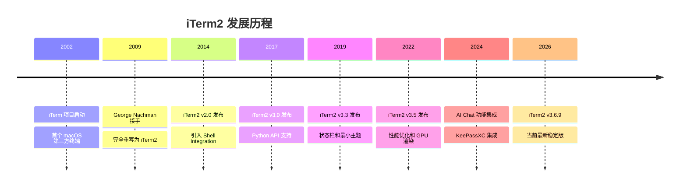
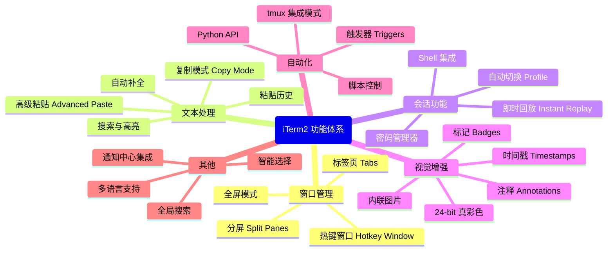
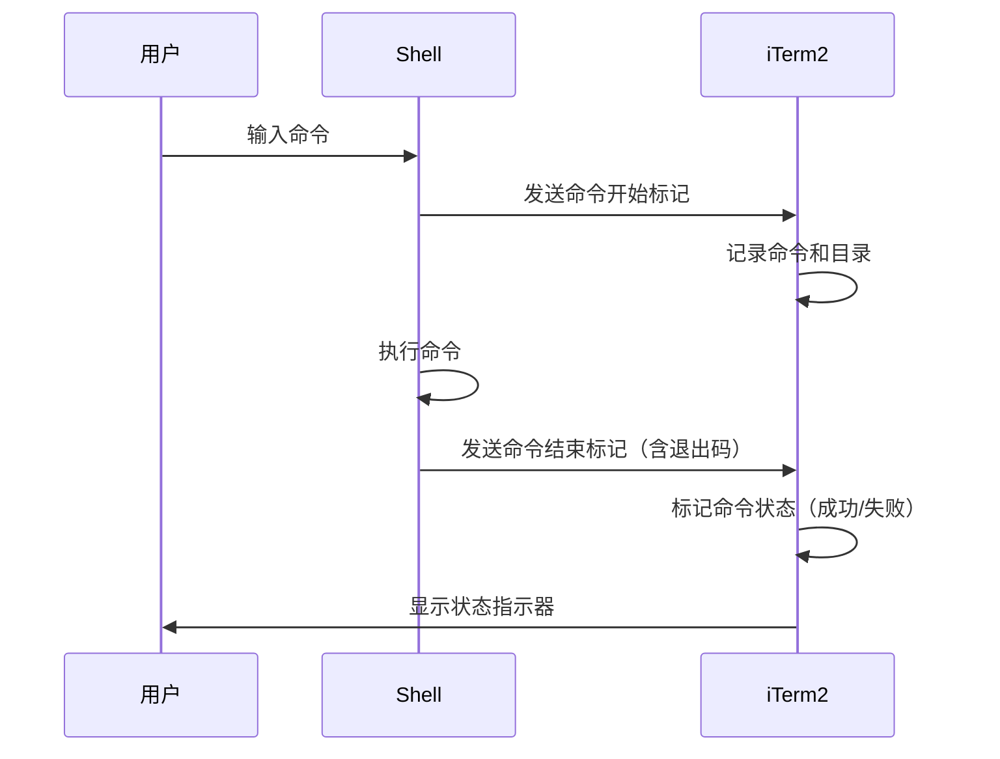
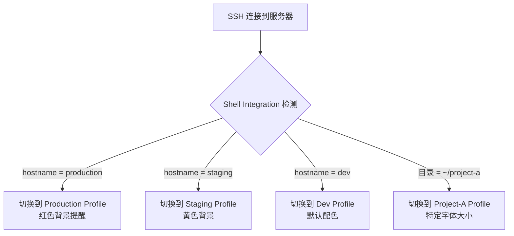
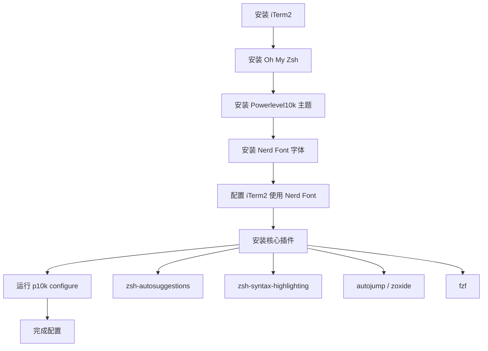
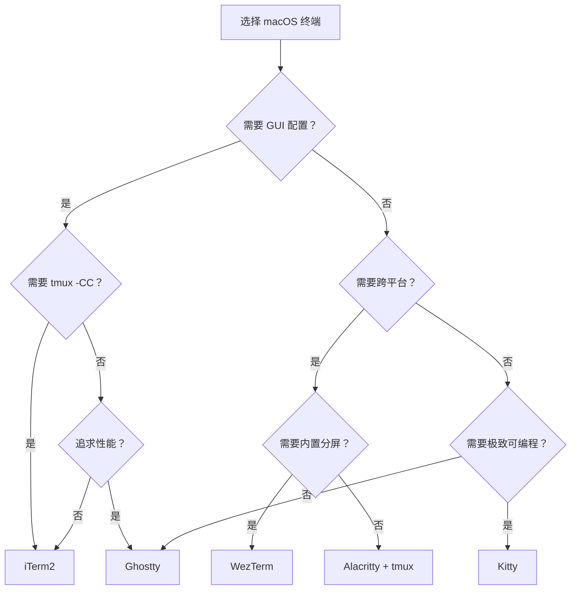
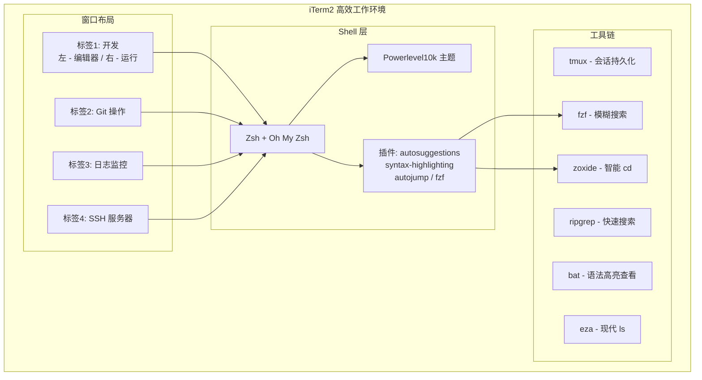

## iTerm2 使用教程

### 一、iTerm2 是什么

iTerm2 是 macOS 平台上最流行的终端模拟器之一，由 George Nachman 开发和维护，使用 Objective-C 编写，基于 GPLv2 协议开源。它作为 macOS 自带 Terminal.app 的替代品，提供了分屏、热键窗口、全局搜索、Shell 集成、触发器、内联图片显示等大量增强功能，深受开发者和运维人员的喜爱。

iTerm2 的前身是 iTerm，最早由 Fabian（网名 Ujwal S. Sathyam）于 2002 年创建，目标是为 macOS 提供一个比系统自带终端更强大的终端工具。2009 年 George Nachman 接手项目并进行了完全重写，更名为 iTerm2，引入了现代化的架构和大量新特性。截至 2026 年 3 月，最新稳定版本为 3.6.9，在 GitHub 上拥有约 17K stars。

### 二、产生背景和发展历程

macOS 自带的 Terminal.app 虽然能满足基本的命令行操作需求，但在分屏管理、会话持久化、自动化脚本等方面存在明显不足。iTerm2 的诞生正是为了填补这些空白。



iTerm2 的设计哲学是"功能丰富但不失可配置性"——它提供 GUI 配置界面方便新手入门，同时通过 Python API 和触发器系统满足高级用户的自动化需求。

### 三、功能特性

iTerm2 拥有极为丰富的功能集，以下按类别进行梳理：



#### 核心功能详解

**分屏（Split Panes）**：支持将一个标签页分割为任意数量的面板，横向或纵向排列。非活跃面板会自动变暗，方便快速定位当前活跃区域。

**热键窗口（Hotkey Window）**：注册一个全局热键后，无论当前在任何应用中，都可以一键呼出 iTerm2 终端窗口，类似 Linux 下的 Guake 或 Yakuake 下拉终端。

**Shell 集成（Shell Integration）**：通过在 Shell 配置中注入标记代码，iTerm2 可以追踪每条命令的输入输出、记忆目录历史、在命令提示符之间快速跳转、自动补全历史命令等。

**触发器（Triggers）**：基于正则表达式的文本匹配规则，当终端输出命中规则时可自动执行高亮、发送通知、自动回复、静默处理等动作，非常适合用于监控日志。

**即时回放（Instant Replay）**：允许"时间旅行"回到终端的历史状态，恢复已被清除的文本内容。

**密码管理器**：将密码加密存储在 macOS Keychain 中，安全机制确保密码仅在正确的密码提示处才会输入。

**tmux 控制模式（tmux -CC）**：这是 iTerm2 独有的杀手级功能——将远程 tmux 的窗格和窗口映射为本地的原生标签页和分屏，完全用本地 GUI 操控远程 tmux 会话。

### 四、下载和安装

#### 系统要求

iTerm2 需要 macOS 10.15 (Catalina) 或更高版本。

#### 安装方式

**方式一：通过 Homebrew 安装（推荐）**

```bash
brew install --cask iterm2
```

**方式二：官网下载安装**

前往 https://iterm2.com/downloads.html 下载最新的 .zip 文件，解压后将 iTerm.app 拖入 Applications 文件夹即可。

#### 安装后的流程


#### 更新

iTerm2 内置自动更新机制，默认会在启动时检查新版本。也可以手动检查：菜单栏 iTerm2 → Check for Updates。

#### 卸载

```bash
# 使用 Homebrew 安装的情况
brew uninstall --cask iterm2

# 手动安装的情况，将 app 移到废纸篓
mv /Applications/iTerm.app ~/.Trash/

# 清理配置文件（可选）
mv ~/Library/Preferences/com.googlecode.iterm2.plist ~/.Trash/
mv ~/Library/Application\ Support/iTerm2 ~/.Trash/
```

### 五、配置文件和配置教程

#### 配置文件位置

iTerm2 的配置存储在以下位置：

- 主配置文件：`~/Library/Preferences/com.googlecode.iterm2.plist`
- 动态配置目录：`~/Library/Application Support/iTerm2/DynamicProfiles/`
- Shell Integration 脚本：`~/.iterm2_shell_integration.zsh`

可以在 Preferences → General → Preferences 中设置将配置保存为文件夹，方便用 Git 进行版本管理：

```bash
# 推荐将配置保存到 dotfiles 仓库
mkdir -p ~/.config/iterm2
# 在 Preferences → General → Preferences 中指定该目录
```

#### 基础配置推荐

**1. 外观设置**

打开 Preferences（⌘,）进行配置：

- **Appearance → Theme**：选择 Minimal 或 Compact 获得更大的终端空间
- **Appearance → Tab bar location**：推荐设为 Top 或 Bottom
- **Profiles → Colors**：推荐 Solarized Dark、Dracula 或 One Dark 配色方案
- **Profiles → Text → Font**：推荐使用带 Nerd Font 补丁的等宽字体，如 MesloLGS NF、FiraCode Nerd Font、JetBrains Mono Nerd Font

**2. 窗口设置**

- **Profiles → Window → Columns/Rows**：设为 140×40 获得充足的工作空间
- **Profiles → Window → Style**：Full-Width Top of Screen 适合用作下拉终端
- **General → Window → Native full screen windows**：开启原生全屏支持

**3. 按键设置**

- **Profiles → Keys → Key Mappings**：可以自定义快捷键映射
- **Keys → Hotkey → Show/hide all windows with a system-wide hotkey**：设置全局热键（推荐 ⌥Space）

**4. 高级设置**

- **General → Selection → Applications in terminal may access clipboard**：启用终端应用剪贴板访问
- **Profiles → Terminal → Scrollback lines**：设为 Unlimited 或较大值（如 10000）
- **Profiles → Terminal → Shell Integration**：安装 Shell Integration

#### 导入配色方案

```bash
# 下载并导入 Dracula 配色
cd ~/Downloads
git clone https://github.com/dracula/iterm.git
# 然后在 Preferences → Profiles → Colors → Color Presets → Import 中选择 .itermcolors 文件
```

### 六、使用方法和常用快捷键

#### 窗口与标签管理

| 快捷键 | 功能 |
|--------|------|
| ⌘T | 新建标签页 |
| ⌘W | 关闭当前标签页/面板 |
| ⌘D | 垂直分屏 |
| ⌘⇧D | 水平分屏 |
| ⌘] / ⌘[ | 切换面板 |
| ⌘⌥方向键 | 调整面板大小 |
| ⌘数字 | 切换到对应标签页 |
| ⌘Enter | 全屏切换 |
| ⌘⇧Enter | 最大化当前面板 |

#### 文本编辑与搜索

| 快捷键 | 功能 |
|--------|------|
| ⌘F | 查找 |
| ⌘G / ⌘⇧G | 查找下一个/上一个 |
| ⌘; | 自动补全 |
| ⌘⇧H | 粘贴历史 |
| ⌘⌥V | 高级粘贴 |
| ⌘K | 清屏 |
| ⌃L | 清除滚动缓冲区 |

#### 会话操作

| 快捷键 | 功能 |
|--------|------|
| ⌘⌥B | 即时回放 |
| ⌘⇧; | 打开命令历史 |
| ⌘⌥/ | 最近访问目录 |
| ⌘⇧O | 打开快速搜索（所有标签） |
| ⌘⌥E | 显示所有标签页的视图 |

### 七、实用功能操作

#### 7.1 Shell Integration 安装与使用

Shell Integration 是 iTerm2 最强大的功能之一，安装后可以追踪命令执行状态、记忆目录、快速跳转等。

```bash
# 自动安装（推荐）
curl -L https://iterm2.com/shell_integration/install_shell_integration.sh | bash

# 或在 iTerm2 菜单中选择：Install Shell Integration
```

安装后可使用的增强功能：

- **⌘⇧↑ / ⌘⇧↓**：在命令提示符之间跳转
- **右键菜单**：查看命令历史、访问目录历史
- **命令状态标记**：成功的命令标为蓝色箭头，失败的命令标为红色箭头



#### 7.2 触发器（Triggers）

触发器可以根据终端输出的文本自动执行操作。配置路径：Profiles → Advanced → Triggers → Edit。

常用触发器场景：

- 高亮 ERROR/WARNING 关键词
- SSH 连接时自动输入密码（注意安全风险）
- 监控日志时发送通知
- 自动回复确认提示

触发器支持的动作类型包括：Highlight Text、Run Command、Send Notification、Annotate、Send Text、Run Coprocess 等。

#### 7.3 Profile 与自动切换

iTerm2 的 Profile 系统允许为不同场景定义完全不同的终端配置（字体、配色、快捷键等）。结合 Shell Integration，可以实现基于主机名、用户名或当前目录自动切换 Profile：



配置方式：在 Profiles → Advanced → Automatic Profile Switching 中添加规则。

#### 7.4 内联图片显示

iTerm2 支持直接在终端中显示图片（包括 GIF 动图），使用 `imgcat` 命令：

```bash
# 安装 Shell Integration 后自动获得 imgcat 命令
imgcat image.png

# 显示远程图片
curl -s https://example.com/image.png | imgcat

# 指定显示宽度
imgcat --width 40 screenshot.png
```

#### 7.5 密码管理器

通过 Window → Password Manager（快捷键 ⌘⌥F）打开密码管理器，密码存储在 macOS Keychain 中。iTerm2 有安全保护机制，确保密码只会在识别为密码提示符的地方输入，避免误操作。

#### 7.6 即时回放（Instant Replay）

按 ⌘⌥B 进入即时回放模式，使用左右方向键在历史画面中穿梭，可以找回被覆盖或清除的终端内容。按 Esc 退出回放。

### 八、iTerm2 与 Oh My Zsh 配合使用

Oh My Zsh 是一个社区驱动的 Zsh 配置框架，与 iTerm2 配合可以打造极为高效的终端环境。

#### 安装流程



#### 第一步：安装 Oh My Zsh

```bash
sh -c "$(curl -fsSL https://raw.githubusercontent.com/ohmyzsh/ohmyzsh/master/tools/install.sh)"
```

#### 第二步：安装 Powerlevel10k 主题

```bash
git clone --depth=1 https://github.com/romkatv/powerlevel10k.git \
  ${ZSH_CUSTOM:-$HOME/.oh-my-zsh/custom}/themes/powerlevel10k
```

编辑 `~/.zshrc`，设置主题：

```bash
ZSH_THEME="powerlevel10k/powerlevel10k"
```

#### 第三步：安装 Nerd Font

Powerlevel10k 推荐使用 MesloLGS NF 字体：

```bash
brew install --cask font-meslo-lg-nerd-font
```

在 iTerm2 中设置：Preferences → Profiles → Text → Font → 选择 MesloLGS NF。

#### 第四步：安装核心插件

```bash
# zsh-autosuggestions - 基于历史的命令建议
git clone https://github.com/zsh-users/zsh-autosuggestions \
  ${ZSH_CUSTOM:-~/.oh-my-zsh/custom}/plugins/zsh-autosuggestions

# zsh-syntax-highlighting - 实时命令语法高亮
git clone https://github.com/zsh-users/zsh-syntax-highlighting.git \
  ${ZSH_CUSTOM:-~/.oh-my-zsh/custom}/plugins/zsh-syntax-highlighting

# autojump - 智能目录跳转
brew install autojump

# fzf - 模糊搜索
brew install fzf
$(brew --prefix)/opt/fzf/install
```

编辑 `~/.zshrc` 中的 plugins 配置：

```bash
plugins=(
    git
    zsh-autosuggestions
    zsh-syntax-highlighting
    autojump
    fzf
    docker
    kubectl
    z
)
```

#### 第五步：配置 Powerlevel10k

```bash
source ~/.zshrc
# 首次加载会自动启动配置向导，也可手动运行：
p10k configure
```

推荐配置选择：启用所有 Powerline 符号、Unicode 字符集、经典提示风格、启用 Transient Prompt（简化历史命令显示）、启用 Instant Prompt（加速启动）。

#### Oh My Zsh 常用别名

安装 git 插件后自动获得的别名：

| 别名 | 完整命令 | 说明 |
|------|---------|------|
| gst | git status | 查看仓库状态 |
| gaa | git add --all | 添加所有文件 |
| gcmsg | git commit -m | 提交并附消息 |
| gp | git push | 推送 |
| gl | git pull | 拉取 |
| gco | git checkout | 切换分支 |
| gb | git branch | 查看分支 |
| glog | git log --oneline --decorate --graph | 查看图形化日志 |

### 九、iTerm2 与其他终端工具比较

#### 性能对比

| 终端 | 吞吐量（1M 行） | 输入延迟 | 内存占用（8标签） |
|------|-----------------|---------|-----------------|
| Ghostty | 5.1s | ~2ms | 95 MB |
| Kitty | 5.8s | ~3ms | 110 MB |
| Alacritty | 6.2s | ~3ms | 45 MB |
| Warp | 14.2s | ~8ms | 380 MB |
| iTerm2 | 22.1s | ~12ms | 290 MB |

#### 功能对比

| 特性 | iTerm2 | Ghostty | Kitty | Alacritty | Warp |
|------|--------|---------|-------|-----------|------|
| GUI 配置 | 完善 | 无 | 无 | 无 | 有 |
| 分屏 | 原生 | 原生 | 原生 | 需 tmux | 原生 |
| 图片显示 | 自有协议 | Kitty 协议 | Kitty 协议 | 不支持 | 不支持 |
| tmux 集成 | tmux -CC | 无 | 无 | 无 | 无 |
| 脚本 API | Python | 无 | Python (Kittens) | 无 | 无 |
| 跨平台 | 仅 macOS | 仅 macOS/Linux | macOS/Linux | 全平台 | 全平台 |
| AI 功能 | AI Chat | 无 | 无 | 无 | 深度集成 |
| 开源协议 | GPLv2 | MIT | GPLv3 | Apache 2.0 | 闭源 |

#### iTerm2 的独特优势

尽管 iTerm2 在性能基准测试中不是最快的，但它具有几个竞品无法替代的优势：

1. **tmux 控制模式（tmux -CC）**：唯一能将远程 tmux 会话映射为本地原生窗口的终端
2. **完善的 GUI 配置**：31 个设置面板，新手友好，无需手写配置文件
3. **Profile 系统**：支持标签分类和自动切换的多配置管理
4. **Python API**：功能完整的脚本接口，支持创建自定义工具栏组件
5. **生态成熟**：十余年的社区积累，文档丰富，问题解答充足

#### 选型建议



### 十、基于 iTerm2 打造高效终端实践

#### 10.1 高效工作环境架构



#### 10.2 推荐工具链安装

```bash
# 安装现代命令行工具
brew install ripgrep bat eza zoxide fd fzf tldr httpie jq yq

# 在 ~/.zshrc 中添加别名
alias ls="eza --icons"
alias ll="eza -la --icons --git"
alias cat="bat --style=auto"
alias find="fd"

# 配置 zoxide 替代 cd
eval "$(zoxide init zsh)"
```

#### 10.3 Profile 分组管理策略

建议按使用场景创建以下 Profile：

- **Default**：日常本地开发，深色主题
- **Production**：生产环境 SSH，红色边框/背景作为警告
- **Staging**：测试环境，黄色标识
- **Presentation**：演示模式，大字体、浅色背景
- **Pair Programming**：结对编程时使用，字体加大

#### 10.4 自定义触发器实战

为日志监控创建实用触发器：

```
# 在 Profiles → Advanced → Triggers 中添加：
正则: ERROR|FATAL|CRITICAL
动作: Highlight Text (红色背景)

正则: WARN|WARNING  
动作: Highlight Text (黄色背景)

正则: Connection refused|timeout
动作: Post Notification

正则: Build SUCCESS
动作: Post Notification + Bounce Dock Icon
```

### 十一、优雅使用 Demo Case

#### Case 1：多服务器日志同时监控

```bash
# 使用 iTerm2 分屏同时监控多台服务器
# 方法：创建一个 Shell 脚本配合 iTerm2 的 AppleScript/Python API

# 1. 垂直分成两列（⌘D）
# 2. 每列再水平分割（⌘⇧D）
# 3. 每个面板 SSH 到不同服务器并 tail 日志
# 4. 配合触发器高亮关键错误
```

#### Case 2：使用 imgcat 进行终端内图片预览

```bash
# 快速预览当前目录图片
for img in *.png; do
    echo "=== $img ==="
    imgcat --width 30 "$img"
done

# 显示 Git diff 的图片变更
git diff --name-only | grep -E '\.(png|jpg|gif)$' | while read f; do
    echo "Changed: $f"
    imgcat --width 40 "$f"
done
```

#### Case 3：tmux -CC 远程开发

```bash
# 在远程服务器上启动 tmux 会话
ssh myserver -t "tmux -CC new-session -A -s work"

# iTerm2 会自动将 tmux 的窗格映射为本地面板
# 所有 iTerm2 的快捷键（⌘D 分屏等）直接操控远程 tmux
# 断线重连后会话完整恢复
```

#### Case 4：基于 Python API 的自动化

```python
#!/usr/bin/env python3
"""使用 iTerm2 Python API 创建标准开发布局"""
import iterm2

async def main(connection):
    app = await iterm2.async_get_app(connection)
    window = app.current_terminal_window
    
    if window is not None:
        # 创建标准三面板布局
        tab = window.current_tab
        session = tab.current_session
        
        # 右侧分屏用于运行服务
        right = await session.async_split_pane(vertical=True)
        await right.async_send_text("npm run dev\n")
        
        # 底部面板用于 Git
        bottom = await session.async_split_pane(vertical=False)
        await bottom.async_send_text("git status\n")

iterm2.run_until_complete(main)
```

### 十二、奇淫巧技

**1. 使用正则表达式搜索**：在 ⌘F 搜索框中勾选正则模式，可以使用 `\d{4}-\d{2}-\d{2}` 匹配日期格式等。

**2. 选中即复制**：Preferences → General → Selection → 勾选 "Copy to pasteboard on selection"，选中文本自动复制到剪贴板。

**3. 路径智能点击**：按住 ⌘ 点击文件路径可直接打开文件；点击 URL 在浏览器中打开。

**4. 快速目录切换**：使用 ⌘⌥/ 打开最近目录列表，无需手动 cd。

**5. 广播输入**：Shell → Broadcast Input to All Panes in Current Tab，在所有面板中同时输入相同命令，适合多服务器批量操作。

**6. 标记与跳转**：⌘⇧M 设置标记，⌘⇧J 跳回标记位置，适合在长输出中定位关键位置。

**7. 触发器实现彩色日志**：为 INFO、WARN、ERROR 设置不同颜色的触发器，让日志输出一目了然。

**8. Badge 显示上下文信息**：在 Profile → General → Badge 中设置 `\(user)@\(hostname):\(path)`，终端右上角始终显示当前环境信息。

**9. 快速恢复会话**：使用 Window → Restore Window Arrangement 恢复之前保存的窗口布局（通过 Window → Save Window Arrangement 保存）。

**10. 语义化历史**：结合 Shell Integration，使用 ⌘⇧; 可以看到完整的命令历史，包含执行时间和状态。

### 十三、总结

iTerm2 作为 macOS 上历史最悠久、功能最全面的终端模拟器，虽然在纯性能指标上不及 Ghostty、Kitty 等新兴终端，但凭借其完善的 GUI 配置界面、独有的 tmux 控制模式、强大的 Python API、成熟的 Profile 管理和 Shell Integration 系统，依然是需要"开箱即用"且功能丰富的用户的首选。

对于日常开发工作，iTerm2 配合 Oh My Zsh + Powerlevel10k + 核心插件的组合已经成为 macOS 开发者的事实标准方案。如果你追求极致性能或更现代的架构，可以关注 Ghostty（性能最佳、原生 Metal 渲染）或 Kitty（Kittens 扩展系统），但 iTerm2 的综合体验和易用性在可预见的未来仍难以被完全替代。

### 参考文档

- [iTerm2 官网](https://iterm2.com/)
- [iTerm2 Features 页面](https://iterm2.com/features.html)
- [iTerm2 GitHub 仓库](https://github.com/gnachman/iterm2)
- [iTerm2 Shell Integration 文档](https://iterm2.com/3.5/documentation-shell-integration.html)
- [iTerm2 Triggers 文档](https://iterm2.com/3.1/documentation-triggers.html)
- [iTerm2 Badges 文档](https://iterm2.com/3.3/documentation-badges.html)
- [Supercharge Your Mac Terminal: iTerm2 + Oh My Zsh + Powerlevel10k (dev.to)](https://dev.to/gabriel_perez_337aabb5cfd/supercharge-your-mac-terminal-a-step-by-step-guide-to-iterm2-oh-my-zsh-powerlevel10k-41am)
- [Setting Up Terminal for Development on MacOS (2025)](https://railsdrop.com/2025/02/03/setting-up-terminal-for-development-on-macbook-updated-2025/)
- [Best Terminal for Mac in 2026 (vibehackers.io)](https://vibehackers.io/blog/best-terminal-for-mac)
- [Choosing a Terminal on macOS 2025: iTerm2 vs Ghostty vs WezTerm vs Kitty vs Alacritty (Medium)](https://medium.com/codecodecode/choosing-a-terminal-on-macos-2025-iterm2-vs-ghostty-vs-wezterm-vs-kitty-vs-alacritty-d6a5e42fd8b3)
- [iTerm2 vs Alacritty vs Kitty (Reddit)](https://www.reddit.com/r/macapps/comments/1djs2up/iterm2_vs_alacritty_vs_kitty_which_is_best_for_my/)
- [iTerm2安装配置使用指南 (知乎)](https://zhuanlan.zhihu.com/p/550022490)
- [终端效率提升神器：iTerm2 的进阶技巧分享 (知乎)](https://zhuanlan.zhihu.com/p/706878184)
- [iTerm2 + Oh My Zsh 打造舒适终端体验 (GitHub)](https://github.com/sirius1024/iterm2-with-oh-my-zsh)
