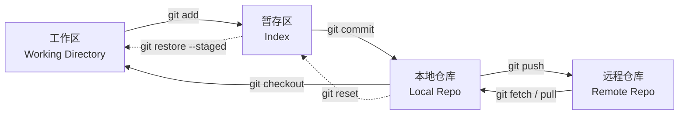
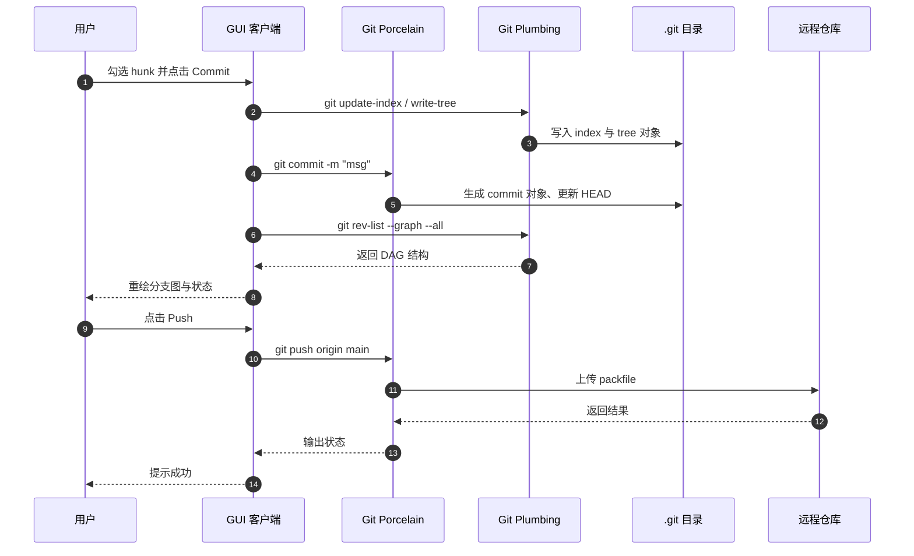
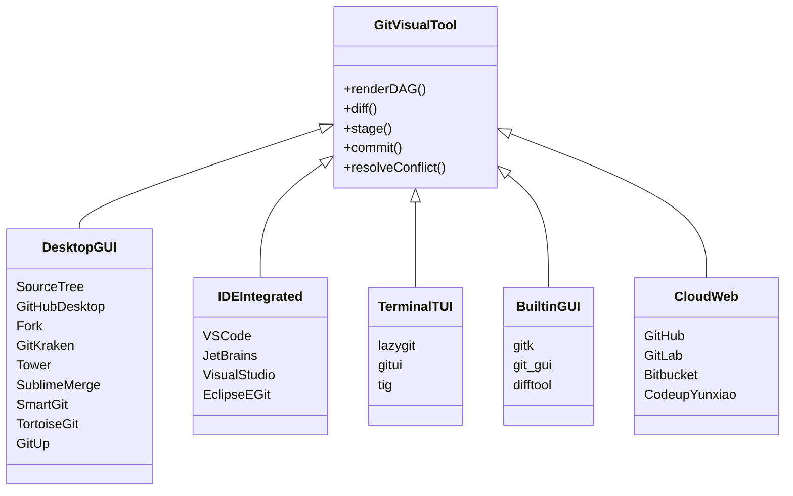
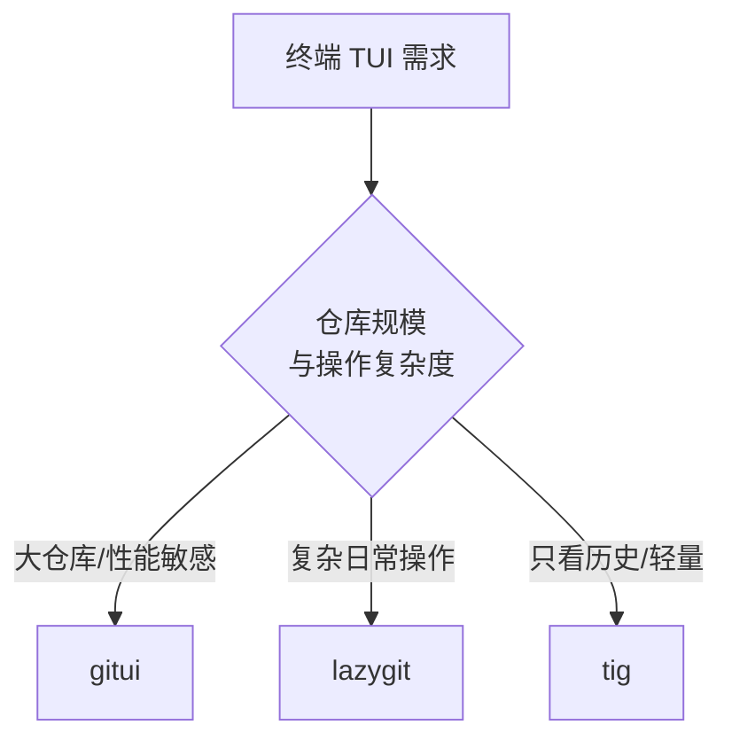
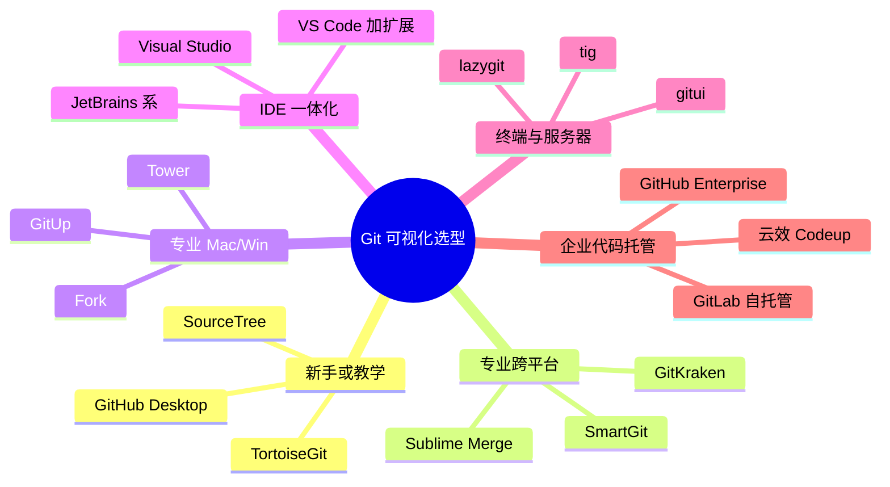

## 有哪些好用的 Git 可视化工具

在日常研发中，Git 早已从"版本控制工具"演化为团队协作的核心基础设施。命令行虽是 Git 最完整的形态，但当分支交织、冲突频发、历史考古时，一个称手的图形化工具往往能显著减少心智负担。本文从 Git 基础、可视化的必要性、原理，到主流桌面客户端、编辑器/IDE 内置、终端 TUI、云端图形化平台做一次系统盘点，并给出选型建议。

---

### 一、Git 是什么

Git 是由 Linus Torvalds 在 2005 年为 Linux 内核开发的**分布式版本控制系统（DVCS）**。与 SVN、CVS 这类集中式系统不同，Git 在每个开发者本地都保留一份完整仓库（包括全部历史与对象），从而支持离线提交、快速分支、廉价合并。

Git 的核心心智模型可以简化为四个区域：**工作区（Working Directory）**、**暂存区（Index / Staging Area）**、**本地仓库（Local Repository）**、**远程仓库（Remote Repository）**。日常操作本质上就是数据在这四个区域之间的搬运。



在对象模型层面，Git 用四种对象组织仓库内容：`blob`（文件内容）、`tree`（目录快照）、`commit`（提交对象，指向 tree 与父 commit）、`tag`（标签）。分支和 HEAD 本质上是指向某个 commit 的引用（`.git/refs`）。理解这一点，就能理解所有 Git 可视化工具其实都在渲染同一张 DAG（有向无环图）。

Git 常见的高频命令可分为几类：
- 仓库管理：`git init`、`git clone`
- 基础流：`git status`、`git add`、`git commit`、`git log`
- 同步：`git fetch`、`git pull`、`git push`
- 分支：`git branch`、`git switch` / `git checkout`、`git merge`、`git rebase`、`git cherry-pick`
- 历史整形：`git reset`、`git revert`、`git stash`、`git commit --amend`、`git rebase -i`
- 排查：`git diff`、`git blame`、`git bisect`、`git reflog`

---

### 二、为什么需要 Git 可视化工具？

命令行是 Git 的"完全形态"，但它有几个天生的痛点：分支拓扑难以在文本中直观呈现；`git add -p`、`git rebase -i` 等交互命令需要记忆语义；冲突需要人工在 `<<<<<<<` 标记里挑拣；`git log --graph` 一旦并行分支多起来就变成 ASCII 迷宫。

图形化工具的价值在于把"抽象的对象模型"变成"可点击的界面"。它并不是要替代命令行，而是在几个特定场景把心智成本压到极低：

| 场景 | 命令行痛点 | 图形化工具优势 |
| --- | --- | --- |
| 理解分支拓扑 | ASCII 图交错难读 | 彩色 DAG，泳道分明 |
| 解决合并冲突 | 手工编辑冲突标记 | 三/四栏 diff，一键选边 |
| 精细化暂存 | `git add -p` 键盘交互 | 逐 hunk、逐行点击暂存 |
| 交互式变基 | 记忆 pick / squash / fixup | 拖拽调序、下拉切换动作 |
| 历史考古 | 组合 `log -S / blame / show` | 行内 blame、文件热力图 |
| 多仓库并行 | 频繁切目录 | 仓库管理器、Worktree 面板 |
| 新手上手 | 概念多、命令碎 | 所见即所得，路径可视 |

Pro Git 官方文档在讨论 GUI 时也强调："没有什么图形界面客户端能做而命令行不能做的事，命令行始终是完全掌控 Git 的地方。" 因此更务实的姿态是"**命令行为主 + 可视化工具辅助**"：把重复的日常操作和拓扑观察交给 GUI，把危险和精巧的操作留给自己在命令行里做。

---

### 三、Git 自带的可视化工具

在安装官方 Git 时，其实就会附送两个基于 Tcl/Tk 的图形程序 `gitk` 与 `git-gui`，以及桥接外部 diff/merge 工具的 `git difftool` / `git mergetool`。它们古朴但足够可靠，很多"重命令行派"开发者只需要它们就够用了。

**gitk — 历史浏览器**。基于 `git log` 和 `git grep`，专门用于查看提交树。启动方式：

```bash
gitk                 # 查看当前分支
gitk --all           # 查看所有引用（含远程分支、tags）
gitk file.py         # 查看某文件的提交历史
```

界面里，点是 commit、线是父子关系，黄点代表 HEAD、红点代表工作区的未提交修改；下窗口是 diff。做版本考古时非常趁手。

**git-gui — 提交制作工具**。启动方式 `git gui`。界面左边分"未暂存 / 已暂存"，右边显示 diff，可以**右键选择 hunk 或单行加入暂存**，然后写 message 提交，支持 `commit --amend`。它是命令行派做"精细化 commit"的常用外挂。

**git difftool / git mergetool — 桥接外部工具**。适合"不想换 GUI，但想用 Meld、Kaleidoscope、Beyond Compare、KDiff3、vimdiff 等专业对比工具"的场景。典型配置：

```bash
git config --global diff.tool meld
git config --global merge.tool meld
git difftool <file>
git mergetool
```

---

### 四、Git 可视化工具的原理

从工程视角看，Git 可视化工具大体分成两类实现：一类是**调用 git 二进制**（下发命令、解析输出），另一类是**直接读取 `.git` 目录**（使用 libgit2、gitoxide 或自研解析器）。前者兼容性最好，后者性能上限更高。

Git 命令本身也分为"面向用户"的 porcelain 命令（`git status`、`git log`、`git commit` 等）和"面向脚本"的 plumbing 命令（`git cat-file`、`git ls-tree`、`git rev-list`、`git update-index`、`git write-tree` 等）。GUI 通常混用二者：porcelain 拿业务结果，plumbing 拿结构化数据用于渲染。

下面这张时序图展示了"用户在 GUI 里点击 Commit"这个动作背后的完整交互链：



在 UI 层，DAG 的绘制通常经历三步：拓扑排序、泳道分配（lane assignment）、样式渲染。这也是 `gitk`、Git Graph、SourceTree、GitKraken 等工具"分支图"组件的共同骨架。至于冲突解决，主流做法是把 base / ours / theirs / result 摆成四栏，允许用户逐块选边或手工合并。

按形态划分，Git 可视化工具大致可以归入五类：



---

### 五、桌面 GUI 客户端

#### 5.1 SourceTree

SourceTree 由 Atlassian 出品，是中文社区讨论度最高的免费 Git 客户端之一，官网 [sourcetreeapp.com](https://www.sourcetreeapp.com/)。**支持 Windows 与 macOS，免费，需注册 Atlassian 账号**。

它把提交、分支、合并、变基、Cherry-pick、Stash、子模块、Git-Flow、Git LFS、远程仓库管理、本地提交搜索等操作都做成了图形化按钮，并且原生集成 Mercurial 与 Bitbucket。对新手非常友好，中文教程也最丰富。

短板同样明显：启动较慢、大仓库性能一般、不支持 Linux。作为"第一款 Git GUI"，它至今仍是很多团队默认的入门推荐。

#### 5.2 GitHub Desktop

GitHub Desktop 是 GitHub 官方出品的开源客户端（MIT License，基于 Electron），官网 [desktop.github.com](https://desktop.github.com/)，**免费，Win/macOS 官方支持，Linux 有社区 fork**。

它主打"极简、上手快"：拖拽添加仓库；图片与代码 diff；对 PR 的检查提示；一键 `Sync` 按钮实际执行的是 `git pull --rebase`，失败后回退到 `git pull --no-rebase`，再 `git push`。适合 GitHub 生态用户和新手，也是很多学校教学 Git 的首选。

缺点是功能面窄，遇到交互式 rebase、hunk 级暂存、Reflog 等场景仍需回到命令行。

#### 5.3 Fork

Fork 是一款轻量高性能的桌面客户端，官网 [git-fork.com](https://git-fork.com/)，**支持 macOS 10.11+ 与 Windows 7+，$59.99 一次买断（提供无限期试用）**。

Fork 在专业用户圈子里口碑极佳：可视化交互式 rebase、内置合并冲突解决器、图片 Diff、Blame、Reflog 恢复、Git-Flow、LFS、子模块、GitHub 通知、GPG 签名。界面精致、快捷键完善，被誉为"最像 macOS 原生"的 Git 客户端之一。

#### 5.4 GitKraken

GitKraken 是主打颜值和跨平台的 Freemium 产品，官网 [gitkraken.com](https://www.gitkraken.com/)，**Windows / macOS / Linux 全平台，Pro 约 $4.08/月起**。

它的 DAG 图渲染是业界最直观的之一，任务面板可以接 GitHub Issues / Jira / GitLab，还内置轻量代码编辑器与冲突解决器。GitKraken 家族还包含 GitLens for VS Code、CLI 版 `gk` 和 Cloud 服务。

需要注意：**免费版 6.5.0 之后不再支持私有仓库**；开源/学生账号可申请免费 Pro。

#### 5.5 Tower

Tower 定位在"专业级 Git 客户端"，官网 [git-tower.com](https://www.git-tower.com/)，**macOS / Windows，Basic $69/年、Pro $99/年，学生免费**。

它以细节著称：拖拽执行 merge / rebase / cherry-pick、⌘+Z 撤销几乎所有 Git 操作、单行级暂存、可视化交互式 rebase、Conflict Wizard、Stacked Branches、Worktrees、AI 生成 commit message、PR 管理、自定义 Workflows。适合每天与 Git 打交道超过 30 分钟的专业开发者与设计师。

#### 5.6 Sublime Merge

Sublime Merge 由 Sublime HQ 打造，官网 [sublimemerge.com](https://www.sublimemerge.com/)，**Win/macOS/Linux 三平台，可无限期免费使用（偶发升级弹窗），完整许可 $99 一次性**。

它的两个杀手锏：一是**极致性能**（自研 Git 读取库 + Sublime 高性能语法高亮），二是**在界面上显示当前每一步实际执行的 git 命令**——这让它在教学与调试场景中价值极高。功能上覆盖逐 hunk / 逐行暂存、字符级 diff、40+ 语言高亮、命令面板、Blame、文件历史、子模块、Git Flow。

#### 5.7 SmartGit

SmartGit 是 syntevo 出品的老牌重量级客户端，官网 [syntevo.com/smartgit](https://www.syntevo.com/smartgit/)，**Windows / macOS / Linux 全平台，个人非商用免费，商用 $99/年或 $229 终身**。

亮点包括：三种窗口布局、清晰的 DAG、Feature Flow + Git Flow、拖放分支、智能冲突解决、Git Notes 作为一等公民、LFS 优化、分布式代码评审、集成 GitHub / GitLab / Bitbucket / Azure DevOps，甚至还兼容 SVN，方便老项目迁移。

#### 5.8 TortoiseGit

TortoiseGit 是 Windows 平台的经典选择，官网 [tortoisegit.org](https://tortoisegit.org/)，**仅 Windows，免费开源**。

它深度集成到 Windows 资源管理器右键菜单，文件图标叠加显示 Git 状态，不需要单独打开 App。对由 TortoiseSVN 迁移过来的团队和非开发人员（如设计师、文档撰稿人）非常友好。缺点是界面停留在传统 Windows 风格，跨平台支持缺失。

#### 5.9 GitUp（macOS）

GitUp 是 Mac 平台上一款免费开源的高性能客户端，官网 [gitup.co](https://gitup.co/)。

它绕开 `git` 二进制，**直接读取 `.git` 数据库**，官方声称"1 秒渲染 4 万次提交图"。界面极简，主打 Live 分支图与实时刷新。对超大仓库的 Mac 用户来说是一个隐藏杀器。

---

### 六、编辑器 / IDE 内置的 Git

#### 6.1 VS Code：内置 Git + 三大扩展

VS Code 内置 Source Control 面板即可完成暂存/提交/推送/拉取/分支切换等日常操作，装订区行内 diff 也很流畅。若要更进一步，主流组合是 **内置 Git + Git Graph + GitLens**。

- **[GitLens](https://marketplace.visualstudio.com/items?itemName=eamodio.gitlens)**：安装量 5000w+，主打行内 blame、CodeLens、悬停提示、文件热力图、交互式 rebase 编辑器、AI 生成 commit message；Pro 版增加 Commit Graph、Worktrees、Visual File History、Code Suggest 等。
- **[Git Graph](https://marketplace.visualstudio.com/items?itemName=mhutchie.git-graph)**：完全免费，装机量 1500w+。渲染 DAG 图非常清晰，且几乎所有 Git 操作都能在图上右键完成，是 VS Code 里最流行的分支图扩展。
- **Git History**：轻量插件，聚焦文件级/行级历史查看。

三款扩展定位不同，可以并存：内置 Git 处理日常提交，Git Graph 看图与操作分支，GitLens 做行内 blame 与历史考古。

| 维度 | 内置 Git | Git Graph | GitLens |
| --- | --- | --- | --- |
| 分支拓扑图 | 弱 | 强 | 有（Pro 更强） |
| 行级 blame | 无 | 无 | 强 |
| 文件历史 | 一般 | 有 | 强 |
| 交互式 rebase | 无 | 部分 | 有 |
| PR/MR 集成 | 无 | 支持创建 | 深度 |
| 是否收费 | 免费 | 免费 | 社区免费 / Pro 收费 |
| 资源占用 | 最低 | 低 | 较高 |

#### 6.2 JetBrains 系（IntelliJ IDEA / WebStorm / PyCharm / GoLand …）

JetBrains IDE 内置 Git 是"IDE 一体化"体验的天花板之一：VCS 微件切换/新建分支、`Alt+9` 打开 Log 面板、`Alt+0` 提交面板支持部分暂存、`Ctrl+D` 装订区 diff、`Ctrl+K` 提交、`Ctrl+Shift+K` 推送，未推送 commit 可一键撤销。三栏冲突解决器 UI 常年被评为业界一流，另外还有 **Local History** 提供不依赖 Git 的本地版本快照。适合 Java / Kotlin / Python / Go / 前端等使用 JetBrains 全家桶的团队。

#### 6.3 Visual Studio / Eclipse EGit

Visual Studio（Windows / macOS，社区版免费）通过 Team Explorer 与 Git Changes 面板，与 GitHub、Azure DevOps 深度集成，是 .NET 与 Unity 团队的默认选择。Eclipse EGit 则是 Java 传统项目里常见的 Git 插件，跨平台免费，适合 Eclipse 老用户。

---

### 七、终端 / TUI 类工具

对喜欢终端的开发者，或需要 SSH 到远端服务器操作仓库的场景，TUI 类工具是极高效的选择。

**[lazygit](https://github.com/jesseduffield/lazygit)** 是 Go 编写的 TUI，Star 数 8w+，MIT 协议，全平台可用。它把"交互式 rebase / hunk 暂存 / cherry-pick / bisect / worktree / GitHub PR"等复杂操作全部键位化：空格暂存、`i` 进入交互式 rebase、`s` squash、`f` fixup、`d` drop、`z/shift+z` 撤销/重做。学会之后，终端里也能拥有堪比 GUI 的操作密度。

**[gitui](https://github.com/extrawurst/gitui)** 是 Rust 版 TUI，基于 gitoxide，主打大仓库性能。官方在 Linux Kernel（90w+ commits）上的实测数据是：gitui 24 秒 / 170MB 内存无卡顿，lazygit 57 秒 / 2.6GB 内存有卡顿。对 monorepo、内存敏感环境是首选。

**[tig](https://jonas.github.io/tig/)** 是 C/ncurses 的老牌 Git 浏览器，最初版本已跑了近二十年。它更偏"看"（`tig`、`tig blame file`、`tig log`、`tig status`、`tig stash`），也能作为 `git log | tig` 的 pager，极轻量，几乎无依赖问题。



---

### 八、云端 / 平台内的图形化 Git

除了本地客户端，代码托管平台自身的 Web 端也是"图形化 Git"的重要形态：GitHub、GitLab、Bitbucket、Gitee、Azure Repos 都提供 Web PR/MR、diff、评审、CI 状态展示等能力。

在国内企业场景中，**阿里云云效 Codeup** 是一个值得单独提及的方案，[图形化 Git 官方文档](https://help.aliyun.com/zh/yunxiao/user-guide/graphical-git) 有系统说明：

- Git 代码托管、多副本高可用，一键从 Git/SVN 导入历史；
- Web 图形化 diff、代码评审、内联评论；冲突检测后可在 **WebIDE 图形化解决冲突**；
- 自动化检测：敏感信息、代码规约、编码安全、依赖漏洞；
- 精细化权限、IP 白名单、审计、等保 2.0 三级 / ISO 27001 认证；
- 研发效能可视化报表；无缝对接云效项目协作与 CI/CD 流水线。

云效同样在文档中推荐搭配 TortoiseGit、SourceTree、Git GUI、Gitk、Eclipse EGit、IntelliJ IDEA 内置 Git 插件等桌面客户端使用——这恰好印证了本文强调的"命令行 / 桌面 GUI / 云端 Web"三层协作的实际工作方式。

---

### 九、纵览对比与选型建议

综合来看，Git 可视化工具的选择维度主要是：**平台支持、免费/付费边界、专业深度、生态集成**。

| 工具 | 平台 | 收费 | 特色 | 适用 |
| --- | --- | --- | --- | --- |
| SourceTree | Win/Mac | 免费 | Atlassian 生态、教程多 | 新手、Bitbucket 用户 |
| GitHub Desktop | Win/Mac | 免费开源 | 极简、GitHub 集成 | GitHub 用户、教学 |
| Fork | Win/Mac | $59.99 买断 | 性能强、交互式 rebase | 专业 Mac/Win 用户 |
| GitKraken | Win/Mac/Linux | Freemium | 高颜值、跨平台一致 | 跨平台、开源项目 |
| Tower | Win/Mac | $69–$99/年 | 拖放、⌘+Z 撤销、AI commit | 专业开发者、企业 |
| Sublime Merge | Win/Mac/Linux | 免费用/$99 买断 | 极速、显示底层命令 | Sublime 用户 |
| SmartGit | Win/Mac/Linux | 非商用免费 | 功能最全、支持 SVN | 高级用户、跨平台 |
| TortoiseGit | Win | 免费开源 | 资源管理器右键集成 | Windows 传统团队 |
| GitUp | Mac | 免费开源 | 直接读 .git、极速 | Mac 大仓库 |
| JetBrains IDE | Win/Mac/Linux | 社区免费 | IDE 一体化、冲突体验一流 | JVM / Py / Go / 前端 |
| VS Code + 扩展 | Win/Mac/Linux | 大多免费 | 灵活组合、生态丰富 | 通用开发者 |
| lazygit | 全平台 | 免费开源 | 键盘化 GUI 体验 | 终端流开发者 |
| gitui | 全平台 | 免费开源 | 大仓库极速 | monorepo、性能敏感 |
| tig | 全平台 | 免费开源 | 轻量 pager | SSH / 服务器 |
| 云效 Codeup | Web | 基础免费 | 一站式 DevOps、合规 | 国内企业 |

选型时可以按角色和场景快速定位：



个人的经验心得是：**任何一款 GUI 都不足以覆盖所有场景**。比较健康的组合是"一款主力桌面客户端 + IDE 内置 Git + 一个终端 TUI + 平台 Web 端"。例如：Mac 用户可以 Fork/GitUp 主力 + JetBrains 内置 + lazygit + GitHub Web；Windows 团队则常见 SourceTree/TortoiseGit + VS Code 扩展 + 云效 Web。

---

### 十、总结

Git 可视化工具的本质是把"抽象的对象模型和 DAG"翻译成"可以点、可以拖、可以看的界面"。它们不改变 Git 的能力上限——命令行才是——但可以显著降低日常操作的心智成本，尤其是在分支拓扑观察、冲突解决、精细化提交、历史考古这几个场景。

选择时不必执念于"哪个最好"，而应结合平台、预算、团队生态与个人习惯挑选。真正重要的是：**理解 Git 的对象模型、区分命令行与 GUI 的分工、把危险操作留给自己而不是工具**。当你能同时看懂 `gitk` 的黄点和 GitKraken 的彩色 DAG，说明你已经掌握了 Git 的图形化思维。

---

### 参考文档

- [程序员必备！10 款实用便捷的 Git 可视化管理工具 — 腾讯云开发者社区](https://cloud.tencent.com/developer/article/2384103)
- [推荐几款好用的 Git 图形化客户端 — 掘金](https://juejin.cn/post/7143527263240192031)
- [Any sort of visualizer for git? — Reddit r/git](https://www.reddit.com/r/git/comments/1cluh9n/any_sort_of_visualizer_for_git/)
- [图形化 Git 代码版本控制管理 — 云效帮助中心](https://help.aliyun.com/zh/yunxiao/user-guide/graphical-git)
- [分享 3 款 Git 可视化工具 — 知乎](https://zhuanlan.zhihu.com/p/461552490)
- [Modules-Learn · Git 可视化工具 — GitHub](https://github.com/wanZzz6/Modules-Learn/blob/master/Git/Git%E5%8F%AF%E8%A7%86%E5%8C%96%E5%B7%A5%E5%85%B7.md)
- [五款超好用、高颜值的 Git 可视化工具 — 51CTO](https://www.51cto.com/article/781370.html)
- [全网最全面 VS Code 使用 Git 可视化管理源代码详细教程 — 微信公众号](https://mp.weixin.qq.com/s?__biz=MzIxMTUzNzM5Ng==&mid=2247490645&idx=1&sn=941fc8a0f97e4e468a315ed0bd0f0cf5)
- [Pro Git 附录 A · 在其它环境中使用 Git 图形界面](https://git-scm.com/book/zh/v2/%E9%99%84%E5%BD%95-A:-%E5%9C%A8%E5%85%B6%E5%AE%83%E7%8E%AF%E5%A2%83%E4%B8%AD%E4%BD%BF%E7%94%A8-Git-%E5%9B%BE%E5%BD%A2%E7%95%8C%E9%9D%A2)
- [git-difftool 官方文档](https://git-scm.com/docs/git-difftool)
- [SourceTree 官网](https://www.sourcetreeapp.com/)
- [GitHub Desktop 官网](https://desktop.github.com/)
- [Fork 官网](https://git-fork.com/)
- [GitKraken 官网](https://www.gitkraken.com/)
- [Tower 官网](https://www.git-tower.com/)
- [Sublime Merge 官网](https://www.sublimemerge.com/)
- [SmartGit 官网](https://www.syntevo.com/smartgit/)
- [TortoiseGit 官网](https://tortoisegit.org/)
- [GitUp 官网](https://gitup.co/)
- [GitLens · VS Code Marketplace](https://marketplace.visualstudio.com/items?itemName=eamodio.gitlens)
- [Git Graph · VS Code Marketplace](https://marketplace.visualstudio.com/items?itemName=mhutchie.git-graph)
- [lazygit · GitHub](https://github.com/jesseduffield/lazygit)
- [gitui · GitHub](https://github.com/extrawurst/gitui)
- [tig 官网](https://jonas.github.io/tig/)
- [在 IntelliJ IDEA 中开始使用 Git — JetBrains 官方](https://www.jetbrains.com/zh-cn/help/idea/working-with-git-tutorial.html)
